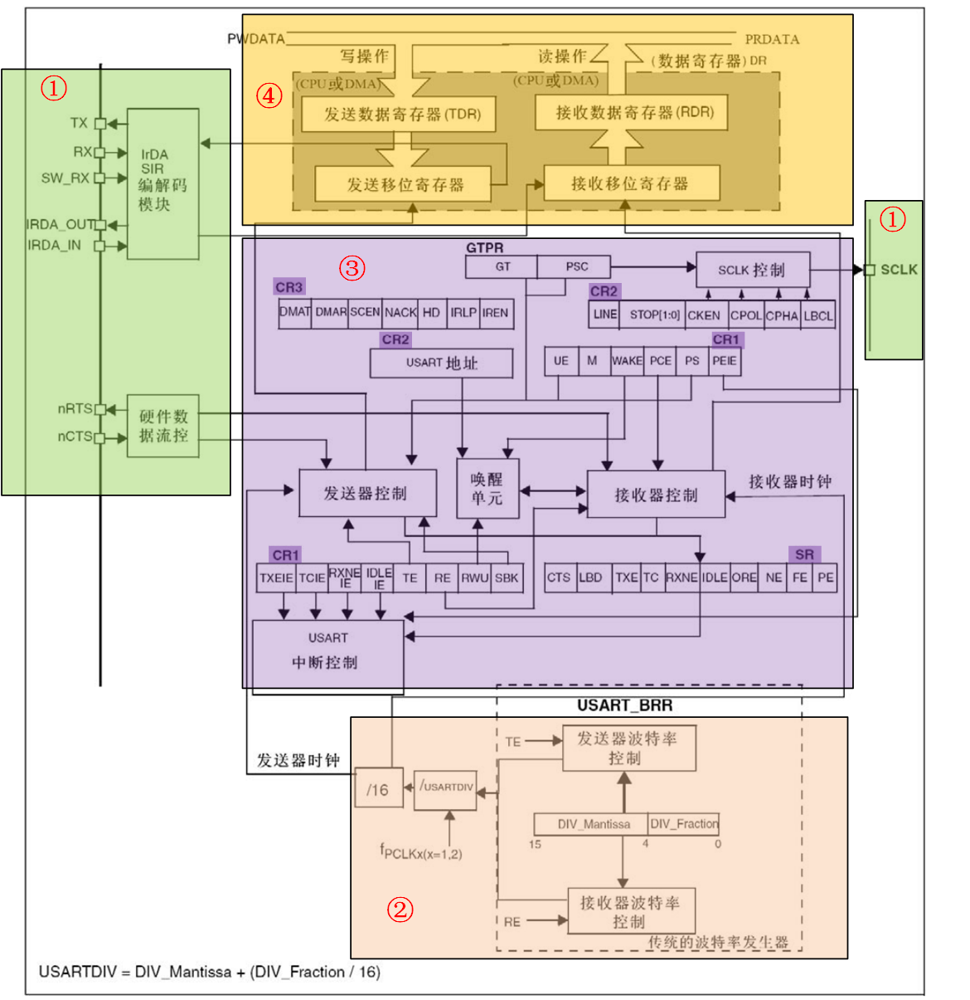
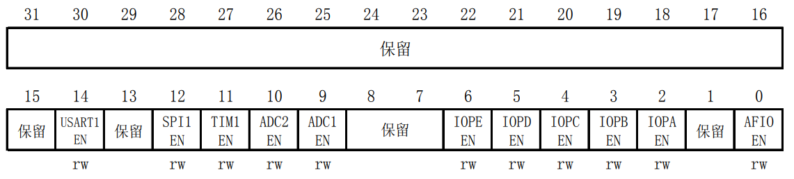
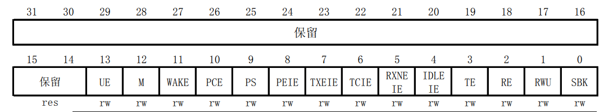
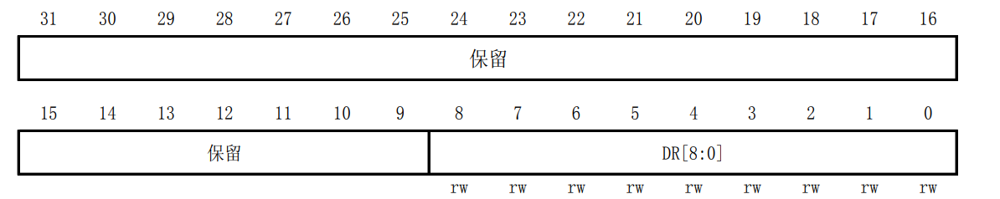
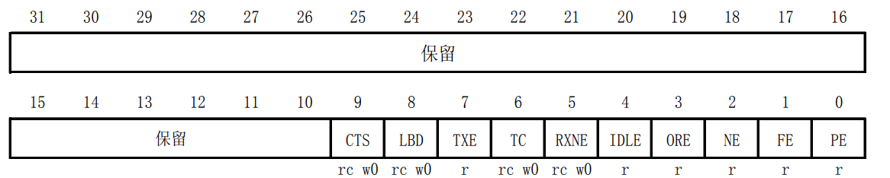

<!-- more -->


## 一、STM32的串口

### 1. 概述

在嵌入式中，很多MCU和外设模块都集成有UART外设。 STM32F103有3个通用同步异步收发器（ Universal synchronous asynchronous receiver transmitter， USART）， 2个通用异步收发器（ Universalasynchronous receiver transmitter， UART） 。 USART和UART的主要区别在于， USART支持同步通信， 该模式有一根时钟线提供时钟。这里需要说明一下，由于在STM中文或者是英文参考手册，相关的介绍章节主要是关于USART，但是他们都是通用的，所以笔记中也都用USART了。

串口在嵌入式中经常使用， 一般使用UART就足够了， 常见的用途如下：

（1）作为调试口， 打印程序运行的状态信息；

（2）连接串口接口的模块（比如GPS模块），传输数据；

（3）通过电平转换芯片变为RS232/RS485电平，连接工控设备；  

### 2. USART的各种模式

这一部分我们可以查看 [STM32中文参考手册](https://www.stmcu.com.cn/Designresource/detail/localization_document%20/710001)的 25.5 USART模式配置  一节：

| USART模式            | USART1/2/3 | UART4  | UART5  |
| -------------------- | ---------- | ------ | ------ |
| 异步模式             | 支持       | 支持   | 支持   |
| 硬件流控制(CTS/RTS)  | 支持       | 不支持 | 不支持 |
| 多缓存通信(DMA)      | 支持       | 支持   | 不支持 |
| 多处理器通信         | 支持       | 支持   | 支持   |
| 同步通信             | 支持       | 不支持 | 不支持 |
| 智能卡（ Smartcard） | 支持       | 不支持 | 不支持 |
| 半双工（单线模式）   | 支持       | 支持   | 支持   |
| IrDA(红外线)         | 支持       | 支持   | 支持   |
| LIN(域互连网络)      | 支持       | 支持   | 支持   |

### 3. USART内部结构

关于内部结构，我们可以查看 [STM32中文参考手册](https://www.stmcu.com.cn/Designresource/detail/localization_document%20/710001)的 25.3 USART功能概述  ：



#### 3.1 USART引脚

内部结构图中的序号①，包含了USART的相关引脚：

（1）TX：数据发送；

（2）RX：数据接收；

（3）SW_RX： 在单线和智能卡模式下接收数据， 属于内部引脚，没有具体外部引脚；

（4）nRTS： 在硬件流控制时， 用于指示本设备准备好可接收数据， 低电平说明本设备可以接收数据；  

（5）nCTS：在硬件流控制时， 用于指示本设备准备好可发送数据， 低电平说明本设备可以发送数据；若是高电平，在当前数据传输结束时阻断下一次的数据发送。  

（6）SCLK：有些图中直接标为CK，发送器时钟输出。在同步模式时，用于输出时钟， (在Start位和Stop位上没有时钟脉冲，软件可选地，可以在最后一个数据位送出一个时钟脉冲)。数据可以在RX上同步被接收。这可以用来控制带有移位寄存器的外部设备(例如LCD驱动器)。时钟相位和极性都是软件可编程的。在智能卡模式里， CK可以为智能卡提供时钟。  

#### 3.2 波特率发生器

内部结构图中的序号②，是USART的波特率发生器，我们通过设置USART_BRR寄存器的值，实现串口通信数据传输速率的设置。 由 [STM32中文参考手册](https://www.stmcu.com.cn/Designresource/detail/localization_document%20/710001) 的 25.3.4 分数波特率的产生 一节可知计算公式为：  
$$
Tx/Rx 波特率 = \frac{f_{PCLK}}{16·USARTDIV}
$$
“$f_{PCLK}$”为该外设USART的时钟频率，“ USARTDIV”为USART_BRR寄存器的值。USARTDIV是一个无符号的定点数。需要注意的是在写入USART_BRR之后，波特率计数器会被波特率寄存器的新值替换。因此，**不要在通信进行中改变波特率寄存器的数值**。    

假设所需波特率为115200，当前USART时钟为72MHz，则USARTDIV=72000000/(115200\*16)=39.0625。USART_BRR寄存器使用高12位[15:4]存放整数部分， 低4位[3:0]存放小数部分， 小数部分每一位对应1/24=0.0625。 因此，整数39对应16进制为0x27，左移4位为0x270，小数0.0625， 对应0x1，所以我们设置USART_BRR=0x271即可。  

在利用寄存器配置USART的波特率的时候需要依据此公式计算USART_BRR的值，而在HAL库中无需计算， 只需传入所需波特率，自动写USART_BRR寄存器值，但是我们仍然要学习这个波特率的计算公式，也许的开发调试过程中会使用到。  

前面计算波特率需要知道外设时钟“$f_{PCLK}$”的值，USART1挂载APB1上， USART2/3和USART4/5挂载APB2上。 后边学习时钟系统的话，我们会知道 APB1时钟最大为36MHz， APB2时钟最大为72MHz。 因此，只有USART1的波特率计算中的“$f_{PCLK}$”能取最大系统时钟72MHz，而其它的USART/UART只能取36MHz。  

#### 3.3 发送器/接收器控制单元  

通过向控制寄存器CR1、 CR2、 CR3和状态寄存器SR写入相应的位，可实现对USART数据的发送和接收控制。 其中CR1主要用于配置USART的数据位、校验位和中断使能， CR2用于配置USART的停止位和SCLK时钟控制， CR3用于CTS硬件流控制、 DMA多缓冲控制等。通过读取状态寄存器SR的值，可查询USART的状态。  

#### 3.4 数据收发寄存器单元  

该部分主要由发送数据寄存器（ TDR）、发送移位寄存器、接收数据寄存器（ RDR）、接收移位寄存器组成。 发送移位寄存和接收移位寄存器，分别负责将发送数据并串转换和接收数据串并转换，从而实现数据在传输时，是一位一位的发送和接收。  

### 4. 几个相关寄存器

#### 4.1 串口时钟使能

串口作为 STM32 的一个外设，其时钟由外设时钟使能寄存器控制，这里我们使用的串口1是在APB2ENR寄存器的第14位。APB2ENR寄存器在之前已经介绍过了，这里不再介绍。只是说明一点，就是除了串口 1 的时钟使能在 APB2ENR 寄存器，其他串口的时钟使能位都在 APB1ENR 寄存器。

#### 4.2 串口复位  

当外设出现异常的时候可以通过复位寄存器里面的对应位设置，实现该外设的复位，然后重新配置这个外设达到让其重新工作的目的。一般在系统刚开始配置外设的时候，都会先执行复位该外设的操作。 串口 1 的复位是通过配置 APB2RSTR 寄存器的第 14 位来实现的。 APB2RSTR 寄存器的各位描述如图 ：



可知串口 1 的复位设置位在 APB2RSTR 的第 14 位。通过向该位写 1 复位串口 1，写 0 结束复位。其他串口的复位位在 APB1RSTR 里面。

#### 4.3 串口波特率设置  

每个串口都有一个自己独立的波特率寄存器 USART_BRR，通过设置该寄存器就可以达到配置不同波特率的目的。  

#### 4.4 串口控制

STM32 的每个串口都有 3 个控制寄存器 USART_CR1~3，串口的很多配置都是通过这 3 个寄存器来设置的。这里我们只要用到 USART_CR1 就可以实现我们的功能了 ，该寄存器的各位描述如图 ：



该寄存器的高 18 位没有用到，低 14 位用于串口的功能设置。 

（1）UE 为串口使能位，通过该位置 1，以使能串口。 

（2）M 为字长选择位，当该位为 0 的时候设置串口为 8 个字长外加 n 个停止位，停止位的个数（n）是根据 USART_CR2 的[13:12]位设置来决定的，默认为 0。 

（3）PCE 为校验使能位，设置为 0，则禁止校验，否则使能校验。 

（4）PS 为校验位选择，设置为 0 则为偶校验，否则为奇校验。

（5） TXIE 为发送缓冲区空中断使能位，设置该位为 1，当 USART_SR 中的 TXE 位为1 时，将产生串口中断。

（6）TCIE 为发送完成中断使能位，设置该位为 1，当 USART_SR 中的 TC 位为 1 时，将产生串口中断。 

（7）RXNEIE 为接收缓冲区非空中断使能，设置该位为 1，当 USART_SR 中的 ORE 或者 RXNE 位为 1 时，将产生串口中断。 

（8）TE 为发送使能位，设置为 1，将开启串口的发送功能。 

（9）RE 为接收使能位，用法同 TE。  

#### 4.5 数据发送与接收  

STM32 的发送与接收是通过数据寄存器 USART_DR 来实现的，这是一个双寄存器，包含了 TDR 和 RDR。当向该寄存器写数据的时候，串口就会自动发送，当收到数据的时候，也是存在该寄存器内。  



可以看出，虽然是一个 32 位寄存器，但是只用了低 9 位（DR[8： 0]），其他都是保留。DR[8： 0]为串口数据，包含了发送或接收的数据。由于它是由两个寄存器组成的，一个给发送用(TDR)，一个给接收用(RDR)，该寄存器兼具读和写的功能。 TDR 寄存器提供了内部总线和输出移位寄存器之间的并行接口。 RDR 寄存器提供了输入移位寄存器和内部总线之间的并行接口。

当使能校验位(USART_CR1 中 PCE 位被置位)进行发送时，写到 MSB 的值(根据数据的长度不同， MSB 是第 7 位或者第 8 位)会被后来的校验位取代。当使能校验位进行接收时，读到的 MSB 位是接收到的校验位。  

#### 4.6 串口状态  

串口的状态可以通过状态寄存器 USART_SR 读取。 USART_SR 的各位描述如图 ：



这里我们关注一下两个位，第 5、 6 位 RXNE 和 TC：

（1）RXNE（读数据寄存器非空），当该位被置 1 的时候，就是提示已经有数据被接收到了，并且可以读出来了。这时候我们要做的就是尽快去读取 USART_DR，通过读 USART_DR 可以将该位清零，也可以向该位写 0，直接清除。

（2）TC（发送完成），当该位被置位的时候，表示 USART_DR 内的数据已经被发送完成了。如果设置了这个位的中断，则会产生中断。该位也有两种清零方式： 1）读 USART_SR，写USART_DR。 2）直接向该位写 0。  

### 5. 串口设置一般步骤

（1）串口时钟使能， GPIO 时钟使能。

（2）设置引脚复用器映射：调用 GPIO_PinAFConfig 函数。

（3）GPIO 初始化设置：要设置模式为复用功能。

（4）串口参数初始化：设置波特率，字长，奇偶校验等参数。

（5）开启中断并且初始化 NVIC，使能中断（如果需要开启中断才需要这个步骤）。

（6）使能串口。

（7）编写中断处理函数：函数名格式为 USARTxIRQHandler(x 对应串口号)。  

## 二、HAL库函数分析

### 1. USART_InitTypeDef  

```c
typedef struct {
    uint32_t BaudRate;   // 波特率
    uint32_t WordLength; // 字长
    uint32_t StopBits;   // 停止位
    uint32_t Parity;     // 校验位
    uint32_t Mode;       // UART 模式
    uint32_t HwFlowCtl;  // 硬件流控制
    uint32_t OverSampling; // 过采样模式
    //uint32_t CLKLastBit;   // 最尾位时钟脉冲，新版本HAL库的这个成员好像没见了
} USART_InitTypeDef;
```

（1）BaudRate：波特率设置。一般设置为 2400、 9600、 19200、 115200。 HAL 库函数会根据设定值计算得到 UARTDIV 值，见公式 20‑1，并设置 UART_BRR 寄存器值。

（2）WordLength：数据帧字长，可选 8 位或 9 位。它设定 UART_CR1 寄存器的 M 位的值。如果没有使能奇偶校验控制，一般使用 8 数据位；如果使能了奇偶校验则一般设置为 9 数据位。

（3）StopBits：停止位设置，可选 0.5 个、 1 个、 1.5 个和 2 个停止位，它设定 USART_CR2 寄存器的STOP[1:0] 位的值，一般我们选择 1 个停止位。

（4）Parity：奇偶校验控制选择，可选 USART_PARITY_NONE (无校验)、 USART_PARITY_EVEN(偶校验) 以及 USART_PARITY_ODD (奇校验)，它设置UART_CR1 寄存器的 PCE 位和 PS位的值。

（5）Mode： UART 模式选择，有 USART_MODE_RX 和 USART_MODE_TX，允许使用逻辑或运算选择两个，它设定 USART_CR1 寄存器的 RE 位和 TE 位。

### 2. 串口接收和发送

```c
HAL_StatusTypeDef HAL_UART_Transmit(UART_HandleTypeDef *huart, uint8_t *pData, uint16_t Size, uint32_t Timeout);
HAL_StatusTypeDef HAL_UART_Receive(UART_HandleTypeDef *huart, uint8_t *pData, uint16_t Size, uint32_t Timeout);
```

  
