<!-- more -->


## 一、串口打印实现

说明，这里使用STM32CubeM进行配置和导出工程。

### 1. 硬件设计

我使用的是正点原子的战舰V3，串口部分电路如下，串口 1 与 USB 串口并没有在 PCB 上连接在一起，需要通过跳线帽来连接一下。这里我们把 P4 的 RXD 和 TXD 用跳线帽与 PA9 和 PA10 连接起来。  

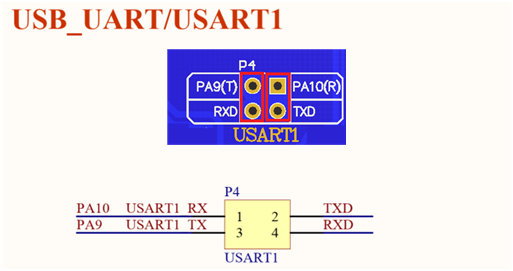

### 2. STM32CubeMX配置

注意这里的时钟都没配置，会默认开启的，这一部分不涉及中断相关内容。

- （1）PA9配置（TXD）

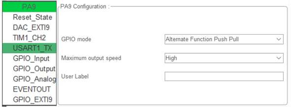

- （2）PA10配置（RXD）

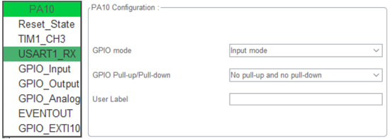

- （3）USART1配置

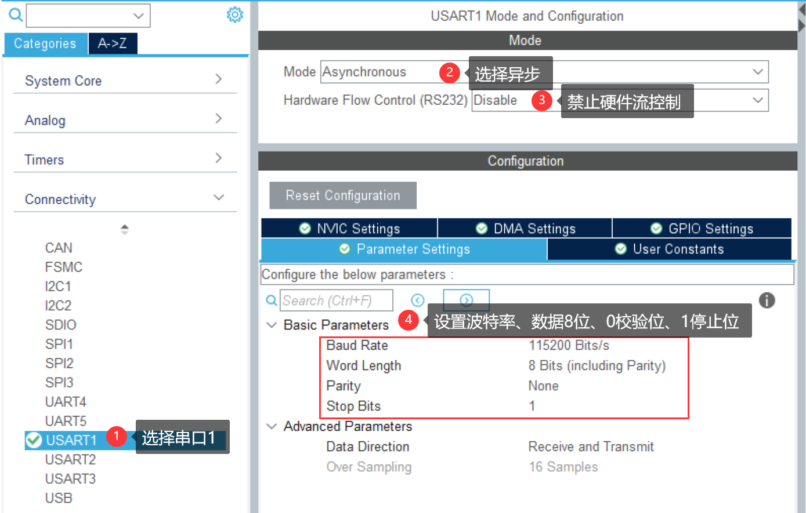

- （4）导出工程即可

### 3. 函数实现

上边只是完成了基础的初始化等功能，具体的接收，发送，库里边有对应的函数，我们自己写一下熟悉一下过程。

#### 3.1 HAL库函数收发数据

HAL库提供了两个函数，让我们可以获取和发送数据，它们定义在 stm32f1xx_hal_uart.c： 

```c
HAL_StatusTypeDef HAL_UART_Transmit(UART_HandleTypeDef *huart, uint8_t *pData, uint16_t Size, uint32_t Timeout);
HAL_StatusTypeDef HAL_UART_Receive(UART_HandleTypeDef *huart, uint8_t *pData, uint16_t Size, uint32_t Timeout);
```

#### 3.2 发送一个字节数据

```c
void Uart_Putchar(uint8_t ch)
{
	while( !(USART1->SR & (1<<6)));  //等待DR为空
	
	USART1->DR = ch;
}
```

#### 3.3 接收一个字节数据

```c
uint8_t Uart_Getchar(void)
{
	while(!(USART1->SR & (1<<5)));  //等待RDR不为空，表示收到数据
	
	return USART1->DR;
}
```

#### 3.4 printf实现

我们在编写C语言的时候，经常使用printf，还可以格式化打印，这是不是很方便呢？我们也可以在STM32中使用printf来调用串口，我们只需要重写下边这个函数就可以啦：

```c
int fputc(int ch, FILE *f);
```

我们重新定义该函数如下：

```c
#include <stdio.h>
#include <string.h>

int fputc(int ch, FILE *f)
{
	while((USART1->SR & (1<<6)) == 0);  //等待DR为空,循环发送,直到发送完毕 
	
    USART1->DR = (uint8_t) ch;
    
	return ch;
}
```

### 4. printf的一个坑

当我们重写了fputc后，只要调用printf函数，程序直接卡死，有两种解决办法，第二种方法中说明了产生这个问题的原因。

#### 4.1 使用微库

在MDK5中点击【options for target】（常见的哪个魔术棒），在【Target】&rarr;【Use MicroLIB】勾选，使用微库。

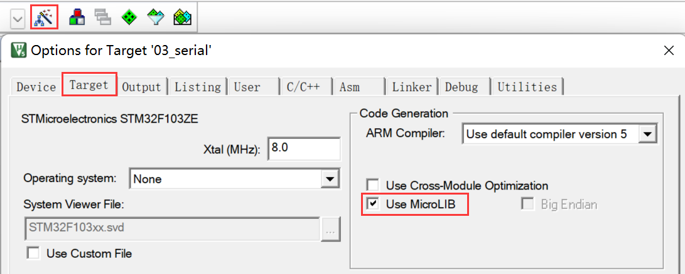

#### 4.2 避免使用半主机模式

##### 4.2.1 半主机模式

半主机是用于 ARM 目标的一种机制，可将来自应用程序代码的输入/输出请求传送至运行调试器的主机。 例如，使用此机制可以启用 C 库中的函数，如 printf() 和 scanf()，来使用主机的屏幕和键盘，而不是在目标系统上配备屏幕和键盘。这种机制很有用，因为开发时使用的硬件通常没有最终系统的所有输入和输出设备。 半主机可让主机来提供这些设备。**简单的来说，半主机模式就是通过仿真器实现开发板在电脑上的输入和输出。和半主机模式功能相同的是ITM调试机制。**

在嵌入式的编程中我们要使用printf、fopen、fclose等函数的，但是因为嵌入式的程序中并没有对这些函数的底层实现，使得设备运行时会进入软件中断BAEB处，这时就需要__use_no_semihosting_swi 这个声明，使程序遇到这些文件操作函数时不停在此中断处。当目标板脱离仿真器（jlink/ulink）单独运行时，**不能使用半主机模式**。否则进入软件中断BAEB处，无法再执行下去，这就导致了卡死问题

##### 4.2.2 关闭半主机模式

```c
#pragma import(__use_no_semihosting)
```

这条语句可以关闭半主机模式，只需要在任意一个C文件中加入即可。还有在使用keil编程的过程中还会遇到以下错误：

```shell
..\OBJ\USART.axf: Error: L6915E: Library reports error: __use_no_semihosting was requested, but _ttywrch was referenced
```

说的大概的意思就是关掉了半主机模式，但是函数\_\_ttywrch被引用了，这时要把函数重写一遍，当然出现其他的函数被要求的时候，可以参考上面的函数进行编写，只要放到任意一个.c源文件之中即可。所以我们可以在任意一个.c文件中添加如下内容：

```c
//加入以下代码,支持printf函数,而不需要选择use MicroLIB	  
#if 1
#include <stdio.h>
#pragma import(__use_no_semihosting)             
//标准库需要的支持函数                 
struct __FILE 
{ 
	int handle; 
}; 

FILE __stdout;       
//定义_sys_exit()以避免使用半主机模式    
void _sys_exit(int x) 
{ 
	x = x; 
} 
#endif 
```

## 二、开启串口中断

前边我们已经知道如何收发数据了，下边我们来看一下串口的中断操作。

### 1. 一般步骤

（1）使能相应的时钟

（2）配置GPIO管脚为串口功能

（3）设置中断优先级

（4）使能相应的中断

（5）实现中断服务程序

### 2. STM32CubeMX中断配置

对于GPIO等的配置，和前边保持一致，我们这里再加上中断的配置即可：

- NVIC配置

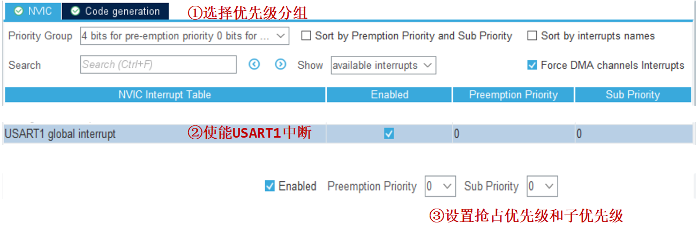

- Code generation

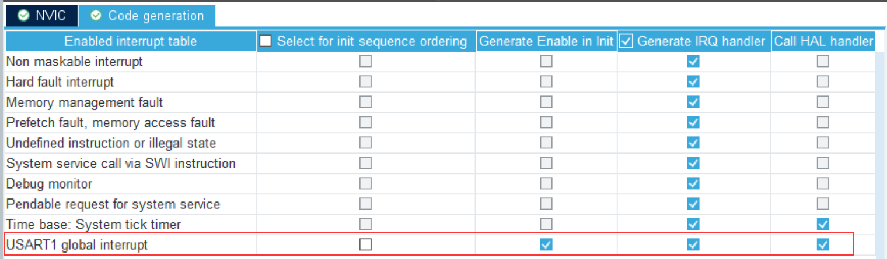

### 3. 编写中断服务函数

我们找到最终的中断服务函数回调函数：

```c
USART1_IRQHandler()--->HAL_UART_IRQHandler()--->UART_Receive_IT()--->HAL_UART_RxCpltCallback()
```

我们只需要在 HAL_UART_RxCpltCallback() 编写我们的接收中断发生后要实现的功能即可：

```c
uint8_t RX[10] = {0};

void HAL_UART_TxCpltCallback(UART_HandleTypeDef *huart)
{
	if(huart->Instance == USART1)
	{
		printf("uart tx end\r\n");
	}
}

void HAL_UART_RxCpltCallback(UART_HandleTypeDef *huart)
{
	if(huart->Instance == USART1)
	{
		printf("REV : %x  %x\n",RX[0],RX[1]);
		HAL_UART_Receive_IT(&huart1, RX, 2);// 为什么要有设么一句？后边再说
	}
}

```

### 4. 串口中断中的一个坑

这坑出现在接收数据的时候，有这样一个函数，这个函数是在发生接收中断的时候获取接收到的数据：

```c
HAL_StatusTypeDef HAL_UART_Receive_IT(UART_HandleTypeDef *huart, uint8_t *pData, uint16_t Size);
```

最开始，我以为这个函数仅仅就是单纯的接收数据用的，但是，坑来了，我配置完串口以及串口中断后，无法产生串口中断。我去检查了串口引脚、串口是否配置了异步模式、串口全局中断是否打开、NVIC是否进行了配置，结果发现这些配置都正确，但是就是不发生接收中断。查阅各种资料及例程后，发现了这个函数的含义并不是我所想象的那么简单，我们来看一下函数原型：

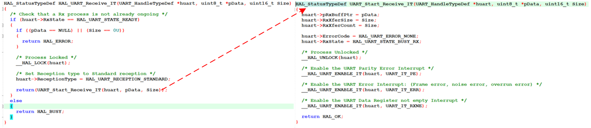

这个函数是以非阻塞模式接收一定数量的数据，第一个参数就是串口的句柄，我们使用的哪个串口就填那个串口的句柄地址，第二个参数是一个缓冲区，当中断发生的时候，接收到的数据会被存放在这里，第三个参数是大小，单位是字节，当我们填1的时候，接收到一个字节就会调用一次回调函数，当我们填10的时候，接收到的数据若不足10个字节，那么就不会调用回调函数，但是依然会产生接收中断。

我们可以试一下，若是我们程序从头到尾都没有调用这个函数的话，我们的接收中断是不会进入的，即便我们全局中断和串口中断都开起来了，我们仔细看上边的图，会发现内部调用了一个 UART_Start_Receive_IT () 函数，函数里边又调用了三个含有ENABLE_IT的函数，做的是不同的使能。

我们看注释，会发现，第三个在使能UART_IT_RXNE，我们来看一下他是啥，其实看注释也能知道，不过我们来追踪一下，印象深刻一些。我们可以定位到以下宏：

```c
#define UART_CR1_REG_INDEX               1U

#define USART_CR1_RXNEIE_Pos                (5U)                               
#define USART_CR1_RXNEIE_Msk                (0x1UL << USART_CR1_RXNEIE_Pos)     /*!< 0x00000020 */
#define USART_CR1_RXNEIE                    USART_CR1_RXNEIE_Msk               /*!< RXNE Interrupt Enable */

#define UART_IT_RXNE                     ((uint32_t)(UART_CR1_REG_INDEX << 28U | USART_CR1_RXNEIE))
```

我们再来看一下CR1寄存器：

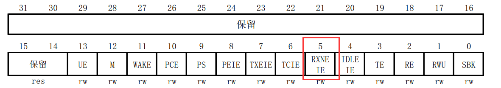

其中的 bit[5]：RXNEIE，接收缓冲区非空中断使能 (RXNE interrupt enable) ，该位由软件设置或清除。 0：禁止产生中断； 1：当USART_SR中的ORE或者RXNE为’1’时，产生USART中断。

到这里就清晰了，这个函数不仅仅会获取数据，还会开启接收中断，为什么这里要开启？我们再来往前看，我们看一下这个函数：

```c
static HAL_StatusTypeDef UART_Receive_IT(UART_HandleTypeDef *huart)
{
    // 中间的省略...
    if (--huart->RxXferCount == 0U)
    {
      /* Disable the UART Data Register not empty Interrupt */
      __HAL_UART_DISABLE_IT(huart, UART_IT_RXNE);
	  // 中间的省略...
      /*Call legacy weak Rx complete callback*/
      HAL_UART_RxCpltCallback(huart);
	 // 中间的省略...
    }
    // 后边的省略...
}
```

额，中间太多没用的占行数，就都删了，大致有这个关系就行了，我们看一下这个的定义 RxXferCount ：UART Rx Transfer Counter翻译过来是 UART Rx传输计数器，我们看逻辑大概就是当这个值减到0的时候才会调用回调函数，这样不就联系起来了吗？我们通过 HAL_UART_Receive_IT 设置了串口的这个参数的值，然后每发生一次中断这个数就会自减1，当减到0的时候，调用回调函数，这是对于 HAL_UART_Receive_IT 第三个参数的理解，那么前边说的需要重新开启中断呢？我们看这个函数里，在 RxXferCount 减到0的时候，它先去关闭了接收中断，这样的话，每调用一次回调函数，就会关闭一次中断，我们要是不再开启接收中断的话，下一次接收就不会产生中断啦，这样就理清楚了这个关系了。

**【总结】**

（1）使用接收中断时，必须在初始化完成后调用一次 HAL_UART_Receive_IT() 函数来开启接收中断（其他地方实际上是没有开启接收中断的，这样才能产生第一次中断）

（2）每次调用回调函数的完成后一定要再调用一次 HAL_UART_Receive_IT() 来重新开启接收中断。

（3）HAL_UART_Receive_IT()只要调用，就会开启接收中断，但是中断多少次之后调用回调函数，由第三个参数决定，当第三个参数为1时，每接收到一个字节数据，都会调用一次回调函数，当不为1时，每接受一个字节都会产生一次中断，但是，接收到对应字节数的数据时才会调用一次回调函数。

### 5. 运行结果

我们将接收的字节数定义为 2，也就是接收到两个字节数据时才产生中断：

```c
void HAL_UART_RxCpltCallback(UART_HandleTypeDef *huart)
{
	if(huart->Instance == USART1)
	{
		printf("receive: %x %x\r\n", RXBUFF[0], RXBUFF[1]);
		HAL_UART_Receive_IT(&huart1, RXBUFF, 2);
	}
}
```

接下来我们来看看效果：

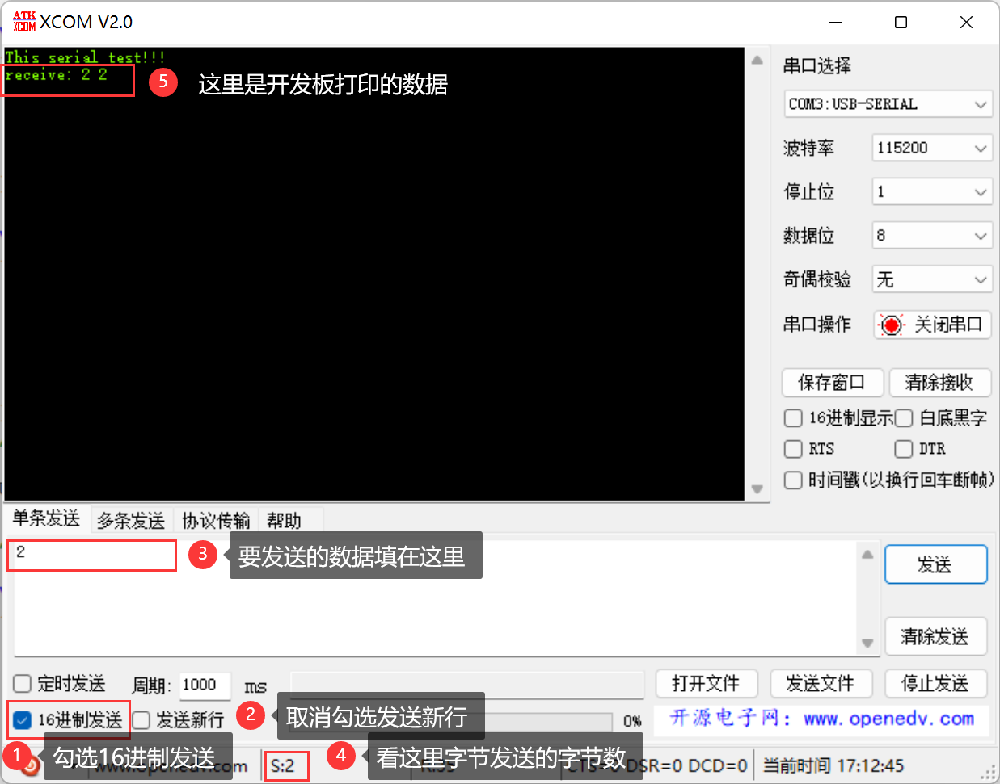

我们发送一个2，会发现没有输出，我们再点一次发送，下方状态栏的S变为2，此时上方显示出我们发送出去的两个2，这也验证了我们之前的分析过程。有一点需要注意，在串口调试助手中，空格可能不被识别的，我们关注下方发送的字节数即可：

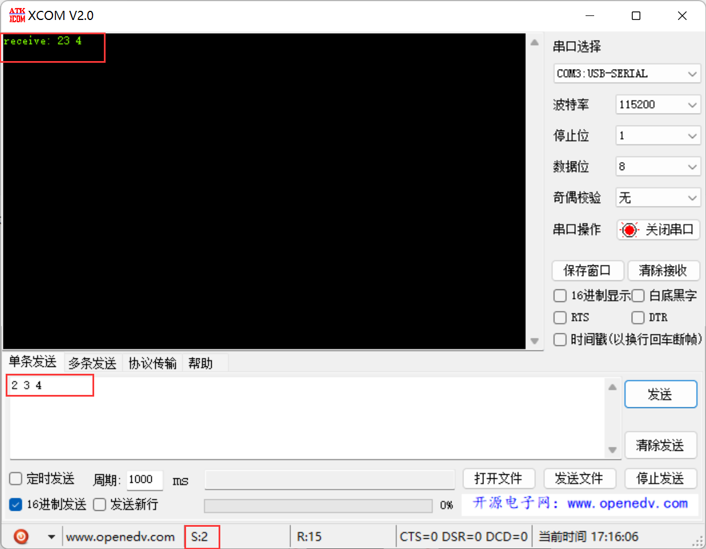

## 三、串口接收设计

### 1. 相关定义

```c
#define RXBUFFERSIZE   1        // 缓存大小，这个值决定了收到多少个字节数据执行一次回调函数
#define USART_REC_LEN  200      // 定义最大接收字节数 200
uint16_t USART_RX_STA = 0;      // 接收状态标记	  
                                // bit15 接收完成标志
                                // bit14 接收到0x0d
                                // bit13~0 接收到的有效字节数目
uint8_t aRxBuffer[RXBUFFERSIZE]; // HAL库使用的串口接收缓冲
//注意,读取USARTx->SR能避免莫名其妙的错误   	
uint8_t USART_RX_BUF[USART_REC_LEN];     //接收缓冲,最大USART_REC_LEN个字节.
```

### 2. 接收中断回调函数

```c
/**
  * @brief  串口接收中断回调函数
  * @note   
  * @param  huart 串口句柄
  * @retval 
  */
void HAL_UART_RxCpltCallback(UART_HandleTypeDef *huart)
{
  uint32_t timeout = 0;
  if (huart->Instance == USART1) // 如果是串口1
  {
    if ((USART_RX_STA & 0x8000) == 0) // 接收未完成
    {
      if (USART_RX_STA & 0x4000) // 接收到了0x0d(回车)
      {
        if (aRxBuffer[0] != 0x0a) // 是否接收到了0x0a(换行)
          USART_RX_STA = 0;       // 接收错误,重新开始
        else
          USART_RX_STA |= 0x8000; // 接收完成了
      }
      else // 还没收到0X0D
      {
        if (aRxBuffer[0] == 0x0d)
          USART_RX_STA |= 0x4000;
        else
        {
          USART_RX_BUF[USART_RX_STA & 0X3FFF] = aRxBuffer[0];
          USART_RX_STA++;
          if (USART_RX_STA > (USART_REC_LEN - 1))
            USART_RX_STA = 0; // 接收数据错误,重新开始接收
        }
      }
    }

    timeout = 0;
    while (HAL_UART_GetState(&huart1) != HAL_UART_STATE_READY) // 等待就绪
    {
      timeout++; ////超时处理
      if (timeout > HAL_MAX_DELAY)
        break;
    }

    timeout = 0;
    // 一次处理完成之后，重新开启中断并设置RxXferCount为1
    while (HAL_UART_Receive_IT(&huart1, (uint8_t *)aRxBuffer, RXBUFFERSIZE) != HAL_OK) 
    {
      timeout++; // 超时处理
      if (timeout > HAL_MAX_DELAY)
        break;
    }
  }
}
```

【注意】一定要注意回调函数执行完毕后，要重新调用一次HAL_UART_Receive_IT()函数。

## 四、printf问题总结

前边我们在keil中编程的时候使用的是STM32CubeMX生成的工程，或者说自己使用标准库新建工程，出现重定向printf后无法打印的情况可以使用下边的处理方式1，但是后来我发现，在STM32CubeIDE中创建的工程，使用处理方式一后依然无法打印，后来上网搜了一下，又添加了一些东西，作为参考吧。

### 1. MDK中无法打印处理

串口是我们经常要用到的，我们可以将fputc一起写到避免半主机模式的代码中，这样，后续我们只需要赋值这一段代码到工程就可以啦：

```c
//加入以下代码,支持printf函数,而不需要选择use MicroLIB	  
#if 1
#include <stdio.h>

#pragma import(__use_no_semihosting)             
//标准库需要的支持函数                 
struct __FILE 
{ 
	int handle; 
}; 

FILE __stdin; 
FILE __stdout;

//定义_sys_exit()以避免使用半主机模式    
void _sys_exit(int x) 
{ 
	x = x; 
} 

//重定义fputc函数 
int fputc(int ch, FILE *f)
{
	while((USART1->SR & (1<<6)) == 0);  //等待DR为空//循环发送,直到发送完毕 
    USART1->DR = (uint8_t) ch;
	return ch;
}

#endif 
```

### 2. STM32CubeIDE中无法打印处理

这种方式主要是针对我们在STM32CubeIDE新建的工程中无法使用printf打印的处理，这里多定义了一些东西，其实这样更通用一些，至少这样可以解决问题。

```c
#include "sys.h"

#if 1
#include <stdio.h>
#include "usart.h"

#pragma import(__use_no_semihosting)

#ifdef __GNUC__
#define PUTCHAR_PROTOTYPE int __io_putchar(int ch)
#else
#define PUTCHAR_PROTOTYPE int fputc(int ch, FILE *f)
#endif
//STM32cubeIDE下
PUTCHAR_PROTOTYPE
{
    HAL_UART_Transmit(&huart1 , (uint8_t *)&ch, 1,0x200);
    return ch;
}


// 标准库需要的支持函数
struct __FILE 
{ 
	int handle; 
}; 

FILE __stdout;
FILE __stdin;
// 定义_sys_exit()以避免使用半主机模式
void _sys_exit(int x) 
{ 
	x = x; 
} 

// 重定义fputc函数
int fputc(int ch, FILE *f)
{
	while((USART1->SR & (1<<6)) == 0);//等待RDR不为空，表示收到数据
	
    USART1->DR = (uint8_t) ch;
	
	return ch;
}

#endif 

```

### 3. Makefile工程无法打印处理

我们使用STM32CubeMX生成的Makefile工程，也是无法使用printf的，但是使用上边的两种方式都不行，makefile使用的交叉编译工具链为

```c
$ arm-none-eabi-gcc -v
Using built-in specs.
COLLECT_GCC=C:\Program Files (x86)\Arm GNU Toolchain arm-none-eabi\12.2 mpacbti-rel1\bin\arm-none-eabi-gcc.exe
COLLECT_LTO_WRAPPER=c:/program\ files\ (x86)/arm\ gnu\ toolchain\ arm-none-eabi/12.2\ mpacbti-rel1/bin/../libexec/gcc/arm-none-eabi/12.2.1/lto-wrapper.exe
Target: arm-none-eabi
Configured with: /data/jenkins/workspace/GNU-toolchain/arm-12-mpacbti/src/gcc/configure --target=arm-none-eabi --prefix=/data/jenkins/workspace/GNU-toolchain/arm-12-mpacbti/build-mingw-arm-none-eabi/install --with-gmp=/data/jenkins/workspace/GNU-toolchain/arm-12-mpacbti/build-mingw-arm-none-eabi/host-tools --with-mpfr=/data/jenkins/workspace/GNU-toolchain/arm-12-mpacbti/build-mingw-arm-none-eabi/host-tools --with-mpc=/data/jenkins/workspace/GNU-toolchain/arm-12-mpacbti/build-mingw-arm-none-eabi/host-tools --with-isl=/data/jenkins/workspace/GNU-toolchain/arm-12-mpacbti/build-mingw-arm-none-eabi/host-tools --disable-shared --disable-nls --disable-threads --disable-tls --enable-checking=release --enable-languages=c,c++,fortran --with-newlib --with-gnu-as --with-gnu-ld --with-sysroot=/data/jenkins/workspace/GNU-toolchain/arm-12-mpacbti/build-mingw-arm-none-eabi/install/arm-none-eabi --with-multilib-list=aprofile,rmprofile --with-libiconv-prefix=/data/jenkins/workspace/GNU-toolchain/arm-12-mpacbti/build-mingw-arm-none-eabi/host-tools --host=i686-w64-mingw32 --with-pkgversion='Arm GNU Toolchain 12.2.MPACBTI-Rel1 (Build arm-12-mpacbti.34)' --with-bugurl=https://bugs.linaro.org/
Thread model: single
Supported LTO compression algorithms: zlib
gcc version 12.2.1 20230214 (Arm GNU Toolchain 12.2.MPACBTI-Rel1 (Build arm-12-mpacbti.34))
```

无法打印的处理方式为：

```c
#include "./sys.h"

//加入以下代码,支持printf函数,而不需要选择use MicroLIB	  
#ifdef __USART_H__

/**
  * @brief  重定义 _write 函数 
  * @note   
  * @param  fd 文件描述符
  * @param  ch 要写入的字符串
  * @param  len 要写入的字符串长度
  * @retval len 返回写入字符串的长度
  */
int _write(int fd, char *ch, int len)
{
  HAL_UART_Transmit(&huart1, (uint8_t *)ch, len, 0xFFFF);
  return len;
}

#endif 
```

注意在要保证这个sys.c文件包含的有串口对应的头文件，我这里是因为包含了main.h，在main.h中包含了usart.h头文件。这个比起另外两种倒是简单了不少。
