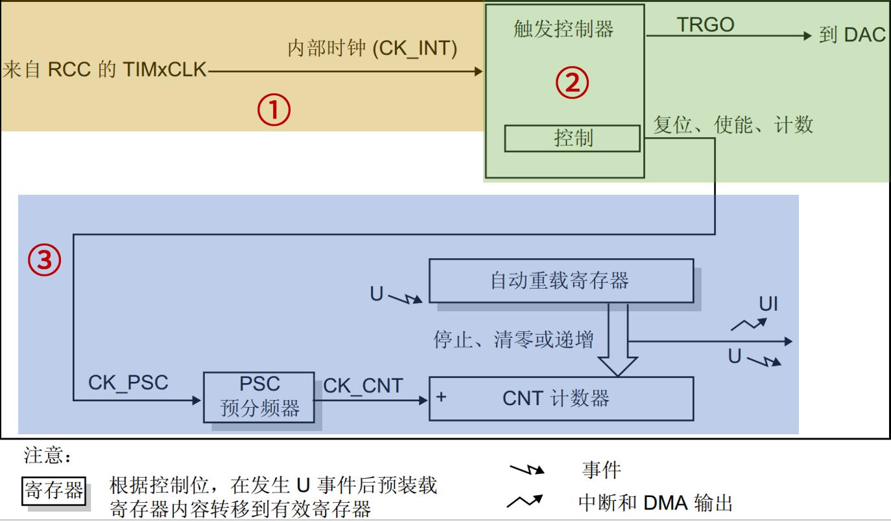
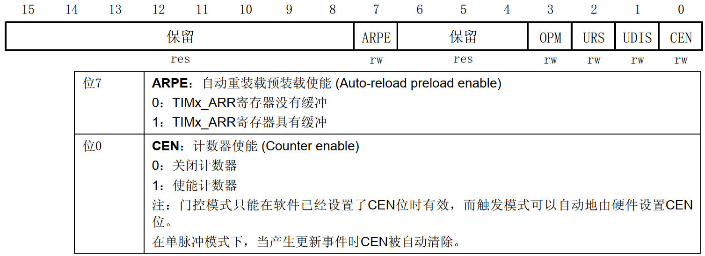
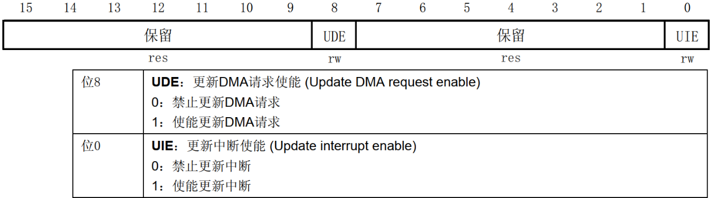
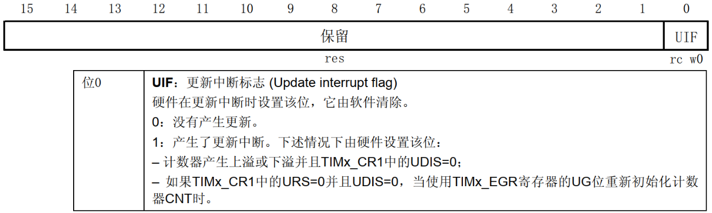
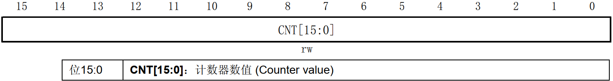
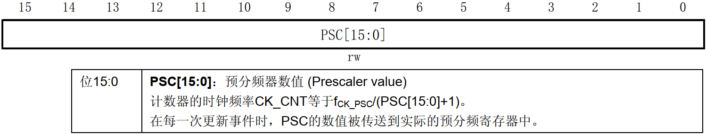
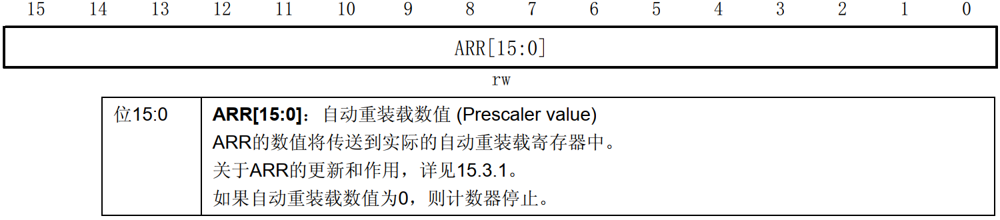
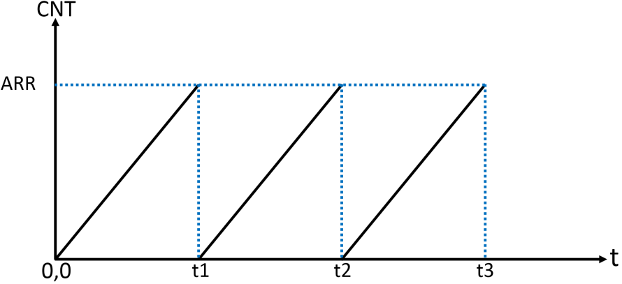

<!-- more -->

## 一、基本定时器简介

### 1. STM32的基本定时器

STM32F103 有两个基本定时器 TIM6 和 TIM7，它们的功能完全相同，资源是完全独立的，可以同时使用。其主要特性如下： 16 位自动重载递增计数器， 16 位可编程预分频器，预分频系数 1\~65536，用于对计数器时钟频率进行分频，还可以触发 DAC 的同步电路，以及生成中断/DMA 请求。  

### 2. 基本定时器框图  

- ① 时钟源

定时器的核心就是计算器， 要实现计数功能，首先要给它一个时钟源。 基本定时器时钟挂载在 APB1 总线，所以它的时钟来自于 APB1 总线， 但是基本定时器时钟不是直接由 APB1 总线直接提供，而是先经过一个倍频器。当 APB1 的预分频器系数为 1 时，这个倍频器系数为 1，即定时器的时钟频率等于 APB1 总线时钟频率；当 APB1 的预分频器系数≥2 分频时，这个倍频器系数就 为 2 ， 即定时器的时钟频率等于 APB1 总线时钟频率 的两倍。我们在sys_stm32_clock_init 时钟设置函数已经设置 APB1 总线时钟频率为 36M， APB1 总线的预分频器分频系数是 2， 所以挂载在 APB1 总线的定时器时钟频率为 72Mhz。    

- ② 控制器

控制器除了控制定时器复位、使能、计数等功能之外，还可以用于触发 DAC 转换。

- ③ 时基单元

时基单元包括：计数器寄存器(TIMx_CNT)、预分频器寄存器(TIMx_PSC)、自动重载寄存器(TIMx_ARR) 。基本定时器的这三个寄存器都是 16 位有效数字，即可设置值范围是 0\~65535。时基单元中的预分频器 PSC，它有一个输入和一个输出。输入 CK_PSC 来源于控制器部分，实际上就是来自于内部时钟（CK_INT），即 2 倍的 APB1 总线时钟频率（72MHz）。输出 CK_CNT是分频后的时钟，它是计数器实际的计数时钟，通过设置预分频器寄存器(TIMx_PSC)的值可以得到不同频率 CK_CNT，计算公式如下：  
$$
f_{CK\_CNT}=\frac{f_{CK\_PSC}}{PSC[15:0]+1}
$$
上式中， PSC[15:0]是写入预分频器寄存器(TIMx_PSC)的值。另外：预分频器寄存器(TIMx_PSC)可以在运行过程中修改它的数值，新的预分频数值将在下一个更新事件时起作用。因为更新事件发生时，会把 TIMx_PSC 寄存器值更新到其影子寄存器中，这才会起作用。  

什么是影子寄存器？从框图上看，可以看到框图中的预分频器PSC后面有一个影子，自动重载寄存器也有个影子，这就表示这些寄存器有影子寄存器。 影子寄存器是一个实际起作用的寄存器， 不可直接访问。举个例子：我们可以把预分频系数写入预分频器寄存器(TIMx_PSC)，但是预分频器寄存器只是起到缓存数据的作用，只有等到更新事件发生时，预分频器寄存器的值才会被自动写入其影子寄存器中，这时才真正起作用。  

自动重载寄存器及其影子寄存器的作用和上述同理。不同点在于自动重载寄存器是否具有缓冲作用还受到 ARPE 位的控制，当该位置 0 时， ARR 寄存器不进行缓冲，我们写入新的 ARR值时，该值会马上被写入 ARR 影子寄存器中，从而直接生效；当该位置 1 时， ARR 寄存器进行缓冲，我们写入新的 ARR 值时，该值不会马上被写入 ARR 影子寄存器中，而是要等到更新事件发生才会被写入 ARR 影子寄存器，这时才生效。预分频器寄存器则没有这样相关的控制位，这就是它们不同点。

值得注意的是， 更新事件的产生有两种情况，一是由软件产生，将 TIMx_EGR 寄存器的位UG 置 1，产生更新事件后，硬件会自动将 UG 位清零。二是由硬件产生，满足以下条件即可：计数器的值等于自动重装载寄存器影子寄存器的值。下面来看一下硬件更新事件。

基本定时器的计数器（CNT）是一个递增的计数器，当寄存器（TIMx_CR1）的 CEN 位置1，即使能定时器，每来一个 CK_CNT 脉冲， TIMx_CNT 的值就会递增加 1。当 TIMx_CNT 值与 TIMx_ARR 的设定值相等时， TIMx_CNT 的值就会被自动清零并且会生成更新事件（如果开启相应的功能，就会产生 DMA 请求、产生中断信号或者触发 DAC 同步电路），然后下一个CK_CNT 脉冲到来， TIMx_CNT 的值就会递增加 1，如此循环。在此过程中， TIMx_CNT 等于TIMx_ARR 时，我们称之为定时器溢出，因为是递增计数，故而又称为定时器上溢。 定时器溢出就伴随着更新事件的发生。

由上述可知，我们只要设置预分频寄存器和自动重载寄存器的值就可以控制定时器更新事件发生的时间。自动重载寄存器(TIMx_ARR)是用于存放一个与计数器作比较的值，当计数器的值等于自动重载寄存器的值时就会生成更新事件，硬件自动置位相关更新事件的标志位，如：更新中断标志位。    

那如何设置预分频寄存器和自动重载寄存器的值来得到我们想要的定时器上溢事件发生的时间周期？比如我们需要一个 500ms 周期的定时器更新中断，一般思路是先设置预分频寄存器，然后才是自动重载寄存器。考虑到我们设置的 CK_INT 为 72MHz，我们把预分频系数设置为 7200，即写入预分频寄存器的值为 7199，那么 fCK\_CNT=72MHz/7200=10KHz。这样就得到计数器的计数频率为 10KHz，即计数器 1 秒钟可以计 10000 个数。我们需要 500ms的中断周期，所以我们让计数器计数 5000 个数就能满足要求，即需要设置自动重载寄存器的值为 4999， 另外还要把定时器更新中断使能位 UIE 置 1， CEN 位也要置 1。  

## 二、寄存器简介

### 1. 控制寄存器 1（TIMx_CR1）

该寄存器，我们需要注意的是：位 0（CEN）用于使能或者禁止计数器，该位置 1 计数器开始工作，置 0 则停止。还有位 7（APRE）用于控制自动重载寄存器 ARR 是否具有缓冲作用，如果 ARPE 位置 1， ARR 起缓冲作用，即只有在更新事件发生时才会把 ARR 的值写入其影子寄存器里；如果 ARPE 位置 0，那么修改自动重载寄存器的值时，该值会马上被写入其影子寄存器中，从而立即生效。  

### 2. DMA/中断使能寄存器（TIMx_DIER）  

该寄存器位 0（UIE）用于使能或者禁止更新中断，因为本实验我们用到中断，所以该位需要置 1。位 8（UDE）用于使能或者禁止更新 DMA 请求，我们暂且用不到，置 0 即可。  

### 3. 状态寄存器（TIMx_SR）

该寄存器位 0（UIF）是中断更新的标志位，当发生中断时由硬件置 1，然后就会执行中断服务函数，需要软件去清零，所以我们必须在中断服务函数里把该位清零。如果中断到来后，不把该位清零，那么系统就会一直进入中断服务函数 。

### 4. 计数器寄存器（TIMx_CNT）

该寄存器位[15:0]就是计数器的实时的计数值。  

### 5. 预分频寄存器（TIMx_PSC）  

该寄存器是 TIM6/TIM7 的预分频寄存器，比如我们要 7200 分频，就往该寄存器写入 7199。注意这是 16 位的寄存器，写入的数值范围是 0 到 65535，分频系数范围： 1 到 65536。  

### 6. 自动重载寄存器（TIMx_ARR）

该寄存器可以由 APRE 位设置是否进行缓冲。计数器的值会和 ARR 寄存器影子寄存器进行比较，当两者相等，定时器就会溢出，从而发生更新事件，如果打开更新中断，还会发生更新中断。  

## 三、基本定时器中断应用  

我们主要配置定时器产生周期性溢出，从而在定时器更新中断中做周期性的操作，如周期性翻转 LED 灯。 假设计数器计数模式为递增计数模式，那么实现周期性更新中断原理示意图如下所示：  

CNT 计数器从 0 开始计数，当 CNT 的值和 ARR 相等时（t1），产生一个更新中断，然后 CNT 复位（清零），然后继续递增计数，依次循环。图中的 t1、 t2、 t3 就是定时器更新中断产生的时刻。

通过修改 ARR 的值，可以改变定时时间。另外，通过修改 PSC 的值，使用不同的计数频率（改变图中 CNT 的斜率），也可以改变定时时间。  
