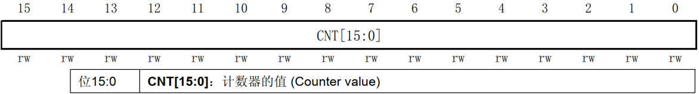

<!-- more -->

## 一、相关寄存器

我们来学习使用通用定时器中断，学习 TIM2/TIM3/TIM4/TIM5 的几个与定时器中断相关且重要的寄存器。主要以定时器3为例。

### 1. 控制寄存器 1（TIMx_CR1）

TIM2/TIM3/TIM4/TIM5 的控制寄存器 1 描述如图：

上图中只截出了中断需要用的一些位，其中：  

位 7（APRE）用于控制自动重载寄存器是否进行缓冲，如果 ARPE 位置 1， ARR 起缓冲作用，即只有在更新事件发生时才会把 ARR的值写入其影子寄存器里；如果 ARPE 位置 0，那么修改自动重载寄存器的值时，该值会马上被写入其影子寄存器中，从而立即生效。

CMS[1:0]位，用于设置边沿对齐模式还是中心对齐模式，本实验我们使用边沿对齐模式，所以设置为 00 即可。

DIR 位，用于控制定时器的计数方向，我们使用递增计数模式，所以设置 DIR 位为 0。

CEN 位，用于使能计数器的工作，必须要设置该位为 1，计数器才会开始计数。  

### 2. 从模式控制寄存器（TIMx_SMCR）

TIM2/TIM3/TIM4/TIM5 的从模式控制寄存器描述如图：

该寄存器的 SMS[2:0]位，用于从模式选择，其实就是选择计数器输入时钟的来源。比如通用定时器中断实验我们设置 SMS[2:0]=000，禁止从模式，这样 PSC 预分频器的时钟就直接来自内部时钟（CK_INT）， 按照我们例程 sys_stm32_clock_init 函数的配置， 频率为 72Mhz（APB1总线时钟频率的 2 倍）。  

### 3. DMA/中断使能寄存器（TIMx_DIER）

TIM2/TIM3/TIM4/TIM5 的 DMA/中断使能寄存器描述如图 ：

该寄存器用于使能/失能触发 DMA 请求、捕获/比较中断以及更新中断。中断实验更新中断，所以把位 0（UIE）置 1 即可。  

### 4. 状态寄存器（TIMx_SR）

TIM2/TIM3/TIM4/TIM5 的状态寄存器描述如图:

该寄存器都是一些中断标志位，比如更新中断标志位、 捕获/比较中断标志位等。在通用定时器中断实验我们用到更新中断标志位，当定时器更新中断到来后，位 0（UIF）会由硬件置 1，我们需要在中断服务函数里面把该位清零。  

### 5. 计数寄存器（TIMx_CNT）

TIM2/TIM3/TIM4/TIM5 的计数器寄存器描述如图：

TIM2/TIM3/TIM4/TIM5 的计数寄存器都是 16 位有效的， 计数模式可以是递增计数模式、递减计数模式和中心对齐计数模式，计数值范围 0\~65535。 可以直接写该寄存器设置计数的初始值，也可以读取该寄存器获取计数器值。  

### 6. 预分频寄存器（TIMx_PSC）

TIM2/TIM3/TIM4/TIM5 的预分频器寄存器描述如图：

定时器的预分频寄存器都是 16 位的，即写入该寄存器的数值范围是 0 到 65535，表示 1 到65536 分频。比如我们要 7200 分频，就往该寄存器写入 7199。  

### 7. 自动重载寄存器（TIMx_ARR）

TIM2/TIM3/TIM4/TIM5 的自动重载寄存器描述如图：

自动重载寄存器是低 16 位有效。该寄存器可以由 APRE 位设置是否进行缓冲。计数器的值会和自动重装寄存器影子寄存器进行比较，当两者相等，定时器就会溢出，从而发生更新事件，如果打开了更新中断，还会发生更新中断。  
