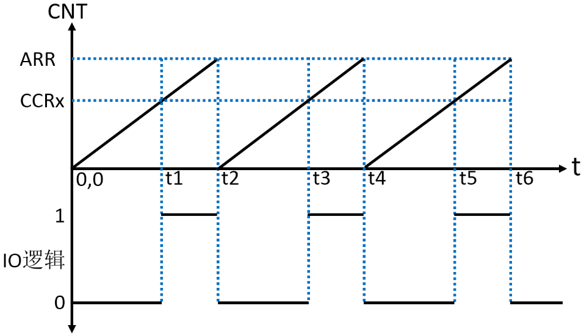
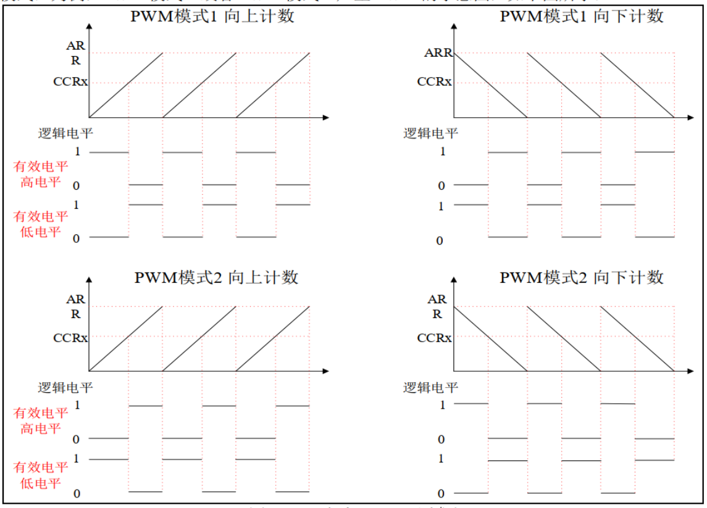
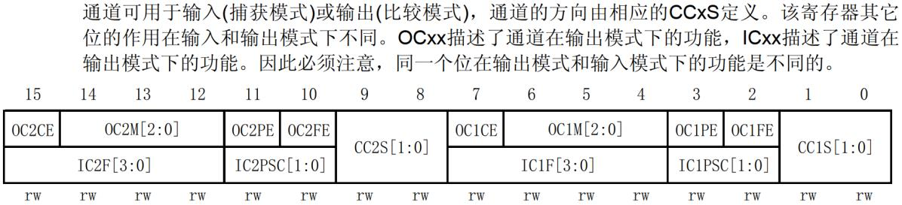
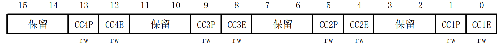
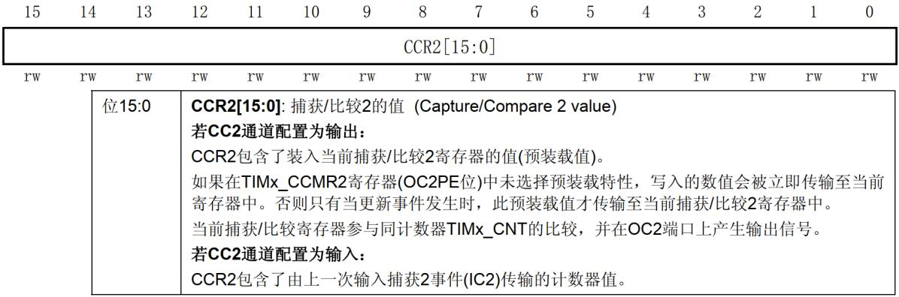

<!-- more -->

## 一、PWM产生原理

脉冲宽度调制(PWM)，是英文“Pulse Width Modulation”的缩写，简称脉宽调制，是利用微处理器的数字输出来对模拟电路进行控制的一种非常有效的技术。我们可以让定时器产生PWM，在计数器频率固定时， PWM 频率或者周期由自动重载寄存器（TIMx_ARR）的值决定，其占空比由捕获/比较寄存器（TIMx_CCRx）的值决定。 PWM 产生原理示意图如下图所示：  

上图中，定时器工作在递增计数模式，纵轴是计数器的计数值 CNT，横轴表示时。当CNT&lt;CCRx 时， IO 输出低电平（逻辑 0）；当 CNT &gt;=CCRx 时， IO 输出高电平（逻辑 1）；当CNT=ARR 时，定时器溢出， CNT 的值被清零，然后继续递增，依次循环。在这个循环中，改变 CCRx 的值，就可以改变 PWM 的占空比，改变 ARR 的值，就可以改变 PWM 的频率，这就是 PWM 输出的原理。  

定时器产生 PWM 的方式有许多种，下面我们以边沿对齐模式（即递增计数模式/递减计数模式）为例， PWM 模式 1 或者 PWM 模式 2 产生 PWM 的示意图， 如下图所示：  

STM32F103 的定时器除了 TIM6 和 TIM7，其他的定时器都可以用来产生 PWM 输出。其中高级定时器 TIM1 和 TIM8 可以同时产生多达 7 路的 PWM 输出。而通用定时器也能同时产生多达 4 路的 PWM 输出。

## 二、相关寄存器

要使 STM32F103 的通用定时器 TIMx 产生 PWM 输出，除了通用定时器中断小节笔记中学习的寄存器外，我们还会用到 3 个寄存器，来控制PWM。这三个寄存器分别是：捕获/比较模式寄存器（TIMx_CCMR1/2）、捕获/比较使能寄存器（TIMx_CCER）、捕获/比较寄存器（TIMx_CCR1\~4）。接下来我们简单了解一下这三个寄存器。  

### 1. 捕获/比较模式寄存器 1/2（TIMx_CCMR1/2）

TIM2/TIM3/TIM4/TIM5 的捕获/比较模式寄存器（TIMx_CCMR1/2），该寄存器一般有 2 个：TIMx _CCMR1 和 TIMx _CCMR2。 TIMx_CCMR1 控制 CH1 和 CH2，而 TIMx_CCMR2 控制CH3 和 CH4。 TIMx_CCMR1 寄存器描述如图 

该寄存器的有些位在不同模式下，功能不一样，我们现在只用到输出比较，输入捕获后面会再学习。关于该寄存器的详细说明，可以参考《STM32F10xxx 参考手册_V10（中文版）》第 288 页， 14.4.7 节。

比如我们要让 TIM3 的 CH2 输出 PWM 波为例进行介绍，该寄存器的模式设置位 OC2M[2:0]就是对应着通道 2 的模式设置，此部分由 3 位组成。总共可以配置成 8 种模式，我们使用的是 PWM 模式，所以这 3 位必须设置为 110 或者 111，分别对应 PWM 模式 1和 PWM 模式 2。这两种PWM 模式的区别就是输出有效电平的极性相反。 位 OC2PE 控制输出比较通道 2 的预装载使能，实际就是控制 CCR2 寄存器是否进行缓冲。因为 CCR2 寄存器也是有影子寄存器的，影子寄存器才是真正起作用的寄存器。 CC2S[1:0]用于设置通道 2 的方向（输入/输出）默认设置为 0，就是设置通道作为输出使用。  

### 2. 捕获/比较使能寄存器（TIMx_CCER）  

TIM2/TIM3/TIM4/TIM5 的捕获/比较使能寄存器，该寄存器控制着各个输入输出通道的开关和极性。 TIMx_CCER 寄存器描述如图：

该寄存器比较简单，要让 TIM3 的 CH2 输出 PWM 波，这里我们要使能 CC2E 位，该位是通道 2 输入/输出使能位，要想 PWM 从 IO 口输出，这个位必须设置为 1。 CC2P 位是设置通道2 的输出极性，我们默认设置 0。  

### 3. 捕获/比较寄存器 1/2/3/4（TIMx_CCR1/2/3/4）  

捕获/比较寄存器（TIMx_CCR1/2/3/4），该寄存器总共有 4 个，对应 4 个通道 CH1\~CH4。我们使用的是通道 2，所以来看看 TIMx_CCR2 寄存器， 描述如图  

在输出模式下，捕获/比较寄存器影子寄存器的值与 CNT 的值比较，根据比较结果产生相应动作，利用这点，我们通过修改这个寄存器的值，就可以控制 PWM 的占空比了。  
