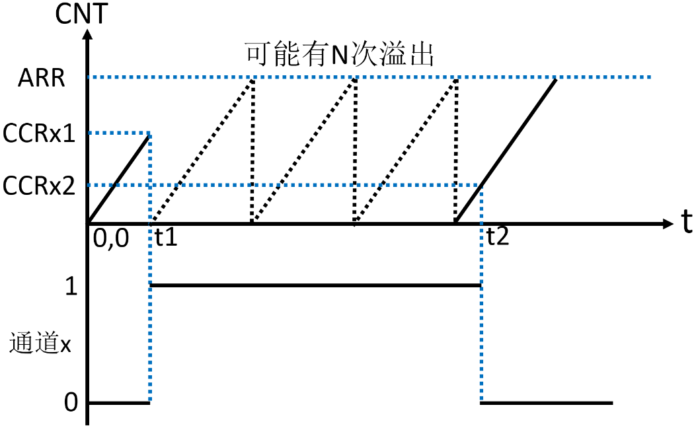
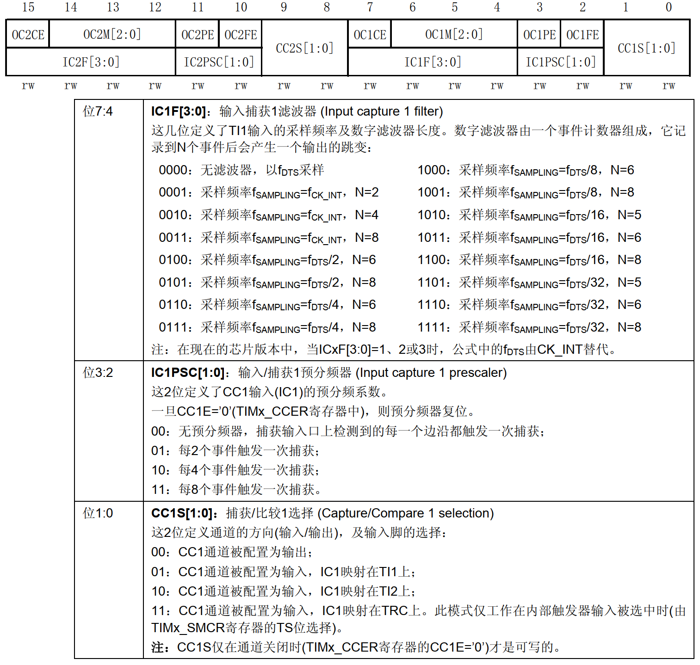
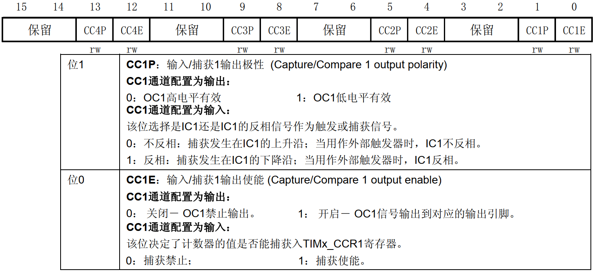

<!-- more -->

## 一、脉宽测量基本原理

输入捕获模式可以用来测量脉冲宽度或者测量频率。我们以测量脉宽为例，用一个简图来说明输入捕获脉宽测量原理：

t1 到 t2 的时间段，就是我们需要测量的高电平时间。测量方法如下：假如定时器工作在递增计数模式，首先设置定时器通道 x 为上升沿捕获，这样在 t1 时刻上升沿到来时，就会发生捕获事件。这里我们还会打开捕获中断，所以捕获事件发生就意味着捕获中断也会发生。在捕获中断里将计数器值清零，并设置通道 x 为下降沿捕获，这样 t2 时刻下降沿到来时， 就会发生捕获事件和捕获中断。捕获事件发生时，计数器的值会被锁存到捕获/比较寄存器中（比如通道 1 对应的是 CCR1 寄存器）。那么在捕获中断里，我们读取捕获/比较寄存器就可以获取到高电平脉冲时间内，计数器计数的个数，从而可以算出高电平脉冲的时间。这里是假设定时器没有溢出为前提的。  

实际上， t1 到 t2 时间段，定时器可能会产生 N 次溢出，这就需要我们对定时器溢出做相应的处理，防止高电平太长，导致测量出错。在 t1 到 t2 时间段，假设定时器溢出 N 次，那么高电平脉冲时间内，计数器计数的个数计算方法为： `N*(ARR+1) + CCRx2`， CCRx2 表示 t2 时间点，捕获/比较寄存器的值。经过计算得到高电平脉宽时间内计数器计数个数后，用这个个数乘以计数器的计数周期，就可得到高电平持续的时间。就是输入捕获测量高电平脉宽时间的整个过程。  

STM32F103 的定时器除了 TIM6 和 TIM7，其他定时器都有输入捕获功能。输入捕获，简单的说就是通过检测 TIMx_CHy 上的边沿信号，在边沿信号发生跳变（比如上升沿/下降沿）时，会发生捕获事件，将当前定时器的值（ TIMx_CNT）锁存到对应通道的捕获/比较寄存器（TIMx_CCRy）里，完成一次捕获。同时还可以配置捕获事件发生时是否触发捕获中断/DMA。另外还要考虑测量的过程中是否可能发生定时器溢出，如果可能溢出，还要做溢出处理。  

## 二、相关寄存器

通用定时器输入捕获实验需要用到的寄存器有： TIMx_ARR、 TIMx_PSC、 TIMx_CCMR1、TIMx_CCER、 TIMx_DIER、 TIMx_CR1、 TIMx_CCR1 这些寄存器在前面的笔记都有提到，在这里只需针对性的说明。  

### 1. 捕获/比较模式寄存器 1/2（TIMx_CCMR1/2）

该寄存器我们在 PWM 输出实验时讲解了它作为输出功能的配置，现在重点学习输入捕获模式的配置。因为本实验我们用到定时器 5 通道 1 输入，所以我们要看 TIMx_CCMR1 寄存器，其描述如图：

该寄存器在输入模式和输出模式下，功能是不一样， 所以需要看准不同模式的描述，可以打开手册查看。 TIMx_CCMR1 寄存器对应于通道 1 和通道 2 的设置， CCMR2 寄存器对应通道 3和通道 4。如： TIMx_CCMR1 寄存器位[7： 0]用于捕获/比较通道 1 的控制，而位[15： 8]则用于捕获/比较通道 2 的控制。我们用到定时器 5 通道 1 输入，所以需要配置 TIMx_CCMR1 的位[7:0]。

其中 CC1S[1:0]，这两个位用于 CCR1 的通道配置，这里我们设置 IC1S[1:0]=01，也就是配置 IC1 映射在 TI1 上。

输入捕获 1 预分频器 IC1PSC[1:0]，这个比较好理解。我们是 1 次边沿就触发 1 次捕获，所以选择 00 就行了。

输入捕获 1 滤波器 IC1F[3:0]，这个用来设置输入采样频率和数字滤波器长度。其中， fCK_INT是定时器时钟源频率，按照例程的配置为 72Mhz，而 fDTS 则是根据 TIMx_CR1 的 CKD[1:0]的设置来确定的，如果 CKD[1:0]设置为 00，那么 fDTS=fCK_INT。 N 值采样次数，举个简单的例子：假设 IC1F[3:0]=0011，并设置 IC1 映射到 TI1 上。表示以 fCK_INT 为采样频率，当连续 8 次都是采样到 TI1 为高电平或者低电平，滤波器才输出一个有效输出边沿。当 8 次采样中有高有低，那就保持原来的输出，这样可以滤除高频干扰信号，从而达到滤波的效果。这里，我们不做滤波处理，所以设置 IC1F[3:0]=0000。  

### 2. 捕获/比较使能寄存器（TIMx_CCER）  

TIM2/TIM3/TIM4/TIM5 的捕获/比较使能寄存器，该寄存器控制着各个输入输出通道的开关和极性。 TIMx_CCER 寄存器描述如图：

我们要用到这个寄存器的最低 2 位， CC1E 和 CC1P 位。要使能输入捕获，必须设置 CC1E=1，而 CC1P 则根据自己的需要来配置。我们这里是保留默认设置值 0，即高电平触发捕获。

### 3. 其他几个寄存器

DMA/中断使能寄存器： TIMx_DIER，该寄存器在前面已经了解过了，具体可以看手册。对于输入捕获功能，我们需要用到中断来处理捕获数据，所以必须开启通道 1 的捕获比较中断，即 CC1IE 设置为 1。同时我们还需要在定时器溢出中断中累计定时器溢出的次数，所以还需要使能定时器的更新中断，即 UIE 置 1。

控制寄存器： TIMx_CR1，我们只用到了它的最低位，也就是用来使能定时器的。

捕获/比较寄存器 1： TIMx_CCR1，该寄存器用来存储发生捕获事件时，TIMx_CNT 的值，我们从 TIMx_CCR1 就可以读出通道 1 捕获事件发生时刻的 TIMx_CNT 值，通过两次捕获（一次上升沿捕获，一次下降沿捕获）的差值，就可以计算出高电平脉冲的宽度（注意，对于高电平脉宽太长的情况，还要计算定时器溢出的次数）。
