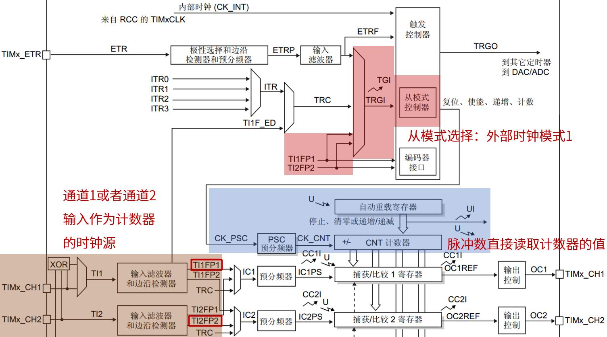
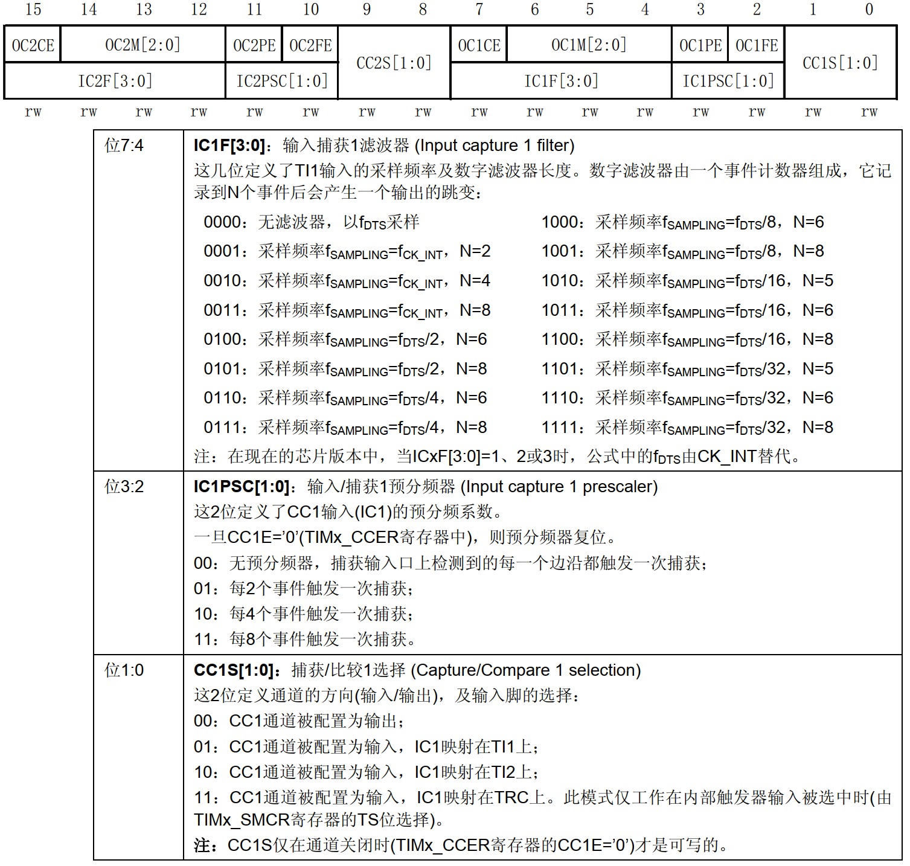
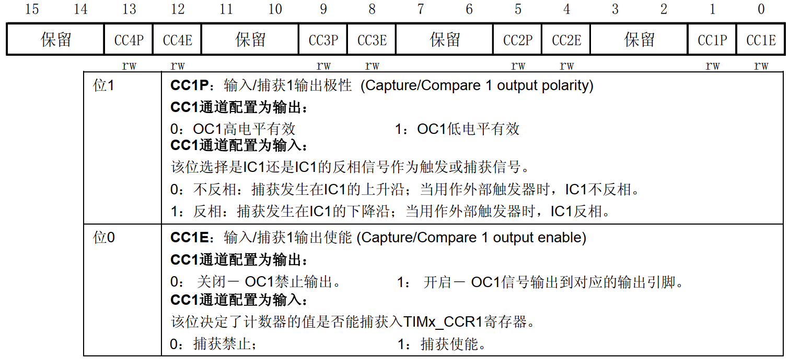
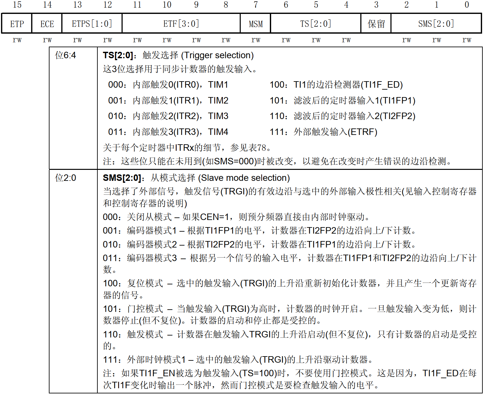

<!-- more -->

前面我们介绍了通用定时器的四类时钟源，这一节我们来学习使用通用定时器的外部时钟模式 1 这类时钟源。我们通过脉冲计数实验来学习。

## 一、需求说明

前面的三个通用定时器实验的时钟源都是来自内部时钟 (CK_INT)，在脉冲计数的使用中我们将使用外部时钟模式 1：外部输入引脚 (TIx)作为定时器的时钟源。关于这个外部输入引脚(TIx)，我们使用 WK_UP 按键按下产生的高电平脉冲作为定时器的计数器时钟，每按下一次按键产生一次高电平脉冲，计数器加一。  

## 二、定时器资源说明

外部时钟模式 1 的外部输入引脚只能是通道 1 或者通道 2 对应的 IO，通道 3或者通道 4 是不可以的。以通道 1 输入为例，外部时钟源信号通过通道 1 输入后，接下来我们用 TI1 表示该信号。 TI1 分别要经过滤波器、边沿检测器后，来到 TI1FP1，被触发输入选择器选择为触发源，接着来到从模式控制器。从模式选择为外部时钟模式 1，这时候外部时钟源信号就会到达时基单元的预分频器，后面就是经过分频后就作为计数器的计数时钟了。  

如果想要时钟源信号的上升沿和下降沿，计数器都计数，可以选择 TI1F_ED 作为触发输入选择器的触发源。  

假设计数器工作在递增计数模式，那么每来一个选择的边沿，计数器就加一。最后，外部时钟源信号的边沿计数个数会保存计数器寄存器中，我们只需要直接读取 CNT 的值即可。这里是没有考虑定时器溢出的情况，如果定时器溢出还需要对溢出进行处理。比如开启更新中断，定时器溢出后，在更新中断里，对溢出次数进行记录，然后用溢出次数乘以溢出一次计数的个数，再加上 CNT 现在的值，就可以得到总的计数个数了。  

## 三、相关寄存器

通用定时器脉冲计数实验需要用到的寄存器有： TIMx_ARR、 TIMx_PSC、 TIMx_CCMR1、TIMx_CCER、 TIMx_DIER、 TIMx_CR1、 TIMx_EGR 这些寄存器在前面的笔记都有提到，在这里只需针对性的介绍。  

### 1. 捕获/比较模式寄存器 1/2（TIMx_CCMR1/2）

该寄存器我们在 PWM 输出实验时讲解了他作为输出功能的配置，在输入捕获实验学习了输入捕获模式的配置，本小节我们的外部信号也同样要作为输入信号给定时器作为时钟源，所以我们要看输入捕获模式定时器对应功能。 WK_UP 按键（PA0）对应着定时器 2 的通道 1，这个可以在《 STM32中文数据手册 .pdf》 21 页找到。接下来我们开始配置TIMx_CCMR1 寄存器，其描述如图所示：  

用到定时器 2 的通道 1，所以要配置 TIM2_CCMR1 寄存器的位[7： 0]，其中 CC1S[1:0]，这两个位用于 CCR1 的通道配置，这里我们设置 IC1S[1:0]=01，也就是配置 IC1 映射在 TI1 上，即 CCR1 对应 TIMx_CH1。

输入捕获 1 预分频器 IC1PSC[1:0]，我们是 1 次高电平脉冲就触发 1 次计数，所以不用分频选择 00 即可。

输入捕获 1 滤波器 IC1F[3:0]，这个用来设置输入采样频率和数字滤波器长度，关于滤波长度的介绍请看上一个实验。这里，我们不做滤波处理，所以设置 IC1F[3:0]=0000，只要采集到上升沿，就触发捕获。  

### 2. 捕获/比较使能寄存器（TIMx_ CCER）  

TIM2/TIM3/TIM4/TIM5 的捕获/比较使能寄存器，该寄存器控制着各个输入输出通道的开关和极性。 TIMx_CCER 寄存器描述如图所示：

我们要用到这个寄存器的最低 2 位， CC1E 和 CC1P 位。要使能输入捕获，必须设置 CC1E=1，而 CC1P 则根据自己的需要来配置。我们这里是保留默认设置值 0，即高电平触发捕获。  

### 3. 从模式控制寄存器（TIMx_ SMCR）  

TIM2/TIM3/TIM4/TIM5 的从模式控制寄存器，该寄存器用于配置从模式，以及定时器的触发源相关的设置。 TIMx_SMCR 寄存器描述如图所示。

因为我们要让外部引脚脉冲信号作为定时器的时钟源，所以位[2:0]我们设置的值是 111，即外部时钟模式 1。位[6:4]是触发选择设置， TIMx_CH1 对应 TI1FP1， TIMx_CH2 则对应 TI2FP2，我们是定时器通道 1，所以需要配置的值为 101。 ETF[3:0]和 ETPS[1:0]分别是外部触发滤波器和外部触发预分频器，我们没有用到。  

### 2. 其他相关寄存器  

DMA/中断使能寄存器： TIMx_DIER。脉冲计数功能需要用到定时器更新中断，在中断服务函数中累加定时器溢出的次数，所以需要使能定时器的更新中断，即 UIE 置 1。

控制寄存器 1： TIMx_CR1，我们只用到了它的最低位，也就是用来使能定时器的。
