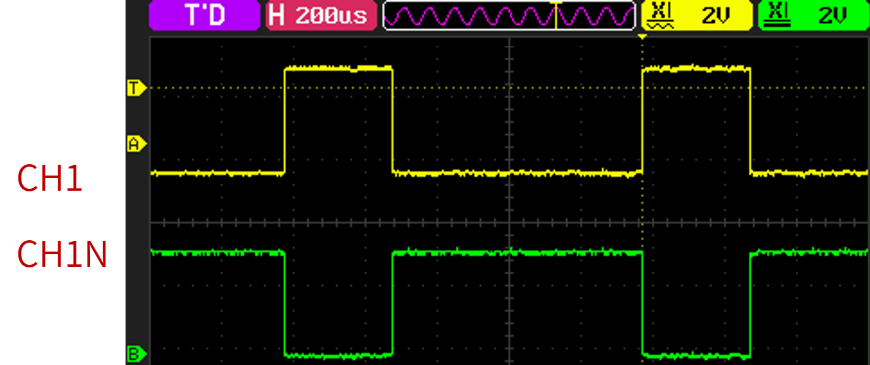
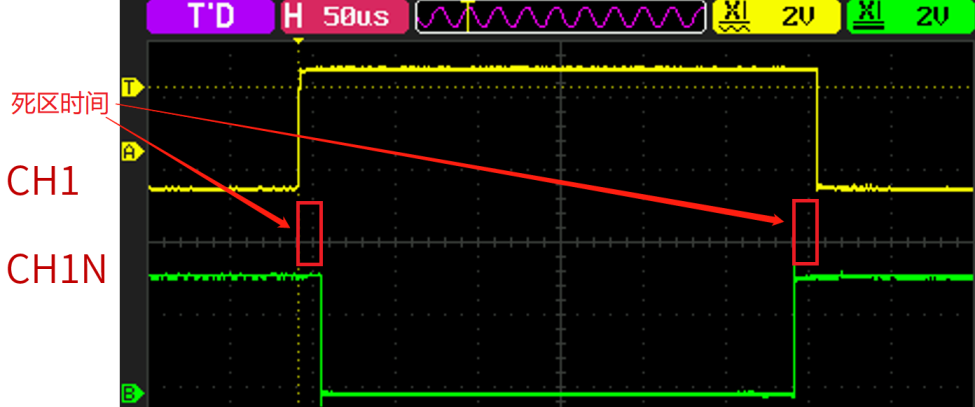
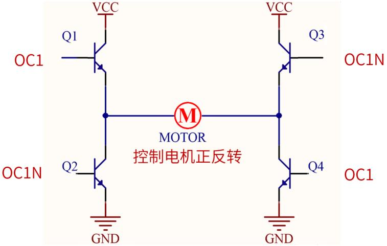
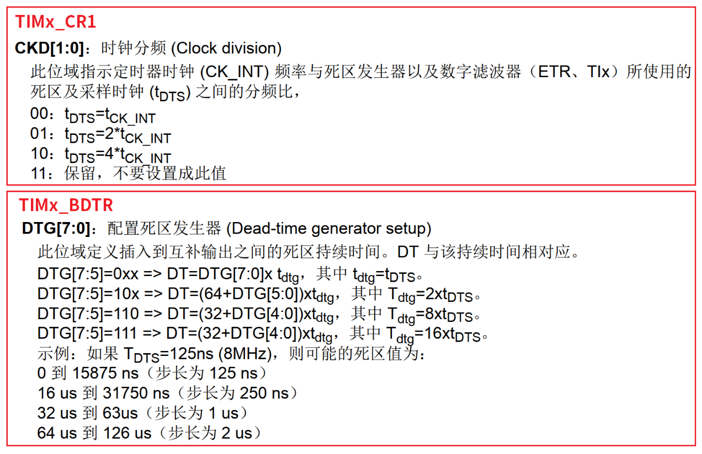
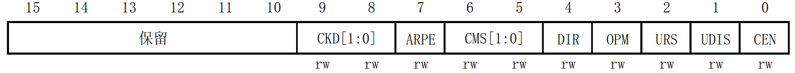
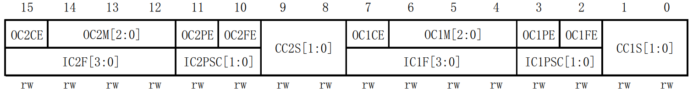
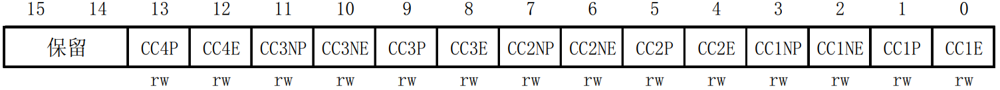
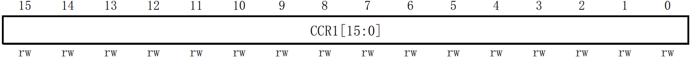
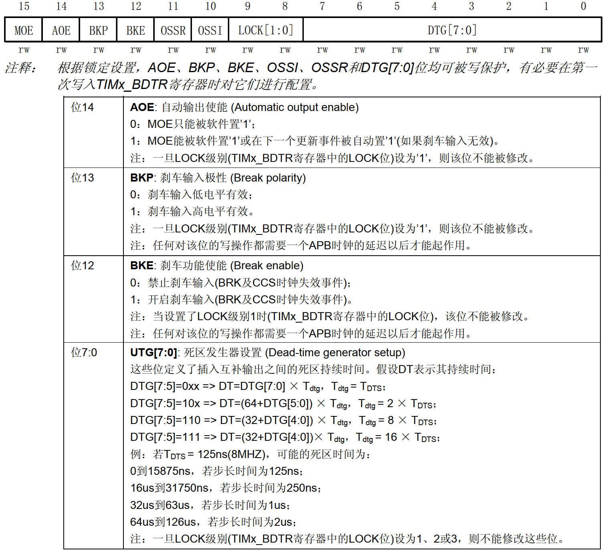

<!-- more -->

## 一、基本概念

什么是互补输出？还带死区控制？  我们来简单了解一下。关于互补输出和死区插入的更多内容可以看《STM32F10xxx 参考手册_V10（中文版） .pdf》手册的 13.3.11 小节 。

### 1. 互补输出

    图一-1 互补输出

上图中， CH1 输出黄色的 PWM，它的互补通道 CH1N 输出绿色的 PWM。通过对比，可以知道这两个 PWM 刚好是反过来的， CH1 的 PWM 为高电平期间， CH1N 的 PWM 则是低电平，反之亦然，这就是互补输出。  

### 2. 死区控制

    图一-2 带死区控制的互补输出

上图中， CH1 输出的 PWM 和 CH1N 输出的 PWM 在高低电平转换间，插入了一段时间才实现互补输出。这段时间称为死区时间，可以通过 DTG[7:0]位配置控制死区时间的长度，后面会详细学习如何配置死区时间。上图中，箭头指出的两段死区时间的长度是一样的，因为都是由同一个死区发生器产生。  

### 3. 有什么用？

理解了互补输出和带死区控制的互补输出，我们下面来看一下带死区控制的互补输出有什么用。带死区控制的互补输出经常被用于控制电机的 H 桥中，下面给大家画了一个 H 桥的简图：  

    图一-3 H 桥简图

上图是 H 桥的简图，实际控制电机正反转的 H 桥会根据复杂些，而且更多的是使用MOS 管，这里只是为了解释带死区控制的互补输出在 H 桥中的控制逻辑原理，我们理解原理就行。上图的 H 桥搭建全部使用的是 NPN，并且导通逻辑都是基极为高电平时导通。如果 Q1和 Q4 三极管导通，那么电机的电流方向是从左到右（假设电机正转）；如果 Q2 和 Q3 三极管导通，那么电机的电流方向是从右到左（假设电机反转）。上述就是 H 桥控制电机正反转的逻辑原理。但是同一侧的三极管是不可以同时导通的，否则会短路，比如： Q1 和 Q2 同时导通或者 Q3 和 Q4 同时导通，这都是不可取的。

我们想一下 图一-1 的 OC1（CH1）和 OC1N（CH1N）输出的 PWM 输入到 图一-3 的 H 桥中，会怎样？按理来说应该是 OC1N 输出高电平的时候， OC1 输出就是低电平，刚好Q2 和 Q3 导通，电机的电流方向是从右到左（假设电机反转）；反之， OC1 输出高电平的时候，OC1N 输出就是低电平，刚好 Q1 和 Q4 导通，电机的电流方向是从左到右（假设电机正转），这似乎已经完美解决电机正反转问题了。实际上，元器件是有延迟特性的，比如：控制信号从OC1 传导至电机，是要经过一定的时间的，复杂的 H 桥电路更是如此。由于元器件特性，就会导致直接使用互补输出信号驱动 H 桥时存在短路现象。为了避免这种情况，于是就有了带死区控制的互补输出来驱动 H 桥电路。如 图一-2 的死区时间就是为了解决元器件延迟特性的。用户必须根据与输出相连接的器件及其特性（电平转换器的固有延迟、开关器件产生的延迟）来调整死区时间。  

### 4. 死区时间计算  

面来看一下定时器的死区时间是怎么计算并设置的？死区时间是由 TIMx_CR1 寄存器的CKD[1:0]位和 TIMx_BDTR 寄存器的 DTG[7:0]位来设置，如下图所示：  

死区时间计算分三步：  

第一步：通过 CKD[1:0]位确定 tDTS。根据 CKD[1:0]位的描述，可以得到下面的式子：  
$$
tDTS=\frac{2^{CKD[1:0]}}{Tclk}
$$
其中：CKD\[1:0\]： CKD\[1:0\]位设置的值。Tclk： 定时器的时钟源频率（单位为 MHz）。  假设定时器时钟源频率是 72MHz，我们设置 CKD\[1:0\]位的值为 2，代入上面的式子可得：  
$$
tDTS=\frac{2^{CKD[1:0]}}{Tclk}=\frac{2^2}{72000000}=\frac{4}{72000000}=55.56ns
$$
通过上式可得 tDTS 约等于 55.56ns，本实验例程中我们也是这样设置的。

第二步：根据 DTG[7:5]选择计算公式。  

第三步：代入选择的公式计算。  

举个例子，假设定时器时钟源频率是 72MHz，我们设置 CKD[1:0]位的值为 2，DTG[7:0]位的值为 250。从上面的例子知道 CKD[1:0]位的值为 2，得到的 tDTS=55.56ns。下面来看一下 DTG[7:0]位的值为 250，应该选择 DTG[7:0]位描述中哪条公式？ 250 的二进制数为11111010，即DTG[7:5]为 111，所以选择第四条公式：
$$
DT=(32+ DTG[4:0]) * t_{dtg}
$$
 其中 t dtg = 16\* tDTS。可以看到手册上的式子符号大小写乱乱的，这里大小写不敏感。由手册的公式可以得到 
$$
DT = (32+ DTG[4:0]) * 16 * tDTS = (32+ 26) * 16 * 55.56ns = 51559.68ns = 51.56us
$$
即死区时间为 51.56us。死区时间计算方法就给学习到这里。

## 二、相关寄存器

高级定时器互补输出带死区控制除了用到定时器的时基单元：计数器寄存器(TIMx_CNT)、预分频器寄存器(TIMx_PSC)、自动重载寄存器(TIMx_ARR) 之外。主要还用到一些寄存器。  

### 1. 控制寄存器 1（TIMx_CR1）

TIM1/TIM8 的控制寄存器 1 描述如图：

上图中我们只列出了本实验需要用的一些位，其中：位 7（APRE）用于控制自动重载寄存器是否进行缓冲，在基本定时器的时候已经学习过了。本实验中，我们把该位置 1。

CKD\[1:0\]位指示定时器时钟（CK_INT）频率与死区发生器以及数字滤波器（ETR、 TIx）所使用的死区及采样时钟（tDTS）之间的分频比。我们设置 CKD\[1:0\]位为 10，结合高级定时器时钟源频率等于 APB2 总线时钟频率，即 72MHz，可以得到 tDTS=55.56ns。

CEN 位，用于使能计数器的工作，必须要设置该位为 1，才可以开始计数。  

### 2. 捕获/比较模式寄存器 1/2（TIMx_CCMR1/2）

TIM1/TIM8 的捕获/比较模式寄存器（ TIMx_CCMR1/2），该寄存器一般有 2 个：TIMx_CCMR1 和 TIMx _CCMR2。TIMx_CCMR1 控制 CH1 和 CH2，而 TIMx_CCMR2 控制 CH3和 CH4。 TIMx_CCMR1 寄存器描述如图：

该寄存器的有些位在不同模式下，功能不一样，我们现在用到输出比较模式。关于该寄存器的详细说明，可以参考《STM32F10xxx 参考手册_V10（中文版） .pdf》 第 240 页。

我们本次要用到定时器 1 输出比较的通道 1，所以我们需要配置 TIM1_CCMR1 模式设置位 OC1M[2:0]，我们使用的是 PWM 模式 1，所以这 3 位必须设置为 110。  

### 3. 捕获/比较使能寄存器（TIMx_ CCER）  

TIM1/TIM8 的捕获/比较使能寄存器，该寄存器控制着各个输入输出通道的开关和极性。TIMx_CCER 寄存器描述如图：

该寄存器比较简单，要让 TIM1 的通道 1 输出，我们需要把对应的捕获/比较 1 输出使能位CC1E 置 1。我们需要实现互补输出，所以还需要把 CC1NE 位置 1，使能互补通道输出。 CC1P 和 CC1NP 分别是通道 1 输出和通道 1 互补输出的极性设置位。这里我们把CC1P 和 CC1NP 位都置 1，即输出极性为低，就可以得到互补的 PWM。  

### 4. 捕获/比较寄存器 1/2/3/4（TIMx_CCR1/2/3/4）  

捕获/比较寄存器（TIMx_ CCR1/2/3/4）， 该寄存器总共有 4 个，对应 4 个通道 CH1\~CH4。我们使用的是通道 1，所以来看看 TIMx_ CCR1 寄存器描述如图 ：

该寄存器 16 位有效位，我们可以通过改变该寄存器的值来改变 PWM 的占空比。  

### 5. 断路和死区寄存器（TIMx_ BDTR）  

TIM1/TIM8 断路和死区寄存器，该寄存器各位描述如图：

该寄存器控制定时器的断路和死区控制的功能。 我们先看断路控制，用到断路输入功能（断路输入引脚为 PE15）， 位 BKE 置 1 即可。

位 BKP 选择断路输入信号有效电平。本实验中，我们选择高电平有效，即 BKP 置 1。

位 AOE 是自动输出使能位，如果使能 AOE 位， 那么在我们输入刹车信号后再断开了刹车信号，互补的 PWM 会自动恢复输出，如果失能 AOE 位，那么在输入刹车信号后再断开了刹车信号，互补的 PWM 就不会恢复输出，而是一直保持刹车信号输入时的状态。为了方便观察，我们使能该位，即置 1。    

位 MOE 是使能主输出，想要高级定时器的通道正常输出，则必须设置 MOE 位为 1。  

最后是 DTG\[7:0\]位，用于设置死区时间，前面已经学习过了。这里我们吧 CKD\[1:0\] 设置为 10，定时器时钟源频率是 72MHz，所以 `tDTS = 55.56ns`。这个实验 DTG[7:0]位的值设置为十进制 100，即二进制数 0110 0100。 DTG[7:5]=011，符合第一条式子： `DT=DTG[7:0] * t dtg`， 其中` t dtg = tDTS`。 DT 是死区时间，可以得到 `DT = 100*55.56ns = 5. 56us`。
