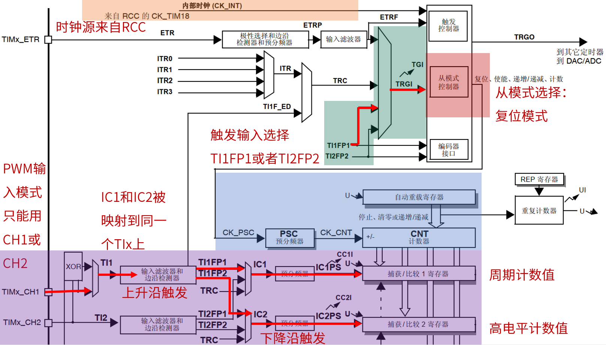
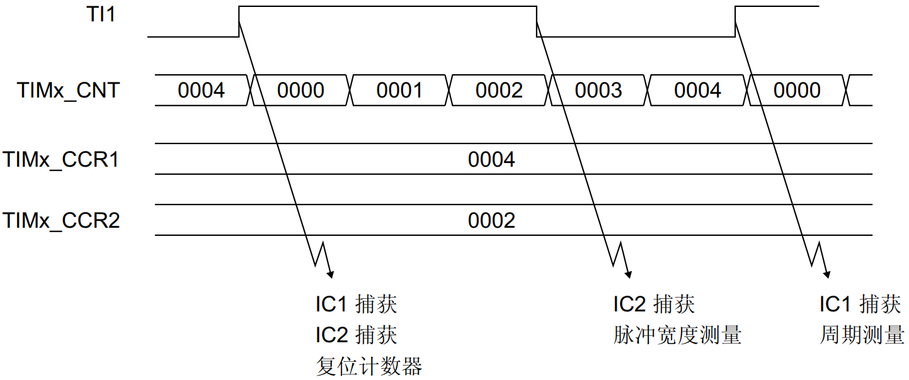
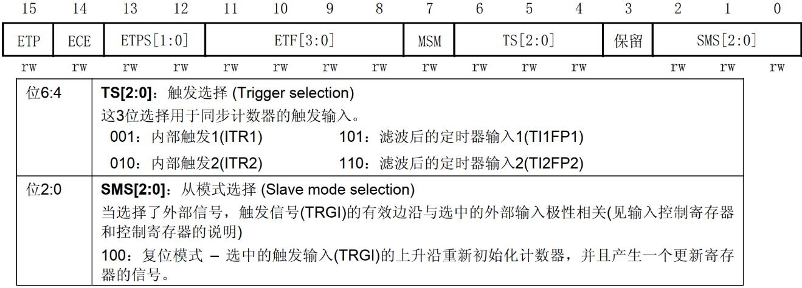
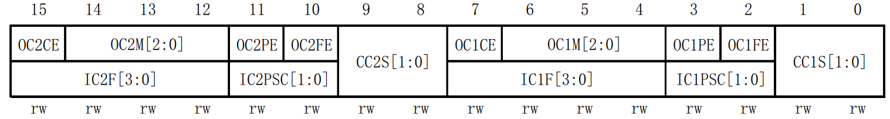
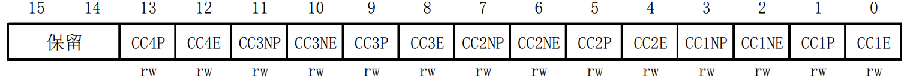
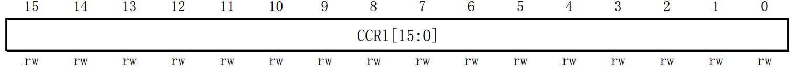
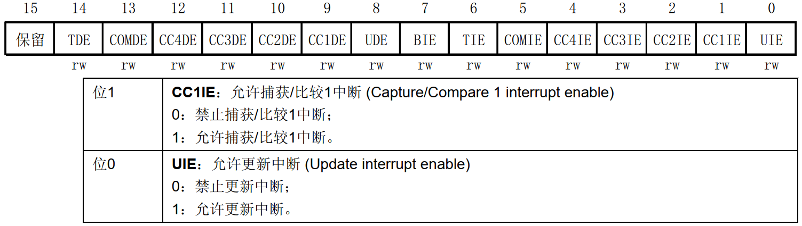

<!-- more -->

本小节我们来学习使用高级定时器 PWM 输入模式， 此模式是输入捕获模式的一个特例。PWM 输入模式经常被应用于测量 PWM 脉宽和频率。 PWM 输入模式在《STM32F10xxx 参考手册_V10（中文版） .pdf》 手册 216 页有详细的文字描述。

## 一、工作原理

第一，确定定时器时钟源。本实验中我们使用内部时钟（CK_INT）， F1 系列高级定时器挂载在 APB2 总线上，按照 sys_stm32_clock_init 函数的配置， 定时器时钟频率等于 APB2 总线时钟频率，即 72MHz。计数器的计数频率确定了测量的精度。

第二，确定 PWM 输入的通道。 PWM 输入模式下测量 PWM， PWM 信号输入只能从通道1（CH1）或者通道 2（CH2）输入。

第三，确定 IC1 和 IC2 的捕获边沿。这里以通道 1（CH1）输入 PWM 为例，一般我们习惯设置 IC1 捕获边沿为上升沿捕获， IC2 捕获边沿为下降沿捕获。

第四，选择触发输入信号（TRGI）。这里也是以通道 1（CH1）输入 PWM 为例，那么我们就应该选择 TI1FP1 为触发输入信号。如果是通道 2（CH2）输入 PWM，那就选择 TI2FP2 为触发输入信号。可以看到这里并没有对应通道 3（CH3）或者通道 4（CH4）的触发输入信号，所
以我们只选择通道 1 或者通道 2 作为 PWM 输入的通道。

第五，从模式选择：复位模式。复位模式的作用是：在出现所选触发输入 (TRGI) 上升沿时，重新初始化计数器并生成一个寄存器更新事件。

第六，读取一个 PWM 周期内计数器的计数个数，以及高电平期间的计数个数，再结合计数器的计数周期（即计一个数的时间），最终通过计算得到输入的 PWM 周期和占空比等参数。以通道 1（CH1）输入 PWM，设置 IC1 捕获边沿为上升沿捕获， IC2 捕获边沿为下降沿捕获为例，那么CCR1 寄存器的值+1 就是 PWM 周期内计数器的计数个数， CCR2 寄存器的值+1 就是PWM 高电平期间计数器的计数个数。通过这两个值就可以计算出 PWM 的周期或者占空比等参数。  

以通道 1（CH1）输入 PWM，设置 IC1 捕获边沿为下降沿捕获， IC2 捕获边沿为上升沿捕获为例，那么 CCR1 寄存器的值+1 依然是 PWM 周期内计数器的计数个数，但是CCR2 寄存器的值+1 就是 PWM 低电平期间计数器的计数个数。通过这两个得到的参数依然可以计算出 PWM 的其它参数。一般我们使用第六介绍的例子。  

下面我们结合 PWM 输入模式时序来分析一下。 PWM输入模式时序图如图：

上图是以通道 1（CH1）输入 PWM，设置 IC1 捕获边沿为上升沿捕获， IC2 捕获边沿为下降沿捕获为例的 PWM 输入模式时序图。  

从时序图可以看出，计数器的计数模式是递增计数模式。从左边开始看， 当 TI1 来了上升沿时，计数器的值被复位为 0（原因是从模式选择为复位模式）， IC1 和 IC2 都发生捕获事件。然后计数器的值计数到 2 的时候， IC2 发生了下降沿捕获，捕获事件会导致这时候的计数器的值被锁存到 CCR2 寄存器中，该值+1 就是高电平期间计数器的计数个数。最后计数器的值计数到 4 的时候， IC1 发生了上升沿捕获，捕获事件会导致这时候的计数器的值被锁存到 CCR1 寄存器中，该值+1 就是 PWM 周期内计数器的计数个数。

假设计数器的计数频率是 72MHz，那我们就可以计算出这个 PWM 的周期、频率和占空比等参数了。下面就以这个为例计算一下。由计数器的计数频率为 72MHz，可以得到计数器计一个数的时间是 13.8ns（即测量的精度是 13.8ns）。知道了测量精度，再来计算 PWM 的周期， PWM 周期 =(4+1)\*(1/72000000) = 69.4ns，那么 PWM 的频率就是 14.4MHz。占空比 =(2+1)/(4+1) =3/5（即占空比为 60%）。  

## 二、相关寄存器

高级定时器 PWM 输入模式实验除了用到定时器的时基单元：计数器寄存器(TIMx_CNT)、预分频器寄存器(TIMx_PSC)、自动重载寄存器(TIMx_ARR) 之外，还会用到一些寄存器，这里我们了解一下。  

### 1. 从模式控制寄存器（TIMx_SMCR）

TIM1/TIM8 的从模式控制寄存器描述如图：

该寄存器的 SMS[2:0]位，用于从模式选择。比如在本实验中我们需要用到复位模式，所以设置 SMS[2:0]=100。 TS[2:0]位是触发选择，我们设置为滤波后的定时器输入 1 (TI1FP1)，即TS[2:0]为 101。  

### 2. 捕获/比较模式寄存器 1/2（TIMx_CCMR1/2）

TIM1/TIM8 的捕获/比较模式寄存器（ TIMx_CCMR1/2），该寄存器一般有 2 个：TIMx_CCMR1 和 TIMx _CCMR2。TIMx_CCMR1 控制 CH1 和 CH2，而 TIMx_CCMR2 控制 CH3和 CH4。 TIMx_CCMR1 寄存器描述如图：

该寄存器的有些位在不同模式下，功能不一样，我们现在用到输入捕获模式。关于该寄存器的详细说明，可以参考《STM32F10xxx 参考手册_V10（中文版） .pdf》 第 240 页， 13.4.7 节。本实验我们通过定时器 1 通道 1 输入 PWM 信号，所以 IC1 和 IC2 都映射到 TI1 上。配置
CC1S[1:0]=01、 CC2S [1:0]=10， 其他位不用设置，默认为 0 即可。  

### 3. 捕获/比较使能寄存器（TIMx_ CCER）  

TIM1/TIM8 的捕获/比较使能寄存器，该寄存器控制着各个输入输出通道的开关和极性。TIMx_CCER 寄存器描述如图：

IC1 捕获上升沿，所以 CC1P 位置 0，即捕获发生在 IC1 的上升沿。 IC2 捕获下降沿，所以CC2P 位置 1，即捕获发生在 IC1 的下降沿。设置好捕获边沿后，还需要使能这两个通道捕获，即 CC1E 和 CC2E 位置 1。  

### 4. 捕获/比较寄存器 1/2/3/4（TIMx_CCR1/2/3/4）  

捕获/比较寄存器（TIMx_CCR1/2/3/4），该寄存器总共有 4 个，对应 4 个通道 CH1\~CH4。我们使用的是通道 1，所以来看看 TIMx_CCR1 寄存器描述如图：

本实验中， CCR1 寄存器用于获取 PWM 周期内计数器的计数个数。 CCR2 寄存器用于获取PWM 高电平期间计数器的计数个数。  

### 5. DMA/中断使能寄存器（TIMx_DIER）  

DMA/中断使能寄存器描述如图 ：

该寄存器位 0（UIE）用于使能或者禁止更新中断，因为本实验我们用到更新中断，所以该位需要置 1。位 1（CC1IE）用于使能或者禁止捕获/比较 1 中断，我们用到捕获中断，所以该位需要置 1。  
