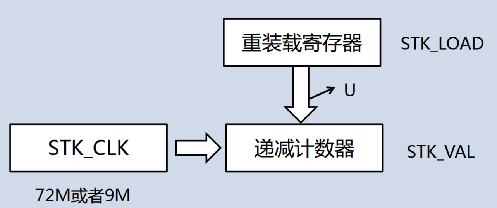
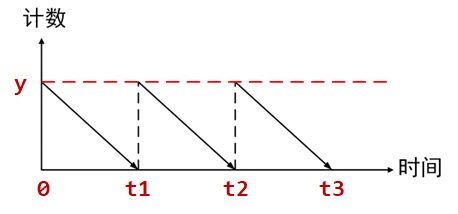
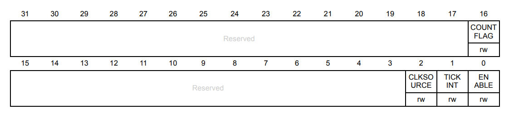
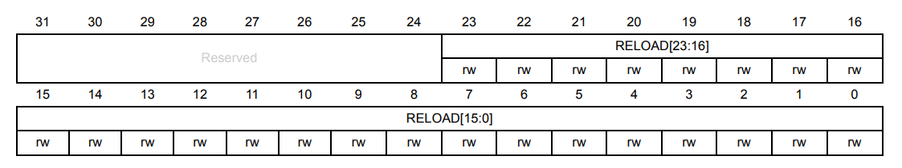
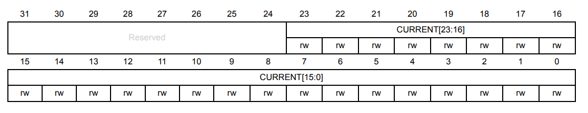
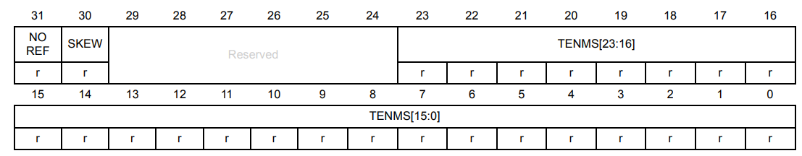
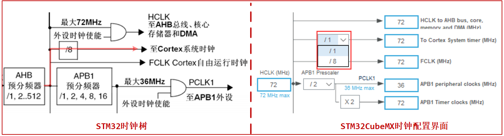
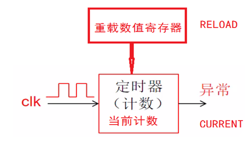
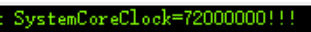
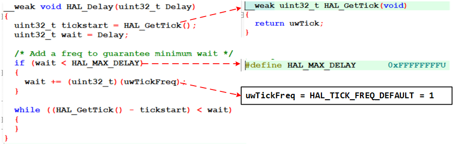

<!-- more -->


这一部分我们可以查看[Cortex-M3 权威指南](https://picture.iczhiku.com/resource/upload/6820519db1f84e7faaf51c573c48e013.pdf)的 第8章NVIC与中断控制 中的 SysTick定时器  小节。

## 一、SysTick定时器简介

SysTick定时器(又名系统滴答定时器)是存在于Cortex-M3的一个定时器，只要是ARM Cotex-M系列内核的MCU都包含这个定时器。使用内核的SysTick定时器来实现延时，可以不占用系统定时器，节约资源。由于SysTick是在CPU核内部实现的，跟MCU外设无关， 因此它的代码可以在不同厂家之间移植。  

SysTick定时器被捆绑在NVIC中，用于产生SYSTICK异常（异常号： 15）。在以前，大多操作系统需要一个硬件定时器来产生操作系统需要的滴答中断，作为整个系统的时基。例如，为多个任务许以不同数目的时间片，确保没有一个任务能霸占系统；或者把每个定时器周期的某个时间范围赐予特定的任务等，还有操作系统提供的各种定时功能，都与这个滴答定时器有关，有了它，就可以根据这个中断，系统就可以实现时间片的计算从而切换进程。因此，需要一个定时器来产生周期性的中断，而且最好还让用户程序不能随意访问它的寄存器，以维持操作系统“心跳”的节律。

Cortex‐M3处理器内部包含了一个简单的定时器。因为所有的CM3芯片都带有这个定时器，软件在不同 CM3器件间的移植工作得以化简。该定时器的时钟源可以是内部时钟（FCLK，CM3上的自由运行时钟），或者是外部时钟（ CM3处理器上的STCLK信号）。不过， STCLK的具体来源则由芯片设计者决定，因此不同产品之间的时钟频率可能会大不相同，需要检视芯片的器件手册来决定选择什么作为时钟源。

SysTick定时器能产生中断， CM3为它专门开出一个异常类型，并且在向量表中有它的一席之地。它使操作系统和其它系统软件在CM3器件间的移植变得简单多了，因为在所有CM3产品间对其处理都是相同的。  

## 二、基本原理

### 1. 原理介绍

SysTick定时器是一个24位递减定时器，即计数器可以从最大值2^24开始， 每个时钟周期减1，当减到0时，会产生Systick异常，同时再自动重载定时初值，开始新一轮计数。如下图递减计数器在时钟的驱动下，从重装载寄存器初值开始往下递减计数到0，产生中断和置位COUNTFLAG标志。然后又从重装载寄存器初值值开始重新递减计数，如此循环。  




 通过设置这个重装载寄存器初值，就可以实现得到指定时间。如下图所示：



 y为定时器初值，然后随着时间增加， 值逐渐减小，直至为0，再重新加载初值，如此往复，0\~t1、 t1\~t2、 t2\~t3这些时间段，就是我们需要的延时时间。  

假设STM32F103工作在72MHz，即72000000Hz，意味着1s时间内，会计数72000000次。那么1ms则计数72000000/1000=72000次。这个72000就可以作为系统滴答定时器的初始值，将这个值写入系统滴答定时器，定时器在每个时钟周期减1，减到0时，就刚好是1ms，同时产生中断通知，再次加载72000到系统滴答定时器。如此反复。 HAL库提供“ HAL_SYSTICK_Config()”函数去设置这个初始值 。

### 2. 定时时长

（1）t：一个计数循环的时间，跟reload和CLK有关

```c
reload * (1 / clk)
```

（2）CLK： 72M或者9M，由CTRL寄存器配置

```c
Clk = 72M时， reload=72：t = (72) *(1/72M) = 1US      
Clk = 72M时， reload=72000：t = (72000) *(1/ 72 M )= 1MS
```

（3）RELOAD： 24位，用户自己配置  

```c
0~0xFFFFFF
```

（4）时间换算

```c
1s = 1000ms = 1000 000 us = 1000 000 000ns
```


## 三、相关寄存器

对于STM32的系统滴答定时器相关的寄存器我们可以查看 [STM32F10xxx_Cortex-M3编程手册](https://www.st.com/resource/en/programming_manual/pm0056-stm32f10xxx20xxx21xxxl1xxxx-cortexm3-programming-manual-stmicroelectronics.pdf) 的4.5 SysTick timer (STK)这一节。

### 1. 控制和状态寄存器（ STK_CTRL）  



相关位说明如下：

| 位段     | 名称      | 类型 | 复位值 | 描述                                                         |
| -------- | --------- | :--: | :----: | ------------------------------------------------------------ |
| [31:17 ] | RESERVED  |  R   |   0    | 保留位                                                       |
| [16]     | COUNTFLAG |  RW  |   0    | 如果在上次读取本寄存器后，计数器已经计到 了 0，则该位为 1；读取该位，该位将自动清零 |
| [15:3]   | RESERVED  |  R   |   0    | 保留                                                         |
| [2]      | CLKSOURCE |  RW  |   0    | 0=AHB/8；1=处理器时钟(AHB)                                   |
| [1]      | TICKINT   |  RW  |   0    | 1=计数器计数到 0 时产生 SysTick 异常请求 0=计数器计数到 0 时不产生异常 |
| [0]      | ENABLE    |  RW  |   0    | SysTick 定时器的使能位                                       |

重点关注Bit[0]，用于使能系统滴答定时器， Bit[1]使能系统滴答定时器中断， Bit[2]系统滴答时钟的时钟来源。  

### 2. 加载值寄存器（ STK_LOAD）  



| 位段    | 名称     | 类型 | 复位值 | 描述                                                        |
| ------- | -------- | :--: | :----: | ----------------------------------------------------------- |
| [31:24] | RESERVED |  R   |   0    | 保留位                                                      |
| [23:0]  | RELOAD   |  RW  |   0    | 当计数器向下计数到 0 时,下一个时钟滴答定 时器将重新装载的值 |

Bit[23:0]，一共24位，用来设置系统滴答定时器的初始值，因此范围为1~ 16777216。 

### 3. 当前值寄存器（ STK_VAL）  



| 位段    | 名称     | 类型 | 复位值 | 描述                                                         |
| ------- | -------- | :--: | :----: | ------------------------------------------------------------ |
| [31:24] | RESERVED |  R   |   0    | 保留位                                                       |
| [23:0]  | RELOAD   |  RW  |   0    | 读取时返回当前计数的值，写它则使之清零，<br> 同时还会清除在 SysTick 控制及状态寄存器 中的 COUNTFLAG 标志 |

Bit[23:0]，一共24位，用来获取当前系统滴答定时器的计数值。  

### 4. 校准值寄存器（ STK_CALIB）  



| 位段    | 名称     | 类型 | 复位值 | 描述                                                         |
| ------- | -------- | :--: | :----: | ------------------------------------------------------------ |
| [31]    | NOREF    |  R   |   -    | 1=没有外部参考时钟（ STCLK 不可用； 0=外部参考时钟可用       |
| [30]    | SKEW     |  R   |   -    | 1=校准值不是准确的 10ms；0=校准值是准确的 10ms               |
| [29:24] | RESERVED |  R   |   0    | 保留                                                         |
| [23:0]  | TENMS    |  RW  |   0    | 10ms 校准值。芯片设计者应该通过 Cortex-M3 的输入信号提供该数值。若该值读回零，则表 示无法使用校准功能 |

这个寄存器没用到，可以不用管。 此外，当处理器在调试期间被暂停（ halt ）时， 系统滴答定时器也将暂停运作。  

## 四、时钟来源

我们了解了寄存器之后其实就可以编程了，但是还有一个问题，那就是，它的时钟哪来的？我们看一下STM32的时钟树的这一部分：



我们可以看左侧图红线这一条路，AHB时钟讲过1或者8分频后送至Cortex系统时钟，系统滴答定时器使用的就是这个时钟，在这个时钟的驱动下，Cortex-M3内核中的系统滴答定时器寄存器值就开始递减：



SysTick 的时钟源自 HCLK，假设配置系统时钟为 72MHZ，经过分频器 8 分频后，那么 SysTick 的时钟即为 9Mhz，也就是 SysTick 的计数器 VAL 每减 1，就代表时间过了 1/9us。 

> Tips：注意这里配置没有用，后来分析过程中发现这里的分频修改根本影响不到STK_CTRL寄存器的CLKSOURCE位，后面就会分析到了。

## 五、中断优先级？

SysTick属于内核里面的外设，他的中断优先级跟片上的外设的中断优先级相比，哪个高？  

systick中断优先级配置的是scb&rarr;shprx寄存器；而外设的中断优先级配置的是nvic&rarr;iprx，有优先级分组，有抢占优先级和子优先级的说法。STM32里面无论是内核还是外设都是使用4个二进制位来表示中断优先级。    

中断优先级的分组对内核和外设同样适用。当比较的时候，只需要把内核外设的中断优先级的四个位按照外设的中断优先级来分组来解析即可，即人为的分出抢占优先级和子优先级。  

## 六、相关HAL库函数

HAL库函数对系统滴答定时器的相关操作在这里：

### 1. HAL_Init()中的配置

```c
main()--->HAL_Init()--->HAL_InitTick()--->HAL_SYSTICK_Config()
```

#### 1.1 HAL_Init()  

我们先来看一下这个 HAL_Init 函数：

```c
HAL_StatusTypeDef HAL_Init(void)
{
  // 中间部分省略...
  /* Set Interrupt Group Priority */
  HAL_NVIC_SetPriorityGrouping(NVIC_PRIORITYGROUP_4);

  /* Use systick as time base source and configure 1ms tick (default clock after Reset is HSI) */
  HAL_InitTick(TICK_INT_PRIORITY);
  // 中间部分省略...
}
```

首先是 HAL_NVIC_SetPriorityGrouping函数设置了NVIC中断分组为组4，这个是我们在STM32CubeMX中配置的。然后调用了 HAL_InitTick() 函数来初始化系统滴答定时器，传入的参数为 TICK_INT_PRIORITY，它起始就是个 0 ：

```c
#define  TICK_INT_PRIORITY            0U    /*!< tick interrupt priority (lowest by default)  *
```

#### 1.2 HAL_InitTick()

```c
__weak HAL_StatusTypeDef HAL_InitTick(uint32_t TickPriority)
{
  /* Configure the SysTick to have interrupt in 1ms time basis*/
  if (HAL_SYSTICK_Config(SystemCoreClock / (1000U / uwTickFreq)) > 0U)
  {
    return HAL_ERROR;
  }

  /* Configure the SysTick IRQ priority */
  if (TickPriority < (1UL << __NVIC_PRIO_BITS))
  {
    HAL_NVIC_SetPriority(SysTick_IRQn, TickPriority, 0U);
    uwTickPrio = TickPriority;
  }
  else
  {
    return HAL_ERROR;
  }

  /* Return function status */
  return HAL_OK;
}
```

进来之后发现，这是个弱函数哎，我们打开对应的头文件会发现，声明的时候并没有带\_\_weak符号：

```c
HAL_StatusTypeDef HAL_InitTick(uint32_t TickPriority);
```

这就说明，当我们没有重写这个函数的时候，默认会调用这个弱函数。我们先看下边的 HAL_NVIC_SetPriority这一行，这里就是在设置系统滴答定时器中断的优先级，从 TICK_INT_PRIORITY 宏我们知道这里形参 TickPriority 的值就是 0，具体的就先不看了。我们再来看一下滴答定时器配置时传入的参数：

```c
HAL_SYSTICK_Config(SystemCoreClock / (1000U / uwTickFreq))
```

我们追踪一下这里的两个参数：

```c
uint32_t SystemCoreClock = 16000000;// 定义时的默认值，后边配置时钟的时候这个值会被修改

HAL_TickFreqTypeDef uwTickFreq = HAL_TICK_FREQ_DEFAULT;  /* 1KHz */
```

这个 HAL_TICK_FREQ_DEFAULT是什么？我们继续追踪：

```c
typedef enum
{
  HAL_TICK_FREQ_10HZ         = 100U,
  HAL_TICK_FREQ_100HZ        = 10U,
  HAL_TICK_FREQ_1KHZ         = 1U,
  HAL_TICK_FREQ_DEFAULT      = HAL_TICK_FREQ_1KHZ
} HAL_TickFreqTypeDef;
```

从这里我们知道 HAL_TICK_FREQ_DEFAULT 的值为1，于是，上边传入 HAL_SYSTICK_Config()函数的参数就为：

```c
SystemCoreClock / (1000U / uwTickFreq) = 16000000 / (1000 / 1) = 16000
// 即
if (HAL_SYSTICK_Config(16000) > 0U)
{
    return HAL_ERROR;
}
```

#### 1.3 HAL_SYSTICK_Config()

```c
uint32_t HAL_SYSTICK_Config(uint32_t TicksNumb)
{
   return SysTick_Config(TicksNumb);
}
```

这个就简单了，直接返回了另一个函数调用后的值，新调用的函数的形参 TicksNumb 就等于 上边计算出来的 16000。

#### 1.4 SysTick_Config

```c
__STATIC_INLINE uint32_t SysTick_Config(uint32_t ticks)
{
  if ((ticks - 1UL) > SysTick_LOAD_RELOAD_Msk)
  {
    return (1UL);                                                   /* Reload value impossible */
  }

  SysTick->LOAD  = (uint32_t)(ticks - 1UL);                         /* set reload register */
  NVIC_SetPriority (SysTick_IRQn, (1UL << __NVIC_PRIO_BITS) - 1UL); /* set Priority for Systick Interrupt */
  SysTick->VAL   = 0UL;                                             /* Load the SysTick Counter Value */
  SysTick->CTRL  = SysTick_CTRL_CLKSOURCE_Msk |
                   SysTick_CTRL_TICKINT_Msk   |
                   SysTick_CTRL_ENABLE_Msk;                         /* Enable SysTick IRQ and SysTick Timer */
  return (0UL);                                                     /* Function successful */
}
```

在这个函数中对系统滴答定时器的寄存器进行配置，可以看到加载值寄存器的值配置为了 ticks -1 ,按前边的16000算的话，这里应该是15999。

我们再看一下SysTick_CTRL_CLKSOURCE_Msk，追踪一下就会发现这个是个宏，然后值是这个：

```c
#define SysTick_CTRL_CLKSOURCE_Pos          2U                                            /*!< SysTick CTRL: CLKSOURCE Position */
#define SysTick_CTRL_CLKSOURCE_Msk         (1UL << SysTick_CTRL_CLKSOURCE_Pos)            /*!< SysTick CTRL: CLKSOURCE Mask */
```

也就是说 SysTick->CTRL的CLKSOURCE这一位为1，也就是使用处理器的AHB时钟，不进行分频。

> HAL_RCC_ClockConfig()中会再次调用这个函数。

#### 1.5 问题？

上边就是从HAL_Init()函数到配置寄存器的函数调用及参数调用关系，但是吧，这个时候还没有初始化和配置RCC时钟哎，也不知道在这里进行一遍初始化的目的是什么。注释是这样写的：

```c
/* Reset of all peripherals, Initializes the Flash interface and the Systick. */
  HAL_Init();
```

我的理解就是，可能就是简单的做一个初始化吧，把时钟树和寄存器什么的都配置好。在main.c调用完 HAL_Init() 函数后，立刻又调用了 SystemClock_Config()函数来配置时钟，这个时候SYSCLK配置完毕，相应的后面其他外设报货SysTick的时钟也就确定了。

### 2. SystemClock_Config()中的配置

#### 2.1 SystemClock_Config()

```c
void SystemClock_Config(void)
{
  RCC_OscInitTypeDef RCC_OscInitStruct = {0};
  RCC_ClkInitTypeDef RCC_ClkInitStruct = {0};

  /** Initializes the RCC Oscillators according to the specified parameters
  * in the RCC_OscInitTypeDef structure.
  */
  RCC_OscInitStruct.OscillatorType = RCC_OSCILLATORTYPE_HSE;
  RCC_OscInitStruct.HSEState = RCC_HSE_ON;
  RCC_OscInitStruct.HSEPredivValue = RCC_HSE_PREDIV_DIV1;
  RCC_OscInitStruct.HSIState = RCC_HSI_ON;
  RCC_OscInitStruct.PLL.PLLState = RCC_PLL_ON;
  RCC_OscInitStruct.PLL.PLLSource = RCC_PLLSOURCE_HSE;
  RCC_OscInitStruct.PLL.PLLMUL = RCC_PLL_MUL9;
  if (HAL_RCC_OscConfig(&RCC_OscInitStruct) != HAL_OK)
  {
    Error_Handler();
  }

  /** Initializes the CPU, AHB and APB buses clocks
  */
  RCC_ClkInitStruct.ClockType = RCC_CLOCKTYPE_HCLK|RCC_CLOCKTYPE_SYSCLK
                              |RCC_CLOCKTYPE_PCLK1|RCC_CLOCKTYPE_PCLK2;
  RCC_ClkInitStruct.SYSCLKSource = RCC_SYSCLKSOURCE_PLLCLK;
  RCC_ClkInitStruct.AHBCLKDivider = RCC_SYSCLK_DIV1;
  RCC_ClkInitStruct.APB1CLKDivider = RCC_HCLK_DIV2;
  RCC_ClkInitStruct.APB2CLKDivider = RCC_HCLK_DIV1;

  if (HAL_RCC_ClockConfig(&RCC_ClkInitStruct, FLASH_LATENCY_2) != HAL_OK)
  {
    Error_Handler();
  }
}
```

经过这个函数的配置，我们得到的时钟如下：

```c
SYSCLK(系统时钟)             = 72MHz
PLL 主时钟                   = 72MHz
AHB 总线时钟（HCLK=SYSCLK/1） = 72MHz
APB1 总线时钟（PCLK1=HCLK/2） = 36MHz
APB2 总线时钟（PCLK2=HCLK/1） = 72MHz
```

根据前边分析的系统滴答定时器的始终来源，这里用于系统滴答定时器的时钟为 AHB时钟，也就是72M。

#### 2.2 HAL_RCC_ClockConfig()

```c
HAL_StatusTypeDef HAL_RCC_ClockConfig(RCC_ClkInitTypeDef  *RCC_ClkInitStruct, uint32_t FLatency)
{
  // 中间的部分省略......
  /* Update the SystemCoreClock global variable */
  SystemCoreClock = HAL_RCC_GetSysClockFreq() >> AHBPrescTable[(RCC->CFGR & RCC_CFGR_HPRE) >> RCC_CFGR_HPRE_Pos];

  /* Configure the source of time base considering new system clocks settings*/
  HAL_InitTick(uwTickPrio);
}
```

我没有具体去追踪这个 SystemCoreClock 是怎么被获取出来的，但是根据猜测，这里应该是系统时钟，我前边试配置成了72M（这是个全局变量，也可以在配置完成后，串口打印一下）:



这样我们从这里得到两个参数：

```c
SystemCoreClock = 72000000
#define __NVIC_PRIO_BITS           4U   /*!< STM32 uses 4 Bits for the Priority Levels    */
uwTickPrio = (1UL << __NVIC_PRIO_BITS); /* Invalid PRIO */
           = 1 << 4
```

#### 2.3 HAL_InitTick()

```c
__weak HAL_StatusTypeDef HAL_InitTick(uint32_t TickPriority)
{
  // 中间部分省略
  if (HAL_SYSTICK_Config(SystemCoreClock / (1000U / uwTickFreq)) > 0U)
  {
    return HAL_ERROR;
  }
  // 中间部分省略
}
```

这个函数前边了解过了，这里传入的参数就变成了：

```c
HAL_SYSTICK_Config(72000000 / (1000U / 1);
// 即
HAL_SYSTICK_Config(72000);
```

#### 2.4 HAL_SYSTICK_Config()

```c
uint32_t HAL_SYSTICK_Config(uint32_t TicksNumb)
{
   return SysTick_Config(TicksNumb);
}
```

这里跟前边一样，没啥好说的，只是这里的参数会变成如下：

```c
SysTick_Config(72000)
```

#### 2.5 SysTick_Config()

```c
__STATIC_INLINE uint32_t SysTick_Config(uint32_t ticks)
{
  if ((ticks - 1UL) > SysTick_LOAD_RELOAD_Msk)
  {
    return (1UL);                                                   /* Reload value impossible */
  }

  SysTick->LOAD  = (uint32_t)(ticks - 1UL);                         /* set reload register */
  NVIC_SetPriority (SysTick_IRQn, (1UL << __NVIC_PRIO_BITS) - 1UL); /* set Priority for Systick Interrupt */
  SysTick->VAL   = 0UL;                                             /* Load the SysTick Counter Value */
  SysTick->CTRL  = SysTick_CTRL_CLKSOURCE_Msk |
                   SysTick_CTRL_TICKINT_Msk   |
                   SysTick_CTRL_ENABLE_Msk;                         /* Enable SysTick IRQ and SysTick Timer */
  return (0UL);                                                     /* Function successful */
}
```

到这里，开始配置寄存器，我们前边知道AHB的时钟为72MHz，这里重载值寄存器配置为72000-1=71999，我们再看一下控制寄存器中是否对时钟分频了：

```c
#define SysTick_CTRL_CLKSOURCE_Pos          2U                                            /*!< SysTick CTRL: CLKSOURCE Position */
#define SysTick_CTRL_CLKSOURCE_Msk         (1UL << SysTick_CTRL_CLKSOURCE_Pos)            /*!< SysTick CTRL: CLKSOURCE Mask */
```

从这两个宏可知，SysTick_CTRL_CLKSOURCE_Msk 的值就是 1左移 2位，对应到 CTRL 寄存器，就是第2位了，这里将第2位置1，就表示不进行分频。

#### 2.6 中断产生时间

上边经过分析，我们知道了系统滴答定时器的时钟为72MHz，不分频，重载值为71999，从0~71999一共是72000个数，我们来计算一下产生一次中断的时间:

```c
滴答定时器时钟 = 72000000
每计一个数时间 = 1 / 72000000
共计72000个数的时间 = 72000 * 1 / 72000000 = 1 / 1000 = 0.001s = 1ms
```

所以默认情况下，系统滴答定时器每过1ms就会产生一次中断。

### 3. 中断处理函数

接下来我们看一下中断处理函数：

```c
SysTick_Handler()--->HAL_IncTick()--->HAL_IncTick()
```

我们发现最终的回调函数为 HAL_IncTick ：

```c
__weak void HAL_IncTick(void)
{
  uwTick += uwTickFreq;
}
```

我们来看一下里边的这句话：

```c
typedef enum
{
  HAL_TICK_FREQ_10HZ         = 100U,
  HAL_TICK_FREQ_100HZ        = 10U,
  HAL_TICK_FREQ_1KHZ         = 1U,
  HAL_TICK_FREQ_DEFAULT      = HAL_TICK_FREQ_1KHZ
} HAL_TickFreqTypeDef;
HAL_TickFreqTypeDef uwTickFreq = HAL_TICK_FREQ_DEFAULT;  /* 1KHz */

__IO uint32_t uwTick;
```

于是就有：

```c
uwTick += uwTickFreq;
// 等价于
uwTick = uwTick + 1；
```

所以默认情况下的系统滴答定时器会不停地在中断中计数，注意uwTick是一个全局变量，其他地方也都可以用。

### 4. HAL_Delay()

接下来我们看一下这个库中的延时函数的实现：



我们来分析一下：

（1）tickstart的值等于调用此延时函数时 全局变量 uwTick 的值；

（2）wait的值为我们要延时的ms数；

（3）判断一下wait时间是不是比最大延时时间短，若是比最大的延时时间还要短的话，就会将 wait 的值加上最小延时时间，这里是1，就表示我们延时最短是1ms。

（4）进入循环等待，当uwTick 的值减去进入函数时的值等于wait的时候，while循环条件为假，退出循环，开始执行HAL_Delay后边的代码，达到延时的效果。

HAL 库的延时函数在中断服务函数中使用 HAL_Delay 会引起混乱(虽然一般禁止在中断中使用延时函数)，因为它是通过中断方式实现，而 Systick 的中断优先级是最低的，所以在中断中运行 HAL_Delay 会导致延时出现严重误差。  

> 有几个问题：
>
> （1）这里我们延时的话，Delay输入了个小于等于-1的值怎么办？按-1来算，进来后，加一为0，下边循环直接就不满足了，直接退出；比-1小的话也是一样的结果。
>
> （2）延时时间打与大于0xFFFFFFFF？我们传入参数的时候形参是个uint32_t类型，这就是一个32位数据，比它还大的话，会溢出，高位就没了，所以最大延时时间还是 0xFFFFFFFF。
