<!-- more -->


## 一、看门狗简介

### 1. 简介

在由单片机构成的微型计算机系统中，由于单片机的工作常常会受到来自外界电磁场的干扰，造成程序的跑飞，而陷入死循环，程序的正常运行被打断，由单片机控制的系统无法继续工作，会造成整个系统的陷入停滞状态，发生不可预料的后果，所以出于对单片机运行状态进行实时监测的考虑，便产生了一种专门用于监测单片机程序运行状态的模块或者芯片，俗称“**看门狗**”(watchdog) 。

看门狗主要用于解决什么问题呢？在启动正常运行的时候，系统不能复位。在系统跑飞（程序异常执行）的情况，系统复位，程序重新执行。看门狗的本质也是一个定时器，在启动后，需要在一定时间内再给它一个信号，俗称“喂狗”，如果没有按时“喂狗”，说明MCU可能处于非正常状态，这时看门狗就向MCU发送个复位信号，使整个系统重启， 重新进入正常的工作状态。  

### 2. 两种看门狗

STM32 有两个看门狗，一个是独立看门狗另外一个是窗口看门狗，独立看门狗号称宠物狗，窗口看门狗号称警犬 ：

- 独立看门狗（IWDG)由专用的低速时钟（LSI)驱动，即使主时钟发生故障它仍有效。独立看门狗适合应用于需要看门狗作为一个在主程序之外 能够完全独立工作，并且对时间精度要求低的场合。

- 窗口看门狗由从APB1时钟分频后得到时钟驱动。通过可配置的时间窗口来检测应用程序非正常的过迟或过早操作。 窗口看门狗最适合那些要求看门狗在精确计时窗口起作用的程序。

## 二、独立看门狗

这一部分我们可以查看[STM32中文参考手册](https://www.stmcu.com.cn/Designresource/detail/localization_document%20/710001)的17 独立看门狗(IWDG)。

### 1. 主要特性

（1）自由运行的递减计数器。

（2）时钟由独立的RC振荡器提供(可在停止和待机模式下工作) 。

（3）看门狗被激活后，则在计数器计数至0x000时产生复位。

### 2. 功能框图

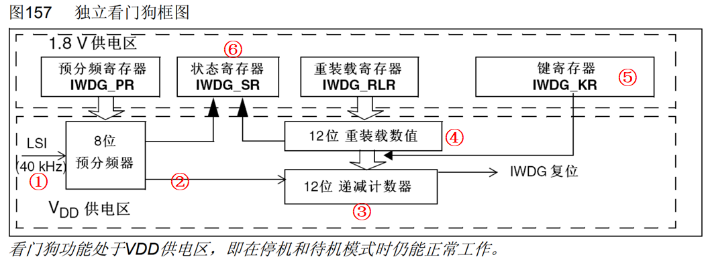

#### 2.1 ①独立看门狗时钟

独立看门狗的时钟由独立的 RC 振荡器 LSI 提供，即使主时钟发生故障它仍然有效，非常独立。LSI 的频率一般在 30~60KHZ 之间，根据温度和工作场合会有一定的漂移，我们一般取 40KHZ，所以独立看门狗的定时时间并不一定非常精确，只适用于对时间精度要求比较低的场合。我们可以看一下时钟树，[STM32中文参考手册](https://www.stmcu.com.cn/Designresource/detail/localization_document%20/710001)的6.2 时钟：

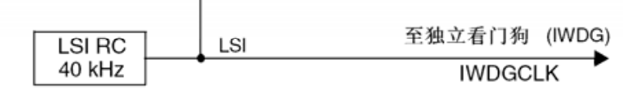

#### 2.2 ②计数器时钟

递减计数器的时钟由 LSI （ 内部低速时钟） 经过一个 8 位的预分频器得到，这意味着它不受外部晶振电路影响，同时就算系统主时钟发生故障时，也可以正常工作。 使用内部晶振，也意味精度并不高， 因此只适合应用在对时间精度要求比较低的场合。  

LSI的频率为40KHz  ，我们可以操作预分频器寄存器IWDG_PR 来设置分频因子，分频因子可以是[4，8，16，32，64，128，256，256]，计数器时钟：
$$
CK\_CNT=\frac{40·1000}{2^n}=\frac{40·1000}{4·2^{prv}}Hz
$$
其中prv为设置的分频因子，0≤prv≤6，一个计数器时钟计数器就减一。  

#### 2.3 ③计数器

独立看门狗的计数器是一个 12 位的**递减**计数器，最大值为 0XFFF，当计数器减到 0 时，会产生一个复位信号:IWDG_RESET，让程序重新启动运行。如果在递减到0之前，将重装载数值写入递减计数器，就会由重装载数值开始递减到0， 如此反复，就永远不会到0，也就不会产生复位信号，这个重装载计数值写入递减计数器的过程就叫“喂狗”。  

#### 2.4 ④重装载寄存器

重装载寄存器是一个 12 位的寄存器，里面装着要刷新到计数器的值，这个值的大小决定着独立看门狗的溢出时间。超时时间计算方式为：
$$
T_{out}=\frac{4·2^{prv}}{40·1000}·rlr
$$
其中 prv 是预分频器寄存器的值（0~0xFFF）， rlr 是重装载寄存器的值（0~6），最后计算得到的时间单位为秒(s)。假设当前预分频寄存器值为6
（ 256分频）， 重装载寄存器的值为15，则溢出时间为  ：
$$
T_{out}=\frac{4·2^{prv}}{40·1000}·rlr=\frac{4·2^6}{40000}·15=0.096秒
$$
即启动独立看门狗后，需要在0.96s内喂狗一次，否则系统将复位。  

#### 2.5 ⑤键寄存器

键寄存器 IWDG_KR 可以说是独立看门狗的一个控制寄存器，主要有三种控制方式，往这个寄存器写入下面三个不同的值有不同的效果。  

|  键值  | 键值作用                                     |
| :----: | -------------------------------------------- |
| 0XAAAA | 将重载寄存器（ IWDG_RLR） 的值更新到计数器； |
| 0X5555 | PR 和 RLR 这两个寄存器可写                   |
| 0XCCCC | 启动 IWDG                                    |

（1）默认预分频寄存器（ IWDG_PR）和重装载寄存器（ IWDG_RLR）有写保护，不允许直接写值，需要先向键值寄存器（ IWDG_KY） 写0x5555 关闭保护，才能写预分频寄存器（ IWDG_PR）和重装载寄存器（ IWDG_RLR）。写完后，向键值寄存器（ IWDG_KY）写入其它任意值，将重新启用写保护；  

（2）通过写往键寄存器写 0XCCC 来启动看门狗是属于软件启动的方式，一旦独立看门狗启动，它就关不掉，只有复位才能关掉。  

#### 2.6 ⑥状态寄存器  

状态寄存器 SR 只有位 0： PVU 和位 1： RVU 有效，这两位只能由硬件操作，软件操作不了。 

（1）RVU：看门狗计数器重装载值更新，硬件置 1 表示重装载值的更新正在进行中，更新完毕之后由硬件清0。

（2）PVU: 看门狗预分频值更新，硬件置’ 1’指示预分频值的更新正在进行中，当更新完成后，由硬件清 0。

所以只有当 RVU/PVU 等于 0 的时候才可以更新重装载寄存器/预分频寄存器。  

### 3. 相关寄存器

#### 3.1 键寄存器(IWDG_KR) 

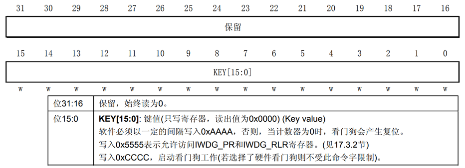

在键寄存器(IWDG_KR)中写入 0xCCCC，开始启用独立看门狗；此时计数器开始从其复位值 0xFFF 递减计数。当计数器计数到末尾 0x000 时，会产生一个复位信号(IWDG_RESET)。 无论何时，只要键寄存器 IWDG_KR 中被写入 0xAAAA， IWDG_RLR 中的值就会被重新加载到计数器中从而避免产生看门狗复位 。

IWDG_PR 和 IWDG_RLR 寄存器具有写保护功能。要修改这两个寄存器的值，必须先向IWDG_KR 寄存器中写入 0x5555。 将其他值写入这个寄存器将会打乱操作顺序，寄存器将重新被保护。重装载操作(即写入 0xAAAA)也会启动写保护功能。  

#### 3.2 预分频寄存器(IWDG_PR)   

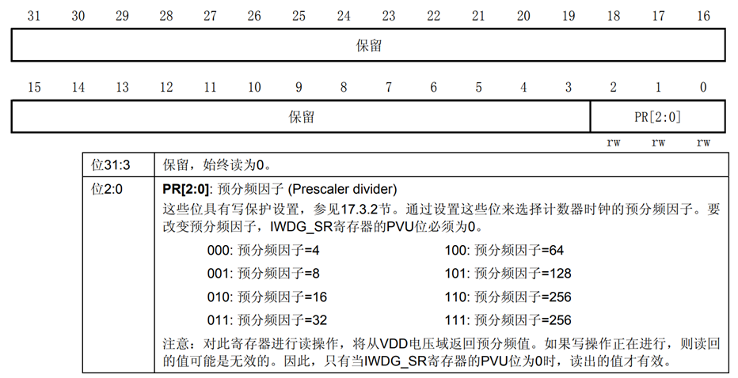

该寄存器用来设置看门狗时钟的分频系数，最低为 4，最高位 256，该寄存器是一个 32 位的寄存器，但是我们只用了最低 3 位，其他都是保留位。  

#### 3.3 重装载寄存器(IWDG_RLR)

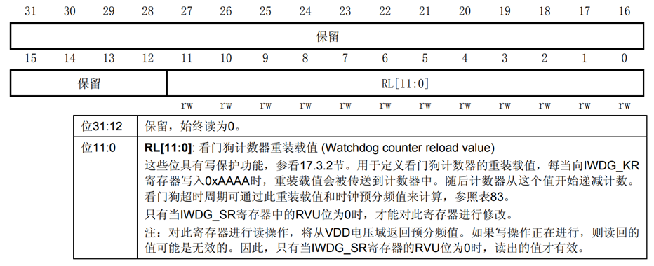

该寄存器用来保存重装载到计数器中的值。该寄存器也是一个 32 位寄存器，但是只有低 12 位是有效的。

#### 3.4 状态寄存器(IWDG_SR)

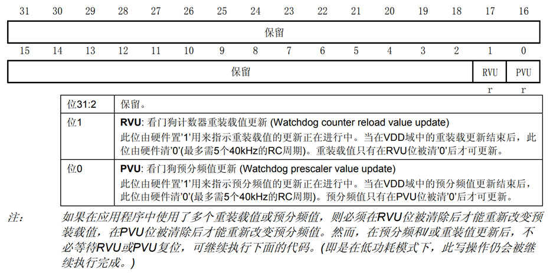

### 4. 超时时间计算

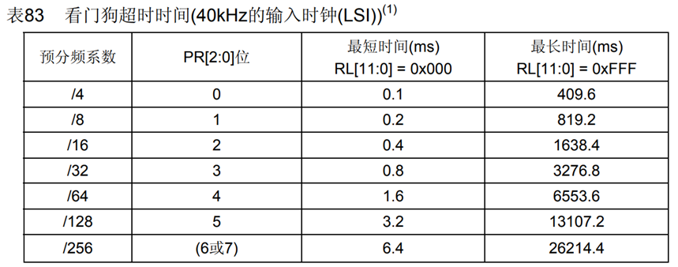

时钟频率LSI=40K， 一个看门狗时钟周期就是最短超时时间。最长超时时间= (IWDG_RLR寄存器最大值）X 看门狗时钟周期。

### 5. HAL库函数

#### 5.1 初始化结构体

```c
typedef struct
{
  uint32_t Prescaler; // 预分频器的值
  uint32_t Reload;    // 重装载寄存器的值
} IWDG_InitTypeDef;
```

#### 5.2 相关函数

```c
HAL_StatusTypeDef     HAL_IWDG_Init(IWDG_HandleTypeDef *hiwdg);   // 初始化独立看门狗，会直接启动看门狗
HAL_StatusTypeDef     HAL_IWDG_Refresh(IWDG_HandleTypeDef *hiwdg);// 喂狗
```

### 6. 如何使用独立看门狗？

独立看门狗一般用来检测和解决由程序引起的故障，比如一个程序正常运行的时间是 50ms，在运行完这个段程序之后紧接着进行喂狗，我们设置独立看门狗的定时溢出时间为 60ms，比我们需要监控的程序 50ms 多一点，如果超过 60ms 还没有喂狗，那就说明我们监控的程序出故障了，跑飞了，那么就会产生系统复位，让程序重新运行。  

## 三、窗口看门狗

这一部分可以查看[STM32中文参考手册](https://www.stmcu.com.cn/Designresource/detail/localization_document%20/710001)的18 窗口看门狗(WWDG)。

### 1. 与独立看门狗的区别

我们知道独立看门狗的工作原理就是一个递减计数器不断的往下递减计数，当减到 0 之前如果没有喂狗的话，产生复位。窗口看门狗跟独立看门狗一样，也是一个递减计数器不断的往下递减计数，当减到一个固定值 0X40时还不喂狗的话，产生复位，这个值叫窗口的下限，是固定的值，不能改变。这个是跟独立看门狗类似的地方，不同的地方是窗口看门狗的计数器的值在减到某一个数之前喂狗的话也会产生复位，这个值叫窗口的上限，上限值由用户独立设置。窗口看门狗计数器的值必须在上窗口和下窗口之间才可以喂狗，这就是窗口看门狗中窗口两个字的含义  

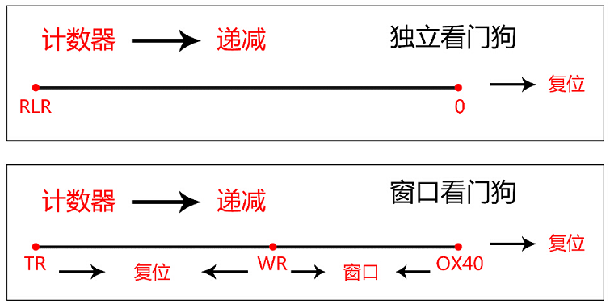

RLR 是重装载寄存器，用来设置独立看门狗的计数器的值。 TR 是窗口看门狗的计数器的值，由用户独立设置， WR 是窗口看门狗的上窗口值，由用户独立设置。  

对于一般的看门狗，程序可以在它产生复位前的任意时刻刷新看门狗，但这有一个隐患，有可能程序跑乱了又跑回到正常的地方，或跑乱的程序正好执行了刷新看门狗操作，这样的情况下一般的看门狗就检测不出来了；如果使用窗口看门狗，程序员可以根据程序正常执行的时间设置刷新看门狗的一个时间窗口，保证不会提前刷新看门狗也不会滞后刷新看门狗，这样可以检测出程序没有按照正常的路径运行非正常地跳过了某些程序段的情况。

### 2. 主要特性

（1）可编程的自由运行递减计数器

（2）复位条件：当递减计数器的值小于0x40，（若看门狗被启动）则会产生复位。；当递减计数器在窗口外被重新装载，（若看门狗被启动）则产生复位。

（3）如果启动了看门狗并且允许中断，当递减计数器等于0x40时产生早期唤醒中断(EWI)，它可以被用于重装载计数器以避免WWDG复位.

### 3. 功能框图

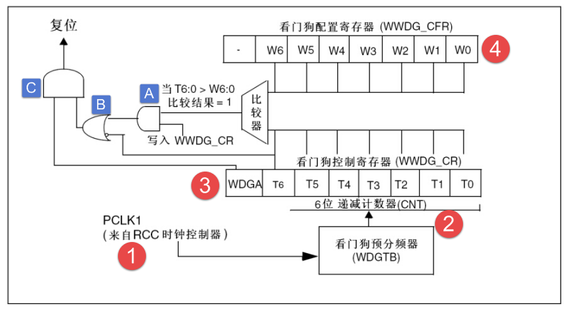

#### 3.1 ①窗口看门狗时钟  

窗口看门狗时钟来自 PCLK1， PCLK1 最大是 36M，由 RCC 时钟控制器开启。

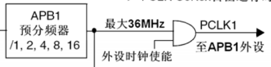

#### 3.2 ②计数器时钟  

计数器时钟源来自PCLK1（最高36HMz） ， 经过4096分频  ，再经过WWDG_CFG的Bits[8:7]位WDGTB分频得到 。即窗口看门狗计数器的分频系数由配置寄存器 CFR 的位8:7 WDGTB[1:0] 配置，可以是 [0，1，2，3]，其中 CK 计时器时钟 =PCLK1/4096，除以 4096 是手册规定的，所以没有为什么。

所以计数器的时钟 ：
$$
CNT\_CK=\frac{PCLK1}{4096 * (2^{WDGTB})}
$$
这就可以算出计数器减一个数的时间 ：
$$
T=\frac{1}{CNT\_CK}=\frac{1}{\frac{PCLK1}{4096 * (2^{WDGTB})}}=T_{pclk1}*4096*2^{WDGTB}
$$


#### 3.3 ③计数器  

窗口看门狗的计数器是一个递减计数器，共有 7 位，其值存在控制寄存器 CR 的位 6:0，即T[6:0]，当 7 个位全部为 1 时是 0X7F，这个是最大值，当递减到 T6位变成 0 时，即从 0X40 变为 0X3F 时候，会产生看门狗复位，重启整个系统。这个值 0X40 是看门狗能够递减到的最小值，所以计数器的值只能是： 0X40~0X7F 之间，实际上真正用来计数的是 T[5:0]。当递减计数器递减到 0X40 的时候，还不会马上产生复位，如果使能了提前唤醒中断： WWDG_CFG 的bit[9]位 EWI 置 1，则产生提前唤醒中断，如果真进入了这个中断的话，就说明程序肯定是出问题了，那么在中断服务程序里面我们就需要做最重要的工作，比如保存重要数据，或者报警等，也可以在中断中向WWDG_CR重新写入新计数器值， 完成喂狗操作。这个中断我们也叫它死前中断。  

#### 3.4 ④窗口值  

我们知道窗口看门狗必须在计数器的值在一个范围内才可以喂狗，其中下窗口的值是固定的0X40，上窗口的值可以改变，具体的由配置寄存器 CFR 的位 6:0 W[6:0] 设置。其值必须大于0X40，如果小于或者等于 0X40 就是失去了窗口的价值，而且也不能大于计数器的值，所以必须得小于 0X7F。

那窗口值具体要设置成多大？这个得根据我们需要监控的程序的运行时间来决定。如果我们要监控的程序段 A 运行的时间为 Ta，当执行完这段程序之后就要进行喂狗，如果在窗口时间内没有喂狗的话，那程序就肯定是出问题了。一般计数器的值 TR 设置成最大 0X7F，窗口值为 WR，计数器减一个数的时间为 T，那么时间： (TR-WR)\*T 应该稍微大于 Ta 即可，这样就能做到刚执行完程序段 A 之后喂狗，起到监控的作用，这样也就可以算出 WR 的值是多少。  

### 4. 相关寄存器

#### 4.1 控制寄存器(WWDG_CR)

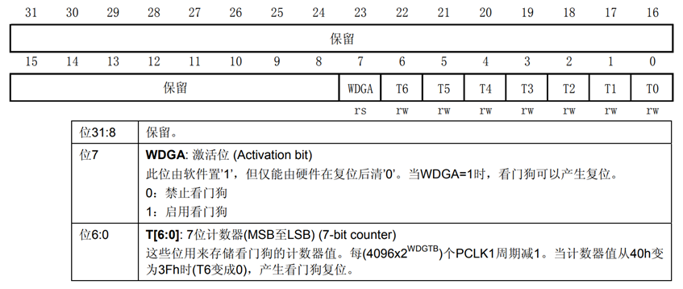

WWDG_CR 只有低八位有效， T[6:0]用来存储看门狗的计数器值，随时更新的，每个窗口看门狗计数周期（4096\* 2^WDGTB）减 1。当该计数器的值从 0X40 变为 0X3F 的时候，将产生看门狗复位。WDGA 位则是看门狗的激活位，该位由软件置 1，以启动看门狗，并且一定要注意的是该位一旦设置，就只能在硬件复位后才能清零了。  

#### 4.2 配置寄存器(WWDG_CFR) 

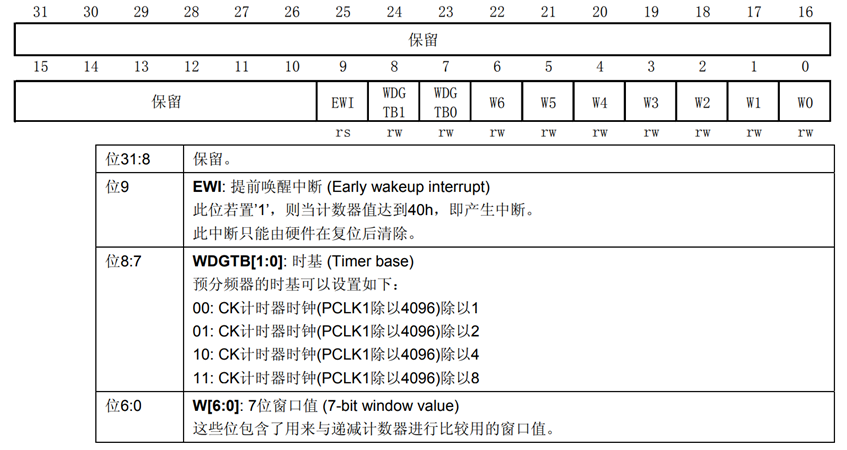

该位中的 EWI 是提前唤醒中断，也就是在快要产生复位的前一段时间（T[6:0]=0X40） 来提醒我们，需要进行喂狗了，否则将复位！因此，我们一般用该位设置中断，当窗口看门狗的计数器值减到 0X40 的时候，如果该位设置，并开启了中断，则会产生中断，我们可以在中断里面向 WWDG_CR 重新写入计数器的值，来达到喂狗的目的。

注意这里在进入中断后， 必须在不大于 1 个窗口看门狗计数周期的时间（在 PCLK1 频率为 36M 且 WDGTB 为 0 的条件下，该时间为 113us）内重新写 WWDG_CR，否则，看门狗将产生复位！  

#### 4.3 状态寄存器(WWDG_SR)

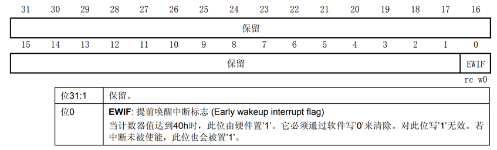

该寄存器用来记录当前是否有提前唤醒的标志。该寄存器仅有位 0 有效，其他都是保留位。当计数器值达到 40h 时，此位由硬件置 1。它必须通过软件写 0 来清除。对此位写 1 无效。 即使中断未被使能， 在计数器的值达到 0X40的时候， 此位也会被置 1。  

### 5. 超时时间计算

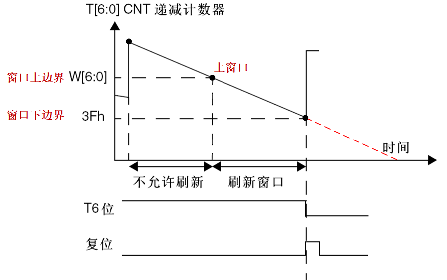


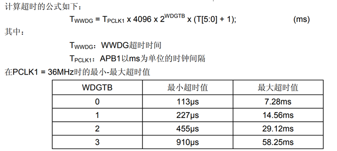

这个图来自数据手册，从图我们知道看门狗超时时间： Twwdg = Tpclk1 x 4096 x 2^wdgtb x (T[5:0]\+ 1) ms，当 PCLK1 = 36MHZ 时， WDGTB 取不同的值时有最小和最大的超时时间，那这个最小和最大的超时时间该怎么理解，又是怎么算出来的？

 WDGTB=0时，递减计数器有 7 位 T[6:0] ，当位 6 变为 0 的时候就会产生复位，实际上有效的计数位是 T[5:0]，而且 T6 必须先设置为 1。如果 T[5:0]=0 时，递减计数器再减一次，就产生复位了，那这减一的时间就等于计数器的周期 =1/CNT_CK = Tpclk1 \* 4096 \* (2^WDGTB) = 1/36 \* 4096 \* 2^0 = 113.7us，这就是最短的超时时间。如果 T[5:0] 全部装满为 1，即 63，当他减到 0X40 变成 0X3F 时，所需的时间就是最大的超时时间 =113.7\*2^5=113.7\*64=7.2768ms。

同理，当 WDGTB 等于 1/2/3 时，代入公式即可。

### 6. HAL库函数

#### 6.1 初始化结构体

```c
typedef struct
{
  uint32_t Prescaler; // 设置预分频器值
  uint32_t Window;    // 设置上窗口值
  uint32_t Counter;   // 设置计数器的值
  uint32_t EWIMode;   // 使能提前唤醒中断
} WWDG_InitTypeDef;
```

（1）Counter是计数器的值，一般我们设置成最大 0X7F;

（2）Window是上窗口的值，这个我们要根据监控的程序的运行时间来设置，但是值必须在 0X40 和计数器的值之间；

（3）Prescaler 用来设置预分频的值，取值可以是：  

```c
#define WWDG_PRESCALER_1 0x00000000u                              /*!< WWDG counter clock = (PCLK1/4096)/1 */
#define WWDG_PRESCALER_2 WWDG_CFR_WDGTB_0                         /*!< WWDG counter clock = (PCLK1/4096)/2 */
#define WWDG_PRESCALER_4 WWDG_CFR_WDGTB_1                         /*!< WWDG counter clock = (PCLK1/4096)/4 */
#define WWDG_PRESCALER_8 (WWDG_CFR_WDGTB_1 | WWDG_CFR_WDGTB_0)    /*!< WWDG counter clock = (PCLK1/4096)/8 */
```

#### 6.2 相关函数

```c
HAL_StatusTypeDef     HAL_WWDG_Init(WWDG_HandleTypeDef *hwwdg);    // 窗口看门狗初始化
void                  HAL_WWDG_MspInit(WWDG_HandleTypeDef *hwwdg); // 使能窗口看门狗外设时钟
HAL_StatusTypeDef     HAL_WWDG_Refresh(WWDG_HandleTypeDef *hwwdg); // 喂狗，刷新递减计数器的值
void                  HAL_WWDG_IRQHandler(WWDG_HandleTypeDef *hwwdg);// 中断处理函数
void                  HAL_WWDG_EarlyWakeupCallback(WWDG_HandleTypeDef *hwwdg);// 中断处理函数中的回调函数
```


### 7. 如何使用窗口看门狗？

独立看门狗一般用来检测和解决由程序引起的故障，比如一个程序正常运行的时间是 50ms，在运行完这个段程序之后紧接着进行喂狗，我们设置独立看门狗的定时溢出时间为 60ms，比我们需要监控的程序 50ms 多一点，如果超过 60ms 还没有喂狗，那就说明我们监控的程序出故障了，跑飞了，那么就会产生系统复位，让程序重新运行。  

## 四、IWDG与WWDG

### 1. 相同点

（1）当软件代码死循环在某处时， 导致无法喂狗将复位；

（2）当软件代码执行超时（ 比如外部一直触发中断） ，导致无法喂狗将复位；

（3）可通过软件设置喂狗时间；

### 2. 不同点

| 独立看门狗                                | 窗口看门狗                                                   |
| ----------------------------------------- | ------------------------------------------------------------ |
| 由内部低速时钟LSI提供时钟源，无需使能时钟 | 由PCLK1提供时钟源，需要先使能时钟                            |
| 无中断直接复位                            | 在超时前可产生中断(需使能) 在中断里保护数据或喂狗            |
| 用于避免程序跑飞或死循环                  | 用于程序不按预先逻辑执行， 先于预计时间或晚于预计时间，都复位 |
| 12位递减计数器                            | 7位递减计数器                                                |
| 计数到0，复位                             | 计数器在0x7F到窗口值之间喂狗，复位 计数器在0x40以下，复位    |
