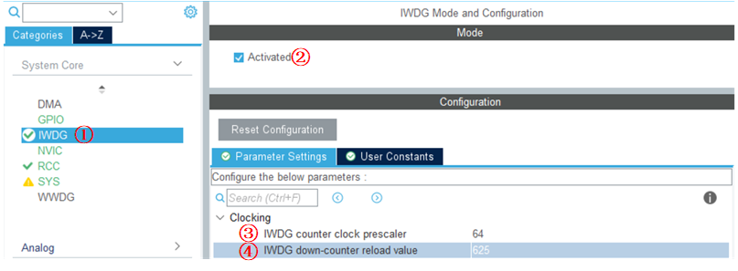
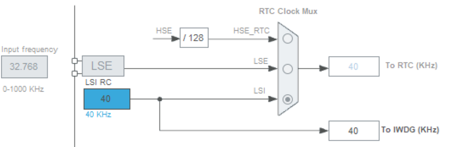
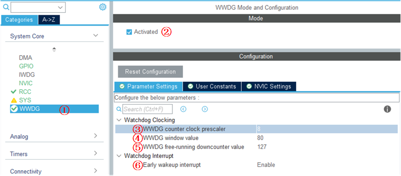
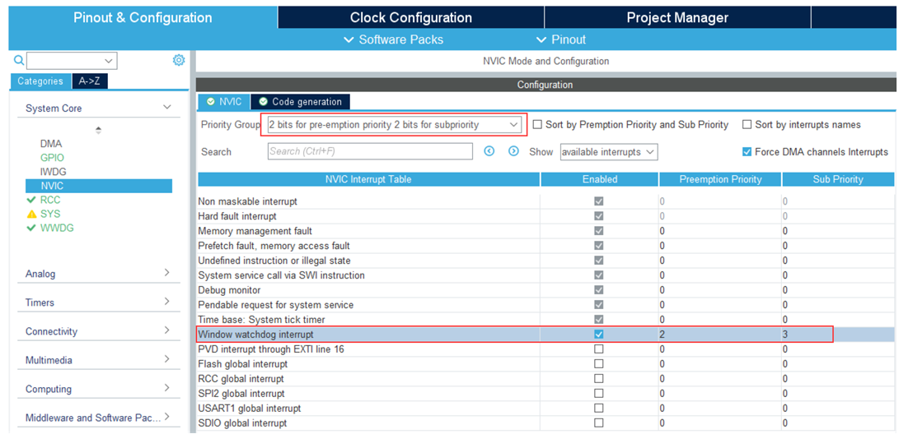
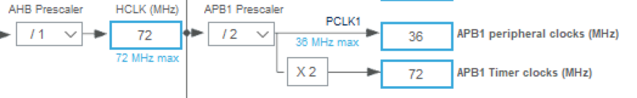

<!-- more -->

## 一、独立看门狗

### 1. 硬件设计

独立看门狗属于 STM32F1 的内部资源，只需要软件设置好即可正常工作。我们通过LED灯来指示 STM32F1 的复位情况来看指示独立看门狗的喂狗情况。

### 2. STM32CubeMX配置  

#### 2.1 IWDG配置



独立看门狗的配置时间比较简单：

①、选择IWDG；

②、勾选Activated，表示启用独立看门狗；

③、看门狗的时钟分频，时钟源为40KHz，这里选择64分频；

④、重载寄存器初始值，这里设置为500。

根据前边计算溢出时间的公式，可以知道这样配置的话，溢出时间为Tout = prv/40 \* rlr (s)， prv 可以是 [4，8，16，32，64，128，256]。如果我们需要设置 1s 的超时溢出， prv 可以取 IWDG_ PRESCALER _64， rlr 取 625，这时 Tout=64/40\*625=1s。  

#### 2.2 时钟树



### 3. 看门狗实现

#### 3.1 初始化看门狗

```c
void MX_IWDG_Init(void)
{
  hiwdg.Instance = IWDG;
  hiwdg.Init.Prescaler = IWDG_PRESCALER_64;
  hiwdg.Init.Reload = 625;
  if (HAL_IWDG_Init(&hiwdg) != HAL_OK)
  {
    Error_Handler();
  }
}
```

#### 3.2 喂狗

```c
HAL_StatusTypeDef HAL_IWDG_Refresh(IWDG_HandleTypeDef *hiwdg)
{
  /* Reload IWDG counter with value defined in the reload register */
  __HAL_IWDG_RELOAD_COUNTER(hiwdg);

  /* Return function status */
  return HAL_OK;
}
```

#### 3.3 测试函数

```c
void IWDG_Test(void)
{
	LED1 = 0;       // LED亮
    HAL_Delay(100); // 延时 100ms 再初始化看门狗,LED1 的变化"可见"
    MX_IWDG_Init(); // 初始化看门狗
    LED1 = 1;       // 关闭LED1
    while(1)
    {
        if(KEY_Scan() == WKUP_PRES) //如果 WK_UP 按下，喂狗
        {
        	HAL_IWDG_Refresh(&hiwdg); //喂狗
        }
        delay_ms(10);
    }
}
```

#### 3.4 测试现象

在编译成功之后，下载代码， 可以看到 LED1 不停的闪烁，证明程序在不停的复位，否则只会 LED1 常亮。这时我们不停的按 KEY_UP 按键，可以看到 LED1 就常亮了，不会再闪烁。

## 二、窗口看门狗

### 1. 硬件设计

窗口看门狗属于 STM32F1 的内部资源，只需要软件设置好即可正常工作。我们通过LED灯来指示 STM32F1 的复位情况和窗口看门狗的喂狗情况。

### 2. STM32CubeMX配置

#### 2.1 WWDG配置



①、选择WWDG配置；

②、选择Activated，表示启用窗口看门狗；

③、窗口看门狗的分频数，这里选择为8；

④、设置窗口上边界值，范围:0x40~0x7F，换算成十进制就是44~127；

⑤、设置计数器的值，范围:0x40~0x7F，换算成十进制就是44~127，计数器会从这个值网下递减；

⑥、使能唤醒中断。

#### 2.2 NVIC中断配置



注意，这里不要把看门狗的中断优先级设置的太高，不然系统无法运行。

#### 2.3 时钟树



### 3. 看门狗实现

#### 3.1 初始化看门狗

```c
void MX_WWDG_Init(void)
{
  hwwdg.Instance = WWDG;
  hwwdg.Init.Prescaler = WWDG_PRESCALER_8;
  hwwdg.Init.Window = 80;
  hwwdg.Init.Counter = 127;
  hwwdg.Init.EWIMode = WWDG_EWI_ENABLE;
  if (HAL_WWDG_Init(&hwwdg) != HAL_OK)
  {
    Error_Handler();
  }
}
```

#### 3.2 配置底层及中断

```c
void HAL_WWDG_MspInit(WWDG_HandleTypeDef* wwdgHandle)
{
  if(wwdgHandle->Instance==WWDG)
  {
    __HAL_RCC_WWDG_CLK_ENABLE();

    HAL_NVIC_SetPriority(WWDG_IRQn, 0, 0);
    HAL_NVIC_EnableIRQ(WWDG_IRQn);
  }
}
```

#### 3.3 中断服务函数

```c
void WWDG_IRQHandler(void)
{
  HAL_WWDG_IRQHandler(&hwwdg);
}
```

#### 3.4 回调函数

这个是需要重写的，此函数会被 HAL_WWDG_IRQHandler()调用  

```c
void HAL_WWDG_EarlyWakeupCallback(WWDG_HandleTypeDef* hwwdg)
{
    HAL_WWDG_Refresh(&hwwdg);//更新窗口看门狗值
    LED1=!LED1;
}
```

#### 3.5 测试函数

```c
int main()
{
    // 其他的部分省略
	LED1 = 0;        //点亮 LED
	HAL_Delay(300); // 延时 300ms 再初始化看门狗,LED 的变化"可见"
	MX_WWDG_Init();
	
    while (1)
    {
        LED1=1;
    }
    return 0;
}
```

#### 3.6 测试现象

当产生窗口看门狗中断的时候，会反转LED的电平，我们在while(1)中将LED持续性关闭，所以当进入看门狗中断的时候，LED被点亮，这样我们就会看到LED不断地闪烁，设就说明我们进入了看门狗的中断。
