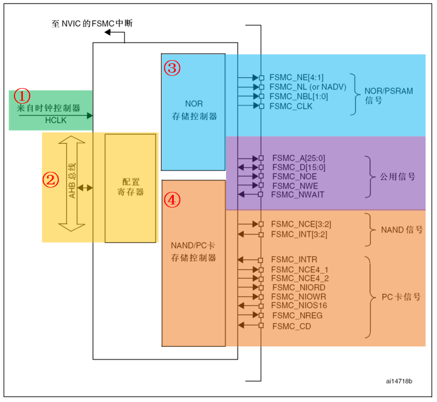
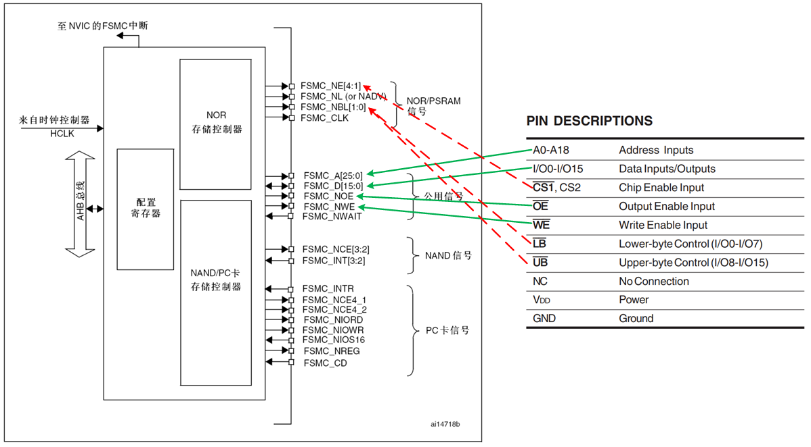
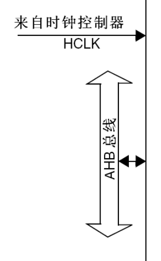

<!-- more -->

这一部分我们可以参考 [STM32中文参考手册](https://www.stmcu.com.cn/Designresource/detail/localization_document%20/710001)的 19 灵活的静态存储器控制器(FSMC) 一节。

## 一、FSMC简介

### 1. 什么是FSMC

FSMC，**Flexible static memory controller**，即灵活的静态存储控制器，能够与同步或异步存储器和 16 位 PC 存储器卡连接，STM32F1 的 FSMC 接口支持包括 SRAM、 NAND FLASH、 NOR FLASH 和 PSRAM 等存储器，但是不能驱动如SDRAM这种动态的存储器。  而在STM32F429系列的控制器中，它具有FMC外设，支持控制SDRAM存储器。

STM32F103ZET6的内部有64KB的SRAM，可以满足大部分的应用场景，但在一些采集数据比较多的项目、应用算法或GUI（ Graphical User Interface，图形用户界面） 等应用场景，内部SRAM可能就不够了，此时就需要外部扩展SRAM。  

STM32F103系列中， 100脚及以上的MCU，都有一个FSMC（ Flexible Static Memory Controller，灵活的静态存储器控制器） ， 该外设是STM32设计的一种存储器控制技术，仅适用STM32系列的MCU。 它可以驱动SRAM、 NOR Flash、 NAND Flash等存储器，但不能驱动SDRAM等动态存储器。  

>**FSMC 只能扩展静态的内存，即名称里面的 S：static，不能是动态的内存，比如 SDRAM 就不能扩展。**

### 2. 为什么它很方便？

来自于Deepseek的解释：

使用FSMC主要是为了解决GPIO模拟时序的瓶颈，并简化系统设计。

（1）极大解放CPU，提高系统性能：一旦配置好FSMC，数据传输由硬件自动完成。CPU只需向特定的内存地址执行一次写操作（如 `*(volatile uint16_t *)0x60000000 = data;`），FSMC就会自动生成完整的、符合时序的波形。CPU可以发起传输后立即去处理其他任务，或者配合DMA，实现数据在外部存储器和内部存储器之间的“零CPU占用”搬运。这对于需要处理大量数据（如图形显示、音频流）的应用至关重要。

（2）简化软件设计，提高开发效率：对程序员来说，外部设备被“映射”到了MCU的内存地址空间。访问外部设备就像操作一个全局数组或结构体指针一样简单直观。代码变得非常清晰，无需关心复杂的底层时序。比如在[20-基本外设篇/25-FSMC/05-外部SRAM/LV005-IS62WV51216简介.md](/sdoc/peripheral/fsmc/sram/126b09248db61d861c837fd7)中了解的IS62WV51216，访问时有18根信号线，当我们要访问内部的某个地址时，要控制时序，还要控制计算哪些地址对应哪些信号线，太繁琐了，当通过FSMC后，可以直接吧这个SRAM的地址空间映射到STM32中，我们读写数据直接操作STM32的对应的地址，其他内容全部都有硬件自己去完成，这无疑是很方便的。

（3）FSMC的灵活性主要体现在它支持多种存储器类型和访问模式，这就像是它可以说多国语言，无论你来自哪个存储器国家，它都能和你愉快地交流。而且，FSMC能够让STM32以最高效的方式访问这些外部设备，这就像是它拥有VIP通道，能够迅速通过安检进入存储器的心脏区域。

## 二、FSMC框图分析

### 1. FSMC框图

在[STM32中文参考手册](https://www.stmcu.com.cn/Designresource/detail/localization_document%20/710001)的 19.2 框图一节，我们可以看到FSMC结构框图如下：

从上图可以看出，STM32 的 FSMC 将外部设备分为 3 类： NOR/PSRAM 设备、 NAND设备、 PC 卡设备。他们共用地址数据总线等信号，他们具有不同的 CS 以区分不同的设备，  

### 2. 接口信号

这一部分我们可以查看[STM32中文参考手册](https://www.stmcu.com.cn/Designresource/detail/localization_document%20/710001)的 19.5.1 外部存储器接口信号。下边我们一起来看一下与NOR闪存和PSRAM接口的典型信号。**注意**：具有前缀 “ N ” 的信号表示低有效信号。这里说一下下边的复用和非复用是什么意思：

- 非复用模式：16位数据线及26位地址线分开始用。推荐在144脚及以上的STM32产品上使用该模式。

- 复用模式：低16位数据/地址线复用。在该模式下，推荐使用地址锁存器以区分数据与地址。

#### 2.1 NOR闪存，非复用接口

| FSMC信号名称 | 信号方向  | 功能                                            |
| ------------ | --------- | ----------------------------------------------- |
| CLK          | 输出      | 时钟信号（ 用于同步访问的外部存储器）           |
| A[25:0]      | 输出      | 地址总线                                        |
| D[15:0]      | 输入/输出 | 数据总线                                        |
| NEx          | 输出      | Bank1区域内片选信号， x=1~4，每个区域大小为64MB |
| NOE          | 输出      | 读使能信号                                      |
| NWE          | 输出      | 写使能信号                                      |
| NWAIT        | 输入      | NOR闪存要求FSMC等待的信号                       |

NOR闪存存储器是按16位的字寻址，最大容量达64M字节(26条地址线)。

#### 2.2 NOR闪存，复用接口

| FSMC信号名称 | 信号方向  | 功能                                                         |
| ------------ | --------- | ------------------------------------------------------------ |
| CLK          | 输出      | 时钟信号（ 用于同步访问的外部存储器）                        |
| A[25:16]     | 输出      | 地址总线                                                     |
| AD[15:0]     | 输入/输出 | 16位复用的，双向地址/数据总线                                |
| NEx          | 输出      | Bank1区域内片选信号， x=1~4，每个区域大小为64MB              |
| NOE          | 输出      | 读使能信号                                                   |
| NWE          | 输出      | 写使能信号                                                   |
| NL(=NADV)    | 输入      | 锁存使能(某些NOR闪存器件命名该信号为地址有效，NADV，也可以叫地址有效信号) |
| NWAIT        | 输入      | NOR闪存要求FSMC等待的信号                                    |

NOR闪存存储器是按16位的字寻址，最大容量达64M字节(26条地址线)。

#### 2.3 PSRAM，非复用接口

非复用信号的PSRAM接口信号如下：

| FSMC信号名称 | 信号方向  | 功能                                                         |
| ------------ | --------- | ------------------------------------------------------------ |
| CLK          | 输出      | 时钟信号（ 用于同步访问的外部存储器）                        |
| A[25:0]      | 输出      | 地址总线                                                     |
| D[15:0]      | 输入/输出 | 双向数据总线                                                 |
| NEx          | 输出      | Bank1区域内片选信号， x=1~4，每个区域大小为64MB (PSRAM称其为NCE(Cellular RAM既CRAM)) |
| NOE          | 输出      | 读使能信号                                                   |
| NWE          | 输出      | 写使能信号                                                   |
| NL(=NADV)    | 输出      | 地址有效信号(存储器信号名称为：NADV)                         |
| NWAIT        | 输入      | PSRAM要求FSMC等待的信号                                      |
| NBL[1]       | 输出      | 高字节使能(存储器信号名称为：NUB)                            |
| NBL[0]       | 输出      | 低字节使能(存储器信号名称为：NLB)                            |

PSRAM存储器是按16位的字寻址，最大容量达64M字节(26条地址线)。

#### 2.4 与SRAM的接线？

我们在[20-基本外设篇/25-FSMC/05-外部SRAM/LV005-IS62WV51216简介.md](/sdoc/peripheral/fsmc/sram/126b09248db61d861c837fd7)中大概了解了这款SRAM的一些基础知识，以这颗SRAM芯片为例，我们看一下SRAM这么多引脚是如何与FSMC控制器引脚对应的呢？我来看一下 FSMC 与 SRAM 引脚对照表 ：

也就是如下表所示:

| FSMC引脚名称  | 对应的FSMC引脚名 | 说明                                     |
| ------------- | ---------------- | ---------------------------------------- |
| FSMC_NBL[1:0] | LB#，UB#         | 数据掩码信号                             |
| FSMC_A[18:0]  | A[18:0]          | 行地址线，这里FSMC有25根，但只使用了19根 |
| FSMC_D[15:0]  | I/O[15:0]        | 数据线，一共16根                         |
| FSMC_NWE      | WE#              | 写入使能信号线                           |
| FSMC_NOE      | OE#              | 输出使能信号线（读使能）                 |
| FSMC_NE[1:4]  | CE#              | 片选信号                                 |

由于大部分地址线 FSMC_A 都是使用到了 GPIOF、 GPIOG 端口，而 STM32VET6 等 144脚以下型号的芯片不具有这些端口，因此对于 144 脚以下的 STM32 芯片，无法扩展外部 SRAM，STM32ZET6 或以上型号的芯片具有 GPIOF、 GPIOG 等端口，因此想要扩展外部 SRAM 的时候，需要注意 STM32 芯片的选型。

其中比较特殊的 FSMC_NE 是用于控制 SRAM 芯片的片选控制信号线， STM32 具有FSMC_NE1/2/3/4 号引脚，不同的引脚对应 STM32 内部不同的地址区域。例如，当 STM32 访问 0x68000000-0x6BFFFFFF 地址空间时， FSMC_NE3 引脚会自动设置为低电平，由于它连接到 SRAM 的 CE# 引脚，所以 SRAM 的片选被使能，而访问 0x60000000-0x63FFFFFF 地址时，FSMC_NE1 会输出低电平。当使用不同的 FSMC_NE 引脚连接外部存储器时， STM32 访问 SRAM的地址不一样，从而达到控制多块 SRAM 芯片的目的。各引脚对应的地址会在后面 四、NOR/PSRAM控制器 小节说明。  

### 3. 时钟控制逻辑

FSMC外设挂载在AHB总线上，时钟信号来自于HCLK(默认72MHz)，控制器的同步时钟输出就是由它分频得到。例如，NOR控制器的FSMC_CLK引脚输出的时钟，它可用于与同步类型的SRAM芯片进行同步通讯，它的时钟频率可通过FSMC_BTR寄存器的CLKDIV位配置，可以配置为HCLK的1/2或1/3，也就是说，若它与同步类型的SRAM通讯时，同步时钟最高频率为36MHz。我们将要驱动的SRAM为异步类型的存储器，不使用同步时钟信号，所以时钟分频配置不起作用。

### 4. 存储器控制器

上面不同类型的引脚是连接到FSMC内部对应的存储控制器中的。NOR/PSRAM/SRAM设备使用相同的控制器，NAND/PC卡设备使用相同的控制器，不同的控制器有专用的寄存器用于配置其工作模式。

控制SRAM的有FSMC_BCR1/2/3/4控制寄存器、FSMC_BTR1/2/3/4片选时序寄存器以及FSMC_BWTR1/2/3/4写时序寄存器。每种寄存器都有4个，分别对应于4个不同的存储区域，各种寄存器介绍如下（后边还会再说明）：

- FSMC_BCR控制寄存器可配置要控制的存储器类型、数据线宽度以及信号有效极性能参数。
- FMC_BTR时序寄存器用于配置SRAM访问时的各种时间延迟，如数据保持时间、地址保持时间等。
- FMC_BWTR写时序寄存器与FMC_BTR寄存器控制的参数类似，它专门用于控制写时序的时间参数。

> 参考资料：
>
> [STM32 FSMC/FMC原理保姆级讲解(一)-CSDN博客](https://blog.csdn.net/as480133937/article/details/123740365)
>
> [27. FSMC—扩展外部SRAM](https://doc.embedfire.com/mcu/stm32/f103badao/std/zh/latest/book/FSMC.html)
