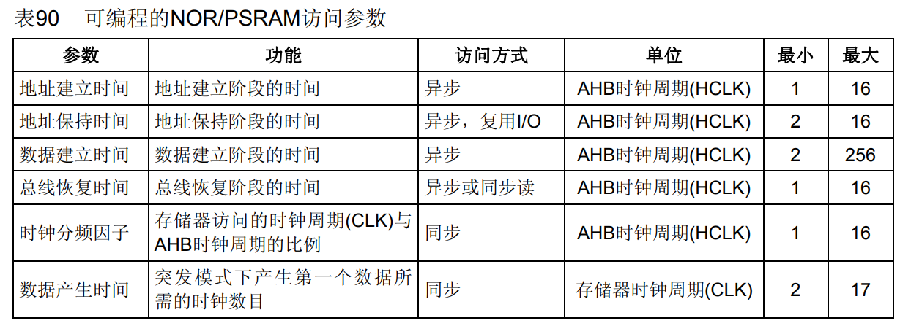

<!-- more -->

## 一、存储器映射？

### 1. 直接访问地址？

FSMC连接好外部的存储器并初始化后，就可以**直接通过访问地址来读写数据**。FSMC访问存储器的方式与I2C EEPROM、SPI FLASH的不一样，后两种方式都需要控制I2C或SPI总线给存储器发送地址，然后获取数据；在程序里，这个地址和数据都需要分开使用不同的变量存储，并且访问时还需要使用代码控制发送读写命令。而使用FSMC外接存储器时，其**存储单元是映射到STM32的内部寻址空间的**；在程序里，**定义一个指向这些地址的指针，然后就可以通过指针直接修改该存储单元的内容，FSMC外设会自动完成数据访问过程，读写命令之类的操作不需要程序控制**。

### 2. FSMC映射在哪里

作为STM32的外设，FSMC被映射在哪里？我们来回顾一下STM32的存储器映像：

图中左侧的是Cortex-M3内核的存储空间分配，右侧是STM32 FSMC外设的地址映射（我们可以查看[STM32F103xx数据手册](https://www.st.com/resource/en/datasheet/stm32f103ze.pdf)的4 Memory mapping）。可以看到FSMC的NOR/PSRAM/SRAM/NAND FLASH以及PC卡的地址都在External RAM地址空间内。正是因为存在这样的地址映射，使得访问FSMC控制的存储器时，就跟访问STM32的片上外设寄存器一样。FSMC把整个External RAM存储区域分成了4个Bank区域，并分配了地址范围及适用的存储器类型，如NOR及SRAM存储器只能使用Bank1的地址。 

由图可知， 0x6000 0000~0x9FFF FFFF共计1GB空间为FSMC的存储器映射范围。 FSMC把这1GB空间，分为了4个固定大小的存储区域（ Bank1~4），每个大小为256MB， **每个Bank都由一组独立的配置寄存器控制**，相互之间不受干扰， 如下图：

（1）Bank1（ 0x6000 000~0x6FFF FFFF）： 用于NOR/PSRAM设备， 该区域又被分为4块，每块64MB，可连接4个NOR Flash设备或PSRAM设备，每个区域通过片选引脚NE[4:1]进行选择；

（2）Bank2（ 0x7000 000~0x7FFF FFFF）： 用于NAND Flash设备，每个存储块连接一个NAND闪存。

（3）Bank3（ 0x8000 000~0x8FFF FFFF）： 用于NAND Flash设备，每个存储块连接一个NAND闪存。

（4）Bank4（ 0x9000 000~0x9FFF FFFF）： 用于PC卡设备；  

## 二、NOR/PSRAM控制器

由于我们后边要学习的如何驱动SRAM，因此重点分析NOR/PSRAM控制器，即Bank1。 

### 1. Bank1的四个区

STM32 的 FSMC 存储块 1（Bank1）被分为 4 个区，每个区管理 64M 字节空间，每个区都有独立的寄存器对所连接的存储器进行配置。  CPU需要28根AHB地址总线，才能寻址完Bank1的256MB空间（ 2^28=256MB），这里用HADDR[27:0]表示需要转换到外部存储器的内部AHB地址线。HADDR[25:0]对应连接外部存储器的FSMC_A[25:0]， HADDR[26:27]对应片选信号引脚NE[4:1]，这两个位主要是用于选择四个存储块之一。

| Bank1所选区域       | 地址范围                | 片选引脚信号 | HADDR[27:26] | HADDR[25:0]  |
| ------------------- | ----------------------- | ------------ | ------------ | ------------ |
| 存储块1 NOR/PSRAM 1 | 0x6000 0000~0x63FF FFFF | FSMC_NE1     | 00           | FSMC_A[25:0] |
| 存储块2 NOR/PSRAM 2 | 0x6400 0000~0x67FF FFFF | FSMC_NE2     | 01           | FSMC_A[25:0] |
| 存储块3 NOR/PSRAM 3 | 0x6800 0000~0x6BFF FFFF | FSMC_NE3     | 10           | FSMC_A[25:0] |
| 存储块4 NOR/PSRAM 4 | 0x6C00 0000~0x6FFF FFFF | FSMC_NE4     | 11           | FSMC_A[25:0] |

如上图，当STM32访问0x68000000-0x6BFFFFFF地址空间时，会访问到Bank1的第3小块区域，相应的FSMC_NE3信号线会输出控制信号。

### 2. 地址映像

这一部分可以看[STM32中文参考手册](https://www.stmcu.com.cn/Designresource/detail/localization_document /710001)的19.4.1 NOR和PSRAM地址映像一节。**CPU访问一个地址，只能读取一字节（ 8位 ）数据**， 因此当外部存储器数据宽度不同时， 实际向存储器发送的地址也将有所不同。HADDR[25:0]包含外部存储器地址。HADDR是字节地址，而存储器访问不都是按字节访问，因此接到存储器的地址线依存储器的数据宽度有所不同

| 存储器数据宽度 | 向存储器发送的地址 | 最大访问存储器空间(位)     |
| -------------- | ------------------ | -------------------------- |
| 8位            | HADDR[25:0]        | 64 Mbyte x 8 = 512 Mbit    |
| 16位           | HADDR[25:1] >> 1   | 64 Mbyte/2 x 16 = 512 Mbit |

当Bank1接的是8位宽度存储器的时候：HADDR[25:0]&rarr;FSMC_A[25:0]，当Bank1接的是16位宽度存储器的时候：HADDR[25:1]&rarr; FSMC_A[24:0]，HADDR[0]未接。需要注意的是，不论外部接8位/16位宽设备，**FSMC_A[0]永远接在外部设备地址A[0]**。

我们来看一下分别接8位和16位的时候，地址是怎么对应的：

（1）假设某8位数据宽度的外部存储器接在Bank1的第一区，则FSMC_NE1连接该外部存储器片选，此时HADDR[26:27]值为0x00； FSMC_A[25:0]连接该外部存储器地址引脚。此时一个地址对应一字节（ 8位）数据，通过HADDR[25:0]寻址该外部存储器，得到8位数据。

（2）假设某16位数据宽度的外部存储器接在Bank1的第二区，则FSMC_NE2连接该外部存储器片选，此时HADDR[26:27]值为0x01， FSMC_A[25:0]连接该外部存储器地址引脚。此时一个地址对应两字节（ 16位）数据，通过HADDR[25:1]>>1寻址该外部存储器，得到16位数据。  

为什么对于16位数据宽度的外部存储器，要使用HADDR[25:1]>>1寻址？假设CPU想访问存储器0x0b0000地址数据，得到16位数据，此时CPU一次只能获取此16位的低8位。接着想通过0x0b0001地址访问剩下的8位，这个时候却访问的是下一个16位数据。但如果将访问地址右移1位，即无论是0x0b0000还是0x0b0001，都是0b0000，再通过NBLx切换高低8位，即可完整的获取存储器0x0b0000处的16位数据：

上边分析的这个过程，其实都是FSMC自动完成的，我们在编写程序的时候其实直接读写我们想要读写的地址，在FSMC内部会自动帮我们完成对存储器指定地址的访问。

### 3. 同步与异步访问

#### 3.1 不同的模式

NOR/PSRAM控制器支持同步访问和异步访问，这里的同步、异步概念，与前面“ 同步/异步通信 ”的概念类似。

- 同步访问需要一个时钟信号作为收发双方的参考信号， FSMC使用HCLK分频后的时钟，作为与外部存储器的时钟同步信号FSMC_CLK。

- 异步访问无需时钟信号，通过提前制定规则保证数据传输的准确， 因此FSMC需要设置多个时间参数，比如数据建立时间（ Data-Phase Duration， DATAST）、 地址保持时间（ Address-hold Phase Duration， ADDHLD）和地址建立时间（ Address Setup Phase Duration ， ADDSET） 。  

NOR/PSRAM控制器支持的器件类型众多， 不同的器件读写操作时序会有差异，因此控制器通过切换不同的模式，以使用不同的时序来支持不同的器件，我们后边多还是使用异步访问，NOR/PSRAM 控制器的异步访问模式和同步访问模式如下表：

<table>
    <tr><td align="center" colspan="2">访问模式</td><td align="center">描述</td><td align="center">需设置参数</td></tr>
    <tr><td align="left" colspan="2">同步模式</td><td align="left">根据同步时钟 FSMC_CK 读取多个顺序单元的数据</td><td align="left">CLKDIV、 DATLAT</td></tr>
    <tr><td align="left" rowspan="2">非扩展模式(异步)</td><td align="left">模式1</td><td align="left">适合SRAM/PSRAM(CRAM)的时序</td><td align="left">DATAST、 ADDSET</td></tr>
    <tr><td align="left">模式2/B</td><td align="left">适合NOR Flash的时序</td><td align="left">DATAST、 ADDSET</td></tr>
    <tr><td align="left" rowspan="4">扩展模式(异步)</td><td align="left">模式A   </td><td align="left">适合SRAM/PSRAM (CRAM) ， NOE片选 翻转的时序</td><td align="left">DATAST、 ADDSET</td></tr>
    <tr><td align="left">模式2/B </td><td align="left">适合NOR Flash的时序</td><td align="left">DATAST、 ADDSET</td></tr>
    <tr><td align="left">模式C</td><td align="left">适合NOR Flash ， NOE片选翻转的时序</td><td align="left">DATAST、 ADDSET</td></tr>
    <tr><td align="left">模式D</td><td align="left">适合带扩展地址的异步访问</td><td align="left">DATAST、 ADDSET、 ADDHLD </td></tr>
</table>

【说明】ADDSET——地址建立时间 (Address setup phase duration) ，DATAST——数据保持时间 (Data-phase duration)，ADDHLD——地址保持时间 (Address-hold phase duration) 。

在非扩展模式下（ FSMC_BCRx寄存器的EXTMOD位置0），如果连接的是SRAM/PSRAM，则默认访问模式为模式1，如果连接的是NOR Flash，则默认访问模式为模式2。在扩展模式下（ FSMC_BCRx寄存器的EXTMOD位置1），支持四种扩展模式：模式A、模式B、模式C和模式D。 也可以混合使用模式A、 B、 C、 D的读写操作，比如可以使用模式A进行读，模式B进行写。  我们后边学习的是SRAM，因此后边将会介绍模式1和模式A的时序。 

#### 3.2 寄存器配置？

这么多的模式，都是通过寄存器配置来实现的，在[STM32中文参考手册](https://www.stmcu.com.cn/Designresource/detail/localization_document /710001)19.5.3 时序规则一节介绍的各种模式的时序图的后边，会有配置寄存器相关位的表格，我们可以参考这些表格来配置寄存器，使用不同的模式，例如：

### 4. 模式1时序

这一部分我们可以看[STM32中文参考手册](https://www.stmcu.com.cn/Designresource/detail/localization_document /710001)的19.5.4 NOR闪存和PSRAM控制器时序图一节。

#### 4.1 读时序

FSMC读外部存储器时，首先Bank1区域内片选信号引脚NEx拉低，选中外部存储器所在Bank；同时读使能信号引脚NOE拉低， 写使能信号引脚NWE保持高电平；接着地址总线A[25:0]在高低字节选择信号NBL[1:0]的配合下寻址， 经历（ ADDSET+1）个HCLK周期完成寻址； 在随后的（ DATASET+1） 个HCLK周期里， 外部存储器控制数据总线D[15:0]发送数据；最后，再经历2个HCLK周期后， Bank区域内片选信号引脚NEx和读使能信号引脚NOE都恢复为高电平。

#### 4.2 写时序

FSMC写外部存储器时，首先Bank区域内片选信号引脚NEx拉低，选中外部存储器所在Bank；同时读使能信号引脚NOE拉高，写使能信号引脚NEW先暂时保持高电平；接着地址总线A[25:0]在高低字节选择信号NBL[1:0]的配合下寻址，经历（ ADDSET+1）个HCLK周期完成寻址； 然后写使能信号引脚NWE拉低， 在随后的（ DATASET+1）个HCLK周期里， FSMC控制数据总线D[15:0]发送数据， 使能信号引脚NEW提前1个HCLK周期拉高；最后， Bank区域内片选信号引脚NEx恢复为高电平， 读使能信号引脚NOE都恢复为低电平。  

在写操作的最后一个HCLK周期可以保证NWE上升沿后地址和数据的保持时间，因为存在这个 HCLK周期，DATAST的数值必须大于0(DATAST > 0)。

### 5. 模式A时序

这一部分我们可以看[STM32中文参考手册](https://www.stmcu.com.cn/Designresource/detail/localization_document /710001)的19.5.4 NOR闪存和PSRAM控制器时序图一节。这一部分我们结合上一节学习的SRAM的时序图来学习，看完之后我们也就可以理解FSMC如何驱动SRAM了。

#### 5.1 读时序

当内核发出访问某个指向外部存储器地址时， FSMC 外设会根据配置控制信号线产生时序访问存储器，下图中的是访问外部 SRAM 时 FSMC 外设的读写时序。  

该图表示一个存储器操作周期由地址建立周期 (ADDSET)、数据建立周期(DATAST) 以及 2 个 HCLK 周期组成。在地址建立周期中，地址线发出要访问的地址，数据掩码信号线指示出要读取地址的高、低字节部分，片选信号使能存储器芯片；地址建立周期结束后读使能信号线发出读使能信号，接着存储器通过数据信号线把目标数据传输给 FSMC， FSMC 把它交给内核。模式A读写访问外部存储器的时序和模式1基本类似， 如图所示。 主要区别在于FSMC读外部存储器时， 读使能信号引脚NOE不是一开始就拉高， 而是等寻址完后才拉低。      

我们具体看一下它与SRAM的时序图的对应关系：

（1）FSMC的存储器操作周期就相当于SRAM的tRC（读取周期时间），这段时间FSMC与SRAM的关系就是tRC对应(ADDSET+1)+(DATAST+1)+2这样一个时间段；

（2）我们看一下FSMC读时序标号①的地方，这里是从地址建立，到NOE拉低的时间，对应到SRAM的读时序中，就是图中字母A的位置，在SRAM中这个时间并没有明确的说明，不过可以参考比A处时间稍长一些的时间来确定这个标号①处的时间。

（2）SRAM的tAA（地址访问）时间，对应到FSMC的读时序中就如上图标注，它在FSMC中应该是(ADDSET+1)+(DATAST+1)这段时间。

（3）我们查看SRAM的手册知道当输出使能引脚OE#拉低后tODE时间后开始，SRAM将会输出数据，时间我们查询SRAm手册后发现是25ns，数据会保持所以我们在OE#拉低25ns之后采样即可，对应到FSMC的时序图中，我门们可以看到NOE信号拉低 （DATAST+1）个HCLK 时间后进行数据采样，也就是标号为②的这段时间，我们保证FSMC的这段时间大于25ns，这样就可以读取到SRAM的数据了。

（4）对于其他地方的一些小的区别，其实问题也不大，那些时间都非常短，对于这个HCLK，一般我们AHB总线时钟都是72M，所以一个HCLK时间就是1/72M啦，计算出来的话大概就是13.8ns。

关于ADDSET和DATAST详细的确定过程可以看后边的读写外部SRAM实例，我在那篇笔记对照SRAM和FSMC时序详细分析了一下这两个参数如何确定。

#### 5.2 写时序

写时序类似，区别是它的一个存储器操作周期仅由地址建立周期 (ADDSET) 和数据建立周期(DATAST) 组成，且在数据建立周期期间写使能信号线发出写信号，接着 FSMC 把数据通过数据线传输到存储器中。 模式A与模式1的区别是NOE的变化和相互独立的读写时序。从模式 A 的读写时序图，我们可以看出，读操作还存在额外的 2 个 HCLK 周期，用于数据存储，所以同样的配置读操作一般比写操作会慢一点。  

FSMC的写时序与SRAM的写时序也是对应的，这就就不再详细画图了，跟读时序一样的对应方式。我们注意观察这里，写时序使用的也是片选时序寄存器的ADDSET和DATAST位，这是同一个寄存器的同一个位，我们在进行读写的时候不会有问题嘛？一般来讲读写时序都差不多，所以可以用成同一个，但是若是读写时序要求的时长不同的话，我们还有一个寄存器可用，那就是写时序寄存器FSMC_BWTRx)。只需要在片选控制寄存器 1…4 (FSMC_BCR1…4)中开EXTMOD 位，也就是扩展模式使能 (Extended mode enable)，这样读写时序就可以使用不同的寄存器了。

### 6. 相关寄存器

#### 6.1 配置寄存器表

相关的寄存器我们可以看 [STM32中文参考手册](https://www.stmcu.com.cn/Designresource/detail/localization_document /710001) 的19.7 FSMC寄存器地址映象（原英文手册没有这一节，中文手册翻译者整理添加的这一节）。STM32 的 FSMC 各 Bank 配置寄存器如下表：

<table>
    <tr><td align="center">内部控制器</td><td align="center">存储块</td><td align="center">管理的地址范围</td><td align="center">支持的设备类型</td><td align="center">配置寄存器</td></tr>
    <tr><td align="center">NOR FLASH 控制器</td><td align="center">Bank1</td><td align="center">0X60000000~0X6FFFFFFF</td><td align="center">SRAM/ROM、NOR FLASH、PSRAM</td><td align="left">FSMC_BCR1/2/3/4 FSMC_BTR1/2/2/3 FSMC_BWTR1/2/3/4</td></tr>
    <tr><td align="center" rowspan="3">NAND FLASH/PC CARD控制器</td><td align="center">Bank2</td><td align="center">0X70000000~0X7FFFFFFF</td><td align="center" rowspan="2">NAND FLASH</td><td align="left"  rowspan="3">FSMC_PCR2/3/4 FSMC_SR2/3/4 FSMC_PMEM2/3/4 FSMC_PATT2/3/4 FSMC_PIO4</td></tr>
    <tr><td align="center">Bank3</td><td align="center">0X80000000~0X8FFFFFFF</td></tr>
    <tr><td align="center">Bank4</td><td align="center">0X90000000~0X9FFFFFFF</td><td align="center">PC Card</td></tr>
</table>

对于 NOR FLASH 控制器，主要是通过 FSMC_BCRx、 FSMC_BTRx 和 FSMC_BWTRx 寄存器设置（其中 x=1~4，对应 4 个区）。 通过这 3 个寄存器， 可以设置 FSMC 访问外部存储器的时序参数，拓宽了可选用的外部存储器的速度范围。 FSMC 的 NOR FLASH 控制器支持同步和异步突发两种访问方式。选用同步突发访问方式时， FSMC 将 HCLK(系统时钟)分频后，发送给外部存储器作为同步时钟信号 FSMC_CLK。  此时需要的设置的时间参数有 2 个：

（1）HCLK 与 FSMC_CLK 的分频系数(CLKDIV)，可以为 2～16 分频；

（2）同步突发访问中获得第 1 个数据所需要的等待延迟(DATLAT)。  

对于异步突发访问方式， FSMC 主要设置 3 个时间参数：地址建立时间(ADDSET)、数据建立时间(DATAST)和地址保持时间(ADDHLD)。 FSMC 综合了 SRAM／ ROM、 PSRAM 和 NORFlash 产品的信号特点，定义了 4 种不同的异步时序模型。 选用不同的时序模型时，需要设置不同的时序参数 ，这个在上一小节的笔记已经说过了可以看3. 同步与异步访问 这一小节的笔记。

在实际扩展时，根据选用存储器的特征确定时序模型，从而确定各时间参数与存储器读／写周期参数指标之间的计算关系；利用该计算关系和存储芯片数据手册中给定的参数指标，可计算出 FSMC 所需要的各时间参数，从而对时间参数寄存器进行合理的配置。  

#### 6.2 闪存片选控制寄存器FSMC_BCRx    

该寄存器我们在SRAM中用到的设置有： EXTMOD、 WREN、 MWID、 MTYP 和 MBKEN 这几个设置。

（1）EXTMOD：bit[14]，扩展模式使能位，也就是是否允许读写不同的时序，很明显，我们本章需要读写不同的时序，故该位需要设置为 1。为什么有这样一个位？为什么有扩展模式？前边在介绍模式A的读写时序的时候我们详细分析过，读写时序使用的都是片选时序寄存器的ADDSET和DATAST位，这是同一个寄存器的同一个位。一般来讲读写时序都差不多，可以用成同一个，但是若是读写时序要求的时长不同的话，我们还有一个寄存器可用，那就是写时序寄存器FSMC_BWTRx)。所以这个位就为使用不同的读写时序提供了配置方法。

（2）WREN：bit[12]，写使能位。我们需要向 SRAM 写数据，故该位必须设置为 1。

（3）MWID[1:0]：bit[5:4]，存储器数据总线宽度。 00，表示 8 位数据模式； 01 表示 16 位数据模式； 10 和 11 保留。

（4）MTYP[1:0]：bit[3:2]，存储器类型。 00 表示 SRAM、 ROM； 01 表示 PSRAM； 10 表示 NOR FLASH；11保留。

（5）MBKEN：bit[0]，存储块使能位。我们需要用到该存储块控制 SRAM，当然要使能这个存储块了。  

#### 6.3 闪存片选时序寄存器(FSMC_BTRx)

这个寄存器包含了每个存储器块的控制信息，可以用于 SRAM、 ROM 和 NOR 闪存存储器。如果 FSMC_BCRx 寄存器中设置了 EXTMOD 位，则有两个时序寄存器分别对应读(本寄存器)和写操作(FSMC_BWTRx 寄存器)。因为我们要求读写分开时序控制，所以 EXTMOD 是使能了的，也就是本寄存器是读操作时序寄存器，控制读操作的相关时序。 我们驱动SRAM要用到的设置有：ACCMOD、 DATAST 和 ADDSET 这三个设置。

（1）ACCMOD[1:0]：访问模式。 00 表示访问模式 A； 01 表示访问模式 B； 10 表示访问模式 C；11 表示访问模式 D，我们用到模式 A，故设置为 00。

（2）DATAST[7:0]：数据保持时间。 0 为保留设置，其他设置则代表保持时间为: DATAST + 1 个 HCLK 时钟周期，最大为 255 个 HCLK 周期。对IS62WV51216 来说，其实就是OE#或者WE#低电平持续时间，最大为55ns。对STM32F1，一个HCLK=13.8ns (1/72M)，设置为3；对STM32F4，一个HCLK=6ns(1/168M) ，设置为8。

（3）ADDSET[3:0]：地址建立时间。其建立时间为： ADDSET + 1 个 HCLK 周期，最大为 15 个 HCLK周期。对IS62WV51216来说，访问周期最快位55ns，而我们前面的设置，已经可以保证访问周期不小于55ns，因此这个地址建立时间，我们可以直接设置为0即可。

【注意】如果未设置 FSMC_BCRx 寄存器的EXTMOD位，则读写共用这个时序寄存器。

#### 6.4 闪存写时序寄存器FSMC_BWTRx)

该寄存器在本章用作写操作时序控制寄存器，需要用到的设置同样是： ACCMOD、 DATAST和 ADDSET 这三个设置。这三个设置的方法同 FSMC_BTRx 一模一样，只是这里对应的是写操作的时序， 

（1）ACCMOD[1:0]：访问模式。00 模式A；01 模式B；10 模式C；11 模式D。

（2）DATAST[7:0]：数据保持时间，等于: DATAST(+1)个HCLK时钟周期，DATAST最大为255。考虑兼容性，对STM32F1，一个HCLK=13.8ns (1/72M)，设置为3；对STM32F4，一个HCLK=6ns(1/168M) ，设置为9。

（3）ADDSET[3:0]：地址建立时间。表示：ADDSET+1个HCLK周期，ADDSET最大为15。

### 7. NOR/PSRAM访问参数

对于不同类型的存储器，地址建立时间、地址保持时间等参数可能不一样，这些是我们需要配置的，下图是STM32提供的一些时间的可配置范围。具体配置成多少我们还是要看对应的存储器的芯片手册的时序。

