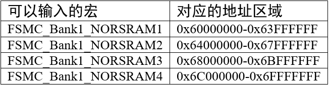
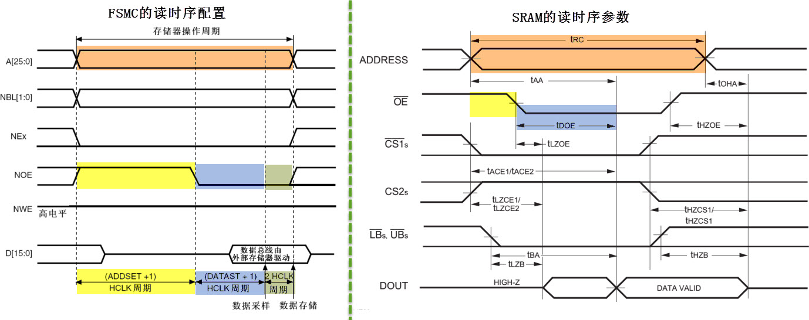
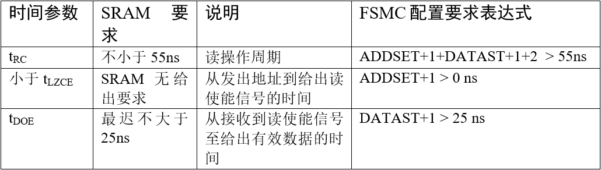
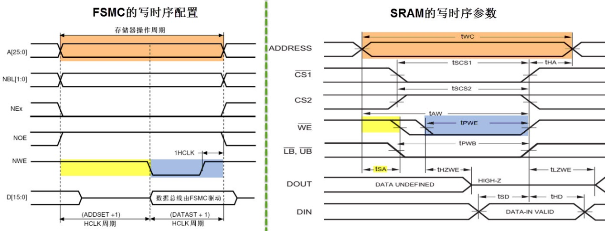
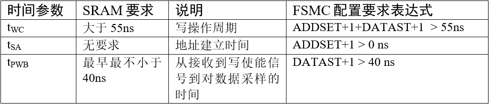

<!-- more -->

## 一、库中的寄存器

在 MDK 的寄存器定义里面，并没有定义 FSMC_BCRx、 FSMC_BTRx、 FSMC_BWTRx 等这个单独的寄存器，而是将他们进行了一些组合。FSMC_BCRx 和 FSMC_BTRx，组合成 BTCR[8]寄存器组，他们的对应关系如下：  

```c
BTCR[0]--->FSMC_BCR1， BTCR[1]--->FSMC_BTR1
BTCR[2]--->FSMC_BCR2， BTCR[3]--->FSMC_BTR2
BTCR[4]--->FSMC_BCR3， BTCR[5]--->FSMC_BTR3
BTCR[6]--->FSMC_BCR4， BTCR[7]--->FSMC_BTR4
```

FSMC_BWTRx 则组合成 BWTR[7]，他们的对应关系如下：

```c
BWTR[0]--->FSMC_BWTR1， BWTR[2]--->FSMC_BWTR2
BWTR[4]--->FSMC_BWTR3， BWTR[6]--->FSMC_BWTR4
BWTR[1]、 BWTR[3]和 BWTR[5]保留，没有用到
```

其实我们使用的是库函数，这里不需要太深究。

## 二、初始化结构体

### 1. 结构体定义

```c
typedef struct
{
    uint32_t NSBank;           // BANKx(NORSRAM)的区域(1-4)
    uint32_t DataAddressMux;   // 设置地址总线与数据总线是否复用，仅用于 NOR
    uint32_t MemoryType;       // 存储器类型
    uint32_t MemoryDataWidth;  // 数据宽度位数
    uint32_t BurstAccessMode;  // 设置是否使用突发访问模式，仅用于同步类型的存储器
    uint32_t WaitSignalPolarity; // 等待信号的极性,仅用于同步类型的存储器
    uint32_t WrapMode;           // 设置是否支持把非对齐的突发操作，仅用于同步类型的存储器
    uint32_t WaitSignalActive; // 存储器是在等待周期之前的一个时钟周期还是等待周期期间使能 NWAIT,仅用于同步类型的存储器
    uint32_t WriteOperation;   // 存储器写使能
    uint32_t WaitSignal;       // 等待使能位,适用于突发模式访问
    uint32_t ExtendedMode;     // 是否启用扩展模式
    uint32_t AsynchronousWait; // 是否使能异步传输模式下的等待信号
    uint32_t WriteBurst;       // 禁止突发写,适用于突发模式访问
    uint32_t PageSize;
} FSMC_NORSRAM_InitTypeDef;  
```

### 2. 成员说明

（1）NSBank ：用于选择 FSMC 映射的存储区域，它的可选参数以及相应的内核地址映射范围见表 ：



（2）DataAddressMux ：用于设置地址总线与数据总线是否复用 (Enable /Disable)，在控制 NOR FLASH 时，可以地址总线与数据总线可以分时复用，以减少使用STM32 信号线的数量。

（3）MemoryType ：用于设置要控制的存储器类型，它支持控制的存储器类型为 SRAM、 PSRAM以及 NOR FLASH 。

（4）MemoryDataWidth ：用于设置要控制的存储器的数据宽度，可选择设置成8或16位。

（5）BurstAccessMode ：用于设置是否使用突发访问模式 ，突发访问模式是指发送一个地址后连续访问多个数据，非突发模式下每访问一个数据都需要输入一个地址，仅在控制同步类型的存储器时才能使用突发模式。

（6）WaitSignalPolarity ：用于设置等待信号的有效极性，即要求等待时，使用高电平还是低电平。

（7）WrapMode ：用于设置是否支持把非对齐的 AHB 突发操作分割成 2 次线性操作，该配置仅在突发模式下有效。

（8）WaitSignalActive ：用于配置在突发传输模式时，决定存储器是在等待状态之前的一 个数据周期有效还是在等待状态期间有效。

（9）WriteOperation：用于设置是否写使能，禁止写使能的话 FSMC 只能从存储器中读取数据，不能写入。

（10）WaitSignal：用于设置当存储器处于突发传输模式时，是否允许通过 NWAIT 信号插入等待状态。

（11）ExtendedMode：用于设置是否使用扩展模式，在非扩展模式下，对存储器读写的时序都只使用 FSMC_BCR 寄存器中的配置；在扩展模式下，对存储器的读写时序可以分开配置，读时序使用 FSMC_BCR 寄存器，写时序使用 FSMC_BWTR 寄存器的配置。

（12）AsynchronousWait：用于设置是否使能在同步传输时使用的等待信号，在控制同步类型的 NOR 或 PSRAM时，存储器可以使用 FSMC_NWAIT 引脚通知 STM32 需要等待。

## 三、时序控制结构体

### 1. 结构体定义

```c
typedef struct
{
    uint32_t AddressSetupTime;      // 地址建立时间 ADDSET 范围:0~15 (模式 A 需要设置)
    uint32_t AddressHoldTime;       // 地址保持时间 ADDHLD 范围:1~15，模式 A 未用到
    uint32_t DataSetupTime;         // 数据建立时间 DATAST 范围:1~255 (模式 A 需要设置)
    uint32_t BusTurnAroundDuration; // 总线恢复时间 BUSTURN 范围:0~15，设置总线转换周期，仅用于复用模式的 NOR 操作
    uint32_t CLKDivision;           // 时钟分频因子 CLKDIV 范围:2~16，仅用于同步类型的存储器
    uint32_t DataLatency;           // 数据产生时间 ACCMOD 范围:2~17，仅用于 NOR
    uint32_t AccessMode;            // FSMC的模式
} FSMC_NORSRAM_TimingTypeDef;
```

### 2. 成员说明

（1）AddressSetupTime ：设置地址建立时间，即 FSMC 模式 A 的读时或者写时序 中的 ADDSET值，它可以被设置为 0-0xF 个 HCLK 周期数，按默认配置， HCLK 的时钟频率为 72MHz，即一个 HCLK 周期为 1/72 微秒。  

（2）AddressHoldTime ：设置地址保持时间，它可以被设置为 0-0xF 个 HCLK 周期数。  

（3）DataSetupTime ：设置数据建立时间，即 FSMC 模式 A 的读时序或者写时序 中的 DATAST值，它可以被设置为 0-0xF 个 HCLK 周期数。  

（4）BusTurnAroundDuration ：设置总线转换周期，在 NOR FLASH 存储器中，地址线与数据线可以分时复用，总线转换周期就是指总线在这两种状态间切换需要的延时，防止冲突。控制其它存储器时这个参数无效，配置为 0 即可。 

（5） CLKDivision ：设置时钟分频，它以 HCLK 时钟作为输入，经过 CLKDivision 分频后输出到 FSMC_CLK 引脚作为通讯使用的同步时钟。控制其它异步通讯的存储器时这个参数无效，配置为 0 即可。

（6）DataLatency ：设置数据保持时间，它表示在读取第一个数据之前要等待的周期数，该周期指同步时钟的周期，本参数仅用于同步 NOR FLASH 类型的存储器，控制其它类型的存储器时，本参数无效。  

（7）AccessMode ：设置存储器访问模式，不同的模式下 FSMC 访问存储器地址时引脚输出的时序不一样，可选 FSMC_AccessMode_A/B/C/D 模式。一般来说控制 SRAM 时使用 A 模式。  

### 3. 时序参数的确定

在这个时序结构体配置中，由于我们要控制的是 SRAM，所以选择 FSMC 为模式 A，在该模式下配置 FSMC 的控制时序结构体中，实际上只有地址建立时间 FSMC_AddressSetupTime（即 ADDSET 的值）以及数据建立时间 ，FSMC_DataSetupTime（即 DATAST 的值）成员的配置值是有效的，其它 SRAM 没使用到的成员值全配置为 0 即可。而且，这些成员值使用的单位为： 1 个 HCLK 的时钟周期，而 HCLK 的时钟频率为 72MHz，对应每个时钟周期为 1/72 us。  

- 读时序参数要满足的条件



从上边的时序图中，我们得到如下关系：



根据 FSMC 配置表达式的配置要求把时间单位 1/72 微秒 (即 1000/72 纳秒) 代入，可求得 ADDSET= 0， DATAST=1 时即可符合要求。如：

```c
tRC=ADDSET+1+DATAST+1+2 =( 0+1+1+1+2 )*1000/72 = 69 ns > 55 ns
tDOE=DATAST+1 = (1+1)*1000/72 = 27.7 > 25 ns
```

不过，经实验总结出该配置在连续读取多个数据的时候会出现问题，更正确的配置为 ADDSET=0，DATAST=2，而这样的配置与写时序是一致的  

- 写时序参数要满足的条件



从上边的时序图中，我们得到如下关系：



根据 FSMC 配置表达式的配置要求把时间单位 1/72 微秒 (即 1000/72 纳秒) 代入，可求得 ADDSET= 0， DATAST=2 时即可符合要求。如：

```c
tWC = ADDSET+1+DATAST+1 =( 0+1+2+1 )*1000/72 = 55.555 ns > 55 ns
tPWB = DATAST+1 = (2+1) *1000/72 = 41.6666 > 40 ns
```

把计算得的参数赋值到时序结构体中的 FSMC_AddressSetupTime（即 ADDSET 的值）及FSMC_DataSetupTime（即 DATAST 的值）中，然后再把时序结构体作为指针赋值到下面的 FSMC初始化结构体中，作为读写的时序参数，最后再调用 FSMC_NORSRAMInit 函数即可把参数写入到相应的寄存器中。  

后边在读写外部SRAM实例中还会详细去学习时间参数怎么确定。
