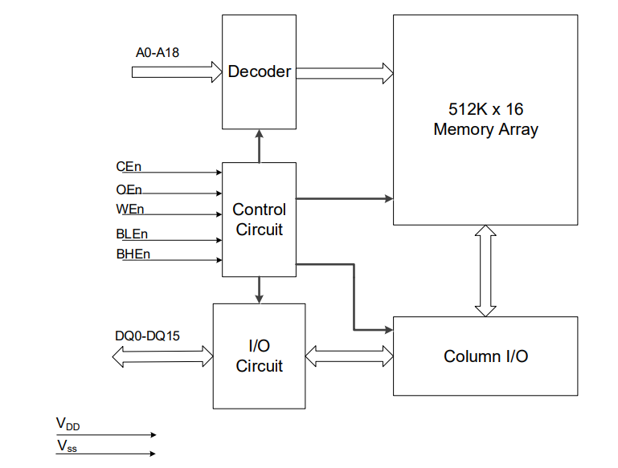
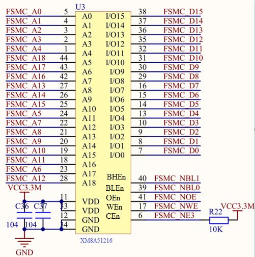

<!-- more -->

## 一、简介

XM8A51216 是深圳星忆存储科技有限公司（[星忆存储](http://www.xingmem.com/index.php) ）生产的一颗 16 位宽 512K（512*16，即 1M 字节）容量的 CMOS 静态内存芯片。我们可以在这里找到它的芯片手册：。该芯片具有如下几个特点 ：

（1）高速。 具有最高访问速度 10/12ns。

（2）低功耗。

（3）TTL 电平兼容。

（4）全静态操作。不需要刷新和时钟电路。

（5）三态输出。

（6）字节控制功能。支持高/低字节控制。  

## 二、功能框图

功能框图我们可以看 [XM8A51216V33(8M).pdf (xingmem.com)](http://www.xingmem.com/download/datasheet/XM8A51216V33(8M).pdf) 的 Logic Block Diagram：



图中 A0\~18 为地址线，总共 19 根地址线（即 2^19=512K， 1K=1024）； DQ0\~15 为数据线，总共 16 根数据线。 CEn 是芯片使能信号，低电平有效； OEn 是输出使能信号，低电平有效；WEn 是写使能信号，低电平有效； BLEn 和 BHEn 分别是高字节控制和低字节控制信号；

## 三、与STM32接线

战舰 STM32F103 使用的是 TSOP44 封装的 XM8A51216 芯片，该芯片直接接在 STM32F1的 FSMC 上，   



从原理图可以看出， XM8A51216 同 STM32F1 的连接关系：  

```c
A[0:18]--->FMSC_A[0:18](不过顺序错乱了)
D[0:15]--->FSMC_D[0:15]
BHEn   --->FSMC_NBL1
BLEn   --->FSMC_NBL0
OEn    --->FSMC_OE
WEn    --->FSMC_WE
CEn    --->FSMC_NE3
```

XM8A51216 的 A[0:18]并不是按顺序连接 STM32F1 的 FMSC_A[0:18]，不过这并不影响我们正常使用外部 SRAM，因为地址具有唯一性。所以，只要地址线不和数据线混淆，就可以正常使用外部 SRAM。这样设计的好处，就是可以方便 PCB 布线。
