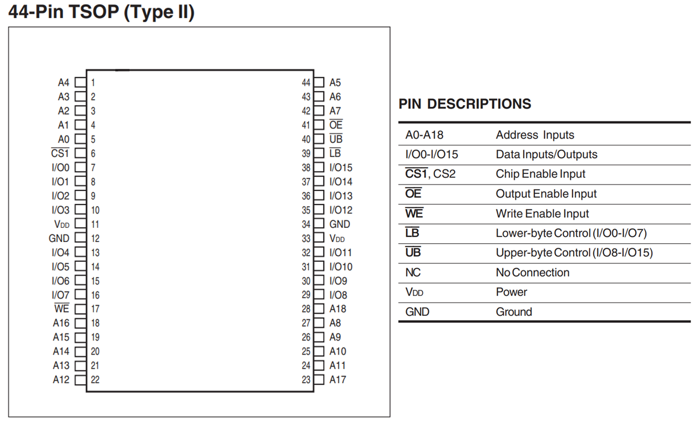
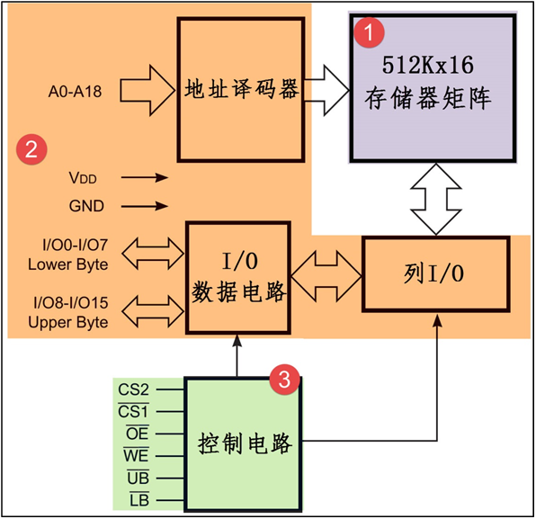
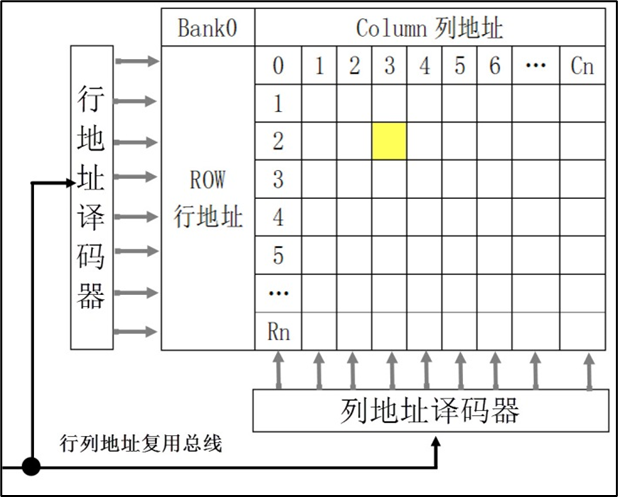
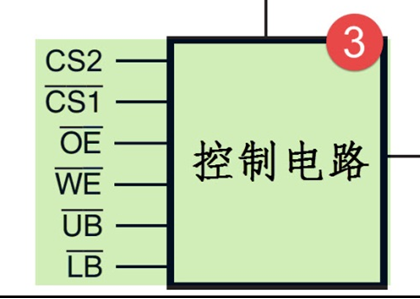
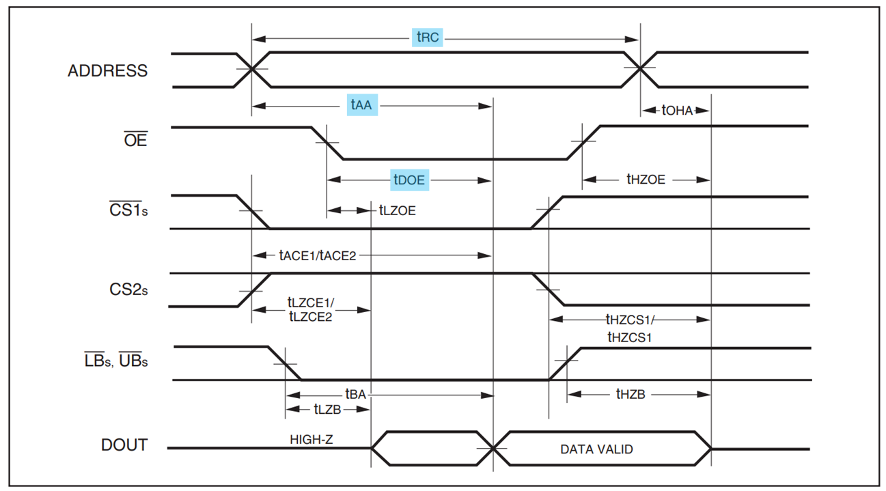
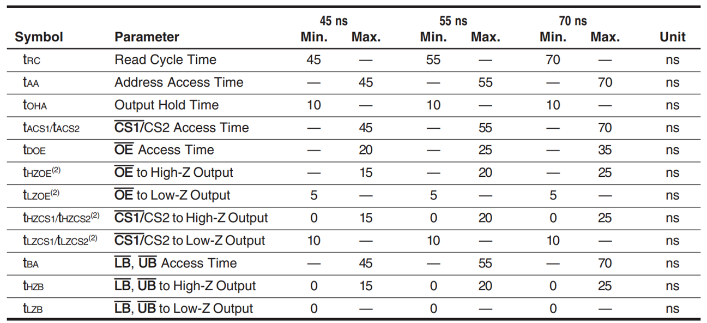
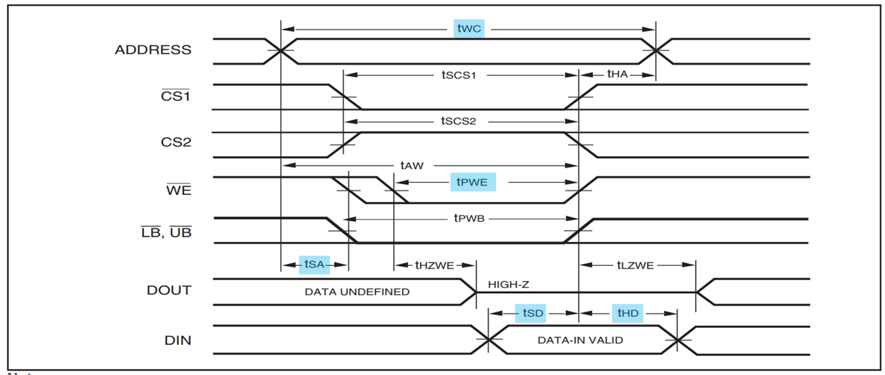
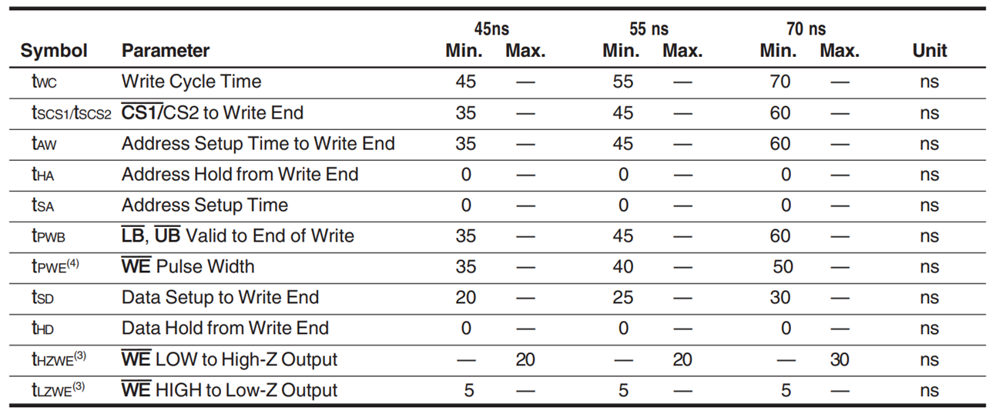
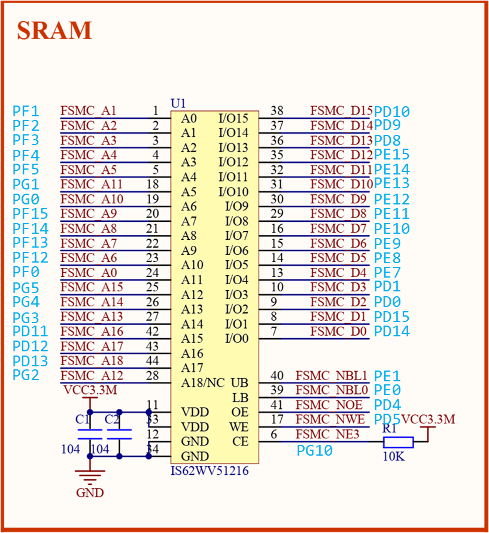

<!-- more -->

## 一、简介

 IS62WV51216是ISSI（[Integrated Silicon Solution, Inc](https://www.issi.com/CN/index.shtml)）公司生产的一颗16位宽512K（512\*16，即1M字节）容量的CMOS静态内存（SRAM）芯片。开发板上使用的完整的型号是 [IS62WV51216BLL](https://www.issi.com/WW/pdf/62WV51216ALL.pdf)，它有以下特点：

（1）高速。具有45ns/55ns访问速度。

（2）低功耗。操作时：36mW;待机时：12uW。

（3）兼容TTL电平。

（4）全静态操作。不需要刷新和时钟电路。 

（5）三态输出。

（6）字节控制功能。支持高/低字节控制。

## 二、引脚说明



各个引脚的说明如下图表（表中的#就表示图中的字母上方的横线，表示低电平有效）：

| **信号线** | **类型** | **说明**                                                     |
| ---------- | -------- | ------------------------------------------------------------ |
| A0-A18     | I        | 地址输入                                                     |
| I/O0-I/O7  | I/O      | 数据输入输出信号，低字节                                     |
| I/O8-I/O15 | I/O      | 数据输入输出信号，高字节                                     |
| CS2 和CS1# | I        | 片选信号，CS2高电平有效，CS1#低电平有效，部分芯片只有其中一个引脚 |
| OE#        | I        | 输出使能信号，低电平有效                                     |
| WE#        | I        | 写入使能信号，低电平有效                                     |
| UB#        | I        | 数据掩码信号Upper  Byte，高位字节允许访问，低电平有效，      |
| LB#        | I        | 数据掩码信号Lower  Byte，低位字节允许访问，低电平有效        |

SRAM的控制比较简单，只要控制信号线使能了访问，从地址线输入要访问的地址，即可从I/O数据线写入或读出数据。

## 三、功能框图

功能框图我们可以看[IS62WV51216BLL-datasheet](https://www.issi.com/WW/pdf/62WV51216ALL.pdf)的 FUNCTIONAL BLOCK DIAGRAM部分：



### 1. ①存储器矩阵

SRAM的存储矩阵如下图所示：



SRAM内部包含的存储阵列，可以把它理解成一张表格，数据就填在这张表格上。和表格查找一样，指定一个行地址和列地址，就可以精确地找到目标单元格，这是SRAM芯片寻址的基本原理。这样的每个单元格被称为存储单元，而这样的表则被称为**存储矩阵**。

### 2. ②地址译码器、列I/O和I/O数据电路


地址译码器把N根地址线转换成2N根信号线，每根信号线对应一行或一列存储单元，通过地址线找到具体的存储单元，实现寻址。如果存储阵列比较大，地址线会分成行和列地址，或者行、列分时复用同一地址总线，访问数据寻址时先用地址线传输行地址再传输列地址。  

我们使用的这个的SRAM比较小，没有列地址线，它的数据宽度为16位，即一个行地址对应2字节空间，框图中左侧的A0-A18是行址信号（共19根），当有18根地址线一共可以表示$2^{18}=2^8·1024=512K$行存储单元，所以18根地址线一共能访问512Kx16bits大小的空间，一共就是512K\*2B=1024KB=1MB，刚好就是1M字节的大小，所以其实实际上我们使用18根地址线就足够了。访问时，使用UB#或LB#线控制数据宽度。

我们每次给一个18位的地址，这会对应一个16位的数据空间，比如我们给了一个0地址，这个时候我们可以访问16位的数据：

| 地址 |   0~7位   |  8~15位   |
| :--: | :-------: | :-------: |
|  0   | xxxx xxxx | xxxx xxxx |
|  1   | xxxx xxxx | xxxx xxxx |

可以访问到第0字节和第1字节的数据，那么怎么确定访问的是第0字节还是第1字节呢？我们这个时候将这两个字节的0~7位看做低8位，对应I/O0~I/O7，8~15位看做高8位，对应I/O8~I/O15，然后通过UB#或LB#线来控制是要访问高位还是低位，UB#控制的是高字节的访问，LB#控制低字节的访问：

| LB#    | UB#    | 有效的数据线                                  |
| ------ | ------ | --------------------------------------------- |
| 低电平 | 高电平 | I/O0~I/O7，此时可访问低8位                    |
| 高电平 | 低电平 | I/O8~I/O15，此时可访问低8位                   |
| 低电平 | 低电平 | I/O0~I/O7和I/O8~I/O15均有效，可以访问16位数据 |
| 高电平 | 高电平 | 均无效，无法访问数据                          |

### 3. ③控制电路



控制电路主要包含了片选、读写使能以及上面提到的宽度控制信号UB#和LB#。利用CS2或CS1#片选信号，可以把多个SRAM芯片组成一个大容量的内存条。OE#和WE#可以控制读写使能，防止误操作。

访问时，使用 UB# 或 LB# 线控制数据宽度，例如，当要访问宽度为 16 位的数据时，使用行地址线指出地址，然后把 UB# 和 LB# 线都设置为低电平，那么 I/O0-I/O15 线都有效，它们一起输出该地址的 16 位数据 (或者接收 16 位数据到该地址)；当要访问宽度为 8 位的数据时，使用行地址线指出地址，然后把UB# 或 LB# 其中一个设置为低电平，I/O 会对应输出该地址的高 8 位和低 8 位数据，因此它们被称为数据掩码信号。  

## 四、读写时序

注意，下边的时序图都是没有时钟线的，这也说明SRAM是通过异步通信的方式进行读写的。

### 1. 读时序



上图为IS62WV51216芯片的8080并口读时序，我们重点要关注的是：读周期时间（tRC）、地址建立时间（tAA）和OE建立时间（tDOE）。开发板使用55ns的IS62WV51216，tRC=55ns，tAA=55ns（Max），tDOE=25ns（Max）：



读时序过程：

（1）主机使用地址信号线发出要访问的存储器目标地址；

（2）控制片选信号CS1#及CS2#使能存储器芯片；

（3）控制读使能信号OE#表示要读数据；

（4）使用掩码信号LB#与UB#指示要访问目标地址的高、低字节部分；

（5）存储器会通过数据线向主机输出目标数据。

### 2. 写时序



上图为IS62WV51216芯片的8080并口写时序，我们重点要关注的是：读周期时间(tWC)、地址建立时间(tSA)和OE建立时间(tPWE)。开发板使用55ns的IS62WV51216，tWC=55ns，tSA=0ns，tPWE=45ns（min）：



写时序过程：

（1）主机使用地址信号线发出要访问的存储器目标地址；

（2）控制片选信号CS1#及CS2#使能存储器芯片；

（3）控制写使能信号WE#表示要写数据；

（4）使用掩码信号LB#与UB#指示要访问目标地址的高、低字节部分；

（5）使用数据线向存储器传输目标数据。

### 3. 关键时间参数总结

| **时间参数** | **IS62WV51216BLL-55ns<br>型号要求的最短时间** | **说明**               |
| :----------: | :-------------------------------------------: | ---------------------- |
|     tRC      |                     55ns                      | 读操作周期             |
|     tAA      |                      0ns                      | 地址访问时间           |
|     tWC      |                     55ns                      | 写操作周期             |
|     tSA      |                      0ns                      | 地址建立时间           |
|     tSD      |                     25ns                      | 数据建立至写结束的时间 |
|     tHD      |                      0ns                      | 数据写结束后的保持时间 |

## 五、与STM32接线



理论上IS62WV51216与STM32的FSMC接线应该是这样的：

```c
A[0:18]--->FMSC_A[0:18]
D[0:15]--->FSMC_D[0:15]
UB     --->FSMC_NBL1
LB     --->FSMC_NBL0
OE     --->FSMC_OE
WE     --->FSMC_WE
CS     --->FSMC_NE3
```

实际上IS62WV51216 的 A[0:18]并不是按顺序连接 STM32F1 的 FMSC_A[0:18]，不过这并不影响我们正常使用外部 SRAM，因为地址具有唯一性。所以，只要地址线不和数据线混淆，就可以正常使用外部 SRAM。这样设计的好处，就是可以方便 PCB 布线。  
