<!-- more -->

## 一、硬件原理图

我使用的是正点原子战舰V3的板子，硬件连接如下图：


## 二、STM32CubeMX配置

这里只关心FSMC的配置，其他的可以看前边的笔记。

### 1. FSMC配置

#### 1.1 模式选择

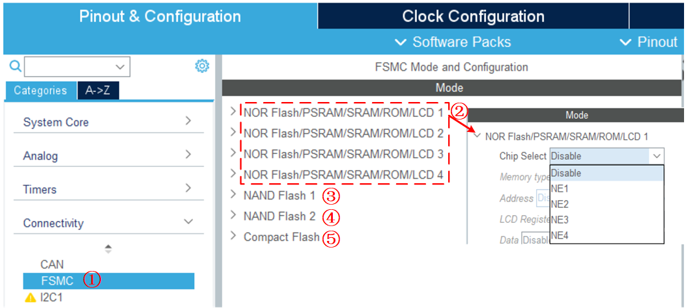

①、选择FSMC外设；

②、Bank1的四个区域，刚开始没看懂，后来发现就是这里有4个可选的，每一个应该是对应Bank1的一个区域，每个区域可以选择自己的NE引脚，但是这四个是不能选择相同的NE线，这应该就是为了让我们方便配置多个设备。所以对于上边的SRAM接线，我们只要选择了NE3线，在Mode选项卡中使用NOR Flash/PSRAM/SRAM/ROM/LCD x这四个中哪一个都没有问题，主要是NE线要选对。

> FSMC_NE 是用于控制存储器芯片的片选控制信号线，STM32 具有 FSMC_NE1/2/3/4 号引脚，不同的引脚对应 STM32 内部不同的地址区域。例如，当 STM32 访问 0x68000000-0x6BFFFFFF 地址空间时，FSMC_NE3 引脚会自动设置为低电平，由于它一般连接到外部存储器的片选引脚且低电平有效，所以外部存储器的片选被使能，而访问 0x60000000-0x63FFFFFF 地址时，FSMC_NE1 会输出低电平。当使用不同的 FSMC_NE 引脚连接外部存储器时，STM32 访问外部存储的地址不一样，从而达到控制多个外部存储器芯片的目的。

③、这里应该就是Bank2区域，我们没有用到；

④、这里应该是Bank3区域，我们也没有用到；

⑤、这里是Bank4区域，我们没有用到。

上边的Bank1我们选择使用 NOR Flash/PSRAM/SRAM/ROM/LCD 1，并使用NE3线来驱动我们的SRAM，这样使用的就是Bank1的第3区域了。

#### 1.2 参数配置

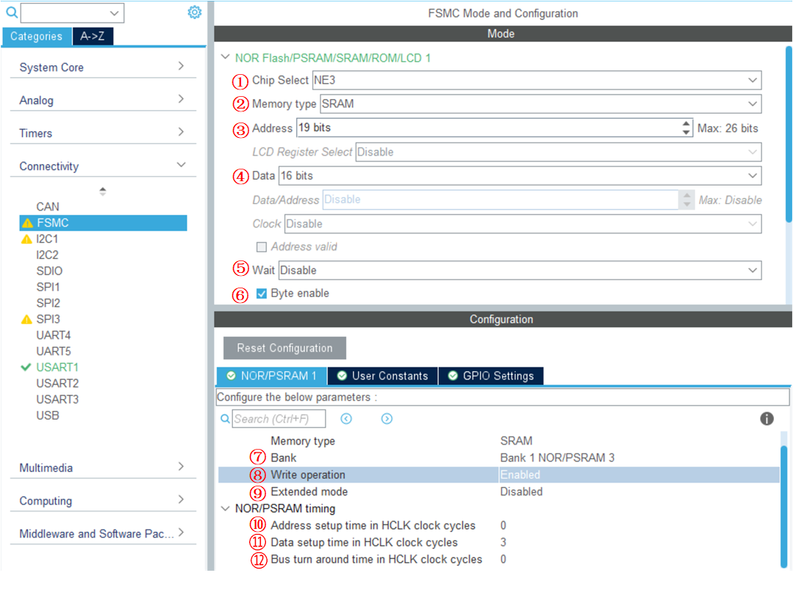

①、片选位，我们选择NE3，这是硬件电路决定的；

②、内存类型，这里我们使用的SRAM，就选择SRAM就可以啦；

③、地址位数，我们的SRAM有A[18:0]共19根线，虽说18根就能寻完1M空间，但是硬件电路接了，我们这里就配置成19位，也更符合逻辑，我试过配置成18也是没问题的。

④、数据位数，可选8位或者16位，我们使用的SRAM有I/O[15:0]共16位，所以这里选择16位即可。

⑤、是否使能同步模式，我们使用异步模式来驱动FSMC，这里禁止掉。

⑥、字节位使能，在网上查了一下，是什么高八位允许，我们上边选的16位数据的话，这里就需要勾选上。

⑦、Bank，这里不需要选，这是上面我们配置后显示的，可以看一下我们使用的区域是否正确。

⑧、写保护，我们要写数据到SRAM的话，这里需要设置为Enable。

⑨、扩展模式，我们驱动的SRAM可以使用FSMC读写相同的时序，这里我们不需要扩展模式，默认关闭即可。注意这里我们要是使能了扩展模式，就可以单独去配置读写时序参数，在配置界面也会多出一些参数配置选项，如下图：

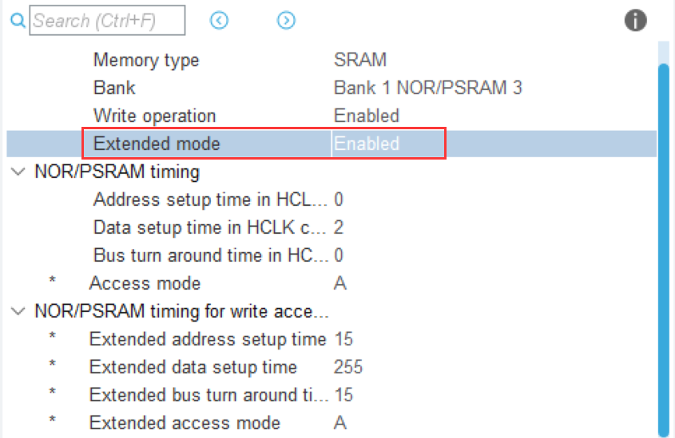

⑩、地址建立时间，看1.3时间参数配置一小节。 

⑪、数据建立时间，看1.3时间参数配置一小节。 

⑫、总线转化时间，这个其实我们并不需要太怎么关注，我看网上的例程大多数都直接设置为0就可以了。

#### 1.3 时间参数配置

上边我们需要配置地址建立时间，数据建立时间和总线转化时间，总线转化时间不用管，主要是地址建立时间和数据建立时间，我们下边来看一下这两个参数如何确定。我们配置时间参数的时候，**要满足条件的情况下尽可能短**。我们先计算一下HCLK是多长时间：

```c
HCLK = 1/72M (s) = 1/(72*1000*1000) S
                 = 1/(72*1000*1000) * 1000 ms
                 = 1/(72*1000*1000) * 1000 * 1000 us
                 = 1/(72*1000*1000) * 1000 * 1000 * 1000 ns
                 = 1000/72 ns
                 = 13.89 ns
```

##### 1.3.1 读时序

FSMC模式A和SRAM时序图对应如下图所示：

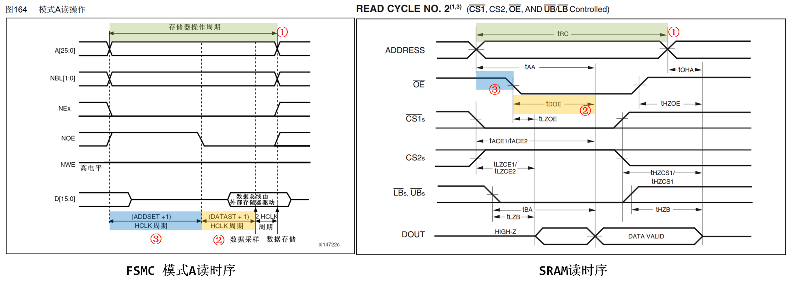

SRAM读时序各部分时间要求如下图（我们使用的是55ns的）：

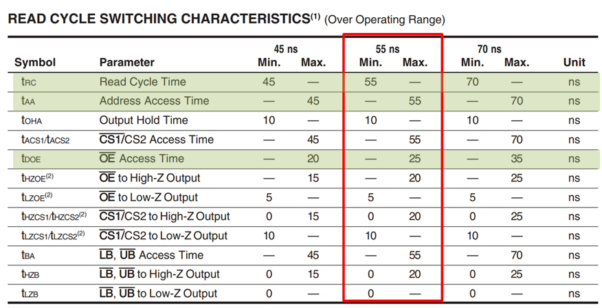

①处表示整个读的过程：

```c
(ADDSET+1)*HCLK + (DATAST+1)*HCLK + 2*HCLK ≥ tRC(55ns)
```

②处表示OE#使能信号拉低多久后DOUT上出现有效数据：

```c
(DATAST+1)*HCLK ≥ tDOE(25ns，最长在25ns后会给一个有效数据)
```

③处表示地址建立时间，就是地址建立之后多久使能信号OE#被拉低：

```c
(ADDSET+1)*HCLK  ≥ 0ns
```

 这个对应的是SRAM的从地址给出之后到OE#拉低的时间，SRAM中没有给出具体时间，我们可以看一个比它长的时间，比如tAA，手册上写tAA控制在55ns以内即可，没看到它有最小值，所以这里我们可以配置为0ns

所以对于读时序，我们可以确定如下参数：

```c
DATAST=1 ===> (DATAST+1)*HCLK=27.6ns ≥ 25ns(测试过这样配置成1的话，是无法正常读的)
ADDSET=0 ===> (ADDSET+1)*HCLK=13.8ns ≥ 0ns
(ADDSET+1)*HCLK + (DATAST+1)*HCLK + 2*HCLK = 69ns ≥ 55ns
    
DATAST=2 ===> (DATAST+1)*HCLK=41.4ns ≥ 25ns
ADDSET=0 ===> (ADDSET+1)*HCLK=13.8ns ≥ 0ns
(ADDSET+1)*HCLK + (DATAST+1)*HCLK + 2*HCLK = 82.8ns ≥ 55ns
    
DATAST=3 ===> (DATAST+1)*HCLK=55.2ns ≥ 25ns
ADDSET=0 ===> (ADDSET+1)*HCLK=13.8ns ≥ 0ns
(ADDSET+1)*HCLK + (DATAST+1)*HCLK + 2*HCLK = 96.6ns ≥ 55ns
```

##### 1.3.2 写时序

FSMC模式A和SRAM时序图对应如下图所示：

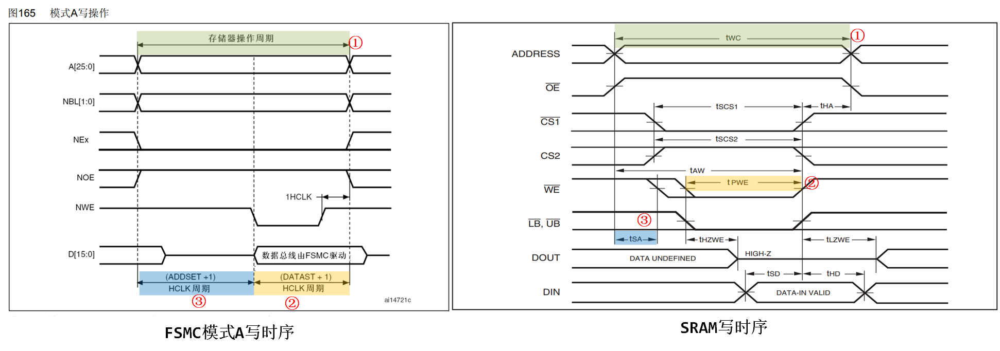

SRAM写时序各部分时间要求如下图（我们使用的是55ns的）：

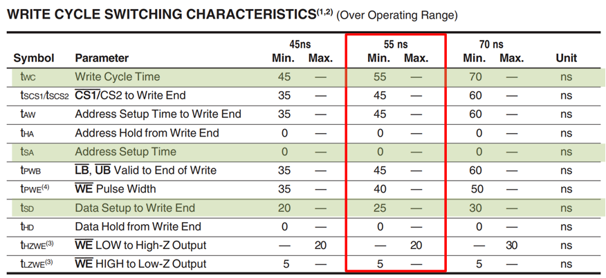

①处表示整个写入的过程：

```c
(ADDSET+1)*HCLK + (DATAST+1)*HCLK ≥ tWC(55ns)
```

②处表示WE#使能信号拉低持续的时间，在这个时间内SRAM才会将数据写到存储矩阵中：

```c
(DATAST+1)*HCLK ≥ tPWE(40ns) 
```

这样才能保证SRAM写入的时候DIN上的数据依然是有效的。

③处表示地址建立时间，就是地址建立之后多久使能信号WE#被拉低：

```c
(ADDSET+1)*HCLK ≥ tSA(0ns)
```

 这个对应的是SRAM的从地址给出之后到WE#拉低的时间，但是SRAM的时序图中那一小块没看明白，不过问题不大。

所以对于写时序，我们可以确定如下参数：

```c
DATAST=1 ===> (DATAST+1)*HCLK=27.6ns 无法满足≥40ns的条件
    
DATAST=2 ===> (DATAST+1)*HCLK=41.4ns ≥40ns
ADDSET=0 ===> (ADDSET+1)*HCLK=13.8ns ≥ 0ns
(ADDSET+1)*HCLK + (DATAST+1)*HCLK= 69ns
    
DATAST=3 ===> (DATAST+1)*HCLK=55.2ns ≥40ns
ADDSET=0 ===> (ADDSET+1)*HCLK=13.8ns ≥ 0ns
(ADDSET+1)*HCLK + (DATAST+1)*HCLK= 69ns
```

##### 1.3.3 参数的确定

我们经过上边的分析，得到如下参数：

```c
读时序：
DATAST=2 ===> (DATAST+1)*HCLK=41.4ns ≥ 25ns
ADDSET=0 ===> (ADDSET+1)*HCLK=13.8ns ≥ 0ns
(ADDSET+1)*HCLK + (DATAST+1)*HCLK + 2*HCLK = 82.8ns ≥ 55ns
    
写时序：
DATAST=2 ===> (DATAST+1)*HCLK=41.4ns ≥40ns
ADDSET=0 ===> (ADDSET+1)*HCLK=13.8ns ≥ 0ns
(ADDSET+1)*HCLK + (DATAST+1)*HCLK + 2*HCLK = 69ns   
```

我们发现，读写时序的参数是一样的，这样我们就可以不使用扩展模式，读写时序共用一套寄存器即可。所以最终的三个参数配置如下：

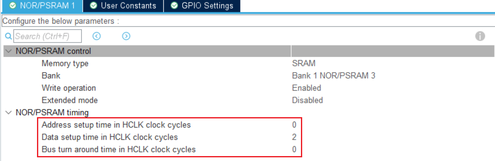

### 2. 时钟配置

我们来看一下时钟的配置情况：

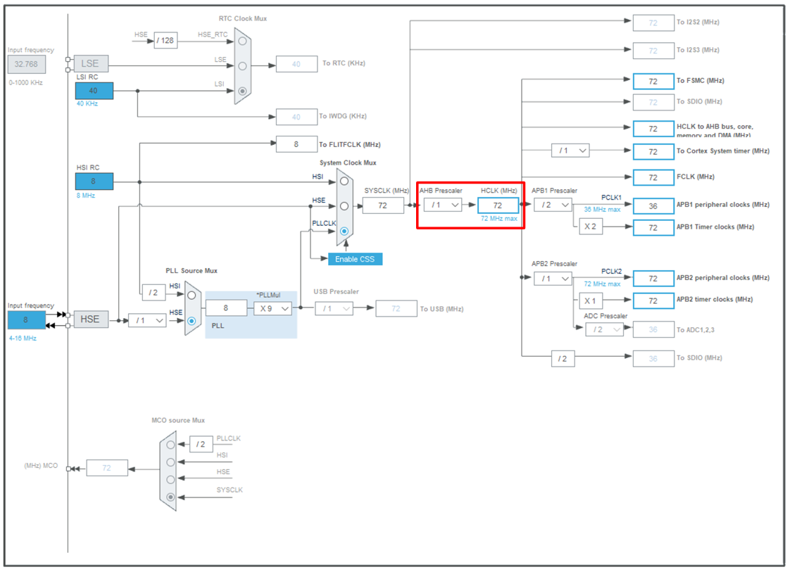

可以看到我们的时钟里边HCLK为72MHz，这样一个时钟周期就是13.8ns。

## 三、读写外部SRAM

### 1. SRAM基地址

```c
/* 使用NOR/SRAM的 Bank1.sector3,地址位HADDR[27,26]=10 
/  对IS61LV25616/IS62WV25616,地址线范围为A0~A17 
/  对IS61LV51216/IS62WV51216,地址线范围为A0~A18 */
#define Bank1_SRAM3_ADDR    ((uint32_t)(0x68000000))			
#define IS62WV51216_SIZE     0x100000   // 512*16/2bits = 0x100000, 1M字节
```

### 2. 初始化FSMC

```c
SRAM_HandleTypeDef hsram1;
/* FSMC initialization function */
void MX_FSMC_Init(void)
{
  FSMC_NORSRAM_TimingTypeDef Timing = {0};

  /** Perform the SRAM1 memory initialization sequence */
  hsram1.Instance = FSMC_NORSRAM_DEVICE;           // 实例类型:NOR/SRAM 设备
  hsram1.Extended = FSMC_NORSRAM_EXTENDED_DEVICE;
  /* hsram1.Init */
  hsram1.Init.NSBank = FSMC_NORSRAM_BANK3;         // 使用 NE3,对应 BANK1(NORSRAM)的区域 3
  hsram1.Init.DataAddressMux = FSMC_DATA_ADDRESS_MUX_DISABLE;  // 设置地址总线与数据总线是否复用，仅用于 NOR
  hsram1.Init.MemoryType = FSMC_MEMORY_TYPE_SRAM;              // 存储器类型:SRAM
  hsram1.Init.MemoryDataWidth = FSMC_NORSRAM_MEM_BUS_WIDTH_16; // 选择 16 位数据宽度(所接 SRAM 为 16 位数据宽度)
  hsram1.Init.BurstAccessMode = FSMC_BURST_ACCESS_MODE_DISABLE;// 是否使能突发访问,仅用于同步类型的存储器,此处未用到
  hsram1.Init.WaitSignalPolarity = FSMC_WAIT_SIGNAL_POLARITY_LOW;// 等待信号的有效极性,仅用于同步类型的存储器,此处未用到
  hsram1.Init.WrapMode = FSMC_WRAP_MODE_DISABLE;             // 设置是否支持把非对齐的突发操作，仅用于同步类型的存储器
  hsram1.Init.WaitSignalActive = FSMC_WAIT_TIMING_BEFORE_WS; // 存储器是在等待周期之前的一个时钟周期还是等待周期期间使能 NWAIT,仅用于同步类型的存储器,此处未用到
  hsram1.Init.WriteOperation = FSMC_WRITE_OPERATION_ENABLE;  // 存储器写使能
  hsram1.Init.WaitSignal = FSMC_WAIT_SIGNAL_DISABLE;         // 等待使能位,适用于突发模式访问,此处未用到
  hsram1.Init.ExtendedMode = FSMC_EXTENDED_MODE_DISABLE;     // 不使用扩展模式，读写使用相同的时序
  hsram1.Init.AsynchronousWait = FSMC_ASYNCHRONOUS_WAIT_DISABLE; // 是否使能异步传输模式下的等待信号,此处未用到
  hsram1.Init.WriteBurst = FSMC_WRITE_BURST_DISABLE;         // 禁止突发写,适用于突发模式访问,此处未用到
  /* Timing */
  Timing.AddressSetupTime = 0;         // 地址建立时间 ADDSET 范围:0~15 (模式 A 需要设置)
  Timing.AddressHoldTime = 15;         // 地址保持时间 ADDHLD 范围:1~15，这里其实没有用到，这是默认值
  Timing.DataSetupTime = 2;            // 数据建立时间 DATAST 范围:1~255 (模式 A 需要设置)
  Timing.BusTurnAroundDuration = 0;    // 总线恢复时间 BUSTURN 范围:0~15，这里其实没有用到
  Timing.CLKDivision = 16;             // 时钟分频因子 CLKDIV 范围:2~16，仅用于同步类型的存储器，这里其实没有用到
  Timing.DataLatency = 17;             // 数据产生时间 ACCMOD 范围:2~17，仅用于 NOR，这里其实没有用到
  Timing.AccessMode = FSMC_ACCESS_MODE_A; // 模式 A
  /* ExtTiming */

  if (HAL_SRAM_Init(&hsram1, &Timing, NULL) != HAL_OK)
  {
    Error_Handler( );
  }
  __HAL_AFIO_FSMCNADV_DISCONNECTED();
}
```

这里需要注意的是当我们启用扩展模式的时候，这样才能使用前面设置的模式A，否则其实我们使用的是模式1。

（1）NSBank ：设置存储区域 FSMC_Bank，FSMC_Bank 成 员 设 置 FSMC 的 SRAM存储区域映射选择为FSMC_Bank1_NORSRAM3，这是由于我们的 SRAM 硬件连接到 FSMC_NE3 和NOR/PSRAM 相关引脚，所以对应到存储区域 Bank1 SRAM3，对应的基地址为0x68000000；

（2）MemoryType ：由于我们控制的是 SRAM 类型存储器，所以 FSMC_MemoryType 成员要选择相应的FSMC_MEMORY_TYPE_SRAM；  

（3）MemoryDataWidth ：根据硬件的数据线连接，数据线宽度被配置为 16 位宽 FSMC_NORSRAM_MEM_BUS_WIDTH_16；  

（4）WriteOperation ：WriteOperation 用于设置写使能，只有使能了才能正常使用 FSMC 向外部存储器写入数据；  

（5）ExtendedMode ：在 FSMC_ExtendedMode 成员中可以配置是否使用扩展模式，当设置扩展模式时，我们可以使用FSMC_NORSRAM_TimingTypeDef定义两个结构体变量，分别配置读写时序，两种配置互相独立，可以赋值为不同的读写时序结构体。在本实例中不使用扩展模式，所以就只定义了一个时序结构体变量；  

### 3. 指针读写数据

完成初始化 SRAM 后，我们就可以利用它存储数据了，由于 SRAM 的存储空间是被映射到内核的寻址区域的，我们可以通过映射的地址直接访问 SRAM，访问这些地址时， FSMC 外设自动读写 SRAM，程序上无需额外操作。  

#### 3.1 按8位读写指定地址

```c
uint8_t ubWritedata_8b = 0, ubReaddata_8b = 0; 
*(volatile uint8_t*) (Bank1_SRAM3_ADDR + offset) = (uint8_t)(ubWritedata_8b); // 写入数据
ubReaddata_8b = *(volatile uint8_t*)(Bank1_SRAM3_ADDR + offset);              // 读取数据
```

（1）Bank1_SRAM3_ADDR ：SRAM映射到内核后的基地址。

（2）offset ：相对于基地址的偏移，我们使用的是 1M字节的SRAM，所以范围为0~0x100000（1MB）。

（3）ubWritedata_8b ： 要写入的8位数据。

（4）ubReaddata_8b ： 读取的8位数据存放在这里。

#### 3.2 按16位读写指定地址

```c
uint16_t uhWritedata_16b = 0, uhReaddata_16b = 0; 
*(volatile uint16_t*) (Bank1_SRAM3_ADDR + offset) = (uint16_t)(uhWritedata_16b); // 写入数据
uhReaddata_16b = *(volatile uint16_t*)(Bank1_SRAM3_ADDR + offset);               // 读取数据
```

（1）Bank1_SRAM3_ADDR ：SRAM映射到内核后的基地址。

（2）offset ：相对于基地址的偏移，我们使用的是 1M字节的SRAM，所以范围为0~0x80000（512KB）。

（3）ubWritedata_16b ： 要写入的16位数据。

（4）ubReaddata_16b ： 读取的16位数据存放在这里。

#### 3.3 8位数据指针读写测试

```c
int rw_8bit_test(void)
{
    uint32_t i = 0;
    uint8_t ubWritedata_8b = 0, ubReaddata_8b = 0;  
    /* 向整个SRAM写入数据  8位 */
    for (i = 0; i < IS62WV51216_SIZE; i++)
    {
        *(volatile uint8_t*) (Bank1_SRAM3_ADDR + i) = (uint8_t)(ubWritedata_8b + i);
    }

    /* 读取 SRAM 数据并检测*/
    for(i = 0; i < IS62WV51216_SIZE; i++ )
    {
        ubReaddata_8b = *(volatile uint8_t*)(Bank1_SRAM3_ADDR + i);  //从该地址读出数据

        if(ubReaddata_8b != (uint8_t)(ubWritedata_8b + i))      //检测数据，若不相等，跳出函数,返回检测失败结果。
        {
            printf("8位数据读写错误!!!\r\n");
            return -1;
        }
    }
	printf("8位数据读写测试成功!!!\r\n");
	return 0;
}
```

#### 3.4 16位数据指针读写测试

```c
int rw_16bit_test(void)
{
    uint32_t i = 0;
    uint16_t ubWritedata_16b = 0, ubReaddata_16b = 0;  
    /* 向整个SRAM写入数据  8位 */
    for (i = 0; i < IS62WV51216_SIZE/2; i++)
    {
        *(volatile uint16_t*) (Bank1_SRAM3_ADDR + i*2) = (uint16_t)(ubWritedata_16b + i);
    }

    /* 读取 SRAM 数据并检测*/
    for(i = 0; i < IS62WV51216_SIZE/2; i++ )
    {
        ubReaddata_16b = *(volatile uint16_t*)(Bank1_SRAM3_ADDR + i*2);  //从该地址读出数据

        if(ubReaddata_16b != (uint16_t)(ubWritedata_16b + i))      //检测数据，若不相等，跳出函数,返回检测失败结果。
        {
            printf("16位数据读写错误!!!\r\n");
            return -1;
        }
    }
	printf("16位数据读写测试成功!!!\r\n");
	return 0;
}
```

### 4. 读写指定字节数据

#### 4.1 向SRAM写入n个字节数据

```c
void FSMC_SRAM_WriteBuffer(uint8_t *pBuffer,uint32_t WriteAddr,uint32_t n)
{
	for(;n!=0;n--)
	{
		*(volatile uint8_t*)(Bank1_SRAM3_ADDR+WriteAddr)=*pBuffer;
		WriteAddr++;
		pBuffer++;
	}
}
```

**【函数说明】**在指定地址（WriteAddr+Bank1_SRAM3_ADDR）开始，连续写入n个字节。

**【参数说明】**

- pBuffer ：字节指针
- WriteAddr ：要写入的地址
- n ：要写入的字节数

#### 4.2 从SRAM读取n个字节数据

```c
void FSMC_SRAM_ReadBuffer(uint8_t *pBuffer,uint32_t ReadAddr,uint32_t n)
{
	for(;n!=0;n--)
	{
		*pBuffer++=*(volatile uint8_t*)(Bank1_SRAM3_ADDR+ReadAddr);
		ReadAddr++;
	}
}

```

**【函数说明】**在指定地址（WriteAddr+Bank1_SRAM3_ADDR）开始，连续读取n个字节。

**【参数说明】**

- pBuffer ：字节指针
- WriteAddr ：要读的起始地址
- n ：要读取的字节数

#### 4.3 读写n个字节数据测试

```c
void rw_nByte_test(void)
{
    uint32_t i = 0;
    uint8_t temp[32] = "This is my sram test!!!";
    uint8_t read[32] = {0};

    FSMC_SRAM_WriteBuffer(temp, 0, sizeof(temp));
    for(i = 0; i < 32; i++)
    {
        if(i % 2 == 0)
        {
            printf("\r\n0x%p:", (uint8_t*)(Bank1_SRAM3_ADDR + i));
        }
        printf("%c ", *(volatile uint8_t*)(Bank1_SRAM3_ADDR + i)); //显示测试数据
    }
    printf("\r\n\r\n");

    FSMC_SRAM_ReadBuffer(read, 0, sizeof(read));
    printf("read data:%s\r\n", read);

}
```

### 5. MDK预存数据？

注意这一部分的测试代码是在MDK工程中进行的。后边会说为什么一起这样区分。

#### 5.1 预存数据语法

在C语言中，有一个 \_\_attribute\_\_，通过它，我们可以直接定义数据到指定的地址去：

```c
uint8_t testRram[500] __attribute__((at(0X68000000)));// 测试用数组
```

testsram将会被定义到0X68000000为起始地址的空间中去。要注意使用这种方法定义变量时，必须在函数外把它定义成全局变量，才可以存储到指定地址上。

#### 5.2 预存数据测试函数

```c
void SRAM_Test(void)
{
    uint32_t i = 0;
    uint8_t temp[32] = "This is my sram!!!";
    uint8_t read[32] = {0};
    for(i = 0; i < 10; i++)
    {
        testsram[i] = i; //预存测试数据
        printf("0x%p testsram[%d]:%d\r\n", &testsram[i], i, testsram[i]); //显示测试数据
    }
    printf("\r\n\r\n");

    for(i = 0; i < 10; i++)
    {
        if(i % 2 == 0)
        {
            printf("\r\n0x%p:", (uint8_t*)(Bank1_SRAM3_ADDR + i));
        }
        printf("%d ", *(volatile uint8_t*)(Bank1_SRAM3_ADDR + i)); //显示测试数据
    }
    printf("\r\n\r\n");

    FSMC_SRAM_WriteBuffer(temp, 0, sizeof(temp));
    for(i = 0; i < 10; i++)
    {
        if(i % 2 == 0)
        {
            printf("\r\n0x%p:", (uint8_t*)(Bank1_SRAM3_ADDR + i));
        }
        printf("%c ", *(volatile uint8_t*)(Bank1_SRAM3_ADDR + i)); //显示测试数据
    }
    printf("\r\n\r\n");

    FSMC_SRAM_ReadBuffer(read, 0, sizeof(read));
    printf("read:%s\r\n", read);

}
```

#### 5.3 测试效果

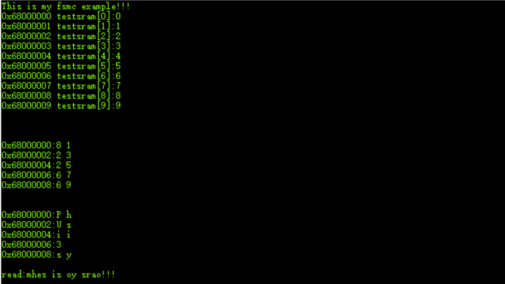

有没有发现，最后读取出来的字符串数据是有问题的，按理来说应该是输出 This is my sram!!! 才对，可以最终输出数据有问题，我们会发现SRAM的每个地址的数据也和预想的不一样。此时我们就要考虑数据建立时间问题了，我们往上加1（将DATAST配置为3），然后重新编译下载，会发现数据正常了：

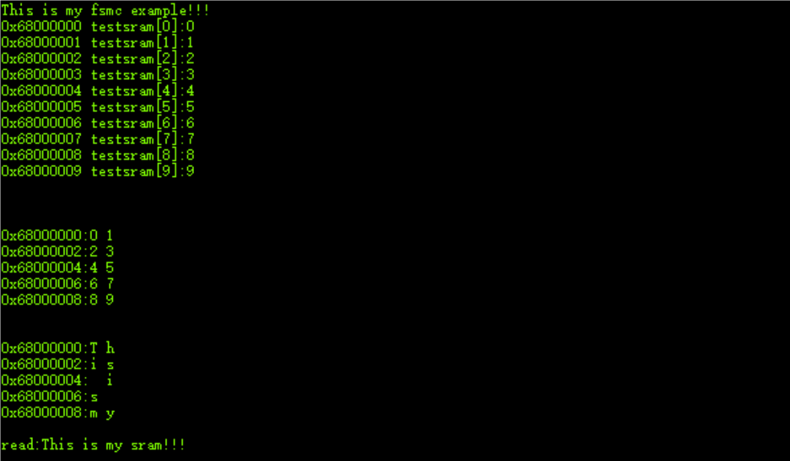

由此可知，我们计算出来的时间与临界值太过于接近，可能也会有问题，有问题的时候我们可以增加一些时间，然后再测试。

### 6. Makefile工程？

我后来使用VScode+STM32CubeMX生成的Makefile文件来开发，所以这里遇到了一个坑。

#### 6.1 预存数据测试

我们先按上边的方式预存数据到0X68000000地址，测一下效果，我们对测试函数进行一下精简：

```c
uint8_t testSram[500] __attribute__((at(0X68000000)));// 测试用数组

void SRAM_Test(void)
{
    uint32_t i = 0;

    for(i = 0; i < 10; i++)
    {
        testSram[i] = i; //预存测试数据
        printf("%p testSram[%ld]:%d\r\n", &testSram[i], i, testSram[i]); // 显示测试数据
    }
    printf("\r\n\r\n");

    for(i = 0; i < 10; i++)
    {
        if(i % 2 == 0)
        {
            printf("\r\n%p:", (uint8_t*)(Bank1_SRAM3_ADDR + i));
        }
        printf("%d ", *(volatile uint8_t*)(Bank1_SRAM3_ADDR + i)); //显示测试数据
    }
    printf("\r\n\r\n");
}
```

然后我们进行编译，这个时候我们发现，报警告啦：

```shell
warning: 'at' attribute directive ignored [-Wattributes]
  137 | uint8_t testSram[500] __attribute__((at(0X68000000)));
```

#### 6.2 测试效果

我们会看到有如下打印：

```shell
This is my stm32f103zet6 test!
0x20000084 testSram[0]:0
0x20000085 testSram[1]:1
0x20000086 testSram[2]:2
0x20000087 testSram[3]:3
0x20000088 testSram[4]:4
0x20000089 testSram[5]:5
0x2000008a testSram[6]:6
0x2000008b testSram[7]:7
0x2000008c testSram[8]:8
0x2000008d testSram[9]:9


0x68000000:84 104 
0x68000002:105 115 
0x68000004:32 105 
0x68000006:115 32 
0x68000008:109 121 
```

咦？我们不是定义到0x68000000去了吗？为什么跑到0x20000084去了？这就是为什么上边要区分MDK工程和Makefile工程的原因啦。问题就出在上边的警告，arm-gcc中不支持at直接指定变量位置的写法，所以会警告，但是具体MDK为什么支持，倒是不是很清楚，可能是它会自动去修改链接脚本文件吧，我们这里看一下要是使用Makefile的话，如何定义变量到外部SRAM中去。

#### 6.3 修改链接文件

arm-gcc同样支持指定变量地址，只不过语法是下面这样的：

```assembly
__attribute__ ((section ("SECTIONNAME")))
```

换句话说，在链接文件中划分一个新的段，将这个变量放到这个段内就可以解决了。与scatter文件（MDK使用的链接文件格式）不同，由cubemx生成的Makefile工程使用的是ld文件，我们修改如下：

```assembly
/* Specify the memory areas */
MEMORY
{
RAM (xrw)      : ORIGIN = 0x20000000, LENGTH = 64K
FLASH (rx)      : ORIGIN = 0x8000000, LENGTH = 512K
SRAM (rx)      : ORIGIN = 0x68000000, LENGTH = 1024K
}

/* Define output sections */
SECTIONS
{
   /* 中间部分省略...... */
  ._user_heap_stack :
  {
    . = ALIGN(8);
    PROVIDE ( end = . );
    PROVIDE ( _end = . );
    . = . + _Min_Heap_Size;
    . = . + _Min_Stack_Size;
    . = ALIGN(8);
  } >RAM

  .sram :
  {
    . = ALIGN(4);
    __SRAM_SYMBOLS = .;       /* create a global symbol at ccmram start */
    *(.sram)
    *(.sram*)
    
    . = ALIGN(4);
    __SRAM_SYMBOLS = .;       /* create a global symbol at ccmram end */
  } >SRAM AT> FLASH
  /* 中间部分省略...... */
}
```

- 结尾的 >SRAM指上面花括号内的内容都放在第二部分中定义的SRAM空间中。如果没有 AT> FLASH ，那么编译bin文件时地址是连续的。

#### 6.4 测试数组定义

```c
uint8_t testSram[500] __attribute__((section(".sram")));// 测试用数组
```

#### 6.5 测试效果

这一次我们重新编译，下载，执行结果如下：

```c
This is my stm32f103zet6 test!
0x68000000 testSram[0]:0
0x68000001 testSram[1]:1
0x68000002 testSram[2]:2
0x68000003 testSram[3]:3
0x68000004 testSram[4]:4
0x68000005 testSram[5]:5
0x68000006 testSram[6]:6
0x68000007 testSram[7]:7
0x68000008 testSram[8]:8
0x68000009 testSram[9]:9
 


0x68000000:0 1 
0x68000002:2 3 
0x68000004:4 5 
0x68000006:6 7 
0x68000008:8 9 
```

可以看到，这样我们就将全局数组定义到了0x68000000起始的位置去。
