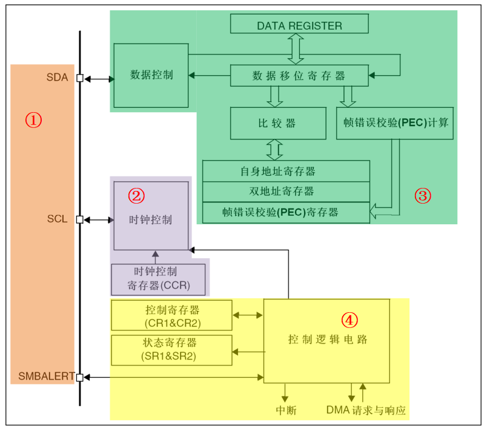
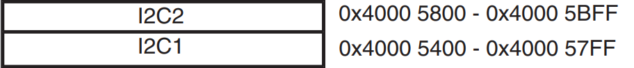
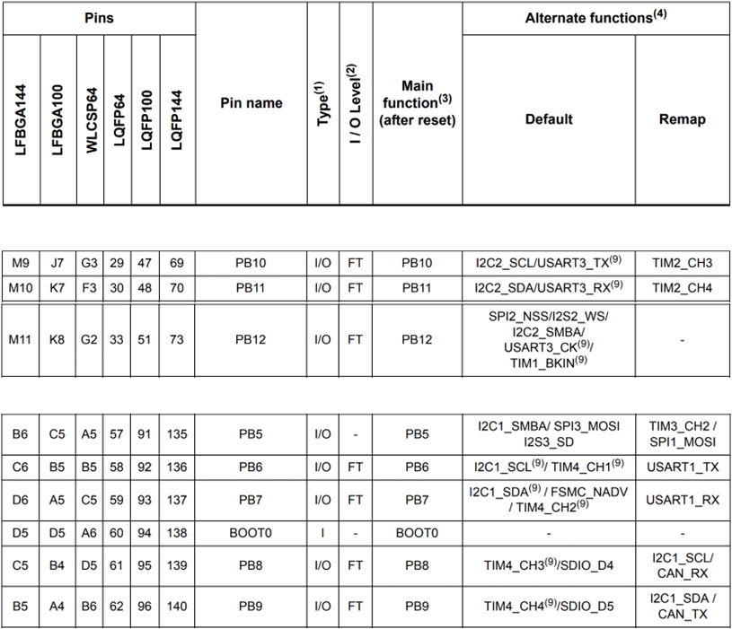
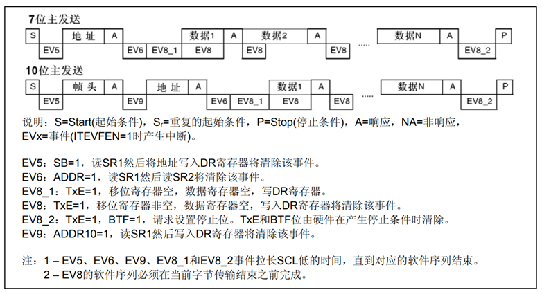
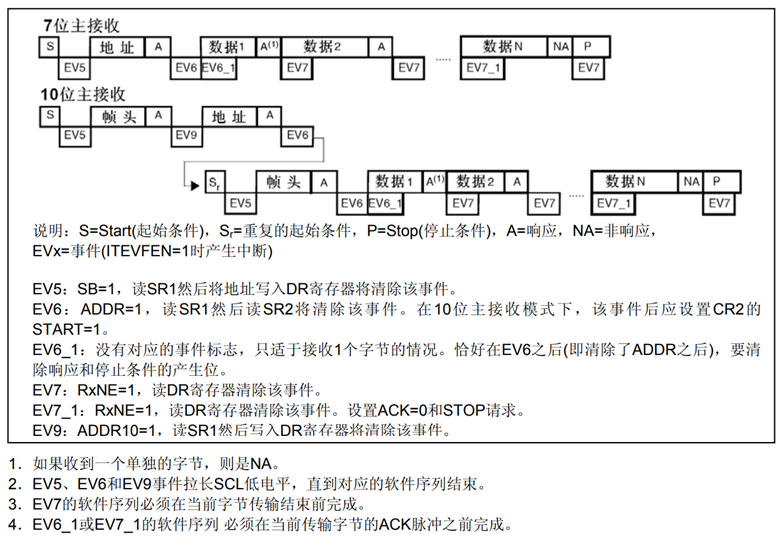

<!-- more -->

## 一、I2C简介

这一部分可以查看笔记[60-通信专题/01-I2C协议/LV001-I2C简介.md](/sdoc/communication/i2c/126b09043f2d250b963bfb0d)，这篇笔记主要是关于I2C的物理层协议，读写时序以及各个信号的说明包括对各信号的模拟。

## 二、STM32的物理I2C

### 1. 物理I2C框图

这一部分我们可以查看[STM32中文参考手册](https://www.stmcu.com.cn/Designresource/detail/localization_document%20/710001)的24 I2C接口一节：



### 2. ①通信引脚

通信引脚在框图中有三根：

（1）SDA——数据线；

（2）SCL——时钟线；

（3）SMBALERT——用于系统管理总线(SMBus)，SMBus是一个双线接口。通过它，各设备之间以及设备与系统的其他部分之间 可以互相通信。它基于I 2 C操作原理。SMBus为系统和电源管理相关的任务提供一条控制总线。 一个系统利用SMBus可以和多个设备互传信息，而不需使用独立的控制线路。

STM32芯片有多个I2C外设，它们的I2C通讯信号引出到不同的GPIO引脚上，使用时必须配置到这些指定的引脚，主要是看[STM32数据手册](https://www.st.com/resource/en/datasheet/stm32f103ze.pdf)的3 Pinouts and pin descriptions。首先我们看STM32的存储映像会发现，STM32F103ZET6有两个I2C：



它们对应的通信引脚分别为：



### 3. ②时钟控制逻辑

SCL线的时钟信号，由I2C接口根据时钟控制寄存器(CCR)控制，控制的参数主要为时钟频率。  

（1）可选择I2C通讯的“标准/快速”模式，这两个模式分别I2C对应100/400Kbit/s的通讯速率。  

（2）在快速模式下可选择SCL时钟的占空比，可选Tlow/Thigh=2或Tlow/Thigh=16/9模式。  

（3）CCR寄存器中12位的配置因子CCR，它与I2C外设的输入时钟源共同作用，产生SCL时钟。 

（4）STM32的I2C外设输入时钟源为PCLK1。  

那怎么计算时钟的频率呢？

```c
标准模式：                  Thigh = CCR*TPCKL1 Tlow = CCR*TPCLK1
快速模式中Tlow/Thigh=2时：   Thigh = CCR*TPCKL1 Tlow = 2*CCR*TPCKL1
快速模式中Tlow/Thigh=16/9时：Thigh = 9*CCR*TPCKL1 Tlow = 16*CCR*TPCKL1
```

例如，我们的PCLK1=36MHz，想要配置400Kbit/s的速率，计算方式如下：  

```c
PCLK时钟周期：           TPCLK1 = 1/36000000
目标SCL时钟周期：         TSCL = 1/400000
SCL时钟周期内的高电平时间： THIGH = TSCL/3
SCL时钟周期内的低电平时间： TLOW = 2*TSCL/3
计算CCR的值：             CCR = THIGH/TPCLK1 = 30
```

计算出来的CCR值写入到寄存器即可，向该寄存器位写入此值则可以控制 IIC 的通讯速率为 400KHz，其实即使配置出来的 SCL 时钟不完全等于标准的 400KHz， IIC 通讯的正确性也不会受到影响，因为所有数据通讯都是由 SCL 协调的，只要它的时钟频率不远高于标准即可。  

### 4. ③数据控制逻辑

I2C的SDA信号主要连接到数据移位寄存器上，数据移位寄存器的数据来源及目标是数据寄存器(DR)、地址寄存器(OAR)、 PEC寄存器以及SDA数据线。  

（1）当向外发送数据的时候，数据移位寄存器以“数据寄存器”为数据源，把数据一位一位地通过SDA信号线发送出去；

（2）当从外部接收数据的时候，数据移位寄存器把SDA信号线采样到的数据一位一位地存储到“数据寄存器”中。  

### 5. ④整体控制逻辑  

整体控制逻辑负责协调整个I2C外设，控制逻辑的工作模式根据我们配置的“控制寄存器(CR1/CR2)”的参数而改变。

在外设工作时，控制逻辑会根据外设的工作状态修改“状态寄存器(SR1和SR2)”，只要读取这些寄存器相关的寄存器位，就可以了解I2C的工作状态。  

## 三、I2C通讯过程

使用I2C外设通讯时，在通讯的不同阶段它会对“状态寄存器(SR1及SR2)”的不同数据位写入参数，通过读取这些寄存器标志来了解通讯状态。  STM32的物理I2C有以下四种模式，接口可以下述4种模式中的一种运行：

（1）从发送器模式

（2）从接收器模式

（3）主发送器模式

（4）主接收器模式

### 1. 主发送器模式



（1）控制产生起始信号(S)，当发生起始信号后，它产生事件“EV5”，并会对SR1寄存器的“SB”位置1，表示起始信号已经发送；  

（2）发送设备地址并等待应答信号，若有从机应答，则产生事件“EV6”及“EV8”，这时SR1寄存器的“ADDR”位及“TXE”位被置1， ADDR 为1表示地址已经发送， TXE为1表示数据寄存器为空；  

（3）往I2C的“数据寄存器DR”写入要发送的数据，这时TXE位会被重置0，表示数据寄存器非空， I2C外设通过SDA信号线一位位把数据发送出去后，又会产生“EV8”事件，即TXE位被置1，重复这个过程，可以发送多个字节数据；  

（4）发送数据完成后，控制I2C设备产生一个停止信号(P)，这个时候会产生EV2事件， SR1的TXE位及BTF位都被置1，表示通讯结束。  

### 2. 主接收器模式



（1）起始信号(S)是由主机端产生的，控制发生起始信号后，它产生事件“EV5”，并会对SR1寄存器的“SB”位置1，表示起始信号已经发送；  

（2）发送设备地址并等待应答信号，若有从机应答，则产生事件“EV6”这时SR1寄存器的“ADDR”位被置1，表示地址已经发送。  

（3）从机端接收到地址后，开始向主机端发送数据。当主机接收到这些数据后，会产生“EV7”事件， SR1寄存器的RXNE被置1，表示接收数据
寄存器非空，读取该寄存器后，可对数据寄存器清空，以便接收下一次数据。此时可以控制I2C发送应答信号(ACK)或非应答信号(NACK)，若应答，则重复以上步骤接收数据，若非应答，则停止传输；  

（4）发送非应答信号后，产生停止信号(P)，结束传输。  

## 四、相关寄存器

这一部分我们可以查看 [STM32中文参考手册](https://www.stmcu.com.cn/Designresource/detail/localization_document%20/710001)的24.6 I 2 C寄存器描述。

## 五、HAL库函数分析

### 1. I2C_InitTypeDef

```c
typedef struct {
uint32_t ClockSpeed;      // 设置 SCL 时钟频率，此值要低于 40 0000
uint32_t DutyCycle;       // 指定时钟占空比，可选 low/high = 2:1 及 16:9 模式
uint32_t OwnAddress1;     // 指定自身的 I2C 设备地址 1，可以是 7-bit 或者 10-bit
uint32_t AddressingMode;  // 指定地址的长度模式，可以是 7bit 模式或者 10bit 模式
uint32_t DualAddressMode; // 设置双地址模式 */
uint32_t OwnAddress2;     // 指定自身的 I2C 设备地址 2，只能是 7-bit
uint32_t GeneralCallMode; // 指定广播呼叫模式
uint32_t NoStretchMode;   // 指定禁止时钟延长模式
} I2C_InitTypeDef;
```

（1）ClockSpeed：设置的是 I2C 的传输速率，在调用初始化函数时，函数会根据我们输入的数值写入到 I2C的时钟控制寄存器 CCR。

（2）DutyCycle：设置的是 I2C 的 SCL 线时钟的占空比。该配置有两个选择，分别为低电平时间比高电平时间为 2： 1 (I2C_DUTYCYCLE_2) 和 16： 9 (I2C_DUTYCYCLE_16_9)。其实这两个模式的比例差别并不大，一般要求都不会如此严格，这里随便选就可以了。

（3）OwnAddress1：配置的是 STM32 的 I2C 设备自身地址 1，每个连接到 I2C 总线上的设备都要有一个自己的地址，作为主机也不例外。地址可设置为 7 位或 10 位 (受下面 (3) AddressingMode 成员决定)，只要该地址是 I2C 总线上唯一的即可。STM32 的 I2C 外设可同时使用两个地址，即同时对两个地址作出响应，这个结构成员 OwnAddress1 配置的是默认的、 OAR1 寄存器存储的地址，若需要设置第二个地址寄存器 OAR2，可使用 DualAddressMode 成员使能，然后设置 OwnAddress2 成员即可， OAR2 不支持 10 位地址。

（4）AddressingMode：选择 I2C 的寻址模式是 7 位还是 10 位地址。这需要根据实际连接到 I2C 总线上设备的地址进行选择，这个成员的配置也影响到 OwnAddress1 成员，只有这里设置成 10 位模式时， OwnAddress1 才支持 10 位地址。

（5）DualAddressMode：配置的是 STM32 的 I2C 设备自己的地址，每个连接到 I2C 总线上的设备都要有一个自己的地址，作为主机也不例外。地址可设置为 7 位或 10 位 (受下面 I2C_dual_addressing_mode 成员决定)，只要该地址是 I2C 总线上唯一的即可。STM32 的 I2C 外设可同时使用两个地址，即同时对两个地址作出响应，这个结构成员I2C_OwnAddress1 配置的是默认的、 OAR1 寄存器存储的地址，若需要设置第二个地址寄存器OAR2，可使用 I2C_OwnAddress2Config 函数来配置， OAR2 不支持 10 位地址。  

（6）OwnAddress2：本成员配置的是 STM32 的 I2C 设备自身地址 2，每个连接到 I2C 总线上的设备都要有一个自己的地址，作为主机也不例外。地址可设置为 7 位，只要该地址是 I2C 总线上唯一的即可。

（7）GeneralCallMode：本成员是关于 I2C 从模式时的广播呼叫模式设置。

（8）NoStretchMode：本成员是关于 I2C 禁止时钟延长模式设置，用于在从模式下禁止时钟延长。它在主模式下必须保持关闭。配置完这些结构体成员值，调用库函数 HAL_I2C_Init 即可把结构体的配置写入到寄存器中。  

### 2. 读取与写入

其实HAL_I2C_Mem_Write 就是等价于先用HAL_I2C_Master_Transmit传输第一个寄存器地址，再用HAL_I2C_Master_Transmit传输写入第一个寄存器的数据。所以，如果只是往某个外设中读/写数据，则用Master_Receive/Master_Transmit就OK了，如果是外设里面还有子地址（像E2PROM），有设备地址，还有每个数据的寄存器存储地址，则用Mem_Write。（Mem_Write是两个地址，Master_Transmit只有从机地址）。

#### 2.1 HAL_I2C_Master_Transmit()

```c
HAL_StatusTypeDef HAL_I2C_Master_Transmit(I2C_HandleTypeDef *hi2c,uint16_t DevAddress,uint8_t *pData,uint16_t Size,uint32_t Timeout);
- 功能： 写数据
- 参数：
  *hi2c      设置使用的是那个IIC 例：&hi2c1
  DevAddress 写入的地址 设置写入数据的地址 例：0xA0
  *pData     需要写入的数据
  Size       需要发送的字节数
  Timeout    最大传输时间，超过传输时间将自动退出传输函数
  
  // 发送两个字节数据，IIC写数据函数
- 例如：HAL_I2C_Master_Transmit(&hi2c1,0xA0,(uint8_t*)TxData,2,1000);
```

#### 2.2 HAL_I2C_Master_Receive()

```c
HAL_StatusTypeDef HAL_I2C_Master_Receive(I2C_HandleTypeDef *hi2c,uint16_t DevAddress,uint8_t *pData,uint16_t Size,uint32_t Timeout);
- 功能： 接收数据
- 参数：
  *hi2c      设置使用的是那个IIC 例：&hi2c2
  DevAddress 写入的地址 设置写入数据的地址 例：0xA0
  *pData     存储读取到的数据
  Size       需要发送的字节数
  Timeout    最大传输时间，超过传输时间将自动退出传输函数

```

#### 2.3 HAL_I2C_Mem_Write()

```c
HAL_StatusTypeDef HAL_I2C_Mem_Write(I2C_HandleTypeDef *hi2c, uint16_t DevAddress, uint16_t MemAddress, uint16_t MemAddSize, uint8_t *pData, uint16_t Size, uint32_t Timeout);
- 功能：IIC写多个数据，该函数适用于IIC外设里面还有子地址寄存器的地址，比如E2PROM，除了
       设备地址，每个存储字节都有其对应的地址。
- 参数：
  *hi2c      设置使用的是那个IIC 例：&hi2c2
  DevAddress 写入的地址 设置写入数据的地址 例：0xA0
  MemAddress 从机寄存器地址，每写入一个字节数据，地址就会自动+1
  MemAddSize 从机寄存器地址字节长度 8位/16位
             写入数据的字节类型 8位/16位
             I2C_MEMADD_SIZE_8BIT
             I2C_MEMADD_SIZE_16BIT
  *pData     需要写入的数据的起始地址
  Size       传输数据的大小，需要发送的字节数
  Timeout    最大传输时间，超过传输时间将自动退出传输函数
- 例如：HAL_I2C_Mem_Write(&hi2c1,ADDR,i,I2C_MEMADD_SIZE_8BIT,&(I2C_Buffer_Write[i]),8,1000);

```

#### 2.4 HAL_I2C_Mem_Read()

```c
HAL_StatusTypeDef HAL_I2C_Mem_Read(I2C_HandleTypeDef *hi2c, uint16_t DevAddress, uint16_t MemAddress, uint16_t MemAddSize, uint8_t *pData, uint16_t Size, uint32_t Timeout);
- 功能：IIC读多个数据，该函数适用于IIC外设里面还有子地址寄存器的地址，比如E2PROM，除了
       设备地址，每个存储字节都有其对应的地址。
- 参数：
  *hi2c      设置使用的是那个IIC 例：&hi2c2
  DevAddress 读取的地址 设置读取数据的地址 例：0xA0
  MemAddress 从机寄存器地址，每读入一个字节数据，地址就会自动+1
  MemAddSize 从机寄存器地址字节长度 8位/16位
             读取数据的字节类型 8位/16位
             I2C_MEMADD_SIZE_8BIT
             I2C_MEMADD_SIZE_16BIT
  *pData     需要读取的数据的起始地址
  Size       传输数据的大小，需要发送的字节数
  Timeout    最大传输时间，超过传输时间将自动退出传输函数
- 例如：HAL_I2C_Mem_Read(&hi2c1,ADDR,i,I2C_MEMADD_SIZE_8BIT,&(I2C_Buffer_read[i]),8,1000);

```
