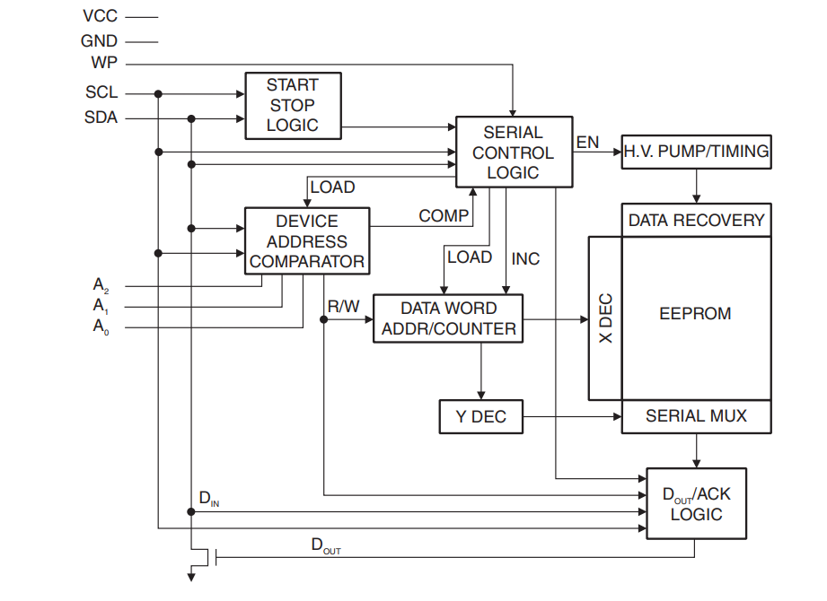
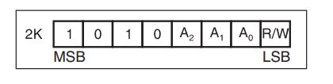
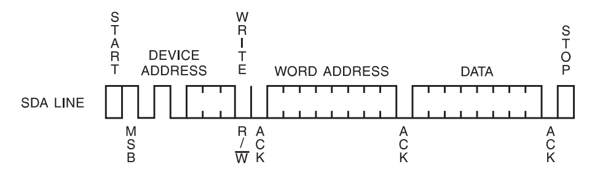
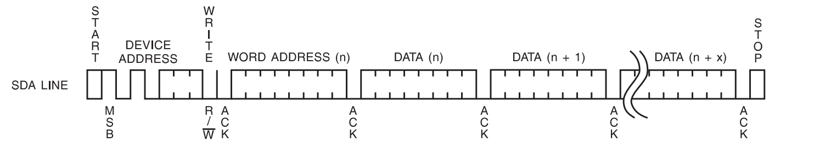
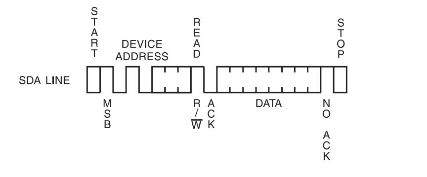
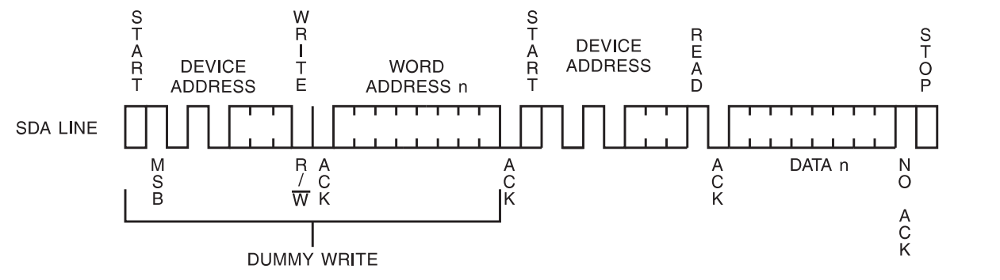
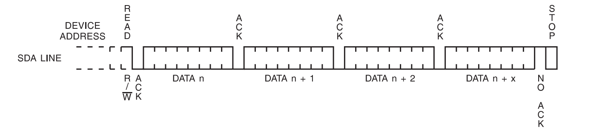

<!-- more -->

## 一、EEPROM简介

EEPROM (Electrically Erasable Programmable read only memory)是指带电可擦可编程只读存储器。是一种掉电后数据不丢失的存储芯片。 EEPROM 可以在电脑上或专用设备上擦除已有信息，重新编程。一般用在即插即用。

我们这一节的笔记主要是关于AT24C02的使用，它是一个串行电可擦除和可编程只读存储器(EEPROM)，总容量是256（2K/8)个字节，通过IIC通信。它是 [Atmel](https://www.microchip.com/en-us/tools-resources/search-discover/atmel-start) 公司的一款芯片，我们我使用的战舰V3的开发板上时AT24C02BN，我们可以在这里找到它的数据手册：[AT24C01A/02/04/08/16 (microchip.com)](https://ww1.microchip.com/downloads/en/DeviceDoc/doc5126.pdf)。

## 二、AT24C02功能

### 1. 框图

我们可以看 [AT24C01A/02/04/08/16 (microchip.com)](https://ww1.microchip.com/downloads/en/DeviceDoc/doc5126.pdf)



引脚功能描述如下：

| 引脚  | 说明                               |
| ----- | ---------------------------------- |
| A0~A2 | Address Input                      |
| SDA   | Serial Data                        |
| SCL   | Serial Clock Input                 |
| WP    | Write Protect                      |
| VCC   | Supply Voltage(VCC = 1.8V to 5.5V) |
| GND   | Ground                             |

### 2. 设备地址

我们知道I2C总线是通过设备地址来区分不同的设备，我们使用的AT24C02有三根地址线，它的地址是这样的：



A0~A2可以接GND（代表0）也可以接VCC（代表1），这样根据A0~A2的接线的不同，可以有不同的地址，比如我们把A0~A2全接地，那么设备地址就是1010000x。（我们可以看 [AT24C01A/02/04/08/16 (microchip.com)](https://ww1.microchip.com/downloads/en/DeviceDoc/doc5126.pdf) 的 6. Device Addressing）

那么当我们要读数据的时候，发送的地址就是10100001 = 0xA1，当我们要写数据的时候发送的地址就是10100000 = 0xA0。

### 3. 多少页？

我们需要知道的一些信息：

```c
AT24C02 一共是 2Kb = 2048/8B = 256B
```

我们看芯片手册有这么一句： 8-byte Page (2K) Write Modes，也就是说，这个256B按照8字节一页的方式，被分为32页：

```c
AT24C02 一共是 256B/8 = 32 页
```


## 三、读写数据

### 1. 写操作

#### 1.1 BYTE WRITE




#### 1.2 PAGE WRITE



### 2. 读操作

#### 2.1 CURRENT ADDRESS READ



#### 2.2 RANDOM READ



#### 2.3 SEQUENTIAL READ



### 3. 怎么找到要读写的位置？

上边是读写操作的过程，那么我们在实际读写过程中，怎么确定我们要往那个地址写数据呢？AT24C02一共是2Kbit，也就是256x8bit，也就是一共256页，每一页是1字节（8位），地址在实际读写的过程中是这样的：

|  地址  |   数据    |
| :----: | :-------: |
|  0x00  | xxxx xxxx |
|  0x01  | xxxx xxxx |
|  0x02  | xxxx xxxx |
| ...... |  ......   |
|  0xFF  | xxxx xxxx |
