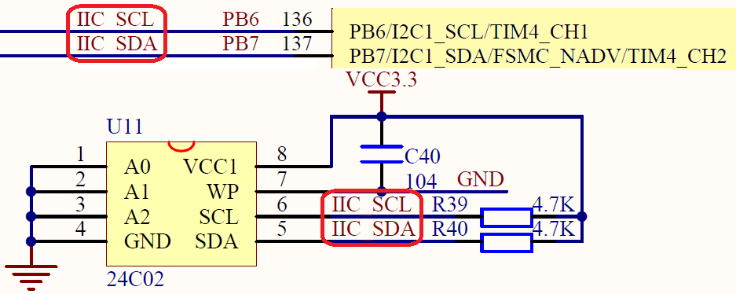
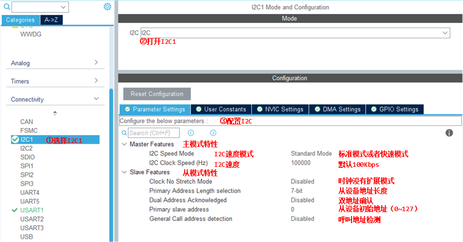
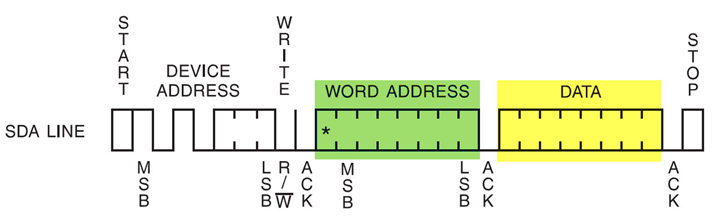
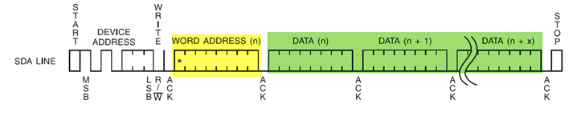

<!-- more -->

## 一、硬件原理图



可以看到这里的AT24C02接在了PB6和PB7，也就是I2C1上边。

## 二、物理I2C读写AT24C02

一般步骤如下：

（1）配置通讯使用的目标引脚为开漏模式；

（2）使能 I2C 外设的时钟；

（3）配置 I2C 外设的模式、地址、速率等参数并使能 I2C 外设；

（4）编写基本 I2C 按字节收发的函数；  

（5）编写读写 EEPROM 存储内容的函数；

（6）编写测试程序，对读写数据进行校验。  

### 1. STM32CubeMX配置



### 2. 宏定义

我们先来定义一些要用的宏：

```c
#define EEPROM_PAGESIZE  8    // AT24C01/02每页有8个字节，一共是32页
#define I2C_OWN_ADDRESS7 0X0A // STM32自己的地址，这个地址只要与STM32外挂的I2C器件地址不一样即可

/* 
 * AT24C02 2kb = 2048bit = 2048/8 B = 256 B 
 * 32 pages of 8 bytes each
 *
 * Device Address
 * 1 0 1 0 A2 A1 A0 R/W
 * 1 0 1 0 0  0  0  0 = 0XA0
 * 1 0 1 0 0  0  0  1 = 0XA1 
 */

#define EEPROM_ADDRESS        0xA0 // AT24C02的地址（A0~A2全部接0了）
```

### 3. 写入一个字节数据

```c
uint32_t I2C_EE_ByteWrite(uint8_t* pBuffer, uint8_t WriteAddr)
{
	HAL_StatusTypeDef status = HAL_OK;

	status = HAL_I2C_Mem_Write(&I2C_Handle, EEPROM_ADDRESS, (uint16_t)WriteAddr, I2C_MEMADD_SIZE_8BIT, pBuffer, 1, 100); 

	/* Check the communication status */
	if(status != HAL_OK)
	{
	/* Execute user timeout callback */
	//I2Cx_Error(Addr);
	}
	while (HAL_I2C_GetState(&I2C_Handle) != HAL_I2C_STATE_READY);

	/* Check if the EEPROM is ready for a new operation */
	while (HAL_I2C_IsDeviceReady(&I2C_Handle, EEPROM_ADDRESS, EEPROM_MAX_TRIALS, I2Cx_TIMEOUT_MAX) == HAL_TIMEOUT);

	/* Wait for the end of the transfer */
	while (HAL_I2C_GetState(&I2C_Handle) != HAL_I2C_STATE_READY);
	return status;
}
```

这里只是简单调用库函数 HAL_I2C_Mem_Write 就可以实现，通过封装一次使用更方。在这个通讯过程中， STM32 实际上通过 I2C 向 EEPROM 发送了两个数据，但为何第一个数据被解释为 EEPROM 的内存地址？这是由 EEPROM 的自己定义的单字节写入时序，见下图：



EEPROM 的单字节时序规定，向它写入数据的时候，第一个字节为内存地址，第二个字节是要写入的数据内容。所以我们需要理解：命令、地址的本质都是数据，对数据的解释不同，它就有了不同的功能。  

### 4. 按页写入数据

```c
uint32_t I2C_EE_PageWrite(uint8_t* pBuffer, uint8_t WriteAddr, uint8_t NumByteToWrite)
{
	HAL_StatusTypeDef status = HAL_OK;
	/* Write EEPROM_PAGESIZE */
	status=HAL_I2C_Mem_Write(&I2C_Handle, EEPROM_ADDRESS,WriteAddr, I2C_MEMADD_SIZE_8BIT, (uint8_t*)(pBuffer),NumByteToWrite, 100);

	while (HAL_I2C_GetState(&I2C_Handle) != HAL_I2C_STATE_READY);

	/* Check if the EEPROM is ready for a new operation */
	while (HAL_I2C_IsDeviceReady(&I2C_Handle, EEPROM_ADDRESS, EEPROM_MAX_TRIALS, I2Cx_TIMEOUT_MAX) == HAL_TIMEOUT);

	/* Wait for the end of the transfer */
	while (HAL_I2C_GetState(&I2C_Handle) != HAL_I2C_STATE_READY);
	return status;
}
```

在以上的数据通讯中，每写入一个数据都需要向 EEPROM 发送写入的地址，我们希望向连续地址写入多个数据的时候，只要告诉 EEPROM 第一个内存地址 address1，后面的数据按次序写入到address2、 address3…这样可以节省通讯的内容，加快速度。为应对这种需求， EEPROM 定义了一种页写入时序 : 



根据页写入时序，第一个数据被解释为要写入的内存地址 address1，后续可连续发送 n 个数据，这些数据会依次写入到内存中。这段页写入函数主体跟单字节写入函数是一样的，只是它在发送数据的时候，使用 while 循环控制发送多个数据，发送完多个数据后才产生 I2C 停止信号，只要每次传输的数据小于等于 EEPROM时序规定的页大小，就能正常传输。   

### 5. 多字节数据写入 

```c
void I2C_EE_BufferWrite(uint8_t* pBuffer, uint8_t WriteAddr, uint16_t NumByteToWrite)
{
  uint8_t NumOfPage = 0, NumOfSingle = 0, Addr = 0, count = 0;

  Addr = WriteAddr % EEPROM_PAGESIZE;
  count = EEPROM_PAGESIZE - Addr;
  NumOfPage =  NumByteToWrite / EEPROM_PAGESIZE;
  NumOfSingle = NumByteToWrite % EEPROM_PAGESIZE;
 
  /* If WriteAddr is I2C_PageSize aligned  */
  if(Addr == 0) 
  {
    /* If NumByteToWrite < I2C_PageSize */
    if(NumOfPage == 0) 
    {
      I2C_EE_PageWrite(pBuffer, WriteAddr, NumOfSingle);
    }
    /* If NumByteToWrite > I2C_PageSize */
    else  
    {
      while(NumOfPage--)
      {
        I2C_EE_PageWrite(pBuffer, WriteAddr, EEPROM_PAGESIZE); 
        WriteAddr +=  EEPROM_PAGESIZE;
        pBuffer += EEPROM_PAGESIZE;
      }

      if(NumOfSingle!=0)
      {
        I2C_EE_PageWrite(pBuffer, WriteAddr, NumOfSingle);
      }
    }
  }
  /* If WriteAddr is not I2C_PageSize aligned  */
  else 
  {
    /* If NumByteToWrite < I2C_PageSize */
    if(NumOfPage== 0) 
    {
      I2C_EE_PageWrite(pBuffer, WriteAddr, NumOfSingle);
    }
    /* If NumByteToWrite > I2C_PageSize */
    else
    {
      NumByteToWrite -= count;
      NumOfPage =  NumByteToWrite / EEPROM_PAGESIZE;
      NumOfSingle = NumByteToWrite % EEPROM_PAGESIZE;	
      
      if(count != 0)
      {  
        I2C_EE_PageWrite(pBuffer, WriteAddr, count);
        WriteAddr += count;
        pBuffer += count;
      } 
      
      while(NumOfPage--)
      {
        I2C_EE_PageWrite(pBuffer, WriteAddr, EEPROM_PAGESIZE);
        WriteAddr +=  EEPROM_PAGESIZE;
        pBuffer += EEPROM_PAGESIZE;  
      }
      if(NumOfSingle != 0)
      {
        I2C_EE_PageWrite(pBuffer, WriteAddr, NumOfSingle); 
      }
    }
  }  
}
```

多次写入数据时，利用 EEPROM 的页写入方式，避免单字节读写时候的等待。  其实它的主旨就是对输入的数据进行分页 (本型号芯片每页 8 个位)。通过“整除”计算要写入的数据 NumByteToWrite 能写满多少“完整的页”，计算得的值存储在 NumOfPage 中，但有时数据不是刚好能写满完整页的，会多一点出来，通过“求余”计算得出“不满一页的数据个数”就存储在 NumOfSingle 中。计算后通过按页传输 NumOfPage 次整页数据及最后的 NumOfSing 个数据，使用页传输，比之前的单个字节数据传输要快很多。

除了基本的分页传输，还要考虑首地址的问题。若首地址不是刚好对齐到页的首地址，会需要一个 count 值，用于存储从该首地址开始写满该地址所在的页，还能写多少个数据。实际传输时，先把这部分 count 个数据先写入，填满该页，然后把剩余的数据 (NumByteToWrite-count)，再重复上述求出 NumOPage 及 NumOfSingle 的过程，按页传输到 EEPROM。   

（1）若 writeAddress=16，计算得 Addr=16%8= 0 ， count=8-0= 8；

（2）同时，若 NumOfPage=22，计算得 NumOfPage=22/8= 2， NumOfSingle=22%8= 6。

（3）数据传输情况如下表 

| 不影响        | 0    | 1    | 2    | 3    | 4    | 5    | 6    | 7    |
| ------------- | ---- | ---- | ---- | ---- | ---- | ---- | ---- | ---- |
| 不影响        | 8    | 9    | 10   | 11   | 12   | 13   | 14   | 15   |
| 第 1 页       | 16   | 17   | 18   | 19   | 20   | 21   | 22   | 23   |
| 第 2 页       | 24   | 25   | 26   | 27   | 28   | 29   | 30   | 31   |
| NumOfSingle=6 | 32   | 33   | 34   | 35   | 36   | 37   | 38   | 39   |

（4）若 writeAddress=17，计算得 Addr=17%8= 1， count=8-1= 7；

（5）同时，若 NumOfPage=22，

（6）先把 count 去掉，特殊处理，计算得新的 NumOfPage=22-7= 15

（7）计算得 NumOfPage=15/8= 1， NumOfSingle=15%8= 7。

（8）数据传输情况如下表：

| 不影响        | 0    | 1    | 2    | 3    | 4    | 5    | 6    | 7    |
| ------------- | ---- | ---- | ---- | ---- | ---- | ---- | ---- | ---- |
| 不影响        | 8    | 9    | 10   | 11   | 12   | 13   | 14   | 15   |
| count=7       | 16   | 17   | 18   | 19   | 20   | 21   | 22   | 23   |
| 第 1 页       | 24   | 25   | 26   | 27   | 28   | 29   | 30   | 31   |
| NumOfSingle=7 | 32   | 33   | 34   | 35   | 36   | 37   | 38   | 39   |

EEPROM 支持的页写入只是一种加速的 I2C 的传输时序，实际上并不要求每次都以页为单位进行读写， EEPROM 是支持随机访问的 (直接读写任意一个地址)，如前面的单个字节写入。在某些存储器，如 NAND FLASH，它是必须按照 Block 写入的，例如每个 Block 为 512或 4096 字节，数据写入的最小单位是 Block，写入前都需要擦除整个 Block； NOR FLASH 则是写入前必须以 Sector/Block 为单位擦除，然后才可以按字节写入。而我们的 EEPROM 数据写入和擦除的最小单位是“字节”而不是“页”，数据写入前不需要擦除整页。  

### 6. 读取数据

```c
uint32_t I2C_EE_BufferRead(uint8_t* pBuffer, uint8_t ReadAddr, uint16_t NumByteToRead)
{
	HAL_StatusTypeDef status = HAL_OK;
	
	status=HAL_I2C_Mem_Read(&I2C_Handle,EEPROM_ADDRESS,ReadAddr, I2C_MEMADD_SIZE_8BIT, (uint8_t *)pBuffer, NumByteToRead,1000);

	return status;
}
```

我们只需要确定 I2C 的地址，数据格式，数据存储指针，数据大小，超时设置就可以把想要的数据读回来。  

### 7. 测试函数

```c
#define  DATA_Size			256
#define  EEP_Firstpage      0x00
uint8_t I2c_Buf_Write[DATA_Size];
uint8_t I2c_Buf_Read[DATA_Size];

uint8_t I2C_Test(void)
{
	uint16_t i;

	printf("写入的数据\r\n");

	for ( i=0; i<DATA_Size; i++ ) //填充缓冲
	{   
		I2c_Buf_Write[i] =i;
		printf("0x%02X ", I2c_Buf_Write[i]);
		if(i%16 == 15)    
		printf("\r\n");    
	}

	//将I2c_Buf_Write中顺序递增的数据写入EERPOM中 
	I2C_EE_BufferWrite( I2c_Buf_Write, EEP_Firstpage, DATA_Size);

	printf("读出的数据\r\n");
	//将EEPROM读出数据顺序保持到I2c_Buf_Read中
	I2C_EE_BufferRead(I2c_Buf_Read, EEP_Firstpage, DATA_Size); 
	//将I2c_Buf_Read中的数据通过串口打印
	for (i=0; i<DATA_Size; i++)
	{	
		if(I2c_Buf_Read[i] != I2c_Buf_Write[i])
		{
			printf("0x%02X ", I2c_Buf_Read[i]);
			printf("错误:I2C EEPROM写入与读出的数据不一致\r\n");
			return 0;
		}
		printf("0x%02X ", I2c_Buf_Read[i]);
		if(i%16 == 15)    
		printf("\r\n");

	}
	printf("I2C(AT24C02)读写测试成功\r\n");
	return 1;
}
```

## 三、模拟I2C读写AT24C02

我们还可以通过模拟I2C的方式来读写，模拟方式可以看另一篇专门写通信的笔记（[60-通信专题/01-I2C协议/LV001-I2C简介.md](/sdoc/communication/i2c/126b09043f2d250b963bfb0d)），这里就不多写了。
