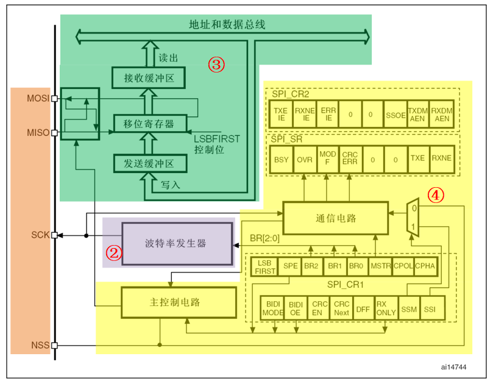
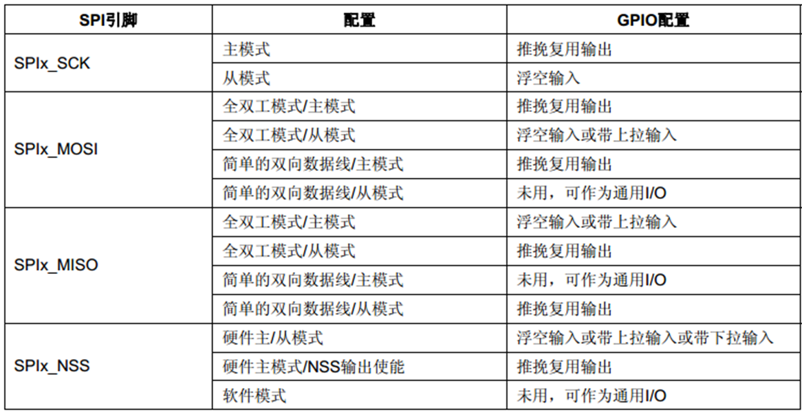
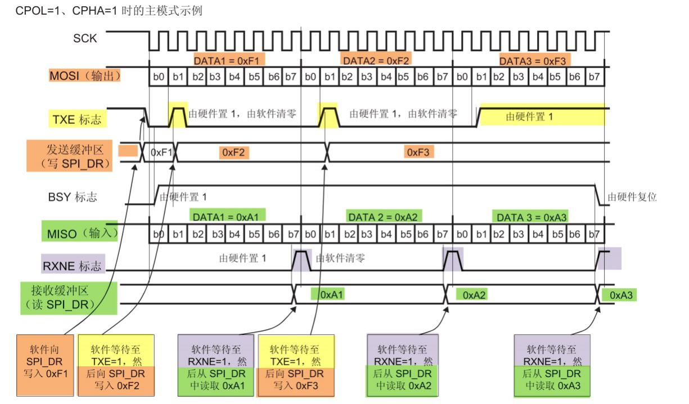
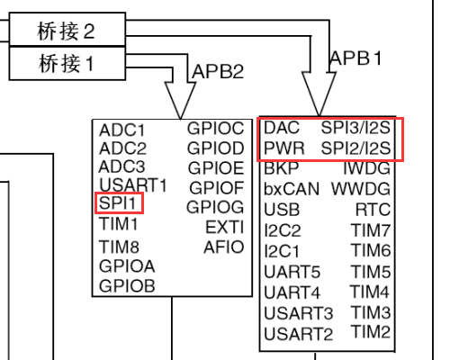
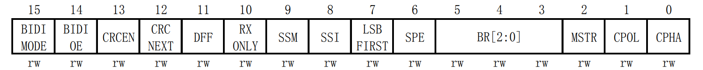
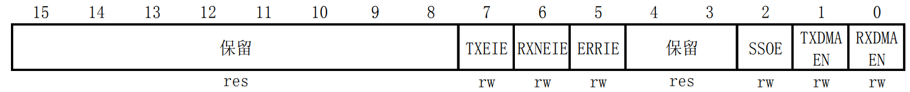
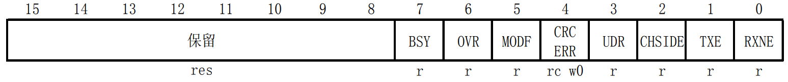
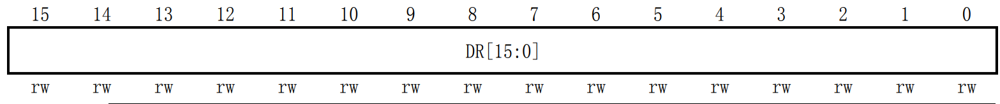
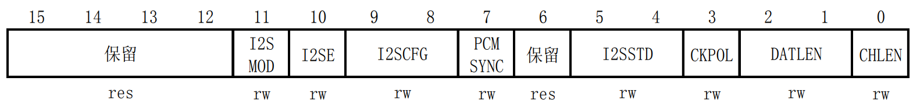
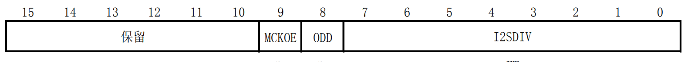

<!-- more -->

## 一、SPI简介

这一部分可以查看笔记《[60-通信专题/30-SPI/LV001-SPI简介.md](/sdoc/communication/spi/126b0950dceb1d850b1e36d8)》。

## 二、STM32的SPI外设

### 1. 简介

STM32 的 SPI 外设可用作通讯的主机及从机，支持最高的 SCK 时钟频率为 fpclk/2 (STM32F103 型号的芯片默认 f:sub:pclk1 为 36MHz， fpclk2 为72MHz)，完全支持 SPI 协议的 4 种模式，数据帧长度可设置为 8 位或 16 位，**可设置数据 MSB 先行或 LSB 先行**。它还支持双线全双工、双线单向以及单线模式。其中双线单向模式可以同时使用 MOSI 及 MISO 数据线向一个方向传输数据，可以加快一倍的传输速度。而单线模式则可以减少硬件接线，当然这样速率会受到影响。我们这里只学习双线全双工模式。  

### 2. 框图

关于STM32的SPI外设的框图，我们可以看 [STM32中文参考手册](https://www.stmcu.com.cn/Designresource/detail/localization_document%20/710001)的23.3 SPI功能描述一节：



#### 2.1 ①通讯引脚  

SPI 的所有硬件架构都从图 24‑5 中左侧 MOSI、 MISO、 SCK 及 NSS 线展开的。 STM32 芯片有多个 SPI 外设，它们的 SPI 通讯信号引出到不同的 GPIO 引脚上，使用时必须配置到这些指定的引脚，见下表。关于 GPIO 引脚的复用功能，还是要查看STM32参考手册。  

| 引脚 | SPI1 | SPI2 | SPI3               |
| ---- | ---- | ---- | ------------------ |
| NSS  | PA4  | PB12 | PA15 下载口的 TDI  |
| CLK  | PA5  | PB13 | PB3 下载口的 TDO   |
| MISO | PA6  | PB14 | PB4 下载口的 NTRST |
| MOSI | PA7  | PB15 | PB5                |

其中 SPI1 是 APB2 上的设备，最高通信速率达 36Mbtis/s， SPI2、 SPI3 是 APB1 上的设备，最高通信速率为 18Mbits/s。除了通讯速率，在其它功能上没有差异。其中 SPI3 用到了下载接口的引脚，这几个引脚默认功能是下载，第二功能才是 IO 口，如果想使用 SPI3 接口，则程序上必须先禁用掉这几个 IO 口的下载功能。一般在资源不是十分紧张的情况下，这几个 IO 口是专门用于下载和调试程序，不会复用为 SPI3。  当用到SPI3的时候，需要注意我们下载的时候要按着reset复位按键，然后再下载，当芯片处于复位状态时，才能正常下载。

实际应用中，我们一般不使用 STM32 SPI 外设的标准 NSS 信号线，而是更简单地使用普通的GPIO，软件控制它的电平输出，从而产生通讯起始和停止信号。NSS引脚通过配置寄存器，配置成通过软件来控制的形式，这样只要在需要启动SPI的时候将NSS拉低就可以了，不一定非要接在PA4。

对于GPIO的复用模式，我们可以看[STM32中文参考手册](https://www.stmcu.com.cn/Designresource/detail/localization_document%20/710001)8.11小节：



#### 2.2 ②时钟控制逻辑  

SCK 线的时钟信号，由波特率发生器根据“控制寄存器 CR1”中的 BR[0:2] 位控制，该位是对 fpclk时钟的分频因子，对 fpclk 的分频结果就是 SCK 引脚的输出时钟频率，计算方法见下表。

| BR[0:2] | 分频结果 (SCK 频率) | BR[0:2] | 分频结果 (SCK 频率) |
| :-----: | :-----------------: | :-----: | :-----------------: |
|   000   |       fpclk/2       |   100   |      fpclk/32       |
|   001   |       fpclk/4       |   101   |      fpclk/64       |
|   010   |       fpclk/8       |   110   |      fpclk/128      |
|   011   |      fpclk/16       |   111   |      fpclk/256      |

其中的 fpclk 频率是指 SPI 所在的 APB 总线频率， APB1 为 fpclk1， APB2 为 fpckl2。通过配置“控制寄存器 CR”的“CPOL 位”及“CPHA”位可以把 SPI 设置成 4 种 SPI模式中的一种。  

#### 2.3 ③数据控制逻辑  

SPI 的 MOSI 及 MISO 都连接到数据移位寄存器上，数据移位寄存器的数据来源及目标接收、发送缓冲区以及 MISO、 MOSI 线。当向外发送数据的时候，数据移位寄存器以“发送缓冲区”为数据源，把数据一位一位地通过数据线发送出去；当从外部接收数据的时候，数据移位寄存器把数据线采样到的数据一位一位地存储到“接收缓冲区”中。通过写 SPI 的“数据寄存器 DR”把数据填充到发送缓冲区中，通讯读“数据寄存器 DR”，可以获取接收缓冲区中的内容。其中数据帧长度可以通过“控制寄存器 CR1”的“DFF 位”配置成 8 位及 16 位模式；配置“LSBFIRST 位”可选择 MSB 先行还是 LSB 先行。  

#### 2.4 ④整体控制逻辑  

整体控制逻辑负责协调整个 SPI 外设，控制逻辑的工作模式根据我们配置的“控制寄存器(CR1/CR2)”的参数而改变，基本的控制参数包括前面提到的 SPI 模式、波特率、 LSB 先行、主从模式、单双向模式等等。在外设工作时，控制逻辑会根据外设的工作状态修改“状态寄存器(SR)”，我们只要读取状态寄存器相关的寄存器位，就可以了解 SPI 的工作状态了。除此之外，控制逻辑还根据要求，负责控制产生 SPI 中断信号、 DMA 请求及控制 NSS 信号线。  

### 3. 通讯过程

STM32 使用 SPI 外设通讯时，在通讯的不同阶段它会对“状态寄存器 SR”的不同数据位写入参数，我们通过读取这些寄存器标志来了解通讯状态。 我们可以查看 [STM32中文参考手册](https://www.stmcu.com.cn/Designresource/detail/localization_document%20/710001)的 23.3.5 数据发送与接收过程部分。



主模式收发流程及事件说明如下：

（1）控制 NSS 信号线，产生起始信号 (图中没有画出)；

（2）把要发送的数据写入到“数据寄存器 DR”中，该数据会被存储到发送缓冲区；

（3）通讯开始， SCK 时钟开始运行。 MOSI 把发送缓冲区中的数据一位一位地传输出去； MISO则把数据一位一位地存储进接收缓冲区中；

（4）当发送完一帧数据的时候，“状态寄存器 SR”中的“TXE 标志位”会被置 1，表示传输完一帧，发送缓冲区已空；类似地，当接收完一帧数据的时候，“RXNE 标志位”会被置 1，表示传输完一帧，接收缓冲区非空；

（5）等待到“TXE 标志位”为 1 时，若还要继续发送数据，则再次往“数据寄存器 DR”写入数据即可；等待到“RXNE 标志位”为 1 时，通过读取“数据寄存器 DR”可以获取接收缓冲区中的内容。

假如我们使能了 TXE 或 RXNE 中断， TXE 或 RXNE 置 1 时会产生 SPI 中断信号，进入同一个中断服务函数，到 SPI 中断服务程序后，可通过检查寄存器位来了解是哪一个事件，再分别进行处理。也可以使用 DMA 方式来收发“数据寄存器 DR”中的数据。

**【注意】**：发送和接收是同时进行的，当我们只想接收数据的时候也还是需要向发送缓冲区写数据，这样才能触发SPI产生时钟驱动数据的传输，当然我们写入的数据可以是任意的，只要有数据写进去就可以。  

### 4. SPI在那个总线？

这个我们可以看一下系统框图：



会发现，这里SPI1挂载在APB1总线，最高时钟就是36MHz，剩下两个挂载在APB2总线，最高时钟源为72MHz，根据这些信息来控制SPI的时钟。

## 三、相关寄存器

这一部分我们可以查看 [STM32中文参考手册](https://www.stmcu.com.cn/Designresource/detail/localization_document%20/710001)的23.5 SPI和I2S寄存器描述。我们可以用半字(16位)或字(32位)的方式操作这些外设寄存器。

### 1. 控制寄存器 1(SPI_CR1)



### 2. 控制寄存器 2(SPI_CR2) 



### 3. 状态寄存器(SPI_SR)



### 4. 数据寄存器(SPI_DR) 



### 5. 配置寄存器(SPI_I2S_CFGR)



### 6. 预分频寄存器(SPI_I2SPR)



## 四、HAL库函数

### 1. SPI_InitTypeDef  

```c
typedef struct {
uint32_t Mode;       /* 设置 SPI 的主/从机端模式 */
uint32_t Direction;  /* 设置 SPI 的单双向模式 */
uint32_t DataSize;   /* 设置 SPI 的数据帧长度，可选 8/16 位 */
uint32_t CLKPolarity;/* 设置时钟极性 CPOL，可选高/低电平 */
uint32_t CLKPhase;   /* 设置时钟相位，可选奇/偶数边沿采样 */
uint32_t NSS;        /* 设置 NSS 引脚由 SPI 硬件控制还是软件控制 */
uint32_t BaudRatePrescaler; /* 设置时钟分频因子， fpclk/分频数 =fSCK */
uint32_t FirstBit;          /* 设置 MSB/LSB 先行 */
uint32_t TIMode;            /* 指定是否启用 TI 模式 */
uint32_t CRCCalculation;    /* 指定是否启用 CRC 计算 */
uint32_t CRCPolynomial;     /* 设置 CRC 校验的表达式 */
} SPI_InitTypeDef;
```

（1）Mode： 本成员设置 SPI 工作在主机模式 (SPI_MODE_MASTER) 或从机模式 (SPI_MODE_SLAVE )，这两个模式的最大区别为 SPI 的 SCK 信号线的时序，SCK 的时序是由通讯中的主机产生的。若被配置为从机模式， STM32 的 SPI 外设将接受外来的 SCK 信号。

（2）Direction：本成员设置 SPI 的通讯方向，可设置为双线全双工 (SPI_DIRECTION_2LINES)，双线只接收 (SPI_DIRECTION_2LINES_RXONLY)，单线SPI_DIRECTION_1LINE。

（3）DataSize： 本成员可以选择 SPI 通讯的数据帧大小是为 8 位 (SPI_DATASIZE_8BIT) 还是 16位 (SPI_DATASIZE_16BIT)。

（4）CLKPolarity 和 CLKPhase：这两个成员配置 SPI 的时钟极性 CLKPolarity 和时钟相位CLKPhase ，这两个配置影响到 SPI 的通讯模式，关于 CLKPolarity 和 CLKPhase 可以看前边的笔记。时钟极性 CLKPolarity 成员，可设置为高电平 (SPI_POLARITY_HIGH)或低电平 (SPI_POLARITY_LOW)。时钟相位 CPHA 则可设置为 SPI_PHASE_1EDGE(在SCK 的奇数边沿采集数据) 或 SPI_P HASE_2EDGE(在 SCK 的偶数边沿采集数据) 。

（5）NSS： 本成员配置 NSS 引脚的使用模式，可以选择为硬件模式 (SPI_NSS_HARD ) 与软件模式 ( SPI_NSS_SOFT )，在硬件模式中的 SPI 片选信号由 SPI 硬件自动产生，而软件模式则需要我们亲自把相应的 GPIO 端口拉高或置低产生非片选和片选信号。实际中软件模式应用比较多。

（6）BaudRatePrescaler： 本成员设置波特率分频因子，分频后的时钟即为 SPI 的 SCK 信号线的时钟频率。这个成员参数可设置为 fpclk 的 2、 4、 6、 8、 16、 32、 64、 128、 256 分频。

（7）FirstBit： 所有串行的通讯协议都会有 MSB 先行 (高位数据在前) 还是 LSB 先行 (低位数据在前) 的问题，而 STM32 的 SPI 模块可以通过这个结构体成员，对这个特性编程控制。

（8）TIMode ：指定是否启用 TI 模式。可选择为使能 ( SPI_TIMO DE_ENABLE ) 与不是能( SPI_TIMODE_DISABLE )。

（9）CRCCalculation ：指定是否启用 CRC 计算。

（10）SPI_CRCPolynomial： 这是 SPI 的 CRC 校验中的多项式，若我们使用 CRC 校验时，就使用这个成员的参数 (多项式)，来计算 CRC 的值。    

### 2. 数据传输

```c
HAL_StatusTypeDef HAL_SPI_Transmit(SPI_HandleTypeDef *hspi, uint8_t *pData, uint16_t Size, uint32_t Timeout);
HAL_StatusTypeDef HAL_SPI_Receive(SPI_HandleTypeDef *hspi, uint8_t *pData, uint16_t Size, uint32_t Timeout);
HAL_StatusTypeDef HAL_SPI_TransmitReceive(SPI_HandleTypeDef *hspi, uint8_t *pTxData, uint8_t *pRxData, uint16_t Size, uint32_t Timeout);
```
