<!-- more -->

## 一、简介

EEPROM和Flash的本质上是一样的， 都用于保存数据，Flash包括MCU内部的Flash和外部扩展的Flash，我使用的开发板的W25Q128就是一个SPI接口的外部NOR Flash。从功能上， Flash通常存放运行代码，运行过程中不会修改，而EEPROM存放用户数据，可能会反复修改。 从结构上， Flash按扇区操作， EEPROM通常按字节操作。  

W25Q128是[华邦](https://www.winbond.com/hq/?__locale=zh)的一款SPI接口 NOR FLASH 芯片，我看我使用的开发板上使用的型号是W25Q128JV，我们可以在这里找到它的芯片手册：[W25Q128JV-datasheet](https://www.winbond.com/hq/product/code-storage-flash-memory/serial-nor-flash/?__locale=zh&partNo=W25Q128JV)。

我们看芯片手册的开头，有这么几句：

> SPI clock frequencies of W25Q128JV of up to 133MHz are supported allowing equivalent clock rates of 266MHz (133MHz x 2) for Dual I/O and  532MHz (133MHz x 4) for Quad I/O when using the Fast Read Dual/Quad I/O. These transfer rates can  outperform standard Asynchronous 8 and 16-bit Parallel Flash memories

也就是说，这个SPI FLASH通信时支持的最高速率可以达到133MHZ，这就意味着，我们使用STM32F103ZET6来控制这个芯片时，SPI的时钟直接配置到最高36M也是没有任何问题的。

## 二、结构组成  

### 1. 基本结构

Flash类型众多，其中比较常见是W25Qxx系列， 从命名上看， W25Qxx中xx的单位是M Bit，如W25Q16，其存储容量为16M Bit。本开发板上的Flash型号为W25Q128， 其存储容量为128M Bit。W25Q12将16MB的容量分为256个块（Block），每个块大小为64K字节，每个块又分为16个扇区（Sector），每个扇区4K个字节。每个扇区又可以分为16页，每一页256字节。这样划分主要是因为FLASH的存储特性。

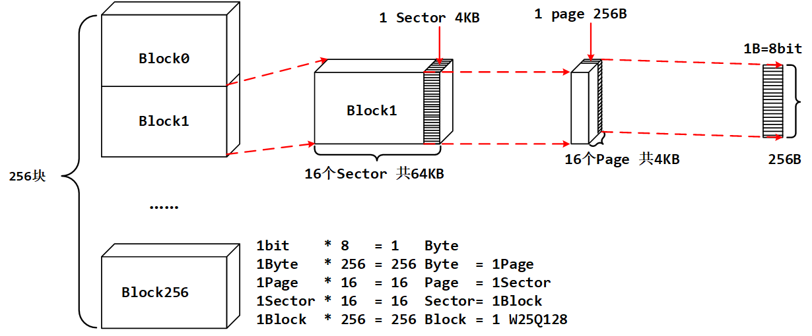

W25Qxx的最小擦除单位为一个扇区，也就是每次必须擦除4K个字节。这样我们需要给W25Qxx开辟一个至少4K的缓存区，这样对SRAM要求比较高，要求芯片必须有4K以上SRAM才能很好的操作。

### 2. 地址位数？

这个芯片分了这么多的块，扇区，页，我们想要将数据写入到某个地址中的话，应该给多少位地址？这个嘛，我们其实可以来看一下框图：

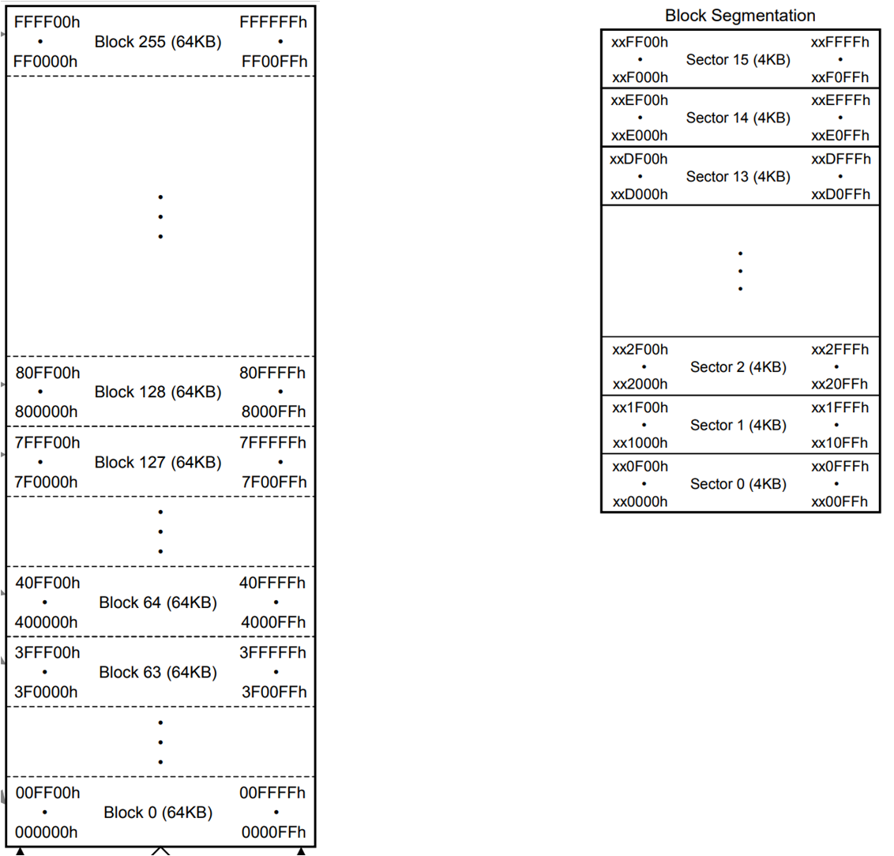

左边是每个块内的地址，右边是每个块内部的每个扇区的地址范围，我们发现地址都是24位的，为什么是24位？我们一共是128Mbit，一共就是16M的内存空间，24位地址最多能表示多少空间？

```c
2^24 = 2^14 * 2^10 = 2^10 * 2^10 * 2^4 = 2^4MB = 16MB
```

刚好够表示16M的地址空间，所以后边我们发送地址的时候只需要24位就可以啦。

## 三、存储特性

Flash有个物理特性：**只能写0，不能写1**。如果把Flash的每个Bit，都看作一张纸， bit=1表示纸没有内容，bit=0表示纸写入了内容。 当纸为白纸时（bit=1），这时往纸上写东西是可以的，写完后纸的状态变为bit=0。当纸有内容时（ bit=0 ），这时往纸上写东西只能让数据越乱，也就无法正常写数据。此时需要橡皮檫，进行擦除操作，将有内容的纸（ bit=0 ）变为白纸（ bit=1 ），使得以后可以重新写入数据。  所以总的来说，FLASH存储特性有以下几点：

（1）在写入数据前必须擦除；

（2）擦除时会把所有的数据位置1；

（3）写入数据时只能把数据从1改成0；

（4）擦除时必须按照最小单位来擦除，对于FLASH我们没法一个字节一个字节擦除，最小单位擦除单位是一个扇区，对于此芯片来说就是4KB。一般来讲FLASH擦除的最小单位都是扇区。写入的时候没有限制，可以一个字节一个字节的写入。

【说明】

- NOR FLASH 可以按字节写入数据。

- NAND FLASH必须按照扇区或者块进行读写数据，SD卡、SSD硬盘等。

## 四、引脚说明

我们可以看芯片手册的[W25Q128JV-datasheet](https://www.winbond.com/hq/product/code-storage-flash-memory/serial-nor-flash/?__locale=zh&partNo=W25Q128JV)的 3.3 Pin Description SOIC 208-mil, WSON 6x5-mm / 8x6-mm 和 4. PIN DESCRIPTIONS两节的内容

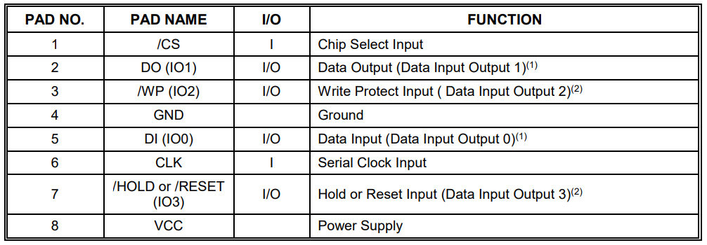

【注意】带有斜杠的引脚名表示低电平有效。

## 五、状态和控制寄存器

状态和控制寄存器的相关描述我们可以看 [W25Q128JV-datasheet](https://www.winbond.com/hq/product/code-storage-flash-memory/serial-nor-flash/?__locale=zh&partNo=W25Q128JV)的7.1 Status Registers，需要注意的是不仅仅是下边这一小部分，还挺长的，这里只是说明一下去哪找资料。

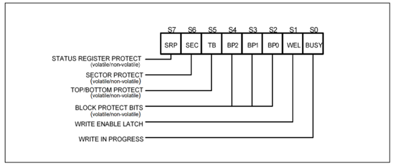

当我们擦除扇区或者写入数据的时候我们怎么知道已经完成相关操作了呢？W25Q128为我们提供了一个状态寄存器来表示各个状态，我们可以通过读取相关标志来判断内部操作是否已经完成了。

## 六、支持的命令

W25Q128的寄存器是在芯片内部，那我们的STM32怎么读取呢？我们可以通过SPI总线，向W25Q128芯片发送一些特定的命令来读取对应的寄存器的数据。命令在哪里？我们可以参考  [W25Q128JV-datasheet](https://www.winbond.com/hq/product/code-storage-flash-memory/serial-nor-flash/?__locale=zh&partNo=W25Q128JV) 的 8.1 Device ID and Instruction Set Tables一节：

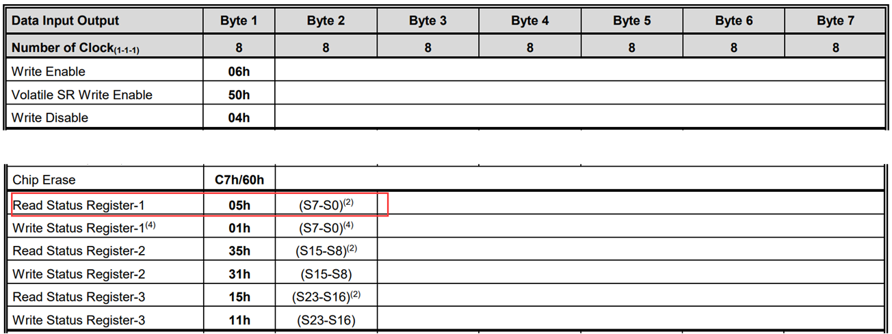

比如说这里就有读取状态寄存器的命令。注意这张表里边，Byte1表示命令的编码，Byte2~Byte7中，带有 （） 的，表示芯片返回的数据，不带（）的，表示STM32写命令的时候向W25Q128传输的数据。这些在表格的最下方都有说明。比如说上边的读取状态寄存器的命令，Byte1的05h表示要读取状态寄存器，一般都是由STM32发送给W25Q128，然后W25Q128收到命令代码之后就知道是STM32主机想要读取状态寄存器的值，于是便将状态寄存器数据放在Byte2通过SPI协议返回给STM32。

## 七、读写数据

### 1. 读取状态寄存器

参考 [W25Q128JV-datasheet](https://www.winbond.com/hq/product/code-storage-flash-memory/serial-nor-flash/?__locale=zh&partNo=W25Q128JV) 的 8.2.4 Read Status Register-1 (05h), Status Register-2 (35h) & Status Register-3 (15h)：

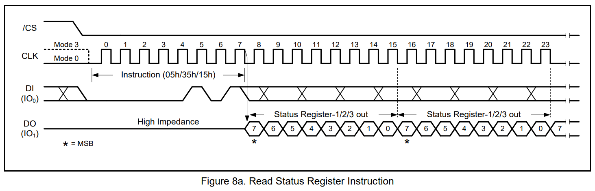

### 2. 擦除扇区

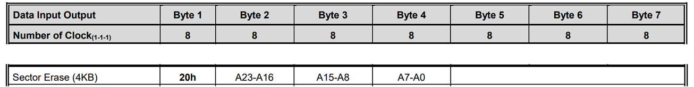

其中Byte2~Byte4一共24位（3个字节），表示要擦除的地址。时序可以参考 [W25Q128JV-datasheet](https://www.winbond.com/hq/product/code-storage-flash-memory/serial-nor-flash/?__locale=zh&partNo=W25Q128JV) 的8.2.15 Sector Erase (20h) ，这条命令将会每次擦除一个扇区的数据，也就是4KB数据。

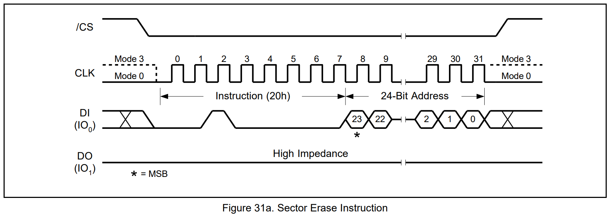

### 3. 写入数据

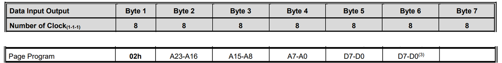

其中Byte2~Byte4一共24位（3个字节），表示要写入的地址。Byte5~Byte6表示要写入的数据。时序可以参考 [W25Q128JV-datasheet](https://www.winbond.com/hq/product/code-storage-flash-memory/serial-nor-flash/?__locale=zh&partNo=W25Q128JV) 的 8.2.13 Page Program (02h) ：

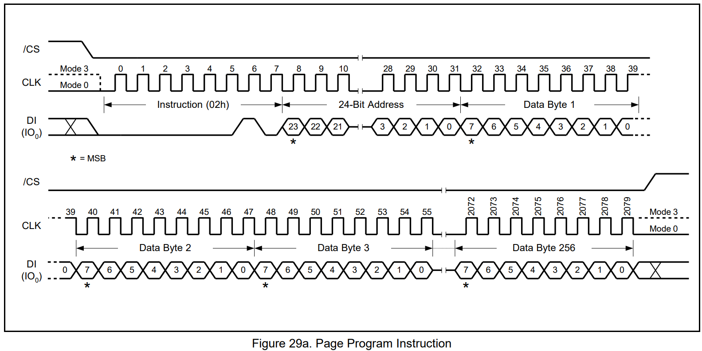

### 4. 读取数据

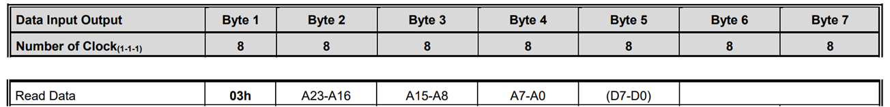

其中Byte2~Byte4一共24位（3个字节），表示要读取的地址。Byte5表示W25Q128返回的的数据。时序可以参考 [W25Q128JV-datasheet](https://www.winbond.com/hq/product/code-storage-flash-memory/serial-nor-flash/?__locale=zh&partNo=W25Q128JV) 的8.2.6 Read Data (03h)：

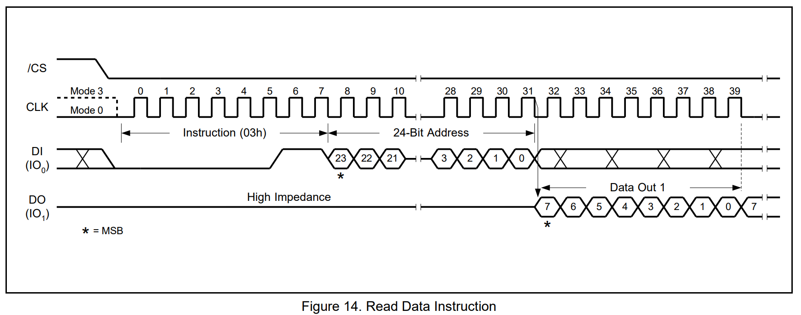
