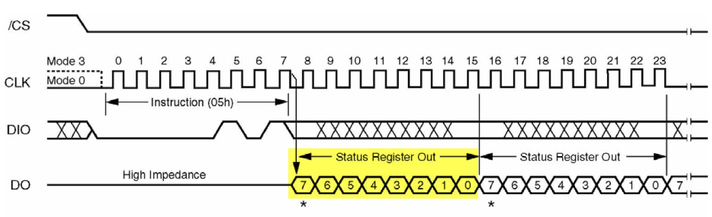

<!-- more -->

## 一、一般步骤

通过SPI读写外部FLASH的一般步骤如下：

（1）初始化通讯使用的目标引脚及端口时钟；

（2）使能 SPI 外设的时钟；

（3）配置 SPI 外设的模式、地址、速率等参数并使能 SPI 外设；

（4）编写基本 SPI 按字节收发的函数；

（5）编写对 FLASH 擦除及读写操作的的函数；

（6）编写测试程序，对读写数据进行校验。  

## 二、硬件原理图


这里我们选择了PB12作为NSS引脚，它刚好就是SPI2外设的SPI2_NSS。

## 三、物理SPI读写FLASH

### 1. STM32CubeMX配置

#### 1.1 打开SPI2


#### 1.2 NSS引脚


我们前边已经说过了，这个NSS引脚可以是随便一个IO，由于这里刚好接在了SPI2的PB12引脚上，所以这里我们可以选择使用外设硬件控制NSS信号，还是使用软件控制，官方建议是自己使用软件控制，自己控制的话只需要将引脚配置成推挽输出，然后自己决定高低电平即可，所以我们这里还是使用软件控制，注意记得将引脚初始化。

我们进入GPIO配置界面，将PB12进行初始化：


注意当开始传输数据时，引脚输出低电平，所以平时就输出高电平就可以了，需要使用的时候拉低即可。

#### 2.1.3 SPI配置


基本保持默认就可以了，关注一下SCK的频率，注意不要超过SPI FLASH的最大频率。

### 2. 宏定义

我们需要定义几个宏,，方便使用：

```c
#define W25Q128	0XEF17                   // 器件ID
#define	W25QXX_CS 		PBout(12)  		 // W25QXX的片选信号

//指令表
#define W25X_WriteEnable		0x06 
#define W25X_WriteDisable		0x04 
#define W25X_ReadStatusReg1		0x05 
#define W25X_ReadStatusReg2		0x35 
#define W25X_ReadStatusReg3		0x15 
#define W25X_WriteStatusReg1    0x01 
#define W25X_WriteStatusReg2    0x31 
#define W25X_WriteStatusReg3    0x11 
#define W25X_ReadData			0x03 
#define W25X_FastReadData		0x0B 
#define W25X_FastReadDual		0x3B 
#define W25X_PageProgram		0x02 
#define W25X_BlockErase			0xD8 
#define W25X_SectorErase		0x20 
#define W25X_ChipErase			0xC7 
#define W25X_PowerDown			0xB9 
#define W25X_ReleasePowerDown	0xAB 
#define W25X_DeviceID			0xAB 
#define W25X_ManufactDeviceID	0x90 
#define W25X_JedecDeviceID		0x9F 
#define W25X_Enable4ByteAddr    0xB7
#define W25X_Exit4ByteAddr      0xE9
```

### 3. SPI读写一个字节数据

```c
u8 SPI2_ReadWriteByte(u8 TxData)
{
    u8 Rxdata;
    HAL_SPI_TransmitReceive(&SPI2_Handler, &TxData, &Rxdata, 1, 1000);       
 	return Rxdata;          		    //返回收到的数据		
}
```

SPI通信的时候可以一边读一边写，所以这里我们可以直接使用 HAL_SPI_TransmitReceive 函数将 TxData 数据写入SPI FLASH，同时获取到返回的数据并存放于 Rxdata 中。

### 4. 写使能与禁止

在向 FLASH 芯片存储矩阵写入数据前，首先要使能写操作，通过“Write Enable”命令即可写使能  

#### 4.1 写使能

```c
//W25QXX写使能	
//将WEL置位   
void W25QXX_Write_Enable(void)   
{
	W25QXX_CS=0;                            //使能器件   
    SPI2_ReadWriteByte(W25X_WriteEnable);   //发送写使能  
	W25QXX_CS=1;                            //取消片选     	      
} 

```

#### 4.2 写禁止

```c
//W25QXX写禁止	
//将WEL清零  
void W25QXX_Write_Disable(void)   
{  
	W25QXX_CS=0;                            //使能器件   
    SPI2_ReadWriteByte(W25X_WriteDisable);  //发送写禁止指令    
	W25QXX_CS=1;                            //取消片选     	      
} 
```

### 5. 读写状态寄存器

#### 5.1 状态寄存器

与EEPROM 一样，由于 FLASH 芯片向内部存储矩阵写入数据需要消耗一定的时间，并不是在总线通讯结束的一瞬间完成的，所以在写操作后需要确认 FLASH 芯片“空闲”时才能进行再次写入。为了表示自己的工作状态， FLASH 芯片定义了几个状态寄存器  ：

（1）状态寄存器1

```c
BIT7  6    5   4   3   2   1   0
SPR   RV  TB  BP2 BP1 BP0 WEL BUSY
```

SPR：默认0，状态寄存器保护位，配合WP使用；

TB、BP2、BP1、BP0：FLASH区域写保护设置；

WEL：写使能锁定

BUSY：忙标记位(1，忙；0，空闲)

【注意】默认：0x00

（2）状态寄存器2

```c
BIT7   6   5   4   3   2   1    0
SUS   CMP LB3 LB2 LB1 (R)  QE  SRP1
```

（3）状态寄存器3：

```c
BIT7      6     5    4   3   2   1   0
HOLD/RST  DRV1 DRV0 (R) (R) WPS ADP ADS
```

读取状态寄存器的时序如下：



#### 5.2 读状态寄存器

```c
//读取W25QXX的状态寄存器，W25QXX一共有3个状态寄存器
//regno:状态寄存器号，范:1~3
//返回值:状态寄存器值
uint8_t W25QXX_ReadSR(uint8_t regno)
{
    uint8_t byte = 0, command = 0;
    switch(regno)
    {
    case 1:
        command = W25X_ReadStatusReg1;  //读状态寄存器1指令
        break;
    case 2:
        command = W25X_ReadStatusReg2;  //读状态寄存器2指令
        break;
    case 3:
        command = W25X_ReadStatusReg3;  //读状态寄存器3指令
        break;
    default:
        command = W25X_ReadStatusReg1;
        break;
    }
    W25QXX_CS = 0;                          //使能器件
    SPI2_ReadWriteByte(command);            //发送读取状态寄存器命令
    byte = SPI2_ReadWriteByte(0Xff);        //读取一个字节
    W25QXX_CS = 1;                          //取消片选
    return byte;
} 
```

只要向 FLASH 芯片发送了读状态寄存器的指令， FLASH 芯片就会向主机返回最新的状态寄存器内容。  

#### 5.3 写状态寄存器

```c
//写W25QXX状态寄存器
void W25QXX_Write_SR(uint8_t regno, uint8_t sr)   
{   
    uint8_t command=0;
    switch(regno)
    {
        case 1:
            command=W25X_WriteStatusReg1;    //写状态寄存器1指令
            break;
        case 2:
            command=W25X_WriteStatusReg2;    //写状态寄存器2指令
            break;
        case 3:
            command=W25X_WriteStatusReg3;    //写状态寄存器3指令
            break;
        default:
            command=W25X_WriteStatusReg1;    
            break;
    }   
	W25QXX_CS=0;                            //使能器件   
	SPI2_ReadWriteByte(command);            //发送写取状态寄存器命令    
	SPI2_ReadWriteByte(sr);                 //写入一个字节  
	W25QXX_CS=1;                            //取消片选     	      
}
```

#### 5.4 等待空闲

```c
//等待空闲
void W25QXX_Wait_Busy(void)
{
    while((W25QXX_ReadSR(1) & 0x01) == 0x01); // 等待BUSY位清空
}
```

### 6. 读取FLASH芯片ID

```c
//读取芯片ID
//返回值如下:
//0XEF17,表示芯片型号为W25Q128
uint16_t W25QXX_ReadID(void)
{
    uint16_t Temp = 0;
    W25QXX_CS = 0;
    SPI2_ReadWriteByte(0x90);//发送读取ID命令
    SPI2_ReadWriteByte(0x00);
    SPI2_ReadWriteByte(0x00);
    SPI2_ReadWriteByte(0x00);
    Temp |= SPI2_ReadWriteByte(0xFF) << 8;
    Temp |= SPI2_ReadWriteByte(0xFF);
    W25QXX_CS = 1;
    return Temp;
}
```

注意，这一步可以用来判断我们的SPI FLASH是否是功能正常，也可以确定型号。

### 7. 扇区擦除  

由于 FLASH 存储器的特性决定了它只能把原来为“1”的数据位改写成“0”，而原来为“0”的数据位不能直接改写为“1”。所以这里涉及到数据“擦除”的概念，在写入前，必须要对目标存储矩阵进行擦除操作，把矩阵中的数据位擦除为“1”，在数据写入的时候，如果要存储数据“1”，那就不修改存储矩阵，在要存储数据“0”时，才更改该位。

通常，对存储矩阵擦除的基本操作单位都是多个字节进行，如这里使用的SPI FLASH 芯片W25Q128支持“扇区擦除”、“块擦除”以及“整片擦除”：

| 擦除单位              | 大小             |
| --------------------- | ---------------- |
| 扇区擦除 Sector Erase | 4KB              |
| 块擦除 Block Erase    | 64KB             |
| 整片擦除 Chip Erase   | 整个芯片完全擦除 |

FLASH 芯片的最小擦除单位为扇区 (Sector)，而一个块 (Block) 包含 16 个扇区。使用扇区擦除指令“Sector Erase”可控制 FLASH 芯片开始擦写  。扇区擦除指令的第一个字节为指令编码，紧接着发送的 3 个字节用于表示要擦除的存储矩阵地址。要注意的是在扇区擦除指令前，还需要先发送“写使能”指令，发送扇区擦除指令后，通过读取寄存器状态等待扇区擦除操作完毕 。

扇区擦除时序如下：


扇区擦除指令的第一个字节为指令编码，紧接着发送的 3 个字节用于表示要擦除的存储矩阵地址。要注意的是在扇区擦除指令前，还需要先发送“写使能”指令，发送扇区擦除指令后，通过读取寄存器状态等待扇区擦除操作完毕 。

```c
//擦除一个扇区
//Dst_Addr:扇区地址 根据实际容量设置
//擦除一个扇区的最少时间:150ms
void W25QXX_Erase_Sector(uint32_t Dst_Addr)
{
    //监视falsh擦除情况,测试用
    //printf("fe:%x\r\n",Dst_Addr);
    Dst_Addr *= 4096;
    W25QXX_Write_Enable();                  //SET WEL
    W25QXX_Wait_Busy();
    W25QXX_CS = 0;                          //使能器件
    SPI2_ReadWriteByte(W25X_SectorErase);   //发送扇区擦除指令
    if(W25QXX_TYPE == W25Q256)              //如果是W25Q256的话地址为4字节的，要发送最高8位
    {
        SPI2_ReadWriteByte((uint8_t)((Dst_Addr) >> 24));
    }
    SPI2_ReadWriteByte((uint8_t)((Dst_Addr) >> 16)); //发送24bit地址
    SPI2_ReadWriteByte((uint8_t)((Dst_Addr) >> 8));
    SPI2_ReadWriteByte((uint8_t)Dst_Addr);
    W25QXX_CS = 1;                          //取消片选
    W25QXX_Wait_Busy();   				    //等待擦除完成
}
```

调用扇区擦除指令时注意输入的地址要对齐到 4KB  

### 8. 写入数据

#### 8.1 按页写入

目标扇区被擦除完毕后，就可以向它写入数据了。与 EEPROM 类似， FLASH 芯片也有页写入命令，使用页写入命令最多可以一次向 FLASH 传输 256 个字节的数据，我们把这个单位为页大小。  页写入时序如下图：


从时序图可知，第 1 个字节为“页写入指令”编码， 2-4 字节为要写入的“地址 A”，接着的是要写入的内容，最多个可以发送 256 字节数据，这些数据将会从“地址 A”开始，按顺序写入到FLASH 的存储矩阵。若发送的数据超出 256 个，则会覆盖前面发送的数据。与擦除指令不一样，页写入指令的地址并不要求按 256 字节对齐，只要确认目标存储单元是擦除状态即可 (即被擦除后没有被写入过)。所以，若对“地址 x”执行页写入指令后，发送了 200 个字节数据后终止通讯，下一次再执行页写入指令，从“地址 (x+200)”开始写入 200 个字节也是没有问题的 (小于 256 均可)。只是在实际应用中由于基本擦除单元是 4KB，一般都以扇区为单位进行读写。  

```c
//SPI在一页(0~65535)内写入少于256个字节的数据
//在指定地址开始写入最大256字节的数据
//pBuffer:数据存储区
//WriteAddr:开始写入的地址(24bit)
//NumByteToWrite:要写入的字节数(最大256),该数不应该超过该页的剩余字节数!!!
void W25QXX_Write_Page(uint8_t* pBuffer, uint32_t WriteAddr, uint16_t NumByteToWrite)
{
    uint16_t i;
    W25QXX_Write_Enable();                  //SET WEL
    W25QXX_CS = 0;                          //使能器件
    SPI2_ReadWriteByte(W25X_PageProgram);   //发送写页命令
    if(W25QXX_TYPE == W25Q256)              //如果是W25Q256的话地址为4字节的，要发送最高8位
    {
        SPI2_ReadWriteByte((uint8_t)((WriteAddr) >> 24));
    }
    SPI2_ReadWriteByte((uint8_t)((WriteAddr) >> 16)); //发送24bit地址
    SPI2_ReadWriteByte((uint8_t)((WriteAddr) >> 8));
    SPI2_ReadWriteByte((uint8_t)WriteAddr);
    for(i = 0; i < NumByteToWrite; i++)SPI2_ReadWriteByte(pBuffer[i]); //循环写入
    W25QXX_CS = 1;                          //取消片选
    W25QXX_Wait_Busy();					   //等待写入结束
}
```

#### 8.2 无校验写入数据

必须确保所写的地址范围内的数据全部为0XFF，否则在非0XFF处写入的数据将失败!具有自动换页功能，在指定地址开始写入指定长度的数据,但是要确保地址不越界!

```c
//无检验写SPI FLASH
//pBuffer:数据存储区
//WriteAddr:开始写入的地址(24bit)
//NumByteToWrite:要写入的字节数(最大65535)
//CHECK OK
void W25QXX_Write_NoCheck(uint8_t* pBuffer, uint32_t WriteAddr, uint16_t NumByteToWrite)
{
    uint16_t pageremain;
    pageremain = 256 - WriteAddr % 256; //单页剩余的字节数
    if(NumByteToWrite <= pageremain)pageremain = NumByteToWrite; //不大于256个字节
    while(1)
    {
        W25QXX_Write_Page(pBuffer, WriteAddr, pageremain);
        if(NumByteToWrite == pageremain)break; //写入结束了
        else //NumByteToWrite>pageremain
        {
            pBuffer += pageremain;
            WriteAddr += pageremain;

            NumByteToWrite -= pageremain;			 //减去已经写入了的字节数
            if(NumByteToWrite > 256)pageremain = 256; //一次可以写入256个字节
            else pageremain = NumByteToWrite; 	 //不够256个字节了
        }
    };
}
```

#### 8.3 写入指定字节数据

该函数可以在 W25Q128 的任意地址开始写入任意长度（必须不超过 W25Q128 的容量）的数据。

（1）先获得首地址（WriteAddr）所在的扇区，并计算在扇区内的偏移。

（2）判断要写入的数据长度是否超过本扇区所剩下的长度，如果不超过，再先看看是否要擦除，如果不需要，则直接写入数据即可，如果要擦除则读出整个扇区，在对应的偏移处开始写入指定长度的数据，然后擦除这个扇区，再一次性写入。

（3）当所需要写入的数据长度超过一个扇区的长度的时候，我们先按照前面的步骤把扇区剩余部分写完，再在新扇区内执行同样的操作，如此循环，直到写入结束。 这里我们定义了一个 W25QXX_BUFFER 的全局变量，用于擦除时缓存扇区内的数据。  

```c
//写SPI FLASH
//在指定地址开始写入指定长度的数据,该函数带擦除操作!
//pBuffer:数据存储区
//WriteAddr:开始写入的地址(24bit)
//NumByteToWrite:要写入的字节数(最大65535)
uint8_t W25QXX_BUFFER[4096];
void W25QXX_Write(uint8_t* pBuffer, uint32_t WriteAddr, uint16_t NumByteToWrite)
{
    uint32_t secpos;
    uint16_t secoff;
    uint16_t secremain;
    uint16_t i;
    uint8_t * W25QXX_BUF;
    W25QXX_BUF = W25QXX_BUFFER;
    secpos = WriteAddr / W25QXX_SECTOR_SIZE; // 扇区地址
    secoff = WriteAddr % W25QXX_SECTOR_SIZE; // 在扇区内的偏移
    secremain = W25QXX_SECTOR_SIZE - secoff; // 扇区剩余空间大小
    //printf("ad:%X,nb:%X\r\n",WriteAddr,NumByteToWrite);//测试用
    if(NumByteToWrite <= secremain)
		secremain = NumByteToWrite; //不大于4096个字节
    while(1)
    {
        W25QXX_Read(W25QXX_BUF, secpos * W25QXX_SECTOR_SIZE, W25QXX_SECTOR_SIZE); //读出整个扇区的内容
        for(i = 0; i < secremain; i++) //校验数据
        {
            if(W25QXX_BUF[secoff + i] != 0XFF)break; //需要擦除
        }
        if(i < secremain) //需要擦除
        {
            W25QXX_Erase_Sector(secpos);//擦除这个扇区
            for(i = 0; i < secremain; i++)	 //复制
            {
                W25QXX_BUF[i + secoff] = pBuffer[i];
            }
            W25QXX_Write_NoCheck(W25QXX_BUF, secpos * W25QXX_SECTOR_SIZE, W25QXX_SECTOR_SIZE); //写入整个扇区

        } 
		else 
			W25QXX_Write_NoCheck(pBuffer, WriteAddr, secremain); //写已经擦除了的,直接写入扇区剩余区间.
        if(NumByteToWrite == secremain)
			break; //写入结束了
        else//写入未结束
        {
            secpos++;//扇区地址增1
            secoff = 0; //偏移位置为0

            pBuffer += secremain; //指针偏移
            WriteAddr += secremain; //写地址偏移
            NumByteToWrite -= secremain;				//字节数递减
            if(NumByteToWrite > W25QXX_SECTOR_SIZE)
				secremain = W25QXX_SECTOR_SIZE;	//下一个扇区还是写不完
            else 
				secremain = NumByteToWrite;			//下一个扇区可以写完了
        }
    }
}
```

###  9. 读取数据

相对于写入， FLASH 芯片的数据读取要简单得多，使用读取指令“Read Data”即可 ，对应的时序图如下：


```c
//读取SPI FLASH
//在指定地址开始读取指定长度的数据
//pBuffer:数据存储区
//ReadAddr:开始读取的地址(24bit)
//NumByteToRead:要读取的字节数(最大65535)
void W25QXX_Read(uint8_t* pBuffer, uint32_t ReadAddr, uint16_t NumByteToRead)
{
    uint16_t i;
    W25QXX_CS = 0;                          //使能器件
    SPI2_ReadWriteByte(W25X_ReadData);      //发送读取命令
    if(W25QXX_TYPE == W25Q256)              //如果是W25Q256的话地址为4字节的，要发送最高8位
    {
        SPI2_ReadWriteByte((uint8_t)((ReadAddr) >> 24));
    }
    SPI2_ReadWriteByte((uint8_t)((ReadAddr) >> 16)); //发送24bit地址
    SPI2_ReadWriteByte((uint8_t)((ReadAddr) >> 8));
    SPI2_ReadWriteByte((uint8_t)ReadAddr);
    for(i = 0; i < NumByteToRead; i++)
    {
        pBuffer[i] = SPI2_ReadWriteByte(0XFF);  //循环读数
    }
    W25QXX_CS = 1;
}
```

发送了指令编码及要读的起始地址后， FLASH 芯片就会按地址递增的方式返回存储矩阵的内容，读取的数据量没有限制，只要没有停止通讯， FLASH 芯片就会一直返回数据。  由于读取的数据量没有限制，所以发送读命令后一直接收 NumByteToRead个数据到结束即可。  

### 10. 测试函数

```c
const uint8_t TEXT_Buffer[]={"WarShipSTM32 SPI TEST"};
#define SIZE sizeof(TEXT_Buffer)
	
void W25QXX_Test(void)
{
	uint32_t FLASH_SIZE = 0;
    uint8_t datatemp[SIZE] = {0};  
	
	W25QXX_TYPE = W25QXX_ReadID();
    printf("SPI FLASH ID=%#x\r\n", W25QXX_TYPE);
    FLASH_SIZE= 16 * 1024 * 1024;
    printf("write to SPI FLASH data=%s\r\n", TEXT_Buffer);
    W25QXX_Write((uint8_t*)TEXT_Buffer, FLASH_SIZE - 100, SIZE);    // 从倒数第100个地址处开始,写入SIZE长度的数据
    W25QXX_Read(datatemp, FLASH_SIZE - 100, SIZE);					// 从倒数第100个地址处开始,读出SIZE个字节
    printf("read from SPI FLASH data=%s\r\n\r\n", datatemp);
}
```

## 四、模拟SPI读写FLASH

这个这里我就没有去测试了，模拟的过程可以看《[60-通信专题/30-SPI/LV001-SPI简介.md](/sdoc/communication/spi/126b0950dceb1d850b1e36d8)》这一节的笔记，在笔记中实现了SPI的通信协议，并且实现了读写字节的函数，再配合上边的读写函数就可以对SPI FLASH进行读写
