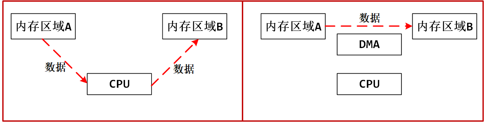
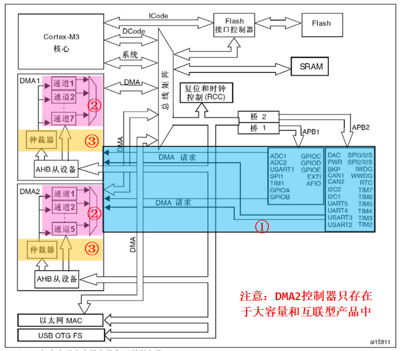
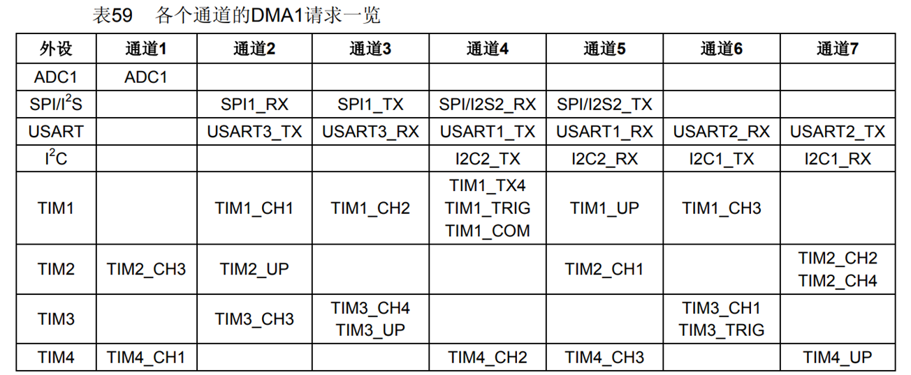
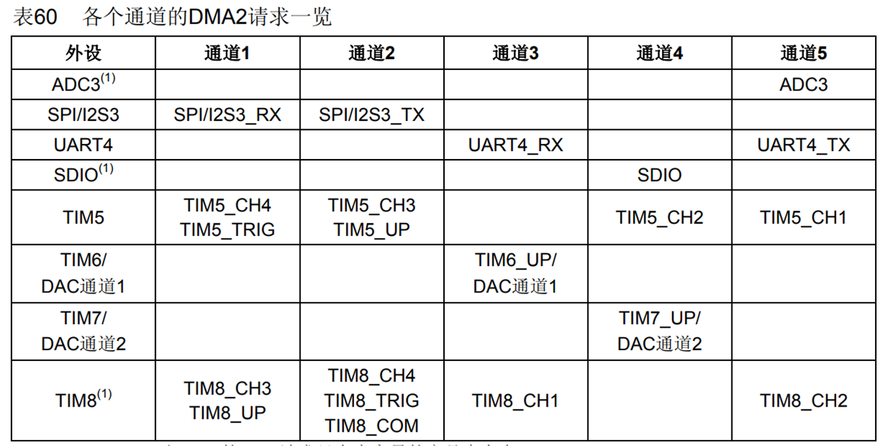
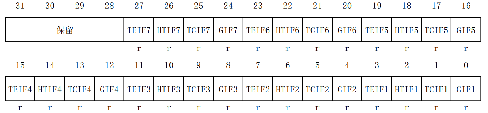
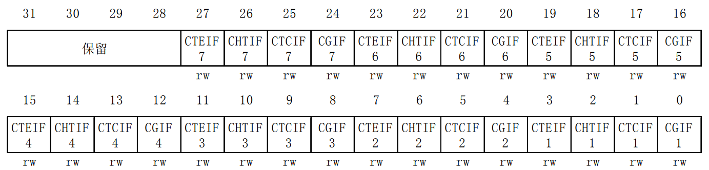
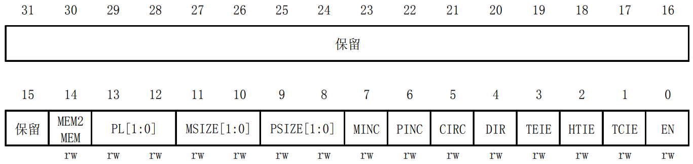
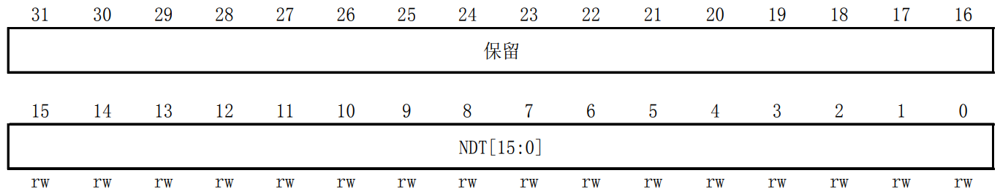
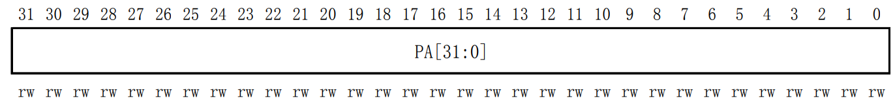
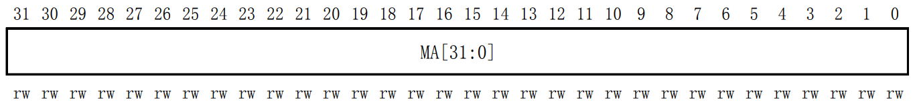

<!-- more -->


## 一、DMA简介

### 1. 简介

DMA，即 Direct Memory Access，直接存储器访问。是单片机的一个外设，它的主要功能是用来搬数据，但是不需要占用 CPU，即在传输数据的时候， CPU 可以干其他的事情，好像是多线程一样。数据传输支持从外设到存储器或者存储器到存储器，这里的存储器可以是 SRAM 或者是 FLASH。

我们知道CPU根据代码内容执行指令，这些众多指令中，有的用于计算、有的用于控制程序、有的用于转移数据等。 其中转移数据的指令，尤其是转移大量数据，会占用大量CPU资源。  例如把外设A的数据，传给外设B，这种情况其实不需要CPU一直参与，只需在A、 B之间创建个通道，让它们自己传输即可。  

再比如 DMA 传输将数据从一个地址空间复制到另外一个地址空间。 当 CPU 初始化这个传输动作，传输动作本身是由 DMA 控制器 来实行和完成。典型的例子就是移动一个外部内存的区块到芯片内部更快的内存区。像是这样的操作会很耗时，原本需要CPU将数据从一个地方取出来放到CPU内部的R0、R1......等寄存器中，再讲数据从这些寄存器中取出放到另一块内存区域中，这个过程是要CPU一直参与的，在没有DMA的情况下，CPU只能一直做这个事情，除非发生了中断，但是有了DMA之后，我们可以让DMA控制器去将数据从一个内存区域搬移到另一个区域，而CPU可以不参与数据传输的过程，这样在传输数据的时候CPU就可以去做其他的事情了。



DMA 传输对于高效能嵌入式系统算法和网络是很重要的。 DMA 传输方式无需 CPU 直接控制传输，也没有中断处理方式那样保留现场和恢复现场的过程，通过硬件为 RAM 与 I/O 设备开辟一条直接传送数据的通路， 能使 CPU 的效率大为提高。 

### 2. 功能框图

DMA 控制器独立于内核，属于一个单独的外设，结构比较简单，从编程的角度来看，我们只需掌握功能框图中的三部分内容即可，我们可以查看 [STM32中文参考手册](https://www.stmcu.com.cn/Designresource/detail/localization_document%20/710001)的10.2 DMA主要特性一节：



DMA 控制器包含了 DMA1 和 DMA2，其中 DMA1 有 7 个通道， DMA2 有 5 个通道，这里的通道可以理解为传输数据的一种管道。要注意的是 DMA2 只存在于大容量的单片机中。  

### 3. DMA请求

我们先来看序号①的部分。如果外设要想通过 DMA 来传输数据，必须先给 DMA 控制器发送 DMA 请求， DMA 收到请求信号之后，控制器会给外设一个应答信号，当外设应答后且 DMA 控制器收到应答信号之后，就会启动 DMA 的传输，直到传输完毕。  

DMA 有 DMA1 和 DMA2 两个控制器， DMA1 有 7 个通道， DMA2 有 5 个通道，不同的 DMA 控制器的通道对应着不同的外设请求，这决定了我们在软件编程上该怎么设置 ，具体见 DMA 请求映像表 （我们可以查看[STM32中文参考手册](https://www.stmcu.com.cn/Designresource/detail/localization_document%20/710001)的10.3.7 DMA请求映像一节）：

- DMA1



从外设(TIMx[x=1、2、3、4]、ADC1、SPI1、SPI/I2S2、I2Cx[x=1、2]和USARTx[x=1、2、3]) 产生的7个请求，通过逻辑或输入到DMA1控制器，这意味着**同时只能有一个请求有效**。

- DMA2



从外设(TIMx[5、6、7、8]、ADC3、SPI/I2S3、UART4、DAC通道1、2和SDIO)产生的5个请 求，经逻辑或输入到DMA2控制器，这意味着**同时只能有一个请求有效**。

### 4. DMA通道

我们再来看一下序号②的部分：DMA 具有 12 个独立可编程的通道，其中 DMA1 有 7 个通道， DMA2 有 5 个通道，每个通道对应不同的外设的 DMA 请求。虽然每个通道可以接收多个外设的请求，但是**同一时间只能接收一个，不能同时接收多个**。  需要注意的是**MemoryToMemory模式可以使用任意一个通道，存储器到存储器模式通道选择没有具体规定，只能使用一次传输模式不能循环传输  **。

### 5. 仲裁器

最后是序号③的部分：当发生多个 DMA 通道请求时，就意味着有先后响应处理的顺序问题，这个就由仲裁器来管理。

仲裁器管理 DMA 通道请求分为两个阶段：

（1）第一阶段属于软件阶段，可以在 DMA_CCRx 寄存器中设置，有 4 个等级：非常高、高、中和低四个优先级。

（2）第二阶段属于硬件阶段，如果两个或以上的 DMA 通道请求设置的优先级一样，则他们优先级取决于通道编号，编号越低优先权越高，比如通道 0 高于通道 1。在大容量产品和互联型产品中， DMA1 控制器拥有高于 DMA2 控制器的优先级。  

## 二、DMA数据配置

使用 DMA，最核心就是配置要传输的数据，包括数据从哪里来，要到哪里去，传输的数据的单位是什么，要传多少数据，是一次传输还是循环传输等等。  

### 1. 数据从哪来？往哪去？

DMA 传输数据的方向有三个：从外设到存储器，从存储器到外设，从存储器到存储器。具体的方向 DMA_CCR 位 4 DIR 配置： 0 表示从外设到存储器， 1 表示从存储器到外设。这里面涉及到的外设地址由 DMA_CPAR 配置，存储器地址由 DMA_CMAR 配置。  

#### 1.1 外设到存储器  

当我们使用从外设到存储器传输时，以 ADC 采集为例。 DMA 外设寄存器的地址对应的就是 ADC数据寄存器的地址， DMA 存储器的地址就是我们自定义的变量（用来接收存储 AD 采集的数据）的地址。方向我们设置外设为源地址。  

#### 1.2 存储器到外设  

当我们使用从存储器到外设传输时，以串口向电脑端发送数据为例。 DMA 外设寄存器的地址对应的就是串口数据寄存器的地址， DMA 存储器的地址就是我们自定义的变量（相当于一个缓冲区，用来存储通过串口发送到电脑的数据）的地址。方向我们设置外设为目标地址。  

#### 1.3 存储器到存储器  

当我们使用从存储器到存储器传输时，以内部 FLASH 向内部 SRAM 复制数据为例。 DMA 外设寄存器的地址对应的就是内部 FLASH（我们这里把内部 FALSH 当作一个外设来看）的地址， DMA存储器的地址就是我们自定义的变量（相当于一个缓冲区，用来存储来自内部 FLASH 的数据）的地址。方向我们设置外设（即内部 FLASH）为源地址。跟上面两个不一样的是，这里需要把DMA_CCR 位 14： MEM2MEM：存储器到存储器模式配置为 1，启动 M2M 模式。 

### 2. 传多少数据？单位？

当我们配置好数据要从哪里来到哪里去之后，我们还需要知道我们要传输的数据是多少，数据的单位是什么。

以串口向电脑发送数据为例，我们可以一次性给电脑发送很多数据，具体多少由 DMA_CNDTR 配置，这是一个 32 位的寄存器，**一次最多只能传输 65535 个数据**。

要想数据传输正确，源和目标地址存储的**数据宽度还必须一致**，串口数据寄存器是 8 位的，所以我们定义的要发送的数据也必须是 8 位。外设的数据宽度由 DMA_CCR 的 PSIZE[1:0] 配置，可以是 8/16/32 位，存储器的数据宽度由 DMA_CCR 的 MSIZE[1:0] 配置，可以是 8/16/32 位。

在 DMA 控制器的控制下，数据要想有条不紊的从一个地方搬到另外一个地方，还必须正确**设置两边数据指针的增量模式**。外设的地址指针由 DMA_CCRx 的 PINC 配置，存储器的地址指针由 MINC 配置。以串口向电脑发送数据为例，要发送的数据很多，每发送完一个，那么存储器的地址指针就应该加 1，而串口数据寄存器只有一个，那么外设的地址指针就固定不变。具体的数据指针的增量模式由实际情况决定。

### 3. 啥时候传完？

数据什么时候传输完成，我们可以通过**查询标志位**或者**通过中断的方式**来鉴别。 DMA在传输过程中会产生3个传输标志：半完成标志（ Half Transfer， HT） 、完成标志（ Transfer Complete， TC） 和错误标志（ Transfer Error， TE） 。 每个标志会产生对应的中断信号，如果使能了该类型的中断后，则会产生中断，我们可以通过这3个标志做对应程序处理。  有关各个标志位的详细描述可以参考 DMA 中断状态寄存器 DMA_ISR 的详细描述。

假如有N个数据待DMA传输，设置到原地址和目的地址后，当收到一个传输请求DMA就会从原地址取出一个数据传输到目的地址，如果地址是外设则地址保持不变，若地址是内存则传输完一个数据之后地址自增一个数据单位。在传输过程中如果发生意外错误则会产生一个错误中断信号，当传输完成一半则会产生半
传输完成中断，当全部数据都传输完成则会产生一个传输完成中断。  

传输完成还分两种模式，是一次传输还是循环传输，一次传输很好理解，即是传输一次之后就停止，要想再传输的话，必须关断 DMA 使能后再重新配置后才能继续传输。循环传输则是一次传输完成之后又恢复第一次传输时的配置循环传输，不断的重复。具体的由 DMA_CCR 寄存器的 CIRC 循环模式位控制。  

## 三、相关寄存器

这一部分我们可以查看[STM32中文参考手册](https://www.stmcu.com.cn/Designresource/detail/localization_document%20/710001)的10.4 DMA寄存器一节。

### 1. 中断状态寄存器(DMA_ISR)



该寄存器主要是传输过程中状态标志的配置，我们如果开启了 DMA_ISR 中这些中断，在达到条件后就会跳到中断服务函数里面去，即使没开启，我们也可以通过查询这些位来获得当前 DMA 传输的状态。这里我们常用的是 TCIFx，即通道 DMA 传输完成与否的标志。注意此寄存器为只读寄存器，所以在这些位被置位之后，只能通过其他的操作来清除。  

### 2. 中断标志清除寄存器(DMA_IFCR)



DMA_IFCR 的各位就是用来清除 DMA_ISR 的对应位的，通过写 0 清除。在 DMA_ISR 被置位后，我们必须通过向该位寄存器对应的位写入 0 来清除。  

### 3. A通道x配置寄存器(DMA_CCRx)



该寄存器控制着 DMA 的很多相关信息，包括数据宽度、外设及存储器的宽度、通道优先级、增量模式、传输方向、中断允许、使能等都是通过该寄存器来设置的。所以 DMA_CCRx 是 DMA 传输的核心控制寄存器。  

### 4. A通道x传输数量寄存器(DMA_CNDTRx)



这个寄存器控制 DMA 通道 x 的每次传输所要传输的数据量。其设置范围为 0~65535。并且该寄存器的值会随着传输的进行而减少，当该寄存器的值为 0 的时候就代表此次数据传输已经全部发送完成了。所以可以通过这个寄存器的值来知道当前 DMA 传输的进度。

  

### 5. 通道x外设地址寄存器(DMA_CPARx)



该寄存器用来存储 STM32 外设的地址，比如我们使用串口 1，那么该寄存器必须写入 0x40013804（其实就是&USART1_DR）。如果使用其他外设，就修改成相应外设的地址就行了。  

### 6. 通道x存储器地址寄存器(DMA_CMARx)



该寄存器和 DMA_CPARx 差不多，但是是用来放存储器的地址的。比如我们使用 SendBuf[5200]数组来做存储器，那么我们在DMA_CMARx 中写入&SendBuff 就可以了。  

## 四、HAL库函数分析

### 1. DMA_InitTypeDef 初始化结构体  

```c
typedef struct
{
  uint32_t Direction;            // 传输方向
  uint32_t PeriphInc;            // 外设递增
  uint32_t MemInc;               // 存储器递增
  uint32_t PeriphDataAlignment;  // 外设数据宽度
  uint32_t MemDataAlignment;     // 存储器数据宽度
  uint32_t Mode;                 // 模式选择
  uint32_t Priority;             // 优先级
} DMA_InitTypeDef;

```

（1）Direction：传输方向选择，可选外设到存储器、存储器到外设以及存储器到存储器。它设定DMA_SxCR 寄存器的 DIR[1:0] 位的值。 ADC 采集显然使用外设到存储器模式。

（2）PeripheralInc：如果配置为 DMA_PINC_ENABLE，使能外设地址自动递增功能，它设定DMA_CCR 寄存器的 PINC 位的值；一般外设都是只有一个数据寄存器，所以一般不会使能该位。

（3）MemoryInc：如果配置为 DMA_MINC_ENABLE，使能存储器地址自动递增功能，它设定DMA_CCR 寄存器的 MINC 位的值；我们自定义的存储区一般都是存放多个数据的，所以要使能存储器地址自动递增功能。

（4）PeriphDataAlignment：外设数据宽度，可选字节 (8 位)、半字 (16 位) 和字 (32 位)，它设定DMA_SxCR 寄存器的 PSIZE[1:0] 位的值。 ADC 数据寄存器只有低 16 位数据有效，使用半字数据宽度。

（5）Mode： DMA 传输模式选择，可选一次传输或者循环传输，它设定 DMA_SxCR 寄存器的 CIRC位的值。我们希望 ADC 采集是持续循环进行的，所以ADC可以使用循环传输模式。

（6）Priority：软件设置数据流的优先级，有 4 个可选优先级分别为非常高、高、中和低，它设定 DMA_SxCR寄存器的 PL[1:0] 位的值。 DMA 优先级只有在多个 DMA 数据流同时使用时才有意义，这里我们设置为非常高优先级就可以了。  

### 2. 启动DMA传输

```c
HAL_StatusTypeDef HAL_DMA_Start (DMA_HandleTypeDef *hdma, uint32_t SrcAddress, uint32_t DstAddress, uint32_t DataLength);
HAL_StatusTypeDef HAL_DMA_Start_IT(DMA_HandleTypeDef *hdma, uint32_t SrcAddress, uint32_t DstAddress, uint32_t DataLength);
```

数据的传输有三要素：源地址、目标地址、 传输长度。 “ HAL_DMA_Start_IT()”也遵循这个原则，参数分别为：

（1）hdma： 指向DMA_HandleTypeDef结构的指针，该结构包含指定DMA通道的配置信息；

（2）SrcAddress： 数据要传输的源地址；

（3）DstAddress： 数据要传输的目标地址；

（4）DataLength： 传输的数据长度；  

### 3. 获取传输标志位

```c
#define __HAL_DMA_GET_FLAG(__HANDLE__, __FLAG__)\
(((uint32_t)((__HANDLE__)->Instance) > (uint32_t)DMA1_Channel7)? (DMA2->ISR & (__FLAG__)) :\
  (DMA1->ISR & (__FLAG__)))
```

这其实是一个宏，参数可以查看函数的注释，这里就不详细写了。

### 4. 连接DMA通道

```c
#define __HAL_LINKDMA(__HANDLE__, __PPP_DMA_FIELD__, __DMA_HANDLE__)               \
                        do{                                                      \
                              (__HANDLE__)->__PPP_DMA_FIELD__ = &(__DMA_HANDLE__); \
                              (__DMA_HANDLE__).Parent = (__HANDLE__);             \
                          } while(0U)
```

\_\_HAL\_LINKDMA 函数（其实它是一个宏）用于链接 DMA 数据流及通道到要使用的外设通道上。
