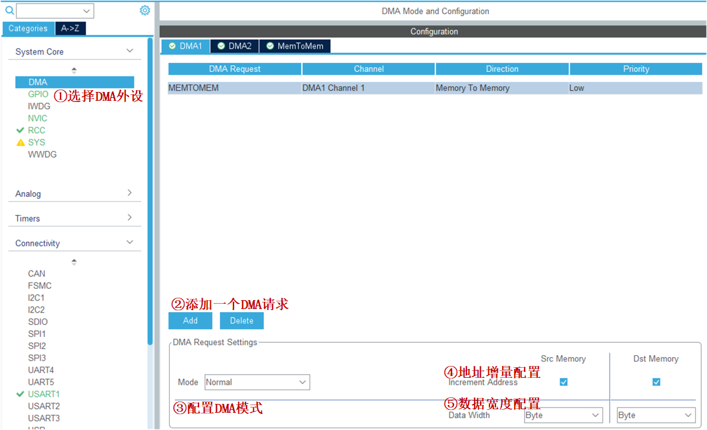
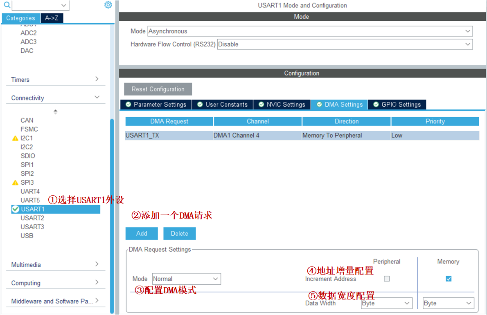
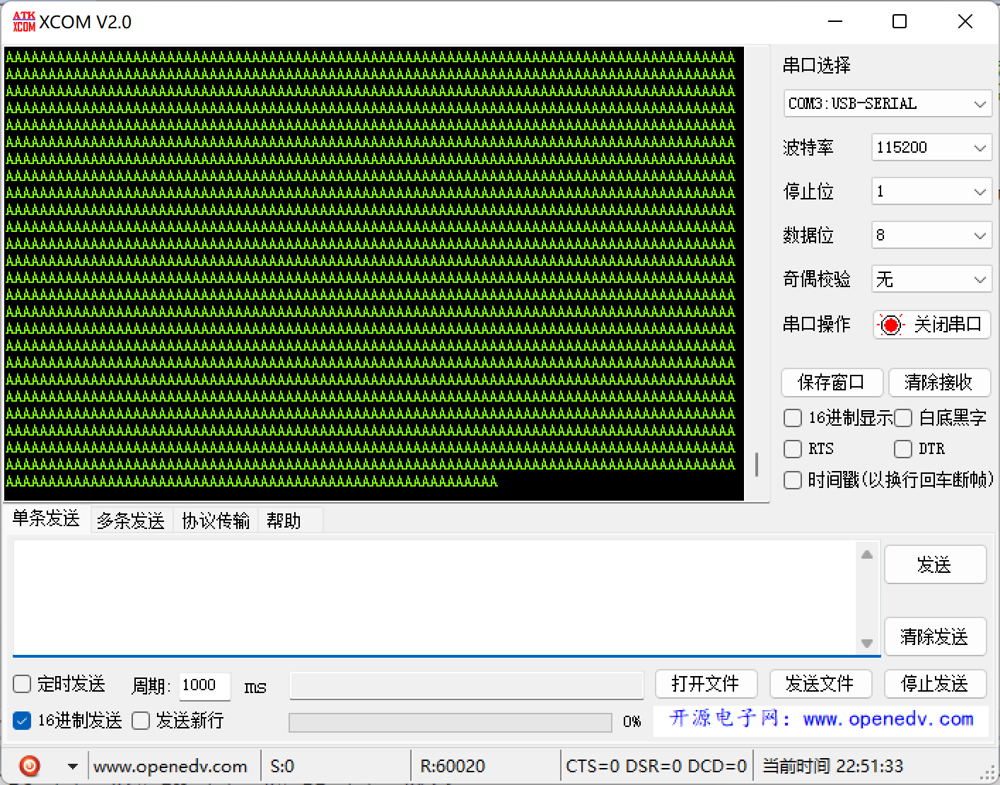

<!-- more -->


这里的实例都是通过STM32CubeMX软件进行配置。

## 一、存储器到存储器

FLASH to SRAM，把内部FLASH的数据传输到内部的SRAM。在这里相当于将FLASH当做外设，将SRAM作为存储器，将数据从外设传输到存储器  。一般步骤如下：

（1）使能 DMA 时钟；

（2）配置 DMA 数据参数；

（3）使能 DMA，进行传输；

（4）等待传输完成，并对源数据和目标地址数据进行比较。  

### 1. STM32CubeMX配置



①、选择DMA外设；

②、点击【Add】添加一个DMA请求，注意我们只能选择已经开启的外设；

③、配置DMA模式，对于MEMTOMEM来说我们只能选择Normal模式；

④、地址增量配置，勾选表示地址递增，不勾选表示地址不变；

⑤、数据宽度，看我们要传输的数据宽度了，可以选择字节、半字、字，分别代表8位、16位、32位。

### 2. 变量定义

```c
/* 定义aSRC_Const_Buffer数组作为DMA传输数据源 const关键字将aSRC_Const_Buffer数组变量定义为常量类型 */
const uint32_t aSRC_Const_Buffer[BUFFER_SIZE]= {
		0x01020304,0x05060708,0x090A0B0C,0x0D0E0F10,
		0x11121314,0x15161718,0x191A1B1C,0x1D1E1F20,
		0x21222324,0x25262728,0x292A2B2C,0x2D2E2F30,
		0x31323334,0x35363738,0x393A3B3C,0x3D3E3F40,
		0x41424344,0x45464748,0x494A4B4C,0x4D4E4F50,
		0x51525354,0x55565758,0x595A5B5C,0x5D5E5F60,
		0x61626364,0x65666768,0x696A6B6C,0x6D6E6F70,
		0x71727374,0x75767778,0x797A7B7C,0x7D7E7F80};
/* 定义DMA传输目标存储器 */
uint32_t aDST_Buffer[BUFFER_SIZE];
```

我们需要定义一个静态的源数据，存放在内部 FLASH，然后使用 DMA 传输把源数据拷贝到目标地址上（内部 SRAM），最后对比源数据和目标地址的数据，看看是否传输准确。

### 3. 代码分析

#### 3.1 DMA初始化

我们按照上图配置完成后，会生成下边的代码：

```c
DMA_HandleTypeDef hdma_memtomem_dma1_channel1;

void MX_DMA_Init(void)
{

  /* DMA controller clock enable */
  __HAL_RCC_DMA1_CLK_ENABLE();

  /* Configure DMA request hdma_memtomem_dma1_channel1 on DMA1_Channel1 */
  hdma_memtomem_dma1_channel1.Instance = DMA1_Channel1;
  hdma_memtomem_dma1_channel1.Init.Direction = DMA_MEMORY_TO_MEMORY; // 存储器到存储器
  hdma_memtomem_dma1_channel1.Init.PeriphInc = DMA_PINC_ENABLE;      // 外设地址增量模式   
  hdma_memtomem_dma1_channel1.Init.MemInc = DMA_MINC_ENABLE;         // 存储器地址增量模式
  hdma_memtomem_dma1_channel1.Init.PeriphDataAlignment = DMA_PDATAALIGN_WORD; // 外设数据长度:32 位
  hdma_memtomem_dma1_channel1.Init.MemDataAlignment = DMA_MDATAALIGN_WORD;    // 存储器数据长度：32 位
  hdma_memtomem_dma1_channel1.Init.Mode = DMA_NORMAL;               // 外设普通模式
  hdma_memtomem_dma1_channel1.Init.Priority = DMA_PRIORITY_MEDIUM;  // 配置优先级
  if (HAL_DMA_Init(&hdma_memtomem_dma1_channel1) != HAL_OK)
  {
    Error_Handler();
  }

}
```

#### 3.2 比较数据

```c
/**
  * 判断指定长度的两个数据源是否完全相等，
  * 如果完全相等返回1，只要其中一对数据不相等返回0
  */
uint8_t Buffercmp(const uint32_t* pBuffer, uint32_t* pBuffer1, uint16_t BufferLength)
{
	while(BufferLength--) /* 数据长度递减 */
	{
		
		if(*pBuffer != *pBuffer1) /* 判断两个数据源是否对应相等 */
		{
		  return 0; /* 对应数据源不相等马上退出函数，并返回0 */
		}
		pBuffer++; /* 递增两个数据源的地址指针 */
		pBuffer1++;
	}
	/* 完成判断并且对应数据相等 */
	return 1;  
}
```

#### 3.3 启动并等待DMA传输

```c
void dma_mem2mem_start(void)
{
	HAL_DMA_Start(&hdma_memtomem_dma1_channel1, (uint32_t)aSRC_Const_Buffer, (uint32_t)aDST_Buffer,BUFFER_SIZE);
	/* 等待DMA传输完成 */
    while(__HAL_DMA_GET_FLAG(&hdma_memtomem_dma1_channel1, DMA_FLAG_TC1) == DISABLE);
}
```

#### 3.4 测试函数

```c
void dma_mem2mem_test(void)
{
    uint8_t TransferStatus = 0;
    dma_mem2mem_start();
    TransferStatus = Buffercmp(aSRC_Const_Buffer, aDST_Buffer, BUFFER_SIZE);
    printf("TransferStatus=%d\r\n", TransferStatus);
}
```

## 二、 存储器到外设

SRAM to 串口，同时LED灯闪烁，演示DMA传数据不需要占用CPU。 一般步骤如下：

（1）配置 USART 通信功能；

（2）设置串口 DMA 工作参数；

（3）使能 DMA；

（4）DMA 传输同时 CPU 可以运行其他任务。  

### 1. STM32CubeMX配置

这里只写DMA的配置，串口和LED的可以根据以前的笔记来。



①、选择USART外设或者选择DMA外设，都可以进入DMA的配置界面；

②、点击【Add】添加一个DMA请求，注意我们只能选择已经开启的外设，我们这里选择USART1_TX，通道的话软件会主动帮我们选好；

③、配置DMA模式，对于MEMTOMEM来说我们只能选择Normal模式；

④、地址增量配置，勾选表示地址递增，不勾选表示地址不变，这里的外设地址不能勾选，因为串口的寄存器只有一个DR，根本没必要递增，软件中也直接无法勾选

⑤、数据宽度，看我们要传输的数据宽度了，可以选择字节、半字、字，分别代表8位、16位、32位，在这里我们需要选择8位，因为我们串口的数据寄存器就是8位有效的。

### 2. 变量定义

```c
#define SENDBUFF_SIZE                     		1000//发送的数据量
uint8_t SendBuff[SENDBUFF_SIZE];
/*填充将要发送的数据*/
for(i=0;i<SENDBUFF_SIZE;i++)
{
    SendBuff[i]	 = 'A';
}
```

### 3. 代码分析

#### 3.1 DMA初始化

```c
void HAL_UART_MspInit(UART_HandleTypeDef* uartHandle)
{
  GPIO_InitTypeDef GPIO_InitStruct = {0};
  if(uartHandle->Instance==USART1)
  {
    // 串口GPIO的配置，这里省略......
    /* USART1 DMA Init */
    /* USART1_TX Init */
    hdma_usart1_tx.Instance = DMA1_Channel4;
    hdma_usart1_tx.Init.Direction = DMA_MEMORY_TO_PERIPH;  // 存储器到外设
    hdma_usart1_tx.Init.PeriphInc = DMA_PINC_DISABLE;      // 外设非增量模式
    hdma_usart1_tx.Init.MemInc = DMA_MINC_ENABLE;          // 存储器增量模式
    hdma_usart1_tx.Init.PeriphDataAlignment = DMA_PDATAALIGN_BYTE; // 外设数据长度:8 位
    hdma_usart1_tx.Init.MemDataAlignment = DMA_MDATAALIGN_BYTE;    // 存储器数据长度:8 位
    hdma_usart1_tx.Init.Mode = DMA_NORMAL;                 //外设普通模式
    hdma_usart1_tx.Init.Priority = DMA_PRIORITY_MEDIUM;    //中等优先级
    if (HAL_DMA_Init(&hdma_usart1_tx) != HAL_OK)
    {
      Error_Handler();
    }

    __HAL_LINKDMA(uartHandle,hdmatx,hdma_usart1_tx);      // Associate the DMA handle 

  }
}

```

因为数据是从存储器到串口，所以设置存储器为源地址，串口的数据寄存器为目标地址，要发送的数据有很多且都先存储在存储器中，则存储器地址指针递增，串口数据寄存器只有一个，则外设地址地址不变，两边数据单位设置成一致，传输模式可选一次或者循环传输，只有一个 DMA请求，优先级随便设，最后调用 HAL_DMA_Init 函数把这些参数写到 DMA 的寄存器中，然后使能 DMA 开始传输。  

为演示DMA持续运行而CPU还能处理其它事情，持续使用DMA发送数据，量非常大，长时间运行可能会导致电脑端串口调试助手会卡死，鼠标乱飞的情况，所以这里将DMA配置中的循环模式改为单次模式。

#### 3.2 中断处理函数

这里在软件中配置的时候好像自动开启DMA中断，中断的优先级我们可以在NVIC中进行设置：

```c
// 初始化函数
void MX_DMA_Init(void)
{

  /* DMA controller clock enable */
  __HAL_RCC_DMA1_CLK_ENABLE();

  /* DMA interrupt init */
  /* DMA1_Channel4_IRQn interrupt configuration */
  HAL_NVIC_SetPriority(DMA1_Channel4_IRQn, 0, 0);
  HAL_NVIC_EnableIRQ(DMA1_Channel4_IRQn);

}

// 中断回调函数
// DMA1_Channel4_IRQHandler()-->HAL_DMA_IRQHandler()-->有三个，注册实例如下
DMA_HandleTypeDef hdma_usart1_tx;
hdma_usart1_tx.XferHalfCpltCallback = ferHalfCpltCallbackFuncName;
```

中断回调函数是需要在初始化的时候进行注册的，没有注册的话就不会被调用啦，这里我们暂时不用，就没有注册了。

#### 3.3 启动传输

```c
/* USART1 向 DMA发出TX请求 */
HAL_StatusTypeDef HAL_UART_Transmit_DMA(UART_HandleTypeDef *huart, uint8_t *pData, uint16_t Size)
// 例如
HAL_UART_Transmit_DMA(&UartHandle, (uint8_t *)SendBuff , SENDBUFF_SIZE);
```

HAL_UART_Transmit_DMA 函数用于启动 USART 的 DMA 传输，第一个参数为外设的初始化句柄而非dma初始化使用的句柄。。只需要指定源数据地址及长度，运行该函数后 USART 的 DMA 发送传输就开始了，根据配置它会通过 USART 循环发送数据。DMA 传输过程是不占用 CPU 资源的，可以一边传输一次运行其他任务。  

#### 3.4 测试函数

这个我们直接写到main函数中

```c
#define SENDBUFF_SIZE                     		60000//发送的数据量
uint8_t SendBuff[SENDBUFF_SIZE];/
int main(void)
{
  HAL_Init();
  SystemClock_Config();
  MX_GPIO_Init();
  MX_DMA_Init();
  MX_USART1_UART_Init();

  uint32_t i = 0;
  for(i=0;i<SENDBUFF_SIZE;i++)
  {
     SendBuff[i] = 'A';
  }

  printf("This is my test!!!\r\n");
  HAL_UART_Transmit_DMA(&huart1, (uint8_t *)SendBuff ,SENDBUFF_SIZE);
  while (1)
  {
	  LED1 = !LED1;
	  HAL_Delay(500);
  }
}
```

### 4. 实验现象

这里描述一下现象，若是没有DMA的话，我们将上边的 60000 个 A 发送到串口需要占用大量的时间，此时我们需要等待传输完成才能看到LED1闪烁，但是有了DMA之后，只会在进入循环前开启DMA，然后LED1就能立刻进入闪烁状态，此时串口也可以看到有数据发送过来。



可以看到下方有60020个数据，这是因为我还加了个printf打印了一句话，这就说明我们发往串口的数据全部被打印出来了，而且注意观察的话，会发现LED1同时在闪烁，并不受串口数据传输的影响。
