<!-- more -->

这篇笔记主要看的是文档 [Physical Layer Simplified Specification v9.0](https://www.sdcard.org/downloads/pls/pdf/?p=Part1_Physical_Layer_Simplified_Specification_Ver9.00.jpg&f=Part1_Physical_Layer_Simplified_Specification_Ver9.00.pdf&e=EN_SS1_9) ，但其实应该看文档[Physical Layer Simplified Specification v2.0](https://www.sdcard.org/downloads/pls/pdf/?p=Part1_Physical_Layer_Simplified_Specification_Ver2.00.jpg&f=Part1_Physical_Layer_Simplified_Specification_Ver2.00.pdf&e=EN_P1200)可能会更好一些，虽然他们基本是一样的（因为后边好像说是STM32做多支持到2.0版本的SD卡）。

## 一、SD卡简介

### 1. 什么是SD卡？

 SD卡（Secure Digital Memory Card）即：安全数码卡，它是在MMC的基础上发展而来，是一种基于半导体快闪记忆器的新一代记忆设备，是SD协会开发的一种专有 的非易失性 存储卡格式，用于便携式设备。由于它体积小、数据传输速度快、可热插拔等优良的特性，被广泛地于便携式装置上使用，例如数码相机、个人数码助理(PDA)和多媒体播放器等。

SD卡由日本松下、东芝及美国SanDisk公司于1999年8月共同开发研制。作为对MultiMediaCard（MMC）的改进，现已成为行业标准。这三家公司组成了SD-3C，LLC，这家公司许可并执行与SD存储卡以及SD主机和辅助产品相关的知识产权。两家公司还于2000年1月成立了非营利组织SD协会（SDA），以促进和创建SD卡标准。SDA如今有大约1,000个成员公司。SDA使用SD-3C拥有并许可的多个商标徽标，以强制遵守其规范并确保用户的兼容性。

### 2. 长啥样？

这样的话，我们就去某宝看一看吧：

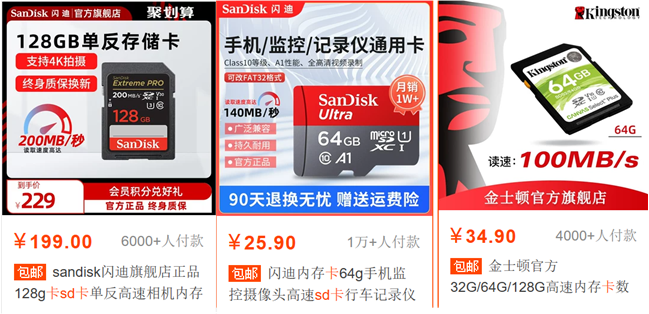

我们搜索关键词，就会出现下边这些类型的，我们会发现，似乎有两种形状，一种比较大，一种比较小，但是简介好像都叫SD卡。那就来了解一下吧。

#### 2.1 TF卡

Micro SD Card，原名Trans-flashCard（TF卡），2004年正式更名为MicroSD Card，由SanDisk（闪迪）公司发明。MicroSD卡是一种极细小的快闪存储器卡，其格式源自SanDisk创造，原本这种记忆卡称为T-Flash，及后改称为TransFlash；而重新命名为MicroSD的原因是因为被SD协会(SDA) 采立。

它的体积为15mm x 11mm x1mm，差不多相等于手指甲的大小，是现时最细小的记忆卡。它也能通过SD转接卡来接驳于SD卡插槽中使用。现时MicroSD卡提供128MB、256MB、512MB、1G、2G、4G、8G、16G、32G、64G、128G的容量(MWC2014 世界移动通信大会期间，SanDisk（闪迪）打破了储存卡最高64GB容量的传统，正式发布了一款容量高达128GB的Micro SD XC 储存卡。

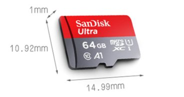

#### 2.2 SD卡

 SD卡（Secure Digital Memory Card）即：安全数码卡，就前边介绍的那样，俗称大卡，是一种发展时间比较久的内存卡，SD卡的标准尺寸为24mm×32mm×2.1mm。

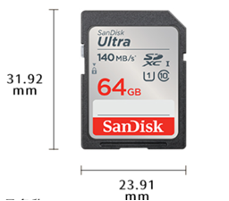

#### 2.3 TF卡转SD卡？

MicroSD的体积更小且可以转换SD卡使用，TF卡的电路和引脚和SD卡是一样的。TF卡可经SD卡转换器后，当SD卡使用，SD卡在一般情况下无法转换成TF卡，毕竟大小在哪摆着。

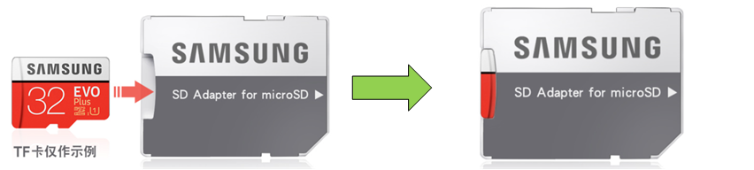

### 3. 官方宣传册？

这一部人可以查看官方网站的宣传册：[SDA_brochure_EN.pdf](https://www.sdcard.org/pdf/SDA_brochure_EN.pdf)，这个具体的还是看在线文档吧，简单了解一下，对后边自己购买SD卡也有帮助，比如SD卡上边标注的 class等参数是什么意思？

### 4. SD卡分类

SD卡按容量分类，可以分为3类：SD卡、SDHC卡、SDXC卡，如下表所示：

| **容量**   | **命名**                         | **简称** |
| ---------- | -------------------------------- | -------- |
| **0~2G**   | Standard Capacity SD Memory Card | SDSC或SD |
| **2G~32G** | High Capacity SD Memory Card     | SDHC     |
| **32G~2T** | Extended Capacity SD Memory Card | SDXC     |

这个其实在文档 [Physical Layer Simplified Specification v9.0](https://www.sdcard.org/downloads/pls/pdf/?p=Part1_Physical_Layer_Simplified_Specification_Ver9.00.jpg&f=Part1_Physical_Layer_Simplified_Specification_Ver9.00.pdf&e=EN_SS1_9) 的 2. System Features一节中的Capacity of Memory部分有说明。

## 二、SD卡物理结构

### 1. 包含哪些？

这张图我们可以查看 文档 [Physical Layer Simplified Specification v9.0](https://www.sdcard.org/downloads/pls/pdf/?p=Part1_Physical_Layer_Simplified_Specification_Ver9.00.jpg&f=Part1_Physical_Layer_Simplified_Specification_Ver9.00.pdf&e=EN_SS1_9) 的 3.7 SD Memory Card-Pins and Registers一节。

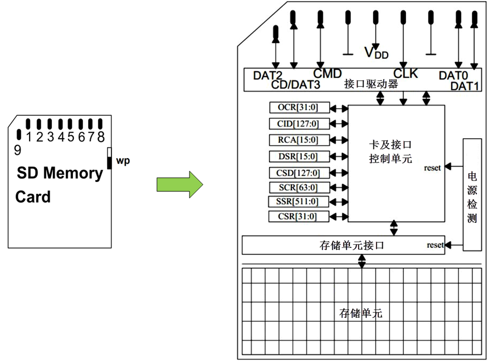

一张SD卡包括有存储单元、存储单元接口、电源检测、卡及接口控制器和接口驱动器5个部分 ：

（1）存储单元是存储数据部件，存储单元通过存储单元接口与卡控制单元进行数据传输，这一部分属于NAND FLASH；

（2）电源检测单元保证SD卡工作在合适的电压下，如出现掉电或上状态时，它会使控制单元和存储单元接口复位；

（3）卡及接口控制单元控制SD卡的运行状态，它包括有8个寄存器用于设定或表示SD卡信息。这些寄存器只能通过对应的命令访问， 一共定义有64个命令，每个命令都有特殊意义，可以实现某一特定功能， SD卡接收到命令后，根据命令要求对SD卡内部寄存器进行修改，程序控制中只需要发送组合命令就可以实现SD卡的控制以及读写操作。 

（4）接口驱动器控制SD卡引脚的输入输出 。

### 2. 寄存器简介

| 名称 | bit宽度 | 描述                                                         |
| ---- | ------- | ------------------------------------------------------------ |
| CID  | 128     | 卡识别号(Card identification number)：用来识别的卡的个体号码(唯一的) |
| RCA  | 16      | 相对地址(Relative card address)：卡的本地系统地址，初始化时，动态地由卡建议，主机核准。 |
| DSR  | 16      | 驱动级寄存器(Driver Stage Register)：配置卡的输出驱动        |
| CSD  | 128     | 卡的特定数据(Card Specific Data)：卡的操作条件信息           |
| SCR  | 64      | SD配置寄存器(SD Configuration Register)：SD 卡特殊特性信息   |
| OCR  | 32      | 操作条件寄存器(Operation conditions register)                |
| SSR  | 512     | SD状态(SD Status)：SD卡专有特征的信息                        |
| CSR  | 32      | 卡状态(Card Status)：卡状态信息                              |

每个寄存器的含义我们可以参考 文档 [Physical Layer Simplified Specification v9.0](https://www.sdcard.org/downloads/pls/pdf/?p=Part1_Physical_Layer_Simplified_Specification_Ver9.00.jpg&f=Part1_Physical_Layer_Simplified_Specification_Ver9.00.pdf&e=EN_SS1_9) 的 5.Card Registers，里边有对每个寄存器的详细描述。这里选几个重要的，我们可能会用到的说明一下。

（1）CID ：就是一个卡识别号，每一张卡的号都是唯一的，厂家生产SD卡的时候，需要向SD卡的那个标准组织购买卡号的，所以每一张的卡识别号都应该是唯一的。包括有提供制造商ID、OEM/应用ID、产品名称、版本、序列号、制造日期等信息。

（2）CID ：相对地址，这个主要是因为CID太长了，有128位，每一次通讯都通过这么长的CID号来查找是要跟哪一张SD卡通信的话，就比较麻烦了，所以出现了相对地址，那什么是相对地址呢？比如我们在STM32上边接了两张SD卡，这样我们就可以将第一张相对地址指定为0，第二张指定为1，这样就很好区分啦。可动态变化，在主机初始化的时候确定。（仅SDIO模式下有，SPI模式下无RCA）

（3）SSR：包含了这一张SD卡的一些专有特征信息，比如读写的基本单位，块的大小这些信息。

（4）CSR：卡状态寄存器，我们可以从这里获取SD卡的擦除状态啊，写入状态啊，是否需要等待啊这些状态。

## 三、SD卡总线及协议

### 1. SDIO接口？

SD卡一般都支持SDIO和SPI这两种接口，支持SPI和SDIO两种模式：不同模式下，SD卡引脚功能描述如下表所示：

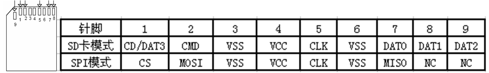

需要注意的是TF卡+卡套，组合起来也可以当SD卡用，不过，很大一部分TF卡，不支持SPI访问模式。所以，SPI驱动SD卡的时候，尽量选择大卡(SD卡)，而不要选择TF卡。在这里我们只学习SDIO接口操作方式， SD卡与SDIO接口示意图如下  

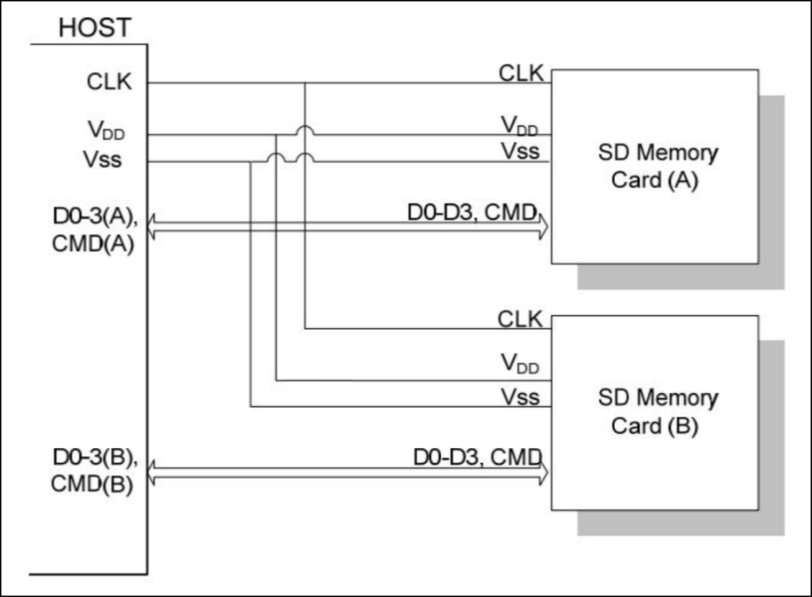

SD卡使用9-pin接口通信，其中3根电源线、 1根时钟线、 1根命令线和4根数据线，具体如下：  

| 信号线            | 说明                                                         |
| ----------------- | ------------------------------------------------------------ |
| CLK               | 时钟线，由SDIO主机产生，即由STM32控制器输出；                |
| CMD               | 命令控制线， SDIO主机通过该线发送命令控制SD卡，如果命令要求SD，卡提供应答， SD卡也是通过该线传输应答信息； |
| D0-3              | 数据线，传输读写数据； SD卡可将D0拉低表示忙状态；            |
| VDD、 VSS1、 VSS2 | 电源和地信号                                                 |

SDIO的通信时序的物理逻辑非常简单， SDIO不管是从主机控制器向SD卡传输，还是SD卡向主机控制器传输都只以CLK时钟线的上升沿为有效。SD卡操作过程会使用两种不同频率的时钟同步数据，一个是识别卡阶段时钟频率FOD，最高为400kHz； 另外一个是数据传输模式下时钟频率FPP，默认最高为25MHz，如果通过相关寄存器配置使SDIO工作在高速模式，此时数据传输模式最高频率为50MHz。  

### 2. 总线协议

关于总线协议，我们可以参考文档 [Physical Layer Simplified Specification v9.0](https://www.sdcard.org/downloads/pls/pdf/?p=Part1_Physical_Layer_Simplified_Specification_Ver9.00.jpg&f=Part1_Physical_Layer_Simplified_Specification_Ver9.00.pdf&e=EN_SS1_9) 的 3.6 Bus Protocol章节。

#### 2.1 命令与响应

SD总线通信是基于命令和数据传输的。通讯由一个起始位(“0” )，由一个停止位(“1” )终止。 SD通信一般是主机发送一个命令(Command)，从设备在接收到命令后作出响应(Response)，如有需要会有数据(Data)传输参与。  

命令与响应交互的过程如下图：

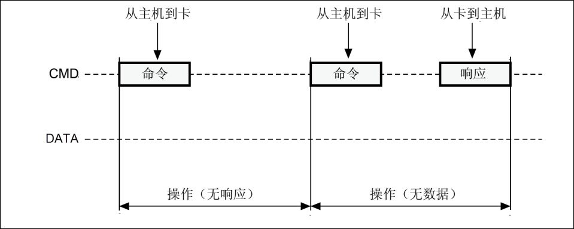

#### 2.2 带数据块的通信

SD数据是以块(Black)形式传输的， SDHC卡数据块长度一般为512字节，数据可以从主机到卡，也可以是从卡到主机。数据块需要CRC位来保证数据传输成功。 CRC位由SD卡系统硬件生成。 STM32控制器可以控制使用单线或4线传输。  

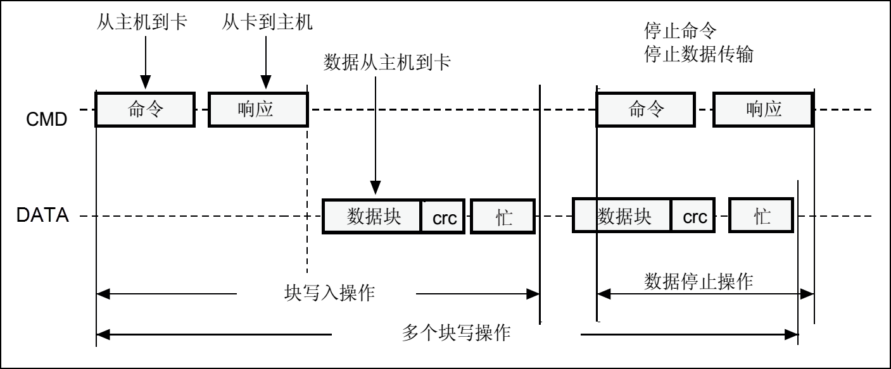

#### 2.3 单块和多块的通信

SD数据传输支持单块和多块读写，它们分别对应不同的操作命令，多块写入还需要使用命令来停止整个写入操作。数据写入前需要检测SD卡忙状态，因为SD卡在接收到数据后编程到存储区过程需要一定操作时间。 SD卡忙状态通过把D0线拉低表示。  数据块读操作与之类似，只是无需忙状态检测。  

#### 2.4 数据位什么传输？

使用4数据线传输时，每次传输4bit数据，每根数据线都必须有起始位、终止位以及CRC位， CRC位每根数据线都要分别检查，并把检查结果汇总然后在数据传输完后通过D0线反馈给主机。  

SD卡数据包有两种格式，一种是常规数据(8bit宽)，它先发低字节再发高字节，而每个字节则是先发高位再发低位， 4线传输示意如下图：  

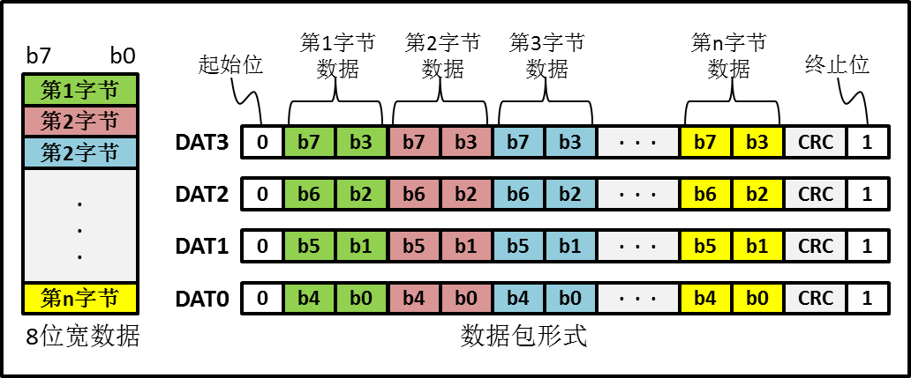

另外一种数据包发送格式是宽位数据包格式，对SD卡而言宽位数据包发送方式是针对SD卡SSR(SD状态)寄存器内容发送的， SSR寄存器总共有512bit，在主机发出ACMD13命令后SD卡将SSR寄存器内容通过DAT线发送给主机。宽位数据包格式示意图如下：  

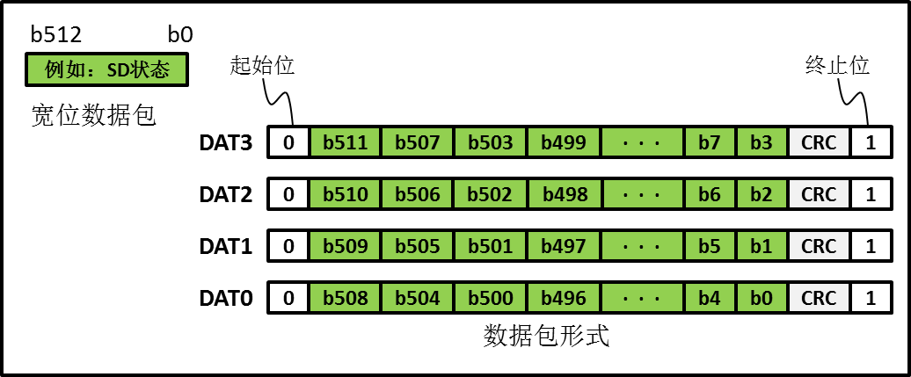

## 四、一些资料

<table>
    <tbody>
    <tr><td align="left"><a href="https://www.st.com/resource/en/datasheet/stm32f103ze.pdf" target="_blank">STM32F103xx英文数据手册</a></td><td align="left">STM32F103xC/D/E系列的英文数据手册</td></tr>
    <tr><td align="left"><a href="https://www.stmcu.com.cn/Designresource/detail/localization_document%20/709978" target="_blank">STM32F103xx中文数据手册</a></td><td align="left">STM32F103xC/D/E系列的中文数据手册</td></tr>
    <tr><td align="left"><a href="https://www.st.com/resource/en/reference_manual/rm0008-stm32f101xx-stm32f102xx-stm32f103xx-stm32f105xx-and-stm32f107xx-advanced-armbased-32bit-mcus-stmicroelectronics.pdf" target="_blank">STM32F10xxx英文参考手册（RM0008）</a></td><td align="left">STM32F10xxx系列的英文参考手册</td></tr>
    <tr><td align="left"><a href="https://www.stmcu.com.cn/Designresource/detail/localization_document%20/710001" target="_blank">STM32F10xxx中文参考手册（RM0008）</a></td><td align="left">STM32F10xxx系列的中文参考手册</td></tr>
    <tr><td align="left"><a href="https://developer.arm.com/documentation/100165/0201/?lang=en" target="_blank">Arm Cortex-M3 处理器技术参考手册-英文版</a></td><td align="left">Cortex-M3技术参考手册-英文版</td></tr>
    <tr><td align="left"><a href="https://www.st.com/resource/en/programming_manual/pm0056-stm32f10xxx20xxx21xxxl1xxxx-cortexm3-programming-manual-stmicroelectronics.pdf" target="_blank">STM32F10xxx Cortex-M3编程手册-英文版(PM0056)</a></td><td align="left">STM32F10xxx/20xxx/21xxx/L1xxxx系列Cortex-M3编程手册-英文版</td></tr>
    <tr><td align="left"><a href="https://www.sdcard.org/downloads/pls/" target="_blank">SD卡相关资料——最新版本</a></td><td align="left">有关SD卡的一些资料可以从这里下载</td></tr>
    <tr><td align="left"><a href="https://www.sdcard.org/downloads/pls/archives/" target="_blank">SD卡相关资料——历史版本</a></td><td align="left">有关SD卡的一些历史版本资料可以从这里下载，比如后边看的SD卡2.0协议</td></tr>
    <tr><td align="left"><a href="./" target="_blank">SD 2.0 协议标准完整版</a></td><td align="left">这是一篇关于SD卡2.0协议的中文文档，还是比较有参考价值的，可以一看</td></tr>
    </tbody>
</table>
