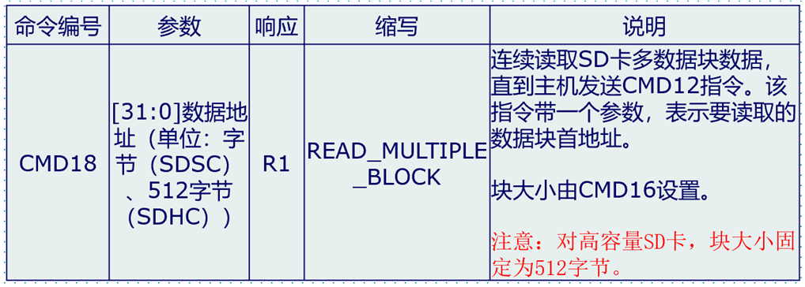

<!-- more -->

## 一、SD卡命令

SD命令由主机发出，以广播命令和寻址命令为例，广播命令是针对与SD主机总线连接的所有从设备发送的，寻址命令是指定某个地址设备进行命令传输。这一章的内容我们可以参考文档 [Physical Layer Simplified Specification v9.0](https://www.sdcard.org/downloads/pls/pdf/?p=Part1_Physical_Layer_Simplified_Specification_Ver9.00.jpg&f=Part1_Physical_Layer_Simplified_Specification_Ver9.00.pdf&e=EN_SS1_9) 的 4.7 Commands  章节。 

### 1. 命令格式

SD命令格式固定为48bit，都是通过CMD线连续传输的， 数据线不参与。  


SD命令的组成如下：

（1）起始位和终止位：命令的主体包含在起始位与终止位之间，它们都只包含一个数据位，起始位为0，终止位为1。

（2）传输标志：用于区分传输方向，该位为1时表示命令，方向为主机传输到SD卡，该位为0时表示响应，方向为SD卡传输到主机。

（3）命令主体内容： 命令主体内容包括命令、地址信息/参数和CRC校验三个部分。  

> 命令主体内容的三个部分说明如下：
>
> 命令号：它固定占用6bit，所以总共有64个命令(代号：CMD0~CMD63)，每个命令都有特定的用途，部分命令不适用于SD卡操作，只是专门用于MMC卡或者SD I/O卡。
>
> 地址/参数：每个命令有32bit地址信息/参数用于命令附加内容，例如，广播命令没有地址信息，这32bit用于指定参数，而寻址命令这32bit用于指定目标SD卡的地址。    
>
> CRC7校验：长度为7bit的校验位用于验证命令传输内容正确性，如果发生外部干扰导致传输数据个别位状态改变将导致校准失败，也意味着命令传输失败， SD卡不执行命令。  

### 2. 命令类型  

SD命令有4种类型：

（1）无响应广播命令(bc)，发送到所有卡，不返回任务响应；

（2）带响应广播命令(bcr)，发送到所有卡，同时接收来自所有卡响应；

（3）寻址命令(ac)，发送到选定卡， DAT线无数据传输；

（4）寻址数据传输命令(adtc)，发送到选定卡， DAT线有数据传输。  

另外， SD卡主机模块系统旨在为各种应用程序类型提供一个标准接口。在此环境中，需要有特定的客户/应用程序功能。为实现这些功能，在标准中定义了两种类型的通用命令： **特定应用命令(ACMD)和常规命令(GEN_CMD)**。 要使用SD卡制造商特定的ACMD命令如ACMD6，需要在发送该命令之前无发送CMD55命令，告知SD卡接下来的命令为特定应用命令。 CMD55命令只对紧接的第一个命令有效，SD卡如果检测到CMD55之后的第一条命令为ACMD则执行其特定应用功能，如果检测发现不是ACMD命令，则执行标准命令。  

### 3. 命令描述

接下来我们来学习一下SD卡部分命令信息，更多详细信息可以参考SD简易规格文件说明，表中填充位和保留位都必须被设置为0。这一部分详细可以参考文档 [Physical Layer Simplified Specification v9.0](https://www.sdcard.org/downloads/pls/pdf/?p=Part1_Physical_Layer_Simplified_Specification_Ver9.00.jpg&f=Part1_Physical_Layer_Simplified_Specification_Ver9.00.pdf&e=EN_SS1_9) 的  4.7.4 Detailed command Description 一节。注意后边列举命令的时候是将保留的命令给去掉了。

#### 3.1 基本命令(Class 0)

| 命令序号 | 类型 | 参数                                | 响应 | 缩写                 | 描述                                                         |
| -------- | ---- | ----------------------------------- | ---- | -------------------- | ------------------------------------------------------------ |
| CMD0     | bc   | [31:0]填充位                        | -    | GO_IDLE_STATE        | 复位所有的卡到idle状态。                                     |
| CMD2     | bcr  | [31:0]填充位                        | R2   | ALL_SEND_CID         | 通知所有卡通过CMD线返回CID值。                               |
| CMD3     | bcr  | [31:0]填充位                        | R6   | SEND_RELATIVE_ADDR   | 通知所有卡发布新RCA。                                        |
| CMD4     | bc   | [31:16]DSR[15:0]填充位              | -    | SET_DSR              | 编程所有卡的DSR。                                            |
| CMD7     | ac   | [31:16]RCA[15:0]填充位              | R1b  | SELECT/DESELECT_CARD | 选择/取消选择RCA地址卡。                                     |
| CMD8     | bcr  | [31:12]保留位[11:8]VHS[7:0]检查模式 | R7   | SEND_IF_COND         | 发送SD卡接口条件， 包含主机支持的电压信息， 并询问卡是否支持。 |
| CMD9     | ac   | [31:16]RCA[15:0]填充位              | R2   | SEND_CSD             | 选定卡通过CMD线发送CSD内容                                   |
| CMD10    | ac   | [31:16]RCA[15:0]填充位              | R2   | SEND_CID             | 选定卡通过CMD线发送CID内容                                   |
| CMD12    | ac   | [31:0]填充位                        | R1b  | STOP_TRANSMISSION    | 强制卡停止传输                                               |
| CMD13    | ac   | [31:16]RCA[15:0]填充位              | R1   | SEND_STATUS          | 选定卡通过CMD线发送它状态寄存器                              |
| CMD15    | ac   | [31:16]RCA[15:0]填充位              | -    | GO_INACTIVE_STATE    | 使选定卡进入“inactive” 状态                                  |

#### 3.2 面向块的读操作(Class 2)

| 命令序号 | 类型 | 参数           | 响应 | 缩写                | 描述                                                         |
| -------- | ---- | -------------- | ---- | ------------------- | ------------------------------------------------------------ |
| CMD16    | ac   | [31:0]块长度   | R1   | SET_BLOCK_LEN       | 对于标准SD卡， 设置块命令的长度， 对于SDHC卡块命令长度固定为512字节。 |
| CMD17    | adtc | [31:0]数据地址 | R1   | READ_SINGLE_BLOCK   | 对于标准卡， 读取SEL_BLOCK_LEN长度字节的块；对于SDHC卡， 读取512字 节的块。 |
| CMD18    | adtc | [31:0]数据地址 | R1   | READ_MULTIPLE_BLOCK | 连续从SD卡读取数据块， 直到被CMD12中断。 块长度同CMD17。     |

#### 3.3 面向块的写操作(Class 4)

| 命令序号 | 类型 | 参数           | 响应 | 缩写                 | 描述                                                         |
| -------- | ---- | -------------- | ---- | -------------------- | ------------------------------------------------------------ |
| CMD24    | adtc | [31:0]数据地址 | R1   | WRITE_BLOCK          | 对于标准卡， 写入SEL_BLOCK_LEN长度字节的块；对于SDHC卡， 写入512字 节的块。 |
| CMD25    | adtc | [31:0]数据地址 | R1   | WRITE_MILTIPLE_BLOCK | 连续向SD卡写入数据块， 直到被CMD12中断。 每块长度同CMD17。   |
| CMD27    | adtc | [31:0]填充位   | R1   | PROGRAM_CSD          | 对CSD的可编程位进行编程                                      |

#### 3.4 擦除命令(Class 5)

| 命令序号 | 类型 | 参数           | 响应 | 缩写               | 描述                 |
| -------- | ---- | -------------- | ---- | ------------------ | -------------------- |
| CMD32    | ac   | [31:0]数据地址 | R1   | ERASE_WR_BLK_START | 设置擦除的起始块地址 |
| CMD33    | ac   | [31:0]数据地址 | R1   | ERASE_WR_BLK_END   | 设置擦除的结束块地址 |
| CMD38    | ac   | [31:0]填充位   | R1b  | ERASE              | 擦除预先选定的块     |

#### 3.5 加锁命令(Class 7)

| 命令序号 | 类型 | 参数       | 响应 | 缩写        | 描述          |
| -------- | ---- | ---------- | ---- | ----------- | ------------- |
| CMD42    | adtc | [31:0]保留 | R1   | LOCK_UNLOCK | 加锁/解锁SD卡 |

#### 3.6 特定应用命令(Class 8)

| 命令序号 | 类型 | 参数                   | 响应 | 缩写    | 描述                                                         |
| -------- | ---- | ---------------------- | ---- | ------- | ------------------------------------------------------------ |
| CMD55    | ac   | [31:16]RCA[15:0]填充位 | R1   | APP_CMD | 指定下个命令为特定应用命令， 不是标准命令                    |
| CMD56    | adtc | [31:1]填充位[0]读/写   | R1   | GEN_CMD | 通用命令， 或者特定应用命令中， 用于传输一个数据块， 最低位为1表示读数据 ， 为0表示写数据 |

#### 3.7 SD卡特定应用命令

| 命令序号 | 类型 | 参数                                                         | 响应 | 缩写            | 描述                                             |
| -------- | ---- | ------------------------------------------------------------ | ---- | --------------- | ------------------------------------------------ |
| ACMD6    | ac   | [31:2]填充位[1:0]总线宽度                                    | R1   | SET_BUS_WIDTH   | 定义数据总线宽度('00'=1bit,'10'=4bit)。          |
| ACMD13   | adtc | [31:0]填充位                                                 | R1   | SD_STATUS       | 发送SD状态                                       |
| ACMD41   | bcr  | [32]保留位[30]HCS(OCR[30]) [29:24]保留 位[23:0]VDD电压(OCR[23:0]) | R3   | SD_SEND_OP_COND | 主机要求卡发送它的支持信息(HCS)和OCR寄存器内容。 |
| ACMD51   | adtc | [31:0]填充位                                                 | R1   | SEND_SCR        | 读取配置寄存器SCR                                |

## 二、SD卡响应

关于响应这一部分，我们可以参考文档 [Physical Layer Simplified Specification v9.0](https://www.sdcard.org/downloads/pls/pdf/?p=Part1_Physical_Layer_Simplified_Specification_Ver9.00.jpg&f=Part1_Physical_Layer_Simplified_Specification_Ver9.00.pdf&e=EN_SS1_9) 的 4.9 Responses一节。

### 1. 响应简介

响应由SD卡向主机发出，部分命令要求SD卡作出响应，这些响应多用于反馈SD卡的状态。 基本特性如下：

（1）总共有7个响应类型(代号： R1~R7)，其中SD卡没有R4、 R5类型响应。特定的命令对应有特定的响应类型，比如当主机发送CMD3命令时，可以得到响应R6。

（2）与命令一样， SD卡的响应也是通过CMD线连续传输的。

（3）根据响应内容大小可以分为短响应和长响应。短响应是48bit长度，只有R2类型是长响应，其长度为136bit。  

（4）除了 R3 类型之外，其他响应都使用 CRC7 校验来校验，对于 R2 类型是使用 CID 和 CSD 寄存器内部 CRC7。

### 2. R1(正常响应命令)

| 描述 | 起始位 | 传输位 | 命令号  | 卡状态 | CRC7  | 终止位 |
| ---- | ------ | ------ | ------- | ------ | ----- | ------ |
| Bit  | 47     | 46     | [45:40] | [39:8] | [7:1] | 0      |
| 位宽 | 1      | 1      | 6       | 32     | 7     | 1      |
| 值   | "0"    | "0"    | x       | x      | x     | "1"    |

如果有传输到卡的数据，那么在数据线可能有busy信号。

### 3. R2(CID,CSD寄存器)

| 描述 | 起始位 | 传输位 | 保留      | [127:1]                       | 终止位 |
| ---- | ------ | ------ | --------- | ----------------------------- | ------ |
| Bit  | 135    | 134    | [133:128] | 127                           | 0      |
| 位宽 | 1      | 1      | 6         | x                             | 1      |
| 值   | "0"    | "0"    | "111111"  | CID或者CSD寄存器[127:1]位的值 | "1"    |

CID寄存器内容作为CMD2和CMD10响应， CSD寄存器内容作为CMD9响应。

### 4. R3(OCR寄存器)

| 描述 | 起始位 | 传输位 | 保留     | OCR寄存器 | 保留      | 终止位 |
| ---- | ------ | ------ | -------- | --------- | --------- | ------ |
| Bit  | 47     | 46     | [45:40]  | [39:8]    | [7:1]     | 0      |
| 位宽 | 1      | 1      | 6        | 32        | 7         | 1      |
| 值   | "0"    | "0"    | "111111" | x         | "1111111" | "1"    |

OCR寄存器的值作为ACMD41的响应。

### 5. R6(发布的RCA寄存器响应)

| 描述 | 起始位 | 传输位 | CMD3     | RCA寄存器 | 卡状态位 | CRC7 | 终止位 |
| ---- | ------ | ------ | -------- | --------- | -------- | ---- | ------ |
| Bit  | 47     | 46     | [45:40]  | [39:8]    | [7:1]    | 0    |        |
| 位宽 | 1      | 1      | 6        | 16        | 16       | 7    | 1      |
| 值   | "0"    | "0"    | "000011" | x         | x        | x    | "1"    |

专用于命令CMD3的响应。

### 6. R7(发布的RCA寄存器响应)

| 描述 | 起始位 | 传输位 | CMD8     | 保留     | 接收电压 | 检测模式 | CRC7  | 终止位 |
| ---- | ------ | ------ | -------- | -------- | -------- | -------- | ----- | ------ |
| Bit  | 47     | 46     | [45:40]  | [39:20]  | [19:16]  | [15:8]   | [7:1] | 0      |
| 位宽 | 1      | 1      | 6        | 20       | 4        | 8        | 7     | 1      |
| 值   | "0"    | "0"    | "001000" | "00000h" | x        | x        | x     | "1"    |

专用于命令CMD8的响应,返回卡支持电压范围和检测模式。

## 三、SD卡状态

这一部分我们可以参考文档 [Physical Layer Simplified Specification v9.0](https://www.sdcard.org/downloads/pls/pdf/?p=Part1_Physical_Layer_Simplified_Specification_Ver9.00.jpg&f=Part1_Physical_Layer_Simplified_Specification_Ver9.00.pdf&e=EN_SS1_9) 的 4.10 Three Status Information of SD Memory Card 这一小节，有关SD卡状态的那部分在4.10.2 SD Status。

### 1. 状态简介

这里以文档[Physical Layer Simplified Specification v2.0](https://www.sdcard.org/downloads/pls/pdf/?p=Part1_Physical_Layer_Simplified_Specification_Ver2.00.jpg&f=Part1_Physical_Layer_Simplified_Specification_Ver2.00.pdf&e=EN_P1200)来说明吧，因为在9.0版本中多了一个状态，但是似乎并不是目前关注的重点，而在2.0版本中是定义了种状态区域：

卡状态：执行命令的错误和状态信息，在响应中标示。

SD 状态：512 位的扩展状态信息，支持 SD 卡的特定功能以及将来的应用特定功能。  

### 2. 卡状态

响应 R1 包含一个 32bit 的“卡状态”区域。这个区域用来传输卡的状态信息(可以被存在本地状态寄存器中)给主机。如果没有特别说明，这个状态总是同前一个命令相关。这里就不写了，具体可以查看 文档[Physical Layer Simplified Specification v2.0](https://www.sdcard.org/downloads/pls/pdf/?p=Part1_Physical_Layer_Simplified_Specification_Ver2.00.jpg&f=Part1_Physical_Layer_Simplified_Specification_Ver2.00.pdf&e=EN_P1200) 的 4.10.1 Card Status一节。

 ### 3. SD状态

SD 状态包含了与 SD 卡属性功能相关的状态位，可能会用于将来特定的应用命令。SD状态的大小是一个 512bit 的数据块。这个寄存器的内容与16位CRC会通过 DAT 总线传递给主机。SD 状态会通过 DAT 总线发送给主机，作为 ACMD13(前面是 CMD55)的响应。ACMD13 只能在“transfer”模式发送给已选定的卡。卡状态结构体在下表描述。“类型”和“清除条件”使用的缩写和卡状态一样。这一部分也不详细写，具体可以查看 文档[Physical Layer Simplified Specification v2.0](https://www.sdcard.org/downloads/pls/pdf/?p=Part1_Physical_Layer_Simplified_Specification_Ver2.00.jpg&f=Part1_Physical_Layer_Simplified_Specification_Ver2.00.pdf&e=EN_P1200) 的 4.10.2 SD Status一节。

## 四、SD卡时钟控制

这一部分我们可以参考文档 [Physical Layer Simplified Specification v9.0](https://www.sdcard.org/downloads/pls/pdf/?p=Part1_Physical_Layer_Simplified_Specification_Ver9.00.jpg&f=Part1_Physical_Layer_Simplified_Specification_Ver9.00.pdf&e=EN_SS1_9) 的 4.4 Clock Control 一节。

主机可以使用 SD 卡时钟信号来将卡改变到节电模式，或者控制总线上的数据流(避免不足或者超出的情况)。主机可以减小时钟频率，或者关闭时钟。比如，当主机带有 512Byte的数据缓存，却想要向 1kByte 的卡上写块。因此，为了保持连续的数据传输，从卡这边来看，卡的时钟需要在第一个 512Byte 后关闭时钟。然后主机会将另外 512Byte 数据填写到缓存中。当主机的写块的后半部分 ready 后，将会重启时钟，并继续发送数据。这样，卡就不会意识到数据传输的中断。

这里有一些限制，主机需要注意：

总线时钟可在任何时候改变(要小于最大数据传输频率和本规范定义的标示频率)，但是有个例外，那就是ACMD41(SD_APP_OP_COND)命令。当 ACMD41 发送后，主机应该执行下面的（1）和（2）两个步骤，直到卡变为 ready 状态。

（1）发送连续的时钟，频率在 100KHz~400KHz；

（2）如果主机想要停止时钟，通过 ACMD41 循环设置 busy 位，小于 50ms 间隔。  


## 五、SD卡操作模式及切换

这一部分我们可以参考文档 [Physical Layer Simplified Specification v9.0](https://www.sdcard.org/downloads/pls/pdf/?p=Part1_Physical_Layer_Simplified_Specification_Ver9.00.jpg&f=Part1_Physical_Layer_Simplified_Specification_Ver9.00.pdf&e=EN_SS1_9) 的 4.2 Card ldentification Mode 和 4.3 Data Transfer Mode 两个小节。

### 1. 操作模式  

SD卡有多个版本， STM32控制器目前最高支持《Physical Layer Simplified Specification V2.0》定义的SD卡， STM32控制器对SD卡进行数据读写之前需要识别卡的种类： V1.0标准卡、 V2.0标准卡、 V2.0高容量卡或者不被识别卡。  

SD卡系统(包括主机和SD卡)定义了两种操作模式： **卡识别模式**和**数据传输模式**。 在系统复位后，主机处于卡识别模式，寻找总线上可用的SDIO设备；同
时， SD卡也处于卡识别模式，直到被主机识别到，即当SD卡接收到SEND_RCA(CMD3)命令后， SD卡就会进入数据传输模式，而主机在总线上所有卡被识别后也进入数据传输模式。

### 2. 不同模式下SD卡状态 

 在每个操作模式下，SD卡都有几种状态， 通过命令控制实现卡状态的切换 ：

<table>
	<tbody>
    <tr><td align="center" width=300px>操作模式</td><td align="center">SD卡状态</td></tr>
    <tr><td align="left">无效模式(Inactive)</td><td align="left">无效状态(Inactive State)</td></tr>
    <tr><td align="left" rowspan="3">卡识别模式(Card identification mode)</td><td align="left">空闲状态(Idle State)</td></tr>
    <tr><td align="left">准备状态(Ready State)</td></tr>
    <tr><td align="left">识别状态(Identification State)</td></tr>
    <tr><td align="left" rowspan="6">数据传输模式(Data transfer mode)</td><td align="left">待机状态(Stand-by State)</td></tr>
    <tr><td align="left">传输状态(Transfer State)</td></tr>
    <tr><td align="left">发送数据状态(Sending-data State)</td></tr>
    <tr><td align="left">接收数据状态(Receive-data State)</td></tr>
    <tr><td align="left">编程状态(Programming State)</td></tr>
    <tr><td align="left">断开连接状态(Disconnect State)</td></tr>
	</tbody>
</table>


### 3. 卡识别模式

在卡识别模式下，主机会复位所有处于“卡识别模式”的SD卡，确认其工作电压范围，识别SD卡类型，并且获取SD卡的相对地址(卡相对地址较短，便于寻址)。在卡识别过程中，要求SD卡工作在识别时钟频率FOD的状态下。  


（1）上电后，所有卡处于空闲状态，包括当前处于无效状态的卡，主机也可以发送GO_IDLE_STATE(CMD0)让所有卡软复位从而进入空闲状态，但当前处于无效状态的卡并不会复位。    

（2）主机在开始与卡通信前，需要先确定双方在互相支持的电压范围内。 SD 卡有一个电压支持范围，主机当前电压必须在该范围可能才能与卡正常通信。 SEND_IF_COND(CMD8) 命令就是用于验证卡接口操作条件的 (主要是电压支持)。卡会根据命令的参数来检测操作条件匹配性，如果卡支持主机电压就产生响应，否则不响应。而主机则根据响应内容确定卡的电压匹配性。 CMD8 是 SD卡标准 V2.0 版本才有的新命令，所以如果主机有接收到响应，可以判断卡为 V2.0 或更高版本SD 卡(非MMC卡)。  

（3）使用SD_SEND_OP_COND(ACMD41)命令识别或拒绝不匹配它的电压范围的卡。 并通过HCS位及其响应判断是SDSC还是SDHC卡。ACMD41 命令的VDD 电压参数用于设置主机支持电压范围，卡响应会返回卡支持的电压范围。对于对 CMD8有响应的卡，把 ACMD41 命令的 HCS 位设置为 1，可以测试卡的容量类型，如果卡响应的 CCS 位为 1 说明为高容量 SD 卡，否则为标准卡。卡在响应 ACMD41 之后进入准备状态，不响应 ACMD41的卡为不可用卡，进入无效状态。 ACMD41 是应用特定命令，发送该命令之前必须先发 CMD55。    

（4）使用ALL_SEND_CID(CMD2) 来控制所有卡返回它们的卡识别号(CID)，处于准备状态的卡在发送CID之后就进入识别状态。

（5）主机  发送SEND_RELATIVE_ADDR(CMD3)命令，让卡自己推荐一个相对地址(RCA)并响应命令。这个RCA是16bit地址，而CID是128bit地址，使用RCA简化通信。  

（6）卡在接收到CMD3并发出响应后就进入数据传输模式，并处于待机状态，主机在获取所有卡RCA之后也进入数据传输模式。

### 4. 数据传输模式

只有SD卡系统处于数据传输模式下才可以进行数据读写操作。数据传输模式下可以将主机SD时钟频率设置为FPP，默认最高为25MHz，频率切换可以通过CMD4命令来实现。  


（1）CMD7用来选定和取消指定的卡，卡在待机状态下还不能进行数据通信，因为总线上可能有多个卡都是出于待机状态，必须选择一个RCA地址目标卡使
其进入传输状态才可以进行数据通信。同时通过CMD7命令也可以让已经被选择的目标卡返回到待机状态。

（2）数据传输模式下的数据通信都是主机和目标卡之间通过寻址命令点对点进行的。卡处于传输状态下可以使用块的读写以及擦除命令对卡进行数据读写、擦除。  

（3）CMD12可以中断正在进行的数据通信，让卡返回到传输状态。 CMD0和CMD15会中止任何数据编程操作，返回卡识别模式，这可能导致卡数据被损坏。  

## 六、读写SD卡

### 1. 初始化

要实现SDIO驱动SD卡，最重要的步骤就是SD卡的初始化，只要SD卡初始化完成了，那么剩下的（读写操作）就简单了，所以我们这里重点介绍SD卡的初始化。这一部分可以参考文档 [Physical Layer Simplified Specification v9.0](https://www.sdcard.org/downloads/pls/pdf/?p=Part1_Physical_Layer_Simplified_Specification_Ver9.00.jpg&f=Part1_Physical_Layer_Simplified_Specification_Ver9.00.pdf&e=EN_SS1_9) 的4.2.3 Card lnitialization and ldentification Process一节。


（1）从SD卡初始化流程可知，不管什么卡（这里我们将卡分为4类：SD2.0高容量卡（SDHC，最大32G），SD2.0标准容量卡（SDSC，最大2G），SD1.x卡和MMC卡），首先我们要执行的是卡上电（设置SDIO_POWER[1:0]=11），上电后发送CMD0，对卡进行软复位.

（2）之后发送CMD8命令，用于区分SD卡2.0，只有2.0及以后的卡才支持CMD8命令，MMC卡和V1.x的卡，是不支持该命令的。 CMD8命令格式如下表（见 文档 [Physical Layer Simplified Specification v9.0](https://www.sdcard.org/downloads/pls/pdf/?p=Part1_Physical_Layer_Simplified_Specification_Ver9.00.jpg&f=Part1_Physical_Layer_Simplified_Specification_Ver9.00.pdf&e=EN_SS1_9) 的4.9.6 R7(Card interface condition)）：


在发送CMD8的时候，通过其带的参数我们可以设置VHS位（在v9.0上叫Voltage accepted），以告诉SD卡，主机的供电情况，让SD卡知道主机的供电范围。VHS位（在v9.0上叫Voltage accepted）定义如下表所示：


这里我们使用参数0X1AA，即告诉SD卡，主机供电为2.7~3.6V之间，如果SD卡支持CMD8，且支持该电压范围，则会通过CMD8的响应（R7）将参数部分原本返回给主机，如果不支持CMD8，或者不支持这个电压范围，则不响应。

（3）在发送CMD8后，发送ACMD41（注意：发送ACMD41之前，要先发送CMD55），来进一步确认卡的操作电压范围，并通过HCS位来告诉SD卡，主机是不是支持高容量卡（SDHC）。ACMD41命令格式如下表所示：


 ACMD41指令响应(R3)，包含了SD卡OCR寄存器内容，其定义如下表所示：


对于支持CMD8的卡，主机设置ACMD41的参数HCS=1，告诉SD卡，主机支持SDHC卡。对2.0的卡，OCR的CCS位用于表示SDHC还是SDSC；对1.x的卡，则忽略该位；对MMC卡，则不支持ACMD41，MMC卡只需要发送：CMD0和CMD1即可完成初始化。

（4）CMD2用于获取CID寄存器数据，CID寄存器各位定义如下表：


SD卡在收到CMD2后，将返回R2长响应（136位），其中包含128位有效数据（CID寄存器内容），存放在SDIO_RESP1~4等4个寄存器里面。通过读取这四个寄存器，就可以获得SD卡的CID信息。

（4）CMD3，用于设置卡相对地址（RCA，必须为非0），对于SD卡（非MMC卡），在收到CMD3后，将返回一个新的RCA给主机，方便主机寻址。RCA的存在允许一个SDIO接口挂多个SD卡，通过RCA来区分主机要操作的是哪个卡。对于MMC卡，则不是由SD卡自动返回RCA，而是主机主动设置MMC卡的RCA，即通过CMD3带参数（高16位用于RCA设置），实现RCA设置。同样MMC卡也支持一个SDIO接口挂多个MMC卡，不同于SD卡的是所有的RCA都是由主机主动设置的，而SD卡的RCA则是SD卡发给主机的。在获得卡RCA之后，我们便可以发送CMD9（带RCA参数），获得SD卡的CSD寄存器内容，从CSD寄存器，我们可以得到SD卡的容量和扇区大小等十分重要的信息。CSD寄存器我们可以参考文档 [Physical Layer Simplified Specification v9.0](https://www.sdcard.org/downloads/pls/pdf/?p=Part1_Physical_Layer_Simplified_Specification_Ver9.00.jpg&f=Part1_Physical_Layer_Simplified_Specification_Ver9.00.pdf&e=EN_SS1_9) 的5.3.1 CSD STRUCTURE一节。

（5）至此，我们的SD卡初始化基本就结束了，最后通过CMD7命令，选中我们要操作的SD卡，即可开始对SD卡的读写操作了。

### 2. 数据块读取

关于读取我们可以参文档 [Physical Layer Simplified Specification v9.0](https://www.sdcard.org/downloads/pls/pdf/?p=Part1_Physical_Layer_Simplified_Specification_Ver9.00.jpg&f=Part1_Physical_Layer_Simplified_Specification_Ver9.00.pdf&e=EN_SS1_9) 的 4.3.3 Data Read 一节。

#### 2.1 单块数据块读取流程

单块数据块读取大概得流程如下：


#### 2.2 多块数据块读取流程


#### 2.3 相关命令说明

##### 2.3.1 CMD17命令


##### 2.3.2 CMD18命令



##### 2.3.3 CMD12命令


### 3. 数据块写入

关于写入我们可以参考文档 [Physical Layer Simplified Specification v9.0](https://www.sdcard.org/downloads/pls/pdf/?p=Part1_Physical_Layer_Simplified_Specification_Ver9.00.jpg&f=Part1_Physical_Layer_Simplified_Specification_Ver9.00.pdf&e=EN_SS1_9) 的 4.3.4 Data Write 一节。

#### 3.1 单块数据块写入流程


#### 3.2 多块数据写入流程


#### 3.3 相关命令说明

##### 3.3.1 CMD13命令


R1响应如下：


##### 3.3.2 CMD24命令


##### 3.3.3 ACMD23命令


注意：发送ACMD之前，必须先发送CMD55，通知SD卡，接下来要发送的是应用命令（APP CMD），而非标准命令。

##### 3.3.4 CMD55命令


##### 3.3.5 CMD25命令


### 4. 读写地址

#### 4.1 写命令CMD24


我们可以参考文档 [Physical Layer Simplified Specification v9.0](https://www.sdcard.org/downloads/pls/pdf/?p=Part1_Physical_Layer_Simplified_Specification_Ver9.00.jpg&f=Part1_Physical_Layer_Simplified_Specification_Ver9.00.pdf&e=EN_SS1_9) 的4.7.4 Detailed Command Description一节，上边会有CMD24的说名，如上图所示，我们发送CMD24命令的时候携带的参数就是写入的地址信息，他是一个32位的长度，一共就是可以表示这么多个“地址”：

```c
2 ^ 32 = 4 * 2^10 * 2^10
```

那么这是怎么对应SD卡的地址的呢？要是每个字节都对应一个地址，那这完全不够32GB的用啊，2GB的还。其实我们看手册的话，手册这里有一个脚注：


这句话就在文档 [Physical Layer Simplified Specification v9.0](https://www.sdcard.org/downloads/pls/pdf/?p=Part1_Physical_Layer_Simplified_Specification_Ver9.00.jpg&f=Part1_Physical_Layer_Simplified_Specification_Ver9.00.pdf&e=EN_SS1_9) 的Table 4-24 : Block-Oriented Read Commands (class 2)这一个命令组的下边，这句话的意思就是，对于SDSC卡来说，单位就是字节，对于SDHC或者SDXC卡来说，使用块为单位，也就是512个字节，这什么意思呢，意思就是：

```c
对于SDSC卡：
    SD卡0h地址 ---> 0x00000000
    SD卡1h地址 ---> 0x00000001
    SD卡2h地址 ---> 0x00000010
    ... ...
对于SDHC或者SDXC卡：
    SD卡0地址   ---> 0x00000000
    SD卡511地址 ---> 0x00000001
    SD卡1023地址---> 0x00000010
    ... ...
```

这样计算下来的话，32位的地址，以512字节为单位，就可以表示:

 ```c
4 * 2^10 * 2^10 * 512 = 2048 * 2^10 * 2^10 = 2 * 2^10 * 2^10 * 2^10 = 2TB
 ```

这样的话32位不就够最大2TB的卡使用了嘛，这也就是为什么我们初始化SD卡的时候要获取卡的类型，读写的时候要先确定块的长度的原因啦。我们还可以查看 文档 [Physical Layer Simplified Specification v9.0](https://www.sdcard.org/downloads/pls/pdf/?p=Part1_Physical_Layer_Simplified_Specification_Ver9.00.jpg&f=Part1_Physical_Layer_Simplified_Specification_Ver9.00.pdf&e=EN_SS1_9) 的 4.3 Data Transfer Mode中 4.3.3 Data Read 和 4.3.4 Data Write两个部分，里边也有对应的说明。

#### 4.2 卡的类型

我们在看SD卡初始化流程的时候会发现，我们发送了ACMD41命令，这个命令上边有说明，我们再看一下手册（我们可以参考文档 [Physical Layer Simplified Specification v9.0](https://www.sdcard.org/downloads/pls/pdf/?p=Part1_Physical_Layer_Simplified_Specification_Ver9.00.jpg&f=Part1_Physical_Layer_Simplified_Specification_Ver9.00.pdf&e=EN_SS1_9) 的 4.2.3.1 Initialization Command (ACMD41)），详细了解一下：


可以看到，我们这里收到响应的时候，有一个CCS位，当CCS=1 表示卡是高容量 SD 卡（SDHC或者SDXC）；CCS=0 表示卡是普通 SD 卡（SDSC）。 
