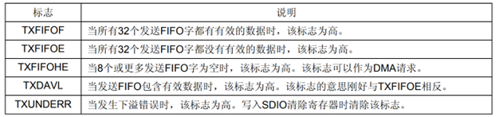
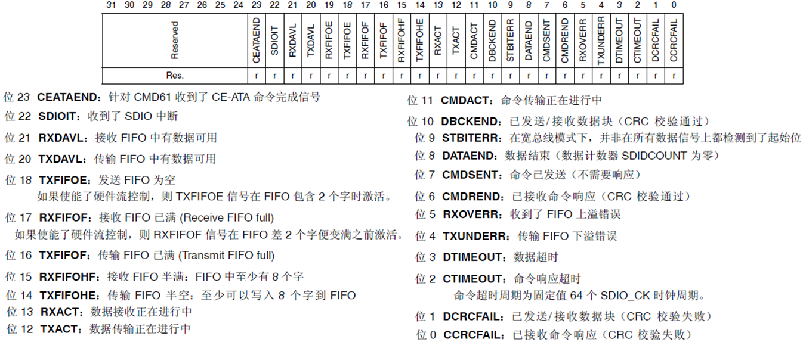

<!-- more -->


本篇文档再看SD卡规范的时候就以文档[Physical Layer Simplified Specification v2.0](https://www.sdcard.org/downloads/pls/pdf/?p=Part1_Physical_Layer_Simplified_Specification_Ver2.00.jpg&f=Part1_Physical_Layer_Simplified_Specification_Ver2.00.pdf&e=EN_P1200)为主啦，因为STM32最高只支持2.0协议的SD卡。

## 一、SDIO简介

### 1. 简介

SDIO，全称： Secure Digital Input and Output ，即安全数字输入输出接口。它是在SD卡接口的基础上发展而来，它可以兼容之前的SD卡，并可以连接SDIO接口设备，比如：蓝牙、WIFI、照相机等。

SDIO和SD卡规范间的一个重要区别是增加了低速标准。低速卡的目标应用是以最小的硬件开支支持低速I/ O能力。低速卡支持类似调制解调器、条码扫描仪和GPS接收器等应用。

STM32的SDIO控制器支持多媒体卡（MMC卡）、SD存储卡、SD I/O卡和CE-ATA设备。

### 2. SDIO设备


（1）SD I/O卡本身不是用于存储的卡，它是指利用SDIO传输协议的一种外设。比如Wi-Fi Card，它主要是提供Wi-Fi功能，有些Wi-Fi模块是使用串口或者SPI接口进行通信的，但Wi-Fi SDIO Card是使用SDIO接口进行通信的。并且一般设计SD I/O卡是可以插入到SD的插槽。 

（2）STM32F10x系列控制器只支持SD卡规范版本2.0（在[STM32中文参考手册](https://www.stmcu.com.cn/Designresource/detail/localization_document%20/710001)的20.1 SDIO主要功能一节中有说明），即只支持标准容量SD和高容量SDHC标准卡，不支持超大容量SDXC标准卡，所以可以支持的最高卡容量是32GB。  关于2.0协议的SD卡容量的相关资料我们可以在文档[Physical Layer Simplified Specification v2.0](https://www.sdcard.org/downloads/pls/pdf/?p=Part1_Physical_Layer_Simplified_Specification_Ver2.00.jpg&f=Part1_Physical_Layer_Simplified_Specification_Ver2.00.pdf&e=EN_P1200)3.3 Card Capacity 一节找到。


（3）MMC卡可以说是SD卡的前身，现阶段已经用得很少。 

（4）CE-ATA是专为轻薄笔记本硬盘设计的硬盘高速通讯接口。  

## 二、STM32的SDIO接口

### 1. 接口特点

（1）与多媒体卡系统规格书版本4.2全兼容。支持三种不同的数据总线模式：1位(默认)、4位和8位。

（2）与较早的多媒体卡系统规格版本全兼容(向前兼容)。

（3）与SD存储卡规格版本2.0全兼容。 

（4）与SD I/O卡规格版本2.0全兼容：支持两种不同的数据总线模式：1位(默认)和4位。

（5）完全支持CE-ATA功能(与CE-ATA数字协议版本1.1全兼容)。 8位总线模式下数据传输速率可达48MHz。 

（6）数据和命令输出使能信号，用于控制外部双向驱动器。

### 2. 功能框图

STM32 控制器有一个 SDIO，由两部分组成： SDIO 适配器和 AHB 接口，见下图。 SDIO 适配器提供 SDIO 主机功能，可以提供 SD 时钟、发送命令和进行数据传输。 AHB 接口用于控制器访问 SDIO 适配器寄存器并且可以产生中断和 DMA 请求信号。  


#### 2.1 ①②时钟信号

SDIO 使用两个时钟信号，一个是 SDIO 适配器时钟 (SDIOCLK=HCLK=72MHz)，另外一个是 AHB总线时钟的二分频 (HCLK/2，一般为 36MHz)，该时钟用于驱动SDIO的AHB总线接口。 适配器寄存器和 FIFO 使用 AHB 总线一侧的时钟(HCLK/2)，控制单元、命令通道和数据通道使用 SDIO 适配器一侧的时钟 (SDIOCLK)。SDIOCLK可用于产生SDIO_CK时钟。对F1来说，SDIOCLK来自HCLK(72Mhz)  

#### 2.2 ③SDIO适配器

SDIO 适配器是 SD 卡系统主机部分，是 STM32 控制器与 SD 卡数据通信中间设备。 SDIO 适配器由五个单元组成，分别是控制单元、命令路径单元、数据路径单元、寄存器单元以及 FIFO，见下图：


适配器寄存器和FIFO使用AHB总线一侧的时钟(HCLK/2)，控制单元、命令通道和数据通道使用 SDIO适配器一侧的时钟(SDIOCLK)。后边的控制单元、命令通道和数据通道我们后边再详细说明。

#### 2.3 ④引脚说明


（1）SDIO_CK 是 SDIO 接口与 SD 卡用于同步的时钟信号。它使用 SDIOCLK 作为 SDIO_CK 的时钟来源，可以通过设置 BYPASS 模式直接得到，这时 SDIO_CK = SDIOCLK=HCLK。若禁止 BYPASS 模式，可以通过配置时钟寄存器的 CLKDIV 位控制分频因子，即 

```c
SDIO_CK=SDIOCLK/（2+CLKDIV）= HCLK/（2+CLKDIV）
```

每个时钟周期在命令和数据线上传输1位命令或数据。对于SD或SD I/O卡，时钟频率可以在0MHz至25MHz间变化。配置时钟时要注意， SD 卡普遍要求 SDIO_CK 时钟频率不能超过 25MHz。 需要注意的是**在SD卡初始化时，SDIO_CK不可以超过400Khz，初始化完成后，可以设置为最大频率（但不可以超过SD卡最大操作频率）**。 为什么是400K？在文档[Physical Layer Simplified Specification v2.0](https://www.sdcard.org/downloads/pls/pdf/?p=Part1_Physical_Layer_Simplified_Specification_Ver2.00.jpg&f=Part1_Physical_Layer_Simplified_Specification_Ver2.00.pdf&e=EN_P1200)的4.4 Clock Control 一节中有说明。

（2）SDIO_CMD有两种操作模式，一种是用于初始化时的开路模式(仅用于MMC版本V3.31或之前版本)  ；另一种是用于命令传输的推挽模式(SD/SD I/O卡和MMC V4.2在初始化时也使用推挽驱动) 。

（3）STM32 控制器的 SDIO 是针对 MMC 卡和 SD 卡的主设备，所以预留有 8 根数据线，对于 SD 卡最多用四根数据线。  复位后SDIO_D0用于数据传输。初始化后主机可以改变数据总线的宽度（通过ACMD6命令设置）。如果一个多媒体卡接到了总线上，则SDIO_D0、SDIO_D[3:0]或SDIO_D[7:0]可以用于数据传输。 MMC版本V3.31和之前版本的协议只支持1位数据线，所以只能用SDIO_D0（为了通用性考虑，在程序里面我们只要检测到是MMC卡就设置为1位总线数据）。

### 3. SDIO适配器的构成

#### 3.1 控制单元

前边提到STM32中SDIO适配器中有一个控制单元（详细可以查看[STM32中文参考手册](https://www.stmcu.com.cn/Designresource/detail/localization_document%20/710001) 20.3.1 SDIO适配），控制单元包含电源管理和时钟管理功能，结构如下图：


时钟管理子单元产生和控制SDIO_CK信号。电源管理部件会在系统断电和上电阶段禁止 SD 卡总线输出信号。时钟管理部件控制 CLK 线时钟信号生成。一般使用 SDIOCLK 分频得到。  

#### 3.2 命令通道

STM32中SDIO适配器中还有一个命令通道（详细可以查看[STM32中文参考手册](https://www.stmcu.com.cn/Designresource/detail/localization_document%20/710001) 20.3.1 SDIO适配），它用于控制命令的发送，并接收卡的响应：


- 命令通道状态机(CPSM) 

关于 SDIO 适配器状态转换流程可以参考下图，当 SD 卡处于某一状态时， SDIO 适配器必然处于特定状态与之对应。 STM32 控制器以命令路径状态机 (CPSM) 来描述 SDIO 适配器的状态变化，并加入了等待超时检测功能，以便退出永久等待的情况。   


#### 3.3 数据通道

STM32中SDIO适配器中还有一个数据通道（详细可以查看[STM32中文参考手册](https://www.stmcu.com.cn/Designresource/detail/localization_document%20/710001) 20.3.1 SDIO适配），数据路径部件负责与 SD 卡相互数据传输：


- 数据通道状态机(DPSM)


SDIO适配器以数据路径状态机(DPSM)来描述SDIO适配器状态变化情况。并加入了等待超时检测功能，以便退出永久等待情况。发送数据时， DPSM处于等待发送(Wait_S)状态，如果数据FIFO不为空， DPSM变成发送状态并且数据路径部件启动向卡发送数据。接收数据时， DPSM处于等待接收状态，当DPSM收到起始位时变成接收状态，并且数据路径部件开始从卡接收数据。  

#### 3.4 数据FIFO

数据FIFO(先进先出)部件是一个数据缓冲器，带发送和接收单元。控制器的FIFO包含宽度为32bit、深度为32字的数据缓冲器和发送/接收逻辑。由于数据FIFO在AHB时钟域(HCLK/2)中操作，因此来自SDIO时钟域(SDIOCLK)中的子单元的所有信号都被重新同步。 依据TXACT和RXACT标志，可以关闭FIFO、使能发送或使能接收。

SDIO状态寄存器(SDIO_STA)的TXACT位用于指示当前正在发送数据， RXACT位指示当前正在接收数据，它们由数据通道子单元设置而且是互斥的： 

- 当TXACT有效时，发送FIFO代表发送电路和数据缓冲区，可以通过AHB接口将数据写入到传输FIFO。  

- 当RXACT有效时，接收FIFO代表接收电路和数据缓冲区 ，接收FIFO存放从数据路径部件接收到的数据。  

（1）发送FIFO：当使能了SDIO的发送功能，数据可以通过AHB接口写入发送FIFO。

发送FIFO有32个连续的地址。发送FIFO中有一个数据输出寄存器，包含读指针指向的数据字。当数据通道子单元装填了移位寄存器后，它移动读指针至下个数据并传输出数据。 如果未使能发送FIFO，所有的状态标志均处于无效状态。当发送数据时，数据通道子单元 设置TXACT为有效。 发送FIFO状态标志如下：



（2）接收FIFO：当数据通道子单元接收到一个数据字，它会把数据写入FIFO。

写操作结束后， 写指针自动加一；在另一端，有一个读指针始终指向FIFO中的当前数据。如果关闭了接收 FIFO，所有的状态标志会被清除，读写指针也被复位。在接收到数据时数据通道子单元设置RXACT。下表列出了接收FIFO的状态标志，通过32个连续的地址可以访问接收FIFO：


## 三、SDIO寄存器

这一部分我们可以查看[STM32中文参考手册](https://www.stmcu.com.cn/Designresource/detail/localization_document%20/710001)20.9 SDIO寄存器一节。

### 1. 电源控制寄存器(SDIO_POWER)


该寄存器只有最低2位(PWRCTRL[1:0])有效，其他都是保留位，STM32复位以后，PWRCTRL=00，处于掉电状态。所以，我们首先要给SDIO上电，设置这两个位为：11。

### 2. 时钟控制寄存器(SDIO_CLKCR)

该寄存器主要用于设置 SDIO_CK的分配系数，开关等，并可以设置 SDIO 的数据位宽 ：


（1）WIDBUS 用于设置 SDIO 总线位宽，正常使用的时候，设置为 1，即 4 位宽度。 

（2）BYPASS 用于设置分频器是否旁路，我们一般要使用分频器，所以这里设置为 0，禁止旁路。 

（3）CLKEN 则用于设置是否使能 SDIO_CK，我们设置为 1。

（4）CLKDIV，则用于控制 SDIO_CK 的分频， 设置为 1，即可得到 24Mhz 的 SDIO_CK 频率。  注意：当SDIO_CK频率过快时，可能导致SD卡通信失败，此时，建议降低SDIO_CK试试。

### 3. 参数寄存器(SDIO_ARG) 

是一个 32 位寄存器，用于存储命令参数，不过需要注意的是，必须在写命令之前先写这个参数寄存器！  


### 4. 命令寄存器(SDIO_CMD)

SDIO_CMD寄存器包含命令索引和命令类型位。命令索引是作为命令的一部分发送到卡中。命令类型位控制命令通道状态机(CPSM)。


（1）位[5:0]，低6位为命令索引，即要发送的命令索引号（如发送CMD1，其值为1，索引就设置为1）。

（2）位[7:6]，用于设置等待响应位，用于指示CPSM是否需要等待，以及等待类型等。

（3）CPSM：即命令通道状态机。命令通道状态机我们一般都是开启的，所以位10要设置为1。

### 5. 命令响应寄存器(SDIO_RESPCMD) 

该寄存器为 32 位 ，但只有低 6 位有效， 用于存储最后收到的命令响应中的命令索引。如果传输的命令响应不包含命令索引，则该寄存器的内容不可预知。  


### 6. 响应 1..4 寄存器(SDIO_RESPx) 

命令响应寄存器组，总共包含4个32位寄存器组成，用于存放接收到的卡响应部分的信息。如果收到短响应，则数据存放在SDIO_RESP1寄存器里面，其他三个寄存器没有用到。而如果收到长响应，则依次存放在SDIO_RESP1~ SDIO_RESP4里面。


### 7. 数据定时器寄存器(SDIO_DTIMER)


该寄存器用于存储以卡总线时钟（SDIO_CK）为周期的数据超时时间，一个计数器将从SDIO_DTIMER寄存器加载数值，并在数据通道状态机(DPSM)进入Wait_R或繁忙状态时进行递减计数，当DPSM处在这些状态时，如果计数器减为0，则设置超时标志。DPSM：即数据通道状态机，类似CPSM。

注意：在写入数据控制寄存器（SDIO_DCTRL），进行数据传输之前，须先写入该寄存器（SDIO_DTIMER）和数据长度寄存器（SDIO_DLEN）！

### 8. 数据长度寄存器(SDIO_DLEN)


该寄存器低25位有效，用于设置需要传输的数据字节长度。对于块数据传输，该寄存器的数值，必须是数据块长度（通过SDIO_DCTRL设置）的倍数。即：假定数据块大小为512字节，那么SDIO_DLEN的设置，必须是512的整数倍，最大可以设置读取65535个数据块。

### 9. 数据控制寄存器(SDIO_DCTRL)


该寄存器，用于控制数据通道状态机(DPSM)，包括数据传输使能、传输方向、传输模式、DMA使能、数据块长度等信息的设置。我们需要根据自己的实际情况，来配置该寄存器，才可正常实现数据收发。

### 10. 三个很类似的寄存器

状态寄存器（SDIO_STA）、清除中断寄存器（SDIO_ICR）和中断屏蔽寄存器（SDIO_MASK） ，这三个寄存器每个位的定义都相同，只是功能各有不同，以状态寄存器（SDIO_STA）为例：



状态寄存器可以用来查询SDIO控制器的当前状态，以便处理各种事务。比如SDIO_STA的位2表示命令响应超时，说明SDIO的命令响应出了问题。我们通过设置SDIO_ICR的位2则可以清除这个超时标志。

另外，SDIO的清除中断寄存器(SDIO_ICR)和中断屏蔽寄存器(SDIO_MASK)，这两个寄存器和状态寄存器(SDIO_STA)每个位的定义都相同，只是功能各有不同。这里就不再说明了。

### 11. 数据FIFO寄存器(SDIO_FIFO) 


数据FIFO寄存器包括接收和发送FIFO，他们由一组连续的32个地址上的32个寄存器组成，CPU可以使用FIFO读写多个操作数。例如我们要从SD卡读数据，就必须读SDIO_FIFO寄存器，要写数据到SD卡，则要写SDIO_FIFO寄存器。SDIO将这32个地址分为16个一组，发送接收各占一半。而我们每次读写的时候，最多就是读取接收FIFO或写入发送FIFO的一半大小的数据，也就是8个字（32个字节）。

注意：操作SDIO_FIFO必须是以4字节对齐的内存操作，否则可能出错！

## 四、HAL库函数

### 1. SDIO 初始化结构体  

SDIO 初始化结构体用于配置 SDIO 基本工作环境，比如时钟分频、时钟沿、数据宽度等等。  

```c
typedef struct {
    uint32_t ClockEdge;      // 时钟沿
    uint32_t ClockBypass;    // 旁路时钟
    uint32_t ClockPowerSave; // 节能模式
    uint32_t BusWide;        // 数据宽度
    uint32_t HardwareFlowControl; // 硬件流控制
    uint32_t ClockDiv;       // 时钟分频
} SDIO_InitTypeDef;

#define SD_InitTypeDef      SDIO_InitTypeDef 
```

（1）ClockEdge：主时钟 SDIOCLK 产生 CLK 引脚时钟有效沿选择，可选上升沿或下降沿，它设定 SDIO 时钟控制寄存器 (SDIO_CLKCR) 的 NEGEDGE 位的值，一般选择设置为高电平。

（2）ClockBypass：时钟分频旁路使用，可选使能或禁用，它设定 SDIO_CLKCR 寄存器的 BYPASS位。如果使能旁路， SDIOCLK 直接驱动 CLK 线输出时钟；如果禁用，使用 SDIO_CLKCR寄存器的 CLKDIV 位值分频 SDIOCLK，然后输出到 CLK 线。一般选择禁用时钟分频旁路。

（3）ClockPowerSave：节能模式选择，可选使能或禁用，它设定 SDIO_CLKCR 寄存器的 PWRSAV位的值。如果使能节能模式， CLK 线只有在总线激活时才有时钟输出；如果禁用节能模式，始终使能 CLK 线输出时钟。

（4）BusWide：数据线宽度选择，可选 1 位数据总线、 4 位数据总线或 8 为数据总线，系统默认使用 1 位数据总线，操作 SD 卡时在数据传输模式下一般选择 4 位数据总线。它设定SDIO_CLKCR 寄存器的 WIDBUS 位的值。在我们实际初始化SD卡的时候要先设置为1位，等初始化完成后，想用4线传输的话，再配置为4位。

（5）HardwareFlowControl：硬件流控制选择，可选使能或禁用，它设定 SDIO_CLKCR 寄存器的HWFC_EN 位的值。硬件流控制功能可以避免 FIFO 发送上溢和下溢错误。若开启，在FIFO不能进行发送和接收数据时，数据传输暂停。

（6）ClockDiv：时钟分频系数，它设定 SDIO_CLKCR 寄存器的 CLKDIV 位的值，设置 SDIOCLK与 CLK 线输出时钟分频系数：

```c
CLK 线时钟频率 =SDIOCLK/([CLKDIV+2])
```

### 2. SDIO 命令初始化结构体  

SDIO 命令初始化结构体用于设置命令相关内容，比如命令号、命令参数、响应类型等等。  

```c
typedef struct {
    uint32_t Argument; // 命令参数
    uint32_t CmdIndex; // 命令号
    uint32_t Response; // 响应类型
    uint32_t WaitForInterrupt; // 等待使能
    uint32_t CPSM;    // 命令路径状态机
} SDIO_CmdInitTypeDef;
```

（1）Argument：作为命令的一部分发送到卡的命令参数，它设定 SDIO 参数寄存器 (SDIO_ARG)的值。

（2）CmdIndex：命令号选择，它设定 SDIO 命令寄存器 (SDIO_CMD) 的 CMDINDEX 位的值。

（3）Response：响应类型， SDIO 定义两个响应类型：长响应和短响应。根据命令号选择对应的响应类型。 SDIO 定义了四个 32 位的 SDIO 响应寄存器 (SDIO_RESPx,x=1..4)，短响应只用到 SDIO_RESP1。

（4）Wait：等待类型选择，有三种状态可选，一种是无等待状态，超时检测功能启动；一种是等待中断，另外一种是等待传输完成。它设定 SDIO_CMD 寄存器的 WAITPEND 位和 WAITINT位的值。

（5）CPSM：命令路径状态机控制，可选使能或禁用 CPSM。它设定 SDIO_CMD 寄存器的 CPSMEN位的值。  

### 3. SDIO 数据初始化结构体  

SDIO 数据初始化结构体用于配置数据发送和接收参数，比如传输超时、数据长度、传输模式等。

```c
typedef struct {
    uint32_t DataTimeOut;    // 数据传输超时
    uint32_t DataLength;     // 数据长度
    uint32_t DataBlockSize;  // 数据块大小
    uint32_t TransferDir;    // 数据传输方向
    uint32_t TransferMode;   // 数据传输模式
	uint32_t DPSM;           // 数据路径状态机
} SDIO_DataInitTypeDef;
```

（1）DataTimeOut：设置数据传输以卡总线时钟周期表示的超时周期，它设定 SDIO 数据定时器寄存器 (SDIO_DTIMER) 的值。在 DPSM 进入 Wait_R 或繁忙状态后开始递减，直到 0 还处于以上两种状态则将超时状态标志置 1。

（2）DataLength：设置传输数据长度，它设定 SDIO 数据长度寄存器 (SDIO_DLEN) 的值。

（3）DataBlockSize：设置数据块大小，有多种尺寸可选，不同命令要求的数据块可能不同。它设定 SDIO 数据控制寄存器 (SDIO_DCTRL) 寄存器的DBLOCKSIZE 位的值。

（4）TransferDir：数据传输方向，可选从主机到卡的写操作，或从卡到主机的读操作。它设定SDIO_DCTRL 寄存器的 DTDIR 位的值。

（5）TransferMode：数据传输模式，可选数据块或数据流模式。对于 SD 卡操作使用数据块类型。它设定 SDIO_DCTRL 寄存器的 DTMODE 位的值。

（6）DPSM：数据路径状态机控制，可选使能或禁用 DPSM。它设定 SDIO_DCTRL 寄存器的DTEN 位的值。要实现数据传输都必须使能 SDIO_DPSM。  
