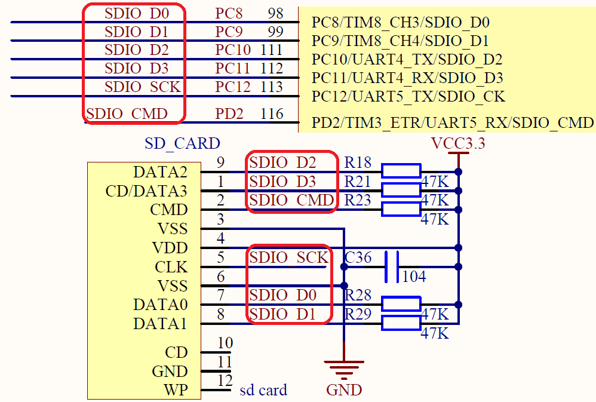
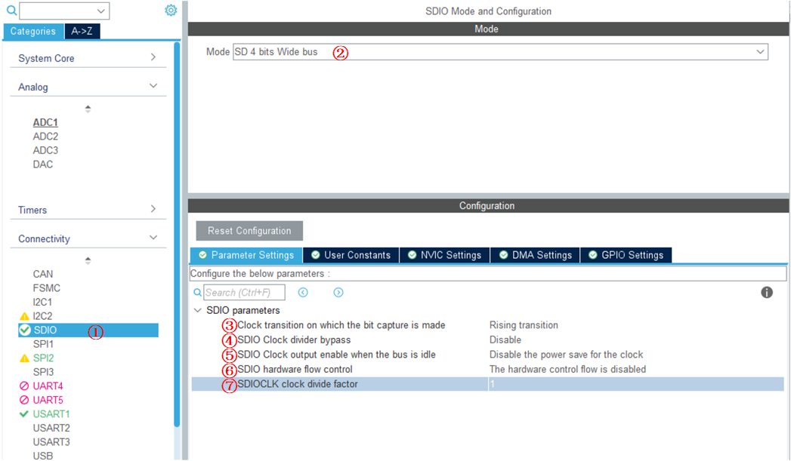
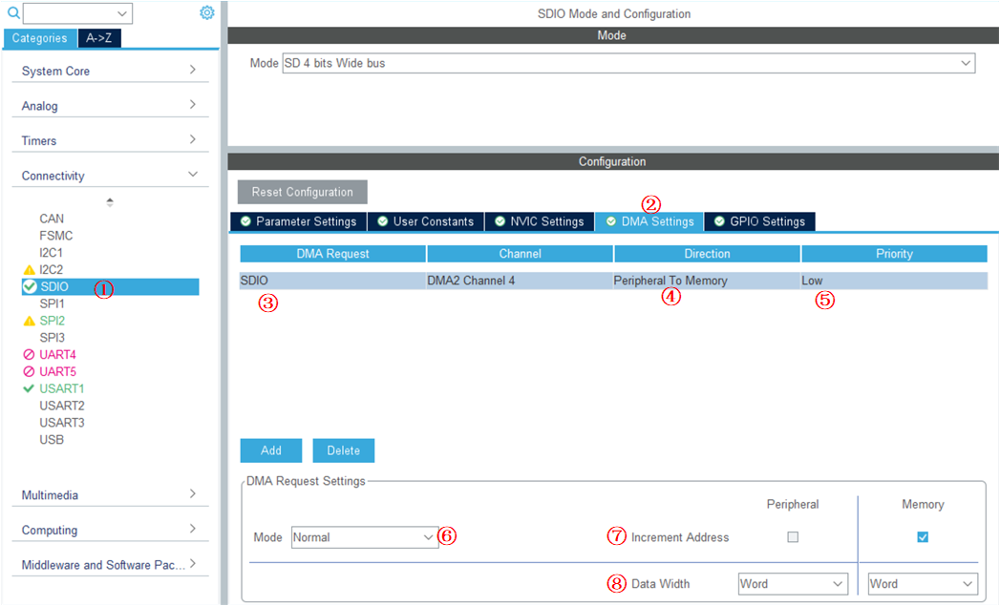
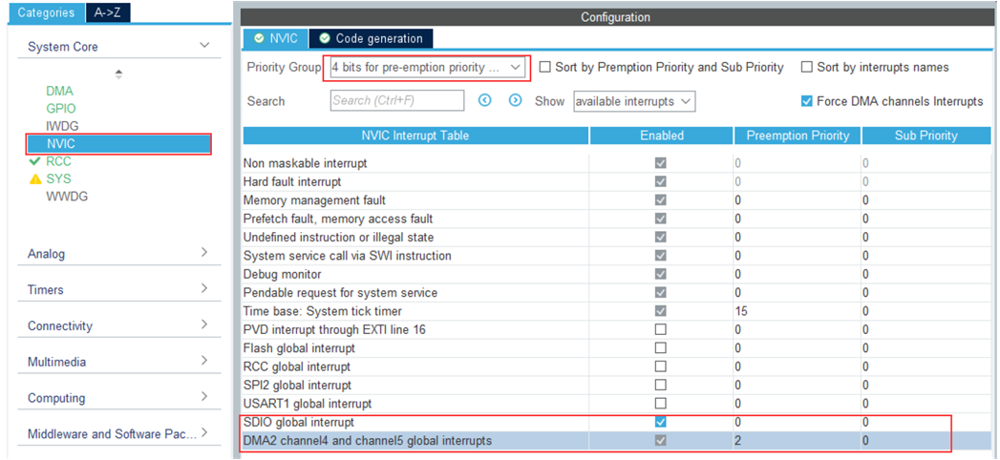
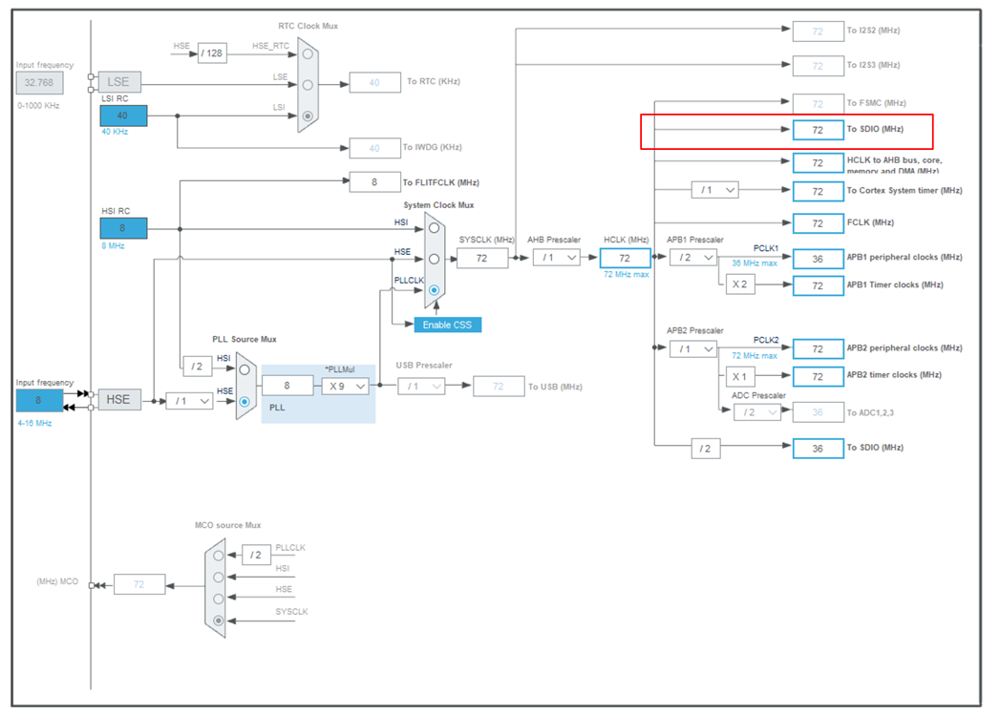
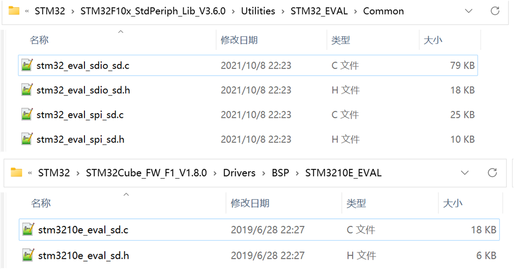
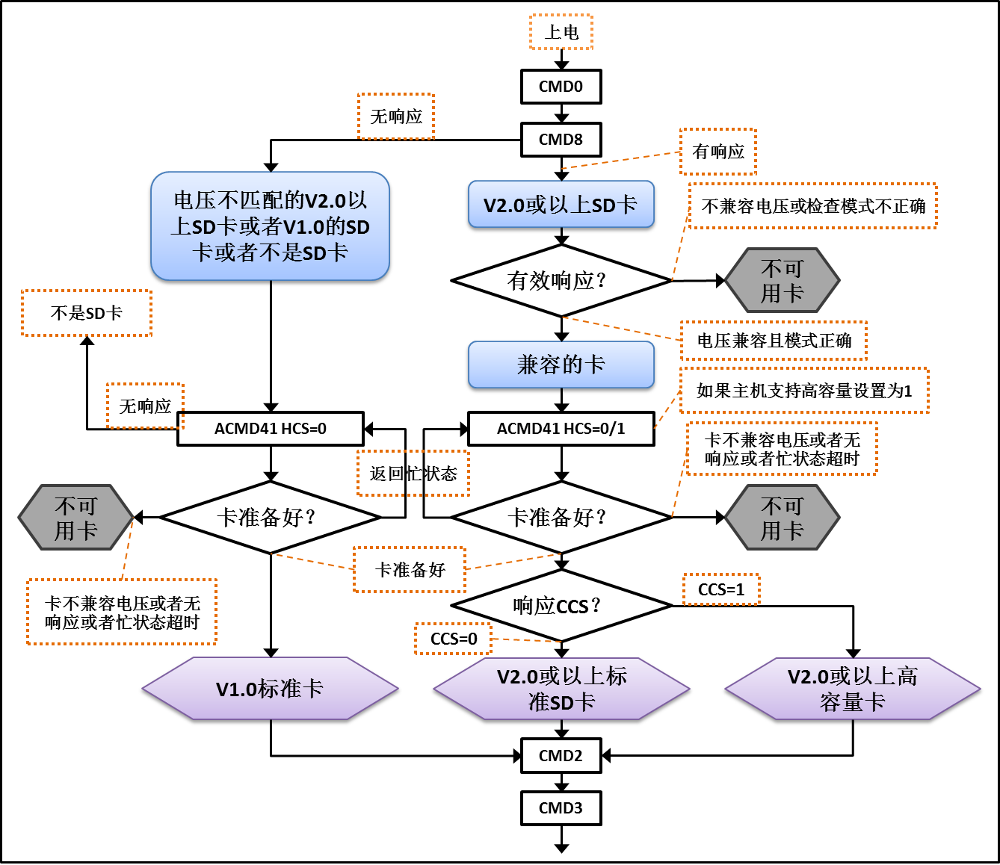

<!-- more -->


## 一、硬件原理图

我使用的是正点原子战舰V3的开发板，硬件连接如下图：



## 二、STM32CubeMX配置

像LED、按键和串口的配置这里就不再赘述，这里只写SDIO相关配置。注意，这一部分中的中断和DMA相关配置是作为笔记写在这里，后边的测试函数并没有使用DMA以及中断相关的内容，都是使用的查询方式，当使用查询方式，但是又开启了DMA以及相关中断的时候，数据读写可能会失败，这里需要注意。

### 1. SDIO参数配置



①、选择SDIO外设；

②、选择模式，这里选择SD 4 bits Wire bus；

③、Clock transition on which the bit capture is made： Rising transition。主时钟 SDIOCLK 产生 CLK 引脚时钟有效沿选择，可选上升沿或下降沿，它设定 SDIO 时钟控制寄存器(SDIO_CLKCR)的 NEGEDGE 位的值，一般选择设置为上升沿。

④、SDIO Clock divider bypass： Disable。时钟分频旁路使用，可选使能或禁用，它设定 SDIO_CLKCR 寄存器的 BYPASS 位。如果使能旁路，SDIOCLK 直接驱动 CLK 线输出时钟；如果禁用，使用 SDIO_CLKCR 寄存器的 CLKDIV 位值分频 SDIOCLK，然后输出到 CLK 线。一般选择禁用时钟分频旁路。

⑤、SDIO Clock output enable when the bus is idle： Disable the power save for the clock。节能模式选择，可选使能或禁用，它设定 SDIO_CLKCR 寄存器的 PWRSAV 位的值。如果使能节能模式，CLK 线只有在总线激活时才有时钟输出；如果禁用节能模式，始终使能 CLK 线输出时钟。

⑥、SDIO hardware flow control： The hardware control flow is disabled。硬件流控制选择，可选使能或禁用，它设定 SDIO_CLKCR 寄存器的 HWFC_EN 位的值。硬件流控制功能可以避免 FIFO 发送上溢和下溢错误。

⑦、SDIOCLK clock divide factor： 1。时钟分频系数，它设定 SDIO_CLKCR 寄存器的 CLKDIV 位的值，设置 SDIOCLK 与 CLK 线输出时钟分频系数

```c
CLK 线时钟频率=SDIOCLK/([CLKDIV+2])
```

SDIO_CK 引脚的时钟信号在卡识别模式时要求不超过 400KHz，而在识别后的数据传输模式时则希望有更高的速度（最大不超过 25MHz），所以会针对这两种模式配置 SDIOCLK 的时钟。这里暂时将SDIOCLK clock divede factor 参数选择为 1，SDIOCLK为72MHz，可以得到最大频率24MHz，但还是要注意，我们使用的SD卡支不支持这么高的一个频率，所以还是要以实际情况而定。

### 2. DMA配置

SDIO 外设支持生成 DMA 请求，使用 DMA 传输可以提高数据传输效率，因此在 SDIO 的控制代码中，可以把它设置为 DMA 传输模式或轮询模式，ST 标准库提供 SDIO 示例中针对这两个模式做了区分处理。应用中一般都使用DMA 传输模式。




①、选择SDIO外设；

②、选择DMA Settings；

③、添加一个DMA请求，选择我们开启的SDIO；

④、Direction：数据传输的方向，这里是外设到内存；

⑤、Priority：当发生多个 DMA 通道请求时，就意味着有先后响应处理的顺序问题，这个就由仲裁器也管理。仲裁器管理 DMA 通道请求分为两个阶段。第一阶段属于软件阶段，可以在 DMA_CCRx 寄存器中设置，有 4 个等级：非常高、高、中和低四个优先级。第二阶段属于硬件阶段，如果两个或以上的 DMA 通道请求设置的优先级一样，则他们优先级取决于通 道编号，编号越低优先权越高，比如通道 0 高于通道 1。在大容量产品和互联型产品中，DMA1 控制器拥有高于 DMA2 控制器的优先级。

⑥、Mode：Normal，表示单次传输，传输一次后终止传输。Circular，表示循环传输，传输完成后又重新开始继续传输，不断循环永不停止。

⑦、Increment Address：Peripheral，表示外设地址自增。Memory，表示内存地址自增。

⑧、Data Width： Byte，一个字节。 Half Word，半个字，等于两字节。 Word，一个字，等于四字节。

### 3. NVIC配置

DMA及SDIO中断这里也进行配置，原则是全局中断优先级高于DMA中断：



### 4. 我的时钟树

我的时钟树配置如下：



## 三、读写SD卡

STM32CubeMX创建的工程会直接帮我们完成一些流程，比如SD卡初始化，读写等。我们其实也可以通过HAL固件库中的例程来学习，例如HAL库和标准库的相关sample路径如下：




### 1. SD卡初始化

#### 1.1 初始化流程



#### 1.2 初始化函数

```c
void MX_SDIO_SD_Init(void)
{
  hsd.Instance = SDIO;
  hsd.Init.ClockEdge = SDIO_CLOCK_EDGE_RISING;
  hsd.Init.ClockBypass = SDIO_CLOCK_BYPASS_DISABLE;
  hsd.Init.ClockPowerSave = SDIO_CLOCK_POWER_SAVE_DISABLE;
  hsd.Init.BusWide = SDIO_BUS_WIDE_1B;
  hsd.Init.HardwareFlowControl = SDIO_HARDWARE_FLOW_CONTROL_ENABLE;
  hsd.Init.ClockDiv = 1;
  if (HAL_SD_Init(&hsd) != HAL_OK)
  {
    Error_Handler();
  }
  if (HAL_SD_ConfigWideBusOperation(&hsd, SDIO_BUS_WIDE_4B) != HAL_OK)
  {
    Error_Handler();
  }
}
```

这里就不往里边深究了，这里有一个坑，需要注意：

（1） BusWide 我们通过STM32CubeMX配置的工程，在开启SDIO的时候选择的 SD 4 bits Wide bus，SDIOCLK clock divide factor选择0的话（此时最高频率为36M了），我们生成的代码为：

```c
// 中间部分省略......
hsd.Init.BusWide = SDIO_BUS_WIDE_4B;//这里需要设置成1位
// 中间部分省略......
hsd.Init.ClockDiv = 0;// 这里至少需要是1
// 中间部分省略......
if (HAL_SD_ConfigWideBusOperation(&hsd, SDIO_BUS_WIDE_4B) != HAL_OK)
{
    Error_Handler();
}
```

这种情况下，直接卡死在初始化函数中，无法运行。其实就 SDIOCLK clock divide factor 一点就把这个代码干掉了，因为选择0的话，分频出来就是72/2=36M，我们使用的卡并不支持这么高频率，所以这里最小要设置为1，但是即便改为1，程序也是无法运行的，依然卡死。这是因为BusWide宽度为4，其实我并没有找到手册中说明在初始化阶段的时候总线宽度必须为1位，但是网上的资料都是1位，而STM32CubeMX软件生成的，这里就被配置成4位，我们改为1位的话，程序就可以正常跑，具体哪里有要求的话，后边发现了再补充。

（2）SDIO的时候选择的 SD 1 bit ，SDIOCLK clock divide factor选择 1 的话，默认生成的代码如下

```c
// 中间部分省略......
hsd.Init.BusWide = SDIO_BUS_WIDE_1B;
// 中间部分省略......
hsd.Init.ClockDiv = 1;
if (HAL_SD_Init(&hsd) != HAL_OK)
{
    Error_Handler();
}
```

这样是没有问题的，程序可以正常执行，后边若是不设置 4 位的话，无非就是传输的慢一些。

#### 1.3 GPIO配置

对于SDIO的引脚的配置在函数 HAL_SD_MspInit 中：

```c
/**SDIO GPIO Configuration
    PC8     ------> SDIO_D0 PC9     ------> SDIO_D1
    PC10    ------> SDIO_D2 PC11    ------> SDIO_D3
    PC12    ------> SDIO_CK PD2     ------> SDIO_CMD
    */
// 开启对应外设的时钟
__HAL_RCC_SDIO_CLK_ENABLE();
__HAL_RCC_GPIOC_CLK_ENABLE();
__HAL_RCC_GPIOD_CLK_ENABLE();

// 引脚配置
GPIO_InitStruct.Pin = GPIO_PIN_8|GPIO_PIN_9|GPIO_PIN_10|GPIO_PIN_11|GPIO_PIN_12;
GPIO_InitStruct.Mode = GPIO_MODE_AF_PP;
GPIO_InitStruct.Speed = GPIO_SPEED_FREQ_HIGH;
HAL_GPIO_Init(GPIOC, &GPIO_InitStruct);

GPIO_InitStruct.Pin = GPIO_PIN_2;
GPIO_InitStruct.Mode = GPIO_MODE_AF_PP;
GPIO_InitStruct.Speed = GPIO_SPEED_FREQ_HIGH;
HAL_GPIO_Init(GPIOD, &GPIO_InitStruct);
```

#### 1.4 DMA配置

我们在配置工程的时候是选择了DMA传输的，DMA的相关配置也在函数 HAL_SD_MspInit 中：

```c
/* SDIO DMA Init */
hdma_sdio.Instance = DMA2_Channel4;
hdma_sdio.Init.Direction = DMA_PERIPH_TO_MEMORY;
hdma_sdio.Init.PeriphInc = DMA_PINC_DISABLE;
hdma_sdio.Init.MemInc = DMA_MINC_ENABLE;
hdma_sdio.Init.PeriphDataAlignment = DMA_PDATAALIGN_WORD;
hdma_sdio.Init.MemDataAlignment = DMA_MDATAALIGN_WORD;
hdma_sdio.Init.Mode = DMA_NORMAL;
hdma_sdio.Init.Priority = DMA_PRIORITY_LOW;
if (HAL_DMA_Init(&hdma_sdio) != HAL_OK)
{
    Error_Handler();
}

/* Several peripheral DMA handle pointers point to the same DMA handle.
     Be aware that there is only one channel to perform all the requested DMAs. */
/* Be sure to change transfer direction before calling
     HAL_SD_ReadBlocks_DMA or HAL_SD_WriteBlocks_DMA. */
__HAL_LINKDMA(sdHandle,hdmarx,hdma_sdio);
__HAL_LINKDMA(sdHandle,hdmatx,hdma_sdio);
```

每一行什么意思，可以看前边DMA传输的笔记，这里就不再赘述了。

#### 1.5 NVIC配置

NVIC的配置也写在函数 HAL_SD_MspInit 中了：

```c
HAL_NVIC_SetPriority(SDIO_IRQn, 0, 0);
HAL_NVIC_EnableIRQ(SDIO_IRQn);
```

这里我们看到主要是配置了SDIO的中。那DMA的中断去哪了？在哪设置的？我们前边也开了啊。在这里：

```c
void MX_DMA_Init(void)
{

  /* DMA controller clock enable */
  __HAL_RCC_DMA2_CLK_ENABLE();

  /* DMA interrupt init */
  /* DMA2_Channel4_5_IRQn interrupt configuration */
  HAL_NVIC_SetPriority(DMA2_Channel4_5_IRQn, 2, 0);
  HAL_NVIC_EnableIRQ(DMA2_Channel4_5_IRQn);

}
```

DMA的初始化中，开启了DMA的时钟和中断，在SD卡初始化的时候是对DMA做了配置，在SD卡初始化流程前已经做了DMA的初始化啦。

### 2. 获取SD卡状态

#### 2.1 HAL库函数获取SD卡状态

初始化结束后，我们可以判断一下SD卡是否处于数据传输的状态：

```c
HAL_SD_CardStateTypeDef HAL_SD_GetCardState(SD_HandleTypeDef *hsd)
{
  HAL_SD_CardStateTypeDef cardstate =  HAL_SD_CARD_TRANSFER;
  uint32_t errorstate = HAL_SD_ERROR_NONE;
  uint32_t resp1 = 0;
  
  errorstate = SD_SendStatus(hsd, &resp1);
  if(errorstate != HAL_OK)
  {
    hsd->ErrorCode |= errorstate;
  }

  cardstate = (HAL_SD_CardStateTypeDef)((resp1 >> 9U) & 0x0FU);
  
  return cardstate;
}
```

SD卡的状态定义如下：

```c
typedef enum
{
  HAL_SD_CARD_READY                  = 0x00000001U,  /*!< Card state is ready                     */
  HAL_SD_CARD_IDENTIFICATION         = 0x00000002U,  /*!< Card is in identification state         */
  HAL_SD_CARD_STANDBY                = 0x00000003U,  /*!< Card is in standby state                */
  HAL_SD_CARD_TRANSFER               = 0x00000004U,  /*!< Card is in transfer state               */  
  HAL_SD_CARD_SENDING                = 0x00000005U,  /*!< Card is sending an operation            */
  HAL_SD_CARD_RECEIVING              = 0x00000006U,  /*!< Card is receiving operation information */
  HAL_SD_CARD_PROGRAMMING            = 0x00000007U,  /*!< Card is in programming state            */
  HAL_SD_CARD_DISCONNECTED           = 0x00000008U,  /*!< Card is disconnected                    */
  HAL_SD_CARD_ERROR                  = 0x000000FFU   /*!< Card response Error                     */
}HAL_SD_CardStateTypeDef;
```

#### 2.2 我们自己封装一个

有时候我们其实并不需要这么多状态，我们可以封装一层，用与读写SD卡。

```c
// 需要定义两个宏
#define SD_TRANSFER_OK     	((uint8_t)0x00)
#define SD_TRANSFER_BUSY   	((uint8_t)0x01) 

//判断SD卡是否可以传输(读写)数据
//返回值:SD_TRANSFER_OK   传输完成，可以继续下一次传输
//		SD_TRANSFER_BUSY SD卡正忙，不可以进行下一次传输
uint8_t SD_GetCardState(void)
{
	return((HAL_SD_GetCardState(&hsd)==HAL_SD_CARD_TRANSFER )?SD_TRANSFER_OK:SD_TRANSFER_BUSY);
}
```

### 3. 显示SD卡信息

```c
//通过串口打印SD卡相关信息
void show_sdcard_info(void)
{
	uint64_t CardCap;	//SD卡容量
	HAL_SD_CardCIDTypeDef SDCard_CID;
	HAL_SD_CardInfoTypeDef  SDCardInfo;     //SD卡信息结构体

	/* 检测SD卡是否正常（处于数据传输模式的传输状态） */
    if(HAL_SD_GetCardState(&hsd) != HAL_SD_CARD_TRANSFER)
    {
        printf("SD card init fail!\r\n" );
		return;
    }
	printf("Initialize SD card successfully!\r\n");
	HAL_SD_GetCardCID(&hsd, &SDCard_CID);	//获取CID
	HAL_SD_GetCardInfo(&hsd, &SDCardInfo);  //获取SD卡信息
	switch(SDCardInfo.CardType)
	{
		case CARD_SDSC:
		{
			if(SDCardInfo.CardVersion == CARD_V1_X)
				printf("Card Type          :SDSC V1 \r\n");
			else if(SDCardInfo.CardVersion == CARD_V2_X)
				printf("Card Type          :SDSC V2 \r\n");
		}
		break;
		case CARD_SDHC_SDXC:
			printf("Card Type          :SDHC \r\n");
		break;
	}	
	CardCap=(uint64_t)(SDCardInfo.LogBlockNbr)*(uint64_t)(SDCardInfo.LogBlockSize);	//计算SD卡容量
  	printf("Card ManufacturerID:%d \r\n",SDCard_CID.ManufacturerID);				//制造商ID
 	printf("Card RCA           :%d \r\n",SDCardInfo.RelCardAdd);					//卡相对地址
	printf("LogBlockNbr        :%d \r\n",(uint32_t)(SDCardInfo.LogBlockNbr));		//显示逻辑块数量
	printf("LogBlockSize       :%d \r\n",(uint32_t)(SDCardInfo.LogBlockSize));		//显示逻辑块大小
	printf("Card Capacity      :%d MB\r\n",(uint32_t)(CardCap>>20));				//显示容量
 	printf("Card BlockSize     :%d \r\n\r\n",SDCardInfo.BlockSize);					//显示块大小
}
```

### 4. 数据操作

SD 卡数据操作一般包括数据读取、数据写入以及存储区擦除。数据读取和写入都可以分为单块操作和多块操作。  

#### 4.1 擦除函数

```c
/**
  * @brief  Erases the specified memory area of the given SD card.
  * @note   This API should be followed by a check on the card state through
  *         HAL_SD_GetCardState().
  * @param  hsd: Pointer to SD handle
  * @param  BlockStartAdd: Start Block address
  * @param  BlockEndAdd: End Block address
  * @retval HAL status
  */
HAL_StatusTypeDef HAL_SD_Erase(SD_HandleTypeDef *hsd, uint32_t BlockStartAdd, uint32_t BlockEndAdd);
```

函数比较长，这里就不全贴了，额，看了一下，我对寄存器也不是很熟，这个里边有一些没搞懂，知道这有个函数，知道怎么用就算了，后边有必要相惜学习的话，再补充。

#### 4.2 开关中断函数

后边我们读写的时候，若是采取查询方式，需要关闭总中断，读写完成后再打开。

- 开关中断定义

```c
//关闭所有中断
void INTX_DISABLE(void)
{		  
	__ASM volatile("cpsid i");
}
//开启所有中断
void INTX_ENABLE(void)
{
	__ASM volatile("cpsie i");		  
}
```

- 超时时间的宏

```c
#define SD_TIMEOUT 			((uint32_t)100000000)  	//超时时间
```


#### 4.3 数据写入操作

数据写入可分为单块数据写入和多块数据写入，这里只分析单块数据写入，多块的与之类似。 SD卡数据写入之前并没有硬性要求擦除写入块，这与 SPI Flash 芯片写入是不同的。 ST 官方的 SD卡写入函数包括扫描查询方式和 DMA 传输方式，都有分别对应的函数，这里先用查询方式。  

##### 4.3.1 查询方式

```c
HAL_StatusTypeDef HAL_SD_WriteBlocks(SD_HandleTypeDef *hsd, uint8_t *pData, uint32_t BlockAdd, uint32_t NumberOfBlocks, uint32_t Timeout);
```

我们来写一个写入数据的函数：

```c
uint8_t SD_WriteDisk(uint8_t *buf, uint32_t sector, uint32_t cnt)
{   
    uint8_t sta=HAL_OK;
	uint32_t timeout=SD_TIMEOUT;
	long long lsector=sector;
    INTX_DISABLE();//关闭总中断(POLLING模式,严禁中断打断SDIO读写操作!!!)
	sta=HAL_SD_WriteBlocks(&hsd,(uint8_t*)buf,lsector,cnt,SD_TIMEOUT);//多个sector的写操作

	//等待SD卡写完
	while(HAL_SD_GetCardState(&hsd) != HAL_SD_CARD_TRANSFER)
    {
		if(timeout-- == 0)
		{	
			sta=SD_TRANSFER_BUSY;
		}
    }    
	INTX_ENABLE();//开启总中断
    return sta;
}
```

##### 4.3.2 DMA方式

注意：STM32F103的SDIO DMA每次由读数据变为写数据或者由写数据变为读数据时，都需要重新初始化DMA（主要是为了更改数据传输的方向）。

```c
HAL_StatusTypeDef HAL_SD_WriteBlocks_DMA(SD_HandleTypeDef *hsd, uint8_t *pData, uint32_t BlockAdd, uint32_t NumberOfBlocks);
```

我们这个就可以参考HAL库文件中给我们提供的参考例程啦，参考文件路径如下：

```c
STM32Cube_FW_F1_V1.8.0/Drivers/BSP/STM3210E_EVAL/stm3210e_eval_sd.c
STM32Cube_FW_F1_V1.8.0/Drivers/BSP/STM3210E_EVAL/stm3210e_eval_sd.h
```

这个还需要移植，暂时先搁置，后边有需要再补充。

#### 4.4 数据读取操作

同向 SD 卡写入数据类似，从 SD 卡读取数据可分为单块读取和多块读取。 

##### 4.4.1 查询方式

```c
HAL_StatusTypeDef HAL_SD_ReadBlocks(SD_HandleTypeDef *hsd, uint8_t *pData, uint32_t BlockAdd, uint32_t NumberOfBlocks, uint32_t Timeout);
```

我们封装一下：

```c
uint8_t SD_ReadDisk(uint8_t* buf,uint32_t sector,uint32_t cnt)
{
    uint8_t sta=HAL_OK;
	uint32_t timeout=SD_TIMEOUT;
	long long lsector=sector;
    INTX_DISABLE();//关闭总中断(POLLING模式,严禁中断打断SDIO读写操作!!!)
	sta=HAL_SD_ReadBlocks(&hsd, (uint8_t*)buf,lsector,cnt,SD_TIMEOUT);//多个sector的读操作
	
	//等待SD卡读完
	while(SD_GetCardState()!=SD_TRANSFER_OK)
    {
		if(timeout-- == 0)
		{	
			sta=SD_TRANSFER_BUSY;
		}
    }
    INTX_ENABLE();//开启总中断
    return sta;
}
```

##### 4.4.2 DMA方式

注意：STM32F103的SDIO DMA每次由读数据变为写数据或者由写数据变为读数据时，都需要重新初始化DMA（主要是为了更改数据传输的方向）。

```c
HAL_StatusTypeDef HAL_SD_ReadeBlocks_DMA(SD_HandleTypeDef *hsd, uint8_t *pData, uint32_t BlockAdd, uint32_t NumberOfBlocks);
```

我们这个就可以参考HAL库文件中给我们提供的参考例程啦，参考文件路径如下：

```c
STM32Cube_FW_F1_V1.8.0/Drivers/BSP/STM3210E_EVAL/stm3210e_eval_sd.c
STM32Cube_FW_F1_V1.8.0/Drivers/BSP/STM3210E_EVAL/stm3210e_eval_sd.h
```

这个还需要移植，暂时先搁置，后边有需要再补充。

### 5. 测试函数

注意：由于上边我开启了SDIO中断和DMA中断，但是最后却又使用了查询的方式去读写数据，所以会出现读写失败的情况，当我关掉SDIO中断和DMA中断后，恢复正常。

#### 5.1 相关宏和变量定义

```c
#define BLOCK_START_ADDR         0     /* Block start address      */
#define NUM_OF_BLOCKS            5   /* Total number of blocks   */
#define BUFFER_WORDS_SIZE        ((BLOCKSIZE * NUM_OF_BLOCKS) >> 2) /* Total data size in bytes */
 
uint32_t aTxBuffer[BUFFER_WORDS_SIZE];
uint32_t aRxBuffer[BUFFER_WORDS_SIZE];
```

#### 5.2 读数据测试函数

```c
//测试SD卡的读取，从secaddr地址开始,读取seccnt个扇区的数据
//secaddr:扇区地址
//seccnt :扇区数
void sd_test_read(uint32_t secaddr, uint32_t seccnt)
{
	uint32_t i; 
	uint8_t sta = 0;
	sta=SD_ReadDisk(aRxBuffer, secaddr, seccnt);//读取secaddr扇区开始的内容
	if(sta==0)						
	{	 
		printf("SECTOR %d DATA:\r\n", secaddr);
		for(i=0;i<seccnt*512;i++)
            printf("%#x ", aRxBuffer[i]);//打印secaddr开始的扇区数据    	   
		printf("\r\nDATA ENDED\r\n"); 
	}
	else 
		printf("read rest err:%d\r\n",sta);   
}
```

#### 5.3 写数据测试函数

```c
//测试SD卡的写入(慎用,最好写全是0XFF的扇区,否则可能损坏SD卡.)，从secaddr地址开始,写入seccnt个扇区的数据
//secaddr:扇区地址
//seccnt:扇区数
void sd_test_write(uint32_t secaddr,uint32_t seccnt)
{
	uint32_t i;
	uint8_t sta=0; 
	for(i=0;i<seccnt*512;i++) 
		aTxBuffer[i]=i*3; 	//初始化写入的数据,是3的倍数.
	sta=SD_WriteDisk(aTxBuffer, secaddr, seccnt);	//从secaddr扇区开始写入seccnt个扇区内容
	if(sta==0) 
		printf("Write over!\r\n");		  
	else 
		printf("write test err:%d\r\n",sta);
}
```

#### 5.4 测试函数

```c
void SD_Test(void)
{
	#if 0
	if(HAL_SD_Erase(&hsd, 0, 512) != HAL_OK)
	{
		printf("HAL_SD_Erase failed!!!\r\n");
	}
	else
		printf("HAL_SD_Erase success!!!\r\n");
	#endif
	sd_test_write(0, 1);
	sd_test_read(0, 1);
}
```

### 6. 踩的几个坑

#### 6.1 时钟问题

初始化的时候，时钟分频设置为1，发现写入总是失败，后来加大，改为4正常，这说明我使用的SD卡并不支持24Mz，，所以有的时候若是写入总是失败的话，可以考虑降低SDIO时钟。

#### 6.2 擦除问题

很奇怪，我擦除后直接写入的话，写不进去，写入操作是失败的，但是擦除是成功的，而且读取擦除的扇区的数据为全0，当关闭擦除部分代码的时候，重新烧写，是可以重新写入成功的，其实有些SD卡是不需要擦除的，因为SD卡内部控制器会帮我们做这件事，等后边找到详细说明了再补充。
