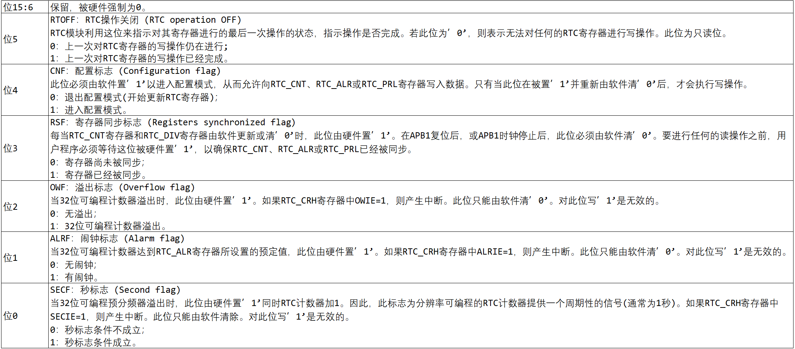

<!-- more -->


## 一、RTC简介

实时时钟（ Real Time Clock， RTC）， 是一个可以不使用系统主电源供电的定时器。在系统主电源断开的情况下，依靠纽扣电池供电继续计时，可以维持几个月到几年的持续工作。在系统恢复主电源工作时， 为系统提供日历、时间信息。


比如台式电脑主机， 必须接电源才能工作， 此时可以正常显示当前日期、时间。电脑关机一段时间后，重新开机，系统没有联网，也能正确显示当前日期、时间。 电脑主机里面也有一颗纽扣电池，在主电源断开时，为主板上的RTC模块供电，记录时间，开机后提供给系统。

RTC通常有两种， 一种是外部时钟芯片提供实时时钟，比如DS1302时钟芯片； 另一种是MCU内部集成RTC模块。 STM32F103内部就集成了RTC模块，可以通过配置相应的寄存器来实现实时时钟的功能。


| 对比因素 | 内部RTC          | 外置RTC          |
| -------- | ---------------- | ---------------- |
| 信息差异 | 提供秒/亚秒信号  | 提供秒信号和日历 |
| 功耗     | 功耗高           | 功耗低           |
| 体积     | 不用占用额外体积 | 体积大           |
| 成本     | 成本低           | 成本高           |

## 二、STM32的RTC

### 1. 简介

STM32 的 RTC 外设（Real Time Clock），实质是一个 掉电后还继续运行的定时器。从定时器的角度来说，相对于通用定时器 TIM 外设，它十分简单，只有很纯粹的计时和触发中断的功能；但从掉电还继续运行的角度来说，它却是 STM32 中唯一一个具有如此强大功能的外设。所以 RTC外设的复杂之处并不在于它的定时功能，而在于它掉电还继续运行的特性。  

以上所说的掉电，是指主电源 VDD 断开的情况，为了 RTC 外设掉电继续运行，必须接上锂电池给 STM32 的 RTC、备份发卡通过 VBAT 引脚供电。当主电源 VDD 有效时，由 VDD 给 RTC 外设供电；而当 VDD 掉电后，由 VBAT 给 RTC 外设供电。但无论由什么电源供电， RTC 中的数据都保存在属于 RTC 的备份域中，若主电源 VDD 和 VBAT 都掉电，那么备份域中保存的所有数据将丢失。备份域除了 RTC 模块的寄存器，还有 42 个 16 位的寄存器可以在 VDD 掉电的情况下保存用户程序的数据，系统复位或电源复位时，这些数据也不会被复位。

从 RTC 的定时器特性来说，它是一个 32 位的计数器，只能向上计数。它使用的时钟源有三种，分别为高速外部时钟的 128 分频（HSE/128）、低速内部时钟 LSI 以及低速外部时钟 LSE；使 HSE分频时钟或 LSI 的话，在主电源 VDD 掉电的情况下，这两个时钟来源都会受到影响，因此没法保证 RTC 正常工作。因此**RTC 一般使用低速外部时钟 LSE**，在设计中，频率通常为实时时钟模块中常用的 32.768KHz，这是因为 32768 = 215，分频容易实现，所以它被广泛应用到 RTC 模块。在主电源 VDD 有效的情况下 (待机)， RTC 还可以配置闹钟事件使 STM32 退出待机模式。  


### 2. RTC外设框图

我们来看一下STM32的RTC外设的框图，可以看 [STM32中文参考手册](https://www.stmcu.com.cn/Designresource/detail/localization_document%20/710001)的16.3.1 概述一节：


上图为为RTC简化结构，可以分为两部分， 位于后备供电区域的RTC核心接口（灰色） 和APB1接口。RTC核心接口部分掉电时可在VBAT供电时正常工作，该部分的所有寄存器都为16位，两个16位再组成一个32位RTC寄存器。   

①、 RTC预分频器： RTCCLK来自LSE，为32.768KHz。 RTC\_PRL预分频装载寄存器，将RTCCLK分频为TR\_CLK提供给RTC\_CNT，分频计算公式为：  

```c
fTR_CLK = fRTCCLK/(PRL[19:0]+1)
```

通常将PRL\[19:0\]设置为32767，这样fTR\_CLK=1Hz，即1秒计数一次。  注：不推荐使用0值，否则无法正确的产生RTC中断和标志位。RTC\_DIV预分频余数寄存器， 是一个只读寄存器， 它用于对RTCCLK计数。假设RTC_PRL为32767，首先将该值重装载到RTC\_DIV， RTCCLK上升沿每发生一次， RTC\_DIV值减1，直到减到0， 也就是32768分频，输出TR\_CLK，时间刚好为1s，然后再重装载RTC\_DIV，如此反复。 通过读取RTC\_DIV值，也就可以获知经历了多少1/32768秒，得到更小的时间段。

如果在RTC_CR寄存器中使能了SECIE位（ Second interrupt enable） ， 则每个TR\_CLK周期RTC会产生一个中断。 通常TR\_CLK周期为1秒，因此该中断也被称为秒中断。    

②、32位可编程计数器： RTC_CNT是一个32位可编程的向上计数器，使用TR_CLK为基准进行计数， 计数满后，产生溢出标志位。 从图中可以看到该事件没有连接到中断控制器，也就无法配置为中断信号， 估计原因是当RTC\_CLK周期为1秒，计数器从0溢出到0xFFFFFFFF，需要4294967295/60/60/24/365=136年， 不至于运行个程序， 136年后产生一次中断。如果需要某一时间产生中断， 可以设置RTC闹钟寄存器RTC\_ALR，系统时间按 TR\_CLK 周期累加并与存储在RTC\_ALR 寄存器中的可编程时间相比较，如果 RTC\_CR 控制寄存器中设置了相应允许位，比较匹配时将产生一个闹钟中断。  

③、待机唤醒： 前边学习电源管理的时候有提到，待机模式唤醒的方式有四种，其中就有RTC闹钟唤醒。当RTC闹钟发生时， 可以实现退出待机模式。  

④、RTC控制寄存器： MCU通过APB1总线与APB1接口的RTC控制寄存器RTC_CR进行通信。当系统电源掉电时， APB1接口停止工作，重新上电后， APB1接口和RTC后备供电区域的寄存器可能存在时钟不同步，因此**读写RTC相寄存器前，必须先检查TRC_CR中的寄存器同步标志位RSF**（ Registers synchronized flag） ,确保该位置1，即RTC核心与APB1时钟同步。 以下两种情况，可能会导致时钟不同步：  

- 发生系统复位或电源复位；

- 从待机模式或停机模式唤醒；  

### 3. RTC寄存器访问

由于备份域的存在，使得 RTC 核具有了完全独立于 APB1 接口的特性，而我们写的软件是通过 APB1 接口访问 RTC 的预分频值、计数器值和闹钟值的，因此对 RTC 寄存器的访问要遵守一定的规则。 系统复位后，默认禁止访问后备寄存器和 RTC，防止对后备区域 (BKP) 的意外写操作。执行以下操作使能对后备寄存器和 RTC 的访问：  

(1) 设置 RCC_APB1ENR 寄存器的 PWREN 和 BKPEN 位来使能电源和后备接口时钟。

(2) 设置 PWR_CR 寄存器的 DBP 位使能对后备寄存器和 RTC 的访问。  

设置后备寄存器为可访问后，在第一次通过 APB1 接口访问 RTC 时，因为时钟频率的差异，所以必须**等待 APB1 与 RTC 外设同步**，确保被读取出来的 RTC 寄存器值是正确的。相关寄存器只在 RTC APB1 时钟进行重新同步的 RTC 时钟的上升沿被更新， RTC 标志也是如此。这就意味着，如果 APB1 接口刚刚被开启之后，在第一次的内部寄存器更新之前，从 APB1 上读取的 RTC 寄存器值可能被破坏了（通常读到 0）。因此，若在读取 RTC 寄存器曾经被禁止的 RTC APB1 接口前，软件首先必须等待 RTC_CRL 寄存器的 RSF位（寄存器同步标志位， bit3）被硬件置 1。  

若在同步之后，一直没有关闭 APB1 的 RTC 外设接口，就不需要再次同步了。如果内核要对 RTC 寄存器进行任何的写操作，在内核发出写指令后， RTC 模块在 3 个 RTCCLK时钟之后，才开始正式的写 RTC 寄存器操作。由于 RTCCLK 的频率比内核主频低得多，所以每次操作后必须要检查 RTC 关闭操作标志位 RTOFF，当这个标志被置 1 时，写操作才正式完成。  

## 三、UNIX 时间戳  

如果从现在起，把计数器 RTC_CNT 的计数值置 0，然后每秒加 1， RTC_CNT 什么时候会溢出呢？由于 RTC_CNT 是 32 位寄存器，可存储的最大值为 (2^32-1)，即这样计时的话，在 2^32 秒后溢出，即它将在今后的 136 年时溢出：

```c
N = 232/365/24/60/60 ≈136 年
```

假如某个时刻读取到计数器的数值为 X = 60\*60\*24\*2，即两天时间的秒数，而假设又知道计数器是在 2011 年 1 月 1 日的 0 时 0 分 0 秒置 0 的，那么就可以根据计数器的这个相对时间数值，计算得这个 X 时刻是 2011 年 1 月 3 日的 0 时 0 分 0 秒了。而计数器则会在 (2011+136) 年左右溢出，也就是说到了（2011+136）年时，如果我们还在使用这个计数器提供时间的话就会出现问题。

在这个例子中，定时器被置 0 的这个时间被称为计时元年，相对计时元年经过的秒数称为时间戳，也就是计数器中的值。大多数操作系统都是利用时间戳和计时元年来计算当前时间的，而这个时间戳和计时元年大家都取了同一个标准——UNIX 时间戳和 UNIX 计时元年。 UNIX 计时元年被设置为格林威治时间 1970年 1 月 1 日 0 时 0 分 0 秒，大概是为了纪念 UNIX 的诞生的时代吧，而 UNIX 时间戳即为当前时间相对于 UNIX 计时元年经过的秒数。因为 unix 时间戳主要用来表示当前时间或者和电脑有关的日志时间（如文件创立时间， log 发生时间等），考虑到所有电脑文件不可能在 1970 年前创立，所以用 unix 时间戳很少用来表示 1970 前的时间。

在这个计时系统中，使用的是有符号的 32 位整型变量来保存 UNIX 时间戳的，即实际可用计数位数比我们上面例子中的少了一位，少了这一位， UNIX 计时元年也相对提前了，这个计时方法在 2038 年 1 月 19 日 03 时 14 分 07 秒将会发生溢出，这个时间离我们并不远。由于 UNIX 时间戳被广泛应用到各种系统中，溢出可能会导致系统发生严重错误，届时，很可能会重演一次“千年虫”的问题，所以在设计预期寿命较长的设备需要注意。  

## 四、相关寄存器

### 1. RTC寄存器

#### 1.1 RTC控制寄存器高位(RTC_CRH) 


这个寄存器主要是控制相关的中断。复位值为0，置1可开启相关中断。比如要用到秒钟中断，所以就需要在该寄存器必须设置最低位为 1，以允许秒钟中断。  

#### 1.2 RTC控制寄存器低位(RTC_CRL)




（1）第 0 位是秒钟标志位，我们在进入闹钟中断的时候，通过判断这位来决定是不是发生了秒钟中断。然后必须通过软件将该位清零（写0）。

（2）第 3 位为寄存器同步标志位，我们在修改控制寄存器 RTC_CRH/CRL 之前，必须先判断该位，是否已经同步了，如果没有则等待同步，在没同步的情况下修改 RTC_CRH/CRL 的值是不行的。

（3）第 4 位为配置标位，在软件修改 RTC_CNT/RTC_ALR/RTC_PRL 的值的时候，必须先软件置位该位，以允许进入配置模式。第 5 位为 RTC 操作位，该位由硬件操作，软件只读。通过该位可以判断上次对 RTC 寄存器的操作是否完成，如果没有，我们必须等待上一次操作结束才能开始下一次操作。  

【注意】

①、修改CRH/CRL寄存器，必须先判断RSF位，确定已经同步。

②、修改CNT,ALR,PRL的时候，必须先配置CNF位进入配置模式，修改完之后，设置CNF位为0退出配置模式

③、同时在对RTC相关寄存器写操作之前，必须判断上一次写操作已经结束，也就是判断RTOFF位是否置位。

#### 1.3 RTC预分频装载寄存器(RTC_PRLH、RTC_PRLL) 


RTC 预分频装载寄存器，有 2 个寄存器组成， RTC_PRLH 和RTC_PRLL。这两个寄存器用来配置 RTC 时钟的分频数的，比如我们使用外部 32.768K 的晶振作为时钟的输入频率，那么我们要设置这两个寄存器的值为 32767，以得到一秒钟的计数频率。  

RTC_PRLH 只有低四位有效，用来存储 PRL 的 19~16 位。而 PRL的前 16 位，存放在 RTC_PRLL 里。

#### 1.4 RTC预分频器余数寄存器(RTC_DIVH、RTC_DIVL)   


该寄存器也有 2 个寄存器组成 RTC_DIVH 和 RTC_DIVL，这两个寄存器的作用就是用来获得比秒钟更为准确的时钟，比如可以得到 0.1 秒，或者 0.01 秒等。该寄存器的值自减的，用于保存还需要多少时钟周期获得一个秒信号。在一次秒钟更新后，由硬件重新装载。  

#### 1.5 RTC计数器寄存器 (RTC_CNTH、RTC_CNTL) 


RTC 闹钟寄存器，也是由 2 个 16 为的寄存器组成 RTC_ALRH 和 RTC_ALRL。总共也是 32 位，用来标记闹钟产生的时间（以秒为单位），如果 RTC_CNT 的值与 RTC_ALR 的值相等，并使能了中断的话，会产生一个闹钟中断。该寄存器的修改也要进入配置模式才能进行。  

### 2. BKP寄存器

我们使用到备份寄存器来存储 RTC 的相关信息（我们这里主要用来标记时钟是否已经经过了配置）。备份寄存器是 42 个 16 位的寄存器（战舰开发板就是大容量的），可用来存储 84 个字节的用户应用程序数据。他们处在备份域里，当 VDD 电源被切断，他们仍然由 VBAT 维持供电。即使系统在待机模式下被唤醒，或系统复位或电源复位时，他们也不会被复位。此外， BKP 控制寄存器用来管理侵入检测和 RTC 校准功能。 

我们一般用 BKP 来存储 RTC 的校验值或者记录一些重要的数据，相当于一个 EEPROM，不过这个 EEPROM 并不是真正的 EEPROM，而是需要电池来维持它的数据。    

#### 2.1 备份域控制寄存器 (RCC_BDCR) 

这个寄存器好像是属于RCC模块的，我们可以参考 [STM32中文参考手册](https://www.stmcu.com.cn/Designresource/detail/localization_document%20/710001)的6.3.9 备份域控制寄存器 (RCC_BDCR)


RTC 的时钟源选择及使能设置都是通过这个寄存器来实现的，所以我们在 RTC 操作之前先要通过这个寄存器选择 RTC 的时钟源，然后才能开始其他的操作。  

#### 2.2 RTC时钟校准寄存器(BKP_RTCCR) 


#### 2.3 备份数据寄存器x(BKP_DRx) (x = 1 … 10) 


## 五、HAL库函数

### 1. 初始化结构体  

```c
/**
  * @brief  RTC Configuration Structure definition
  */
typedef struct
{
  uint32_t AsynchPrediv; /* 配置 RTC_CLK 的异步分频因子（0x00~0x7F ) */
  uint32_t OutPut;       /* 指定哪一路信号作为 RTC 的输出 */
} RTC_InitTypeDef;
```

（1）AsynchPrediv： RTC_CLK 异步分频因子设置， 7 位有效，具体由 RTC 预分频器寄存器RTC_PRER 的 PREDIV_A[6:0] 位配置。

（2）OutPut： RTCEx输出通道设置，可以是RTC_OUTPUT_DISABLE禁止输出、RTC_OUTPUT_ALARMA闹钟A输出、RTC_OUTPUT_ALARMB闹钟B输出、RTC_OUTPUT_WAKEUP 唤醒输出。  

### 2. 时间和日期结构体

#### 2.1 时间结构体

RTC 时间初始化结构体用来设置初始时间，配置的是 RTC 时间寄存器 RTC_TR。  

```c
/**
  * @brief  RTC Time structure definition
  */
typedef struct
{
  uint8_t Hours;
  uint8_t Minutes;
  uint8_t Seconds;
} RTC_TimeTypeDef;
```

（1）Hours：小时设置， 12 小时制式时，取值范围为 0~11， 24 小时制式时，取值范围为 0~23。

（2）Minutes：分钟设置，取值范围为 0~59。

（3）Seconds：秒钟设置，取值范围为 0~59。  

#### 2.2 日期结构体

RTC 日期初始化结构体用来设置初始日期，配置的是 RTC 日期寄存器 RTC_DR。  

```c
/**
  * @brief  RTC Date structure definition
  */
typedef struct
{
  uint8_t WeekDay;
  uint8_t Month;
  uint8_t Date;
  uint8_t Year;
} RTC_DateTypeDef;
```

（1）WeekDay：星期几设置，取值范围为 1~7，对应星期一 ~ 星期日。

（2）Month：月份设置，取值范围为 1~12。

（3）Date：日期设置，取值范围为 1~31。

（4）Year：年份设置，取值范围为 0~99。  

### 3. 闹钟结构体

RTC 闹钟结构体主要用来设置闹钟时间，设置的格式为 [星期/日期]-[时]-[分]-[秒]，共四个字段，每个字段都可以设置为有效或者无效，即可 MASK。如果MASK 掉 [星期/日期] 字段，则每天闹钟都会响。  

```c
/**
  * @brief  RTC Alarm structure definition
  */
typedef struct
{
  RTC_TimeTypeDef AlarmTime;
  uint32_t Alarm;
} RTC_AlarmTypeDef;
```

（1）AlarmTime ：闹钟的时间设置。

（2）Alarm： RTC 闹钟选择，即选择闹钟 A 或者闹钟 B。  

### 4. 设置日期和时间

```c
/**
  * @brief  Sets RTC current date.
  * @param  hrtc   pointer to a RTC_HandleTypeDef structure that contains
  *                the configuration information for RTC.
  * @param  sDate: Pointer to date structure
  * @param  Format: specifies the format of the entered parameters.
  *          This parameter can be one of the following values:
  *            @arg RTC_FORMAT_BIN: Binary data format
  *            @arg RTC_FORMAT_BCD: BCD data format
  * @retval HAL status
  */
HAL_StatusTypeDef HAL_RTC_SetDate(RTC_HandleTypeDef *hrtc, RTC_DateTypeDef *sDate, uint32_t Format);

/**
  * @brief  Sets RTC current time.
  * @param  hrtc   pointer to a RTC_HandleTypeDef structure that contains
  *                the configuration information for RTC.
  * @param  sTime: Pointer to Time structure
  * @param  Format: Specifies the format of the entered parameters.
  *          This parameter can be one of the following values:
  *            @arg RTC_FORMAT_BIN: Binary data format
  *            @arg RTC_FORMAT_BCD: BCD data format
  * @retval HAL status
  */
HAL_StatusTypeDef HAL_RTC_SetTime(RTC_HandleTypeDef *hrtc, RTC_TimeTypeDef *sTime, uint32_t Format);
```

这个主要是了解一下函数的第三个参数 Format，它表示数据格式，有两种RTC_FORMAT_BIN和RTC_FORMAT_BCD分别表示Binary data format和BCD data format，RTC_FORMAT_BIN就表示使用10进制表示，比如20秒， 使用20表示；如果设置格式为“ BCD”， 即使用16进制表示， 比如20秒， 使用 0x20 表示。

  
