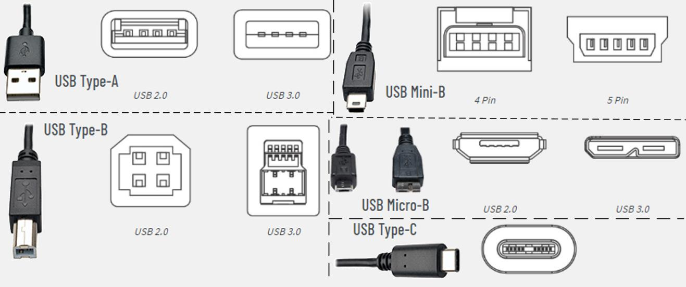
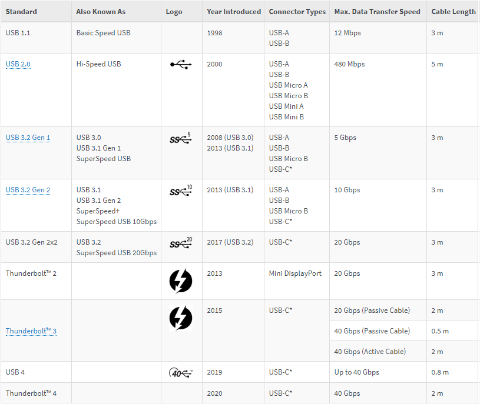
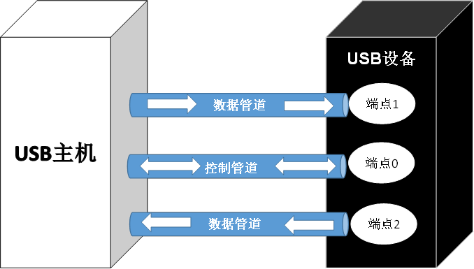
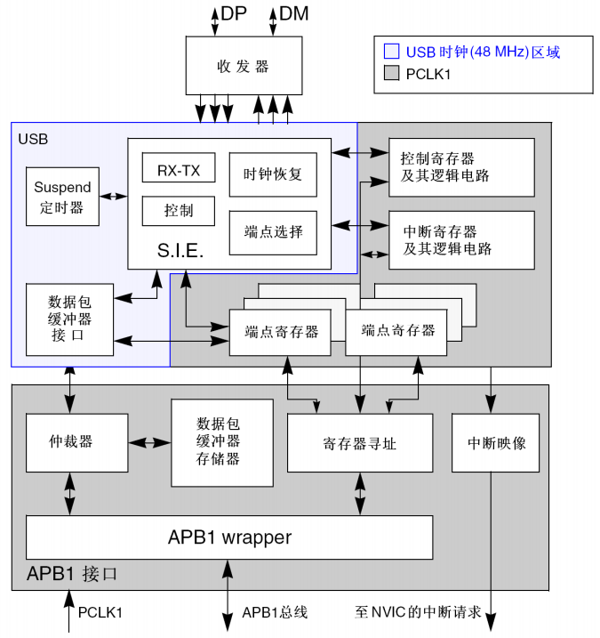

<!-- more -->

USB，即通用串行总线(Universal Serial Bus)，包括 USB 协议和 USB 硬件两个方面，支持热插拔功能。现在日常生活的很多方面都离不开 USB 的应用，如充电和数据传输等场景。

USB 经过多次修改， 1996 年确定了初始规范版本 USB1.0，目前由非盈利组织 USBIF([Front Page | USB-IF](https://www.usb.org/))管理。 STM32 自带的 USB 符合USB2.0 规范，故 2.0 版本仍是学习的重点。  

## 一、USB简介

USB 本身的知识体系非常复杂，这里就简单介绍一下，想更系统地学习 USB 的知识可以参考《圈圈教你玩 USB》、塞普拉斯提供的《USB101：通用串行总线 2.0 简介》等文献 。

### 1. USB 的硬件接口  

USB 协议有漫长的发展历程，为的不同的场合和硬件功能而发展出不同的接口： Type-A、Type-B、 Type-C， Type-C 规范碰巧是跟着 USB3.1 的规范一起发布的。常见的接口类型列出如下图：

USB 发展到现在已经有 USB1.0/1.1/2.0/3.x/4 等多个版本。目前用的最多的就是版本USB1.1 和 USB2.0， USB3.x/USB4 目前也在加速推广。从图中可以发现不同的版本的 USB 接口内的引脚数量是有差异的。 USB3.0 以后为了提高速度，采用了更多数量的通讯线，比如同样的是 Type A 接口， USB2.0 版本内部只有四根线，采用半双工式广播式通讯， USB3.0 版本则将通讯线提高到了 9 根，并可以支持全双工非广播式的总线，允许两个单向数据管道分别处理一个单向通信。

USB2.0 常使用四根线： VCC（5V）、 GND、 D+(3.3V)和 D-(3.3V) (注：五线模式多了一个DI 脚用于支持 OTG 模式， OTG 为 USB 主机+USB 设备双重角色)，其中数据线采用差分电压的方式进行数据传输。在 USB 主机上， D-和 D+都是接了 15K 的电阻到地的，所以在没有设备接入的时候， D+、 D-均是低电平。而在 USB 设备中，如果是高速设备，则会在 D+上接一个 1.5K的电阻到 3.3V，而如果是低速设备，则会在 D-上接一个 1.5K 的电阻到 3.3V。这样当设备接入主机的时候，主机就可以判断是否有设备接入，并能判断设备是高速设备还是低速设备。

关于 USB 硬件还有更多具体的细节规定，硬件设计时需要严格按照 USB 的器件的使用描述和 USB 标准所规定的参数来设计。  

### 2. USB 速度  

USB 规范已经为 USB 系统定义了以下四种速度模式：低速（Low-Speed）、全速（Full-Speed）、高速（Hi-Speed）和 超高速（SuperSpeedUSB）。接口的速度上限与设备支持的 USB 协议标准和导线长度、阻抗有关，不同协议版本对硬件的传输线数量、阻抗等要求各不相同，各个版本的能达到的理论速度上限对应如图：

USB 端口和连接器有时会标上颜色，以指示 USB 规格及其支持的功能。这些颜色不是 USB规范所要求的，并且在设备制造商之间不一致。例如，常见的支持 USB3.0 的 U 盘和电脑等设备使用蓝色指示，英特尔使用橙色指示充电端口等。  

### 3. USB 系统

USB 系统主要包括三个部分：控制器（Host Controller）、集线器 (Hub) 和 USB 设备。

控制器（Host Controller），主机一般可以有一个或多个控制器，主要负责执行由控制器驱动程序发出的命令。控制器驱动程序(Host Controller Driver)在控制器与 USB 设备之间建立通信信道。

集线器(Hub)连接到 USB 主机的根集线器，可用于拓展主机可访问的 USB 设备的数量。

USB 设备(USB Device)则是我们常用的如 U 盘， USB 鼠标这类受主机控制的设备。

### 4. USB 通讯  

USB 针对主机、集线器和设备制定了严格的协议。概括来讲，通过检测、令牌、传输控制、数据传输等多种方式，定义了主机和从机在系统中的不同职能。USB 系统通过“管道”进行通讯，有“控制管道”和“数据管道”两种， “控制管道”是双向的，而每个“数据管道”则是单向的，这种关系如图：

USB 通讯中的检测和断开总是由主机发起。 USB 主机与设备首次进行连接时会交换信息，这一过程叫“USB 枚举”。枚举是设备和主机间进行的信息交换过程，包含用于识别设备的信息。此外，枚举过程主机需要分配设备地址、读取描述符（作为提供有关设备信息的数据结构），并分配和加载设备驱动程序，而从机需要提供相应的描述符使主机知悉如何操作此设备。整个过程需要数秒时间。完成该过程后设备才可以向主机传输数据。数据传输也有规定的三种类型，分别是： IN/读取/上行数据传输、 OUT/写入/下行数据传输、控制数据传输。

USB 通过设备端点寻址，在主机和设备间实现信息交流。枚举发生前有一套专用的端点用于与设备进行通信。这些专用的端点统称为控制端点或端点 0，有端点 0 IN 和端点 0 OUT 两个不同的端点，但对开发者来说，它们的构建和运行方式是一样的。每一个 USB 设备都需要支持端点 0。因此，端点 0 不需要使用独立的描述符。除了端点 0 外，特定设备所支持的端点数量将由各自的设计要求决定。简单的设计（如鼠标）可能仅要一个 IN 端点。复杂的设计可能需要多个数据端点。

USB 规定的数据 4 种数据传输方式也是通过管道进行，分别是控制传输(Control Transfer)、中断传输(Interrupt Transfer)、批量传输或叫块传输(Bulk Transfer)、实时传输或叫同步传输(Isochronous Transfer )，每种模式规定了各自通讯时使用的管道类型。

关于 USB 还有很多更详细的时序和要求，像 USB 描述符、 VID/PID 的规定、 USB 类设备和调试等，因为 USB2.0 和之后的版本有差异，这里就不再详细描述了， ST 对 USB2.0 也有专门的培训资料，可以去官网查一查。

## 二、STM32F1的USB

### 1. 特性

STM32F1 系列芯片自带了 USB FS（FS，即全速， 12Mbps），支持从机（Slave/Device），但其 USB 与 CAN 不能同时使用，因为硬件共享同一个 SRAM。STM32F1 的 USB 外设实现了 USB2.0 的接口和 APB1 总线间的接口。它有以下特性：  

- 符合 USB2.0 全速设备的技术规范
- 可配置 1 到 8 个 USB 端点
- CRC(循环冗余校验)生成/校验，反向不归零(NRZI)编码/解码和位填充
- 支持同步传输
- 支持批量/同步端点的双缓冲区机制  
- 支持 USB 挂起/恢复操作
- 帧锁定时钟脉冲生成  

### 2. USB设备框图

STM32F1 的 USB 外设使用标准的 48Mhz 时钟，允许每个端点有独立的缓冲区，每个端点最大为 512 字节缓冲，最大 16 个单向或 8 个双向端点。 USB 的传输格式由硬件完成，状态可以由寄存器标记，可以很大程度上简化我们的程序设计。USB模块启动时间tSTARTUP最大为1us，这个需要在编程时注意。下图引用了 STM32F1 的 USB 设备框图，方便我们理解 USB 这个外设。  

## 三、USB协议栈

到这里我们已经对 USB 的硬件有了一定的了解，但由于 USB 协议的庞杂性，便得直接编写 USB 驱动的上手难度很大。故暂时我们可以从移植 ST 官方的 USB例程入手，学会使用 USB 驱动库。

ST 官方 Cube 库中提供的官方 USB 协议栈，主要是包含了 USBD 内核与 USB 各种类。USBD 内核一般是固定的，用户一般不需要修改，但 USBD 类，如果用户需要修改或者扩展，比如复合设备或者用户自定义设备，则需要用户自行修改。

USB 协议栈将所有 USB 类都抽象成一个数据结构： USBD_ClassTypeDef， USBD 内核与USBD 类之间的纽带就是 USBD_ClassType 这个结构体。这个结构体是一个抽象类，定义了一些虚拟函数，比如初始化，反初始化，类请求指令处理函数，端点 0 发送完成，端点 0 接收处理，数据发送完成，数据接收处理， SOF 中断处理，同步传输发送未完成，同步传输接收未完成处理等等；用户在实现自己具体的 USB 类的时候需要将它实例化， USBD_ClassTypeDef 结构体是 USBD 内核提供给外部定义一个 USB 设备类的窗口，而 USB 类文件实际就是实现这个结构体具体实例化的过程。最后将这个具体实例化的对象注册到 USBD 内核的同时， USBD 内核与 USBD 类也进行了关联。  
