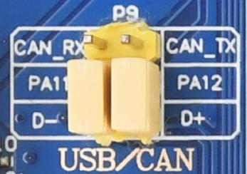

<!-- more -->

## 一、实验说明

学习 USB 时我们说过 USB 有很多的设备类，这一节的 USB 读卡器实际上是一个大容量存储设备(MSC: Mass Storage Class)，本实验实现过程我们需要对 MSC 类实例化，即定义这个类可以操作的功能，上层应用通过 USBD_RegisterClass 函数，将此对象注册到 usbd 内核，它主要在 usbd_msc.c 源文件中实现它的各个成员函数。

本实验中， STM32 作为设备连接到主机，我们需要使能 USB 外设，以便主机识别到 USB设备进行扫描，同时我们需要在软件上设计好 USB 枚举所需要的一些设备描述符和注册信息，配置对应的端点以用于 USB 通讯。

这个过程比较复杂，好在 ST 已经提供了实现了类似的例程：通过 USB 来读写 SD 卡（SDIO方式）和 NAND FALSH，支持 2 个逻辑单元。我们在官方例程的基础上，只需要修改 SD 驱动部分代码，并将对 NAND FLASH 的操作修改为对 SPI FLASH 的操作。只要这两步完成了，剩下的就比较简单了，对底层磁盘的读写，都是在 usbd-storage.c 文件实现的，所以我们只需要修改文件中的对应接口使之与我们的 SD 卡和 SPI FLASH 对应起来即可。    

## 二、硬件设计

### 1. 实验功能

开机的时候先检测 SD 卡、 SPI FLASH 是否存在，如果存在则获取其容量，并显示在 LCD 上（如果不存在，则报错）。之后开始 USB 配置，在配置成功之后，通过USB 连接线可以在电脑上发现两个可移动磁盘。我们用 LED1 来指示 USB 正在读写，并在液晶上显示出来，同样，我们还是用 DS0 来指示程序正在运行。  

### 2. 硬件资源  

- （1）LED 灯：LED0 – PB5，LED1 – PE5

- （2）串口 1(PA9/PA10 连接在板载 USB 转串口芯片 CH340 上面)
- （3） 正点原子 2.8/3.5/4.3/7/10 寸 TFTLCD 模块(仅限 MCU 屏， 16 位 8080 并口驱动)
- （4） microSD Card（使用大卡的情况类似， 大家可根据自己设计的硬件匹配选择）
- （5） SPI Flash
- （6） STM32 自带的 USB Slave 功能，要通过跳线帽连接 PA11 和 D-以及 PA12 和 D+。  

## 三、例程移植

由于 USB 驱动的复杂性， 如果我们要从零开始编写 USB 驱动，那将是一件相当困难的事情，尤其对于从没了解过 USB 的人来说， 周期会更长。不过， ST 提供了 STM32F1 的 USB 驱动库，通过这个库，我们可以很方便的实现我们所要的功能，而不需要详细了解 USB 的整个驱动，大大缩短了我们的开发时间和精力。当能正常驱动起 USB 了，我们再去关联和研究 USB底层的知识更容易达到事半功倍的效果。  

### 1. ST官方demo

#### 1.1 在哪找demo？

USB 库和相关参考例程在 en.stm32cubef1.zip 里面可以找到，该文件可以在 [st.com/content/st_com/en.html](https://www.st.com/content/st_com/en.html) 网站搜索： cubef1 找到。下载解压后，对应的USB的例程在这里：

① USB 设备驱动库，从机使用

② USB Host 驱动库， 主机使用

③ 与我们使用的芯片型号近似的 ST 开发板的 USB 例程；  

#### 1.2 官方demo的工程结构

我们将通过上图③的例程， 移植并实现我们自己的 USB Device 设备。 读卡器属于USB大存储设备， 所以本实验要移植的是官方的MSC_Standalone 例程。我们先打开该例程的 MDK 工程(MDK-ARM 文件夹下)， 查看一下其工程结构：  

从工程结构不难找出我们需要的 USB 功能代码， 并且这些文件是加了只读属性的， 我们移植后需要把只读属性去掉才能进行我们需要的修改。 因为要用到 SD 卡和 SPI Flash， 为了减少步骤，我们复制之前的 SD 卡实验工程文件夹，重命名为“USB 读卡器实验” ，一方面是我们要用到 SD 卡， 另一方面是 USB 的端点需要用到动态分配的内存。因为我们并不是所有例程都使用 USB 库驱动， 故我们把 USB 作为一个第三方组件放到我们的“Middlewares” 文件夹下，我们在该文件夹下新建一个 USB 文件目录， 把 USB 相关的全部放到 USB 文件夹下使这部分驱动完全独立， 这样可以方便我们以后事移植到其它项目中。  

#### 1.3 文件移植

首先是 usbd_core.c、 usbd_ioreq.c、 usbd_req.c 这三个文件，我们查看它们所在的位置发现它们都位于“STM32_USB_Device_Library” 文件夹下， 所以我们可以直接把该文件夹复制到我们的 USB 文件夹下，后面再考虑精简工程。

接着同样的方法， 找到 usbd_msc_bot.c、 usbd_msc.c、 usbd_msc_scsi.c、 usbd_msc_data.c这四个文件，发现他们同样位于 “STM32_USB_Device_Library”  文件夹，上一步我们已经把整个文件夹复制到我到我们的工程目录了，所以这步不需要再操作。

接下来的 USB 应用程序 usb_desc.c、 usbd_storage.c、 usbd_conf.c 三个文件， 源文件和头文件分别位于下图所示的这两个目录中：

也就是 USB_Device/MSC_Standalone/Src 和 USB_Device/MSC_Standalone/Inc下， 我们在 USB 文件夹下新建一个“USB_APP” 文件夹， 把它们连同头文件都放到该文件夹的根目录下。  

我们需要添加的文件已经准备好了，接下来我们添加到我们的工程中来。 我们按原来的定义， 在 MDK 中新建 Middlewares/USB_CORE、Middlewares/USB_CLASS、Middlewares/USB_APP三个分组， 把上面的文件的只读属性去掉后添加到我们的工程中，结果如图， 然后把相关的 HAL库的驱动加到 Drivers/STM32F1xx_HAL_Driver 目录下，如图：

为了保持 USB 驱动部分更少的改动，我们添加原有 USB 库的头文件的引用路径， 结果如图 ：

这时我们直接编译会报错， 因为我们没有引用 ST 开发板的 BSP 文件，这时我们还需要修改相关源码以匹配我们的底层的驱动，这部分与我们的开发板相关， 我们在程序设计的时候再对应修改。  

### 2. USB读卡器程序流程图

我们按流程图编写的初始化顺序，在 STM32 注册 USB 内核，最后通过 USB 的中断和回调函数得到 USB 的操作状态和操作结果，主程序通过查询设定的标记变量的状态值后，在 LCD 上显示对应的 USB 操作状态。  

### 3. 程序修改

直接看这里吧：[feat:STM32_HAL_Prj——USB读卡器实验-USB读卡器实现 · d342a64 · sumumm/STM32F103-Prj - Gitee.com](https://gitee.com/sumumm/stm32f103-prj/commit/d342a648c808888ad3824f74f937b66a9f03d616)
