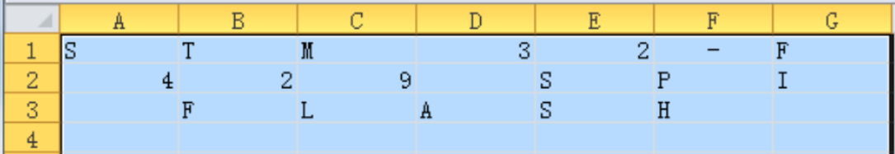
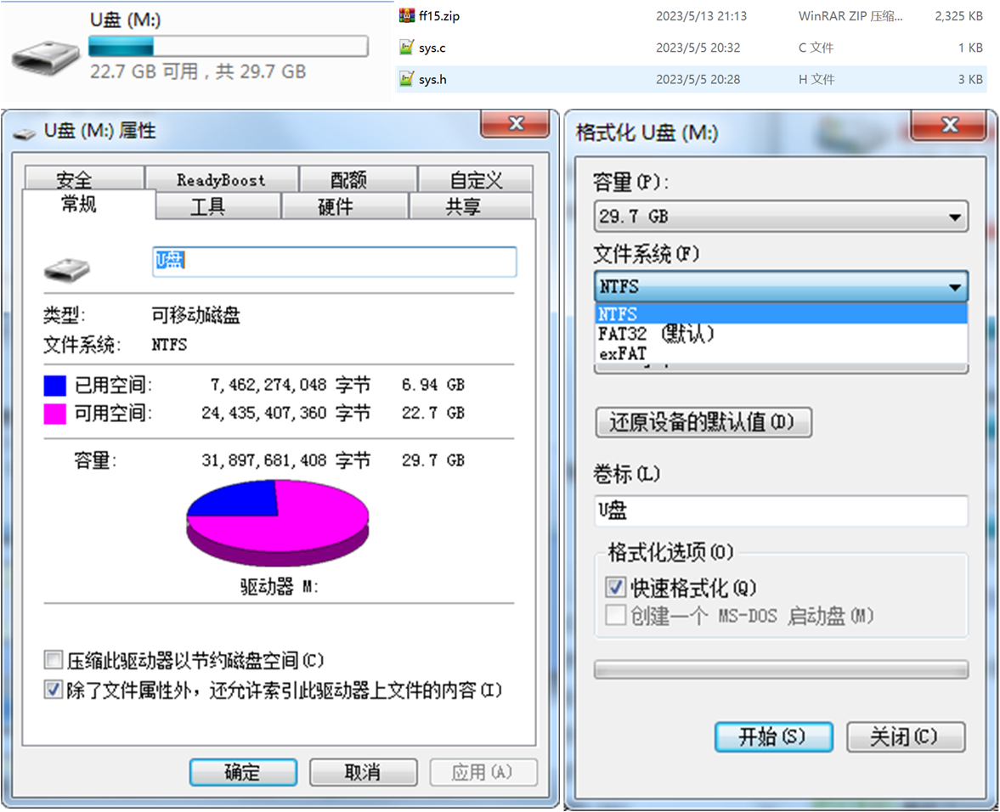
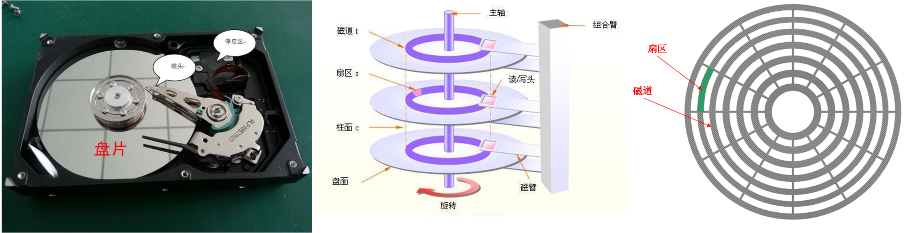
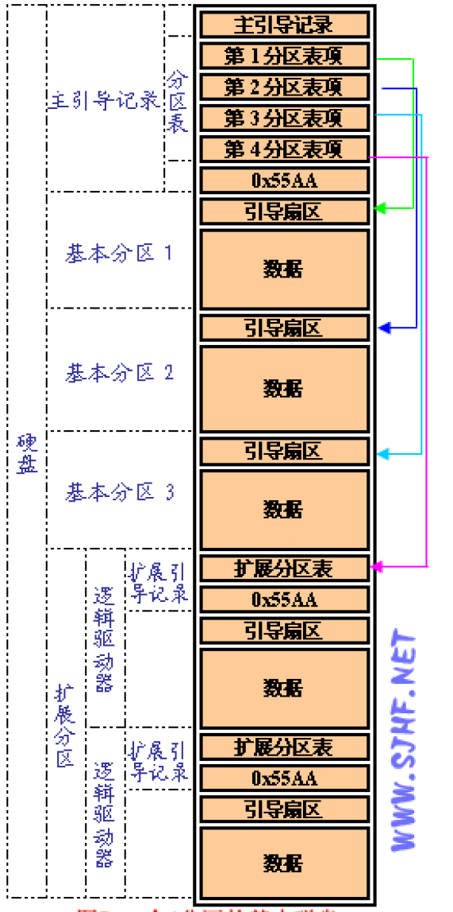
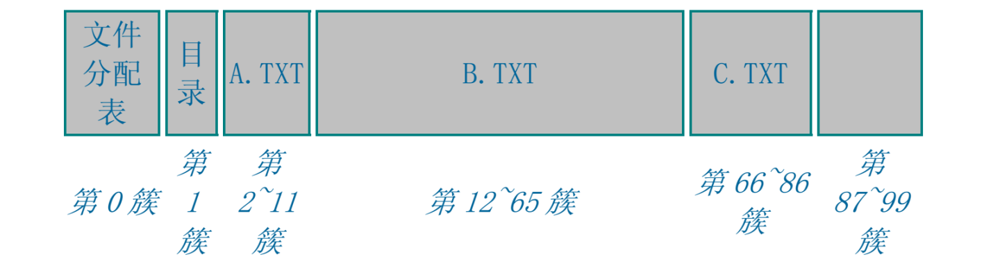
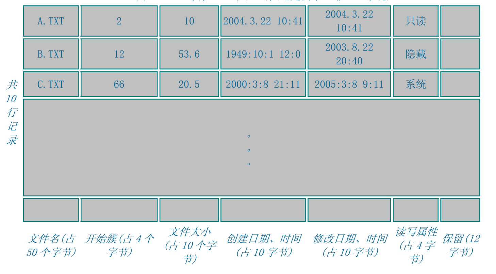
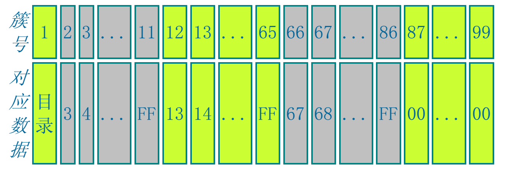
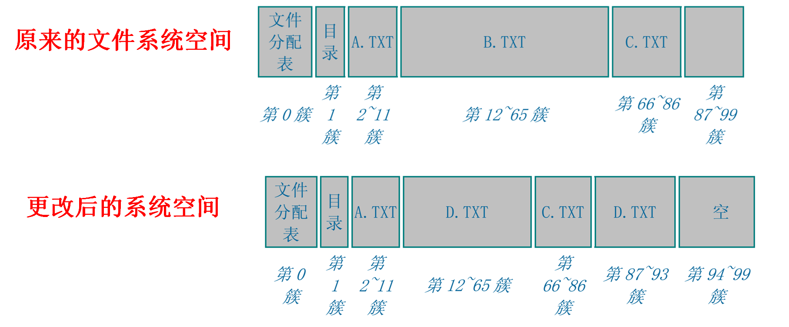
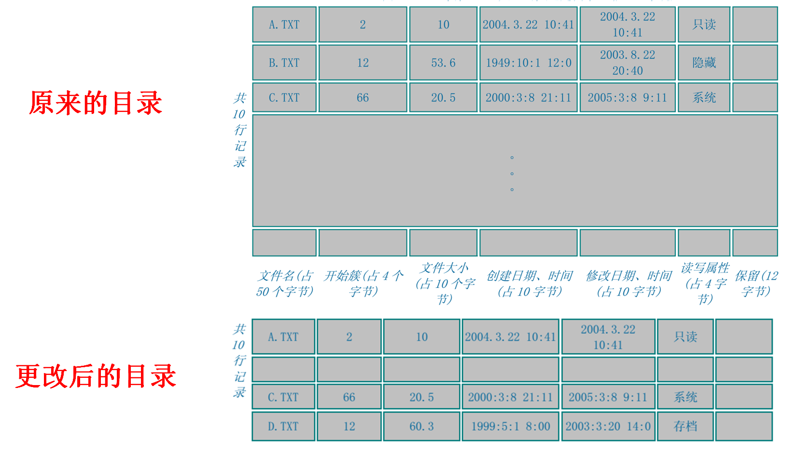
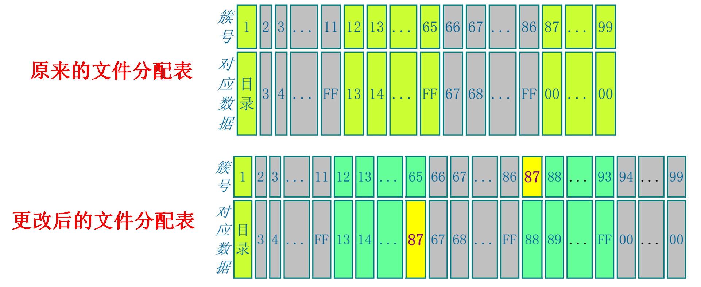

<!-- more -->

## 一、直接存储的弊端？

我们前边已经学习了SPI FLASH和SD卡的读写，我们可以使用SPI FLASH直接存储数据，当需要记录字符“STM32 SPI FLASH” 时。 可以把这些文字转化成ASCII码，存储在数组中，然后调用SPI_FLASH_BufferWrite函数，把数组内容写入到SPI Flash芯片的指定地址上，在需要的时候从该地址把数据读取出来，再对读出来的数据以ASCII码的格式进行解读。  

但是，这样直接存储数据会带来极大的不便，如难以记录有效数据的位置，难以确定存储介质的剩余空间，以及应以何种格式来解读数据。就如同一个巨大的图书馆无人管理，杂乱无章地存放着各种书籍，难以查找所需的文档。想象一下图书馆的采购人员购书后，把书籍往馆内一扔，当有人来借阅某本书的时候，就不得不一本本地查找。这样直接存储数据的方式对于小容量的存储介质如 EEPROM 还可以接受，但对于 SPI Flash 芯片或者 SD 卡之类的大容量设备，我们需要一种高效的方式来管理它的存储内容。 

这些管理方式即为文件系统，它是为了存储和管理数据，而在存储介质建立的一种组织结构，这些结构包括操作系统引导区、目录和文件。 常见的 windows 下的文件系统格式包括 FAT32、 NTFS、exFAT。 在使用文件系统前，要先对存储介质进行格式化。格式化先擦除原来内容，在存储介质上新建一个文件分配表和目录。这样，文件系统就可以记录数据存放的物理地址，剩余空间。  

## 二、文件系统简介

### 1. 文件系统是什么？

前边其实已经提到了，负责管理和存储文件信息的软件机构称为文件管理系统，简称文件系统。即在磁盘上组织文件的方法。常用的文件系统有以下几种：

- FAT / FATFS

- NTFS: 基于安全性的文件系统，是Windows NT所采用的独特的文件系统结构。

- CDFS：CDFS是大部分的光盘的文件系统。

- exFAT

### 2. Windows上的文件系统  

上边我们知道，文件系统，就是对数据进行管理的方式。使用文件系统可有效地管理存储介质。  

磁盘的物理结构如下：

使用文件系统时， 它为了存储和管理数据，在存储介质建立了一些组织结构，这些结构包括操作系统引导区、目录和文件。常见的windows下的文件系统格式包括FAT32、 NTFS、 exFAT。在使用文件系统前，要先对存储介质进行格式化。格式化时会在存储介质上新建一个文件分配表和目录。这样，文件系统就可以记录数据存放的物理地址，剩余空间。  

### 3. 磁盘分区表

Windows操作系统为了便于用户对磁盘的管理。加入了磁盘分区的概念，即将一块磁盘逻辑划分为几块，它会把磁盘的分区信息记录到硬盘分区表中。在硬盘分区表中，描述了各个逻辑分区的属性，如分区开始和结束位置所在的物理地址(柱面号、扇区号)，空间大小等信息。 

### 4. 文件系统的结构与特性

使用文件系统时，数据都以文件的形式存储。写入新文件时，先在目录中创建一个文件索引，它指示了文件存放的物理地址，再把数据存储到该地址中。当需要读取数据时，可以从目录中找到该文件的索引，进而在相应的地址中读取出数据。具体还涉及到逻辑地址、簇大小、不连续存储等一系列辅助结构或处理过程。  

文件系统的存在使存取数据时，不再是简单地向某物理地址直接读写，而是要遵循它的读写格式。如经过逻辑转换，一个完整的文件可能被分开成多段存储到不连续的物理地址，使用**目录**或链表的方式来获知下一段的位置。 

## 三、文件系统的基本原理？

### 1. 文件系统空间

如下图所示的文件系统的空间示意图：

我们存储了A.TXT，B.TXT， C.TXT文件 。

### 2. 目录

文件系统会有一个目录，通过这个目录记录文件的开始簇位置、大小等信息 ，如下图：

### 3. 文件分配表

假设我们刚才存储的三个文件的文件分配表如下图：

文件 A.TXT 我们根据目录项中指定的 A.TXTt 的首簇为 2，然后找到文件分配表的第 2 簇记录，上面登记的是 3，就能确定下一簇是 3。找到文件分配表的第 3 簇记录，上面登记的是 4，就能确定下一簇是 4 ......直到指到第 11 簇，发现下一个指向是 FF，就是结束。文件便读取完毕。

### 4. 文件变化了怎么办？

我们删除B.TXT文件，创建D.TXT文件后的空间示意图：

删除B.TXT文件，创建D.TXT文件后的目录示意图 ：

文件分配表将变成如下所示：

