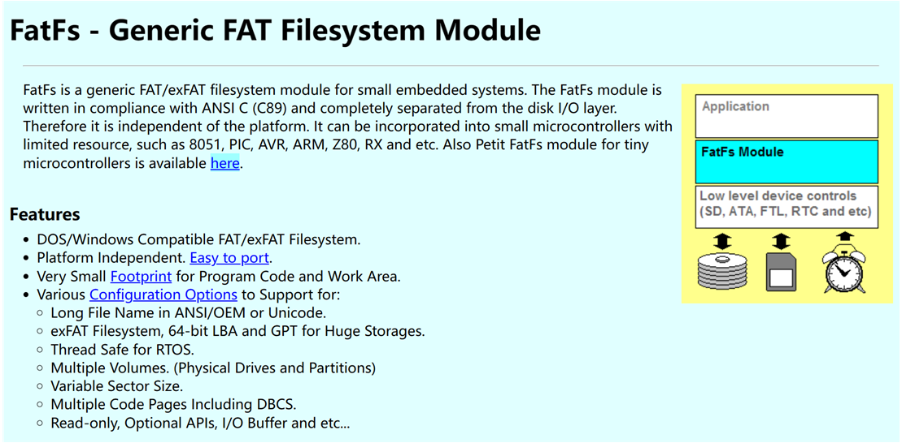
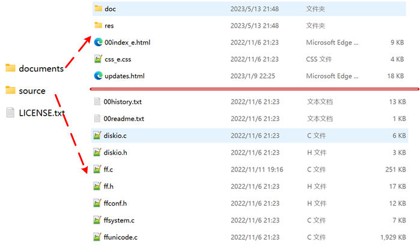
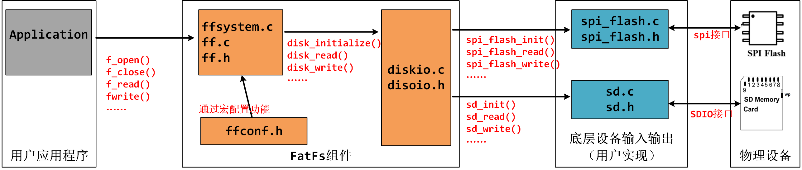
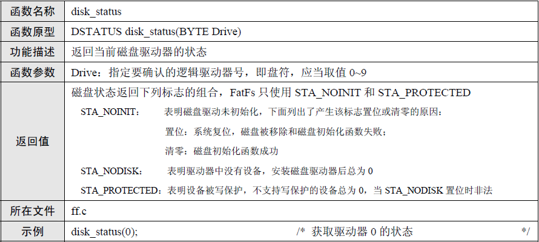
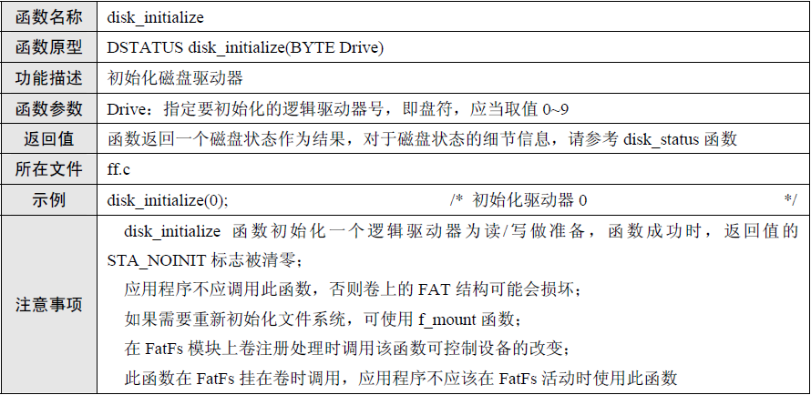
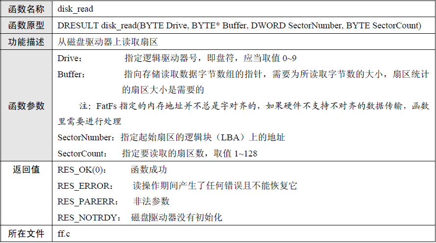
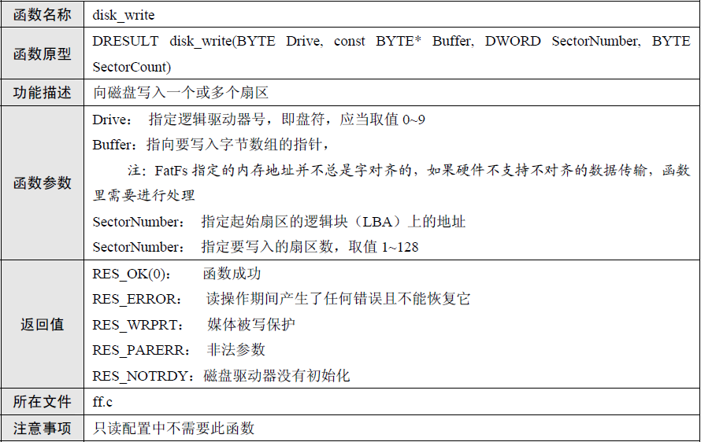
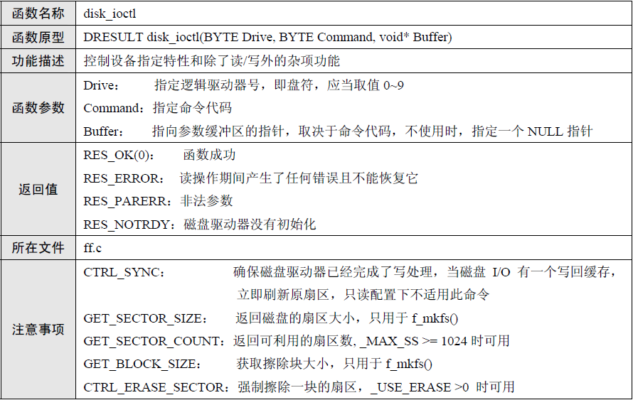
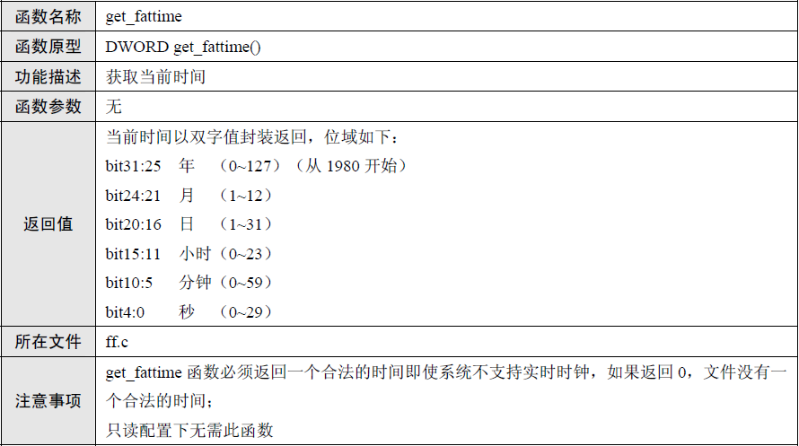
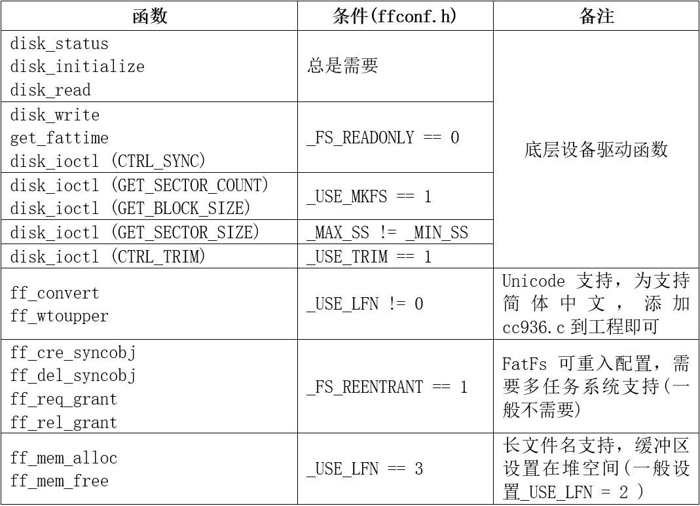

<!-- more -->


## 二、 FatFs简介

### 1. FatFs是什么？

FATFS 是一个完全免费开源的 FAT 文件系统模块，专门为小型的嵌入式系统而设计。它完全用标准 C 语言编写，所以具有良好的硬件平台独立性，可以移植到 8051、 PIC、 AVR、 SH、Z80、 H8、 ARM 等系列单片机上而只需做简单的修改。它支持 FATl2、 FATl6 和 FAT32，支持多个存储媒介；有独立的缓冲区，可以对多个文件进行读／写，并特别对 8 位单片机和 16 位单片机做了优化。

### 2. 它有什么特点

（1）Windows 兼容的 FAT 文件系统（支持 FAT12/FAT16/FAT32）

（2）与平台无关，移植简单

（3）代码量少、效率高

（4）多种配置选项。例如，支持多卷（物理驱动器或分区，最多 10 个卷）；多个 ANSI/OEM 代码页包括 DBCS；支持长文件名、 ANSI/OEM 或 Unicode；支持 RTOS；支持多种扇区大小；只读、最小化的 API 和 I/O 缓冲区等 

FATFS 的这些特点，加上免费、开源的原则，使得 FATFS 应用非常广泛。  

### 3. 官网与资料

我们可以在这里找到FatFs文件系统的参考文档以及文件系统的压缩包：[FatFs - Generic FAT Filesystem Module (elm-chan.org)](http://elm-chan.org/fsw/ff/00index_e.html)



我们下载最新版本的FatFs文件系统，并解压，我们会得到如下文件：



- documents目录下是一些帮助文档，里面是编译好的 html 文档，讲的是 FATFS 里面各个函数的使用方法，这些函数都是封装得非常好的函数，利用这些函数我们就可以操作 SPI Flash 芯片。 

- source目录下是FatFs文件系统的源码。

（1）diskio.c 文件是 FatFs 移植最关键的文件，它为文件系统提供了最底层的访问 SPI Flash 芯片以及SD卡的方法， FatFs 有且仅有它需要用到与 SPI Flash 芯片和SD卡相关的函数。

（2）diskio.h 定义了 FatFs 用到的宏，以及 diskio.c 文件内与底层硬件接口相关的函数声明。     

（3）00history.txt 介绍了 FatFs 的版本更新情况。  

（4）00readme.txt 说明了当前目录下 ff.c、ffconf.h、ff.h、diskio.h、diskio.c、ffunicode.c、ffsystem.c等文件的功能。

### 4. 系统结构

我们上边看到源码目录中有那么多文件，它们有什么联系呢？这些重要的文件功能如下：

| 文件名      | 说明                                                         |
| ----------- | ------------------------------------------------------------ |
| diskio.c    | FATFS和disk I/O模块接口层源文件，在这里实现对存储介质的初始化和读写操作。 |
| diskio.h    | FATFS和disk I/O模块接口层头文件，包括函数声明和一些返回值的定义。 |
| ff.c        | FatFs 核心文件，文件管理的实现方法。该文件独立于底层介质操作文件的函数，利用这些函数实现文件的读写。如f_open等  。 |
| ff.h        | FATFS和应用模块公用的包含文件，包括函数声明、一些数据类型的定义和重命名，都在这里。。 |
| ffsystem.c  | 用户为fatf提供操作系统相关函数的示例代码，我感觉这像是给操作系统用的，里边有一些锁的函数实现，这里边的函数声明在ff.h中。 |
| ffunicode.c | 编码的一些格式，包含了简体中文的GBK 和 Unicode 相互转换功能函数。 |
| ffconf.h    | FatFs模块配置文件。这个头文件包含了对 FatFs 功能配置的宏定义，通过修改这些宏定义就可以裁剪FatFs 的功能。 |

它们之间的关系网络如下图：



（1）用户应用程序：我们实际用来实现功能的部分，比如说我们要打开文件，就f_open()，关闭文件就用f_close()，读写文件就用f_read()和f_write()等。

（2）FatFs组件，这就是我们使用的FatFs文件系统，我们在应用程序使用f_open()这些函数在哪实现的？就是在ff.c、ffsystem.c中实现，在ff.h中声明，由用户调用，像一些读写的功能，我们其实是可以配置的，比如设置成只读，那么写的操作就会被屏蔽，这就是通过ffconf.h中的预编译宏来进行配置，选中的才会被编译到最终的可执行文件。那么f_read()、f_write()这些函数怎么去操作存储介质，完成存储和读取的？这个时候就来到了diskio.c和diskio.h中，这两个文件中实现存储介质的初始化和读写等相关功能。

（3）底层设备输入输出：这一部分就是实际对存储介质的操作了，比如SPI FLASH或者SD卡的初始化，读和写操作等，这里完成相关功能由diskio.c调用，实现对底层的操作，这一层是直接操作底层硬件设备的。

（4）物理设备：这一层自然就是我们的物理存储设备了，比如SPI FLASH、SD卡或者EEPROM等。

## 三、FatFs重要文件

接下来我们来了解几个文件，看依稀文件中有哪些重要的内容，方便后边移植。

### 1. ffconf.h

我们先来看一下配置文件，里边定义了大量的宏，我们来看一些重要的。

#### 1.1 FF_FS_READONLY

```c
#define FF_FS_READONLY	0
```

该选项切换只读配置。(0：读写或1：只读)，只读配置将会删除写相关的API函数，例如f\_write()， f\_sync()， f\_unlink()， f\_mkdir()， f\_chmod()， f\_rename()， f\_truncate()， f\_getfree()以及一些可选的写函数。

#### 1.2 FF_USE_MKFS

```c
#define FF_USE_MKFS		0
```

这个宏，选择是否启用 f_mkfs() 函数，这个函数是用来创建文件系统的，应该是会格式化原有的文件系统。

#### 1.3 FF_VOLUMES

 ```c
#define FF_VOLUMES		1
 ```

这个就比较重要了，它是用来设置我们的这个文件系统支持多少个存储介质，也就是要使用的卷(逻辑驱动器)的数量。范围是1~10，比如说我们现在有两个存储介质，SPI FLASH和SD卡，我们可能需要两个都使用，这样的话，我们这个宏就需要大于2，不然有一个是无法操作的。

#### 1.4 FF_XXX_SS

```c
#define FF_MIN_SS		512
#define FF_MAX_SS		512
```

指定扇区大小的最小值和最大值。 SD 卡扇区大小一般都为 512 字节， SPI Flash 芯片扇区大小一般设置为 4096 字节，所以若是使用的时候需要把 FF_MAX_SS 改为 4096。  

注意：这里我们使用的存储设备的扇区大小非512，需要修改时，FF_MAX_SS与FF_MIN_SS不相等的时候，我们需要在后边实现disk_ioctl函数，在这个函数中获取不同设备扇区大小，否则可能会报 The physical drive cannot work这一类错误。

### 2. diskio.c

#### 2.1 disk_status()

```c
DSTATUS disk_status (
	BYTE pdrv		/* Physical drive nmuber to identify the drive */
)
```

**【函数说明】**这个函数主要是获取存储设备的状态，根据定义的逻辑驱动器号来选择获取不同的设备的状态，这个状态的获取需要我们在对应的存储设备驱动文件中实现，并在这里调用。



**【参数说明】**

- pdrv ：BYTE类型，逻辑驱动器的编号。

#### 2.2 disk_initialize()

```c
DSTATUS disk_initialize (
	BYTE pdrv				/* Physical drive nmuber to identify the drive */
)
```

**【函数说明】**这个函数主要是初始化存储设备，需要我们自己实现对应的初始化函数，并在这里调用。



**【参数说明】**

- pdrv ：BYTE类型，逻辑驱动器的编号。

#### 2.3 disk_read()

```c
DRESULT disk_read (
	BYTE pdrv,		/* Physical drive nmuber to identify the drive */
	BYTE *buff,		/* Data buffer to store read data */
	LBA_t sector,	/* Start sector in LBA */
	UINT count		/* Number of sectors to read */
)
```

**【函数说明】**这个函数主要是从存储设备读取数据，需要我们自己实现对应的初始化函数，并在这里调用。



**【参数说明】**

- pdrv ：BYTE类型，逻辑驱动器的编号。
- buff ：BYTE *类型，表示读取的数据将要存放的位置，需要传入一个地址用于存储读取的数据。
- sector ：LBA_t类型，表示要读取哪一个扇区。
- count ：UINT类型，表示要读取的扇区数量。

#### 2.4 disk_write()

```c
DRESULT disk_write (
	BYTE pdrv,			/* Physical drive nmuber to identify the drive */
	const BYTE *buff,	/* Data to be written */
	LBA_t sector,		/* Start sector in LBA */
	UINT count			/* Number of sectors to write */
)
```

**【函数说明】**这个函数主要是向存储设备写入数据，需要我们自己实现对应的初始化函数，并在这里调用。



**【参数说明】**

- pdrv ：BYTE类型，逻辑驱动器的编号。
- buff ：BYTE *类型，表示要写入的数据存放的位置，需要传入一个地址用于存储将要写入的数据。
- sector ：LBA_t类型，表示要写入到哪一个扇区。
- count ：UINT类型，表示要写入的扇区数量。

#### 2.5 disk_ioctl()

```c
DRESULT disk_ioctl (
	BYTE pdrv,		/* Physical drive nmuber (0..) */
	BYTE cmd,		/* Control code */
	void *buff		/* Buffer to send/receive control data */
)
```

**【函数说明】**这个函数主要是对设备执行一些自定义的命令，比如读取设备信息等，具体要实现什么功能需要自己定义，并且实现，然后在这里调用。



**【参数说明】**

- pdrv ：BYTE类型，逻辑驱动器的编号。
- cmd ：BYTE类型，表示要执行的命令类型，根据不同的命令实现不同的功能。
- buff ：void *类型，表示一个缓冲区的地址，存放数据，看自己的需求了。

**【注意事项】**注意我们在这里读写的时候最好实现获取存储设备块大小的相关命令，块的大小在读写的时候会用到，不实现的话会有很多坑。

#### 2.6 get_fattime()

```c
DWORD get_fattime (void)
{
	return 0;
}
```

**【函数说明】**这个函数主要是获取当前的时间。



**【参数说明】**none

**【注意事项】**这个函数在新版本的FatFs中没有实现，但是会有调用，所以这个我们需要自己实现一下，可以什么都不做，但是要有。

### 3. ff.c

这里主要是一些应用层的函数，这里就不详细说了，详细的可以查看官网说明文档：[FatFs - Generic FAT Filesystem Module (elm-chan.org)](http://elm-chan.org/fsw/ff/00index_e.html)的Application Interface，这些文档其实在我们下载的FatFs包中有本地的，也可以看。

```c
f_mount - 注册/注销一个工作区域（Work Area）
f_open - 打开/创建一个文件
f_close - 关闭一个文件
f_read - 读文件
f_write - 写文件
f_lseek - 移动文件读/写指针
f_truncate -截断文件
f_sync -  冲洗缓冲数据 Flush Cached Data
f_forward - 直接转移文件数据到一个数据流
f_stat - 获取文件状态
f_opendir - 打开一个目录 
f_closedir -关闭一个已经打开的目录
f_readdir - 读取目录条目
f_mkdir - 创建一个目录
f_unlink -删除一个文件或目录
f_chmod -  改变属性（Attribute）
f_utime -改变时间戳（Timestamp）
f_rename - 重命名/移动一个文件或文件夹
f_chdir - 改变当前目录
f_chdrive - 改变当前驱动器
f_getcwd -  获取当前工作目录 
f_getfree - 获取空闲簇 Get Free Clusters
f_getlabel - Get volume label
f_setlabel - Set volume label
f_mkfs - 在驱动器上创建一个文件系统
f_fdisk - Divide a physical drive
f_gets - 读一个字符串
f_putc - 写一个字符
f_puts - 写一个字符串
f_printf - 写一个格式化的字符串
f_tell - 获取当前读/写指针
f_eof - 测试文件结束
f_size - 获取文件大小
f_error - 测试文件上的错误
```

## 四、API与返回值

我们来看几个函数，以及结构体，方便后边测试和配置的时候使用。

### 1. 两个结构体

#### 1.1 FATFS

关于该结构体，它定义在ff.h文件中，我们可以参考官方文档：[FatFs - FATFS (elm-chan.org)](http://elm-chan.org/fsw/ff/doc/sfatfs.html)

```c
/* Filesystem object structure (FATFS) */

typedef struct {
	BYTE	fs_type;		/* Filesystem type (0:not mounted) */
	BYTE	pdrv;			/* Volume hosting physical drive */
	BYTE	ldrv;			/* Logical drive number (used only when FF_FS_REENTRANT) */
	BYTE	n_fats;			/* Number of FATs (1 or 2) */
	// 中间的部分省略
	BYTE	win[FF_MAX_SS];	/* Disk access window for Directory, FAT (and file data at tiny cfg) */
} FATFS;
```

FATFS结构(文件系统对象)保存各个逻辑驱动器的动态工作区域。它由应用程序给出，并通过f_mount函数注册/取消注册到FatFs模块。结构的初始化在必要时由卷挂载进程完成。应用程序不得修改此结构中的任何成员，否则将导致FAT卷崩溃。

我们要注意一下这个结构体是非常大的，我们可以看到最后一个成员win，这是一个数组，大小为FF_MAX_SS，这个最大值我们后边可能会配置为4096，这样下来这个结构体就非常的大，用它定义的变量最好不要定义为局部变量，否则可能会导致栈的溢出，当然，要是我们的栈非常大的话吗，就可以不用考虑这个问题了。

#### 1.2 FIL

关于该结构体，它定义在ff.h中，我们可以参考官方文档：[FatFs - FIL (elm-chan.org)](http://elm-chan.org/fsw/ff/doc/sfile.html)

```c
/* File object structure (FIL) */

typedef struct {
	FFOBJID	obj;			/* Object identifier (must be the 1st member to detect invalid object pointer) */
	BYTE	flag;			/* File status flags */
	BYTE	err;			/* Abort flag (error code) */
	FSIZE_t	fptr;			/* File read/write pointer (Zeroed on file open) */
	DWORD	clust;			/* Current cluster of fpter (invalid when fptr is 0) */
	LBA_t	sect;			/* Sector number appearing in buf[] (0:invalid) */
#if !FF_FS_READONLY
	LBA_t	dir_sect;		/* Sector number containing the directory entry (not used at exFAT) */
	BYTE*	dir_ptr;		/* Pointer to the directory entry in the win[] (not used at exFAT) */
#endif
#if FF_USE_FASTSEEK
	DWORD*	cltbl;			/* Pointer to the cluster link map table (nulled on open, set by application) */
#endif
#if !FF_FS_TINY
	BYTE	buf[FF_MAX_SS];	/* File private data read/write window */
#endif
} FIL;
```

FIL结构(文件对象)保存打开文件的状态。它由f_open函数创建，并由f_close函数丢弃。应用程序不能修改该结构中除cltbl之外的任何成员，否则将导致FAT卷崩溃。请注意，扇区缓冲区是在非微小配置(FF_FS_TINY == 0)的结构中定义的，因此该配置中的FIL结构不应该被定义为自动变量。

我们要注意一下这个结构体是非常大的，我们可以看到最后一个成员buf，这是一个数组，大小为FF_MAX_SS，这个最大值我们后边可能会配置为4096，这样下来这个结构体跟FATFS一样，就非常的大，所以一般我们也不会将其定义为局部变量。

### 2. 函数返回值

#### 2.1 返回值的枚举类型

我们首先来了解一下我们常用的一些函数的返回值的含义，我们可以通过这些返回值来判断是哪里出错了：

```c
/* File function return code (FRESULT) */

typedef enum {
	FR_OK = 0,				/* (0) Succeeded */
	FR_DISK_ERR,			/* (1) A hard error occurred in the low level disk I/O layer */
	FR_INT_ERR,				/* (2) Assertion failed */
	FR_NOT_READY,			/* (3) The physical drive cannot work */
	FR_NO_FILE,				/* (4) Could not find the file */
	FR_NO_PATH,				/* (5) Could not find the path */
	FR_INVALID_NAME,		/* (6) The path name format is invalid */
	FR_DENIED,				/* (7) Access denied due to prohibited access or directory full */
	FR_EXIST,				/* (8) Access denied due to prohibited access */
	FR_INVALID_OBJECT,		/* (9) The file/directory object is invalid */
	FR_WRITE_PROTECTED,		/* (10) The physical drive is write protected */
	FR_INVALID_DRIVE,		/* (11) The logical drive number is invalid */
	FR_NOT_ENABLED,			/* (12) The volume has no work area */
	FR_NO_FILESYSTEM,		/* (13) There is no valid FAT volume */
	FR_MKFS_ABORTED,		/* (14) The f_mkfs() aborted due to any problem */
	FR_TIMEOUT,				/* (15) Could not get a grant to access the volume within defined period */
	FR_LOCKED,				/* (16) The operation is rejected according to the file sharing policy */
	FR_NOT_ENOUGH_CORE,		/* (17) LFN working buffer could not be allocated */
	FR_TOO_MANY_OPEN_FILES,	/* (18) Number of open files > FF_FS_LOCK */
	FR_INVALID_PARAMETER	/* (19) Given parameter is invalid */
} FRESULT;

```

这是一个枚举类型，它也定义在ff.h中，我们可以参考官方文档来详细了解这些值的含义：[FatFs - API Return Code (elm-chan.org)](http://elm-chan.org/fsw/ff/doc/rc.html#id)

#### 2.2 字符串数组？

上边返回值好多，我们知道值的话，还需要知道代表什么含义，我们其实可以定义一个二维数组，按顺序将上边的枚举所代表的含义依次写入，然后打印的时候就可以直接获取错误码的含义了，不过这样可能会比较占内存，慎用。

```c
static BYTE API_RET[][90] = {
    "(0) Succeeded ",
    "(1) A hard error occurred in the low level disk I/O layer ",
    "(2) Assertion failed ",
    "(3) The physical drive cannot work ",
    "(4) Could not find the file ",
    "(5) Could not find the path ",
    "(6) The path name format is invalid ",
    "(7) Access denied due to prohibited access or directory full ",
    "(8) Access denied due to prohibited access ",
    "(9) The file/directory object is invalid ",
    "(10) The physical drive is write protected ",
    "(11) The logical drive number is invalid ",
    "(12) The volume has no work area ",
    "(13) There is no valid FAT volume ",
    "(14) The f_mkfs() aborted due to any problem ",
    "(15) Could not get a grant to access the volume within defined period ",
    "(16) The operation is rejected according to the file sharing policy ",
    "(17) LFN working buffer could not be allocated ",
    "(18) Number of open files > FF_FS_LOCK ",
    "(19) Given parameter is invalid ",
};
```

我们打印的时候就可以这样：

```c
printf("res:%s\n\r", API_RET[res]);
```

这样就可以直接将错误的原因打印出来啦。

### 3. 常用函数

#### 3.1 f_mount()

我们可以参考[FatFs - f_mount (elm-chan.org)](http://elm-chan.org/fsw/ff/doc/mount.html)：

```c
FRESULT f_mount (
  FATFS*       fs,    /* [IN] Filesystem object */
  const TCHAR* path,  /* [IN] Logical drive number */
  BYTE         opt    /* [IN] Initialization option */
);
```

**【函数说明】**f_mount函数为FatFs模块提供工作区域。也就是用于挂载我们存储设备上的文件系统，挂载之后我们才能正常的使用这个文件系统。

**【函数参数】**

- fs ：指向要注册和清除的文件系统对象的指针。若是NULL的话，则表示取消注册已注册的文件系统对象，每个存储介质只需要一个即可，用于存储这个存储设备的文件系统的信息。
- path ：指向指定逻辑驱动器的以空结尾的字符串的指针。不带驱动器号的字符串为默认驱动器。比如我们上边规定的SPI FLASH的drive number为1，那么这里就可以写 “1:” ，当挂载成功后，他就相当于我们win中的C、D等这些的盘符。
- opt ：0，现在不挂载(要在第一次访问卷时挂载)，1，强制立即挂载卷，并检查卷是否可以工作。

#### 3.2 f_mkfs()

我们可以参考[FatFs - f_mkfs (elm-chan.org)](http://elm-chan.org/fsw/ff/doc/mkfs.html):

```c
FRESULT f_mkfs (
  const TCHAR* path,   /* [IN] Logical drive number */
  const MKFS_PARM* opt,/* [IN] Format options */
  void* work,          /* [-]  Working buffer */
  UINT len             /* [IN] Size of working buffer */
);
```

**【函数说明】**f_mkfs函数在逻辑驱动器上创建一个FAT/exFAT卷。什么意思呢？就是我们的存储介质上原本是什么都没有的，我们需要将其格式化并创建一个文件系统，这样我们才能正常的去使用文件系统来管理其中的文件。

**【函数参数】**

- path：指向以空结尾的字符串的指针指定要格式化的逻辑驱动器。如果其中没有驱动器号，则表示指定默认驱动器。在格式化过程中，逻辑驱动器可能已经挂载，也可能没有挂载。
- opt ：MKFS_PARM 类型结构体指针变量，表示格式选项。如果给出一个空指针，它将给函数提供默认值中的每个选项，详细情况我们可以看一下参考文档中的详细说明。

- work ：指向格式化过程使用的工作缓冲区的指针。如果 null 指针以 FF_USE_LFN == 3 给出，则该函数在此函数中使用 len 字节的堆内存。
- len ：工作缓冲区的大小，以字节为单位。它至少需要是FF_MAX_SS。大量的工作缓冲区减少了对驱动器的写事务数量，因此格式化过程将很快完成。

### 4. 时间函数get_fattime()

这个函数是所有存储介质移植的时候都需要的，这个函数在FatFs源码中没有定义，但是又用到了，所以还是需要定义一下的，不然会报错。我们可以看一下参考文档[FatFs - get_fattime (elm-chan.org)](http://elm-chan.org/fsw/ff/doc/fattime.html)，函数声明如下：

```c
DWORD get_fattime (void);
```

这个函数主要是获取当前的时间，这个函数在FatFs系统中没有实现，我们直接编译是会报这个错误的，我们可以通过STM32的RTC来获取时间，当然，若是暂时不需要，我们可以将其定义为如下的形式：

```c
/**
  * @brief  获取当前系统时间
  * @note   用于文件时间属性的确定
  * @param  
  * @retval 
  */
DWORD get_fattime(void)
{
	/* 返回当前时间戳 */
	return ((DWORD)(2015 - 1980) << 25) /* Year 2015 */
		   | ((DWORD)1 << 21)			/* Month 1 */
		   | ((DWORD)1 << 16)			/* Mday 1 */
		   | ((DWORD)0 << 11)			/* Hour 0 */
		   | ((DWORD)0 << 5)			/* Min 0 */
		   | ((DWORD)0 >> 1);			/* Sec 0 */
}
```

## 五、移植说明

FatFs 文件系统与底层介质的驱动分离开来，对底层介质的操作都要交给用户去实现，它仅仅是提供了一个函数接口而已，下表是为 FatFs 移植时用户必须支持的函数（新版本的FatFs系统在函数命名或者宏的命名或者文件名可能于下表有一些出入，但是大概都是一个意思）：



FatFs 移植需要用户支持函数我们可以清晰知道很多函数是在一定条件下才需要添加的，只有前三个函数是必须添加的。我们完全可以根据实际需求选择实现用到的函数。  

前三个函数是实现读文件最基本需求。接下来三个函数是实现创建文件、修改文件需要的。为实现格式化功能，需要在 disk_ioctl 添加两个获取物理设备信息选项。我们一般只要实现前面六个函数就可以了，已经足够满足大部分功能。

为支持简体中文长文件名称需要添加 ff_convert 和 ff_wtoupper 函数，实际这两个已经在 cc936.c文件中实现，我们只要直接把 cc936.c 文件添加到工程中就可以。后面六个函数一般都不用。
