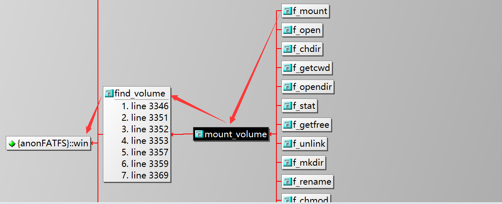

<!-- more -->

我们先来看一下以SPI FLASH为存储介质的FatFs文件系统的移植。

## 一、底层读写

### 1. 初始化

首先我们需要初始化SPI FLASH，在这里我使用的是W25Q128，由于我使用的是STM32CubeMX来配置的SPI，所以初始化就如下函数所示：

```c
/* SPI2 init function */
void MX_SPI2_Init(void);
```

### 2. 获取SPI FLASH器件ID

这一步其实本不是必须，但是由于代码支持了其他型号的SPI FLASH，所以这一步也就成了必要的步骤，其实也有好处，那就是可以通过读取ID来判断我们的SPI FLASH是否已经初始化完成：

```c
/**
  * @brief  获取W25QXX型号
  * @note   目前只支持W25Q128
  * @param  
  * @retval 返回0表示W25Q128状态正常，返回-1表示W25Q128不可用
  */
int8_t Get_W25QXX_Type(void)
{
    W25QXX_TYPE = W25QXX_ReadID();
    //printf("SPI FLASH ID=%#x\r\n", W25QXX_TYPE);
    if(W25QXX_TYPE == 0XEF17)
        return 0;
    else
    {
        PRTE("W25QXX_TYPE not is W25Q128!!!\r\n");
        return -1;
    }
}
```

### 3. 读取数据

```c
/**
  * @brief  读取SPI FLASH
  * @note   在指定地址开始读取指定长度的数据
  * @param  pBuffer 数据存储区
  * @param  ReadAddr 开始读取的地址(24bit)
  * @param  NumByteToRead 要读取的字节数(最大65535)
  * @retval 成功返回0
  */
int8_t W25QXX_Read(uint8_t *pBuffer, uint32_t ReadAddr, uint16_t NumByteToRead)
{
    uint16_t i;
    W25QXX_CS = 0;                     // 使能器件
    SPI2_ReadWriteByte(W25X_ReadData); // 发送读取命令
    if (W25QXX_TYPE == W25Q256)        // 如果是W25Q256的话地址为4字节的，要发送最高8位
    {
        SPI2_ReadWriteByte((uint8_t)((ReadAddr) >> 24));
    }
    SPI2_ReadWriteByte((uint8_t)((ReadAddr) >> 16)); // 发送24bit地址
    SPI2_ReadWriteByte((uint8_t)((ReadAddr) >> 8));
    SPI2_ReadWriteByte((uint8_t)ReadAddr);
    for (i = 0; i < NumByteToRead; i++)
    {
        pBuffer[i] = SPI2_ReadWriteByte(0XFF); // 循环读数
    }
    W25QXX_CS = 1;
    return 0;
}
```

### 4. 写入数据

```c
// 动态管理内存
#ifndef	SRAMIN   
uint8_t W25QXX_BUFFER[4096];
#endif	
/**
  * @brief  向 SPI FLASH 写入指定字节数据
  * @note   在指定地址开始写入指定长度的数据,该函数带擦除操作!
  * @param  pBuffer 数据存储区
  * @param  WriteAddr 开始写入的地址(24bit)
  * @param  NumByteToWrite 要写入的字节数(最大65535)  
  * @retval 成功返回0
  */
int8_t W25QXX_Write(uint8_t *pBuffer, uint32_t WriteAddr, uint16_t NumByteToWrite)
{
    uint32_t secpos;
    uint16_t secoff;
    uint16_t secremain;
    uint16_t i;
    uint8_t *W25QXX_BUF;
#ifdef SRAMIN
    W25QXX_BUF = (uint8_t *)pub_malloc(SRAMIN, 4096); // 申请内存
    if (W25QXX_BUF == NULL)
    {
        PRTE("pub_malloc failed!!!\r\n");
        return -1; // 申请失败
    }
#else
    W25QXX_BUF = W25QXX_BUFFER;
#endif
    secpos = WriteAddr / W25QXX_SECTOR_SIZE; // 扇区地址
    secoff = WriteAddr % W25QXX_SECTOR_SIZE; // 在扇区内的偏移
    secremain = W25QXX_SECTOR_SIZE - secoff; // 扇区剩余空间大小
    // printf("ad:%X,nb:%X\r\n",WriteAddr,NumByteToWrite);//测试用
    if (NumByteToWrite <= secremain)
        secremain = NumByteToWrite; // 不大于4096个字节
    while (1)
    {
        W25QXX_Read(W25QXX_BUF, secpos * W25QXX_SECTOR_SIZE, W25QXX_SECTOR_SIZE); // 读出整个扇区的内容
        for (i = 0; i < secremain; i++)                                           // 校验数据
        {
            if (W25QXX_BUF[secoff + i] != 0XFF)
                break; // 需要擦除
        }
        if (i < secremain) // 需要擦除
        {
            W25QXX_Erase_Sector(secpos);    // 擦除这个扇区
            for (i = 0; i < secremain; i++) // 复制
            {
                W25QXX_BUF[i + secoff] = pBuffer[i];
            }
            W25QXX_Write_NoCheck(W25QXX_BUF, secpos * W25QXX_SECTOR_SIZE, W25QXX_SECTOR_SIZE); // 写入整个扇区
        }
        else
            W25QXX_Write_NoCheck(pBuffer, WriteAddr, secremain); // 写已经擦除了的,直接写入扇区剩余区间.
        if (NumByteToWrite == secremain)
            break; // 写入结束了
        else       // 写入未结束
        {
            secpos++;   // 扇区地址增1
            secoff = 0; // 偏移位置为0

            pBuffer += secremain;        // 指针偏移
            WriteAddr += secremain;      // 写地址偏移
            NumByteToWrite -= secremain; // 字节数递减
            if (NumByteToWrite > W25QXX_SECTOR_SIZE)
                secremain = W25QXX_SECTOR_SIZE; // 下一个扇区还是写不完
            else
                secremain = NumByteToWrite; // 下一个扇区可以写完了
        }
    }
#ifdef SRAMIN
    pub_free(SRAMIN, W25QXX_BUF); // 释放内存
#endif
    return 0;
}
```

## 二、diskio.c文件的移植

接下来，就来一步一步移植这个文件系统，然后看一看中间可能会有什么坑。这一部分主要都是在diskio.c文件中进行移植，这里先不关心配置文件，后边测试的时候会根据出错的情况一步一步修改配置文件。

### 1. drive number

首先，我们需要定义我们的盘符，在 diskio.c 文件的开头有以下几个宏：

```c
/* Definitions of physical drive number for each drive */
#define DEV_RAM		0	/* Example: Map Ramdisk to physical drive 0 */
#define DEV_MMC		1	/* Example: Map MMC/SD card to physical drive 1 */
#define DEV_USB		2	/* Example: Map USB MSD to physical drive 2 */
```

这些宏就表示了不同的存储介质，后边会根据这些宏来调用不同的初始化及读写函数去操作对应的存储设备。我们这里定义两个，一个是SD卡（预留，后边会使用），一个是SPI FLASH：

```c
#define DEV_SDCARD      0	/* Example: Map SD card to physical drive 0 */
#define DEV_SPI_FLASH   1	/* Example: Map SPI FLASH to physical drive 1 */
```

### 2. disk_initialize()

#### 2.1 函数声明

首先是初始化函数disk_initialize()，我们可以参考文档[FatFs - disk_initialize (elm-chan.org)](http://elm-chan.org/fsw/ff/doc/dinit.html)：

```c
DSTATUS disk_initialize (
  BYTE pdrv           /* [IN] Physical drive number */
);
```

这个函数初始化存储设备，并使其准备好进行通用读/写。

#### 2.2 对SPI FLASH初始化

我们来看一下对SPI FLASH的初始化操作：

```c
case DEV_SPI_FLASH:
    //MX_SPI2_Init(); // SPI初始化，在main.c中完成 
    result = Get_W25QXX_Type();// 这里最开始的时候写的是 result = 0; 但是这样是无法完整对SPI FLASH初始化，后边会分析问题所在。
    break;
```

由于我使用的是STM32CubeMX来配置的SPI，所以当STM32CubeMX生成工程的时候，会直接在main函数中进行SPI初始化函数的调用，所以为了后边修改工程方便，这里就不再放对SPI的初始化了。

#### 2.3 移植结果

```c
DSTATUS disk_initialize(
	BYTE pdrv /* Physical drive nmuber to identify the drive */
)
{
	int result = 0;

	switch (pdrv)
	{
		case DEV_SPI_FLASH:
			//MX_SPI2_Init(); // SPI初始化，在main.c中完成
			result = Get_W25QXX_Type();
			break;
		default:
			result = -1;
			break;
	}
	if(result == 0)
		return RES_OK;
	else
		return STA_NOINIT; //初始化失败
}
```

### 3. disk_status()

#### 3.1 函数声明

这个函数主要是获取设备的状态，其实这个函数并不重要，我们甚至可以让它永远返回一个成功测标志。我们可以参考：[FatFs - disk_status (elm-chan.org)](http://elm-chan.org/fsw/ff/doc/dstat.html)

```c
DSTATUS disk_status (
  BYTE pdrv     /* [IN] Physical drive number */
);
```

#### 3.2 对SPI FLASH的状态检测

我们可以将获取W25Q128器件ID的操作放在状态读取的函数中，这样也可以确保我们的SPI FLASH可以正常运行：

```c
case DEV_SPI_FLASH:
    result = Get_W25QXX_Type();
    break;
```

#### 3.3 移植结果

```c
DSTATUS disk_status(
	BYTE pdrv /* Physical drive nmuber to identify the drive */
)
{
	int result = 0;

	switch (pdrv)
	{
		case DEV_SPI_FLASH:
			result = Get_W25QXX_Type();
			break;
		default:
			result = -1;
			break;
	}
	if(result == 0)
		return RES_OK;
	else
		return STA_NOINIT;
}
```

### 4. disk_read()

#### 4.1 函数声明

这个函数主要是读取数据，我们可以参考：[FatFs - disk_read (elm-chan.org)](http://elm-chan.org/fsw/ff/doc/dread.html)

```c
DRESULT disk_read (
  BYTE pdrv,     /* [IN] Physical drive number */
  BYTE* buff,    /* [OUT] Pointer to the read data buffer */
  LBA_t sector,  /* [IN] Start sector number */
  UINT count     /* [IN] Number of sectros to read */
);
```

**【函数参数】**

- pdrv ：用于标识目标设备的物理驱动器号。

- buff ：指向字节数组中用于存储读取数据的第一个数据的指针。读取数据的大小将是 扇区大小x字节数。

- sector ：启动扇区号。数据类型 LBA_t 是 DWORD 或 QWORD 的别名，具体取决于配置选项。

- count ：要读取的扇区数。

**【注意事项】**FatFs每次操作，都是以扇区为基本单位的。

#### 4.2 从SPI FLASH读取

```c
case DEV_SPI_FLASH:
    result = W25QXX_Read((uint8_t *)buff, sector * 4096, count * 4096);
    break;
```

前边我们知道，W25Q128将16MB的容量分为256个块（Block），每个块大小为64K字节，每个块又分为16个扇区（Sector），每个扇区4K个字节。而我们操作W25Q128的时候每次也是擦除一个扇区，也就是4KB，16M的空间，一共就有4096个扇区，而扇区号乘以扇区大小就可以得到整个扇区的起始地址。count 表示扇区的数量，每个扇区4KB，相乘就可以得到要读取的字节数量。

#### 4.3 移植结果

```c
DRESULT disk_read(
	BYTE pdrv,	  /* Physical drive nmuber to identify the drive */
	BYTE *buff,	  /* Data buffer to store read data */
	LBA_t sector, /* Start sector in LBA */
	UINT count	  /* Number of sectors to read */
)
{
	int result = 0;

	switch (pdrv)
	{
		case DEV_SPI_FLASH:
			result = W25QXX_Read((uint8_t *)buff, sector * 4096, count * 4096);
			break;
		default:
			result = -1;
			break;
	}
	if(result == 0)
		return RES_OK;
	else
		return RES_ERROR;
}
```

### 5. disk_write()

#### 5.1 函数声明

这个函数主要是写入数据，我们可以参考：[FatFs - disk_write (elm-chan.org)](http://elm-chan.org/fsw/ff/doc/dwrite.html)

```c
DRESULT disk_write (
  BYTE pdrv,        /* [IN] Physical drive number */
  const BYTE* buff, /* [IN] Pointer to the data to be written */
  LBA_t sector,     /* [IN] Sector number to write from */
  UINT count        /* [IN] Number of sectors to write */
);
```

**【函数参数】**

- pdrv ：用于标识目标设备的物理驱动器号。

- buff ：指向字节数组中用于存储写入数据的第一个数据的指针。写入数据的大小将是 扇区大小x字节数。

- sector ：启动扇区号。数据类型 LBA_t 是 DWORD 或 QWORD 的别名，具体取决于配置选项。

- count ：要读取的扇区数。

**【注意事项】**FatFs每次操作，都是以扇区为基本单位的。

#### 5.2 向SPI FLASH写入

```c
case DEV_SPI_FLASH:
    result = W25QXX_Write((uint8_t *)buff, sector * 4096, count * 4096);
    break;
```

这里与前边的读一样，都是以扇区为单位操作，将参数传入底层写入函数的时候需要转换为相应的地址。

#### 5.3 移植结果

```c
DRESULT disk_write(
	BYTE pdrv,		  /* Physical drive nmuber to identify the drive */
	const BYTE *buff, /* Data to be written */
	LBA_t sector,	  /* Start sector in LBA */
	UINT count		  /* Number of sectors to write */
)
{
	int result = 0;

	switch (pdrv)
	{
		case DEV_SPI_FLASH:
			result = W25QXX_Write((uint8_t *)buff, sector * 4096, count * 4096);
			break;
		default:
			result = -1;
			break;
	}

	if(result == 0)
		return RES_OK;
	else
		return RES_ERROR;
}
```

### 6. disk_ioctl()

#### 6.1 函数声明

这个函数主要是用于控制设备，可根据不同命令执行不同功能，我们可以参考：[FatFs - disk_ioctl (elm-chan.org)](http://elm-chan.org/fsw/ff/doc/dioctl.html)

```c
DRESULT disk_ioctl (
  BYTE pdrv,     /* [IN] Drive number */
  BYTE cmd,      /* [IN] Control command code */
  void* buff     /* [I/O] Parameter and data buffer */
);
```

**【函数参数】**

- pdrv ：用于标识目标设备的物理驱动器号。

- cmd ：命令编号，比如GET_SECTOR_COUNT、GET_SECTOR_SIZE、GET_BLOCK_SIZE等，详细的命令及含义可以参考官方文档说明。

- buff ：参数的指针取决于命令代码。不要在意该命令是否没有要传递的参数。

#### 6.2 获取SPI FLASH信息

```c
case DEV_SPI_FLASH:
    switch(cmd)
    {
        case GET_SECTOR_COUNT:// 扇区数量
            *(DWORD *)buff = 256 * 16;//256块x16个扇区
            break;
        case GET_SECTOR_SIZE:// 扇区大小
            *(WORD *)buff = 4096;// 每个扇区是4KB
            break;
        case GET_BLOCK_SIZE:// 每次擦除块的大小的个数
            *(DWORD *)buff = 1;// 每次只擦除一个扇区
        default:
            break;
    }
    result = 0;
    break;
```

#### 6.3 移植结果

```c
DRESULT disk_ioctl(
	BYTE pdrv, /* Physical drive nmuber (0..) */
	BYTE cmd,  /* Control code */
	void *buff /* Buffer to send/receive control data */
)
{
	int result = 0;

	switch (pdrv)
	{
		case DEV_SPI_FLASH:
			switch(cmd)
			{
				case GET_SECTOR_COUNT:// 扇区数量
					*(DWORD *)buff = 256 * 16;//256块x16个扇区
					//*(DWORD *)buff = FLASH_SECTOR_COUNT;//12M/512B个扇区
					break;
				case GET_SECTOR_SIZE:// 扇区大小
					*(WORD *)buff = 4096;// 每个扇区是4KB
					//*(WORD *)buff = FLASH_SECTOR_SIZE;// 每个扇区是512B
					break;
				case GET_BLOCK_SIZE:// 每次擦除块的大小的个数
					*(DWORD *)buff = 1;// 每次只擦除一个扇区
					//*(DWORD *)buff = FLASH_BLOCK_SIZE;// 每次只擦除一个大扇区，512*8=4096
				default:
					break;
			}
			result = 0;
			break;
		default:
			result = -1;
			break;
	}

	if(result == 0)
		return RES_OK;
	else
		return RES_ERROR;
}
```

## 三、 ffconf.h文件的配置

这一节我们通过报错来看一下不同的配置项有什么影响。我们这部分以例子来说明。

### 1. FF_VOLUMES

测试函数我们用f_mount来尝试：

```c
static FATFS fs = {0}; // FatFs文件系统对象
static BYTE work[FF_MAX_SS];  // 格式化设备工作区
void fatfs_Test(void)
{
    FRESULT res = FR_OK;
	res = f_mount(&fs, "1:", 1); // 挂载FLASH.
	if(res != FR_OK)
    {
        printf("f_mount error:%s\r\n", API_RET[res]);
    }
}
```

然后我们调用并打印，会有如下打印：

```c
f_mount error:(11) The logical drive number is invalid
```

这是怎么回事？我们来看一下，报错写的是我们的逻辑驱动器编号不合法，我们看一下我们定义的drive number，发现SPI FLASH是1，这没问题啊，我们从f_mount()函数一级一级往下找，发现我们的驱动器编号收到这个宏的限制 FF_VOLUMES，它表示我们的文件系统最多支持多少个驱动器，也就是存储设备，我们这个宏默认是1，那么我们挂载的时候就只能挂载 "0:" ，我们修改宏为2：

```c
#define FF_VOLUMES		2
/* Number of volumes (logical drives) to be used. (1-10) */
```

### 2. FF_MAX_SS

不出意外的话上边宏改完，就不会报11这个错了，但是我们会进入另一个错误：

```c
[error]HardFault!!!
```

这是什么？这是我们之前添加的硬件错误中断中打印的，怎么会发生这样一个错误？一般来讲都是内存溢出，或者访问了空的指针才会出现。我们还记得上边的FATFS结构体吧，里边有一个成员 win[FF_MAX_SS]，我们看一下这个宏默认是512，所以这是一个512字节的数组，由于我们定义的fs是个全局变量，所以栈空间应该不会溢出，那怎么回事呢？我们现在用的SPI FLASH一个扇区是4096字节，并且我们在disk_ioctl()函数中已经设置了一个扇区为4096，若是初始化的时候操作SPI FLASH用到这个扇区大小的话，可能就溢出了，这也很有可能就会导致上边的错误，我们来看一下函数调用关系（Source Insight）：



发现f_mount()函数挂载会使用到这个成员，那么基本就可以验证我们的猜想了，所以我们需要将此处改为4096：

```c
#define FF_MIN_SS		512
#define FF_MAX_SS		4096
/* This set of options configures the range of sector size to be supported. (512,
/  1024, 2048 or 4096) Always set both 512 for most systems, generic memory card and
/  harddisk, but a larger value may be required for on-board flash memory and some
/  type of optical media. When FF_MAX_SS is larger than FF_MIN_SS, FatFs is configured
/  for variable sector size mode and disk_ioctl() function needs to implement
/  GET_SECTOR_SIZE command. */
```

然后我们再编译下载，就会产生其他错误了，就不会再是这个硬件出错误了：

### 3. FF_USE_MKFS

新的bug：

```c
f_mount error:(13) There is no valid FAT volume
```

这又是什么？There is no valid FAT volume翻译过来就是没有有效的FAT卷，也就是没有文件系统，这样就可以理解了，原本我们的SPI FLASH就什么都没有。那么现在我们就需要格式化SPI FLASH 来创建一个文件系统，这个时候就需要用到f_mkfs()函数啦，我们修改测试函数如下：

```c
static FATFS fs = {0}; // FatFs文件系统对象
static BYTE work[FF_MAX_SS];  // 格式化设备工作区
void fatfs_Test(void)
{
    FRESULT res = FR_OK;
	res = f_mount(&fs, "1:", 1); // 挂载FLASH.
	if(res != FR_OK)
    {
        printf("f_mount error:%s\r\n", API_RET[res]);
        if (res == FR_NO_FILESYSTEM) // FLASH磁盘,FAT文件系统错误,重新格式化FLASH
        {
            printf("Flash Disk Formatting...\r\n"); // 格式化FLASH

            res = f_mkfs("1:", 0, work, sizeof(work)); // 格式化FLASH,1,盘符;1,不需要引导区,8个扇区为1个簇
            if (res == FR_OK)
            {
                printf("f_mkfs:Flash Disk Format Finish!!!\r\n"); // 格式化完成
                res = f_mount(NULL, "1:", 1);              // 格式化后，先取消挂载
                res = f_mount(&fs, "1:", 1);               // 重新挂载
                if(res != FR_OK)
                {
                    printf("f_mount error:%s\r\n", API_RET[res]);
                    return;
                }
            }
            else
            {
                printf("f_mkfs error:%s\r\n", API_RET[res]); // 格式化失败
                return;
            }
        }
    }
}

```

然后我们发现编译直接报错：

```c
Error: L6218E: Undefined symbol f_mkfs (referred from fatfs_ex.o).
```

发现没有定义这个符号，也就是没有这个函数，我们找一下这个函数，会发现，它受到这个宏的影响：


我们要向使用这个宏，不能是只读的文件系统，并且还要开启FF_USE_MKFS，FF_FS_READONLY默认就是0，所以不用管。

```c
#define FF_FS_READONLY  0
#define FF_USE_MKFS		1
/* This option switches f_mkfs() function. (0:Disable or 1:Enable) */
```

### 4. SPI FLASH的一个BUG

然后我们重新编译下载运行，发现我们重新挂载的时候又报错了：

```c
f_mount error:(13) There is no valid FAT volume 
Flash Disk Formatting...
f_mkfs:Flash Disk Format Finish!!!
f_mount error:(13) There is no valid FAT volume 
```

上边明明显示我们格式化完成了，但是依然没有成功创建文件系统，网上搜索了资料，配置文件到这里其实就可以了，我们再检查一下是不是写被禁止了，但是上边我们的文件系统根本就不是只读的，那么就有可能是我们底层接口问题了，还记得我们使用SPI FLASH的时候是要先擦除才能写入的，但是我们初始化函数中似乎并没有进行擦除，那么有又怎么把文件系统创建上去呢？所以我们在初始化的时候对扇区进行一次擦除，但是我们的写函数中已经内置了擦除功能了，那问题出在哪？

我后来直接在fatfs_Test()函数调用之前就读写一次SPI FLASH，发现之后就正常了，那么还是我们初始化的问题，问题就出现在我们的Get_W25QXX_Type()函数中，由于我们底层的SPI FLASH还可以支持其他类型的SPI FLASH，所以在使用之前是需要先获取ID的，但是我把这个函数放在了disk_status()中吗，就导致初始化有问题了，这个函数既可以用来确认SPI FLASH的状态，也是初始化所必要的所以我们需要修改一下 disk_initialize() 中对SPI FLASH的初始化，调用一次Get_W25QXX_Type()函数即可，然后再编译，下载运行就会发现，我们可以正常格式化以及挂载文件系统了：

```c
SPI FLASH ID=0xef17
f_mount success!!!
```
