<!-- more -->

这一节开始，我们来学习一下正点原子的ESP8266模块。

## 一、ESP8266？

### 1. ESP8266是什么？

ESP8266其实是由乐鑫公司推出的一款WIFI芯片，而国内的一些物联网公司基于乐鑫的ESP8266芯片开发出了许多WIFI模块，这些WIFI模块大多以ESP8266作为前缀命名，因此我们通常用ESP8266指ESP8266WIFI模块。

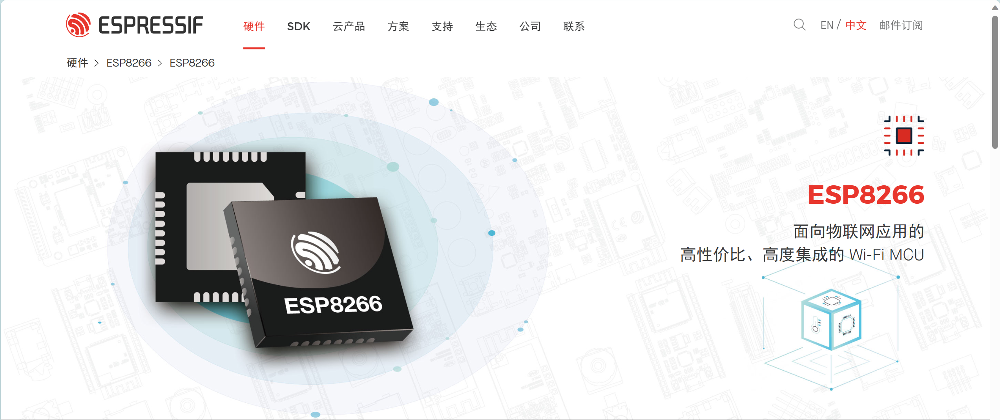

平常使用较多的ESP8266WIFI模块是国内安信可公司开发的，安信可公司开发的ESP8266WIFI模块有数十款，分为ESP-01、ESP-07、ESP-12三个系列，每个系列又包含不同的后缀进行细分，安信可公司这数十款WIFI模块的主芯片基本上都是乐鑫公司的ESP8266，不同型号间的主要区别是模块的尺寸、IO口数量、Flash容量大小，有的Flash是8Mbit而有的是32Mbit。这些型号间的具体区别如下图所示。

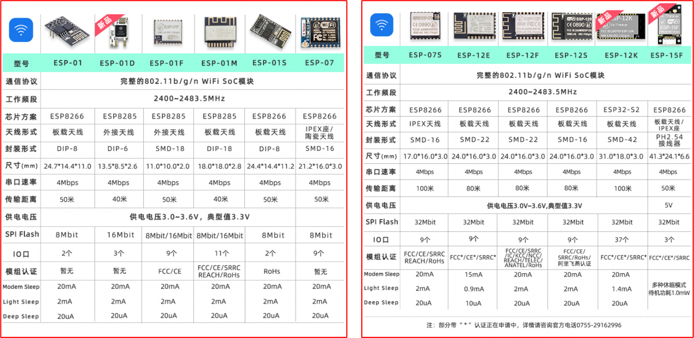

### 2. 有哪些特点？

- 802.11 b/g/n
- 内置Tensilica L106 超低功耗 32 位微型 MCU，主频支持 80 MHz 和160 MHz，支持 RTOS
- 内置10 bit高精度ADC
- 内置TCP/IP协议栈
- 内置TR 开关、balun、LNA、功率放大器和匹配网络
- 内置PLL、稳压器和电源管理组件，802.11b 模式下+18 dBm的输出功率
- A-MPDU 、 A-MSDU 的聚合和 0.4 s的保护间隔
- Wi-Fi @ 2.4 GHz，支持 WPA/WPA2 安全模式
- 支持AT本地升级及云端OTA升级
- 支持 STA/AP/STA+AP 工作模式
- 支持 Smart Config 功能（包括 Android 和 IOS 设备）
- HSPI 、UART、I2C、I2S、IR Remote Control、PWM、GPIO
- 深度睡眠保持电流为 20 uA，关断电流小于 5 uA
- 2 ms 之内唤醒、连接并传递数据包
- 待机状态消耗功率小于1.0 mW (DTIM3)
- 工作温度范围：详情请见具体型号规格书

### 3. 相关资料

乐鑫官网：[无线通信 SoC、软件、云和 AIoT 方案｜乐鑫科技 (espressif.com.cn)](https://www.espressif.com.cn/zh-hans)

安信可官网：[欢迎 | 安信可科技 (ai-thinker.com)](https://docs.ai-thinker.com/)

## 二、ATK-MW8266模块

### 1. 模块简介

ATK-MW8266D 模块是正点原子推出的一款高性能 UART-WIFI（串口-无线）模块，ATK-MW8266D 模块板载了正点原子公司自主研发的 ATK-ESP-01 模块，该模块通过 FCC、CE 认证，可直接用于出口欧美地区的产品。但其实里面用的应该是ESP8266芯片，只是这里自己做成了对应的模块，方便开发。

ATK-MW8266D 模块采用串口（ LVTTL）与 MCU（或其他串口设备）通讯，且内置 TCP/IP协议栈，能够实验串口与 WIFI 之间的转换。 通过 ATK-MW8266D 模块，传统的串口设备只需要简单的串口配置，即可通过网络（ WIFI）传输自己的数据。

ATK-MW8266D 模块支持 LVTTL 串口，兼容 3.3Vh 和 5V 单片机系统，可以很方便得与其他产品进行连接。 同时，该模块支持还多种工作模式： WIFI STA、 WIFI AP、 WIFI STA+WIFI AP， 从而能够快速地构建串口-WIFI 的数据传输方案， 方便其他设备使用互联网传输数据。  

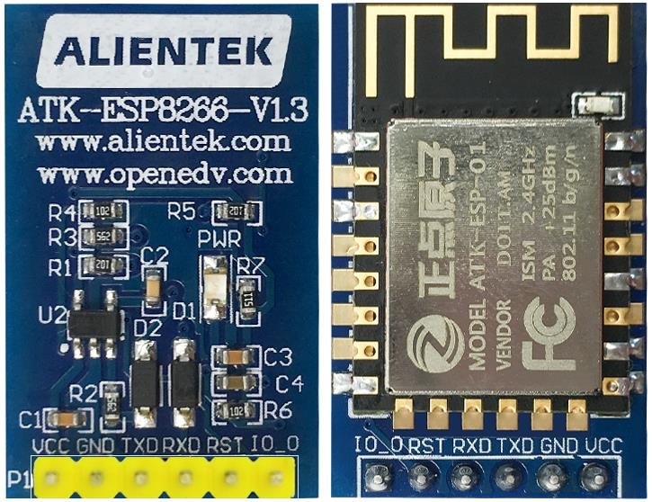

### 2. 特性参数

#### 2.1 基本参数  

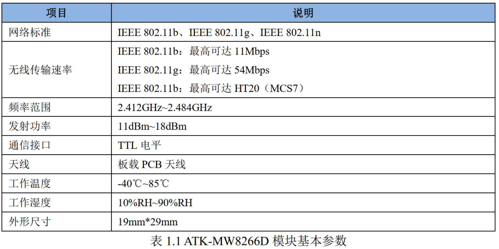

#### 2.2 功能特性

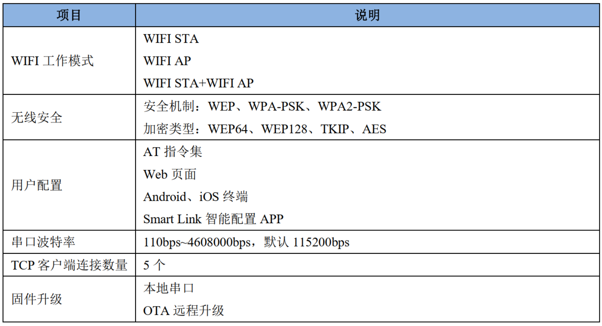

#### 2.3 电气参数  

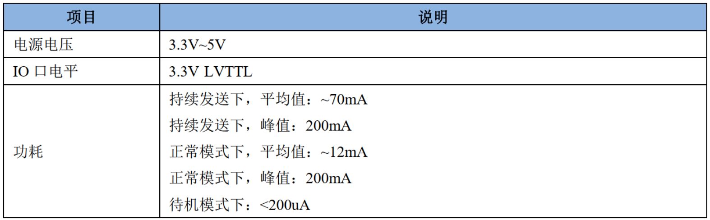

#### 2.4 模块引脚说明

模块示意图如上图，引脚说明如下：

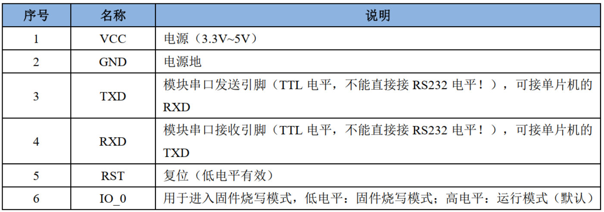

### 3. ATK-ESP-01 介绍  

#### 3.1 简介

ATK-ESP-01 Wi-Fi 模块是由广州市星翼电子科技有限公司开发，该模块核心处理器 ESP8266 在较小尺寸封装中集成了业界领先的 Tensilica L106 超低功耗 32 位微型 MCU，带有 16 位精简模式，主频支持 80MHz 和 160MHz，支持 RTOS，集成 Wi-Fi MAC/BB/RF/PA/LNA。

ATK-ESP-01模块支持标准的IEEE802.11 b/g/n协议，完整的TCP/IP协议栈。用户可以使用该模块为现有的设备添加联网功能，也可以构建独立的网络控制器。ESP8266 是高性能无线 SOC。以低成本提供最大实用性能。  

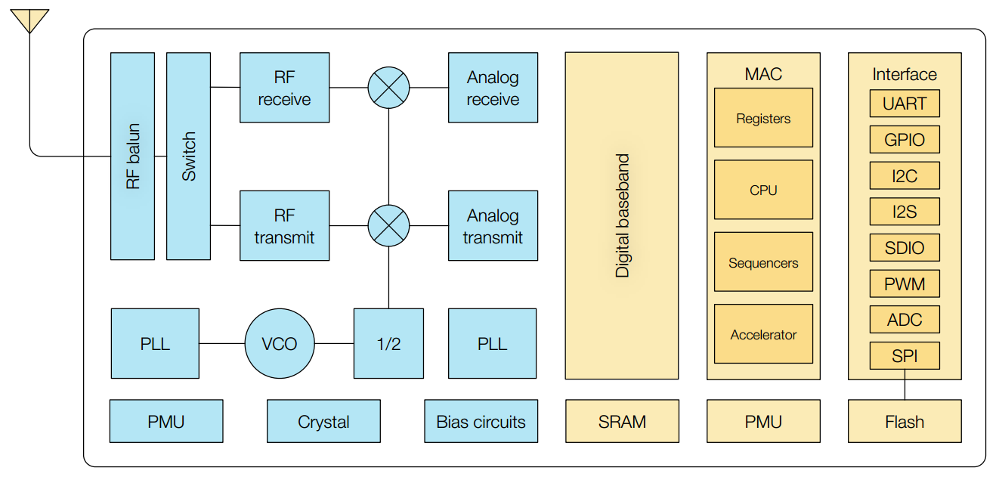

上图是ESP8266的时钟，其实它有中文文档（ESP8266EX产品规格书，官网好像没找到，是正点原子提供的一份参考资料）的：

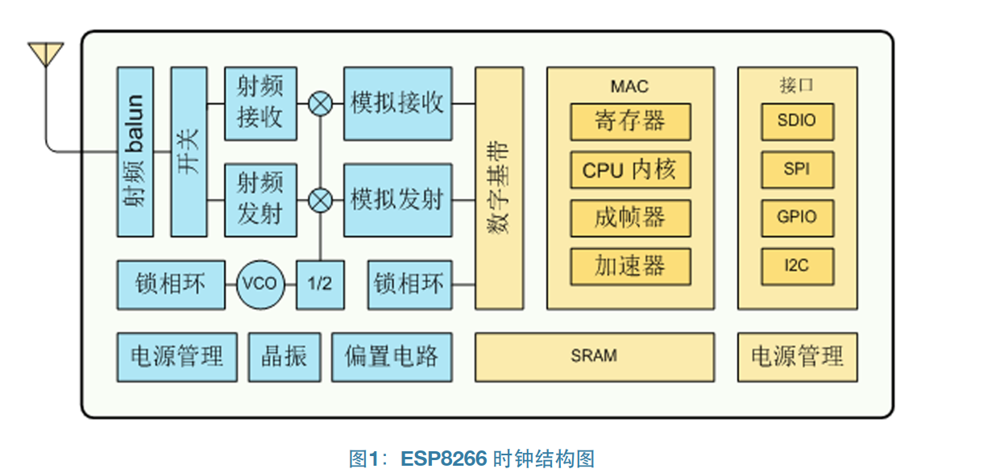

ESP8266 是一个完整且自成体系的 Wi-Fi 网络解决方案，能够独立运行，也可以作为从机搭载于其他主机 MCU 运行。 ESP8266 在搭载应用并作为设备中唯一的应用处理器时，能够直接从外接闪存中启动。内置的高速缓冲存储器有利于提供系统性能，并减少内存需求。

另一种情况是， ESP8266 负责无线上网接入承担 Wi-Fi 适配器的任务时，可以将其添加到任何基于微控制器的设计中，连接简单易行，只需通过 SPI/SDIO接口或 I2C/UART 口即可。

ESP8266 强大的片上处理和存储能力，使其可通过 GPIO 口集成传感器及其他应用的特定设备，实现了最低前期的开发和运行中最少地占用系统资源。  

#### 3.2 外观与引脚

ATK-ESP-01 模块是 ATK-MW8266D 模块的核心部件， ATK-ESP-01 模块一个高性能串口-WIFI 模块，通过 FCC、 CE 认证，可直接用于出口型产品中。模块内嵌 TCP/IP 协议栈，可以实现串口、 WIFI 之间的数据转换传输。 ATK-ESP-01 模块的尺寸图  ：

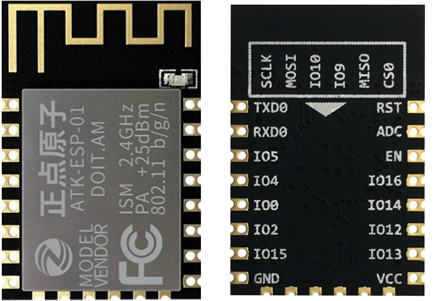

ATK-ESP-01 模块的各个引脚的详细描述，如下表 ：

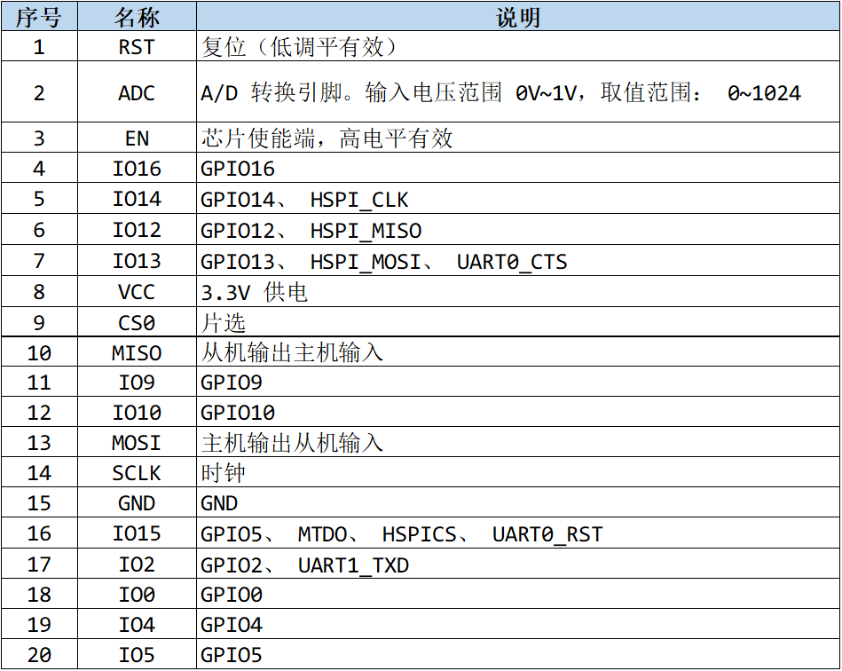

ATK-ESP-01 模组启动模式说明 ：

|   模式   | CH_PD（ EN） | RST  | GPIO15 | GPIO0 | GPIO2 | TXD0 |
| :------: | :----------: | :--: | :----: | :---: | :---: | :--: |
| 下载模式 |      高      |  高  |   低   |  低   |  高   |  高  |
| 运行模式 |      高      |  高  |   低   |  高   |  高   |  高  |

注意：部分引脚已经内部上拉 ，可以看对应的原理图。

#### 3.3 主要参数  

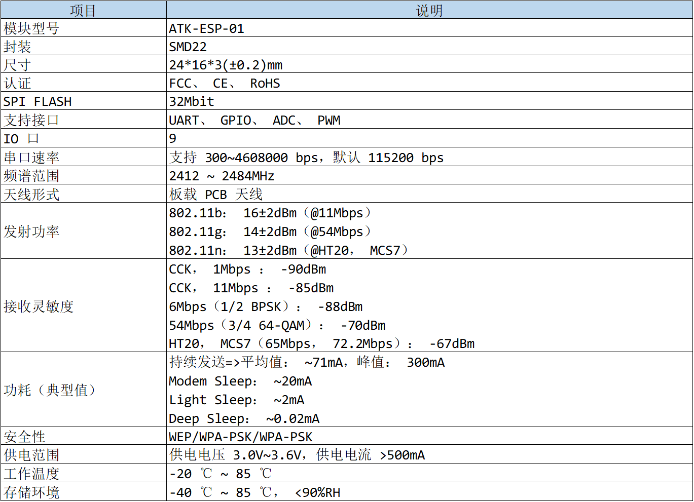

#### 3.4 最小系统

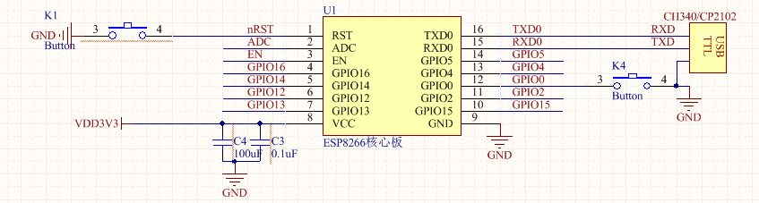

说明：

① 模块 IO 最大输出电流为 12 mA；

② 模块电源典型值为 3.3 V DC；

③ 模块低电平复位有效；

④ 模块固件在线升级需要在满足 3）的条件下， IO0 拉低，并复位模块； 固件升级完成后，GPIO0 释放，并复位模块；

⑤ 模块的 RXD 接 MCU 的 TXD，模块的 TXD 接 MCU 的 RXD；  

### 4. 功能说明

ATK-MW8266D 模块支持三种工作模式，分别为： STA、 AP、 STA+AP。  

- STA 模式

在此模式下， ATK-MW8266D 模块可连接其他设备提供的无线网络， 例如通过 WIFI 连接至路由器， 从而可以访问互联网，进而实现手机或电脑通过互联网实现对设备的远程控制。

- AP 模式

AP 模式为默认的模式，在此模式下， ATK-MW8266D 模块将作为热点供其他设备连接，从而让手机或电脑直接与模块进行通讯，实现局域网的无线控制。

- STA+AP 模式

该模式为 STA 模式与 AP 模式共存的一种模式， ATK-MW8266D 模块既能连接至其他设备提供的无线网络，又能作为热点，供其他设备连接，以实现广域网与局域网的无缝切换，方便操作使用。

除了上述的三种工作模式外， ATK-MW8266D 模块在进行 UDP 连接或作为 TCP 客户端连接时，能够进入透传模式，进入透传模式后， ATK-MW8266D 将会原封不动地把从 TCP服务器或其他 UDP 终端接收到的消息，通过 UART 发送至与之连接的设备。  需要注意：ATK_ESP8266 模块仅在 TCP Client 和 UDP，支持透传模式。  

## 三、参考资料

<table>
	<tbody>
    <tr>
        <td align="center">分类</td>
        <td align="center">网址</td>
        <td align="center">说明</td>
    </tr>
    <tr>
        <td align="left"><a href="https://docs.ai-thinker.com/_media/esp8266/docs/esp8266_start_guide_1_.pdf" target="_blank">ESP8266 系列入门教程</a></td>
        <td align="left">一个入门手册(安信可官网)</td>
    </tr>
    <tr>
        <td align="left"><a href="https://docs.ai-thinker.com/_media/esp8266/esp8266_at_instruction_set_cn.pdf" target="_blank">ESP8266 AT 指令集</a></td>
        <td align="left">这是一篇关于ESSP8266的AT指令集的文档(安信可官网)</td>
    </tr>
    <tr>
        <td align="left"><a href="https://docs.ai-thinker.com/_media/esp8266/esp8266_at_command_examples_cn.pdf" target="_blank">ESP8266 AT 指令使用实例</a></td>
        <td align="left">这是一篇关于ESSP8266的AT指令集使用实例的文档(安信可官网)</td>
    </tr>
    <tr>
        <td align="left"><a href="https://espressif-docs.readthedocs-hosted.com/projects/esp-at/zh-cn/release-v2.2.0.0_esp8266/Get_Started/index.html" target="_blank"> ESP-AT 用户指南</a></td>
        <td align="left">本指南详细介绍 ESP-AT 是什么、如何连接硬件、以及如何下载和烧录 AT 固件(乐鑫官网)</td>
    </tr>
    <tr>
        <td align="left"><a href="https://www.espressif.com.cn/zh-hans/support/documents/technical-documents" target="_blank">乐鑫官方技术文档</a></td>
        <td align="left">这里是乐鑫官方技术文档的入口，文档都可以来这里找(乐鑫官网)</td>
    </tr>
	</tbody>
</table>
