<!-- more -->

## 一、ESSP-AT是什么？

ESP-AT 是乐鑫开发的可直接用于量产的物联网应用固件，旨在降低客户开发成本，快速形成产品。通过 ESP-AT 指令，您可以快速加入无线网络、连接云平台、实现数据通信以及远程控制等功能，真正的通过无线通讯实现万物互联。

ESP-AT 是基于 ESP-IDF 或 ESP8266_RTOS_SDK 实现的软件工程。它使 ESP 模组作为从机，MCU 作为主机。MCU 发送 AT 命令给 ESP 模组，控制 ESP 模组执行不同的操作，并接收 ESP 模组返回的 AT 响应。ESP-AT 提供了大量功能不同的 AT 命令，如 Wi-Fi 命令、TCP/IP 命令、Bluetooth LE 命令、Bluetooth 命令、MQTT 命令、HTTP 命令、Ethernet 命令等。

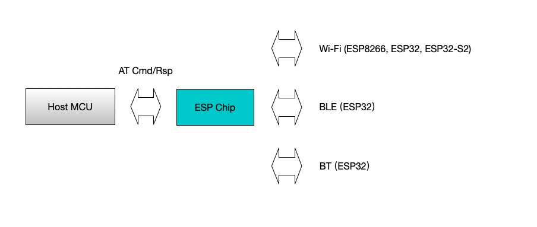

AT 命令以 “AT” 开始，代表 Attention，以新的一行 (CR LF) 为结尾。输入的每条命令都会返回 `OK` 或 `ERROR` 的响应，表示当前命令的最终执行结果。注意，所有 AT 命令均为串行执行，每次只能执行一条命令。因此，在使用 AT 命令时，应等待上一条命令执行完毕后，再发送下一条命令。如果上一条命令未执行完毕，又发送了新的命令，则会返回 `busy p...` 提示。更多有关 AT 命令的信息可参见 [AT 命令集](https://espressif-docs.readthedocs-hosted.com/projects/esp-at/zh-cn/release-v2.2.0.0_esp8266/AT_Command_Set/index.html)。

默认配置下，MCU 通过 UART 连接至 ESP 模组、发送 AT 命令以及接收 AT 响应。但是，您也可以根据实际使用情况修改程序，使用其他的通信接口，例如 SDIO。

## 二、AT 指令格式  

AT 指令可以细分为四种类型，如下表所示：  

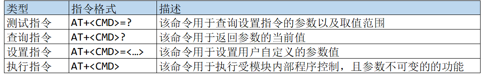

注意：

（1）不是每条 AT 指令都具有以上四种指令格式的命令。

（2）中括号（\[ \]）内的参数为缺省值，不必填写或者可能不显示。

（3）使用双引号表示字符串数据，例如： AT+CWJAP=”ALIENTEK”,”15902020353”。

（4）ATK-MW8266D 模块的 UART 通讯波特率为 115200bps。

（5）AT 指令必须大写，且每条指令都需以回车换行符结尾`\r\n`。

## 三、AT指令说明

模块默认是 AT 指令状态，模块波特率： 115200（8 位数据位， 1 位停止位），这里我们看一下几个用户常用指令，详细的指令集可以参《ESP8266_AT 指令集 V2.1.0.pdf》这个文档。 我们其实可以直接去乐鑫或者安信可官网查阅，例如乐鑫官网的[AT 命令集](https://espressif-docs.readthedocs-hosted.com/projects/esp-at/zh-cn/release-v2.2.0.0_esp8266/AT_Command_Set/index.html#at)。

### 1. 基础AT指令  

- [AT](https://espressif-docs.readthedocs-hosted.com/projects/esp-at/zh-cn/release-v2.2.0.0_esp8266/AT_Command_Set/Basic_AT_Commands.html#cmd-at)：测试 AT 启动
- [AT+RST](https://espressif-docs.readthedocs-hosted.com/projects/esp-at/zh-cn/release-v2.2.0.0_esp8266/AT_Command_Set/Basic_AT_Commands.html#cmd-rst)：重启模块
- [AT+GMR](https://espressif-docs.readthedocs-hosted.com/projects/esp-at/zh-cn/release-v2.2.0.0_esp8266/AT_Command_Set/Basic_AT_Commands.html#cmd-gmr)：查看版本信息
- [AT+CMD](https://espressif-docs.readthedocs-hosted.com/projects/esp-at/zh-cn/release-v2.2.0.0_esp8266/AT_Command_Set/Basic_AT_Commands.html#cmd-cmd)：查询当前固件支持的所有命令及命令类型
- [ATE](https://espressif-docs.readthedocs-hosted.com/projects/esp-at/zh-cn/release-v2.2.0.0_esp8266/AT_Command_Set/Basic_AT_Commands.html#cmd-ate)：开启或关闭 AT 回显功能
- [AT+RESTORE](https://espressif-docs.readthedocs-hosted.com/projects/esp-at/zh-cn/release-v2.2.0.0_esp8266/AT_Command_Set/Basic_AT_Commands.html#cmd-restore)：恢复出厂设置
- [AT+UART_CUR](https://espressif-docs.readthedocs-hosted.com/projects/esp-at/zh-cn/release-v2.2.0.0_esp8266/AT_Command_Set/Basic_AT_Commands.html#cmd-uartc)：设置 UART 当前临时配置，不保存到 flash
- [AT+UART_DEF](https://espressif-docs.readthedocs-hosted.com/projects/esp-at/zh-cn/release-v2.2.0.0_esp8266/AT_Command_Set/Basic_AT_Commands.html#cmd-uartd)：设置 UART 默认配置, 保存到 flash
- [AT+SYSSTORE](https://espressif-docs.readthedocs-hosted.com/projects/esp-at/zh-cn/release-v2.2.0.0_esp8266/AT_Command_Set/Basic_AT_Commands.html#cmd-sysstore)：设置参数存储模式
- [AT+SYSREG](https://espressif-docs.readthedocs-hosted.com/projects/esp-at/zh-cn/release-v2.2.0.0_esp8266/AT_Command_Set/Basic_AT_Commands.html#cmd-sysreg)：读写寄存器

### 2. WiFi功能AT指令

- [AT+CWMODE](https://espressif-docs.readthedocs-hosted.com/projects/esp-at/zh-cn/release-v2.2.0.0_esp8266/AT_Command_Set/Wi-Fi_AT_Commands.html#cmd-mode)：查询/设置 Wi-Fi 模式 (Station/SoftAP/Station+SoftAP)
- [AT+CWJAP](https://espressif-docs.readthedocs-hosted.com/projects/esp-at/zh-cn/release-v2.2.0.0_esp8266/AT_Command_Set/Wi-Fi_AT_Commands.html#cmd-jap)：连接 AP
- [AT+CWLAP](https://espressif-docs.readthedocs-hosted.com/projects/esp-at/zh-cn/release-v2.2.0.0_esp8266/AT_Command_Set/Wi-Fi_AT_Commands.html#cmd-lap)：扫描当前可用的 AP
- [AT+CWQAP](https://espressif-docs.readthedocs-hosted.com/projects/esp-at/zh-cn/release-v2.2.0.0_esp8266/AT_Command_Set/Wi-Fi_AT_Commands.html#cmd-qap)：断开与 AP 的连接
- [AT+CWSAP](https://espressif-docs.readthedocs-hosted.com/projects/esp-at/zh-cn/release-v2.2.0.0_esp8266/AT_Command_Set/Wi-Fi_AT_Commands.html#cmd-sap)：配置 ESP32 SoftAP 参数
- [AT+CWLIF](https://espressif-docs.readthedocs-hosted.com/projects/esp-at/zh-cn/release-v2.2.0.0_esp8266/AT_Command_Set/Wi-Fi_AT_Commands.html#cmd-lif)：查询连接到 ESP SoftAP 的 station 信息
- [AT+CWQIF](https://espressif-docs.readthedocs-hosted.com/projects/esp-at/zh-cn/release-v2.2.0.0_esp8266/AT_Command_Set/Wi-Fi_AT_Commands.html#cmd-qif)：断开 station 与 ESP SoftAP 的连接
- [AT+CWAUTOCONN](https://espressif-docs.readthedocs-hosted.com/projects/esp-at/zh-cn/release-v2.2.0.0_esp8266/AT_Command_Set/Wi-Fi_AT_Commands.html#cmd-autoc)：上电是否自动连接 AP
- [AT+CIPSTAMAC](https://espressif-docs.readthedocs-hosted.com/projects/esp-at/zh-cn/release-v2.2.0.0_esp8266/AT_Command_Set/Wi-Fi_AT_Commands.html#cmd-stamac)：查询/设置 ESP Station 的 MAC 地址
- [AT+CIPAPMAC](https://espressif-docs.readthedocs-hosted.com/projects/esp-at/zh-cn/release-v2.2.0.0_esp8266/AT_Command_Set/Wi-Fi_AT_Commands.html#cmd-apmac)：查询/设置 ESP SoftAP 的 MAC 地址
- [AT+CIPSTA](https://espressif-docs.readthedocs-hosted.com/projects/esp-at/zh-cn/release-v2.2.0.0_esp8266/AT_Command_Set/Wi-Fi_AT_Commands.html#cmd-ipsta)：查询/设置 ESP Station 的 IP 地址
- [AT+CIPAP](https://espressif-docs.readthedocs-hosted.com/projects/esp-at/zh-cn/release-v2.2.0.0_esp8266/AT_Command_Set/Wi-Fi_AT_Commands.html#cmd-ipap)：查询/设置 ESP SoftAP 的 IP 地址
- [AT+CWSTARTSMART](https://espressif-docs.readthedocs-hosted.com/projects/esp-at/zh-cn/release-v2.2.0.0_esp8266/AT_Command_Set/Wi-Fi_AT_Commands.html#cmd-starts)：开启 SmartConfig
- [AT+CWSTOPSMART](https://espressif-docs.readthedocs-hosted.com/projects/esp-at/zh-cn/release-v2.2.0.0_esp8266/AT_Command_Set/Wi-Fi_AT_Commands.html#cmd-stops)：停止 SmartConfig
- [AT+WPS](https://espressif-docs.readthedocs-hosted.com/projects/esp-at/zh-cn/release-v2.2.0.0_esp8266/AT_Command_Set/Wi-Fi_AT_Commands.html#cmd-wps)：设置 WPS 功能
- [AT+MDNS](https://espressif-docs.readthedocs-hosted.com/projects/esp-at/zh-cn/release-v2.2.0.0_esp8266/AT_Command_Set/Wi-Fi_AT_Commands.html#cmd-mdns)：设置 mDNS 功能
- [AT+CWHOSTNAME](https://espressif-docs.readthedocs-hosted.com/projects/esp-at/zh-cn/release-v2.2.0.0_esp8266/AT_Command_Set/Wi-Fi_AT_Commands.html#cmd-hostname)：查询/设置 ESP Station 的主机名称

### 3. TCP/IP相关AT指令

- [AT+CIPSTATUS](https://espressif-docs.readthedocs-hosted.com/projects/esp-at/zh-cn/release-v2.2.0.0_esp8266/AT_Command_Set/TCP-IP_AT_Commands.html#cmd-status)：查询 TCP/UDP/SSL 连接状态和信息
- [AT+CIPDOMAIN](https://espressif-docs.readthedocs-hosted.com/projects/esp-at/zh-cn/release-v2.2.0.0_esp8266/AT_Command_Set/TCP-IP_AT_Commands.html#cmd-domain)：域名解析
- [AT+CIPSTART](https://espressif-docs.readthedocs-hosted.com/projects/esp-at/zh-cn/release-v2.2.0.0_esp8266/AT_Command_Set/TCP-IP_AT_Commands.html#cmd-start)：建立 TCP 连接、UDP 传输或 SSL 连接
- [AT+CIPSTARTEX](https://espressif-docs.readthedocs-hosted.com/projects/esp-at/zh-cn/release-v2.2.0.0_esp8266/AT_Command_Set/TCP-IP_AT_Commands.html#cmd-startex)：建立自动分配 ID 的 TCP 连接、UDP 传输或 SSL 连接
- [AT+CIPSEND](https://espressif-docs.readthedocs-hosted.com/projects/esp-at/zh-cn/release-v2.2.0.0_esp8266/AT_Command_Set/TCP-IP_AT_Commands.html#cmd-send)：在 [普通传输模式](https://espressif-docs.readthedocs-hosted.com/projects/esp-at/zh-cn/release-v2.2.0.0_esp8266/index_of_abbreviations.html#term-0) 或 Wi-Fi [透传模式](https://espressif-docs.readthedocs-hosted.com/projects/esp-at/zh-cn/release-v2.2.0.0_esp8266/index_of_abbreviations.html#term-1) 下发送数据
- [AT+CIPSENDEX](https://espressif-docs.readthedocs-hosted.com/projects/esp-at/zh-cn/release-v2.2.0.0_esp8266/AT_Command_Set/TCP-IP_AT_Commands.html#cmd-sendex)：在 [普通传输模式](https://espressif-docs.readthedocs-hosted.com/projects/esp-at/zh-cn/release-v2.2.0.0_esp8266/index_of_abbreviations.html#term-0) 下采用扩展的方式发送数据
- [AT+CIPCLOSE](https://espressif-docs.readthedocs-hosted.com/projects/esp-at/zh-cn/release-v2.2.0.0_esp8266/AT_Command_Set/TCP-IP_AT_Commands.html#cmd-close)：关闭 TCP/UDP/SSL 连接
- [AT+CIFSR](https://espressif-docs.readthedocs-hosted.com/projects/esp-at/zh-cn/release-v2.2.0.0_esp8266/AT_Command_Set/TCP-IP_AT_Commands.html#cmd-ifsr)：查询本地 IP 地址和 MAC 地址
- [AT+CIPMUX](https://espressif-docs.readthedocs-hosted.com/projects/esp-at/zh-cn/release-v2.2.0.0_esp8266/AT_Command_Set/TCP-IP_AT_Commands.html#cmd-mux)：启用/禁用多连接模式
- [AT+CIPSERVER](https://espressif-docs.readthedocs-hosted.com/projects/esp-at/zh-cn/release-v2.2.0.0_esp8266/AT_Command_Set/TCP-IP_AT_Commands.html#cmd-server)：建立/关闭 TCP 或 SSL 服务器
- [AT+CIPMODE](https://espressif-docs.readthedocs-hosted.com/projects/esp-at/zh-cn/release-v2.2.0.0_esp8266/AT_Command_Set/TCP-IP_AT_Commands.html#cmd-ipmode)：查询/设置传输模式
- [AT+SAVETRANSLINK](https://espressif-docs.readthedocs-hosted.com/projects/esp-at/zh-cn/release-v2.2.0.0_esp8266/AT_Command_Set/TCP-IP_AT_Commands.html#cmd-savet)：设置开机 [透传模式](https://espressif-docs.readthedocs-hosted.com/projects/esp-at/zh-cn/release-v2.2.0.0_esp8266/index_of_abbreviations.html#term-1) 信息
- [AT+CIPSTO](https://espressif-docs.readthedocs-hosted.com/projects/esp-at/zh-cn/release-v2.2.0.0_esp8266/AT_Command_Set/TCP-IP_AT_Commands.html#cmd-sto)：查询/设置本地 TCP 服务器超时时间
- [AT+PING](https://espressif-docs.readthedocs-hosted.com/projects/esp-at/zh-cn/release-v2.2.0.0_esp8266/AT_Command_Set/TCP-IP_AT_Commands.html#cmd-cipping)：ping 对端主机

## 四、常用AT指令实例

### 1. AP 模式下作 TCP 服务器  

| 发送指令                               | 作用                                                         |
| -------------------------------------- | ------------------------------------------------------------ |
| AT+CWMODE=2                            | 设置为 AP 模式                                               |
| AT+RST                                 | 重启生效                                                     |
| AT+CWSAP=”ATK-MW8266D”, ”12345678”,1,4 | 设置 AP 参数。 SSID 为 ATK-MW8266D、密码为 12345678、 通道为 1、加密方式为 WPA_WPA2_PSK |
| AT+CIPMUX=1                            | 开启多连接                                                   |
| AT+CIPSERVER=1,8086                    | 开启 SERVER 模式，端口号为 8086                              |
| AT+CIPSEND=0,25                        | 向 ID0 发送 25 字节数据包                                    |

### 2. AP 模式下作 TCP 客户端  

| 发送指令                                | 作用                                                         |
| --------------------------------------- | ------------------------------------------------------------ |
| AT+CWMODE=2                             | 设置为 AP 模式                                               |
| AT+RST                                  | 重启生效                                                     |
| AT+CWSAP=”ATK-MW8266D”,”12345678”,1,4   | 设置 AP 参数。 SSID 为 ATK-MW8266D、密码为 12345678、通道为 1、加密方式为 WPA_WPA2_PSK |
| AT+CIPMUX=0                             | 开启单连接                                                   |
| AT+CIPSTART=”TCP”, ”192.168.4.XXX”,8086 | 建立 TCP 连接到 192.168.4.XXX:8086                           |
| AT+CIPMODE=1                            | 开启透传模式（仅单连接 Client 时支持）                       |
| AT+CIPSEND                              | 开始发送数据                                                 |

### 3. AP 模式下 UDP 连接  

| 发送指令                                | 作用                                                         |
| --------------------------------------- | ------------------------------------------------------------ |
| AT+CWMODE=2                             | 设置为 AP 模式                                               |
| AT+RST                                  | 重启生效                                                     |
| AT+CWSAP=”ATK-MW8266D”, ”12345678”,1,4  | 设置 AP 参数。 SSID 为 ATK-MW8266D、密码为 12345678、 通道为 1、加密方式为 WPA_WPA2_PSK |
| AT+CIPMUX=0                             | 开启单连接                                                   |
| AT+CIPSTART=”UDP”, “192.168.4.XXX”,8086 | 建立 UDP 连接到 192.168.4.XXX:8086                           |
| AT+CIPSEND=25                           | 向目标 UDP 发送 25 字节数据                                  |

### 4. STA 模式下作 TCP 服务器  

| 发送指令                           | 作用                                                 |
| ---------------------------------- | ---------------------------------------------------- |
| AT+CWMODE=1                        | 设置为 STA 模式                                      |
| AT+RST                             | 重启生效                                             |
| AT+CWJAP=”ATK-MW8266D”, ”12345678” | 加入 WiFi 热点。 SSID： ATK-MW8266D、密码： 12345678 |
| AT+CIPMUX=1                        | 开启多连接                                           |
| AT+CIPSERVER=1,8086                | 开启 SERVER 模式，端口号为 8086                      |
| AT+CIPSEND=0,25                    | 向 ID0 发送 25 字节数据包                            |

### 5. STA 模式下作 TCP 客户端  

| 发送指令                                | 作用                                                 |
| --------------------------------------- | ---------------------------------------------------- |
| AT+CWMODE=1                             | 设置为 STA 模式                                      |
| AT+RST                                  | 重启生效                                             |
| AT+CWJAP=”ATK-MW8266D”, ”12345678”      | 加入 WiFi 热点。 SSID： ATK-MW8266D、密码： 12345678 |
| AT+CIPMUX=0                             | 开启单连接                                           |
| AT+CIPSTART=”TCP”, ”192.168.4.XXX”,8086 | 建立 TCP 连接到 192.168.4.XXX:8086                   |
| AT+CIPMODE=1                            | 开启透传模式（仅单连接 Client 时支持）               |
| AT+CIPSEND                              | 开始发送数据                                         |

### 6. STA 模式下 UDP 连接  

| 发送指令                                | 作用                                                 |
| --------------------------------------- | ---------------------------------------------------- |
| AT+CWMODE=1                             | 设置为 STA 模式                                      |
| AT+RST                                  | 重启生效                                             |
| AT+CWJAP=”ATK-MW8266D”, ”12345678”      | 加入 WiFi 热点。 SSID： ATK-MW8266D、密码： 12345678 |
| AT+CIPMUX=0                             | 开启单连接                                           |
| AT+CIPSTART=”UDP”, “192.168.4.XXX”,8086 | 建立 UDP 连接到 192.168.4.XXX:8086                   |
| AT+CIPSEND=25                           | 向目标 UDP 发送 25 字节数据                          |

### 7. AP+STA 模式下作 TCP 服务器  

| 发送指令                               | 作用                                                         |
| -------------------------------------- | ------------------------------------------------------------ |
| AT+CWMODE=3                            | 设置为 AP+STA 模式                                           |
| AT+RST                                 | 重启生效                                                     |
| AT+CWSAP=”ATK-MW8266D”, ”12345678”,1,4 | 设置 AP 参数。 SSID 为 ATK-MW8266D、密码为 12345678、 通道为 1、加密方式为 WPA_WPA2_PSK |
| AT+CWJAP=”ALIENTEK”, ”12345678”        | 加入 WiFi 热点。 SSID： ALIENTEK、密码： 12345678            |
| AT+CIPMUX=1                            | 开启多连接                                                   |
| AT+CIPSERVER=1,8086                    | 开启 SERVER 模式，端口号为 8086                              |
| AT+CIPSTO=1200                         | 设置服务器超时时间 1200s                                     |
| AT+CIPSEND=0,25                        | 向 ID0 发送数据                                              |
| AT+CIPSEND=1,25                        | 向 ID1 发送数据                                              |

### 8. AP+STA 模式下作 TCP 客户端  

| 发送指令                                  | 作用                                                         |
| ----------------------------------------- | ------------------------------------------------------------ |
| AT+CWMODE=3                               | 设置为 AP+STA 模式                                           |
| AT+RST                                    | 重启生效                                                     |
| AT+CWSAP=”ATK-MW8266D”, ”12345678”,1,4    | 设置 AP 参数。 SSID 为 ATK-MW8266D、密码为 12345678、 通道为 1、加密方式为 WPA_WPA2_PSK |
| AT+CWJAP=”ALIENTEK”, ”12345678”           | 加入 WiFi 热点。 SSID： ALIENTEK、密码： 12345678            |
| AT+CIPMUX=1                               | 开启多连接                                                   |
| AT+CIPSTART=0,”TCP”, ”192.168.4.XXX”,8086 | 建立 TCP 连接到 192.168.4.XXX:8086                           |
| AT+CIPSEND=0,25                           | 向 ID0 发送数据                                              |
| AT+CIPSEND=1,25                           | 向 ID1 发送数据                                              |

### 9. AP+STA 模式下 UDP 连接  

| 发送指令                                  | 作用                                                         |
| ----------------------------------------- | ------------------------------------------------------------ |
| AT+CWMODE=3                               | 设置为 AP+STA 模式                                           |
| AT+RST                                    | 重启生效                                                     |
| AT+CWSAP=”ATK-MW8266D”, ”12345678”,1,4    | 设置 AP 参数。 SSID 为 ATK-MW8266D、密码为 12345678、 通道为 1、加密方式为 WPA_WPA2_PSK |
| AT+CWJAP=”ALIENTEK”,”12345678”            | 加入 WiFi 热点。 SSID： ALIENTEK、密码： 12345678            |
| AT+CIPMUX=1                               | 开启多连接                                                   |
| AT+CIPSERVER=1,8086                       | 开启服务器，端口号 8086                                      |
| AT+CIPSTO=1200                            | 设置服务器超时时间 1200s                                     |
| AT+CIPSTART=0,”UDP”, “192.168.1.XXX”,8086 | STA 作为 ID0 连接到 192.168.1.XXX:8086                       |
| AT+CIPSEND=0,25                           | 向 ID0 发送数据                                              |
| AT+CIPSEND=1,25                           | 向 ID1 发送数据                                              |

## 五、测试实验

### 1. 使用前准备

#### 1.1 所需工具

（1）ATK-ESP8266 WIFI 模块一个

（2）USB 转 TTL 模块一个（战舰板板载USB 转 TTL）

（3）电脑安装 CH340 驱动（USB 转 TTL 模块必须）  

（4）网络调试助手[网络调试助手软件(ATK-XNET) 版本：v1.8 — 正点原子资料下载中心 1.0.0 文档](http://47.111.11.73/docs/tool/ruanjian/ATK-XNET.html)，在windows下使用的时候发现无论如何模块都连接不上服务器，所以又找了一个Linux下的，说是在虚拟机中可以正常建立服务器并可以连接mNetAssist（[hecanbo/mNetAssist: mNetAssist - A UDP/TCP Assistant (github.com)](https://github.com/hecanbo/mNetAssist)），但是吧，我试了，还是不行，后来觉得没必要在这里浪费时间，写个笔记就算了，后面再说。

（5）串口调试助手：[串口调试助手软件(ATK-XCOM) 版本：v3.0 — 正点原子资料下载中心 1.0.0 文档](http://47.111.11.73/docs/tool/ruanjian/ATK-XCOM.html#)

#### 1.2 硬件连接

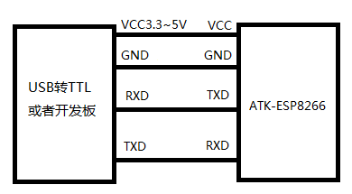

### 2. TCP Client 透传模式测试  

#### 2.1 助手配置

- 网络助手

我们下载上面提到的网络调试助手，并且创建一个server，如下图，注意这里的IP一般都是自动识别：

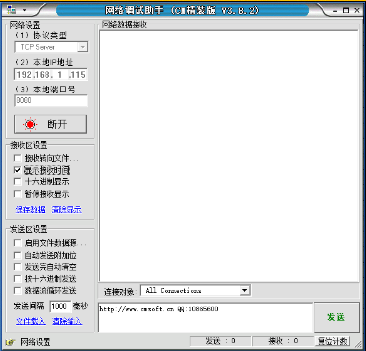

- 串口调试助手

主要是配置一下波特率：

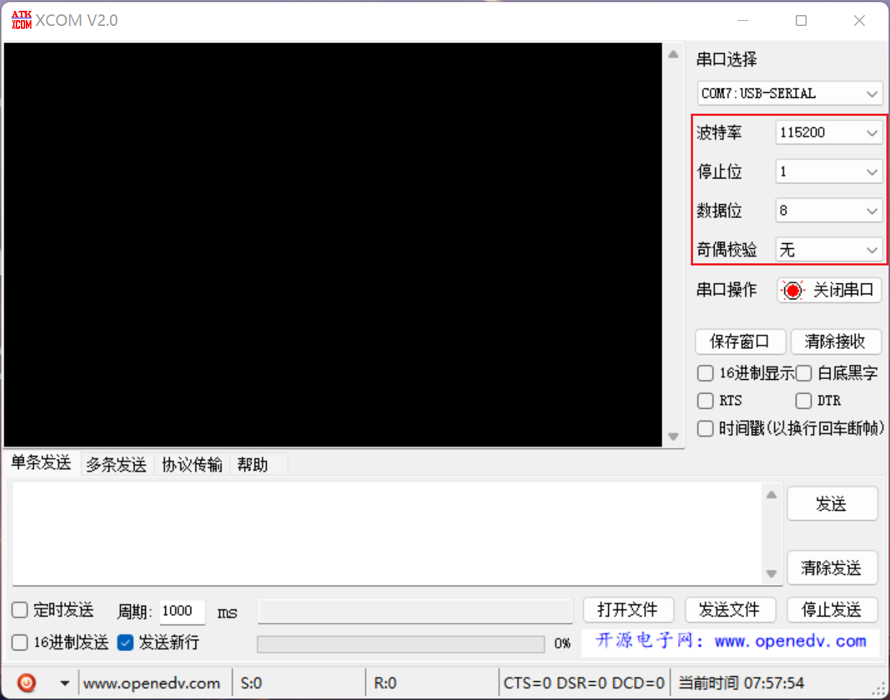

#### 2.2 配置WiFi模块

我们在串口调试助手依次输入以下命令：

| 步骤                   | 命令                                                         | 响应           |
| ---------------------- | ------------------------------------------------------------ | -------------- |
| （1）设置 WIFI 模式    | `AT+CWMODE=1` //设置为 STA 模式                              | OK             |
| （2）重启生效          | `AT+RST`                                                     | OK             |
| （3）连接路由器        | `AT+CWJAP=”ALIENTEK”,”15902020353”` //连接对象路由器的 ssid 和 password | OK             |
| （4）查询模块 IP       | `AT+CIFSR`                                                   | 192.168.1.xxx  |
| （5）模块连接到 server | `AT+CIPSTART="TCP","192.168.19.1",8080`                      | CONNECT<br/>OK |
| （6）开启透传模式      | `AT+CIPMODE=1`                                               | OK             |
| （7） 开始透传         | `AT+CIPSEND`                                                 | OK             |
| （8）退出透传模式      | 在透传模式中，若识别到单独的一包数据“ +++”，则退出透传模式。 |                |

#### 2.3 实验效果

这里的图和实际效果是直接用的正点原子文档里的，因为我自己在尝试的时候发现网络调试助手识别到的本机IP地址和WiFi模块连接后获取的IP并不在一个网段，即便我改了模块的IP，或者说用自己手机开热点，都无法连接到网络助手的服务器，也没找到解决办法，所以这里就看教程大概了解一下好啦。做完上面的前7个步骤，理论上我们就可以成功连接到服务器了：

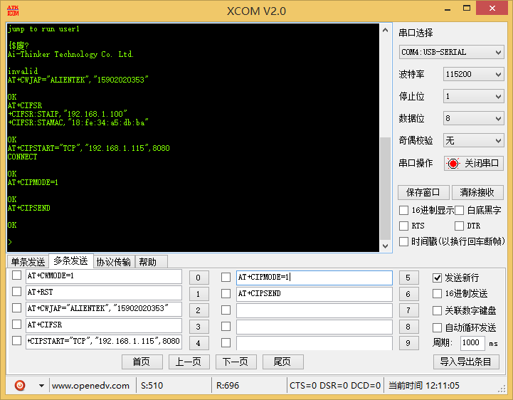

连接上服务器后，就可以相互发数据了，如下图  ：

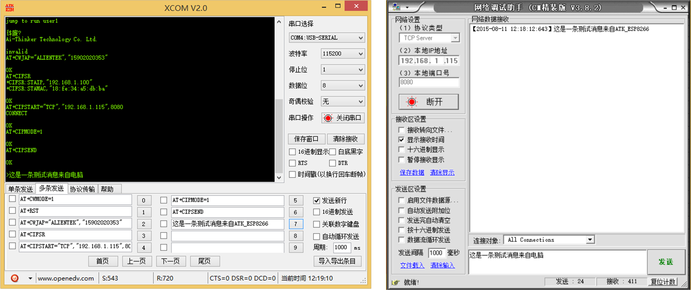

在透传模式中，若识别到单独的一包数据“ +++”，则退出透传模式。

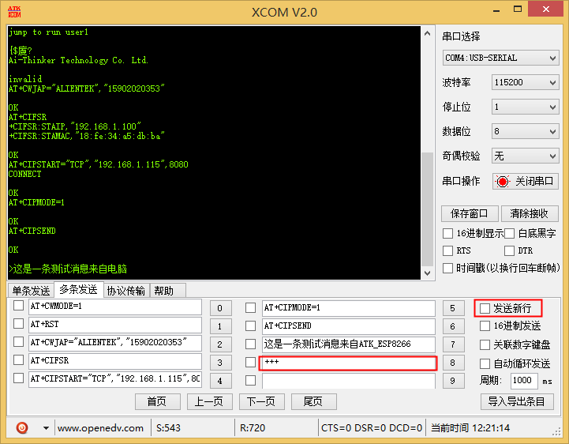

注意：如果需要模块上电自动连接到某个 IP 并进入透传模式，这个时候需要在模块连接到路由器wifi热点之后，发送AT+SAVETRANSLINK=1,"192.168.1.xxx",8086,"TCP"， 设置模块为上电自动连接到 TCP Server：192.168.1.xxx ， 8086 ， 并进入透传模式。当发送AT+SAVETRANSLINK 指令后，模块断电再上电会自动进入透传模式，此时发送 AT 指令模块是不会回复的（即使透传的服务器不存在，模块也会进入透传模式的）。模块要恢复到 AT 指令模式需要先退出透传模式，然后勾选发送新行，再发送“ AT+SAVETRANSLINK=0”，这样上电模块就不会再上电进入透传了。 

### 3. 多连接server 

#### 3.1 配置WiFi模块

前 ATK_ESP8266 模块作为 server，需建立多连接，即可以连接多个 client以下为 ATK_ESP8266 作为 STA 模式建立 TCP SERVER 的设置  

| 步骤                                                  | 命令                                                         | 响应                                        |
| ----------------------------------------------------- | ------------------------------------------------------------ | ------------------------------------------- |
| （1）设置 wifi 模式                                   | `AT+CWMODE=1`  //设置模块为 STA 模式                         | OK                                          |
| （2）重启生效                                         | `AT+RST`                                                     | OK                                          |
| （3）连接路由器                                       | `AT+CWJAP=”ALIENTEK”,”15902020353”` //连接对象路由器的 ssid 和 password | OK                                          |
| （4）启动多链接                                       | `AT+CIPMUX=1  `                                              | OK                                          |
| （5）建立 server                                      | `AT+CIPSERVER=1,8080` //设置端口号为 8080                    | OK                                          |
| （6）获取模块 IP 地址                                 | `AT+CIFSR  `                                                 | OK  <br>IP      // IP地址<br>MAC // MAC地址 |
| （7）电脑或者手机连接到 server，电脑或手机作为 client | 无                                                           | 无                                          |
| （8）模块向指定通道发送数据                           | `AT+CIPSEND=id,size`<br>id：client 通道号<br>size：要发送的数据长度 | OK<br>&gt;                                  |
| （9）接收数据                                         | +IPD,id,size:  //id:收到数据的 client 通道号， size:接收到的数据长度 | OK                                          |

#### 3.2 助手配置

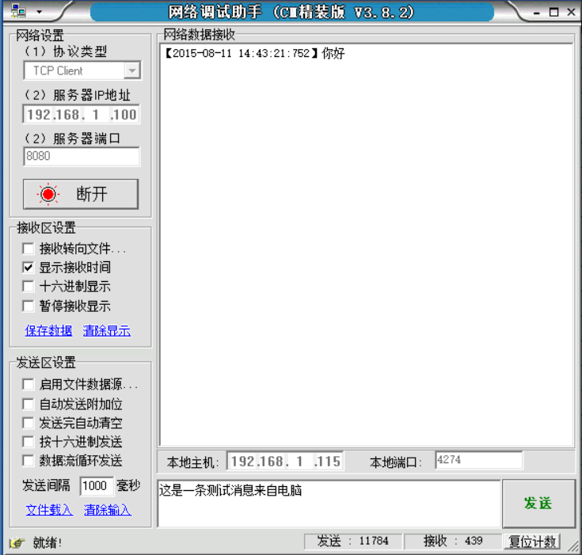

#### 3.3 实验效果

我们做第（7）步的时候，模块配置为 TCP Server  ，客户端连接过来如下图所示：

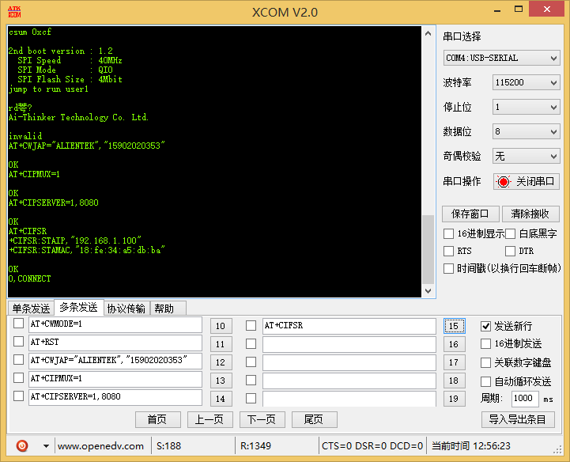

第（9）步接收数据的时候如下图所示：

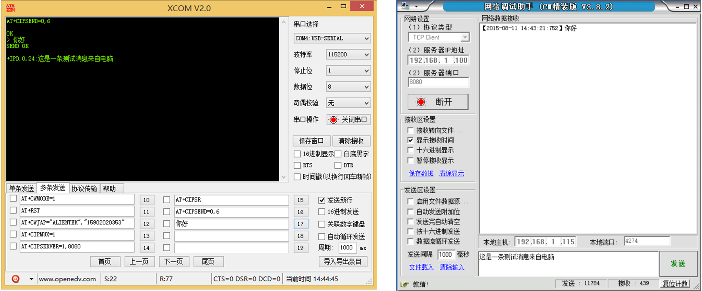

### 4. 连接原子云

原子云即原子云服务器，是正点原子推出的互联网云服务平台，它可以实现数据的远程监控、转发和管理等功能。原子云域名为： [cloud.alientek.com]([https://cloud.alientek.com/)，端口号为： 59666。  

#### 4.1 创建设备  

在创建设备之前， 需登入原子云的网址[原子云-用户登录 (alientek.com)](https://cloud.alientek.com/) 创建并登入账号。创建和登入账号的过程比较简单， 这里不做过多介绍，登入原子云后，如下图所示：  


建议第一次使用原子云的用户，点击原子云首页左下角的“帮助文档”，快速了解原子云服务器。在原子云平台创建设备，首先点击原子云首页左侧导航栏中的“设备管理”，随后在出现的页面中，点击“新增设备”，如下图所示：  

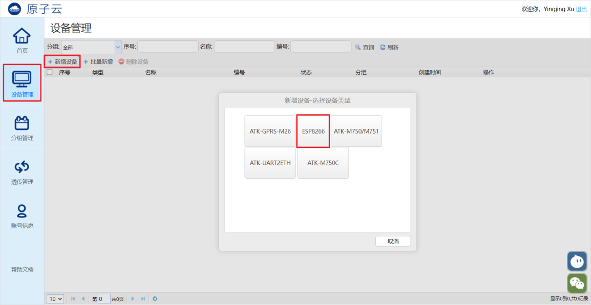

接着在弹出的窗口中，根据 ATK-MW8266D 模块的设备类型选择“ESP8266”，随后根据个人喜好填入“设备名称”和“密码”（这里的密码在就是 ATK-MW8266D 模块通过 AT指令连接原子云时需要的密码），如下图所示：  

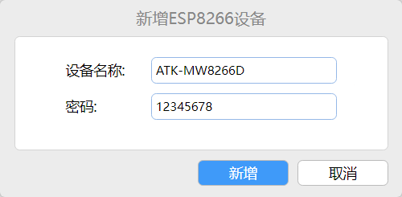

最后，点击“新增”按钮， 即可创建设备，设备创建好后，如下图所示：  

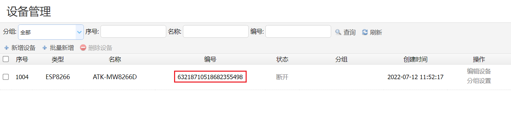

创建好设备后， 系统会自动为设备生成编号， 这个设备编号就是 ATK-MW8266D 模块使用 AT 指令连接原子云时需要的设备 ID。  

#### 4.2 连接到原子云  

建好设备后，就能后根据设备的编号和密码并通过 AT 指令操作 ATK-MW8266D 模块连接原子云了。 具体的 AT 指令如下所示：  

```shell
# 使能 ATK-MW8266D 模块的 STA 模式，以连接路由器的 AP
AT+CWMODE=1
# 连接路由器的 AP，以访问互联网
AT+CWJAP=”ALIENTEK-YF”,”15902020353”
# 连接原子云服务器
AT+ATKCLDSTA=”63218710518682355498”,”12345678”
```

实际在串口调试助手中的操作，如下图所示：

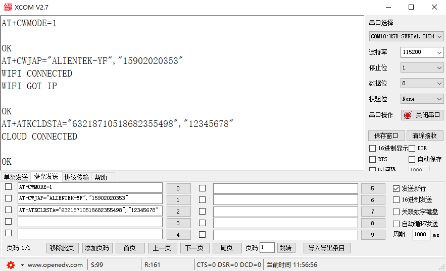

当串口调试助手显示“CLOUD CONNECTED”后，说明已成功连接上原子云服务器，此时在原子云的设备管理界面，也能够看到对应的设备显示为“已连接”的连接状态，如下图所示：  

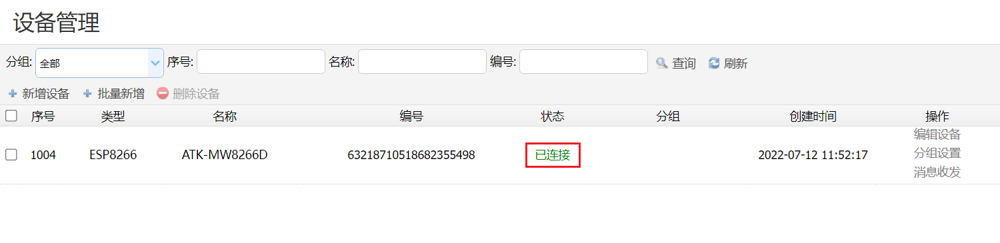

当 ATK-MW8266D 模块成功连接原子云服务器后，即进入了透传模式，此时就能够在原子云的对应设备的“消息收发”操作界面通过原子云服务器发送消息至 ATK-MW8266D模块，同时，也能后在该界面下，查看到接收自 ATK-MW8266D 模块的消息，如下图所示：  

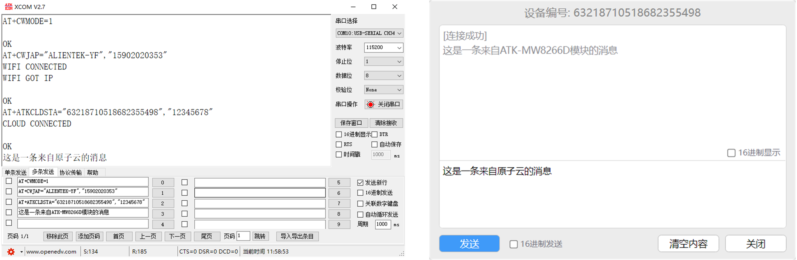

