<!-- more -->

这里主要是学习[esp8266_start_guide_1_.pdf (ai-thinker.com)](https://docs.ai-thinker.com/_media/esp8266/docs/esp8266_start_guide_1_.pdf)这篇文档，这是安信可提供的一个ESSP8266的入门教程。这节用的图都是安信可官方的模块，我没有实际买，这里只是做个笔记学习用。

## 一、接线与模式

### 1. 典型接线图

这里以ESP01为例：

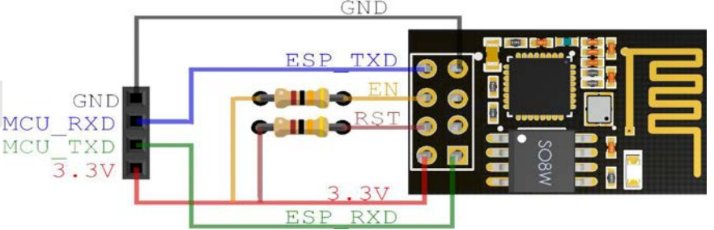

### 2. 启动模式

一般来讲是这样的：

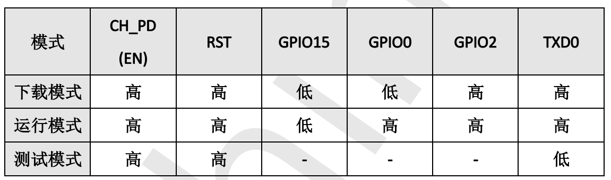

但是我们买到的开发板基本都会将其他的一些引脚给固定下来，只留一个GPIO0来作为模式选择。

## 二、烧录固件

### 1. 为什么要烧录固件

许多市面上的esp8266不管是模块还是开发板买回来都不能直接用（这里指的是动用AT指令来进行使用），在Ardunio的开发环境下esp8266 NodeMCU 开发板可以直接用（Ardunio的开发环境下的困难主要是esp8266的库不好下），若我们的需求是进行AT指令的控制，那么烧录固件就是必须的了。

类比一下就是，esp8266芯片好比一个MCU（类比单片机好了），这个固件就相当于我们在单片机上写的程序，首先包保证MCU运行起来，然后可以正常使用串口，并且可以解析对应的AT指令，这些就是所谓的固件啦。

### 2. 烧录软件

#### 2.1 烧录软件安装

烧写固件的软件我们使用官方提供的ESPFlashDownloadTool（[工具｜乐鑫科技 (espressif.com.cn)](https://www.espressif.com.cn/zh-hans/support/download/other-tools?keys=&field_type_tid[]=14)）：

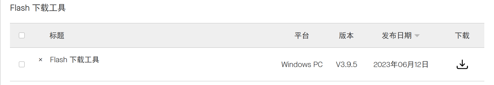

我们下载完毕打开压缩包，双击这个可执行文件：

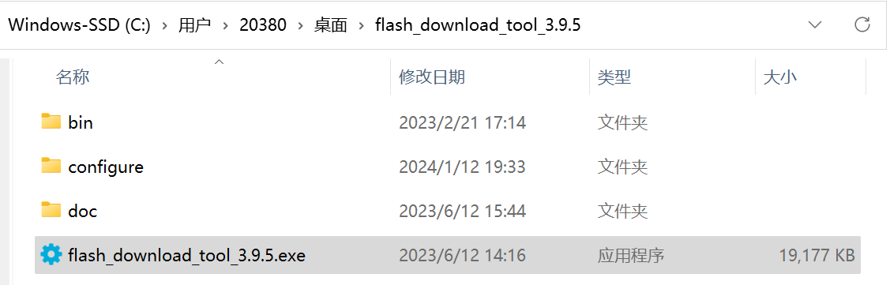

然后我们可以看到如下弹窗：

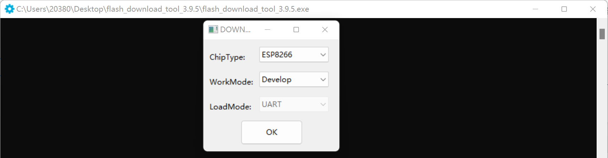

我们点击OK，就会打开烧录软件，界面如下：

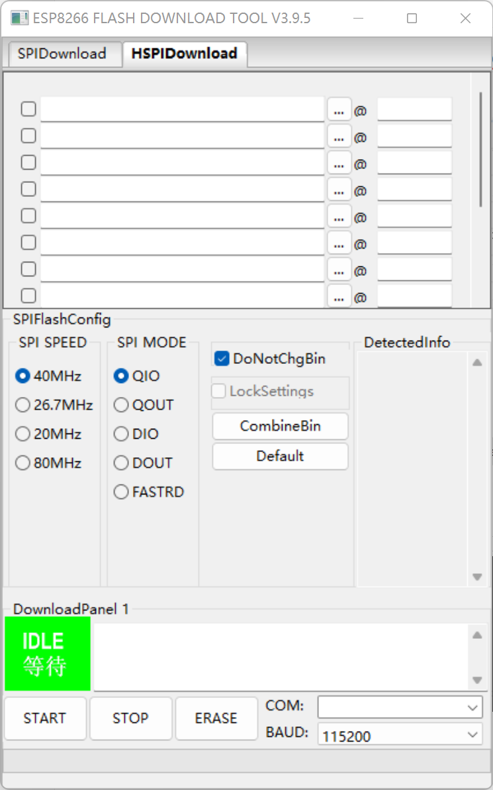

#### 2.2 烧录软件说明

新版本的少了一些选项，这里做笔记就用老的版本好了：

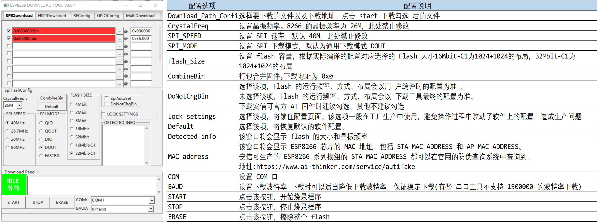

### 4. 固件烧写说明

按照烧录文件的不同，分为两种情况:支持云端升级、不支持云端升级。另 外，根据 flash 容量的不同，还需要调整 bin 文件的烧录地址。下面的两个表(表4和5)应该官方是有资料的，但是没找到这个文档，后面找到了再看看在哪，这里大概了解一下。

#### 4.1 不支持云端升级

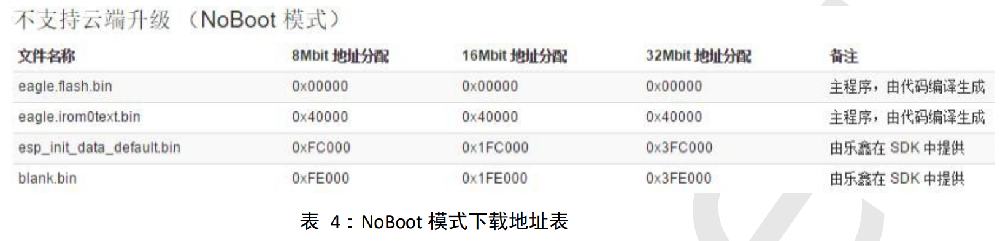

注意:乐鑫不同版本的 SDK 中可能会改变 eagle.irom0text.bin 文件的烧录地 址，以控制台输出的地址为准。 

#### 4.2 支持云端升级

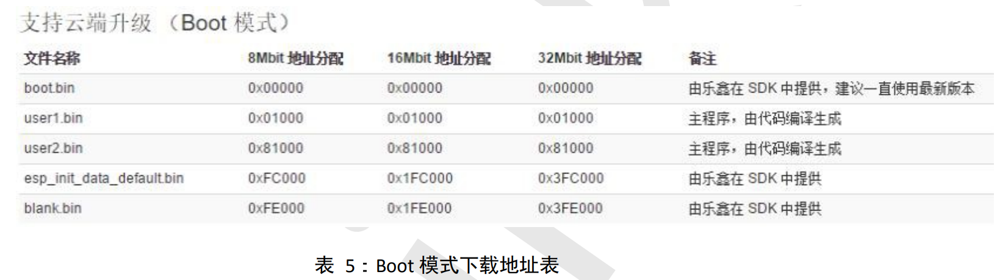注意：支持云端升级的固件，在 flash 布局会分为两个区，一个用来执行程 序，另一个用来保存要升级的固件。当程序运行在 user1 时开始升级，程序会下 载到 user2 区域，下载完毕后，下次启动运行 user2 的程序，依次替换，实现云 端升级。

- User1.Bin 文件和 User2bin 文件烧录时只烧录其中一个

- Boot.bin 文件使用最新版本 

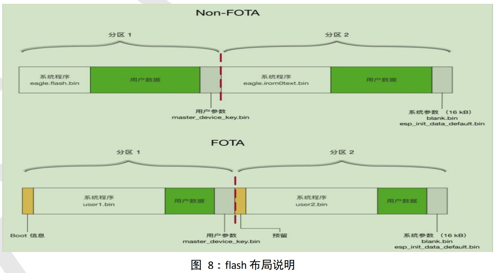

分区说明：

| 分区      | 说明                                                         |
| --------- | ------------------------------------------------------------ |
| 系统程序  | 用于存放运行系统必要的固件                                   |
| 用户数据  | 当系统数据未占满整个 flash 空间时，空闲区域可用于存 放用户数据。 |
| 用户参数  | 地址由用户自定义，IOT_Demo 中设置为 0x3C000 开始的 4 个扇区，用户可以设置为任意未占用的地址 |
| 系统阐述  | 固件 flash 的最后 4 个扇区 Blank.bin 下载地址为 Flash 的倒数第 2 个扇区 ESP_init_data_default.bin 下载地址为 flash 的倒数第四个扇区 |
| Boot 信息 | 位于 FOTA 固件的分区 1，存放 FOTA 升级相关信息               |
| 预留      | 位于 FOTA 固件的分区 2，与分区 1 Boot 信息区对应的预留区域   |

User.bin 说明 user1.bin 和 user2.bin 是同一个应用程序，选择 不同的编译步骤分别生成的两个固件，存放在 SPI Flash 不同位置， 启动时先运行 Boot，Boot 读取系统参数区中的标志位，判断运行 行 user1.bin 还是user2.bin，然后到 SPI Flash 的对应位置读取运行。

### 5. 烧写示例

#### 5.1 烧写文件分析

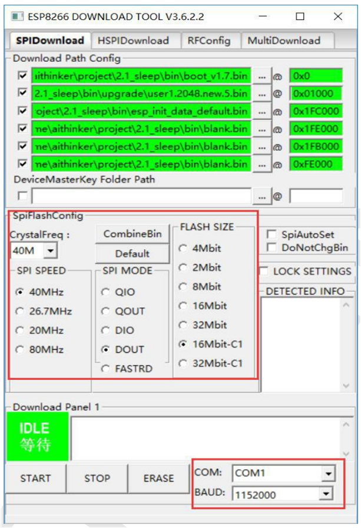

以 16Mbit –C1 Flash , 1024-1024 map 为说明，烧录如下：

| BIN                       | 烧录地址 | 说明                                                         |
| ------------------------- | -------- | ------------------------------------------------------------ |
| boot.bin                  | 0x0000   | 引导程序                                                     |
| ESP_init_data_defauit.bin | 0x1FC000 | 初始化其他射频参数区，至少烧录一次，当 RF_CAL 参数区初始化烧录时，本区域也会烧录 |
| user1.2048.new.5.bin      | 0x01000  | 用户程序                                                     |
| blink.bin                 | 0xFE000  | 初始化用户参数区                                             |
| blink.bin                 | 0x1FE000 | 初始化系统参数区                                             |
| blink.bin                 | 0x1FB000 | 初始化 RF_CAL 参数区                                         |

#### 5.2 烧写失败原因

烧录导致失败的原因一般分为几种。

- COM 口选择错误或者 COM 被占用； 电源电压不稳定；
- 如果卡在了等待上电过程，在确认接线无误的情况下，将 RST 引脚接地 复位一下即可；
- 串口芯片选型不对，该模组的串口电平为 TTL 电平，串口芯片建议使用 类似 CH340、CP210X 等芯片。不要使用 232、485 甚至 PC 的九针孔接口 来烧录； 
- 串口不稳定，接入串口时，一定要把地线接上；
- 下载软件的 flash_size 选项超过了模组实际的 flash 大小，即 8M 的 flash按照 32M 烧录肯定是不可以的；
- 下载波特率过大。有部分串口芯片的下载波特率并不支持 1500000，甚 至由于接线方式的原因、使用的烧录线品质较差、线太长等原因导致太 高的波特率下载容易失败，需要适当降低下载波特率； 
- efuse 损坏。由于静电的原因导致芯片损坏，下载软件的 efuse 校验无法 通过。可以参考一下黑窗输出的信息；
- 当 Wi-Fi MCU串口，此时为 Wi-Fi 录固件建议切断 MCU 与 Wi-Fi MCU的复位引脚拉 低，让 MCU 处于复位模式；

### 6. 固件合并说明

使用软件上的 CombineBin 按键可以将文件打包合并成一个完整的固件。

ESP 系列模组在烧录固件时是按照要烧录的文件地址烧录对应文件的大小到 flash，其他部分的 flash 未改动，例如 user1.bin 文件为 320K，从flash 地址 0x01000 地址开始烧录，烧录 320K 字节，如果第二次烧录的时候，编译生成的 user1.bin  只有 300k，那么比对上一次烧录的 user1.bin 文件在 flash 中的存储，后面的 20K falsh 是不会擦除的。

这样的烧录方式在大批量生产中是不安全的，尤其是有部分客户会在 flash 中 添加自己的一些数据直接烧录进去。

将所有的固件打包合并成一个完整的固件，烧录时会填充整个 flash，对应地址没有程序部分的 flash 会被 0xFF 填充。

#### 6.1 配置合并 

固件主要分为不支持线升级和支持在线升级两种，具体地址分配表如下。

- （1）不支持云端升级(Noboot 模式)

| 文件名称                  | 8Mbit 地址分配 | 16Mbit 地址分配 | 32Mbit 地址分配 |
| ------------------------- | -------------- | --------------- | --------------- |
| eagle.flash.bin           | 0x00000        | 0x00000         | 0x00000         |
| eagle.irom0text.bin       | 0x40000        | 0x40000         | 0x40000         |
| ESP_init_data_default.bin | 0xFC000        | 0x1FC000        | 0x3FC000        |
| blank.bin                 | 0xFE000        | 0x1FE000        | 0x3FE000        |
| blank.bin (见备注)        | 0xFF000        | 0x1FF000        | 0x3FF000        |

注意：乐鑫不同版本的 SDK 中可能会改变 eagle.irom0text.bin 文件的烧录地 址，以控制台输出的地址为准。

- （2）支持云端升级(Boot 模式)

| 文件名称                  | 8Mbit 地址分配 | 16Mbit 地址分配 | 32Mbit 地址分配 |
| ------------------------- | -------------- | --------------- | --------------- |
| Boot.bin                  | 0x00000        | 0x00000         | 0x00000         |
| user1.bin                 | 0x01000        | 0x01000         | 0x01000         |
| ESP_init_data_default.bin | 0xFC000        | 0x1FC000        | 0x3FC000        |
| blank.bin                 | 0xFE000        | 0x1FE000        | 0x3FE000        |
| blank.bin (见备注)        | 0xFF000        | 0x1FF000        | 0x3FF000        |

【备注】

（1）需要将 blank.bin 放置到所需要使用的 Flash 的最后一个扇区，以确保 Flash 量产烧录时可以被完全覆盖，避免生产时可能出现的一些问题。

（2）为方便管理和生产，在合并固件时，必须将“SPI MODE"选择“DOUT”  模式，切勿选择其他模式，如选择其他模式，届时可能会造成固件无法 启动和运行。 乐鑫在不同版本的 SDK 中有可能会改变这些烧录位置，本说明仅为参考， 需以开发时的 Console 输出信息为准。

#### 6.2 配置示例

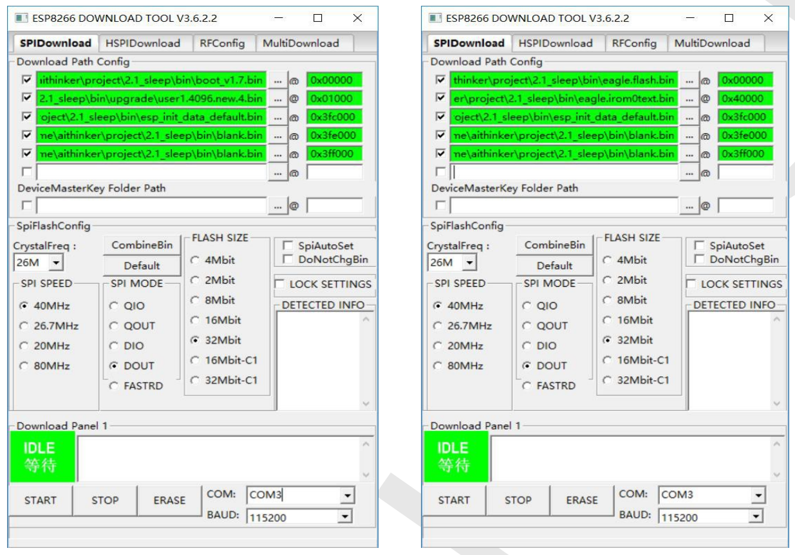

点击【CombineBin】按钮， 软件将自动按照上一节的配置生成一个 target.bin 文件。在 windows 资源管理器下查看生成文件详细大小如下:

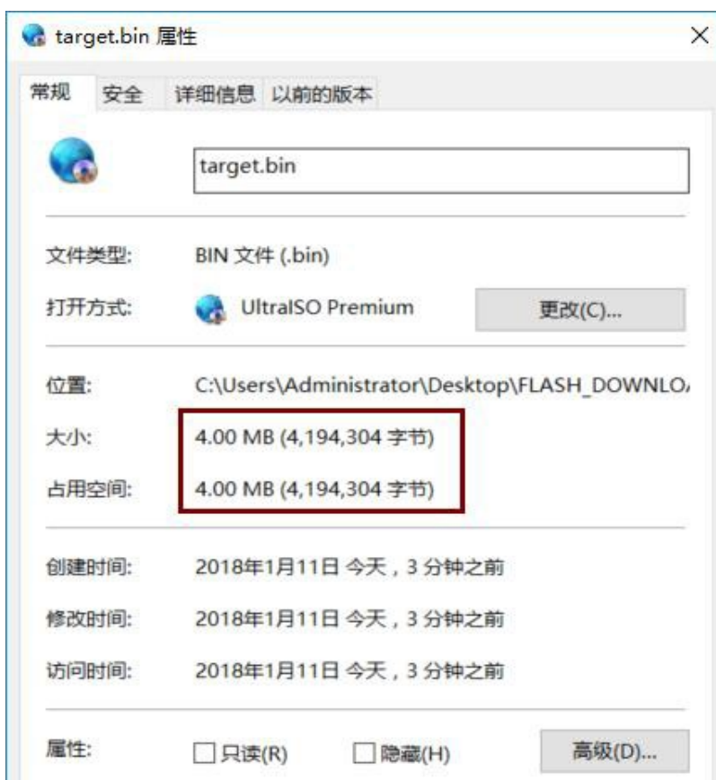

使用 winhex 或者 ultraedit 类似软件查看得到如下数据，说明该文件大小是 正确的(32Mbit Flash Size)

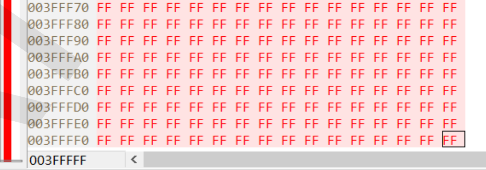

#### 6.3 校验固件

合并后，固件内已经包含了面板上的配置信息以及地址范围。烧录地址为 0x00000。注意：校验固件时必须选中 DoNotChgBin 选项，此时下载不受下载配置影响。

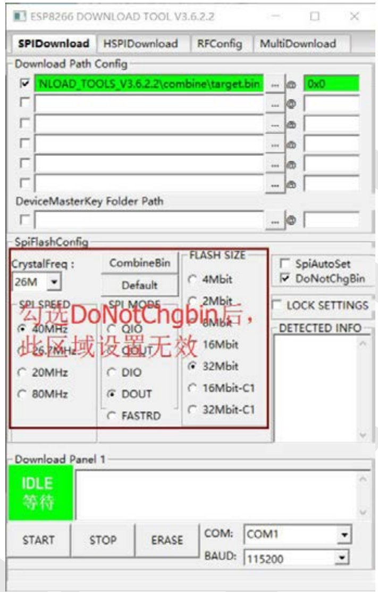

### 7. 固件去哪里找？

这个可以去乐鑫和安信可官网，这里我就没找了，直接用的正点原子模块资料里提供的。在安信可官网下 载的 AT 固件都是打包合并过的固件。

### 8. 如何确认进入下载模式？

在我们烧录固件之前，最好先确认一下， 模组是否进入下载模式。

（1）首先确保模组可以正常运行，发送 AT 指令(AT 固件)可以有回复 OK(即 确保电源和串口都是正常的)； 

（2）在 76800 波特率下观察模组启动或复位后的打印信息； （安信可文档写的是74880，但是我用正点原子的串口助手只有一个76800）

若出现以下信息则认为模组已经进入了下载模式，可以进行下载；(76800 波特率下输出的系统日志信息说明)

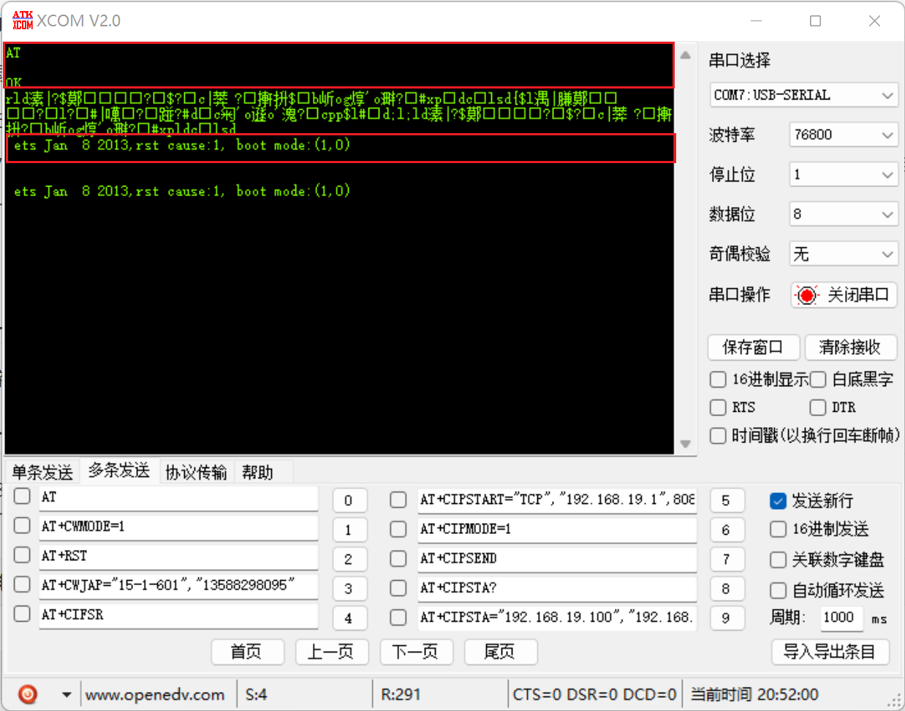

## 三、ATK-MW8266D怎么烧录？

这里使用新版本的烧录软件，不需要像老版本一样有好几个地方要配置。

### 1. 接线方式

ATK-MW8266D 模块须进入下载模式，才能够进行固件的烧写。 ATK-MW8266D 模块的“IO_0”引脚控制 ATK-MW8266D 模块的启动模式，具体的说明，如下表所示：  

| 模块上电时 IO_0 引脚电平 | 模块启动模式 |
| ------------------------ | ------------ |
| 低电平                   | 下载模式     |
| 高电平                   | 运行模式     |

ATK-MW8266D 模块的固件烧写可以借助 PC 端的固件烧写软件（flash_download_tool）进行烧写，在对 ATK-MW8266D 模块进行固件烧写前， 需要通过 USB 转 TTL 将ATK-MW8266D 模块与 PC 连接， ATK-MW8266D 模块与 USB 转 TTL 的连接示例，如下表所示：  

| ATK-MW8266D 模块 | USB 转 TTL                                   |
| ---------------- | -------------------------------------------- |
| VCC              | VCC（5V 或 3.3V）                            |
| GND              | GND                                          |
| TXD              | RXD                                          |
| RXD              | TXD                                          |
| RST              | -                                            |
| IO_0             | GND（使 ATK-MW8266D 模块上电后进入下载模式） |

对于上表的连接示例，需要注意以下几点：

- 在上表的连接示例中， ATK-MW8266D 模块由 USB 转 TTL 供电，若用户使用额外的电源给 ATK-MW8266D 模块供电，则需保证 ATK-MW8266D 模块与 PC 共地。

- ATK-MW8266D 模块的 RST 引脚可以悬空，因为 ATK-MW8266D模块内部已对RST引脚进行上拉，默认为非复位状态。

- ATK-MW8266D 模块的 IO_0 需连接至 GND，使 ATK-MW8266D 模块上电后进入下载模式，而非运行模式。  

### 2. 选择烧录文件

配置好模式并进入软件后，选择待烧录固件的 bin 文件，并设置好 bin 文件烧录至芯片的地址信息和其他的一些信息，即可点击软件左下方的“START”按钮进行固件烧写，如下图所示：  

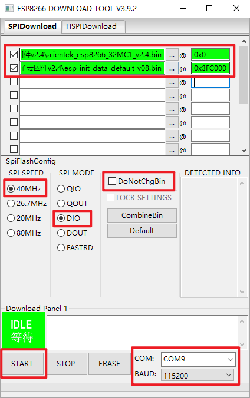

需要注意，我们需要关闭串口调试助手，否则会出现打开串口失败的情况。若固件烧录失败， 可通过配置软件右下方的串口通讯波特率配置项，适当降低串口通讯波特率。  烧写完成如下图：

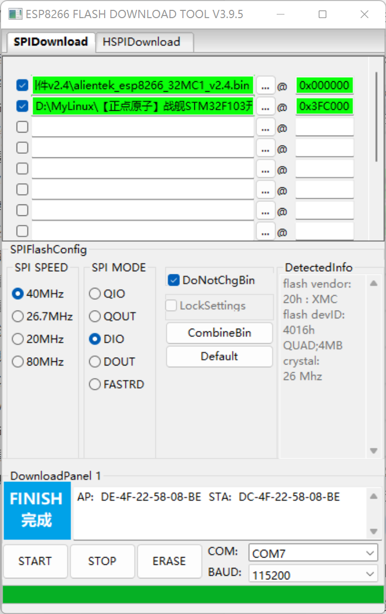

后面为了和安信可的文档保持一致，我后来又烧写了安信可的固件库：

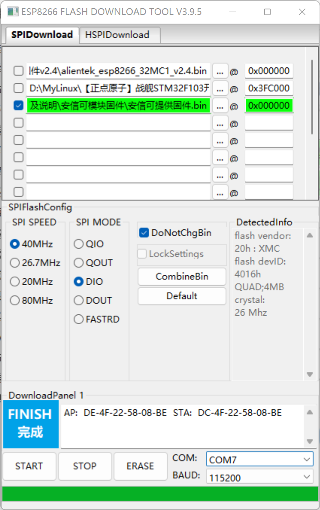

### 3. 上电信息说明  

ESP8266 系列模组出厂使用的 AT 固件，默认波特率为 115200。  实际上，模组在上电过程中首先是在 74880 波特率（可以用76800）下打印输出了系统日志信 息，随后切换到 115200 波特率下完成初始化，当输出 ready 字样的字符串后， 则表明初始化完成，此时可以发送 AT 指令去调试模组。

- 76800下的输出信息，还是有少许乱码，可能需要配到74880吧

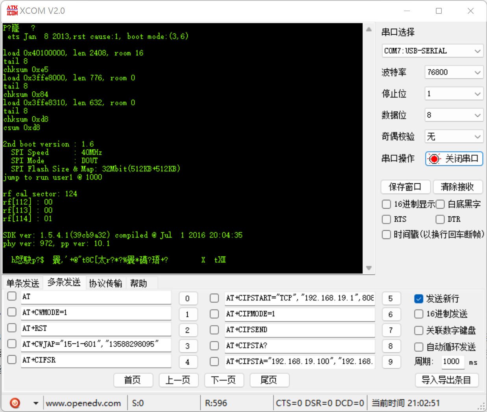

rst cause ： 1 上电，2 外部复位 ，4 硬件看门狗复位

Boot mode：启动模式后面有两个参数，只看第一个参数即可， 1 下载模式，3 运行模式。

chksum：chksum 与 csum 值相等，表明启动过程中 Flash 读值正确

- 115200下输出信息

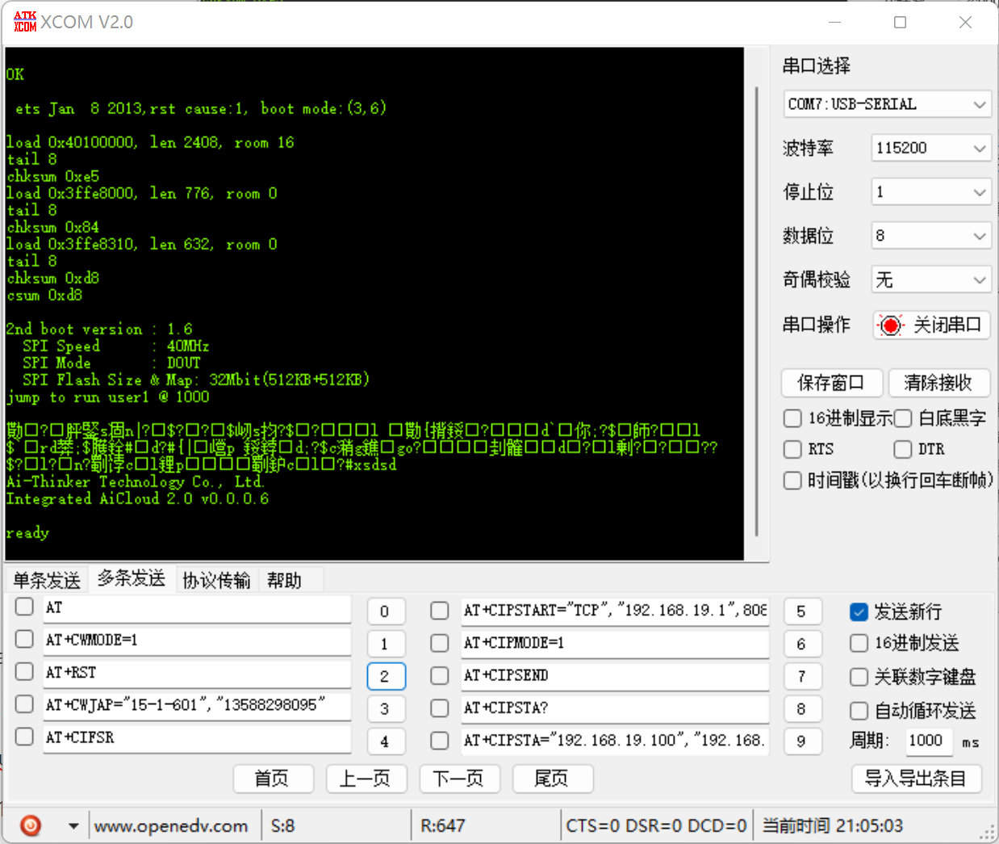
