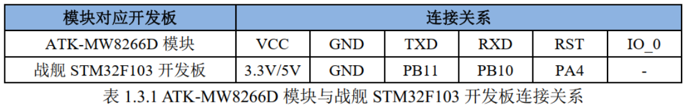
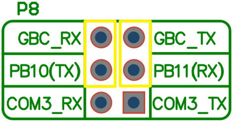
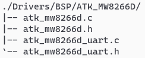

<!-- more -->

## 一、硬件连接

ATK-MW8266D 模块可直接与正点原子战舰 STM32F103 开发板板载的 ATK 模块接口（ ATK MODULE）进行连接，具体的连接关系，如下表所示：  



注意，若要使用正点原子战舰 STM32F103 开发板的 ATK MODULE 接口连接ATK-MW8266D 模块，需要用跳线帽将开发板板载的 P8 接线端子的 PB10(TX)和 GBC_RX以及 PB11(RX)和 GBC_TX 用跳线帽进行短接，如下图所示：  



## 二、ATK-MW8266D 模块 TCP 透传实验  

### 1. 功能说明

在本实验中，开发板主控芯片通过串口与 ATK-MW8266D 模块进行通讯， 并在上电后自动根据配置信息， 配置 ATK-MW8266D 模块连接 WIFI、 TCP 服务器（与 ATK-MW8266D模块所连接 WIFI 在同一局域网的电脑作为 TCP 服务器），成功连接 WIFI 后， 将在串口调试助手和 LCD 上显示 ATK-MW8266D 模块的 IP 地址，随后便可通过按键对 ATK-MW8266D模块进行 AT 指令测试和配置其进入或退出透传模式， AT 指令测试的测试结果将显示在串口调试助手上，当模块进入透传模式后，可通过按键发送数据至 TCP 服务器，同时也可接收来自 TCP 服务器的数据，并实时显示在串口调试助手上。  

### 2. 源码解读  

我们能够在./Drivers/BSP 目录下看到 ATK_MW8266D 子文件夹，该文件夹中就包含了 ATK-MW8266D 模块的驱动文件，如下图所示：  



#### 2.1 ATK-MW8266D 模块接口驱动  

atk_mw8266d_uart.c 和 atk_mw8266d_uart.h 是开发板与 ATK-MW8266D模块通讯而使用的 UART 驱动文件。

由于 ATK-MW8266D 模块通过 UART 发送给主控芯片的数据的长度是不固定的，因此主控芯片就无法直接通过接收到数据的长度来判断 ATK-MW8266D 模块传来的一帧数据是否完成。 对于这种通过 UART 接收不定长数据的情况， 可以通过 UART 总线是否空闲来判断一帧的传输是否完成， 恰巧 STM32 的 UART 提供了总线空闲中断功能，因此可以开启 UART 的总线空闲中断，并在中断中做相应的处理， 具体的实现过程可以查看 ATK-MW8266D 模块的模块接口驱动代码。  

#### 2.2 ATK-MW8266D 模块驱动  

atk_mw8266d.c 和 atk_mw8266d.h 是 ATK-MW8266D 模块的驱动文件，包含了 ATK-MW8266D 模块初始化、硬件复位、发送 AT 指令的相关 API 函数和部分 AT 指令的封装函数。函数比较多，下面仅介绍几个重要的 API 函数。

##### 2.2.1 atk_mw8266d_init()    

```c
/**
 * @brief       ATK-MW8266D初始化
 * @param       baudrate: ATK-MW8266D UART通讯波特率
 * @retval      ATK_MW8266D_EOK  : ATK-MW8266D初始化成功，函数执行成功
 *              ATK_MW8266D_ERROR: ATK-MW8266D初始化失败，函数执行失败
 */
uint8_t atk_mw8266d_init(uint32_t baudrate)
{
    atk_mw8266d_hw_init();                          /* ATK-MW8266D硬件初始化 */
    atk_mw8266d_hw_reset();                         /* ATK-MW8266D硬件复位 */
    atk_mw8266d_uart_init(baudrate);                /* ATK-MW8266D UART初始化 */
    if (atk_mw8266d_at_test() != ATK_MW8266D_EOK)   /* ATK-MW8266D AT指令测试 */
    {
        return ATK_MW8266D_ERROR;
    }
    
    return ATK_MW8266D_EOK;
}
```

从上面的代码中可以看出，函数 atk_mw8266d_init()会对 ATK-MW8266D 模块进行硬件复位（拉低 ATK-MW8266D 模块的 RST 引脚，随后拉高）， 然后初始化主控芯片与ATK-MW8266D 模块的 UART，最后进行 AT 指令测试，若 AT 指令测试成功，则说明ATK-MW8266D 模块及其通讯接口初始化成功，反之，则初始化失败。  

##### 2.2.2 atk_mw8266d_at_test()  

该函数用于对 ATK-MW8266D 模块进行 AT 指令测试，可以由此判断主控与ATK-MW8266D 模块的通讯是否无误，具体的代码，如下所示：  

```c
/**
 * @brief       ATK-MW8266D AT指令测试
 * @param       无
 * @retval      ATK_MW8266D_EOK  : AT指令测试成功
 *              ATK_MW8266D_ERROR: AT指令测试失败
 */
uint8_t atk_mw8266d_at_test(void)
{
    uint8_t ret;
    uint8_t i;
    
    for (i=0; i<10; i++)
    {
        ret = atk_mw8266d_send_at_cmd("AT", "OK", 500);
        if (ret == ATK_MW8266D_EOK)
        {
            return ATK_MW8266D_EOK;
        }
    }
    
    return ATK_MW8266D_ERROR;
}
```

从上面的代码中可以看出， 该函数会通过 UART 向 ATK-MW8266D 模块发送“AT”字符串（函数 atk_mw8266d_send_at_cmd()会根据通讯规则在字符串末尾添加换行符），并在一段时间内等待 ATK-MW8266D 模块的“OK”响应，如果收到 ATK-MW8266D 模块的“OK”响应，说明主控芯片与 ATK-MW8266D 模块的 UART 通讯正常， AT 指令测试成功，反之，则说明 AT 指令测试失败，主控芯片不能与 ATK-MW8266D 模块进行正常的通讯。  

##### 2.2.3 atk_mw8266d_send_at_cmd()  

该函数主要实现主控芯片与 ATK-MW8266D 模块的 AT 指令传输，本驱动代码中的大部分驱动函数都是基于该函数实现的， 但由于 ATK-MW8266D 的 AT 指令众多，在驱动代码中无法一一实现， 因此在使用 ATK-MW8266D 模块的时候，可以参考驱动文件中的驱动函数，对函数
atk_mw8266d_send_at_cmd() 进行简单的封装，即可实现相应的功能。函数atk_mw8266d_send_at_cmd()的具体代码，如下所示：  

```c
/**
 * @brief       ATK-MW8266D发送AT指令
 * @param       cmd    : 待发送的AT指令
 *              ack    : 等待的响应
 *              timeout: 等待超时时间
 * @retval      ATK_MW8266D_EOK     : 函数执行成功
 *              ATK_MW8266D_ETIMEOUT: 等待期望应答超时，函数执行失败
 */
uint8_t atk_mw8266d_send_at_cmd(char *cmd, char *ack, uint32_t timeout)
{
    uint8_t *ret = NULL;
    
    atk_mw8266d_uart_rx_restart();
    atk_mw8266d_uart_printf("%s\r\n", cmd);
    
    if ((ack == NULL) || (timeout == 0))
    {
        return ATK_MW8266D_EOK;
    }
    else
    {
        while (timeout > 0)
        {
            ret = atk_mw8266d_uart_rx_get_frame();
            if (ret != NULL)
            {
                if (strstr((const char *)ret, ack) != NULL)
                {
                    return ATK_MW8266D_EOK;
                }
                else
                {
                    atk_mw8266d_uart_rx_restart();
                }
            }
            timeout--;
            delay_ms(1);
        }
        
        return ATK_MW8266D_ETIMEOUT;
    }
}
```

从上面的代码中可以看出，函数 atk_mw8266d_send_at_cmd()函数会将待发送的 AT 指令加上换行符后通过 UART 发送至 ATK-MW8266D 模块， 随后等待 ATK-MW8266D 模块的响应，并判断响应中是否包含期望等待的响应， 如果有，则说明本次 AT 指令传输成功。  
