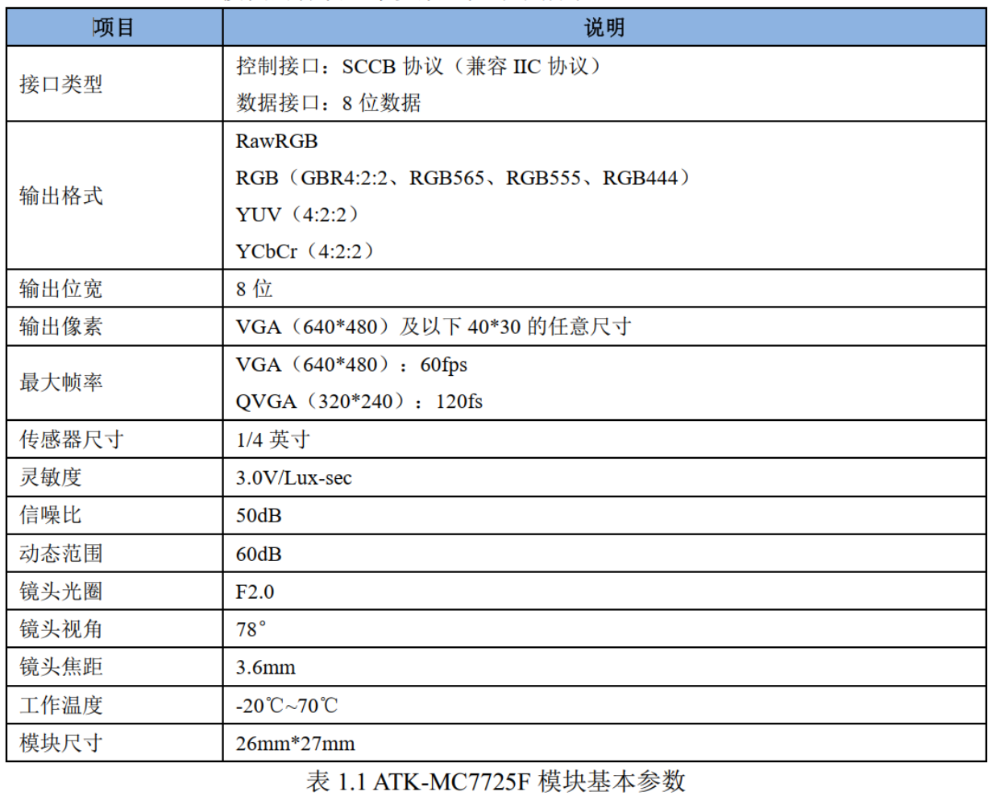

<!-- more -->

## 一、ATK-MC6625F模块简介

ATK-MC7725F 模块一款高性能 30W 高清摄像头模块。 该模块采用 OmniVision 公司的 OV7725 摄像头传感器作为核心， OV7725 是一颗 1/4 英寸 CMOS VGA（ 640*480）的图像传感器。 同时 ATK-MC7725F 模块集成了有源晶振和 FIFO 芯片， 这使得可以采用大部分的 MCU 控制该模块和读取图像数据。  

ATK-MC6625F 模块具有如下特点：

- 集成有源晶振，无需外部提供时钟

- 集成 FIFO 芯片，方便外部 MCU 读取图像

- 支持 VGA、 QVGA 和从 CIF 到 40*30 的各种尺寸输出

- 支持 RawRGB、 RGB（ GBR4:2:2、 RGB565、 RGB555、 RGB444）、 YUV（ 4:2:2）和 YCbCr（4:2:2） 格式输出

- 自动图像控制功能：自动曝光（AEC）、自动白平衡（ AWB）、自动消除灯光条纹、自动黑电平校准（ABLC）和自动带通滤波器（ABF）等

- 支持图像质量控制：色彩饱和度调节、色调调节、伽马校准、锐度和镜头校准等

- 支持图像缩放、平移和窗口设置

- 支持标准的 SCCB 接口，兼容 IIC 接口

- 自带嵌入式微处理器

- 高灵敏度、低电压，适合嵌入式应用  

## 二、参数说明  

### 1. 基本参数  

### 2. 电气参数

## 三、引脚说明

ATK-MC7725F 模块通过 2\*9 的排针（ 2.54mm 间距）同外部相连接：

ATK-MC7725F 模块的原理图 如下：

从上图可以看出， ATK-MC7725F 模块自带了有源晶振，用于产生 12MHz 的时钟作为OV7725 传感器的 XCLK 输入，并且 ATK-MC7725F 模块集成了 AL422B 芯片， AL422B 芯片是可以 FIFO 芯片， 该 FIFO 芯片的容量为 384K 字节，足以存储 2 帧 QVGA 图像数据。 ATK-MC7725F 模块通过一个 2\*9 的排针（P1）同外部电路连接，各引脚的详细描述，如下表所示：     

| 序号  |  名称  | 说明                  |
| :---: | :----: | --------------------- |
|   1   |  3.3V  | 3.3V 电源输入         |
|   2   |  GND   | 电源地                |
|   3   |  WRST  | FIFO 写复位信号输入   |
|   4   |  SCL   | SCCB 通讯时钟信号     |
|   5   |  RRST  | FIFO 读复位信号输入   |
|   6   |  SDA   | SCCB 通讯通讯数据信号 |
|   7   |   OE   | FIFO 输出使能信号输入 |
| 8\~15 | D0\~D7 | FIFO 数据输出端口     |
|  16   |  RCLK  | FIFO 读时钟信号输入   |
|  17   | VSYNC  | 帧同步信号            |
|  18   |  WEN   | FIFO 写使能信号输入   |
