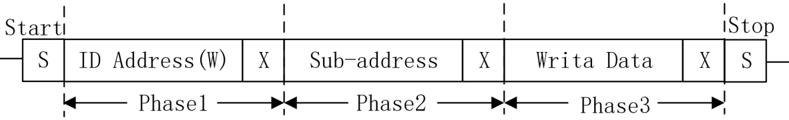
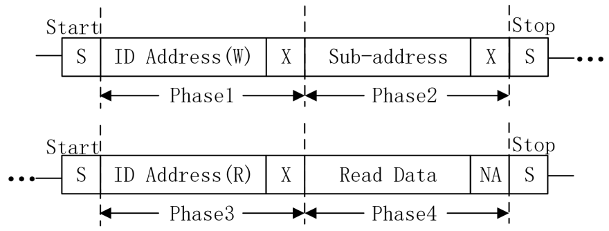

<!-- more -->

## 一、SCCB是什么？

SCCB（Serial Camera Control Bus，串行摄像头控制总线） 是 OmniVision 开发的一种总线协议， 且广泛被应用于 OV 系列图像传感器上。

SCCB 协议与 IIC 协议十分相似， SCCB协议由两条信号线组成： SIO_C（类似 IIC 协议的 SCL） 和 SIO_D（类似 IIC 协议的 SDA）。与 IIC 协议一样， SCCB 协议也有起始信号和停止信号， 只不过与 IIC 协议不同的是， IIC协议在传输完 1 字节数据后，需要传输的接收方发送 1 比特的确认位，而 SCCB 协议一次性要传输 9 位数据， 前 8 位为读写的数据位， 第 9 位在写周期为 Don’t-Care 位，在读周期为NA 位。 这样一次性传输的 9 个位，在 SCCB 协议中被定义为一个相（Phase）。

在 SCCB 协议中共包含了三种传输周期， 分别为 3 相写传输（三个相均由主机发出， 一般用于主机写从机寄存器， 三个相分别从设备地址、寄存器地址、 写入的数据）、 2 相写传输（两个相均由主机发出， 一般配合 2 相读传输用与主机读从机寄存器值，两个相分别为从设备地址、寄存器地址） 和 2 相读传输（第一个相由主机发出，第二个相由从机回应，一般配合 2 相写传输用于主机读从机寄存器值，两个相分别为从设备地址、 寄存器数据）。  

关于 SCCB 协议的详细介绍，请见《OmniVision Technologies Seril Camera Control Bus(SCCB) Specification.pdf》。

## 二、SCCB协议  

### 1. 写传输协议  

上图中就是三相写传输周期，第一个相就是 ID Address，由 7 位器件地址和 1 位读写控制位构成（0：写 1：读），而 OV7725 器件地址为0x21，所以在写传输时序中， ID Address(W)为0x42（器件地址左移 1 位，低位补 0）；第二个相就是 Sub-address，即 8 位寄存器地址，在 OV7725的数据手册中定义了 0x00~0xAC 共 173 个寄存器，有些寄存器是可写的，有些是只读的，只有可写的寄存器才能正确写入；第三个相就是 Write Data，即要写入寄存器的 8 位配置数据。而上图中的第 9 位 X 表示 Don’t Care（不必关心位），该位是由从机（此处指 OV7725）发出应答信号来响应主机表示当前 ID Adress、 Sub-address 和 Write Data 是否传输完成，但是从机有可能不发出应答信号，因此主机（此处指STM32）可不用判断此处是否有应答，直接默认当前传输完成即可。

SCCB 和 IIC 写传输协议是极为相似，只是在 SCCB 写传输时序中，第 9 位为不必关心位，而 IIC 写传输协议中为应答位。 SCCB 的读传输时序和 IIC 有些差异，在 IIC 读传输协议中，写完寄存器地址后，会有一个 restart 即重复开始的操作；而 SCCB 读传输协议中没有重复开始的概念，在写完寄存器地址后，发起总线停止信号。  

### 2. 读传输协议

SCCB 读传输协议由两个部分组成： 二相写传输周期和二相读传输周期。跟 IIC 的读操作是相似的，都是复合的过程。第一部分是写器件地址和寄存器地址，即先进行一次虚写操作，通过这种虚写操作使地址指针向虚写操作中寄存器地址的位置。第二部分就是读器件地址和读数据，此时读取到的数据才是寄存器地址对应的数据，这里的读器件地址为 0x43（器件地址左移 1 位，低位补 1）。上图中的 NA 位是由主机（这里指 STM32）产生，由于 SCCB 总线不支持连续读写，因此 NA 位必须为高电平。  
