<!-- more -->

本节笔记放在这里，主要是为了学习8080时序，为后边FSMC产生8080时序做铺垫，这一部分的笔记是用GPIO模拟8080时序，这样对8080时序的认识会更深刻一些。这一节会涉及一些像素啊，显存啊什么的基本概念，笔记写在LCD屏幕学的相关笔记中了。平时我用的还是I2C或者SPI接口的OLED。

## 一、OLED简介

### 1. 简介

OLED，即有机发光二极管（Organic Light-Emitting Diode），又称为有机电激光显示（Organic Electroluminesence Display， OELD）。OLED由于同时具备自发光，不需背光源、对比度高、厚度薄、视角广、反应速度快、可用于挠曲性面板、使用温度范围广、构造及制程较简单等优异之特性，被认为是下一代的平面显示器新兴应用技术。

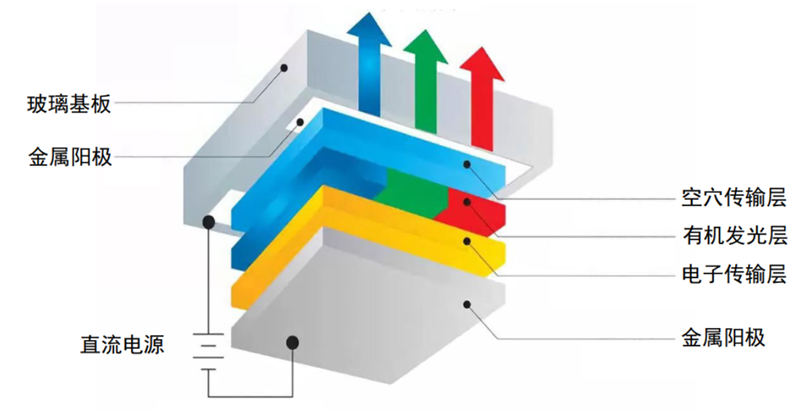

OLED显示技术具有自发光的特性，采用非常薄的有机材料涂层和玻璃基板，当有电流通过时，这些有机材料就会发光，而且OLED显示屏幕可视角度大，并且能够节省电能，从2003年开始这种显示设备在MP3播放器上得到了应用。

LCD都需要背光，而OLED不需要，因为它是自发光的。这样同样的显示，OLED效果要来得好一些。以目前的技术，OLED的尺寸还难以大型化，但是分辨率确可以做到很高。

### 2. 0.96寸OLED特点

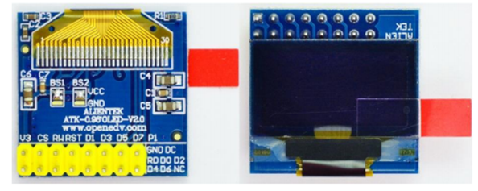

我学习的是正点原子出的OLED模块ATK-MD0096（但是只是为了学习8080接口，平时我用的还是I2C或者SPI接口的OLED），它有以下特点：

（1）模块有单色和双色两种可选，单色为纯蓝色，而双色则为黄蓝双色。单色模块每个像素点只有亮与不亮两种情况，没有颜色区分。

（2）尺寸小，显示尺寸为0.96寸，而模块的尺寸仅为27mm\*26mm大小。

（3）高分辨率，该模块的分辨率为128\*64。

（4）多种接口方式，该模块提供了总共4种接口包括：6800、8080两种并行接口方式、 4线的穿行SPI接口方式，、I2C接口方式（只需要2根线就可以控制OLED了）。

（5）不需要高压，直接接3.3V就可以工作了。

【注意】该模块不和5.0V接口兼容，所以请大家在使用的时候一定要小心，不要直接接到5V的系统上去，否则可能烧坏模块。

### 3. SSD1036

我使用的OLED芯片是使用SSD1036这款芯片来驱动的，它是香港[Solomon Systech公司（晶门科技）](https://www.solomon-systech.com.cn/zh-hans/)的一款显示屏驱动芯片，它的相关介绍我们可以在这里看到：[SSD1306 - Solomon Systech (International) Limited (solomon-systech.com)](https://www.solomon-systech.com/zh-hans/product/ssd1306/)，从这个网站是可以下载芯片手册的，但是好像要填一堆信息。

> 链接: [01-SSD1306-Revision 1.1 (Charge Pump).pdf](https://pan.baidu.com/s/1ZGgBnFCpXsT3p3D5SfMAzQ?pwd=vjkx) 提取码: vjkx 

SSD1306是一款单芯片CMOS OLED/PLED驱动器和控制器，用于有机/聚合物发光二极管点阵图形显示系统。它由128个段和64个公共端组成（没看懂，反正他可以驱动128\*64的OLED屏）。该集成电路是为普通阴极型OLED面板设计的。

SSD1306嵌入了对比度控制、显示RAM和振荡器，减少了外部元件的数量和功耗。它有256级亮度控制。数据/命令通过硬件可选的6800/8000系列兼容并行接口，I2C接口或串行外设接口从通用MCU发送。它适用于许多小型便携式应用，如手机子显示器、MP3播放器、计算器等。

### 4. 相关资料查阅

[OLED屏幕的原理图](https://www.doc88.com/p-8641271442264.html)和[SSD1036芯片手册](https://s.heltec.cn/download/oled/SSD1306-Revision_1.1_(Charge_Pump).pdf)：链接: https://pan.baidu.com/s/1HUaXodKCxwM_uspepMC8Eg?pwd=5azm 提取码: 5azm 

## 二、SSD1306

接下来我们来看一下SSD1306这款控制器，芯片手册可以看[SSD1306_datasheet](https://s.heltec.cn/download/oled/SSD1306-Revision_1.1_(Charge_Pump).pdf)

### 1. 功能框图

功能框图我们可以看[SSD1306_datasheet](https://s.heltec.cn/download/oled/SSD1306-Revision_1.1_(Charge_Pump).pdf)的4 BLOCK DIAGRAM  一节：

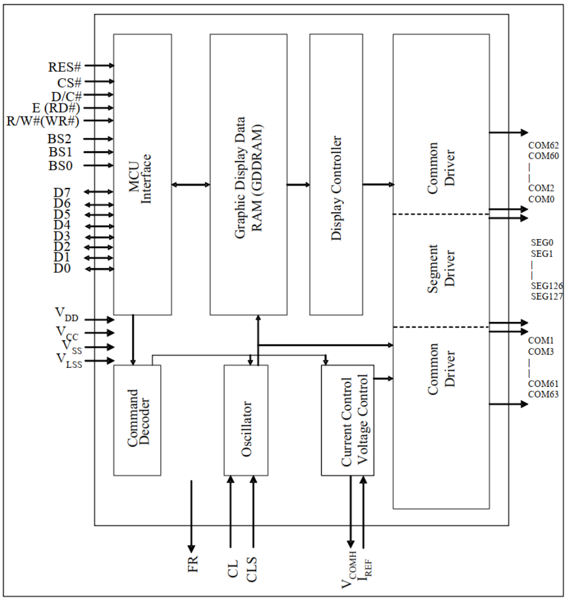

关于引脚的详细定义，我们可以查看[SSD1306_datasheet](https://s.heltec.cn/download/oled/SSD1306-Revision_1.1_(Charge_Pump).pdf)的7 PIN DESCRIPTION  一节，引脚比较多，这里就不说了。

### 2. BS[2:0]  

引脚中的BS0、BS1和BS2这里要关注一下，它们三个是芯片与MCU通信接口的选择引脚：

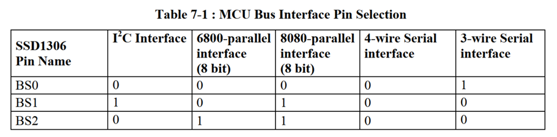

0就表示接到低电平VSS，1就表示接到高电平VDD。

### 3. 并行8080接口

#### 3.1 相关引脚说明

我们主要是关注一下8080并行接口的读写时序，方便后边LCD的学习。我们先来看一下相关引脚的说明：

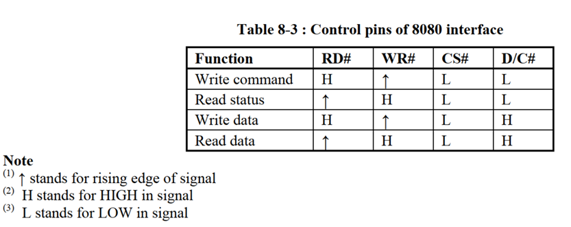

（1）E (RD#)：当选择8080接口模式时，该引脚接收读取(RD#)信号。当该引脚拉低并选择芯片时，开始读取操作。

（2）R/W#(WR#) ：这是连接到MCU接口的读写控制输入引脚。当选择8080接口模式时，该引脚将作为写入(WR#)输入。当该引脚被拉低并选择芯片时，开始数据写入操作。

（3）CS#：片选信号，低电平有效。

（4）D/C#：这是数据/命令控制引脚。当它被拉高(即连接到VDD)，数据在D[7:0]被视为数据。当它被拉低时，D[7:0]的数据将被转移到命令寄存器，也就是被当做命令处理。

#### 3.2 读时序

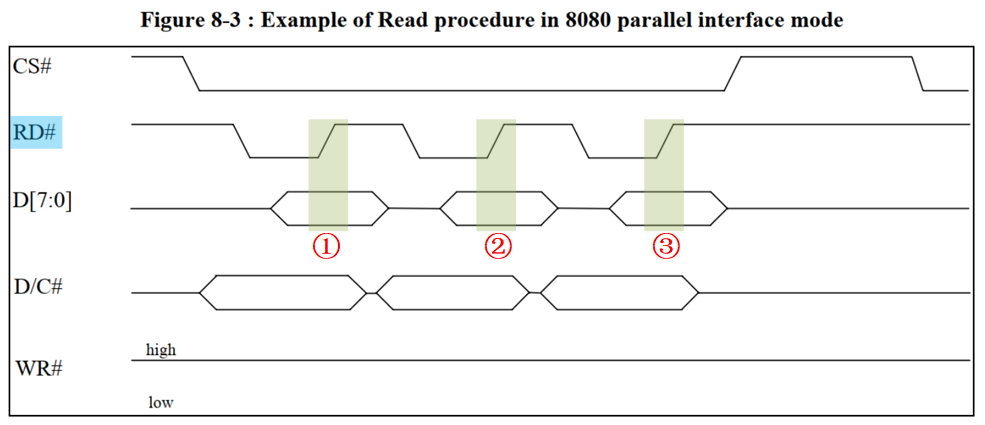

（1）先根据要读取的数据的类型，设置D/C#为高（数据）/低（命令）；

（2）然后拉低片选，选中SSD1306；

（3）接着是要读数据，所以要将RD#拉低；

（4）读数据：在RD#的上升沿， 使数据锁存到数据线（D[7：0]）上；

#### 3.3 写时序

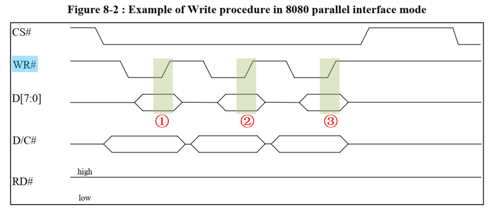

（1）先根据要写入的数据的类型，设置D/C#为高（数据）/低（命令）；

（2）然后拉低片选，选中SSD1306；

（3）接着是要写数据，所以要将WR#拉低；

（4）写数据：在WR#的上升沿， 使数据写入到SSD1306里面；

#### 3.4 同步频率

在 8080 方式下读数据操作的时候，我们有时候（例如读显存的时候）需要一个假读命（Dummy Read），以使得微控制器的操作频率和显存的操作频率相匹配。在读取真正的数据之前，由一个的假读的过程。这里的假读，其实就是第一个读到的字节丢弃不要，从第二个开始，才是我们真正要读的数据。

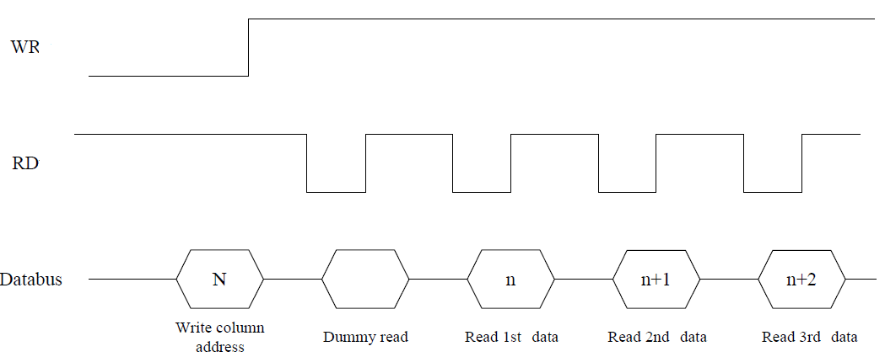

可以看到，在发送了列地址之后，开始读数据，第一个是 Dummy Read，也就是假读，我们从第二个开始，才算是真正有效的数据。

### 4. 显存

#### 4.1 显存的划分格式

这一部分我们可以看[SSD1306_datasheet](https://s.heltec.cn/download/oled/SSD1306-Revision_1.1_(Charge_Pump).pdf)的8.7 Graphic Display Data RAM (GDDRAM)  一节。SSD1306的显存总共为128\*64bit大小，SSD1306将这些显存分为了8页。每页包含了128个字节（128\*8bit  ），总共8页，这样刚好是128\*64的点阵大小。

| 屏幕行列 | 0~127 列 |
| :------: | :------: |
|  0~7 行  |  PAGE0   |
| 8~15 行  |  PAGE1   |
| 16~23 行 |  PAGE2   |
| 24~31 行 |  PAGE3   |
| 32~39 行 |  PAGE4   |
| 40~47 行 |  PAGE5   |
| 48~55 行 |  PAGE6   |
| 56~63 行 |  PAGE7   |

以 PAGE2 为例， PAGE2 中的显存数据与屏幕像素点的对应关系，如下图所示  ：

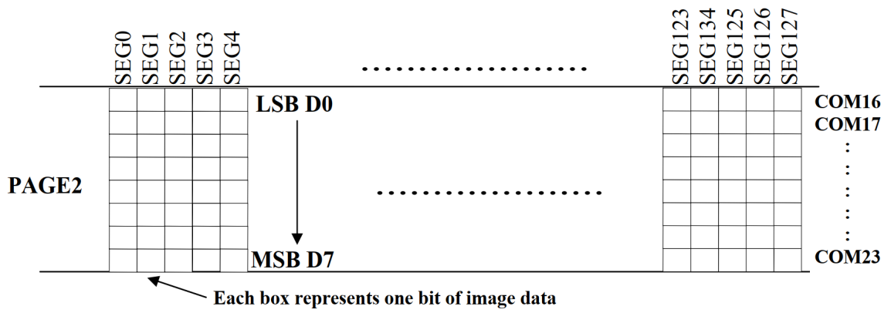

可以看出， 显存中的 1 字节数据对应了屏幕上的 8 个像素， 当往控制器 SSD1306 显存的某一页的某一列写入 1 数据， 那么将会同时修改显存中这一页的这一列对应屏幕上的 8个像素。 如果只想修改屏幕上某一个像素的状态，那么通常可以采用读、修改、写或外部微控制器内建显存的方式，但要注意的是， 在 ATK-MD0096 使用 SPI 或 IIC 通讯接口模式时，是无法读取控制器 SSD1306 的数据的，因此，在此情况下建议使用外部微控制器内建显存的方式，如果是对于 RAM 资源不足的外部微控制器，则建议使用 8 位 6800 或 8 位 8080 通讯接口模式，以减少对 RAM 空间的占用。  

> STM32程序显示数据的原理？
>
> 在STM32的内部建立一个 缓存（共128\*8个字节），在每次修改的时候，只是修改STM32上的缓存（实际上就是SRAM），在修改完了之后，一次性把STM32上的缓存数据写入到OLED的GRAM。当然这个方法也有坏处，就是对于那些SRAM很小的单片机（比如51系列）就比较麻烦了。

#### 4.2 与像素的对应关系

```c
 * 显存中的每一比特代表ATK-MD0096模块OLED上的一个像素
 *           col0     col1   ...   col127
 *       ┌----------------------------------┐
 *  row0 | [0][0].0 [0][1].0 ... [0][127].0 |
 *  row1 | [0][0].1 [0][1].1 ... [0][127].1 |
 *  ...  |   ...      ...    ...     ...    |
 *  row7 | [0][0].7 [0][1].7 ... [0][127].7 |
 *  row8 | [1][0].0 [1][1].0 ... [1][127].0 |
 *  row9 | [1][0].1 [1][1].1 ... [1][127].1 |
 *  ...  |   ...      ...    ...     ...    |
 * row15 | [1][0].7 [1][1].7 ... [1][127].7 |
 *  ...  |              ......              |
 * row56 | [7][0].0 [7][1].0 ... [7][127].0 |
 * row57 | [7][0].1 [7][1].1 ... [7][127].1 |
 *  ...  |   ...      ...    ...     ...    |
 * row63 | [7][0].7 [7][1].7 ... [7][127].7 |
 *       └----------------------------------┘
```


### 5. 命令

SS1306的命令我们可以查看[SSD1306_datasheet](https://s.heltec.cn/download/oled/SSD1306-Revision_1.1_(Charge_Pump).pdf)的9 COMMAND TABLE 和 10 COMMAND DESCRIPTIONS  。这里只介绍几个我们用得到的。

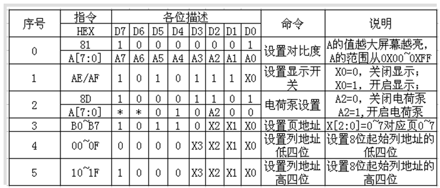

（1）命令0X81：设置对比度。包含两个字节，第一个0X81为命令，随后发送的一个字节为要设置的对比度的值。这个值设置得越大屏幕就越亮。

（2）命令0XAE/0XAF：0XAE为关闭显示命令；0XAF为开启显示命令。

（3）命令0X8D：包含2个字节，第一个为命令字，第二个为设置值，第二个字节的BIT2表示电荷泵的开关状态，该位为1，则开启电荷泵，为0则关闭。在模块初始化的时候，这个必须要开启，否则是看不到屏幕显示的。

（4）命令0XB0~B7：用于设置页地址，其低三位的值对应着GRAM的页地址。

（5）命令0X00~0X0F：用于设置显示时的起始列地址低四位。

（6）命令0X10~0X1F：用于设置显示时的起始列地址高四位。

## 三、OLED模块

这里还是以正点原子的这款OLED模块为例。

### 1. OLED模块接口方式

| 接口方式 | 4 线 SPI | IIC  | 8 位 6800 | 8 位 8080 |
| -------- | -------- | ---- | --------- | --------- |
| BS1      | 0        | 1    | 0         | 1         |
| BS2      | 0        | 0    | 1         | 1         |

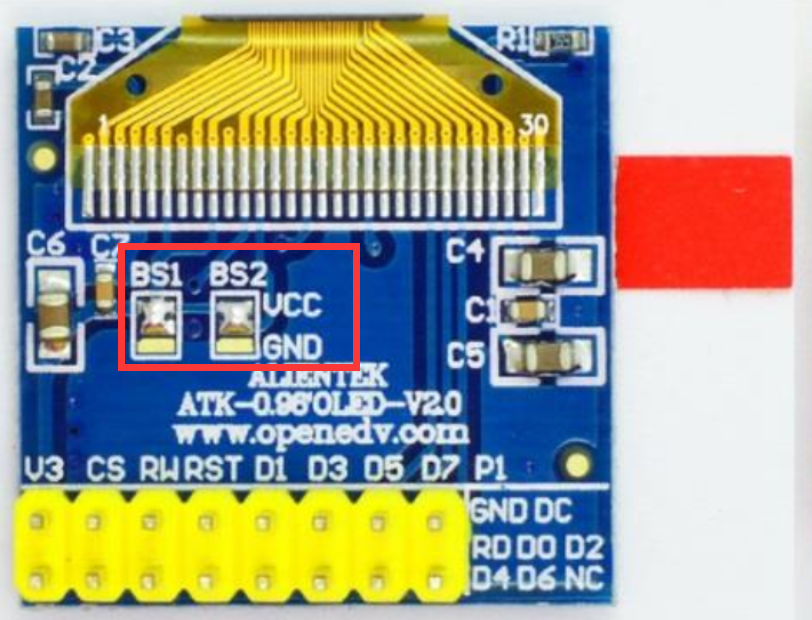

ALIENTEK OLED 模块默认设置是： BS1 和 BS2 接 VCC ，即使用 8080 并口方式，如果想要设置为其他模式，则需要在 OLED 的背面，用烙铁修改 BS1 和 BS2 的设置。  

### 2. 屏幕原理图

这个的话，我们还是看屏幕厂家给的原理图：[M00750_VGM128064C0W01_Y01.pdf](https://www.doc88.com/p-8641271442264.html),这里只贴一下引脚的定义吧：

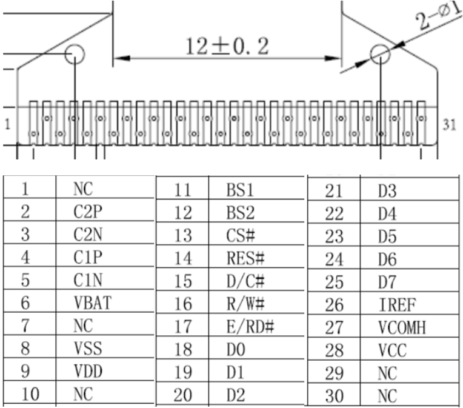

引脚描述的话我们可以查看[M00750_VGM128064C0W01_Y01.pdf](https://www.doc88.com/p-8641271442264.html)的5 Module Interface一节，这里就不详细说明了。

### 3. 与SSD1036接线？

在屏幕厂家给的原理图[M00750_VGM128064C0W01_Y01.pdf](https://www.doc88.com/p-8641271442264.html)的6 Function Block Diagram一节还给出了OLED屏幕与SSD1036控制器的接线图：

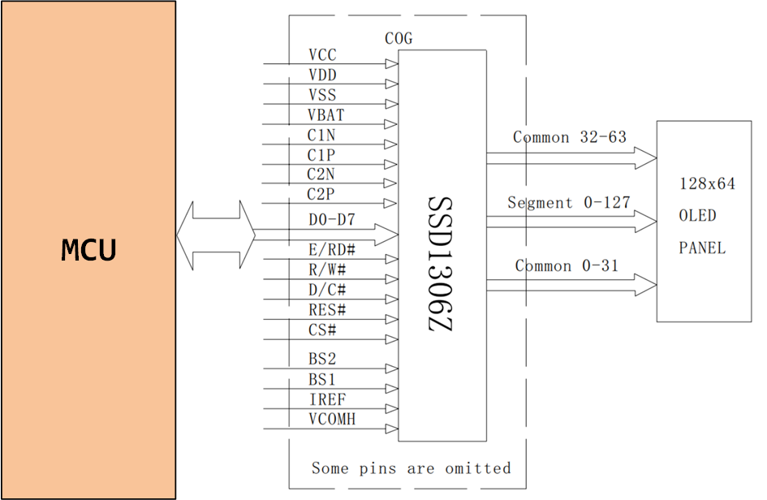
