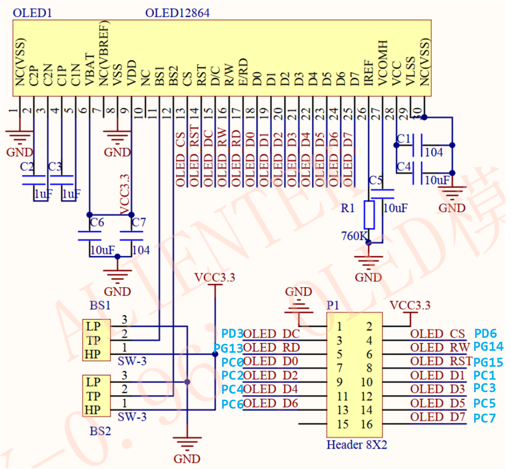
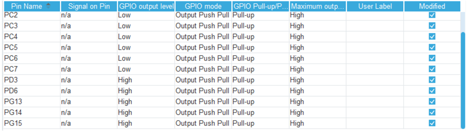
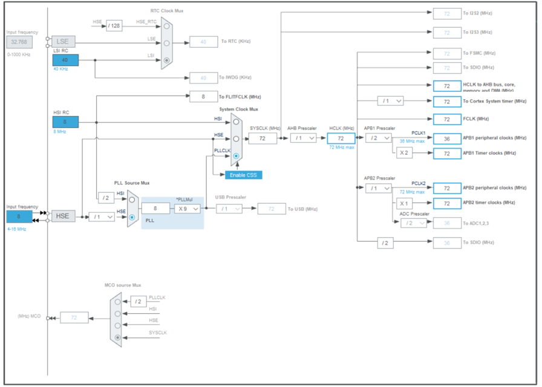
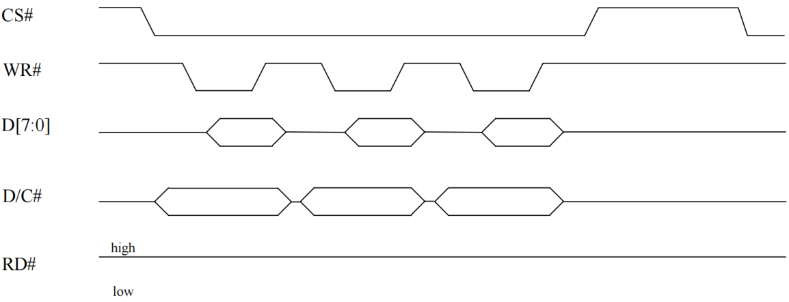
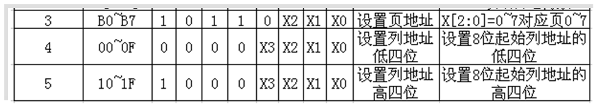
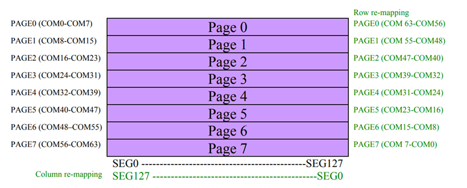

<!-- more -->


本节笔记放在这里，主要是为了学习8080时序，为后边FSMC产生8080时序做铺垫，这一部分的笔记是用GPIO模拟8080时序，这样对8080时序的认识会更深刻一些。由于我没有8080并口的OLED模块，所以还是以正点原子的OLED模块来进行时序的模拟。

## 一、硬件原理图



（1）CS： OLED 片选信号，对应 PD6。

（2）WR：向 OLED 写入数据，对应 PG14。

（3）RD：从 OLED 读取数据，对应 PG13。

（4）D[7： 0]： 8 位双向数据线，对应 PC[7： 0] 。

（5）RST(RES)：硬复位 OLED，对应 PG15。

（6）DC：命令/数据标志（0，读写命令； 1，读写数据），对应 PD3  。  

## 二、STM32CubeMX配置

### 1. GPIO配置

由于我们是模拟8080时序，所以只需要配置GPIO就可以了。



### 2. 时钟树



## 三、OLED显示实现

### 1. 宏定义

```c
//---------------------------OLED端口定义--------------------------  					   
#define OLED_CS  PDout(6)
#define OLED_RST PGout(15) 	
#define OLED_DC  PDout(3)
#define OLED_WR  PGout(14)		  
#define OLED_RD  PGout(13)	  

#define DATAOUT(x) GPIOC->ODR=(GPIOC->ODR&0xff00)|(x&0x00FF); //输出,PC0~7,作为数据线

#define OLED_CMD  0	// 写命令
#define OLED_DATA 1	// 写数据

uint8_t OLED_GRAM[128][8];	// 定义显存大小，要放在.c源文件中
```

### 2. 基本驱动函数实现

#### 2.1 GPIO初始化

首先肯定是我们引脚的初始化啦，由于是模拟8080时序，所以都是设置成推挽输出模式。

```c
void MX_GPIO_Init(void)
{

  GPIO_InitTypeDef GPIO_InitStruct = {0};

  /* GPIO Ports Clock Enable */
  __HAL_RCC_GPIOC_CLK_ENABLE();
  __HAL_RCC_GPIOD_CLK_ENABLE();
  __HAL_RCC_GPIOG_CLK_ENABLE();

  /*Configure GPIO pin Output Level */
  HAL_GPIO_WritePin(GPIOC, GPIO_PIN_0|GPIO_PIN_1|GPIO_PIN_2|GPIO_PIN_3|GPIO_PIN_4|GPIO_PIN_5|GPIO_PIN_6|GPIO_PIN_7, GPIO_PIN_RESET);
  HAL_GPIO_WritePin(GPIOD, GPIO_PIN_3|GPIO_PIN_6, GPIO_PIN_SET);
  HAL_GPIO_WritePin(GPIOG, GPIO_PIN_13|GPIO_PIN_14|GPIO_PIN_15, GPIO_PIN_SET);

  /*Configure GPIO pins : PC0 PC1 PC2 PC3 PC4 PC5 PC6 PC7 */
  GPIO_InitStruct.Pin = GPIO_PIN_0|GPIO_PIN_1|GPIO_PIN_2|GPIO_PIN_3
                          |GPIO_PIN_4|GPIO_PIN_5|GPIO_PIN_6|GPIO_PIN_7;
  GPIO_InitStruct.Mode = GPIO_MODE_OUTPUT_PP;
  GPIO_InitStruct.Pull = GPIO_PULLUP;
  GPIO_InitStruct.Speed = GPIO_SPEED_FREQ_HIGH;
  HAL_GPIO_Init(GPIOC, &GPIO_InitStruct);

  /*Configure GPIO pins : PD3 PD6 */
  GPIO_InitStruct.Pin = GPIO_PIN_3|GPIO_PIN_6;
  GPIO_InitStruct.Mode = GPIO_MODE_OUTPUT_PP;
  GPIO_InitStruct.Pull = GPIO_PULLUP;
  GPIO_InitStruct.Speed = GPIO_SPEED_FREQ_HIGH;
  HAL_GPIO_Init(GPIOD, &GPIO_InitStruct);

  /*Configure GPIO pins : PG13 PG14 PG15 */
  GPIO_InitStruct.Pin = GPIO_PIN_13|GPIO_PIN_14|GPIO_PIN_15;
  GPIO_InitStruct.Mode = GPIO_MODE_OUTPUT_PP;
  GPIO_InitStruct.Pull = GPIO_PULLUP;
  GPIO_InitStruct.Speed = GPIO_SPEED_FREQ_HIGH;
  HAL_GPIO_Init(GPIOG, &GPIO_InitStruct);

}
```

#### 2.2 向SSD1306写一个字节数据



```c
void OLED_WR_Byte(uint8_t dat,uint8_t cmd)
{
	DATAOUT(dat);   // STM32向D[7:0]输出数据
 	OLED_DC = cmd;  // 选择写入命令还是写入数据
	OLED_CS = 0;    // 拉低片选，选中SSD1306
	OLED_WR = 0;    // 拉低写使能信号，准备开始写入数据到OLED
	OLED_WR = 1;    // 拉高写使能信号，将数据从D[7:0]写入OLED
	OLED_CS = 1;    // 拉高片选，结束读写
	OLED_DC = 1;    // 命令数据选择位置1
} 
```

**【函数说明】**向SSD1306写入一个字节的数据，可以是命令也可以是数据，毕竟命令其实也是特殊的数据嘛。

**【参数说明】**

- dat ：要写入的数据/命令
- cmd ：数据/命令标志。0，表示命令;1，表示数据;

#### 2.3 更新GRAM数据到OLED

SSD1306是自带显存的，我们将数据写入到显存后，还需要将数据刷新到OLED显示，这样才能真正实现OLED的显示。



```c
void OLED_Refresh_Gram(void)
{
    uint8_t i, n;
    for(i = 0; i < 8; i++)
    {
        OLED_WR_Byte (0xb0 + i, OLED_CMD); //设置页地址（0~7）
        OLED_WR_Byte (0x00, OLED_CMD);     //设置显示位置—列低地址
        OLED_WR_Byte (0x10, OLED_CMD);     //设置显示位置—列高地址
        for(n = 0; n < 128; n++)
            OLED_WR_Byte(OLED_GRAM[n][i], OLED_DATA);
    }
}
```

**【函数说明】**我们在 STM32F1内部定义了一个块GRAM：OLED_GRAM\[128\]\[8\]此部分 GRAM 对应 OLED 模块上的 GRAM。在操作的时候，我们只要修改 STM32F1 内部的 GRAM 就可以了，然后通过 OLED_Refresh_Gram 函数把 GRAM 一次刷新到 OLED 的 GRAM 上。函数数先设置页地址，然后写入列地址（也就是纵坐标），然后从 0 开始写入 128 个字节，写满该页，最后循环把 8 页的内容都写入，就实现了整个从 STM32F1 显存到 OLED 显存的拷贝。    

#### 2.4 OLED清屏

```c
void OLED_Clear(void)
{
    uint8_t i, n;
    for(i = 0; i < 8; i++)
    {
        for(n = 0; n < 128; n++)
        {
            OLED_GRAM[n][i] = 0X00;
        }
    }
    OLED_Refresh_Gram();//更新显示
}
```

【函数说明】清屏函数,清完屏,整个屏幕是黑色的!和没点亮一样。

#### 2.5 SSD1306初始化

上边相关的驱动函数实现完毕后，就需要来初始化和配置我们的SSD1306啦：

```c
//初始化SSD1306					    
void OLED_Init(void)
{ 	 		 
    MX_GPIO_Init();	
    
	OLED_WR=1;
  	OLED_RD=1; 
	OLED_CS=1;
	OLED_DC=1;	 
	OLED_RST=0;
	HAL_Delay(100);
	OLED_RST=1; 
					  
	OLED_WR_Byte(0xAE,OLED_CMD); //关闭显示
	OLED_WR_Byte(0xD5,OLED_CMD); //设置时钟分频因子,震荡频率
	OLED_WR_Byte(80,OLED_CMD);   //[3:0],分频因子;[7:4],震荡频率
	OLED_WR_Byte(0xA8,OLED_CMD); //设置驱动路数
	OLED_WR_Byte(0X3F,OLED_CMD); //默认0X3F(1/64) 
	OLED_WR_Byte(0xD3,OLED_CMD); //设置显示偏移
	OLED_WR_Byte(0X00,OLED_CMD); //默认为0
	OLED_WR_Byte(0x40,OLED_CMD); //设置显示开始行 [5:0],行数.										    
	OLED_WR_Byte(0x8D,OLED_CMD); //电荷泵设置
	OLED_WR_Byte(0x14,OLED_CMD); //bit2，开启/关闭
	OLED_WR_Byte(0x20,OLED_CMD); //设置内存地址模式
	OLED_WR_Byte(0x02,OLED_CMD); //[1:0],00，列地址模式;01，行地址模式;10,页地址模式;默认10;
	OLED_WR_Byte(0xA1,OLED_CMD); //段重定义设置,bit0:0,0->0;1,0->127;
	OLED_WR_Byte(0xC0,OLED_CMD); //设置COM扫描方向;bit3:0,普通模式;1,重定义模式 COM[N-1]->COM0;N:驱动路数
	OLED_WR_Byte(0xDA,OLED_CMD); //设置COM硬件引脚配置
	OLED_WR_Byte(0x12,OLED_CMD); //[5:4]配置	 
	OLED_WR_Byte(0x81,OLED_CMD); //对比度设置
	OLED_WR_Byte(0xEF,OLED_CMD); //1~255;默认0X7F (亮度设置,越大越亮)
	OLED_WR_Byte(0xD9,OLED_CMD); //设置预充电周期
	OLED_WR_Byte(0xf1,OLED_CMD); //[3:0],PHASE 1;[7:4],PHASE 2;
	OLED_WR_Byte(0xDB,OLED_CMD); //设置VCOMH 电压倍率
	OLED_WR_Byte(0x30,OLED_CMD); //[6:4] 000,0.65*vcc;001,0.77*vcc;011,0.83*vcc;
	OLED_WR_Byte(0xA4,OLED_CMD); //全局显示开启;bit0:1,开启;0,关闭;(白屏/黑屏)
	OLED_WR_Byte(0xA6,OLED_CMD); //设置显示方式;bit0:1,反相显示;0,正常显示	    						   
	OLED_WR_Byte(0xAF,OLED_CMD); //开启显示	 
	OLED_Clear();
} 
```

**【函数说明】**上边的这些个命令，一般厂家都会提供给我们，我们直接按照厂家给的进行初始化就可以了。详细的每个命令可以干什么我们可以查看[SSD1306_datasheet](https://s.heltec.cn/download/oled/SSD1306-Revision_1.1_(Charge_Pump).pdf)的9 COMMAND TABLE 和 10 COMMAND DESCRIPTIONS  。

#### 2.6 OLED显示开关

##### 2.6.1 开启OLED显示

```c
//开启OLED显示
void OLED_Display_On(void)
{
    OLED_WR_Byte(0X8D, OLED_CMD); //SET DCDC命令
    OLED_WR_Byte(0X14, OLED_CMD); //DCDC ON
    OLED_WR_Byte(0XAF, OLED_CMD); //DISPLAY ON
}
```

##### 2.6.2 关闭OLED显示

```c
//关闭OLED显示
void OLED_Display_Off(void)
{
    OLED_WR_Byte(0X8D, OLED_CMD); //SET DCDC命令
    OLED_WR_Byte(0X10, OLED_CMD); //DCDC OFF
    OLED_WR_Byte(0XAE, OLED_CMD); //DISPLAY OFF
}
```

### 3. 应用函数的实现

应用函数主要是指完成画点，画线，显示字符等一系列的操作。不过这里暂时只写了一个画点函数，因为目前这一部分还不是重点，后边会再补充这里的笔记。

#### 3.1 画点函数



OLED_GRAM\[128\]\[8\]中的 128 代表列数（x 坐标），而 8 代表的是页， 每页又包含 8 行，总共 64 行（y 坐标）。从高到低对应行数从小到大。比如，我们要在 x=100， y=29 这个点写入1，则可以用这个语句实现：

```c
OLED_GRAM[100][4]|=1<<2；
```

所以一个通用的在点（x， y）置 1 表达式为 ：

```c
OLED_GRAM[x][7-y/8]|=1<<(7-y%8);// 其中 x 的范围为： 0~127； y 的范围为： 0~63。
```

所以我们可以写出这样一个画点的函数：

```c
//画点
void OLED_DrawPoint(uint8_t x, uint8_t y, uint8_t t)
{
    uint8_t pos, bx, temp = 0;
    if(x > 127 || y > 63)return; //超出范围了.
    pos = 7 - y / 8;
    bx = y % 8;
    temp = 1 << (7 - bx);
    if(t)OLED_GRAM[x][pos] |= temp;
    else OLED_GRAM[x][pos] &= ~temp;
}
```

**【函数说明】**这个函数可以实现在OLED的画一个点，其实就是点亮指定位置的像素点。

**【参数说明】**

- x ：横向的坐标，可以看做是列坐标，就是在第几列，范围是0~127
- y ：纵向的坐标，可以看做是行坐标，就是在第几行，范围是0~63
- t ：表示是点亮这个点，还是说清空这个点（熄灭），1 表示填充；0表示清空。
