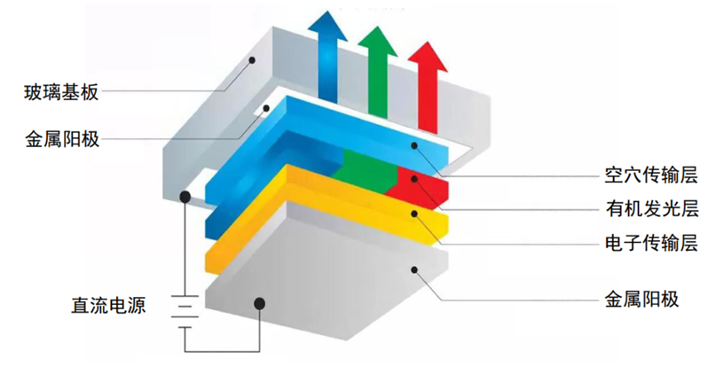

<!-- more -->

## 一、显示屏基础

显示器属于计算机的I/O设备，即**输入输出设备**。它是一种将特定电子信息输出到屏幕上再反射到人眼的显示工具。常见的有CRT显示器、液晶显示器、LED点阵显示器及OLED显示器。从第一个显示装置发明至今，已经快有百年历史。 在显示屏的发展中，依次出现了三大显示技术： CRT、LCD、 OLED，如图所示。  

### 1. CRT显示屏

1897年， 德国电气工程师、 发明家、 物理学家和诺贝尔物理学奖获得者卡尔·布劳恩（ Karl FerdinandBraun） ， 发明了CRT（ Cathode Ray Tube，阴极射线管） 用于验证粒子、电子等。

直到1925年，约翰·洛吉·贝尔德（ John Logie Baird） 基于CRT技术创造了世界上最早的电视。 在之后的几十年里，无论是电视还是电脑，都使用CRT显示器作为显示屏。 如图 38.1.2 所示， CRT显示器有一个很显著的特征，就是受限阴极射线管工作原理， 需要纵深很长的内部空间， 因此俗称“大屁股电视”：

其内部工作原理如图 ：

在真空玻壳(Glass vacuum envelope， 标号①)里， 阴极(Cathode，标号②)在电路控制下发出三束由电子组成的电子束(Electron beam)。 电路上控制偏转线圈(Deflection yoke，标号④)产生磁场使电子束偏转到荧光屏(Fluorescent screen，标号⑤)指定位置（也就是像素点） ， 荫罩(Shadow mask，标号⑥)用于过滤电子束，防止“溢出”到相邻像素点。荧光屏上布满荧光粉(Phosphor，标号⑧)， 每个荫罩对应的像素点位置都有三个荧光点(Phosphor dots，标号⑦)，分别对应红色、绿色、蓝色， 电子打在上面会产生对应颜色的光。通过控制阴极三束电子的发射强度，就能控制三原色各自的亮度，从而组合形成任意颜色。最后， 电子枪依次激发屏幕上的所有荧光点， 达到一定速度后， 由于人的视觉暂留效应（ Persistence of vision ） ，就会看到整个屏幕显示图像。  

### 2. LCD屏

1888年，奥地利植物学家和化学家斐德烈‧莱尼泽（ Friedrich Reinitzer） 从胡萝卜中提炼出一种化合物该化合物在特定条件下， 具备液体的流动性和类似晶体的某种排列特性， 因此命名为液晶（ Liquid Crystal）。

到20世纪60年代， RCA实验室的研究人员发现液晶在电场的作用下， 液晶分子的排列会产生变化，继而造成光线的扭曲或折射， 这种现象被称为电光效应。随后在1964年， RCA实验室的研究人员利用液晶的电光效应发明了首个液晶显示器（ Liquid Crystal Display， LCD） 。

LCD的工作原理如图所示：

首先由**背光源产生一个非偏振光源**， 当它经过后偏光片（假设为垂直偏光片） 时，光线将变为垂直偏振， 随后该光进入液晶。 如果此时电路未通电， 相邻液晶分子之间方向略有不同， 将垂直偏振光逐渐变为水平偏振光，最后前偏光片（假设为垂直偏光片） 将阻挡水平偏振光， 观察者只能看到一片黑色。 如果此时电路通电，相邻液晶分子在电场作用下统一水平排列，垂直偏振光不发生任何变化，最后通过前偏光片（假设为垂直偏光片） 照在彩色滤光片上，观察者将看到一片红色。这里可以简单的把偏光片、控制电路、液晶看作一个不透光的挡板。 可以通过电路实现整个单板的开闭的多少，实现背光源照在彩色滤波片的多少， 从而控制红色的亮度。 再类似的实现绿色、蓝色， 便可实现彩色显示。  

根据液晶排列方式的不同， 可分为扭转式向列型（ Twisted Nematic, TN） 、超扭转式向列型（ SuperTwisted Nematic, STN） 、 横向电场效应型（ In Panel Switch， IPS） 、 垂直排列型 (Vertical Alignment， VA)。根据驱动形式的不同， 可分为无源矩阵液晶显示屏（ Passive Matrix LCD， PMLCD） ， 主要用于TN、STN； 有源矩阵液晶显示屏（ Active Matrix LCD， AMLCD） ， 主要用于TFT。我使用的正点原子开发板上的显示屏就是TFT类型的LCD。  

TFTLCD即薄膜晶体管液晶显示器。它与无源TN-LCD、STN-LCD的简单矩阵不同，它在液晶显示屏的每一个象素上都设置有一个薄膜晶体管（TFT），可有效地克服非选通时的串扰，使显示液晶屏的静态特性与扫描线数无关，因此大大提高了图像质量。

TFTLCD具有：亮度好、对比度高、层次感强、颜色鲜艳等特点。是目前最主流的LCD显示器。广泛应用于电视、手机、电脑、平板等各种电子产品。但是需要注意 的是**液晶本身是不发光**的，所以需要有一个背光灯提供光源，光线经过一系列处理过程才到输出，所以输出的光线强度是要比光源的强度低很多的，比较浪费能源(当然，比CRT显示器还是节能多了)。而且这些处理过程会导致显示方向比较窄，也就是它的视角较小，从侧面看屏幕会看不清它的显示内容。另外，输出的色彩变换时，液晶分子转动也需要消耗一定的时间，导致屏幕的响应速度低。

<table>
	<tbody>
    <tr><td align="center">LCD类型 </td><td align="center">TN          </td><td align="center">STN         </td><td align="center">TFT</td></tr>
    <tr><td align="center">驱动方式  </td><td align="center">扭转式向列型</td><td align="center">扭转式向列型</td><td align="center">薄膜式晶体管型</td></tr>
    <tr><td align="center">可视角度  </td><td align="center">小          </td><td align="center">中          </td><td align="center">大</td></tr>
    <tr><td align="center">画面对比度</td><td align="center">小          </td><td align="center">中          </td><td align="center">大</td></tr>
    <tr><td align="center">显示颜色  </td><td align="center">黑色或单色  </td><td align="center">单色或彩色  </td><td align="center">彩色</td></tr>
    <tr><td align="center">成本      </td><td align="center">低          </td><td align="center">中          </td><td align="center">高</td></tr>
    <tr><td align="center">应用领域</td><td align="center">计算器、电子表等 </td><td align="center">汽车仪表显示等 </td><td align="center">各类彩色显示屏 </td></tr>
	</tbody>
</table>

### 3. OLED屏

1979年的一天晚上， 华裔科学家邓青云（ Dr. C. W. Tang） 博士在回家路上忽然想起了有东西忘记在实验室。晚上回到实验室，在黑暗中看到机蓄电池在闪闪发光， 于是开始了对有机发光二极管的研究。随着有机发光二极管技术难题的逐渐突破， 柯达公司生产出有机发光二极管显示器（ Organic Light-Emitting Diode，OLED） 。
 OLED的工作原理比较简单，使用有机材料实现了类似半导体PN结的功能效果， 通电后有机发光二极管就发光， 通的电越多，亮度越高， 通过红、绿、蓝不同配比，实现组成各种颜色。  

OLED显示器不需要背光源、对比度高、轻薄、视角广及响应速度快等优点。待到生产工艺更加成熟时，必将取代现在液晶显示器的地位。对于不同种类的显示器，其控制程序原理是类似的，都是以操作像素点为基础。

### 4. LED和Micro LED 

前面OLED使用的有机发光二极管组成显示器，有没有直接使用生活中常见的半导体发光二极管，作为显示屏呢？ 这个当然有，在很多大型户外广告牌、店招滚动广告上， 都能看到LED显示屏的身影，如图所示：

LED显示屏由众多LED灯组成， 由于LED灯结构、 工艺、 散热、成本等限制， 无法做得很小， 因此画质清晰度比较差， 通常用于远距离观看。  

而Micro LED技术，将LED长度缩小到100μ m以下，是常见LED的1%，比一粒沙子还要小。 因为MicroLED单元过于微小， 加大了制造的复杂性和更多的潜在问题，目前各企业正在积极研发中。  

Micro LED没有LCD的液晶层，可以像OLED一样独立控制每个像素的开关和亮度，继承了几乎所有LCD和OLED的优点，如果后面Micro LED技术成熟， 解决生产上的技术难题，那么Micro LED可能将会是下一代主流显示技术。 如表所示，为LCD、 OLED、 Micro LED的对比。  

|  显示技术  |   LCD    |   OLED   | Micro LED |
| :--------: | :------: | :------: | :-------: |
|  技术类型  |   背光   |  自发光  |  自发光   |
| 亮度(nits) |   500    |   500    |   5000    |
|  发光效率  |    低    |    中    |    高     |
|   对比度   |    低    |    高    |    高     |
|  响应时间  |   ms级   |   us级   |   ns级    |
|  厚度(mm)  | 厚,＞2.5 | 薄,1~2.5 | 薄,＜0.05 |
| 寿命(小时) |   60K    |  20~30K  |  80~100K  |
|    成本    |    低    |    中    |    高     |
|    功耗    |    高    |    中    |    低     |

### 5. 显示屏基本参数

- **像素**：像素（ Pixel）由图像（ Picture） 和元素（ Element）这两个单词的字母所组成。 指组成图像的最小单位，也就是前面屏幕中的每一个显示单元。  
- **分辨率**：由显示像素的数量定义，表示为水平方向的像素数量x垂直方向的像素数量。 比如分辨率320x240表示水平方向有320个像素点，垂直方向有240个像素点。 如分辨率800x480表示该显示器的每一行有800个像素点， 每一列有480个像素点，也可理解为有800列，480行。 
- **色深**：由可以绘制像素的颜色数量定义， 以每像素位数（ bpp）来表示。 比如24bpp的色深（也可以使用RGB888表示）， 即组成每个像素的红、绿、蓝， 每个都有28个亮度等级，组合起来就有28\*28\*28=16777216，即每个像素颜色有16777216种。
- **刷新率**：每秒图像刷新的次数，单位Hz。 刷新率越高，图像画面看起来过渡更流畅。
- **显示器尺寸**：显示器的大小一般以英寸表示，如5英寸、21英寸、24英寸等，这个长度是指屏幕对角线的长度， 通过显示器的对角线长度及长宽比可确定显示器的实际长宽尺寸。
- **点距**：点距指两个相邻像素点之间的距离，它会影响画质的细腻度及观看距离，相同尺寸的屏幕，若分辨率越高，则点距越小， 画质越细腻。如现在有些手机的屏幕分辨率比电脑显示器的还大，这是手机屏幕点距小的原因；LED点阵显示屏的点距一般都比较大，所以适合远距离观看。
- **显存**：液晶屏中的每个像素点都是数据，在实际应用中需要把每个像素点的数据缓存起来，再传输给液晶屏，一般会使用SRAM或SDRAM性质的存储器， 而这些专门用于存储显示数据的存储器，则被称为显存。显存一般至少要能存储液晶屏的一帧显示数据，如分辨率为800x480的液晶屏， 使用RGB888格式显示，它的一帧显示数据大小为：3x800x480=1152000字节；若使用RGB565格式显示，一帧显示数据大小为：2x800x480=768000字节。一般来说，外置的液晶控制器会自带显存，而像STM32F429等集成液晶控制器的芯片可使用内部SRAM或外扩SDRAM用于显存空间。

## 二、显示接口介绍

### 1. 嵌入式图形系统组成

前面介绍了几种常见显示屏工作原理和内部结构，在嵌入式领域，由于成本、使用寿命等限制，通常使用LCD作为显示屏。通常的嵌入式图形系统如图所示，可以看作由四部分组成： 微控制器、帧缓冲器、显示控制器、显示屏。 

MCU根据代码内容计算需要显示的图像数据， 然后将这些图像数据放入帧缓冲器。帧缓冲器本质是一块内存， 因此也被称为GRAM（ Graphic RAM）。 帧缓冲器再将数据传给显示控制器，显示控制器将图像数据解析，控制显示屏对应显示。 

### 2. MCU屏

帧缓冲器和显示控制器，可以集成在MCU内部，也可以和显示屏做在一起。 对于大部分中、低端MCU，不含显示控制器，内部SRAM也比较小，因此采用如下图所示的显示方案， 将帧缓冲器、显示控制器和显示屏制作在一起，这样的屏幕习惯上称为“ MCU屏”。  

### 3. RGB屏

对于部分高端MCU或MPU，本身含有显示控制器， 使用内部SRAM或外部SRAM， 如下图所示，通过并行的RGB信号和控制信号直接控制显示屏， 这样的屏幕习惯上称为“ RGB屏” 。  

### 4. 显示接口

MIPI（ Mobile Industry Processor Interface，移动行业处理器接口） 是ARM、 ST、 TI等公司成立的一个联盟， 致力于定义和推广移动设备接口的规范标准化，从而减小移动设备的设计复杂度。MIPI-DBI（ Display Bus Interface， 显示总线接口） 是MIPI联盟发布的第一个显示标准，用来规定显示接口， MIPI-DBI中定义了三类接口：  

（1）A类：基于Motorola 6800总线  ；

（2）B类：基于Intel 8080总线 ；

（3）C类：基于SPI协议 ；

MIPI-DBI用于与MCU屏（带有显示控制器和帧缓冲器） 进行连接  ，如下图：

MIPI-DPI（ Display Pixel Interface， 显示像素接口） ，从名称就可以看出它是直接对屏幕的各像素点进行操作，利用H-SYNC（行同步信号）和V-SYNC（场同步信号） 对各像素点进行颜色填充，类似CRT中电子枪那样扫描显示。 MIPI-DPI用于与RGB屏（不含显示控制器和帧缓冲器）进行连接， 如下图所示，像素数据需要实时流式传输到显示屏，对MCU性能有一定要求。  

MIPI-DSI（ Display Serial Interface， 显示串行接口），从名称可以看出它是串行传输，不过传输信号是差分信号， 实现了低噪声和低功耗。 包含MIPI-DSI接口的MCU与显示屏的某连接如下图所示。 DSI封装了DBI或DPI信号，并通过PPI协议将它其发送到D-PHY，通过差分信号传输到显示屏模块的DSI控制器解析。  

### 5. STM32对MIPI接口的支持

对于STM32系列的MCU，不同型号对MIPI联盟显示接口的支持有所不同，总结如下 ：

（1）所有STM32 MCU均支持MIPI-DBI C类接口（基于SPI协议）；  

（2）带FSMC的所有STM32 MCU均支持MIPI-DBI A类和B类接口；  

（3）带LTDC的STM32 MCU支持MIPI-DPI接口；  

（4）带DSI Host的STM32 MCU支持MIPI-DSI接口 ；

<table>
<tbody>
<tr><td align="center" colspan=2>显示接口</td><td align="center">连接示意图</td><td align="center">代表MCU</td></tr>
<tr><td align="center" rowspan=3>DBI</td><td align="left">A类 Motorola 6800</td><td align="center" rowspan=2></td><td align="center" rowspan=2>STM32F103ZET6</td></tr>
<tr><td align="left">B类 Intel 8080</td></tr>
<tr><td align="left" >C类 SPI</td><td align="center"></td><td align="center">所有STM32 MCU</td></tr>
<tr><td align="center" colspan=2>DPI</td><td align="center"></td><td align="center">STM32F429/439</td></tr>
<tr><td align="center" colspan=2>DSI</td><td align="center"></td><td align="center">STM32F7x8/7x9</td></tr>
</tbody>
</table>

## 三、TFTLCD与RGBLCD

### 1. 这两种是啥？

我们在学习LCD的过程中，会看到有两种屏幕，分别是TFTLCD和RGBLCD，它们都是液晶屏，我的理解是，严格来讲他们都是LCD屏幕，但是对外接口不同。其实就是上一节笔记中的MCU屏和RGB屏，不过在这里再总结一下。

- MCU-LCD屏它与RGB-LCD屏主要区别在于显存的位置：

（1）MCU-LCD的设计之初只要考虑单片机的内存较小，因此都是把显存内置在LCD模块内部。然后软件通过专门显示命令来更新显存，因此MCU屏往往不能做得很大。同时显示更新速度也比RGB-LCD慢。

（2）RGB-LCD的显存是由系统内存充当的，因此其大小只受限于系统内存的大小，这样RGB-LCD可以做出较大尺寸。

- MCU-LCD屏它与RGB-LCD屏量示数据传输模式也有差别：

（1）MCU屏需要发送画点的命令来修改MCU内部RAM。（即不能直接MCU屏RAM）所以RGB显示速度明显比MCU快，而且播放视频方面，MCU-LCD也比较慢。

（2）RGB屏只需显存组织好数据。启动显示后，LCD-DMA会自动把显存通过RGB接口送到LCM。主机输出的直接是每个像素的RGB数据，不需要进行变换(GAMMA校正等除外)，对于这种接口，需要在主机部分有个LCD控制器，以产生RGB数据和点、行、帧同步信号。 

> Tips：什么是LCM？
>
> LCM（LCD Module）即LCD显示模组、液晶模块，是指将液晶显示器件,连接件，控制与驱动等外围电路，PCB电路板，背光源,结构件等装配在一起的组件。
>
> LCM提供用户一个标准的LCD显示驱动接口（有4位、8位、VGA等不同类型），用户按照接口要求进行操作来控制LCD正确显示。LCM是一种更高集成度的LCD产品，对小尺寸LCD显示，LCM可以比较方便地与各种微控制器（比如单片机）连接。

### 2. 接口框架

两种类型的LCD屏幕与CPU的接口框架如下图所示：

### 3. 裸屏接线

#### 3.1 TFTLCD

这里以正点原子的 ATK-MD0280 模块（2.8寸电阻触摸屏，分辨率为320\*240）为例，我们看一下裸屏引脚图：[00ATK-MD0280裸屏尺寸图（钢化玻璃TP）.pdf](https://gitee.com/docs-site/scm-reference-guide/raw/master/10-显示屏参考资料/TFTLCD参考资料/00ATK-MD0280裸屏尺寸图（钢化玻璃TP）.pdf)

#### 3.2 RGBLCD

这里以正点原子的 ATK-MD0280 模块（2.8寸电阻触摸屏，分辨率为320\*240）为例，我们看一下裸屏引脚图：[4.3寸800480裸屏规格书.pdf](https://gitee.com/docs-site/scm-reference-guide/raw/master/10-显示屏参考资料/RGBLCD参考资料/ATK-MD0430R-800480裸屏资料/4.3寸800480裸屏规格书.pdf)

## 四、RGB基础

这一部分可以看去音视频的文档库看：[图像基础 | Media](https://docs-site.github.io/media-docs/sdoc/image/img-basic/126b085ea655021acc5a21b7.html)
