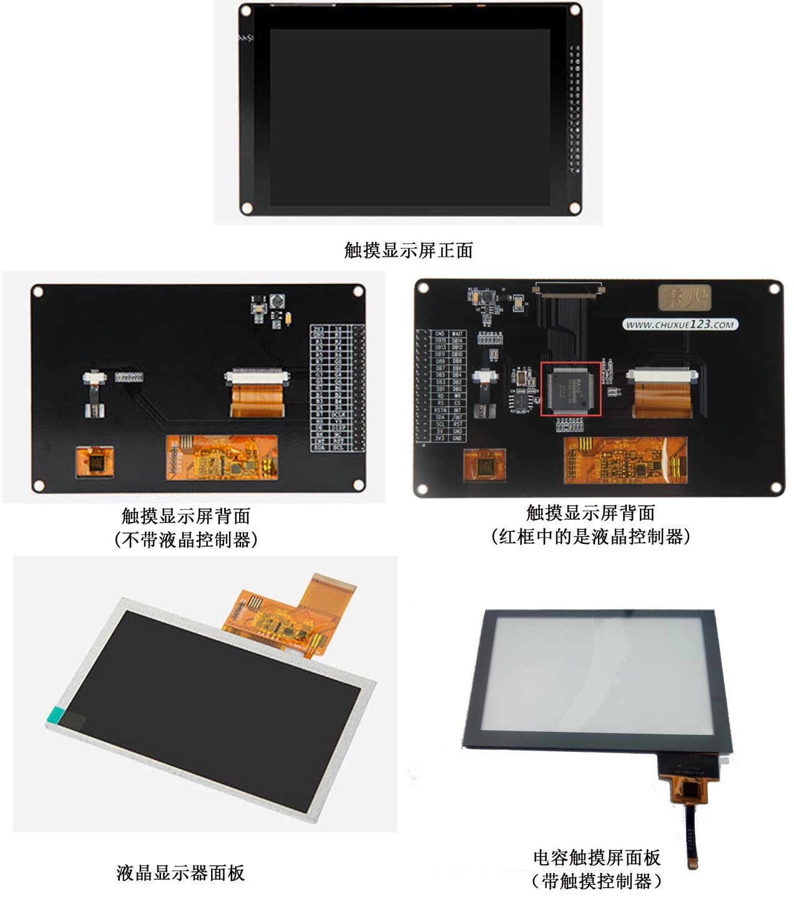
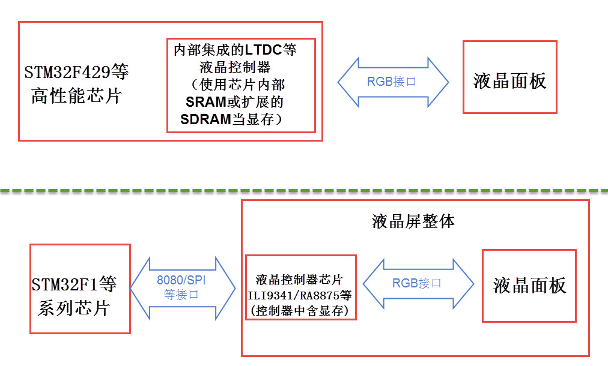
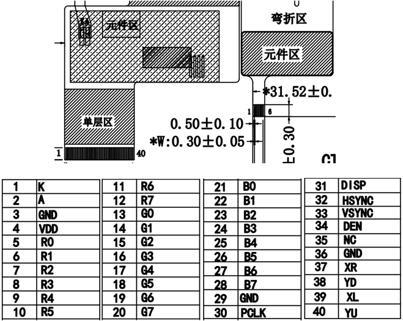
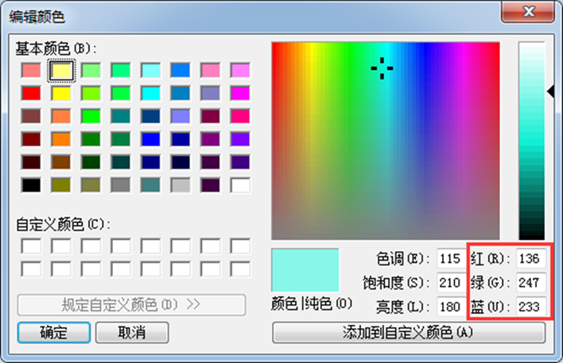
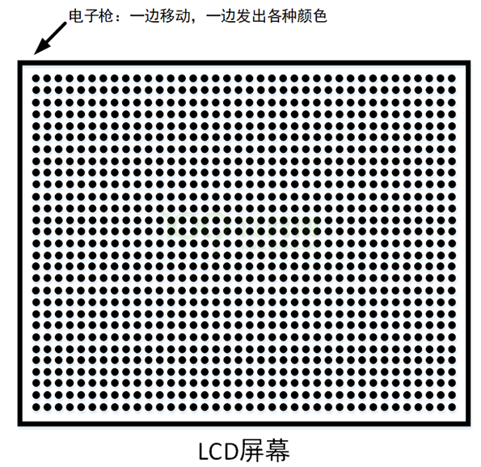
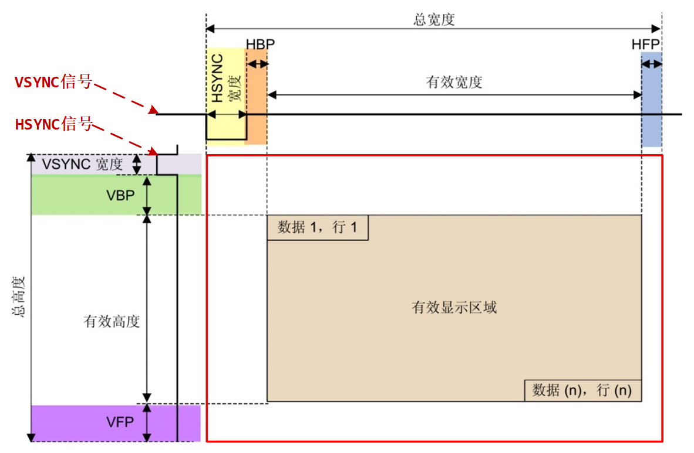
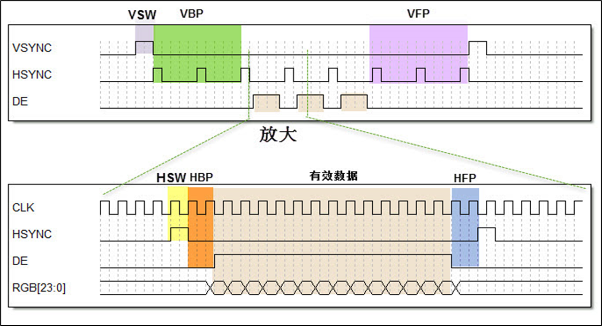
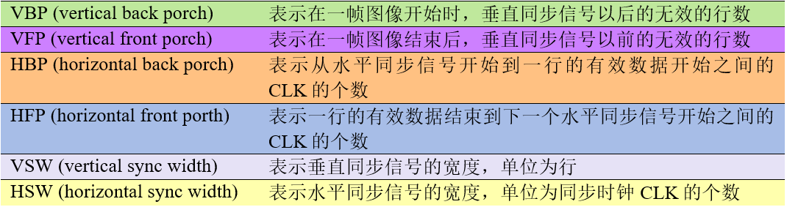
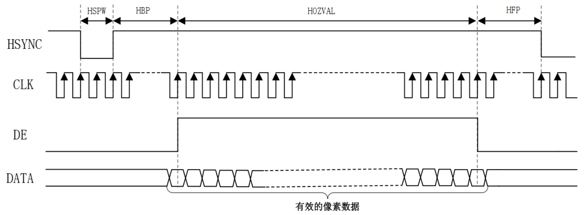
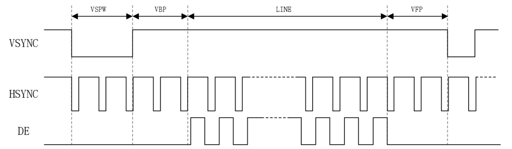

<!-- more -->

## 一、显示屏的组成

下图是两种适合于STM32芯片使用的显示屏，我们以它为例讲解控制液晶屏的基本原理。



这个完整的显示屏由**液晶显示面板**、电容**触摸面板**以及**PCB底板**构成。图中的触摸面板带有触摸控制芯片，该芯片处理触摸信号并通过引出的信号线与外部器件通讯， 触摸面板中间是透明的，它贴在液晶面板上面，一起构成屏幕的主体，触摸面板与液晶面板引出的排线连接到PCB底板上，根据实际需要， PCB底板上可能会带有“液晶控制器芯片”，图中右侧的液晶屏PCB上带有RA8875液晶控制器。

因为控制液晶面板需要比较多的资源， 所以大部分低级微控制器都不能直接控制液晶面板，需要额外配套一个专用液晶控制器来处理显示过程，外部微控制器只要把它希望显示的数据直接交给液晶控制器即可。 而不带液晶控制器的PCB底板 ，只有小部分的电源管理电路，液晶面板的信号线与外部微控制器相连，直接控制。

STM32F429系列的芯片不需要额外的液晶控制器， 也就是说它把专用液晶控制器的功能集成到STM32F429芯片内部了，可以理解为电脑的CPU集成显卡，它节约了额外的控制器成本。 而STM32F1系列的芯片由于没有集成液晶控制器到芯片内部，所以它只能驱动自带控制器的屏幕，可以理解为电脑的外置显卡。总的来说，这两类屏幕的控制框图如图：



## 二、4.3寸RGBLCD

这一部分我还是以正点原子的4.3寸RGBLCD屏幕进行学习，分辨率为800\*480这个其实是我学习linux驱动开发的时候使用的这里拿来作为例子再学习一下。

### 1. 相关资料

- ATK-MD0430R-800480模块用户手册：[正点原子ATK-MD0430R模块用户手册.pdf](https://gitee.com/docs-site/scm-reference-guide/raw/master/10-显示屏参考资料/RGBLCD参考资料/正点原子ATK-MD0430R模块用户手册.pdf)
- 4.3寸800480裸屏规格书：[4.3寸800480裸屏规格书.pdf](https://gitee.com/docs-site/scm-reference-guide/raw/master/10-显示屏参考资料/RGBLCD参考资料/ATK-MD0430R-800480裸屏资料/4.3寸800480裸屏规格书.pdf)

### 2. 裸屏原理图



我们来看一些关键的控制信号线：

| 信号名称 | 说明             |
| -------- | ---------------- |
| R[7:0]   | 8 位红色数据线   |
| G[7:0]   | 8 位绿色数据线   |
| B[7:0]   | 8 位蓝色数据线   |
| PCLK     | 像素同步时钟信号 |
| HSYNC    | 水平同步信号     |
| VSYNC    | 垂直同步信号     |
| DE       | 数据使能信号     |

RGBLCD的信号线， R[7:0]、G[7:0]和B[7:0]这24根是数据线， DE、VSYNC、HSYNC 和 PCLK 这四根是控制信号线。 RGB LCD 一般有两种驱动模式： DE 模式和 HV 模式，这两个模式的区别是 DE 模式需要用到 DE 信号线，而 HV 模式不需要用到 DE 信号线，在 DE模式下是可以不需要 HSYNC 信号线的，即使不接 HSYNC 信号线 LCD 也可以正常工作。  

### 3. 控制信号说明

#### 3.1 RGB信号线

RGB信号线各有8根，分别用于表示液晶屏一个像素点的红、绿、蓝颜色分量。使用红绿蓝颜色分量来表示颜色是一种通用的做法，打开Windows系统自带的画板调色工具，可看到颜色的红绿蓝分量值，常见的颜色表示会在“RGB”后面附带各个颜色分量值的数据位数，如RGB565表示红绿蓝的数据线数分别为5、6、5根，一共为16个数据位，可表示2\^16种颜色；而这个液晶屏的种颜色分量的数据线都有8根，所以它支持RGB888格式，一共24位数据线，可表示的颜色为2\^24种。



另外该模块的数据线 R7、 G7 和 B7 可以用于区分 RGB 屏的类型（可以看做是 ID）。MCU 在初始化 RGB 屏参数之前，先读取 R7/G7/B7 的状态，从而判断 RGB 屏类型。

| M2(B7) | M1(G7) | M0(R7) | RGBLCD 模块参数                 |
| :----: | :----: | :----: | ------------------------------- |
|   0    |   0    |   0    | 4.3 寸， 480\*272 分辨率（RGB） |
|   0    |   0    |   1    | 7 寸， 800\*480 分辨率（RGB）   |
|   0    |   1    |   0    | 7 寸， 1024\*600 分辨率（RGB）  |
|   0    |   1    |   1    | 7 寸， 1280\*800 分辨率（RGB）  |
|   1    |   0    |   0    | 4.3 寸， 800\*480 分辨率（RGB） |
|   1    |   0    |   1    | 10.1 寸 1280*800 分辨率（RGB）  |
|   X    |   X    |   X    | 暂时未用到                      |

我们可以通过读取 R7/G7/B7 来判断 LCD 的尺寸和分辨率，从而使得 MCU可以在同一个程序里面，兼容不同尺寸和分辨率的 RGB 屏。 从表可知，ATK-MD0430R-480272 屏幕 ID 为 000，而 ATK-MD0430R-800480 屏幕 ID 为 100。

#### 3.2 数据使能信号DE

数据使能信号DE(Data Enable)用于表示数据的有效性，当DE信号线为高电平时，RGB信号线表示的数据有效。

#### 3.3 PCLK、HSYNC和VSYNC

- 同步时钟信号PCLK

液晶屏与外部使用同步通讯方式，以PCLK信号作为同步时钟，在同步时钟的驱动下，每个时钟传输一个像素点数据。

- 水平同步信号HSYNC

水平同步信号HSYNC(Horizontal Sync)用于表示液晶屏一行像素数据的传输结束，每传输完成液晶屏的一行像素数据时，HSYNC会发生电平跳变，如分辨率为800x480的显示屏(800列，480行)，传输一帧的图像HSYNC的电平会跳变480次。

- 垂直同步信号VSYNC

垂直同步信号VSYNC(Vertical Sync)用于表示液晶屏一帧像素数据的传输结束，每传输完成一帧像素数据时，VSYNC会发生电平跳变。其中“帧”是图像的单位，一幅图像称为一帧，在液晶屏中，一帧指一个完整屏液晶像素点。人们常常用“帧/秒”来表示液晶屏的刷新特性，即液晶屏每秒可以显示多少帧图像，如液晶屏以60帧/秒的速率运行时，VSYNC每秒钟电平会跳变60次。

#### 3.4 显示的基本原理



假设上图是一个 LCD 屏幕，屏幕中一个一个密密麻麻的黑点称之为像素点，每一行有若干个点，试想下有一个电子枪，电子枪位于某一个像素点的背后，然后向这个像素发射红，绿，蓝三种原色，这三种颜色按不同的比例组合成任意一种颜色。电子枪在像素点的背后，一边移动一边发出各种颜色的光，电子枪从左往右移动，到右边边缘之后就跳到下一行的行首，继续从左往右移动，如此往复，一直移动到屏幕右下角的像素点，最后就跳回原点。  

（1）电子枪如何移动？

答： 有一条像素时钟信号线（ DCLK），连接屏幕，每来一个像素时钟信号（ DCLK），电子枪就移动一个像素。  

（2）电子枪打出的颜色该如何确定？

答：有三组红，绿，蓝信号线（ RGB），连接屏幕，由这三组信号线（ RGB）传递颜色 。

（3）电子枪移动到 LCD 屏幕右边边缘时，如何得知需要跳到下一行的行首？  

答：有一条水平同步信号线（ HSYNC），连接屏幕，当接收到水平同步信号（ HSYNC），电子枪就跳到下一行的最左边  。

（4）电子枪如何得知需要跳到原点？  

答：有一条垂直同步信号线（ VSYNC），连接屏幕，当接收到垂直同步信号线（ VSYNC），电子枪就由屏幕右下脚跳到左上角（原点）  。

（5）电子枪如何得知三组信号线（ RGB）确定的颜色就是它是需要的呢？  

答：有一条RGB数据使能信号线（ DE），连接屏幕，当接收到数据使能信号线（ DE），电子枪就知道这时由这三组信号线（ RGB）确定的颜色是有效的，可以发射到该像素点。  

### 4. LCD时间参数

如果将 LCD 显示一帧图像的过程想象成绘画，那么在显示的过程中就是用一根“笔”在不同的像素点画上不同的颜色。假设这根笔按照从左至右、从上到下的顺序扫描每个像素点，并且在像素画上对应的颜色，当画到最后一个像素点的时候一幅图像就绘制好了，其扫描如图所示：



我们来看一下 LCD 是怎么扫描显示一帧图像的。一帧图像也是由一行一行组成的。 HSYNC 是水平同步信号，也叫做行同步信号，**当产生此信号的话就表示开始显示新的一行了**，所以此信号都是在上图的最左边。当 VSYNC 信号是垂直同步信号，也叫做帧同步信号，**当产生此信号的话就表示开始显示新的一帧图像了**，所以此信号在上图的左上角。  

上图中我们可以看到有一圈“黑边”（红色边框和有效显示区域之间的部分），真正有效的显示区域是中间部分。那这一圈“黑边”是什么东西呢？这就要从显示器的“祖先” CRT 显示器开始说起了， CRT 显示器就是以前很常见的那种大屁股显示器，CRT 显示器屁股后面是个电子枪，这个电子枪就是我们上面说的“画笔”，电子枪打出的电子撞击到屏幕上的荧光物质使其发光。只要控制电子枪从左到右扫完一行(也就是扫描一行)，然后从上到下扫描完所有行，这样一帧图像就显示出来了。也就是说，显示一帧图像电子枪是按照 ‘Z’ 形在运动，当扫描速度很快的时候看起来就是一幅完成的画面了。    

当显示完一行以后会发出 HSYNC 信号，此时电子枪就会关闭，然后迅速的移动到屏幕的左边，当 HSYNC 信号结束以后就可以显示新的一行数据了，电子枪就会重新打开。在 HSYNC信号结束到电子枪重新打开之间会插入一段延时，这段延时就图中的 HBP。当显示完一行以后就会关闭电子枪等待 HSYNC 信号产生，关闭电子枪到 HSYNC 信号产生之间会插入一段延时，这段延时就是图中的 HFP 信号。

同理，当显示完一帧图像以后电子枪也会关闭，然后等到 VSYNC 信号产生，期间也会加入一段延时，这段延时就是图中的 VFP。VSYNC 信号产生，电子枪移动到左上角，当 VSYNC 信号结束以后电子枪重新打开，中间也会加入一段延时，这段延时就是图中的 VBP。  

HBP、 HFP、 VBP 和 VFP 就是导致图中黑边的原因，但是这是 CRT 显示器存在黑边的原因，现在是 LCD 显示器，不需要电子枪了，那么为何还会有黑边呢？这是因为 RGB LCD屏幕内部是有一个 IC 的，发送一行或者一帧数据给 IC， IC 是需要反应时间的。通过这段反应时间可以让 IC 识别到一行数据扫描完了，要换行了，或者一帧图像扫描完了，要开始下一帧图像显示了。因此，在 LCD 屏幕中继续存在 HBP、 HFP、 VPB 和 VFP 这四个参数的主要目的是为了锁定有效的像素数据。这四个时间是 LCD 重要的时间参数，后面编写 LCD 驱动的时候要用到的，至于这四个时间参数具体值是多少，那要需要去查看所使用的 LCD 数据手册了。  

### 5. RGB LCD 屏幕时序  

#### 5.1 一帧图像的时序

向液晶屏传输一帧图像数据的时序图如下：



图中表示的是向液晶屏传输一帧图像数据的时序，中间省略了多行及多个像素点。液晶屏显示的图像可看作一个矩形，可以结合上一小节 《4. LCD时间参数》来理解。液晶屏有一个显示指针，它指向将要显示的像素。显示指针的扫描方向方向从左到右、从上到下，一个像素点一个像素点地描绘图形。这些像素点的数据通过 RGB 数据线传输至液晶屏，它们在同步时钟 CLK 的驱动下一个一个地传输到液晶屏中，交给显示指针，传输完成一行时，水平同步信号 HSYNC 电平跳变一次，而传输完一帧时 VSYNC 电平跳变一次。但是，液晶显示指针在行与行之间，帧与帧之间切换时需要延时，而且 HSYNC 及 VSYNC 信号本身也有宽度，这些时间参数说明如下表：



在这些时间参数控制的区域，数据使能信号线“DE”都为低电平， RGB 数据线的信号无效，当“DE”为高电平时，表示的数据有效，传输的数据会直接影响液晶屏的显示区域。  

接下来我们再单独来看行和帧的时序。

#### 5.2 行显示时序



（1）HSYNC：行同步信号，当此信号有效的话就表示开始显示新的一行数据，查阅所使用的LCD 数据手册可以知道此信号是低电平有效还是高电平有效，假设此时是低电平有效。

（2）HSPW： 有些地方也叫做 thp，是 HSYNC 信号宽度，也就是 HSYNC 信号持续时间。 HSYNC信号不是一个脉冲，而是需要持续一段时间才是有效的，单位为 CLK。

（3）HBP： 有些地方叫做 thb，术语叫做行同步信号后肩，单位是 CLK。

（4）HOZVAL：有些地方叫做 thd，显示一行数据所需的时间，假如屏幕分辨率为 800\*480，那么 HOZVAL 就是 800，单位为 CLK。

（5）HFP：有些地方叫做 thf，术语叫做行同步信号前肩，单位是 CLK。

当 HSYNC 信号发出以后，需要等待 HSPW+HBP 个 CLK 时间才会接收到真正有效的像素数据。当显示完一行数据以后需要等待 HFP 个 CLK 时间才能发出下一个 HSYNC 信号，所以显示一行所需要的时间就是：

```c
 T行 = HSPW + HBP + HOZVAL + HFP
```

#### 5.3 帧显示时序



（1）VSYNC：帧同步信号，当此信号有效的话就表示开始显示新的一帧数据，查阅所使用的LCD 数据手册可以知道此信号是低电平有效还是高电平有效，假设此时是低电平有效。

（2）VSPW： 有些地方也叫做 tvp，是 VSYNC 信号宽度，也就是 VSYNC 信号持续时间，单位为 1 行的时间。

（3）VBP： 有些地方叫做 tvb，术语叫做帧同步信号后肩，单位为 1 行的时间。

（4）LINE： 有些地方叫做 tvd，显示一帧有效数据所需的时间，假如屏幕分辨率为 800\*480，那么 LINE 就是 480 行的时间。

（5）VFP： 有些地方叫做 tvf，术语叫做帧同步信号前肩，单位为 1 行的时间。  

显示一帧所需要的时间就是：

```c
T帧 = VSPW + VBP + LINE + VFP
```

#### 5.4 时间参数计算

从上边我们知道：

```c
 T行 = HSPW + HBP + HOZVAL + HFP
 T帧 = VSPW + VBP + LINE + VFP
```

所以显示一帧完整的图像所需要的时间为：

```c
T = T行 * T帧 = (HSPW + HBP + HOZVAL + HFP) * (VSPW + VBP + LINE + VFP)
```

因此我们在配置一款 RGB LCD 的时候需要知道这几个参数： HOZVAL(屏幕有效宽度)、LINE(屏幕有效高度)、 HBP、 HSPW、 HFP、 VSPW、 VBP 和 VFP。  

### 6. 显存

液晶屏中的每个像素点都是数据，在实际应用中需要把每个像素点的数据缓存起来，再传输给液晶屏，这种存储显示数据的存储器被称为**显存**。显存一般至少要能存储液晶屏的一帧显示数据，如分辨率为800x480的液晶屏，使用RGB888格式显示，它的一帧显示数据大小为：3x800x480=1152000字节；若使用RGB565格式显示，一帧显示数据大小为：2x800x480=768000字节。
一般来说，外置的液晶控制器会自带显存，而像 STM32F429 等集成液晶控制器的芯片可使用内部 SRAM 或外扩 SDRAM 用于显存空间。  
