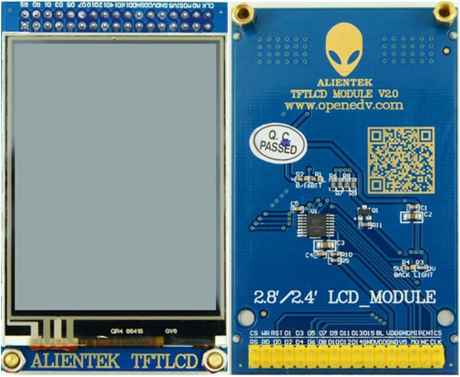
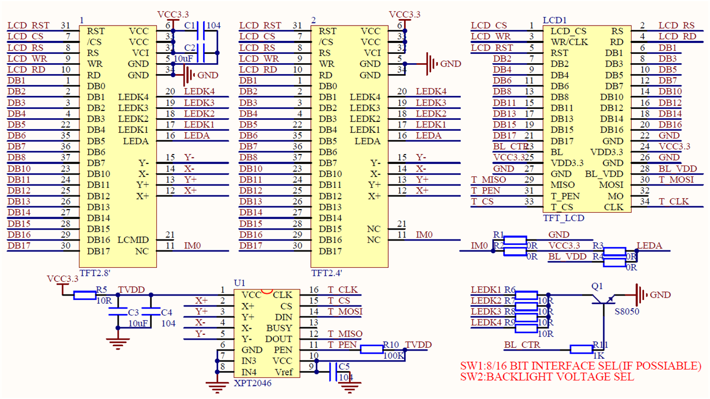
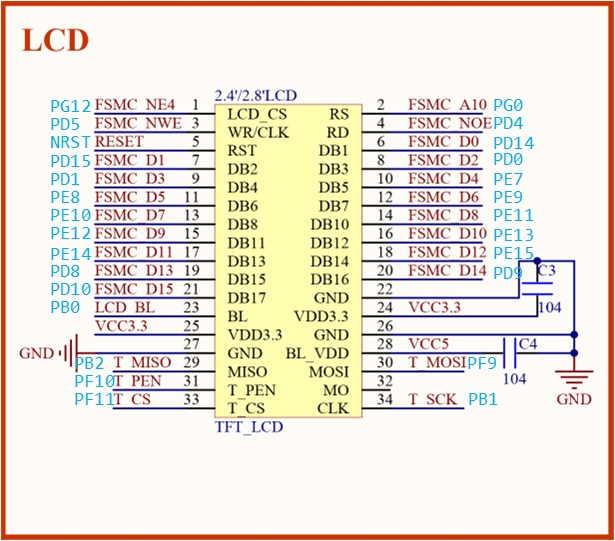
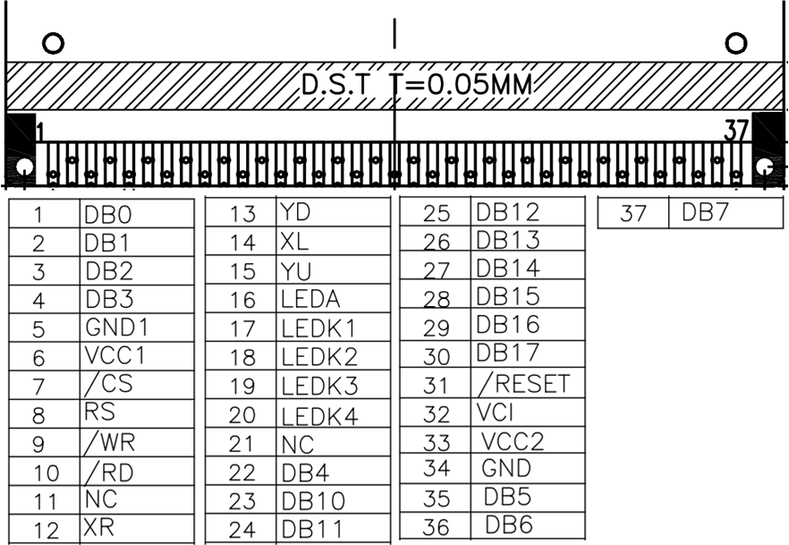

<!-- more -->

## 一、相关资料

这一部分主要看一下我们有哪些资料可以看，注意这里的资料都是放在本地的笔记对应的文件夹中：

- ATK-MD0280模块用户手册：[正点原子ATK-MD0280模块用户手册.pdf](https://gitee.com/docs-site/scm-reference-guide/raw/master/10-显示屏参考资料/TFTLCD参考资料/正点原子ATK-MD0280模块用户手册.pdf)
- ATK-MD0280模块裸屏图：[00ATK-MD0280裸屏尺寸图（钢化玻璃TP）.pdf](https://gitee.com/docs-site/scm-reference-guide/raw/master/10-显示屏参考资料/TFTLCD参考资料/00ATK-MD0280裸屏尺寸图（钢化玻璃TP）.pdf)
- ILI9341芯片手册：[01ILI9341_DS.pdf](https://gitee.com/docs-site/scm-reference-guide/raw/master/10-%E6%98%BE%E7%A4%BA%E5%B1%8F%E5%8F%82%E8%80%83%E8%B5%84%E6%96%99/TFTLCD%E5%8F%82%E8%80%83%E8%B5%84%E6%96%99/01ILI9341_DS.pdf)
- 触摸驱动芯片手册：[04XPT2046.pdf](https://gitee.com/docs-site/scm-reference-guide/raw/master/10-%E6%98%BE%E7%A4%BA%E5%B1%8F%E5%8F%82%E8%80%83%E8%B5%84%E6%96%99/TFTLCD%E5%8F%82%E8%80%83%E8%B5%84%E6%96%99/04XPT2046.pdf)

## 二、2.8寸LCD模块

我使用的是正点原子的2.8寸LCD模块，后边也是以这个模块进行学习。

### 1. 屏幕简介

ATK-MD0280-V2.4（V2.4 是版本号，下面均以 ATK-MD0280 表示该产品）是正点原子推出的一款高性能 2.8 寸电阻触摸屏模块。该模块屏幕分辨率为 320\*240， 16 位真彩显示，采用 ILI9341/ST7789 驱动，该芯片直接自带 GRAM，无需外加驱动器，因而任何单片机，都可以轻易驱动。 ATK-MD0280 模块采用电阻触摸屏， 精度高，抗干扰能力强，稳定性好，但不支持多点触摸。  

在它的内部包含了一个型号为ILI9341的液晶控制器芯片(由于集成度高，所以图中无法看见)，该液晶控制器使用8080接口与单片机通讯，图中液晶面板引出的FPC信号线即8080接口(RGB接口已在内部直接与ILI9341相连)，且控制器中包含有显存，单片机把要显示的数据通过引出的8080接口发送到液晶控制器，这些数据会被存储到它内部的显存中，然后液晶控制器不断把显存的内容刷新到液晶面板，显示内容。

### 2. 模块参数

| 项目               | 说明                                   |
| ------------------ | -------------------------------------- |
| 接口类型           | LCD： Intel8080-16 位并口 触摸屏： SPI |
| 颜色格式           | RGB565                                 |
| 颜色深度           | 16 位                                  |
| LCD 驱动器芯片     | ILI9341/ST7789                         |
| 电阻触摸屏触摸芯片 | XPT2046 / HR2046                       |
| LCD 分辨率         | 320*240                                |
| 触摸屏类型         | 电阻触摸                               |
| 触摸点数           | 单点触摸                               |
| 屏幕尺寸           | 2.8’                                   |
| 工作温度           | -20℃~70℃                               |
| 存储温度           | -30℃~80℃                               |
| 外形尺寸           | 51mm*82.6mm                            |

### 3. 电气特性

| 项目      | 说明                  |
| --------- | --------------------- |
| 电源电压  | 背光： 5V 其他： 3.3V |
| IO 口电平 | 3.3V                  |
| 功耗      | 30~113mA              |

（1）3.3V 系统，可以直接接本模块（供电必须 5V&3.3V 双供电），如果是 5V 系统，建议串接 100R左右电阻，做限流处理。

（2）30mA 对应背光关闭时的功耗， 113mA 对应背光最亮时的功耗，此数据是模块的总功耗（包括3.3V 和 5V 电源部分），实际应用中功耗会由于电源电压的波动而略微变化。  

### 4. 模块特点

（1）320× 240 的分辨率；

（2）自带驱动，无需外加驱动器，单片机直接使用；  

（3）板载背光电路，只需要 3.3V&5V 供电即可，无需外加高压；  

（4）接口简单（LCD 采用 16 位 8080 并口，触摸屏采用 SPI 接口），使用方便；  

（5）PCB 尺寸为 51mm\*82.6mm，并带有安装孔位，安装方便；  

（6）16 位真彩显示（65536色）。

**【注意】**模块是3.3V供电的，不支持5V电压的MCU，如果是5V MCU，必须在信号线串接120R电阻使用。

### 5. 模块原理图

这个原理图是来自于模块自带的资料。

【注意】DB1~DB8，DB10~DB17，总是按顺序连接MCU的FSMC_D0~D15

| 序号     | 名称   | 说明                                       |
| -------- | ------ | ------------------------------------------ |
| 1        | CS     | LCD 片选信号（低电平有效）                 |
| 2        | RS     | 命令/数据控制信号（0，命令； 1，数据；）   |
| 3        | WR     | 写使能信号（低电平有效）                   |
| 4        | RD     | 读使能信号（低电平有效）                   |
| 5        | RST    | 复位信号（低电平有效）                     |
| 6~21     | D0~D15 | 双向数据总线                               |
| 22,26,27 | GND    | 地线                                       |
| 23       | BL_CTR | 背光控制引脚（高电平点亮背光，低电平关闭） |
| 24,25    | VCC3.3 | 主电源供电引脚（3.3V）                     |
| 28       | VCC5   | 背光供电引脚（5V）                         |
| 29       | MISO   | NC，电容触摸屏未用到                       |
| 30       | MOSI   | 电容触摸屏 IIC_SDA 信号(CT_SDA)            |
| 31       | PEN    | 电容触摸屏中断信号(CT_INT)                 |
| 32       | BUSY   | NC，电容触摸屏未用到                       |
| 33       | CS     | 电容触摸屏复位信号(CT_RST)                 |
| 34       | CLK    | 电容触摸屏 IIC_SCL 信号(CT_SCL)            |

### 6. 与STM32接线

TFTLCD 模块采用 2\*17 的 2.54 公排针与外部连接（即接开发板的接口），与STM32引脚接口定义如图所示 ：

### 7. 裸屏引脚

我们来看一下[00ATK-MD0280裸屏尺寸图（钢化玻璃TP）.pdf](https://gitee.com/docs-site/scm-reference-guide/raw/master/10-显示屏参考资料/TFTLCD参考资料/00ATK-MD0280裸屏尺寸图（钢化玻璃TP）.pdf)中的LCD裸屏引脚图：

这是裸屏的引脚排布，裸屏是接了一个ILI9341液晶控制器，我们通过控制ILI9341控制器来驱动LCD屏幕。
