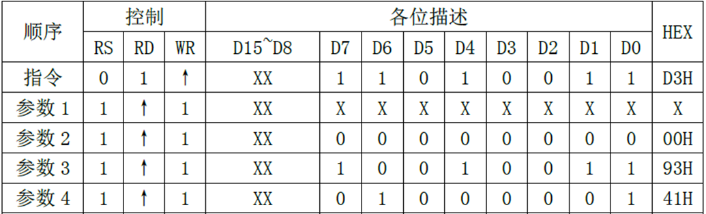

<!-- more -->

## 一、简介

ILI9341是[奕力科技股份有限公司 (ilitek.com)](http://www.ilitek.com/index.aspx)的一款小尺寸驱动IC，我在官网没看到芯片手册，但是有些查datasheet的地方是可以查到的，这里就不写链接了。我在本地保存了一份：[01ILI9341_DS.pdf](https://gitee.com/docs-site/scm-reference-guide/raw/master/10-%E6%98%BE%E7%A4%BA%E5%B1%8F%E5%8F%82%E8%80%83%E8%B5%84%E6%96%99/TFTLCD%E5%8F%82%E8%80%83%E8%B5%84%E6%96%99/01ILI9341_DS.pdf)

它是一个支持分辨率为240x320点阵的a-TFT LCD 的262144（26万色）色单片驱动器。这个单片驱动器包含了一个720通道的源极驱动器（source driver)，一个320通道的栅极驱动器（gate driver），自带一个172800字节（320x240x18/8）的GRAM用于显示240x320分辨率的图片数据。ILI9341提供8位/9位/16位/18位的并行MCU数据总线，6位/16位/18位RGB接口数据总线以及3或4线SPI接口（serial peripheral interface），工作于1.65V-3.3V。

## 二、内部框图

我们可以查看[01ILI9341_DS.pdf](https://gitee.com/docs-site/scm-reference-guide/raw/master/10-%E6%98%BE%E7%A4%BA%E5%B1%8F%E5%8F%82%E8%80%83%E8%B5%84%E6%96%99/TFTLCD%E5%8F%82%E8%80%83%E8%B5%84%E6%96%99/01ILI9341_DS.pdf)的3. Block Diagram :

### 1. ① 控制和信号引脚

①为控制引脚和信号引脚，支持DBI B类接口（ Intel 8080接口）、 DPI接口、 MIPI DSI接口输入。我们可以根据其不同状态设置可以使芯片工作在不同的模式，如每个像素点的位数是6、16还是18位；可配置使用SPI接口、8080接口还是RGB接口与MCU进行通讯。

MCU可以通过SPI、8080接口或RGB接口与ILI9341进行通讯，从而访问它的控制寄存器(CR)、地址计数器(AC)、及GRAM。经过索引寄存器（ IR）、 控制寄存器（ CR）、地址寄存器（ AC）、读数据寄存器（ RDR）、写数据寄存器（ WDR）到GRAM。最后， GRAM把显示内容传输到LCD屏幕的显示。 

控制引脚IM[2:0]用于设置控制器的接口模式，如下表所示（[01ILI9341_DS.pdf](https://gitee.com/docs-site/scm-reference-guide/raw/master/10-%E6%98%BE%E7%A4%BA%E5%B1%8F%E5%8F%82%E8%80%83%E8%B5%84%E6%96%99/TFTLCD%E5%8F%82%E8%80%83%E8%B5%84%E6%96%99/01ILI9341_DS.pdf)的6. Block Function Description ）。 我使用的这个显示屏支持的接口为16 Bit的MIPI-DBIB类，也就是8080接口，使用16根数据线，支持RGB565格式，因此IM[2:0]值为001，该值由屏幕供应商生产时硬件设置，此时用到的数据引脚为DB[15:0]。  

### 2. ② GRAM

该芯片最主核心部分是位于中间的GRAM(Graphics RAM)，它就是显存。GRAM中每个存储单元都对应着液晶面板的一个像素点。它右侧的各种模块共同作用把GRAM存储单元的数据转化成液晶面板的控制信号，使像素点呈现特定的颜色，而像素点组合起来则成为一幅完整的图像。

### 3. ③ LED控制器

在GRAM的左侧还有一个 ③ LED控制器(LED Controller)。LCD为非发光性的显示装置，它需要借助背光源才能达到显示功能，LED控制器就是用来控制液晶屏中的LED背光源。

## 三、与STM32引脚对应关系

这些引出的信号线即8080通讯接口，带 X 的表示低电平有效，STM32通过该接口与ILI9341芯片进行通讯，实现对液晶屏的控制。通讯的内容主要包括命令和显存数据，显存数据即各个像素点的RGB565内容；命令是指对ILI9341的控制指令，MCU可通过8080接口发送命令编码控制ILI9341的工作方式，例如复位指令、设置光标指令、睡眠模式指令等等，具体的指令在[01ILI9341_DS.pdf](https://gitee.com/docs-site/scm-reference-guide/raw/master/10-%E6%98%BE%E7%A4%BA%E5%B1%8F%E5%8F%82%E8%80%83%E8%B5%84%E6%96%99/TFTLCD%E5%8F%82%E8%80%83%E8%B5%84%E6%96%99/01ILI9341_DS.pdf) 数据手册均有详细说明。

我们这一节笔记用到的信号线如下表（注意我使用的模块只引出了DB[15:0]使用）：

| 信号线       | ILI9341对应的信号线 | 说明                                                         |
| ------------ | :------------------ | :----------------------------------------------------------- |
| LCD_DB[17:1] | D[15:0]             | 16位双向数据线                                               |
| LCD_RD       | RDX                 | LCD读数据信号，低电平有效                                    |
| LCD_RS       | D/CX                | 数据/命令信号，高电平时，D[15:0]表示的是数据(RGB像素数据或命令数据)，低电平时D[15:0]表示控制命令 |
| LCD_RST      | RESX                | 硬复位信号，低电平有效                                       |
| LCD_WR       | WRX                 | LCD写数据信号，低电平有效                                    |
| LCD_CS       | CSX                 | LCD片选信号，低电平有效                                      |
| LCD_BL       | -                   | LCD的背光信号，低电平点亮                                    |

模块对外接口采用16位并口，颜色深度为16位，格式为RGB565，关系如下图：

## 四、读写时序

### 1. 向ILI9341写的时序

我们可以看[01ILI9341_DS.pdf](https://gitee.com/docs-site/scm-reference-guide/raw/master/10-%E6%98%BE%E7%A4%BA%E5%B1%8F%E5%8F%82%E8%80%83%E8%B5%84%E6%96%99/TFTLCD%E5%8F%82%E8%80%83%E8%B5%84%E6%96%99/01ILI9341_DS.pdf) 的7.1.3. Write Cycle Sequence 一节：

（1）写命令时序由片选信号CSX拉低开始；

（2）对数据/命令选择信号线D/CX也置低电平，这表示写入的是命令地址(可理解为命令编码，如软件复位命令：0x01)；

（3）以写信号WRX为低，读信号RDX为高，表示数据传输方向为写入，在WR的上升沿，使D[17:0]上的数据写入到ILI9341里面。同时，在数据线D\[17:0\](或D\[15:0\])输出命令地址。

（4）在第二个传输阶段传送的是命令的参数，所以D/CX要置高电平，表示写入的是命令数据，命令数据是某些指令带有的参数，如复位指令编码为0x01，它后面可以带一个参数，该参数表示多少秒后复位(实际的复位命令不含参数，此处只是为了先了解一下指令编码与参数的区别)。

我们看一个更详细的图：

首先片选信号CS拉低，复位信号RES保持为高。 数据/命令切换信号D/C拉低，写信号引脚拉低，此时DB[15:0]发送的就是指令（黄色部分） ；数据/命令切换信号D/C拉高，写信号引脚拉低，此时DB[15:0]发送的就是一个像素点的颜色数据（ 红、绿、蓝部分） ，其中低5位为蓝色数据、中6位为绿色数据、高5位为红色数据。  

### 2. 从ILI9341读的时序

这里我们一般用的不多，这里简单提一下吧，我们可以看[01ILI9341_DS.pdf](https://gitee.com/docs-site/scm-reference-guide/raw/master/10-%E6%98%BE%E7%A4%BA%E5%B1%8F%E5%8F%82%E8%80%83%E8%B5%84%E6%96%99/TFTLCD%E5%8F%82%E8%80%83%E8%B5%84%E6%96%99/01ILI9341_DS.pdf) 的7.1.4. Read Cycle Sequence 一节：

先根据要读取的数据的类型，设置RS为高（数据）/低（命令），然后拉低片选，选中ILI9341，接着我们根据是读数据，置RD为低，然后读数据，在RD的上升沿， 读取数据线上的数据（D[15:0]）。

## 五、命令与寄存器

这一部分我们可以查看[01ILI9341_DS.pdf](https://gitee.com/docs-site/scm-reference-guide/raw/master/10-%E6%98%BE%E7%A4%BA%E5%B1%8F%E5%8F%82%E8%80%83%E8%B5%84%E6%96%99/TFTLCD%E5%8F%82%E8%80%83%E8%B5%84%E6%96%99/01ILI9341_DS.pdf) 的8. Command一节，这个后边开始学习驱动LCD的代码的时候结合来看会更加容易理解。这里简单学习几个吧。学到这里，其实觉得挺奇怪的，在芯片手册中，没有看到寄存器的相关概念，也可能是我没有仔细看吧，手册中都是一些命令，但是这些命令控制的应该都是寄存器才对，所以后边这些的话，就可以看作是命令去控制的寄存器。

### 1. 命令格式说明

ILI9341所有的指令都是 8 位的（高 8 位无效），且参数除了读写GRAM的时候是 16 位，其他操作参数，都是 8 位的。

### 2. Read ID4 (D3h)

该指令为读ID4指令，用于读取LCD控制器的ID 。因此，同一个代码，可以根据ID的不同，执行不同的LCD驱动初始化，以兼容不同的LCD屏幕。

### 3. Memory Access Control (36h)

该指令为存储访问控制指令，可以控制ILI9341存储器的读写方向，简单的说，就是在连续写GRAM的时候，可以控制GRAM指针的增长方向，从而控制显示方式（读GRAM也是一样）。

### 4. Column Address Set (2Ah)

该指令是列地址设置指令，在从左到右，从上到下的扫描方式（默认）下面，该指令用于设置横坐标（x坐标）：

在默认扫描方式时，该指令用于设置x坐标，该指令带有4个参数，实际上是2个坐标值：SC和EC，即列地址的起始值和结束值，SC必须小于等于EC，且0≤SC/EC≤239。一般在设置x坐标的时候，我们只需要带2个参数即可，也就是设置SC即可，因为如果EC没有变化，我们只需要设置一次即可（在初始化ILI9341的时候设置），从而提高速度。

### 5. Page Address Set (2Bh)

该指令是页地址设置指令，在从左到右，从上到下的扫描方式（默认）下面，该指令用于设置纵坐标（y坐标）：

在默认扫描方式时，该指令用于设置y坐标，该指令带有4个参数，实际上是2个坐标值：SP和EP，即页地址的起始值和结束值，SP必须小于等于EP，且0≤SP/EP≤319。一般在设置y坐标的时候，我们只需要带2个参数即可，也就是设置SP即可，因为如果EP没有变化，我们只需要设置一次即可（在初始化ILI9341的时候设置），从而提高速度。

### 6. Memory Write (2Ch)

该指令是写GRAM指令，在发送该指令之后，我们便可以往LCD的GRAM里面写入颜色数据了，该指令支持连续写 (地址自动递增)：

在收到指令0X2C之后，数据有效位宽变为16位，我们可以连续写入LCD GRAM值，而GRAM的地址将根据MY/MX/MV设置的扫描方向进行自增。例如：假设设置的是从左到右，从上到下的扫描方式，那么设置好起始坐标（通过SC，SP设置）后，每写入一个颜色值，GRAM地址将会自动自增1（SC++），如果碰到EC，则回到SC，同时SP++，一直到坐标：EC，EP结束，其间无需再次设置的坐标，从而大大提高写入速度。

### 7. Memory Read (2Eh)

该指令是读GRAM指令，用于读取ILI9341的显存（GRAM），同0X2C指令，该指令支持连续读 (地址自动递增)：

ILI9341在收到该指令后，第一次输出的是dummy数据（无效），第二次开始，读取到的才是有效的GRAM数据（从坐标：SC，SP开始），输出规律为：每个颜色分量占8个位，一次输出2个颜色分量。比如：第一次输出是R1G1，随后的规律为：B1R2&rarr;G2B2&rarr;R3G3&rarr;B3R4&rarr;G4B4&rarr;R5G5... 以此类推

## 六、内存显示地址映射

这一部分可以参考[01ILI9341_DS.pdf](https://gitee.com/docs-site/scm-reference-guide/raw/master/10-%E6%98%BE%E7%A4%BA%E5%B1%8F%E5%8F%82%E8%80%83%E8%B5%84%E6%96%99/TFTLCD%E5%8F%82%E8%80%83%E8%B5%84%E6%96%99/01ILI9341_DS.pdf) 的9.2. Memory to Display Address Mapping 一节，对后边理解扫描方向会有好处。其实这一部分笔记有一些是从网上看的，有一些概念看的我挺不明所以的，后来来起来按照我自己的理解，这里GRAM是一个虚拟内存，缓存我们要显示的数据，我们通过MCU向GRAM写入数据，然后LCD屏幕会有一个类似“电子枪”的东西，从GRAM中取出像素点的数据，然后按照特定的扫描方式，点亮LCD面板的真实像素点，这些真实的像素点，按照我自己的理解，我觉得可以理解成LCD的物理内存。

### 1. GRAM与LCD面板

这里的模式为Normal Display ON or Partial Mode ON, Vertical Scroll Mode OFF，也就是说下图只讨论“正常显示”，不讨论“垂直滚动显示”模式。

可以看到GRAM内存被两个指针访问，行指针和列指针，行指针范围从0000h到0013Fh（换算成十进制就是0到319，一共320行），列指针范围为0000h到00EFh（换算成十进制就是0到239，一共240列）。也就是说，GRAM和LCD像素面板的对应关系是一种竖屏（240\*320）的对应的关系。至于如何让GRAM数据显示到LCD屏上，不需要我们去考虑，只要知道这种对应关系就可以了。我们要是想要在最左上角显示一个点，可以将将点数据存储在GRAM(列指针，页指针)=(0,0)处。

当实际将GRAM中的数据刷新到LCD屏进行显示的时候，ILI9341有8种显示方式：左上角&rarr;右下角（竖屏）、左下角&rarr;右上角（竖屏）、右上角&rarr;左下角（竖屏）、右下角&rarr;左上角（竖屏）、左上角&rarr;右下角（横屏）、左下角&rarr;右上角（横屏）、右上角-&rarr;左下角（横屏）、右下角&rarr;左上角（横屏），既然GRAM与LCD像素面板的点是固定对应的，那么不同的显示模式又是怎么实现的呢？

按照我自己的理解，GRAM与LCD面板的像素点的地址是一一对应的，这个对应关系是无法被改变的，前边我们知道，要想显示一幅图像，有一个行同步信号，比如就从左上角开始显示，当显示完一行的时候，会自动进行下一行的显示，显示完一帧图像的时候，会产生一个帧同步信号，进行下一帧的显示，此时就显示到了右下角。当然这里的**扫描针对的是LCD显示屏**，而非GRAM，可以想象一下，我们有一个写在GRAM(0,0)位置的像素点，现在我们要开始显示，我们在LCD屏的右下角开始显示，那么读取的这一个像素的数据就会被显示到LCD屏的右下角。

### 2. MCU对GRAM的写/读方向

从这张图可以看出，我们通过MCU向GRAM写入数据的时候，数据按照上面所示的顺序写入，B为起始点，E为结束点，按照从左到右，从上到下的顺序进行写入，写入完一行数据后，切换到下一行进行显示。

接下来就是将GRAM中的数据刷新到到LCD的像素面板（也可以称之为物理内存吧，目前我是这么认为的）进行显示，在物理内存中写入数据的计数器由“Memory Data Access Control（36h）”命令控制，B5、B6和B7位如下所述：

从图中可以看出，B5位对应的是 MADCTL (Memory Access Control) 寄存器中的D5，表示交换行列，B6对应的是D6，表示列地址顺序，B7对应的是D7，表示的是行地址顺序。多以这里的B[7:5]就对应MADCTL 的D[7:5]，这三位共同决定了LCD的八种扫描方式。图中的四个角有四个说明，它们都是在不关心行列交换的情况下，另外两位取不同值的时候整个LCD显示的时候扫描的起始点。比如，B6=0，B7=1，这个时候LCD开始显示的时候，起始点就是左下角的（0,319），对于虚拟地址来说就会显示GRAM中(0, 0)这个位置的数据，当然，这个值是针对竖屏240\*320来讲的。

详细的GRAM中的虚拟地址到LCD中的物理地址的转换关系如下表：

于是我们从GRAM到LCD就有8种扫描模式啦。

### 3. 8种显示方向

一些说明：

（1）MV、MX、MY的控制位在命令 0x36 对应的寄存器中

（2）Image in the Memory（MPU）中描述的是在MCU的240（宽）\* 320（高）\* 16bit（RGB565显示方式）中显示了一个图像“F”。

（3）Image In the Driver（Frame Memory）描述的是经过虚拟地址到物理地址转换器后，实际传输到GRAM中的数据显示阵列。

（4）B、E分别描述了MCU传输的数据流的起始位置和终止位置，下边的图都是来自于[01ILI9341_DS.pdf](https://gitee.com/docs-site/scm-reference-guide/raw/master/10-%E6%98%BE%E7%A4%BA%E5%B1%8F%E5%8F%82%E8%80%83%E8%B5%84%E6%96%99/TFTLCD%E5%8F%82%E8%80%83%E8%B5%84%E6%96%99/01ILI9341_DS.pdf) 的9.3. MCU to memory write/read direction一节。这里需要注意，**从GRAM读取像素点的数据，这个顺序按照从左到右，从上到下的顺序进行，然后送到LCD显示的时候，根据MY、MX和MV三个位的不同值，从指定的位置开始，到这个位置的对角结束，按照先行后列的方式进行扫描显示**。

其实不论哪种显示方向，其实并没有改变GRAM物理内存与LCD显示屏的对应关系，也即是说GRAM物理内存与显示屏之间的对应关系、内存到LCD的扫描方式，是固定不变的。那么这种显示方向是怎么出现的？

实际上，**显示方向说的是MCU的显示缓存MPU（或者MCU读写GRAM的数据流）与LCD显示屏的对应关系。由于GRAM地址与LCD显示屏像素点的物理地址的对应关系是不会改变的。**

用户在写程序的过程中，LCD显示操作是更改MPU的内容，至于MPU到GRAM的传输是驱动程序完成的，就是前边学习的8080时序。也就是说，用户控制显示的内容，接触的是MPU（其实就是GRAM啦），而更改显示方向需要配置ILI9341的寄存器。其实，ILI9341的扫描方向的功能也可以没有，但是这个时候要想改变显示的方向之类的，需要用户自己软件进行转换，直接在GRAM中进行转换，然后刷新到LCD屏幕，其实ILI9341配置的那3位就相当于帮我们做了一个转换关系表，这样就不用我们自己去配置了。

#### 3.1 Normal

这是正常的模式，以(x，y)表示(列地址，行地址)，那么MCU向（0，0）写入数据，经过虚拟地址到物理地址的转换，实际写入到GRAM的地址是（0，0），对应LCD的左上角。MCU向（239，319）写入数据，经过虚拟地址到物理地址的转换，实际写入到GRAM的地址是（239,319），对应LCD的右下角。

| B[7:5] | D[7:5] |  MY  |  MX  |  MV  | D[7:5]十进制 |
| :----: | :----: | :--: | :--: | :--: | :----------: |
|  000   |  000   |  0   |  0   |  0   |      0       |

#### 3.2 Y-Mirror

这是Y镜像，也就是行地址翻转的情况，以(x，y)表示(列地址，行地址)，那么MCU向（0，0）写入数据，经过虚拟地址到物理地址的转换，实际写入到GRAM的地址是（0，319），对应LCD的左下角：

MCU向（239，319）写入数据，经过虚拟地址到物理地址的转换，实际写入到GRAM的地址是（239，0），对应LCD的右上角。最终的效果就是LCD的显示实现了Y方向上的翻转。

| B[7:5] | D[7:5] |  MY  |  MX  |  MV  | D[7:5]十进制 |
| :----: | :----: | :--: | :--: | :--: | :----------: |
|  100   |  100   |  1   |  0   |  0   |      4       |

#### 3.3 X-Mirror

| B[7:5] | D[7:5] |  MY  |  MX  |  MV  | D[7:5]十进制 |
| :----: | :----: | :--: | :--: | :--: | :----------: |
|  010   |  010   |  0   |  1   |  0   |      2       |

#### 3.4 X/Y-Mirror

| B[7:5] | D[7:5] |  MY  |  MX  |  MV  | D[7:5]十进制 |
| :----: | :----: | :--: | :--: | :--: | :----------: |
|  110   |  110   |  1   |  1   |  0   |      6       |

#### 3.5 X-Y Exchange

这是XY交换，也就是行列地址交换的情况，以(x，y)表示(列地址，行地址)，MCU向（0，0）写入数据，经过虚拟地址到物理地址的转换，实际写入到GRAM的地址是（0,0），对应LCD的左上角。MCU向（239，319）写入数据，经过虚拟地址到物理地址的转换，实际写入到GRAM的地址是（319，239），对应LCD的右下角。经过这样的变换，LCD就从原来的竖屏变成了横屏显示。最终的效果就是LCD的显示实现了行列的交换。

| B[7:5] | D[7:5] |  MY  |  MX  |  MV  | D[7:5]十进制 |
| :----: | :----: | :--: | :--: | :--: | :----------: |
|  001   |  001   |  0   |  0   |  1   |      1       |

#### 3.6 X-Y Exchange Y-Mirror

| B[7:5] | D[7:5] |  MY  |  MX  |  MV  | D[7:5]十进制 |
| :----: | :----: | :--: | :--: | :--: | :----------: |
|  101   |  101   |  1   |  0   |  1   |      5       |

#### 3.7 XY Exchange X-Mirror

| B[7:5] | D[7:5] |  MY  |  MX  |  MV  | D[7:5]十进制 |
| :----: | :----: | :--: | :--: | :--: | :----------: |
|  011   |  011   |  0   |  1   |  1   |      3       |

#### 3.8 XY Exchange XY-Mirror

| B[7:5] | D[7:5] |  MY  |  MX  |  MV  | D[7:5]十进制 |
| :----: | :----: | :--: | :--: | :--: | :----------: |
|  111   |  111   |  1   |  1   |  1   |      7       |

#### 3.9 八种显示方向对应关系

| B[7:5] | D[7:5] |  MY  |  MX  |  MV  | D[7:5]十进制 |       模式说明        |                           图片对应                           |
| :----: | :----: | :--: | :--: | :--: | :----------: | :-------------------: | :----------------------------------------------------------: |
|  000   |  000   |  0   |  0   |  0   |      0       |        Normal         |  |
|  001   |  001   |  0   |  0   |  1   |      1       |     X-Y Exchange      |  |
|  010   |  010   |  0   |  1   |  0   |      2       |       X-Mirror        |  |
|  011   |  011   |  0   |  1   |  1   |      3       | XY Exchange X-Mirror  |  |
|  100   |  100   |  1   |  0   |  0   |      4       |       Y-Mirror        |  |
|  101   |  101   |  1   |  0   |  1   |      5       | X-Y Exchange Y-Mirror |  |
|  110   |  110   |  1   |  1   |  0   |      6       |      X/Y-Mirror       |  |
|  111   |  111   |  1   |  1   |  1   |      7       | XY Exchange XY-Mirror |  |
