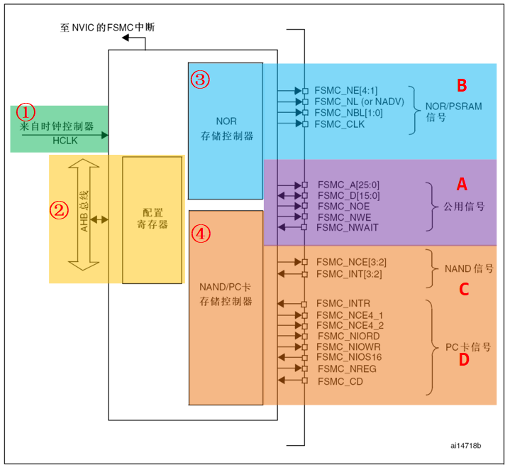
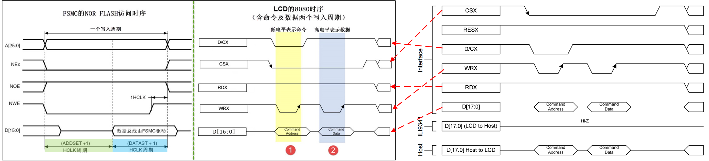
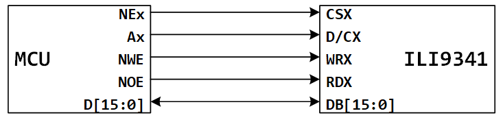
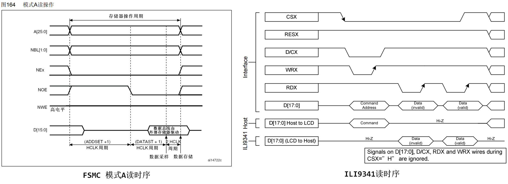
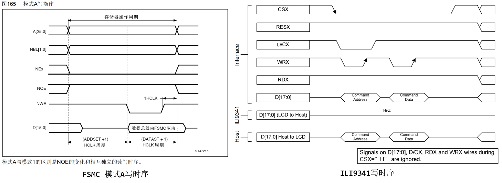
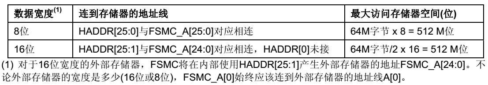

<!-- more -->

## 一、FSMC简介

> 可参考[20-基本外设篇/25-FSMC/01-FSMC基础](/sdoc/peripheral/fsmc/fsmc-basic/126b09248c5109dd1fe11f31)

### 1. 简介

ILI9341的8080通讯接口时序可以由STM32使用普通I/O接口进行模拟，但这样效率太低，STM32提供了一种特别的控制方法——使用FSMC接口实现8080时序。



我们前边学习SRAM的时候了解到STM32的FSMC外设可以用于控制扩展的外部存储器，而MCU对液晶屏的操作实际上就是把显示数据写入到显存中，与控制存储器非常类似，且8080接口的通讯时序完全可以使用FSMC外设产生，因而非常适合使用FSMC控制液晶屏。

### 2. NOR闪存，非复用接口

控制LCD时，适合使用FSMC的NOR\PSRAM模式，它与前面使用FSMC控制SRAM的稍有不同，控制SRAM时使用的是模式A，而控制LCD时使用的是与NOR FLASH一样的模式B，所以我们重点分析前边框图中NOR FLASH控制信号线部分。我们可以看[STM32中文参考手册](https://www.stmcu.com.cn/Designresource/detail/localization_document%20/710001)的19.5.1 外部存储器接口信号：

| FSMC信号名称 | 信号方向  | 功能                                            |
| ------------ | --------- | ----------------------------------------------- |
| CLK          | 输出      | 时钟信号（ 用于同步访问的外部存储器）           |
| A[25:16]     | 输出      | 地址总线                                        |
| AD[15:0]     | 输入/输出 | 16位复用的，双向地址/数据总线                   |
| NEx          | 输出      | Bank1区域内片选信号， x=1~4，每个区域大小为64MB |
| NOE          | 输出      | 读使能信号                                      |
| NWE          | 输出      | 写使能信号                                      |
| NWAIT        | 输入      | NOR闪存要求FSMC等待的信号                       |

NOR闪存存储器是按16位的字寻址，最大容量达64M字节(26条地址线)。在控制LCD时，使用的是类似异步、地址与数据线独立的NOR FLASH控制方式，所以实际上CLK、NWAIT、NADV引脚并没有使用到。

## 二、ILI9341与FSMC

### 1. 怎么接线？

首先我们回顾下外部 SRAM的连接，外部 SRAM 的控制一般有：地址线（如 A0~A18）、数据线（如 D0~D15）、写信号（WE）、读信号（OE）、片选信号（CS），如果 SRAM 支持字节控制，那么还有 UB/LB 信号。

而 TFTLCD的信号我们在前边有介绍，包括： D/C、 D0 ~ D15、 WR、 RD、 CS、 RST 和 BL 等，其中真正在操作 LCD 的时候需要用到的就只有： D/C、D0 ~ D15、 WR、 RD 和 CS。其操作时序和 SRAM的控制完全**类似**，唯一不同就是 TFTLCD 有 RS 信号，但是没有地址信号。  

TFTLCD 通过 D/C 信号来决定传送的数据是数据还是命令，本质上可以理解为一个地址信号， 比如我们把 D/C 接在 FSMC_A0 上面，那么当 FSMC 控制器写地址 0 的时候，会使得 FSMC_A0 变为 0，对 TFTLCD 来说，就是写命令。而 FSMC 写地址 1 的时候， FSMC_A0 将会变为 1，对 TFTLCD 来说，就是写数据了。这样，就把数据和命令区分开了，他们其实就是对应 SRAM 操作的两个连续地址。当然 D/C 也可以接在其他地址线上，战舰 STM32 开发板是把 D/C 连接在 FSMC_A10 上面的。 所以两者的对应关系可以如下表（带X的表示低电平有效）：

| FSMC信号 | 功能          |      | 8080信号 | 功能              |
| -------- | ------------- | :--: | -------- | ----------------- |
| NEx      | Bank1片选信号 |  =   | CSX      | 控制器片选        |
| NOE      | 读使能        |  =   | RXD      | 读信号引脚        |
| NEW      | 写使能        |  =   | WRX      | 写信号引脚        |
| D[15:0]  | 数据总线      |  =   | DB[15:0] | 数据总线          |
| A[25:0]  | 地址总线      |  ≈   | D/CX     | 数据/命令切换信号 |

### 2. FSMC的两种模式

#### 2.1 FSMC NOR/PSRAM模式B

我们重点来看一下模式B的写时序（读时序一般不怎么用，因为我们主要是向LCD写数据来进行显示用的，而且我们看一下读时序就知道其实对应关系是一样的，所以我们这里只分析写时序就可以啦，读时序是一样的）与ILI9341的写时序的对应关系：



我们可以看到除了D/CX信号外，剩下的几个信号的时序就是一致的，看到这个图，我们就该明白为什么FSMC可以拿来模拟8080时序啦。但是还有一个问题，那就是D/CX这个信号怎么办呢？要是FSMC也可以产生高低电平来使控制D/CX那不就好了吗？

当我们使用FSMC访问特定地址时， FSMC 会产生相应的模拟 8080 时序，控制地址线输出要访问的内存地址，使用数据信号线接收或发送数据，其它片选信号 NE、读使能信号 NOE、写使能信号NWE 辅助产生完整的时序，而由于控制液晶屏的硬件连接中，使用如图下中的连接来模拟 8080 时序，所以 FSMC 产生的这些信号会被 ILI9341 接收，并且使用其中一根 FSMC_Ax 地址控制命令/数据选择引脚 RS(即 D/CX)，因此，我们要是知道 STM32 访问什么地址时，对应的 FSMC_Ax 引脚会输出高电平表示传输的是数据，访问什么地址时，对应的 FSMC_Ax 引脚会输出低电平表示传输的是命令。若理解了计算过程，以后就可以根据自己制作的硬件电路来计算访问地址了。  




根据STM32对寻址空间的地址映射，地址0x6000 0000 ~0x9FFF FFFF是映射到外部存储器的，而其中的0x6000 0000 ~0x6FFF FFFF则是分配给NOR FLASH、PSRAM这类可直接寻址的器件。当FSMC外设被配置成正常工作，并且外部接了NOR FLASH时，若向0x60000000地址写入数据如0xABCD，FSMC会自动在各信号线上产生相应的电平信号，写入数据。FSMC会控制片选信号NE1选择相应的NOR 芯片，然后使用地址线A[25:0]输出0x60000000，在NWE写使能信号线上发出低电平的写使能信号，而要写入的数据信号0xABCD则从数据线D[15:0]输出，然后数据就被保存到NOR FLASH中了。

我们假设，现在将D/CX接在FSMC_A0上，由于FSMC会自动产生地址信号，当使用FSMC向0x6xxx xxx1、0x6xxx xxx3、0x6xxx xxx5…这些奇数地址写入数据时，地址最低位的值均为1，所以它会控制地址线A0(D/CX)输出高电平，那么这时通过数据线传输的信号会被理解为数值；若向0x6xxx xxx0 、0x6xxx xxx2、0x6xxx xxx4…这些偶数地址写入数据时，地址最低位的值均为0，所以它会控制地址线A0(D/CX)输出低电平，因此这时通过数据线传输的信号会被理解为命令，如下表：

|    地址     | 地址的二进制值(低四位) | A0(D/CX)的电平 | 控制ILI9341时的意义 |
| :---------: | :--------------------: | :------------: | :-----------------: |
| 0x6xxx xxx1 |          0001          |    1 高电平    |       D 数值        |
| 0x6xxx xxx3 |          0011          |    1 高电平    |       D 数值        |
| 0x6xxx xxx5 |          0101          |    1 高电平    |       D 数值        |
| 0x6xxx xxx0 |          0000          |    0 低电平    |       C 命令        |
| 0x6xxx xxx2 |          0010          |    0 低电平    |       C 命令        |
| 0x6xxx xxx4 |          0100          |    0 低电平    |       C 命令        |

有了这个基础，我们只要配置好FSMC外设，然后在代码中利用指针变量，向不同的地址单元写入数据，就能够由FSMC模拟出的8080接口向ILI9341写入控制命令或GRAM的数据了。

注意：在实际控制时，以上地址计算方式还不完整，还需要注意HADDR内部地址与FSMC地址信号线的转换，关于这部分内容在代码讲解时再详细举例说明.

#### 2.2 FSMC NOR/PSRAM模式A

后边在实际实现LCD驱动的时候，发现，模式A好像也可以使用：

- 读时序



- 写时序



对比过后，模式A好像也能用，反正不管用哪种模式，主要还是ADDSET和DATAST的确定。

### 3. 地址计算

我们上边知道可以吧D/CX接在FSMC_A[25:0]任意一个引脚上，接在A0的情况上边已经分析了，那要是不使用A0，我们怎么计算ILI9341的命令和数据所对应的FSMC需要发送的地址呢？

> 参考[20-基本外设篇/25-FSMC/01-FSMC基础/LV005-存储器映射与控制器.md](/sdoc/peripheral/fsmc/fsmc-basic/126b092499b000721416c9a0)

（1）我们根据开发板的原理图，我们假设使用的是 FSMC_NE1 作为 8080_CS 片选信号，所以首先可以确认地址范围，当访问0X6000 0000 ~ 0X63FF FFFF 地址时， FSMC 均会对外产生片选有效的访问时序；  

（2）我们假设使用 FSMC_A16 地址线作为命令/数据选择线 D/C 信号，所以在以上地址范围内，再选择出使得 FSMC_A16 输出**高电平的地址，即可控制表示数据**，选择出使得 FSMC_A16 输出**低电平的地址，即可控制表示命令**。  

（3）计算高低电平对应的地址：

要使 FSMC_A16 地址线为高电平，实质是输出地址信号的第 16 位为 1 即可，使用 0X60000000~0X63FF FFFF 内的任意地址，作如下运算：  

```c
设置地址的第 16 位为 1: 0X6000 0000 |= (1<<16) = 0x6001 0000
```

要使 FSMC_A16 地址线为低电平，实质是输出地址信号的第 16 位为 0 即可，使用 0X60000000~0X63FF FFFF 内的任意地址，作如下运算  

```c
设置地址的第 16 位为 0: 0X6000 0000 &= ~ (1<<16) = 0x6000 0000
```

（4）但是，以上方法计算的地址还不完全正确，STM32 内部访问地址时使用的是内部 HADDR 总线，它是需要转换到外部存储器的内部 AHB 地址线，它是字节地址 (8 位)，而存储器访问不都是按字节访问，因此接到存储器的地址线依存储器的数据宽度有所不同。  



而我们使用的是 16 位的数据访问方式，所以 HADDR 与 FSMC_A 的地址线连接关系会左移一位，如 HADDR[1] 与 FSMC_A[0] 对应、 HADDR[2] 与 FSMC_A[1] 对应。因此，当 FSMC_A0 地址线为 1 时，实际上内部地址的第 1 位为 1， FSMC_A1 地址线为 1 时，实际上内部地址的第 2 位为1。同样地，当希望 FSMC_A16 地址输出高电平或低电平时，需要重新调整计算公式：  

要使 FSMC_A16 地址线为高电平，实质是访问内部 HADDR 地址的第 (16+1) 位为 1 即可，使用 0X6000 0000~0X63FF FFFF 内的任意地址，作如下运算：  

```c
使 FSMC_A16 地址线为高电平： 0X6000 0000 |= (1 << (16+1)) = 0x6002 0000
```

要使 FSMC_A16 地址线为低电平，实质是访问内部 HADDR 地址的第 (16+1) 位为 0 即可，使用 0X6000 0000~0X63FF FFFF 内的任意地址，作如下运算：  

```c
使 FSMC_A16 地址线为低电平： 0X6000 0000 &= ~ (1<<(16+1)) = 0x6000 0000
```

根据最终的计算结果，总结如下：当 STM32 访问内部的 0x6002 0000 地址时， FSMC 自动输出时序，且使得与液晶屏的数据/命令选择线 RS(即 D/CX) 相连的 FSMC_A16 输出高电平，使得液晶屏会把传输过程理解为数据传输；类似地，当 STM32 访问内部的 0X6000 0000 地址时， FSMC自动输出时序，且使得与液晶屏的数据/命令选择线 RS(即 D/CX) 相连的 FSMC_A16 输出低电平，使得液晶屏会把传输过程理解为命令传输。  

（5）我们可以将上述结果封装成一个宏，方便使用：

```c
/****************************************************************
2^26 =0X0400 0000 = 64MB, 每个 BANK 有 4*64MB = 256MB
64MB:FSMC_Bank1_NORSRAM1:0X6000 0000 ~ 0X63FF FFFF
64MB:FSMC_Bank1_NORSRAM2:0X6400 0000 ~ 0X67FF FFFF
64MB:FSMC_Bank1_NORSRAM3:0X6800 0000 ~ 0X6BFF FFFF
64MB:FSMC_Bank1_NORSRAM4:0X6C00 0000 ~ 0X6FFF FFFF

选择 BANK1-BORSRAM1 连接 TFT，地址范围为 0X6000 0000 ~ 0X63FF FFFF 
FSMC_A16 接 LCD 的 DC(寄存器/数据选择) 脚寄存器基地址 = 0X6C00 0000
RAM 基地址 = 0X6002 0000 = 0X6000 0000+2^16*2 = 0X6000 0000 + 0x2 0000 = 0X6002 0000
当选择不同的地址线时，地址要重新计算
********************************************************/

/*************** ILI9341 显示屏的 FSMC 参数定义 ****************/
//FSMC_Bank1_NORSRAM 用于 LCD 命令操作的地址
#define FSMC_Addr_ILI9341_CMD ( ( uint32_t ) 0x60020000 )

//FSMC_Bank1_NORSRAM 用于 LCD 数据操作的地址
#define FSMC_Addr_ILI9341_DATA ( ( uint32_t ) 0x60000000 )
```

**【注意】**其实吧，通过这种方式计算得来的地址，并不是所有的地址都能用，不能用的时候注意换一个试一下，我后边写代码的时候用A10测了一下，最低的4个位不能是奇数，至少我学习这个的时候看到是这样的规律随后没有深究，可能是存在一个对齐问题吧，后边有坑了再补充。

## 三、读写IL9341

FSMC连接好外部的存储器并初始化后，就可以直**接通过访问地址来读写数据**。FSMC访问存储器的方式与I2C EEPROM、SPI FLASH的不一样，后两种方式都需要控制I2C或SPI总线给存储器发送地址，然后获取数据；在程序里，这个地址和数据都需要分开使用不同的变量存储，并且访问时还需要使用代码控制发送读写命令。而使用FSMC外接存储器时，其**存储单元是映射到STM32的内部寻址空间的**；在程序里，定义一个指向这些地址的指针，然后就可以通过指针直接修改该存储单元的内容，FSMC外设会自动完成数据访问过程，读写命令之类的操作不需要程序控制。

总的来说就是，我们确定了数据的读写地址之后，我们直接向这个地址写入数据，就可以发送或者接收16bit数据啦控制命令的地址也是一样，这就是"SRAM"地址空间映射到内核的好处，我们可以直接进行访问。

### 1. 写入命令

```c
/**
  * @brief  向ILI9341写入命令
  * @param  usCmd :要写入的命令（表寄存器地址）
  * @retval 无
  */	
__inline void ILI9341_Write_Cmd (uint16_t usCmd)
{
	 *(__IO uint16_t *)(FSMC_Addr_ILI9341_CMD) = usCmd;	// #define __IO volatile
}
```

### 2. 写入数据

```c
/**
  * @brief  向ILI9341写入数据
  * @param  usData :要写入的数据
  * @retval 无
  */	
__inline void ILI9341_Write_Data (uint16_t usData)
{
	*(__IO uint16_t *)(FSMC_Addr_ILI9341_DATA) = usData; // #define __IO volatile
}

```

### 3. 读取数据

```c
/**
  * @brief  从ILI9341读取数据
  * @param  无
  * @retval 读取到的数据
  */	
__inline uint16_t ILI9341_Read_Data ( void )
{
	return ( *(__IO uint16_t *)(FSMC_Addr_ILI9341_DATA) ); // #define __IO volatile
	
}
```
