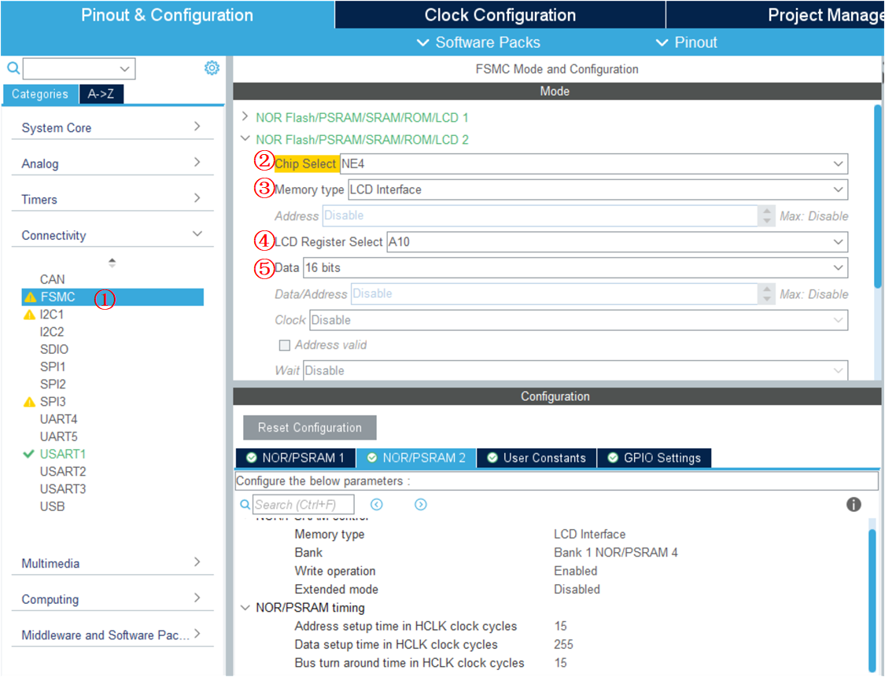

<!-- more -->

这一节的笔记主要是LCD显示相关，不关注触摸屏相关引脚。

## 一、硬件原理图

### 1. 正点原子2.8寸LCD模块


上图是正点原子的2.8寸LCD模块的原理图，说真的，没看懂，不明白为什么模块原理图上跳过了D8和D9两根线，并且标号对应的时候要D0对应DB1这样子。这个图给我看自闭了，反正是没看懂，而且教程也没见说为什么这样。索性不看了，目前就看几个关键的引脚，这几个关键的引脚标号对就行：

| 类型     | STM32引脚    | LCD引脚 | ILI9341 | 说明                               |
| -------- | ------------ | ------- | ------- | ---------------------------------- |
| 8080总线 | FSMC_NE4     | LCD_CS  | CSX     | PG12，LCD片选信号                  |
| 8080总线 | FSMC_NOE     | LCD_RD  | RDX     | PD4，读使能信号                    |
| 8080总线 | FSMC_NEW     | LCD_WR  | WRX     | PD5，写使能信号                    |
| 8080总线 | FSMC_A10     | LCD_RS  | D/CX    | PG0，命令/数据切换信号             |
| 8080总线 | FSMC_D[15:0] | ---     | ---     | 16位双向数据线                     |
| 复位     | NRST         | LCD_RST | ---     | 硬件复位信号                       |
| 背光     | GPIO_A0      | LCD_BL  | ---     | 背光控制（高电平点亮，低电平熄灭） |

额，去看了一眼ILI9341的接口模式，突然发现原来还有另一种8080时序，用的数据线是D[17:10]和D[8:1]，这就跟正点原子的屏幕对应起来了，绝了。


### 2. 韦东山LCD屏模块

下边是韦东山的开发板的LCD模块相关原理图，作为参考吧，最后驱动还是用的正点原子的屏幕。

- LCD底板原理图


- LCD模块原理图


## 二、STM32CubeMX配置

### 1. FSMC配置



这里跟FSMC驱动SRAM的配置界面在同一个位置，我们这里按照上图配置即可。这里主要关注②、③、④和⑤的配置，关于模式和时间配置可以看下一个小节的笔记，会专门分析。

### 2. LCD背光引脚配置

背光就是一个普通的GPIO引脚，根据硬件电路图，背光引脚高电平将会点亮屏幕，低电平将会熄灭屏幕：


### 3. 时钟树配置


### 4. FSMC时序参数配置

#### 4.1 ILI9341时序参数图

注意这里我们看8080的第二种模式的时序图，因为前边看硬件原理图的话，发现使用的是8080-II模式，我们看一下[01ILI9341_DS.pdf](https://gitee.com/docs-site/scm-reference-guide/raw/master/10-%E6%98%BE%E7%A4%BA%E5%B1%8F%E5%8F%82%E8%80%83%E8%B5%84%E6%96%99/TFTLCD%E5%8F%82%E8%80%83%E8%B5%84%E6%96%99/01ILI9341_DS.pdf)的18.3.2 Display Parallel 18/16/9/8-bit Interface Timing Characteristics(8080-Ⅱ system) ：


我们再来看一下ILI9341时序参数的要求：


ILI9341 时序参数说明及要求可大致得知 ILI9341 的写周期为最小 twc = 66ns，而读周期最小为 trdl+trod=45+20=65ns。（对于读周期表中有参数要一个要求为 trcfm 和 trc 分别为 450ns 及 160ns，但经过测试并不需要遵照它们的指标要求）  

结合 ILI9341 的时序要求和 FSMC 的配置图，代码中按照读写时序周期均要求至少 66ns 来计算，配置结果为 ADDSET = 1 及 DATST = 4，把时间单位 1/72 微秒 (即 1000/72 纳秒) 代入，因此读写周期的时间被配置为  

```c
读周期： trc =((ADDSET+1)+(DATST+1)+2) *1000/72 = ((1+1)+(4+1)+2)*1000/72 = 125ns
写周期： twc =((ADDSET+1)+(DATST+1)) *1000/72 = ((1+1)+(4+1))*1000/72 = 97ns
```

所以把这两个参数值写入到 FSMC 后，它控制的读写周期都比 ILI9341 的最低要求值大。（经测试，这两个参数值也可以适当减小）  

#### 4.2 参数的确定

其实到这里我就没有去计算了，直接用的教程里边的了，这里开起了扩展模式，因为读写时序似乎有些不一样：


## 三、LCD基本驱动实现

### 1. 相关定义

#### 1.1 D/C地址确定

D/CX输出**高电平的地址，即可控制表示数据**， 输出**低电平的地址，即可控制表示命令**。  

##### 1.1.1 结构体偏移方式

我们前边知道TFTLCD 的 D/C 接在 FSMC的 A10 上面， CS 接在 FSMC_NE4 上，并且是 16 位数据总线。 即我们使用的是 FSMC 存储器1 的第 4 区，我们定义如下 LCD 操作结构体： 

```c
// LCD地址结构体
typedef struct
{
    __IO uint16_t ILI9341_CMD_Addr;
    __IO uint16_t ILI9341_DATA_Addr;
} LCD_TypeDef;

//使用NOR/SRAM的 Bank1.sector4,地址位HADDR[27,26]=11 A10作为数据命令区分线 注意设置时STM32内部会右移一位对齐!
#define LCD_FSMC_ADDR_BASE        ((uint32_t)(0x6C000000 | 0x000007FE))
#define LCD                      ((LCD_TypeDef *) LCD_FSMC_ADDR_BASE)
```

（1）FSMC的基地址，这个取决于我们的 LCD_CS接在FSMC_NEx的哪一个线上，这里接在FSMC_NE4，所以起始地址就是0x6c00 0000啦。


（2）LCD_FSMC_ADDR_BASE ：这个是我们LCD数据/命令控制的地址，前边其实已经介绍过计算方法了，这里接在A10上边，所以，如上边结构体，地址 0X6C00 0000 开始，而 0X0000 07FE，则是 A10 的偏移量。 我们将这个地址强制转换为LCD_TypeDef 结构体地址，那么可以得到 LCD&rarr;ILI9341_CMD_Addr 的地址就是 0X6C00 07FE，对应A10 的状态为 0(即 D/C=0)，而 LCD&rarr;ILI9341_DATA_Addr的地址就是 0X6C00 0800（结构体地址自增），对应 A10 的状态为 1（即 D/C=1）。    

（3）这个7FE怎么来的？我猜测是这样算的，首先，我们需要确定地址自增2个字节后，可以实现指定位的0和1的切换，这样的话，显然从0到1的状态是很好找的，因为只要向指定的位进1就可以啦，所以我们找一个第11位为1的地址，就最简单的 0X6C00 0800，那么第11位为0的地址，那这一位减去1不就是了嘛，由于我们定义的结构体成员都是16位的，我们可以减去2，这样更加符合编程习惯。例如，我肯要是定义结构体的地址为“ LCD_TypeDef”的地址为“ 0x6D000000-2”，则成员“ ILI9341_CMD_Addr”地址为“ 0x6D000000-2”，成员“ ILI9341_DATA_Addr”的地址为“ 0x6D000000”，以后访问这两个地址，也是一样的效果，也就可以分别发送命令、数据内容 。

（4）其实上边有一些没有看懂，上边的结构体成员为什么是定义成16位的，按理来说，我们使用的地址格式是32位的，后边看懂了，搞明白为什么了再补充吧。

##### 1.1.2 直接定义

其实吧，上边的结构体定义的方式不是很好找，至少我反正不可能一下子找到刚刚好经过地址递增就能实现指定位的0和1的切换，为什么要那么麻烦呢？我直接定义不行吗？当然可以啦，毕竟只要0X6C00 0000~0X6FFF FFFF 内的任意地址都是可以的，保证11位是0或者1就行啦。

要使 FSMC_A10 地址线为高电平，实质是访问内部 HADDR 地址的第 (10+1) 位为 1 即可，使用 0X6C00 0000~0X6FFF FFFF 内的任意地址，作如下运算：  

```c
使 FSMC_A10 地址线为高电平： 0X6C00 0000 | (1 << (10+1))
```

要使 FSMC_A10 地址线为低电平，实质是访问内部 HADDR 地址的第 (16+1) 位为 0 即可，使用 0X6C00 0000~0X6FFF FFFF 内的任意地址，作如下运算：  

```c
使 FSMC_A16 地址线为低电平： 0X6C00 0000 &(~ (1<<(10+1))) 
```

所以后边我都定义成如下宏：

```c
/******************************* ILI9341 显示屏的 FSMC 参数定义 ***************************/
//FSMC_Bank1_NORSRAM用于LCD命令操作的地址
#define FSMC_Addr_ILI9341_CMD  ( ( uint32_t )(0X6C000000))

//FSMC_Bank1_NORSRAM用于LCD数据操作的地址      
#define FSMC_Addr_ILI9341_DATA ( ( uint32_t )(0X6C000800))
```


【注意】其实吧，通过这种方式计算得来的地址，并不是所有的地址都能用，不能用的时候注意换一个试一下，我测了一下对于这里使用A10的话，最低的4个位不能是奇数，可能是存在一个对齐问题吧。

#### 1.2 颜色定义

```c
#define WHITE           0xFFFF
#define BLACK           0x0000
#define BLUE            0x001F
#define BRED            0XF81F
#define GRED            0XFFE0
#define GBLUE           0X07FF
#define RED             0xF800
#define MAGENTA         0xF81F
#define GREEN           0x07E0
#define CYAN            0x7FFF
#define YELLOW          0xFFE0
#define BROWN           0XBC40  //棕色
#define BRRED           0XFC07  //棕红色
#define GRAY            0X8430  //灰色
```

我们使用的是RGB565，颜色为16位。

#### 1.3 LCD参数结构体

为了管理LCD的各项参数，我们定一个了一个结构体来配置一些全局参数，作何用途，后边实例会有。

```c
typedef struct
{
    uint16_t id;           // LCD ID
    uint8_t LCD_SCAN_MODE; // LCD 扫描模式，参数可选值为0-7
    uint16_t LCD_X_LENGTH; // LCD X方向长度
    uint16_t LCD_Y_LENGTH; // LCD Y方向长度
    uint16_t PonitColor;   // LCD 画笔颜色，就是前景色
    uint16_t BackColor;    // LCD 背景颜色
} _lcd_dev;

```


### 2. FSMC初始化

```c
SRAM_HandleTypeDef hsram2;

/* FSMC initialization function */
void MX_FSMC_Init(void)
{
  FSMC_NORSRAM_TimingTypeDef Timing = {0};
  FSMC_NORSRAM_TimingTypeDef ExtTiming = {0};
  /** Perform the SRAM2 memory initialization sequence
  */
  hsram2.Instance = FSMC_NORSRAM_DEVICE;
  hsram2.Extended = FSMC_NORSRAM_EXTENDED_DEVICE;
  /* hsram2.Init */
  hsram2.Init.NSBank = FSMC_NORSRAM_BANK4;
  hsram2.Init.DataAddressMux = FSMC_DATA_ADDRESS_MUX_DISABLE;
  hsram2.Init.MemoryType = FSMC_MEMORY_TYPE_SRAM;
  hsram2.Init.MemoryDataWidth = FSMC_NORSRAM_MEM_BUS_WIDTH_16;
  hsram2.Init.BurstAccessMode = FSMC_BURST_ACCESS_MODE_DISABLE;
  hsram2.Init.WaitSignalPolarity = FSMC_WAIT_SIGNAL_POLARITY_LOW;
  hsram2.Init.WrapMode = FSMC_WRAP_MODE_DISABLE;
  hsram2.Init.WaitSignalActive = FSMC_WAIT_TIMING_BEFORE_WS;
  hsram2.Init.WriteOperation = FSMC_WRITE_OPERATION_ENABLE;
  hsram2.Init.WaitSignal = FSMC_WAIT_SIGNAL_DISABLE;
  hsram2.Init.ExtendedMode = FSMC_EXTENDED_MODE_ENABLE;
  hsram2.Init.AsynchronousWait = FSMC_ASYNCHRONOUS_WAIT_DISABLE;
  hsram2.Init.WriteBurst = FSMC_WRITE_BURST_DISABLE;
  /* Timing */
  Timing.AddressSetupTime = 0x06;
  Timing.AddressHoldTime = 15;
  Timing.DataSetupTime = 26;
  Timing.BusTurnAroundDuration = 15;
  Timing.CLKDivision = 16;
  Timing.DataLatency = 17;
  Timing.AccessMode = FSMC_ACCESS_MODE_A;
  /* ExtTiming */
  ExtTiming.AddressSetupTime = 3;
  ExtTiming.AddressHoldTime = 15;
  ExtTiming.DataSetupTime = 0x06;
  ExtTiming.BusTurnAroundDuration = 15;
  ExtTiming.CLKDivision = 16;
  ExtTiming.DataLatency = 17;
  ExtTiming.AccessMode = FSMC_ACCESS_MODE_A;

  if (HAL_SRAM_Init(&hsram2, &Timing, &ExtTiming) != HAL_OK)
  {
    Error_Handler( );
  }
  __HAL_AFIO_FSMCNADV_DISCONNECTED();
}
```

我是再FSMC驱动SRAM的工程中添加的LCD，所以这里命名的时候是hsram2，具体的成员赋值这里就不写了，跟前边其实都差不多。

### 3. GPIO初始化

这里应该有FSMC所使用的所有引脚的初始化，但是由于是STM32CubeMX生成的，所以这里就不详细写了，写一下背光的初始化代码吧：

```c
void MX_GPIO_Init(void)
{

  GPIO_InitTypeDef GPIO_InitStruct = {0};
  /* GPIO Ports Clock Enable */
  __HAL_RCC_GPIOB_CLK_ENABLE();
  /*Configure GPIO pin Output Level */
  HAL_GPIO_WritePin(GPIOB, GPIO_PIN_0, GPIO_PIN_SET);
  /*Configure GPIO pins : PB0 PB5 */
  GPIO_InitStruct.Pin = GPIO_PIN_0;
  GPIO_InitStruct.Mode = GPIO_MODE_OUTPUT_PP;
  GPIO_InitStruct.Pull = GPIO_PULLUP;
  GPIO_InitStruct.Speed = GPIO_SPEED_FREQ_HIGH;
  HAL_GPIO_Init(GPIOB, &GPIO_InitStruct);
}
```

### 4. 读写函数实现

#### 4.1 向ILI9341写入命令

```c
/**
  * @brief  向ILI9341写入命令
  * @param  usCmd :要写入的命令（寄存器地址）
  * @retval 无
  */
void ILI9341_Write_Cmd(uint16_t usCmd)
{
    * (__IO uint16_t *) (FSMC_Addr_ILI9341_CMD) = usCmd;
}
```

**【函数说明】**向ILI9341写入命令。

**【参数说明】**

- usCmd ：要写入的命令（寄存器地址）。

#### 4.2 向ILI9341写入数据

```c
/**
  * @brief  向ILI9341写入数据
  * @param  usData :要写入的数据
  * @retval 无
  */	
 void ILI9341_Write_Data (uint16_t usData)
{
	* ( __IO uint16_t * ) (FSMC_Addr_ILI9341_DATA) = usData;
}
```

**【函数说明】**向ILI9341写入数据。

**【参数说明】**

- usData ：要写入的数据。

#### 4.3 从ILI9341读取数据

```c
/**
  * @brief  从ILI9341读取数据
  * @param  无
  * @retval 读取到的数据
  */	
uint16_t ILI9341_Read_Data (void)
{
	return ( * (__IO uint16_t *) (FSMC_Addr_ILI9341_DATA) );
}
```

**【函数说明】**向ILI9341写入命令。

**【参数说明】**

#### 4.4 读取ILI9341 ID

我们来看一下0xD3命令，[01ILI9341_DS.pdf](https://gitee.com/docs-site/scm-reference-guide/raw/master/10-%E6%98%BE%E7%A4%BA%E5%B1%8F%E5%8F%82%E8%80%83%E8%B5%84%E6%96%99/TFTLCD%E5%8F%82%E8%80%83%E8%B5%84%E6%96%99/01ILI9341_DS.pdf)的8.3.23. Read ID4 (D3h) ：


可以看到，我们向ILI9341写入0xD3命令后，ILI9341会返回4个字节数据，其中第三和第四字节的数据组合起来就是ILI9341的ID，所以读取ID的函数实现下：

```c
void ILI9341_ID_Read(void)
{
	uint16_t id = 0;
	// 显示一下LCD的命令和数据地址
	printf("FSMC_Addr_ILI9341_CMD :0x%X\r\n", FSMC_Addr_ILI9341_CMD);
	printf("FSMC_Addr_ILI9341_DATA:0x%X\r\n", FSMC_Addr_ILI9341_DATA);

	ILI9341_Write_Cmd(0xD3);
	id = ILI9341_Read_Data();// dummy read
	id = ILI9341_Read_Data();// 读到0X00
	id = ILI9341_Read_Data();// 读取0X93
	id <<= 8;
	id |= ILI9341_Read_Data();// 读取0X41
	printf("id:%#x\r\n", id);
}
```

最后串口调试助手的打印信息如下：

```c
FSMC_Addr_ILI9341_CMD :0x6C000002
FSMC_Addr_ILI9341_DATA:0x6C000800
id:0x9341
```

#### 4.5 \_\_IO问题

上边读写函数中的\_\_IO是什么？我们追踪一下会发现它其实就是：

```c
#define     __IO    volatile             /*!< Defines 'read / write' permissions */
```

volatile关键字会提醒编译器，它后面所定义的变量随时都有可能改变，因此编译后的程序每次需要存储或读取这个变量的时候，告诉编译器对该变量不做优化，都会**直接从变量内存地址中读取数据**，从而可以提供对特殊地址的稳定访问。

如果没有volatile关键字，则编译器可能优化读取和存储，可能暂时使用寄存器中的值，如果这个变量由别的程序更新了的话，将出现不一致的现象。（简单的说就是：volatile关键词影响编译器编译的结果，用volatile声明的变量表示该变量随时可能发生变化，与该变量有关的运算，不要进行编译优化，以免出错）。

这个地方就可以做一个测试，我们将上边实现的三个函数的 \_\_IO修饰去掉，然后重新读取ID，会发现串口调试助手打印信息为：

```c
FSMC_Addr_ILI9341_CMD :0x6C000002
FSMC_Addr_ILI9341_DATA:0x6C000800
id:0
```

我们刚才可以读取到正确ID的函数读不到数据了，这是为什么？我们分析一下，我们向0x6C000002这个地址写入了一次数据，此时可以触发一次FSMC的数据传输，然后，我们从0x6C000800读取数据，读取的数据被存入寄存器（R1-R15这一类），触发一次FSMC时序，然后我们再读取的时候，还是读的0x6C000800这个地址，这个时候STM32可能直接就从寄存器取了数据，并没有直接从0x6C000800这个地址获取数据，所以就可能出现读取失败的情况，这个猜测没有经过实际验证，不过大概分析一下，理论上应该属这样的。

所以从这个来看，我们想要直接从内存中获取某个变量的数据的话，最好就是加上volatile关键字，以避免不必要的麻烦。

## 四、LCD寄存器配置

上边我们已经完成了对LCD的一个简单的初始化，不出意外的话，上边那些完成后，我们已经可以成功点亮LCD屏幕了，接下来就是对ILI9341的一些配置了。下边所谓的一些寄存器，我在手册没有看懂啊寄存器的相关介绍，但是吧，我感觉其实就是手册上介绍的命令，在内部的存在形式其实应该就是寄存器。

读写LCD的控制器 ILI9341 的寄存器，其实就是通过一系列的命令对ILI9341进行配置，这个时候需要根据ILI9488手册介绍的命令，依次进行配置。但ILI9341命令众多，依次配置效率不高，通常开发中， LCD 屏幕厂商会提供初始化参考代码， 用户直接使用即可。  有一些配置项，需要在初始化完成后就进行配置，一般厂家会直接给，有一些命令是我们操作液晶屏时必须得，这一节笔记涉及的命令在 [01ILI9341_DS.pdf](https://gitee.com/docs-site/scm-reference-guide/raw/master/10-%E6%98%BE%E7%A4%BA%E5%B1%8F%E5%8F%82%E8%80%83%E8%B5%84%E6%96%99/TFTLCD%E5%8F%82%E8%80%83%E8%B5%84%E6%96%99/01ILI9341_DS.pdf) 的 8. Command 一节都有很详细的介绍。下边将会介绍一些我们需要了解的一些命令。

### 1. 屏幕开窗

根据液晶屏的要求，在发送显示数据前，需要先设置显示窗口确定后面发送的像素数据的显示区域，也就是开窗。

#### 1.1 Column Address Set (2Ah) 

我们可以查看[01ILI9341_DS.pdf](https://gitee.com/docs-site/scm-reference-guide/raw/master/10-%E6%98%BE%E7%A4%BA%E5%B1%8F%E5%8F%82%E8%80%83%E8%B5%84%E6%96%99/TFTLCD%E5%8F%82%E8%80%83%E8%B5%84%E6%96%99/01ILI9341_DS.pdf)的8.2.20. Column Address Set (2Ah)一节，命令的格式如下：


2Ah命令设置的列的地址，SC[15:0]表示列地址的起始位置，EC[15:0]表示列地址的结束位置：


我们需要发送四个字节的数据，前两个字节表示列地址的起始位置，后两个字节表示列地址的结束为止。

#### 1.2 Page Address Set (2Bh)

我们可以查看[01ILI9341_DS.pdf](https://gitee.com/docs-site/scm-reference-guide/raw/master/10-%E6%98%BE%E7%A4%BA%E5%B1%8F%E5%8F%82%E8%80%83%E8%B5%84%E6%96%99/TFTLCD%E5%8F%82%E8%80%83%E8%B5%84%E6%96%99/01ILI9341_DS.pdf)的8.2.21. Page Address Set (2Bh)一节，命令格式如下：


2Bh命令设置的是行的地址，SP[15:0]表示行地址的起始位置，EP[15:0]表示行地址的结束位置：


#### 1.3 开窗函数实现

上边两个命令就可以确定一个矩形窗口了，这个窗口我们就可以用于显示数据：


```c
/**
 * @brief  在ILI9341显示器上开辟一个窗口
 * @param  usX ：在特定扫描方向下窗口的起点X坐标
 * @param  usY ：在特定扫描方向下窗口的起点Y坐标
 * @param  usWidth ：窗口的宽度
 * @param  usHeight ：窗口的高度
 * @retval 无
 */
void ILI9341_OpenWindow(uint16_t usX, uint16_t usY, uint16_t usWidth, uint16_t usHeight)
{
    ILI9341_Write_Cmd(0x2A);        /* 设置X坐标 */
    ILI9341_Write_Data(usX >> 8);   /* 起始点的高8位 */
    ILI9341_Write_Data(usX & 0xff); /* 起始点的低8位 */
    ILI9341_Write_Data((usX + usWidth - 1) >> 8);  /* 结束点的高8位 */
    ILI9341_Write_Data((usX + usWidth - 1) & 0xff);/* 结束点的低8位 */

    ILI9341_Write_Cmd(0x2B);        /* 设置Y坐标 */
    ILI9341_Write_Data(usY >> 8);
    ILI9341_Write_Data(usY & 0xff);
    ILI9341_Write_Data((usY + usHeight - 1) >> 8);
    ILI9341_Write_Data((usY + usHeight - 1) & 0xff);
}
```

### 2. 设置像素格式

#### 2.1 COLMOD: Pixel Format Set (3Ah)

我们可以查看[01ILI9341_DS.pdf](https://gitee.com/docs-site/scm-reference-guide/raw/master/10-%E6%98%BE%E7%A4%BA%E5%B1%8F%E5%8F%82%E8%80%83%E8%B5%84%E6%96%99/TFTLCD%E5%8F%82%E8%80%83%E8%B5%84%E6%96%99/01ILI9341_DS.pdf)的8.2.33. COLMOD: Pixel Format Set (3Ah)一节，命令格式如下：


我们可以看到我们发送了3Ah命令后，需要发送一个参数，这个参数是用于设置像素格式，像素格式由DPI[2:0]和DBI[2:0]决定，它们的取值如下表：


我们使用的屏幕是一般是16位的，我们一般会设置成RGB565格式，所以这里我们需要配置DPI[2:0]为101，DBI[2:0]为101，配合其他的位，我们要发送的数据就是0x55。

#### 2.2 函数实现

```c
ILI9341_Write_Cmd(0x3A);
ILI9341_Write_Data(0x55);
```

### 3. 发送像素数据  

调用上面的 ILI9341_OpenWindow 函数设置显示窗口后，再向液晶屏发送像素数据时，这些数据就会直接显示在它设定的窗口位置中。  

#### 3.1 Memory Write (2Ch)

我们可以查看[01ILI9341_DS.pdf](https://gitee.com/docs-site/scm-reference-guide/raw/master/10-%E6%98%BE%E7%A4%BA%E5%B1%8F%E5%8F%82%E8%80%83%E8%B5%84%E6%96%99/TFTLCD%E5%8F%82%E8%80%83%E8%B5%84%E6%96%99/01ILI9341_DS.pdf)的8.2.22. Memory Write (2Ch) 一节，命令格式如下：


发送像素数据的命令很简单，首先发送命令代码 0x2C，然后后面紧跟着要传输的像素数据即可。按照我使用的液晶屏的配置，像素点的格式为 RGB565，所以像素数据就是要显示的 RGB565 格式的颜色值。  

#### 3.2 函数实现

```c
/**
 * @brief  在ILI9341显示器上以某一颜色填充像素点
 * @param  ulAmout_Point ：要填充颜色的像素点的总数目
 * @param  usColor ：颜色
 * @retval 无
 */
static __inline void ILI9341_FillColor(uint32_t ulAmout_Point, uint16_t usColor)
{
    uint32_t i = 0;

    /* memory write */
    ILI9341_Write_Cmd(0x2C);

    for (i = 0; i < ulAmout_Point; i++)
    {
        ILI9341_Write_Data(usColor);
    }
}
```

### 4. 电源模式

其实有了上边三条命令之后，我们就可以画出一个实心的矩形了，但是后来经过测试，没有效果，发现原来是ILI9341默认是休眠模式，我们需要让它退出休眠模式才可以。

#### 4.1 模式状态读取

##### 4.1.1 Read Display Power Mode (0Ah) 

我们可以查看[01ILI9341_DS.pdf](https://gitee.com/docs-site/scm-reference-guide/raw/master/10-%E6%98%BE%E7%A4%BA%E5%B1%8F%E5%8F%82%E8%80%83%E8%B5%84%E6%96%99/TFTLCD%E5%8F%82%E8%80%83%E8%B5%84%E6%96%99/01ILI9341_DS.pdf)的8.2.5. Read Display Power Mode (0Ah)一节，命令格式如下：


这个命令可以用于读取LCD显示屏当前显示状态，如下表所示：


我们可以关注一下D2和D4，一个表示是否开启了显示，一个表示是否处于休眠模式。

##### 4.1.2 函数实现

我们可以下一个函数用于读取各个状态，来看一下最开始的时候LCD显示屏是什么样的：

```c
/**
  * @brief  读取LCD电源状态
  * @note   
  * @param  
  * @retval 读取到的状态
  */
uint16_t ILI9341_PowerStatus_Read(void)
{
    uint16_t power_status = 0;

    ILI9341_Write_Cmd(0x0A);
    power_status = ILI9341_Read_Data(); // dummy read
    power_status = ILI9341_Read_Data(); // 读到0X00

    printf("power_status:0x%X\r\n", power_status);
    return power_status;
}
```

##### 4.1.3 效果测试

我们写一个测试函数，来看一下状态：

```c
void LCD_Test(void)
{
    ILI9341_PowerStatus_Read();
}
```

然后我们烧写写到单片机，会有如下打印：

```shell
power_status:0x8
```

我们换算成二进制就是 0000 1000，除了D[3]为1，其余为0，D[2]表示显示的开关，为0表示目前处于关闭显示状态，D[4]表示休眠模式，为0表示正在休眠模式。所以我们知道，一上电，还未对这个LCD模块做任何配置的情况下，是出于休眠模式和关闭显示状态的，经过后边的测试，得到一个结论，就是我们要想进行显示，需要退出休眠模式，打开显示。

#### 4.2 Sleep In/Out Mode

我们可以查看[01ILI9341_DS.pdf](https://gitee.com/docs-site/scm-reference-guide/raw/master/10-%E6%98%BE%E7%A4%BA%E5%B1%8F%E5%8F%82%E8%80%83%E8%B5%84%E6%96%99/TFTLCD%E5%8F%82%E8%80%83%E8%B5%84%E6%96%99/01ILI9341_DS.pdf)的8.2.11. Enter Sleep Mode (10h)和8.2.12. Sleep Out (11h) 两节，命令格式如下：


我们看到，这两个命令是没有参数返回的，我们只需要下发对应的命令即可。我们发送10h命令，lcd就会进入休眠模式，发送11h，就会退出休眠模式。

当模块已进入非休眠模式时，命令11h无效。需要注意的是在发送下一个命令（10h或者11h）之前需要等待5ms，这是为了让电源电压和时钟电路稳定，显示模块会在这5毫秒内进行自诊断功能。这里好像有一个时间要求，一开始若是处于Sleep Out模式，然后发送Sleep In命令进入休眠模式，然后需要等待120msec才能再次发送Sleep Out命令。

#### 4.3 Display ON/OFF

我们可以查看[01ILI9341_DS.pdf](https://gitee.com/docs-site/scm-reference-guide/raw/master/10-%E6%98%BE%E7%A4%BA%E5%B1%8F%E5%8F%82%E8%80%83%E8%B5%84%E6%96%99/TFTLCD%E5%8F%82%E8%80%83%E8%B5%84%E6%96%99/01ILI9341_DS.pdf)的8.2.18. Display OFF (28h)和8.2.19. Display ON (29h) 两节，命令格式如下：


28h命令用于进入DISPLAY OFF模式。在这种模式下，帧内存的输出被禁用并插入空白页。

29h命令用于从DISPLAY OFF模式中恢复。帧内存输出被启用。

#### 4.4 电源模式配置

有了上班的几条命令，我们在开机的时候需要配置LCD为Sleep Out Mode和Display ON：

```c
ILI9341_Write_Cmd(0x11);       // Exit Sleep
HAL_Delay(120);
ILI9341_Write_Cmd(0x29);       // display on
```

我们可以修改测试函数如下：

```c
void LCD_Test(void)
{
    ILI9341_ID_Read();
    ILI9341_PowerStatus_Read();

    ILI9341_Write_Cmd(0x11);       // Exit Sleep
    HAL_Delay(120);
    ILI9341_Write_Cmd(0x29);       // display on

    ILI9341_PowerStatus_Read();

}
```

最后串口打印信息如下：

```shell
FSMC_Addr_ILI9341_CMD :0x6C000000
FSMC_Addr_ILI9341_DATA:0x6C000800
id:0x9341
power_status:0x8
power_status:0x9C
```

0x9C就是1001 1100，0x8就是0000 1000可以看到我们执行了两条命令之后，状态从0000 1000变成了1001 1100，D[2]表表示显示开关，配置为1，D[4]表示休眠模式，配置为0表示退出休眠模式。

### 5. 设置液晶的扫描方向  

当设置了液晶显示窗口，再连续向液晶屏写入像素点时，它会一个点一个点地往液晶屏的 X 方向填充，填充完一行 X 方向的像素点后，向 Y 方向下移一行， X 坐标回到起始位置，再往 X 方向一个点一个点地填充，如此循环直至填充完整个显示窗口。屏幕的坐标原点和 XY 方向都可以根据实际需要使用相应的命令来配置的。

#### 5.1 Memory Access Control (36h)

##### 5.1.1 命令格式

我们可以查看[01ILI9341_DS.pdf](https://gitee.com/docs-site/scm-reference-guide/raw/master/10-%E6%98%BE%E7%A4%BA%E5%B1%8F%E5%8F%82%E8%80%83%E8%B5%84%E6%96%99/TFTLCD%E5%8F%82%E8%80%83%E8%B5%84%E6%96%99/01ILI9341_DS.pdf)的8.2.29. Memory Access Control (36h)一节，命令格式如下：


Memory Access Control命令参数的Bit[7:5]三位一起控制内存的读写方向。 MY（ Bit[7]） 控制行地址顺序，MX（ Bit[6]）控制列地址顺序， MV（ Bit[5]）控制行列交换 。


0X36 命令参数中的 MY、 MX、 MV 这三个数据位用于配置扫描方向，因此一共有 2^3 = 8 种模式。其实这个ILI9341控制的液晶屏是240列，320行的，也就是说其实正常来看是按一个竖屏来的。

##### 5.1.2 MH(Horizontal Refresh ORDER)

MH位控制的就是LCD水平刷新方向。左上角位坐标（0，0）的话，水平方向有240列，当MH为0 的时候是从左到右刷新，当MH为1的时候是从右到左刷新。


##### 5.1.3 ML(Vertical Refresh Order)

ML位控制的就是LCD垂直刷新方向。左上角位坐标（0，0）的话，垂直方向有320行，当ML为 0 的时候是从上到下刷新，当ML为1的时候从下到上刷新。


##### 5.1.4 MY、MX和MV

这三个位控制着液晶屏的扫描方向，这个表在上一节已经学习过了：

| B[7:5] | D[7:5] |  MY  |  MX  |  MV  | D[7:5]十进制 |       模式说明        |                           图片对应                           |
| :----: | :----: | :--: | :--: | :--: | :----------: | :-------------------: | :----------------------------------------------------------: |
|  000   |  000   |  0   |  0   |  0   |      0       |        Normal         |  |
|  001   |  001   |  0   |  0   |  1   |      1       |     X-Y Exchange      |  |
|  010   |  010   |  0   |  1   |  0   |      2       |       X-Mirror        |  |
|  011   |  011   |  0   |  1   |  1   |      3       | XY Exchange X-Mirror  |  |
|  100   |  100   |  1   |  0   |  0   |      4       |       Y-Mirror        |  |
|  101   |  101   |  1   |  0   |  1   |      5       | X-Y Exchange Y-Mirror |  |
|  110   |  110   |  1   |  1   |  0   |      6       |      X/Y-Mirror       |  |
|  111   |  111   |  1   |  1   |  1   |      7       | XY Exchange XY-Mirror |  |

其中0、3、5、6 模式适合从左至右显示文字，不推荐使用其它模式显示文字  其它模式显示文字会有镜像效果    其中0、2、4、6 模式的X方向像素为240，Y方向像素为320，其中1、3、5、7 模式下X方向像素为320，Y方向像素为240。分成这两类主要是按是否交换XY来的：


#### 5.2 Read Display MADCTL (0Bh) 

上边其实我们看到36h命令配置的是MADCTL这个寄存器，算是一个寄存器把，我们可以通过0Bh来读取当前显示屏的扫描方向相关信息。在[01ILI9341_DS.pdf](https://gitee.com/docs-site/scm-reference-guide/raw/master/10-%E6%98%BE%E7%A4%BA%E5%B1%8F%E5%8F%82%E8%80%83%E8%B5%84%E6%96%99/TFTLCD%E5%8F%82%E8%80%83%E8%B5%84%E6%96%99/01ILI9341_DS.pdf) 的 8.2.6. Read Display MADCTL (0Bh) 一节，命令格式如下：


相关的位说明如下：


#### 5.3 液晶扫描方向实现

```c
void ILI9341_GramScan(uint8_t ucOption)
{
    // 参数检查，只可输入0-7
    if (ucOption > 7)
    {
        return;
    }

    // 根据模式更新LCD_SCAN_MODE的值，主要用于触摸屏选择计算参数
    lcd_param.LCD_SCAN_MODE = ucOption;

    // 根据模式更新XY方向的像素宽度
    if (ucOption % 2 == 0)
    {
        // 0 2 4 6模式下X方向像素宽度为240，Y方向为320
        lcd_param.LCD_X_LENGTH = ILI9341_LESS_PIXEL;
        lcd_param.LCD_Y_LENGTH = ILI9341_MORE_PIXEL;
    }
    else
    {
        // 1 3 5 7模式下X方向像素宽度为320，Y方向为240
        lcd_param.LCD_X_LENGTH = ILI9341_MORE_PIXEL;
        lcd_param.LCD_Y_LENGTH = ILI9341_LESS_PIXEL;
    }

    // 0x36命令参数的高3位可用于设置GRAM扫描方向
    ILI9341_Write_Cmd(0x36);
    if (lcd_param.id == LCDID_ILI9341)
    {
        ILI9341_Write_Data(0x08 | (ucOption << 5)); // 根据ucOption的值设置LCD参数，共0-7种模式
    }
    else if (lcd_param.id == LCDID_ST7789V)
    {
        ILI9341_Write_Data(0x00 | (ucOption << 5)); // 根据ucOption的值设置LCD参数，共0-7种模式
    }
    ILI9341_Write_Cmd(0x2A);
    ILI9341_Write_Data(0x00);                             /* x 起始坐标高8位 */
    ILI9341_Write_Data(0x00);                             /* x 起始坐标低8位 */
    ILI9341_Write_Data(((lcd_param.LCD_X_LENGTH - 1) >> 8) & 0xFF); /* x 结束坐标高8位 */
    ILI9341_Write_Data((lcd_param.LCD_X_LENGTH - 1) & 0xFF);        /* x 结束坐标低8位 */

    ILI9341_Write_Cmd(0x2B);
    ILI9341_Write_Data(0x00);                             /* y 起始坐标高8位 */
    ILI9341_Write_Data(0x00);                             /* y 起始坐标低8位 */
    ILI9341_Write_Data(((lcd_param.LCD_Y_LENGTH - 1) >> 8) & 0xFF); /* y 结束坐标高8位 */
    ILI9341_Write_Data((lcd_param.LCD_Y_LENGTH - 1) & 0xFF);        /* y 结束坐标低8位 */

    /* write gram start */
    ILI9341_Write_Cmd(0x2C);
}
```

效果测试还是看后边吧。

### 6. ILI9341寄存器配置

这里贴一下完整的寄存器配置函数：

```c
/**
  * @brief  ILI9341寄存器配置
  * @note   
  * @param  
  * @retval 
  */
void ILI9341_Config(void)
{
    ILI9341_Write_Cmd(0xCF);
    ILI9341_Write_Data(0x00);
    ILI9341_Write_Data(0xC1);
    ILI9341_Write_Data(0X30);
    ILI9341_Write_Cmd(0xED);
    ILI9341_Write_Data(0x64);
    ILI9341_Write_Data(0x03);
    ILI9341_Write_Data(0X12);
    ILI9341_Write_Data(0X81);
    ILI9341_Write_Cmd(0xE8);
    ILI9341_Write_Data(0x85);
    ILI9341_Write_Data(0x10);
    ILI9341_Write_Data(0x7A);
    ILI9341_Write_Cmd(0xCB);
    ILI9341_Write_Data(0x39);
    ILI9341_Write_Data(0x2C);
    ILI9341_Write_Data(0x00);
    ILI9341_Write_Data(0x34);
    ILI9341_Write_Data(0x02);
    ILI9341_Write_Cmd(0xF7);
    ILI9341_Write_Data(0x20);
    ILI9341_Write_Cmd(0xEA);
    ILI9341_Write_Data(0x00);
    ILI9341_Write_Data(0x00);
    ILI9341_Write_Cmd(0xC0);  // Power control
    ILI9341_Write_Data(0x1B); // VRH[5:0]
    ILI9341_Write_Cmd(0xC1);  // Power control
    ILI9341_Write_Data(0x01); // SAP[2:0];BT[3:0]
    ILI9341_Write_Cmd(0xC5);  // VCM control
    ILI9341_Write_Data(0x30); // 3F
    ILI9341_Write_Data(0x30); // 3C
    ILI9341_Write_Cmd(0xC7);  // VCM control2
    ILI9341_Write_Data(0XB7);
    ILI9341_Write_Cmd(0x36); // Memory Access Control
    ILI9341_Write_Data(0x48);
    ILI9341_Write_Cmd(0x3A);
    ILI9341_Write_Data(0x55);
    ILI9341_Write_Cmd(0xB1);
    ILI9341_Write_Data(0x00);
    ILI9341_Write_Data(0x1A);
    ILI9341_Write_Cmd(0xB6); // Display Function Control
    ILI9341_Write_Data(0x0A);
    ILI9341_Write_Data(0xA2);
    ILI9341_Write_Cmd(0xF2); // 3Gamma Function Disable
    ILI9341_Write_Data(0x00);
    ILI9341_Write_Cmd(0x26); // Gamma curve selected
    ILI9341_Write_Data(0x01);
    ILI9341_Write_Cmd(0xE0); // Set Gamma
    ILI9341_Write_Data(0x0F);
    ILI9341_Write_Data(0x2A);
    ILI9341_Write_Data(0x28);
    ILI9341_Write_Data(0x08);
    ILI9341_Write_Data(0x0E);
    ILI9341_Write_Data(0x08);
    ILI9341_Write_Data(0x54);
    ILI9341_Write_Data(0XA9);
    ILI9341_Write_Data(0x43);
    ILI9341_Write_Data(0x0A);
    ILI9341_Write_Data(0x0F);
    ILI9341_Write_Data(0x00);
    ILI9341_Write_Data(0x00);
    ILI9341_Write_Data(0x00);
    ILI9341_Write_Data(0x00);
    ILI9341_Write_Cmd(0XE1); // Set Gamma
    ILI9341_Write_Data(0x00);
    ILI9341_Write_Data(0x15);
    ILI9341_Write_Data(0x17);
    ILI9341_Write_Data(0x07);
    ILI9341_Write_Data(0x11);
    ILI9341_Write_Data(0x06);
    ILI9341_Write_Data(0x2B);
    ILI9341_Write_Data(0x56);
    ILI9341_Write_Data(0x3C);
    ILI9341_Write_Data(0x05);
    ILI9341_Write_Data(0x10);
    ILI9341_Write_Data(0x0F);
    ILI9341_Write_Data(0x3F);
    ILI9341_Write_Data(0x3F);
    ILI9341_Write_Data(0x0F);
    ILI9341_Write_Cmd(0x2B);
    ILI9341_Write_Data(0x00);
    ILI9341_Write_Data(0x00);
    ILI9341_Write_Data(0x01);
    ILI9341_Write_Data(0x3f);
    ILI9341_Write_Cmd(0x2A);
    ILI9341_Write_Data(0x00);
    ILI9341_Write_Data(0x00);
    ILI9341_Write_Data(0x00);
    ILI9341_Write_Data(0xef);
    ILI9341_Write_Cmd(0x11); // Exit Sleep
    HAL_Delay(120);
    ILI9341_Write_Cmd(0x29); // display on

    ILI9341_Clear(0, 0, lcd_param.LCD_X_LENGTH, lcd_param.LCD_Y_LENGTH);	/* 清屏，显示全黑 */
		
}
```

### 7. 应用函数

这一部分开始，我们就开始实现，画点，画线，画矩形等一系列操作啦。

#### 7.1 基础函数

这里的函数都是后边画线等操作的基础。

##### 7.1.1 开窗

```c
/**
  * @brief  在ILI9341显示器上开辟一个窗口
  * @note   
  * @param  usX 在特定扫描方向下窗口的起点X坐标
  * @param  usY 在特定扫描方向下窗口的起点Y坐标
  * @param  usWidth 窗口的宽度
  * @param  usHeight 窗口的高度
  * @retval 
  */
void ILI9341_OpenWindow(uint16_t usX, uint16_t usY, uint16_t usWidth, uint16_t usHeight)
{
    ILI9341_Write_Cmd(0x2A);        /* 设置X坐标 */
    ILI9341_Write_Data(usX >> 8);   /* 起始点的高8位 */
    ILI9341_Write_Data(usX & 0xff); /* 起始点的低8位 */
    ILI9341_Write_Data((usX + usWidth - 1) >> 8);  /* 结束点的高8位 */
    ILI9341_Write_Data((usX + usWidth - 1) & 0xff);/* 结束点的低8位 */

    ILI9341_Write_Cmd(0x2B);        /* 设置Y坐标 */
    ILI9341_Write_Data(usY >> 8);
    ILI9341_Write_Data(usY & 0xff);
    ILI9341_Write_Data((usY + usHeight - 1) >> 8);
    ILI9341_Write_Data((usY + usHeight - 1) & 0xff);
}
```

##### 7.1.2 填充像素画图

```c
/**
   * @brief  在ILI9341显示器上以某一颜色填充像素点
   * @note   
   * @param  ulAmout_Point 要填充颜色的像素点的总数目
   * @param  usColor 颜色
   * @retval 
   */
static __inline void ILI9341_FillColor(uint32_t ulAmout_Point, uint16_t usColor)
{
    uint32_t i = 0;

    /* memory write */
    ILI9341_Write_Cmd(0x2C);

    for (i = 0; i < ulAmout_Point; i++)
    {
        ILI9341_Write_Data(usColor);
    }
}
```

##### 7.1.3 清屏

```c
/**
  * @brief  对ILI9341显示器的某一窗口以某种颜色进行清屏
  * @note   可使用LCD_SetBackColor、LCD_SetTextColor、LCD_SetColors函数设置颜色
  * @param  usX 在特定扫描方向下窗口的起点X坐标
  * @param  usY 在特定扫描方向下窗口的起点Y坐标
  * @param  usWidth 窗口的宽度
  * @param  usHeight 窗口的高度  
  * @retval 
  */
void ILI9341_Clear(uint16_t usX, uint16_t usY, uint16_t usWidth, uint16_t usHeight)
{
    ILI9341_OpenWindow(usX, usY, usWidth, usHeight);

    ILI9341_FillColor(usWidth * usHeight, lcd_param.BackColor);
}
```

##### 7.1.4 设置光标位置

```c
/**
  * @brief  设定ILI9341的光标坐标
  * @note   就是确定一个像素点的位置，方便后边画点
  * @param  usX 在特定扫描方向下光标的X坐标
  * @param  usY 在特定扫描方向下光标的Y坐标
  * @retval 
  */
static void ILI9341_SetCursor(uint16_t usX, uint16_t usY)
{
    ILI9341_OpenWindow(usX, usY, 1, 1);
}
```

设置光标位置其实就是设置我们要显示的像素点的位置，将前边的开窗函数的窗口缩小到1就可以啦，注意这个函数仅仅是设置了位置，并不可以直接画一个点出来。

##### 7.1.5 画一个点

我们都知道，点组成线，线组成面，所以画点是最基础的啦：

```c
/**
  * @brief  对ILI9341显示器的某一点以某种颜色进行填充
  * @note   画一个像素点，可使用LCD_SetBackColor、LCD_SetTextColor、LCD_SetColors函数设置颜色 
  * @param  usX 在特定扫描方向下该点的X坐标
  * @param  usY 在特定扫描方向下该点的Y坐标  
  * @retval 
  */
void ILI9341_SetPointPixel(uint16_t usX, uint16_t usY)
{
    if ((usX < lcd_param.LCD_X_LENGTH) && (usY < lcd_param.LCD_Y_LENGTH))
    {
        ILI9341_SetCursor(usX, usY);//设置像素点的位置

        ILI9341_FillColor(1, lcd_param.PonitColor);//以指定颜色画点
    }
}
```

#### 7.2 业务函数

主要就是利用上边的基础函数，实现画线、画圆等一系列的操作。

##### 7.2.1 画线

```c
/**
  * @brief  在 ILI9341 显示器上使用 Bresenham 算法画线段
  * @note   可使用LCD_SetBackColor、LCD_SetTextColor、LCD_SetColors函数设置颜色
  * @param  usX1 在特定扫描方向下线段的一个端点X坐标
  * @param  usY1 在特定扫描方向下线段的一个端点Y坐标
  * @param  usX2 在特定扫描方向下线段的另一个端点X坐标
  * @param  usY2 在特定扫描方向下线段的另一个端点Y坐标 
  * @retval 
  */
void LCD_DrawLine(uint16_t usX1, uint16_t usY1, uint16_t usX2, uint16_t usY2)
{
    uint16_t us;
    uint16_t usX_Current, usY_Current;

    int32_t lError_X = 0, lError_Y = 0, lDelta_X, lDelta_Y, lDistance;
    int32_t lIncrease_X, lIncrease_Y;

    lDelta_X = usX2 - usX1; // 计算坐标增量
    lDelta_Y = usY2 - usY1;

    usX_Current = usX1;
    usY_Current = usY1;

    if (lDelta_X > 0)
        lIncrease_X = 1; // 设置单步方向
    else if (lDelta_X == 0)
        lIncrease_X = 0; // 垂直线
    else
    {
        lIncrease_X = -1;
        lDelta_X = -lDelta_X;
    }

    if (lDelta_Y > 0)
        lIncrease_Y = 1;
    else if (lDelta_Y == 0)
        lIncrease_Y = 0; // 水平线
    else
    {
        lIncrease_Y = -1;
        lDelta_Y = -lDelta_Y;
    }

    if (lDelta_X > lDelta_Y)
        lDistance = lDelta_X; // 选取基本增量坐标轴
    else
        lDistance = lDelta_Y;
      
    for (us = 0; us <= lDistance + 1; us++) // 画线输出
    {
        ILI9341_SetPointPixel(usX_Current, usY_Current); // 画点

        lError_X += lDelta_X;
        lError_Y += lDelta_Y;

        if (lError_X > lDistance)
        {
          lError_X -= lDistance;
          usX_Current += lIncrease_X;
        }

        if (lError_Y > lDistance)
        {
          lError_Y -= lDistance;
          usY_Current += lIncrease_Y;
        }
    }
}
```

##### 7.2.2 画矩形

```c
/**
  * @brief  在 ILI9341 显示器上画一个矩形
  * @note   可使用LCD_SetBackColor、LCD_SetTextColor、LCD_SetColors函数设置颜色
  * @param  usX_Start 在特定扫描方向下矩形的起始点X坐标
  * @param  usY_Start 在特定扫描方向下矩形的起始点Y坐标
  * @param  usWidth 矩形的宽度（单位：像素）
  * @param  usHeight 矩形的高度（单位：像素）
  * @param  ucFilled 选择是否填充该矩形,该参数为以下值之一：
  *             @arg 0,空心矩形
  *             @arg 1,实心矩形
  * @retval 
  */
void LCD_DrawRectangle(uint16_t usX_Start, uint16_t usY_Start, uint16_t usWidth, uint16_t usHeight, uint8_t ucFilled)
{
    if (ucFilled)
    {
        ILI9341_OpenWindow(usX_Start, usY_Start, usWidth, usHeight);
        ILI9341_FillColor(usWidth * usHeight, lcd_param.BackColor);
    }
    else
    {
        LCD_DrawLine(usX_Start, usY_Start, usX_Start + usWidth - 1, usY_Start);
        LCD_DrawLine(usX_Start, usY_Start + usHeight - 1, usX_Start + usWidth - 1, usY_Start + usHeight - 1);
        LCD_DrawLine(usX_Start, usY_Start, usX_Start, usY_Start + usHeight - 1);
        LCD_DrawLine(usX_Start + usWidth - 1, usY_Start, usX_Start + usWidth - 1, usY_Start + usHeight - 1);
    }
}
```

##### 7.2.3 画圆

```c
/**
  * @brief  在 ILI9341 显示器上使用 Bresenham 算法画圆
  * @note   可使用LCD_SetBackColor、LCD_SetTextColor、LCD_SetColors函数设置颜色
  * @param  usX_Center ：在特定扫描方向下圆心的X坐标
  * @param  usY_Center ：在特定扫描方向下圆心的Y坐标
  * @param  usRadius：圆的半径（单位：像素）
  * @param  ucFilled ：选择是否填充该圆,该参数为以下值之一：
  *         @arg 0,空心圆
  *         @arg 1,实心圆 
  * @retval 
  */
void LCD_DrawCircle(uint16_t usX_Center, uint16_t usY_Center, uint16_t usRadius, uint8_t ucFilled)
{
    int16_t sCurrentX, sCurrentY;
    int16_t sError;

    sCurrentX = 0;
    sCurrentY = usRadius;

    sError = 3 - (usRadius << 1); // 判断下个点位置的标志

    while (sCurrentX <= sCurrentY)
    {
        int16_t sCountY;

        if (ucFilled)
          for (sCountY = sCurrentX; sCountY <= sCurrentY; sCountY++)
          {
            ILI9341_SetPointPixel(usX_Center + sCurrentX, usY_Center + sCountY); // 1，研究对象
            ILI9341_SetPointPixel(usX_Center - sCurrentX, usY_Center + sCountY); // 2
            ILI9341_SetPointPixel(usX_Center - sCountY, usY_Center + sCurrentX); // 3
            ILI9341_SetPointPixel(usX_Center - sCountY, usY_Center - sCurrentX); // 4
            ILI9341_SetPointPixel(usX_Center - sCurrentX, usY_Center - sCountY); // 5
            ILI9341_SetPointPixel(usX_Center + sCurrentX, usY_Center - sCountY); // 6
            ILI9341_SetPointPixel(usX_Center + sCountY, usY_Center - sCurrentX); // 7
            ILI9341_SetPointPixel(usX_Center + sCountY, usY_Center + sCurrentX); // 0
          }

        else
        {
          ILI9341_SetPointPixel(usX_Center + sCurrentX, usY_Center + sCurrentY); // 1，研究对象
          ILI9341_SetPointPixel(usX_Center - sCurrentX, usY_Center + sCurrentY); // 2
          ILI9341_SetPointPixel(usX_Center - sCurrentY, usY_Center + sCurrentX); // 3
          ILI9341_SetPointPixel(usX_Center - sCurrentY, usY_Center - sCurrentX); // 4
          ILI9341_SetPointPixel(usX_Center - sCurrentX, usY_Center - sCurrentY); // 5
          ILI9341_SetPointPixel(usX_Center + sCurrentX, usY_Center - sCurrentY); // 6
          ILI9341_SetPointPixel(usX_Center + sCurrentY, usY_Center - sCurrentX); // 7
          ILI9341_SetPointPixel(usX_Center + sCurrentY, usY_Center + sCurrentX); // 0
        }

        sCurrentX++;

        if (sError < 0)
          sError += 4 * sCurrentX + 6;

        else
        {
          sError += 10 + 4 * (sCurrentX - sCurrentY);
          sCurrentY--;
        }
    }
}
```

##### 7.2.4 设置LCD背景颜色

```c
/**
  * @brief  设置LCD的背景颜色,RGB565
  * @note   
  * @param  Color 指定背景颜色 
  * @retval 
  */
void LCD_SetBackColor(uint16_t Color)
{
    lcd_param.BackColor = Color;
}
```

##### 7.2.5 设置LCD画笔颜色

```c
/**
  * @brief  设置LCD的前景(字体)颜色,RGB565
  * @note   
  * @param  Color 指定前景(字体)颜色 
  * @retval 
  */
void LCD_SetTextColor(uint16_t Color)
{
    lcd_param.PonitColor = Color;
}
```

#### 7.3 测试函数

```c
void LCD_Test(void)
{
    // 读取id
    ILI9341_ID_Read();

    ILI9341_Config();
    ILI9341_GramScan(7);

    LCD_SetTextColor(RED);
    
    LCD_DrawLine(50,50,50,200);
    LCD_DrawLine(50,50,150,50);
    LCD_DrawLine(50,130,130,130);

    LCD_Fill_Draw_Rectangle(0, 0, 30, 40, BLUE);

}
```

### 8. 完整参考代码

算了，500多行，后边还会再增加，可以看这个仓库：[STM32F103-Prj: STM32学习使用 (gitee.com)](https://gitee.com/sumumm/stm32f103-prj)
